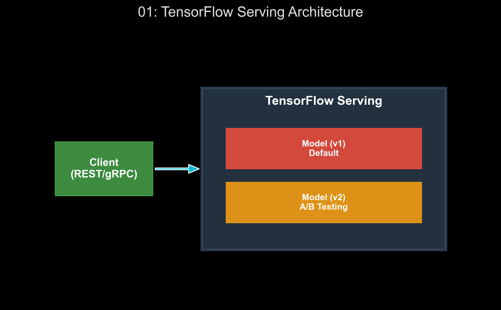

# 🏷️ Module 1: Serving TensorFlow Models
> **Ch. 19 — Hands-On ML with Scikit-Learn, Keras & TensorFlow (Aurélien Géron)**

---

## 📌 Table of Contents
1. [Start Here: The Big Picture](#big-picture)
2. [The SavedModel Format](#concept-1)
3. [TensorFlow Serving (TFS) Architecture & Docker](#concept-2)
4. [Querying: REST API vs. gRPC](#concept-3)
5. [Model Versioning & Batching](#concept-4)
6. [Common Beginner Mistakes](#mistakes)
7. [Interview Q&A](#interview)
8. [⚡ One-Page Flash Card](#revision)

---

## 🌍 Start Here: The Big Picture {#big-picture}

> **TL;DR:** Training a model is only half the battle. To extract real-world value, the model must be deployed in a robust, scalable environment where applications can query it for predictions concurrently, without failure. TensorFlow Serving (TFS) is the industry standard for this, acting as a high-performance C++ server designed specifically to serve machine learning models in production environments.

**The Real-World Analogy 🍕:**
Imagine you’ve spent months perfecting a recipe for a gourmet pizza (training your model). If you keep it in your home kitchen, only you can eat it. To serve 10,000 customers a day, you don't just cook faster—you build an industrial kitchen (TensorFlow Serving) with multiple ovens, an automated ticketing system (REST/gRPC interfaces), and load balancing. 

---

## 🔍 1. The SavedModel Format {#concept-1}

Before a model can be served, it must be exported. Keras provides the `tf.saved_model.save()` function, which exports the model to the standard `SavedModel` format.

### Directory Structure of a SavedModel
When you export a model, TensorFlow creates a directory with the following structure:
```text
my_mnist_model/0001/
├── saved_model.pb      # The computation graph (TF operations) in Protocol Buffer format
├── variables/          # The trained weights of the model
│   ├── variables.data-00000-of-00001
│   └── variables.index
└── assets/             # Extra files needed for inference (e.g., vocabulary files)
```
*   **Protocol Buffers (`.pb`)**: A language-neutral, platform-neutral extensible mechanism for serializing structured data. It's much faster and smaller than JSON.

---

## 🔍 2. TensorFlow Serving (TFS) Architecture & Docker {#concept-2}

TFS is highly efficient, written in C++, and can serve multiple models (or multiple versions of the same model) simultaneously. The standard way to deploy TFS is via Docker.

### Step-by-Step Walkthrough: Deploying via Docker
1. **Pull the Image**: Download the official TFS Docker image.
2. **Run the Container**: Map the local `SavedModel` directory to the container's internal model path, and expose ports for REST (8501) and gRPC (8500).

```bash
# Terminal execution to start TFS
docker run -it --rm -p 8500:8500 -p 8501:8501 \
    -v "/absolute/path/to/my_mnist_model:/models/my_mnist_model" \
    -e MODEL_NAME=my_mnist_model \
    tensorflow/serving
# OUTPUT: INFO: Entering the server loop...
```


> 📊 **Graph 01:** TensorFlow Serving Architecture. Illustrates how a client application queries TFS via REST or gRPC, which then routes the request to the correct model version loaded in memory.

---

## 🔍 3. Querying: REST API vs. gRPC {#concept-3}

Once the server is running, client applications must communicate with it. You have two choices:

### 1. REST API (Port 8501)
*   **Protocol:** HTTP POST requests.
*   **Payload format:** JSON.
*   **Pros:** Extremely easy to debug, ubiquitous across all programming languages.
*   **Cons:** JSON is text-based and bloated. Sending a high-resolution image array via JSON is extremely slow because floats are converted to strings (e.g., `0.1234567`).

```python
# Querying via REST
import requests
import json

input_data = X_new.tolist() # Assuming X_new is a NumPy array of images
data = json.dumps({"signature_name": "serving_default", "instances": input_data})
headers = {"content-type": "application/json"}

response = requests.post("http://localhost:8501/v1/models/my_mnist_model:predict", data=data, headers=headers)
predictions = json.loads(response.text)["predictions"]
```

### 2. gRPC API (Port 8500)
*   **Protocol:** HTTP/2.
*   **Payload format:** Protocol Buffers (Binary).
*   **Pros:** Highly compressed binary data. Floats remain 32-bit binaries. Massive performance boost for large payloads (images, audio).
*   **Cons:** Requires generating client stubs and is harder to debug manually.

---

## 🔍 4. Model Versioning & Batching {#concept-4}

### Versioning policies
By default, TFS serves the highest version number found in the model directory. However, you can configure a `models.config` file to serve multiple versions simultaneously. This is critical for **A/B Testing** (routing 5% of traffic to a new, experimental model) or **Canary Deployments**.

### Server-Side Batching
If a server receives 100 individual prediction requests per second, running the forward pass 100 times individually severely underutilizes GPU/CPU parallelism.
**Solution:** Enable batching in TFS. The server will wait for a tiny fraction of a second (e.g., 10ms) to accumulate requests from different clients, combine them into a single batch (e.g., shape `[32, 28, 28, 1]`), process it in one highly parallelized forward pass, and then split the predictions back to the respective clients.

---

## ❌ Common Beginner Mistakes {#mistakes}

**1. "Deploying high-throughput models using the REST API"** ❌
> While `requests.post()` with JSON is easy to write, the overhead of JSON serialization/deserialization for large tensors often becomes the primary bottleneck in production, completely negating the speed of the GPU.
> **Fix:** For images, audio, or large text tensors, **always use the gRPC API**.

**2. "Forgetting to scale inputs identically in production"** ❌
> If you normalized your training data by dividing by 255, but the client sends raw pixel values (0-255) to the prediction server, the model will output garbage. 
> **Fix:** Include the preprocessing logic directly inside the Keras model (using `keras.layers.Rescaling`, `StringLookup`, etc.) so that the `SavedModel` natively expects raw data.

---

## 🎤 Interview Q&A {#interview}

**Q1: How does TensorFlow Serving handle zero-downtime model updates?**
> **A:** 
> When you drop a new version directory (e.g., `0002/`) into the model folder, TFS automatically detects it via periodic polling. It loads the new version into memory *alongside* the old version. Once the new version is fully initialized and warmed up, TFS atomicly routes all new incoming requests to version `0002` and unloads version `0001` from memory. This guarantees zero downtime and no dropped requests.

**Q2: Explain the trade-off in Server-Side Batching regarding Latency vs. Throughput.**
> **A:** 
> Server-side batching increases overall **throughput** (total requests processed per second) because matrix multiplications are vastly more efficient on batched data. However, it slightly increases **latency** (time taken for a single request to return) because the server artificially delays the first incoming request while waiting to accumulate a full batch.

---

## ⚡ One-Page Flash Card {#revision}

```
╔══════════════════════════════════════════════════════════════════╗
║               MODULE 1 — FLASH CARD                              ║
╠══════════════════════════════════════════════════════════════════╣
║                                                                  ║
║  SAVED_MODEL STRUCTURE:                                          ║
║  - saved_model.pb (Architecture), variables/ (Weights)           ║
║                                                                  ║
║  TF SERVING APIs:                                                ║
║  - REST (8501): JSON payload, easy to debug, slow for big data.  ║
║  - gRPC (8500): Protobuf payload, binary, fast for big data.     ║
║                                                                  ║
║  CRITICAL PRODUCTION CONFIGS:                                    ║
║  - Server-Side Batching: Groups concurrent requests into batches ║
║    to maximize GPU utilization.                                  ║
║  - A/B Testing: Configured via models.config to serve multiple   ║
║    versions concurrently.                                        ║
╚══════════════════════════════════════════════════════════════════╝
```

---

**🔗 Next Module →** [02_Deploying_Models_to_Mobile_and_Embedded_Devices.md](02_Deploying_Models_to_Mobile_and_Embedded_Devices.md)
