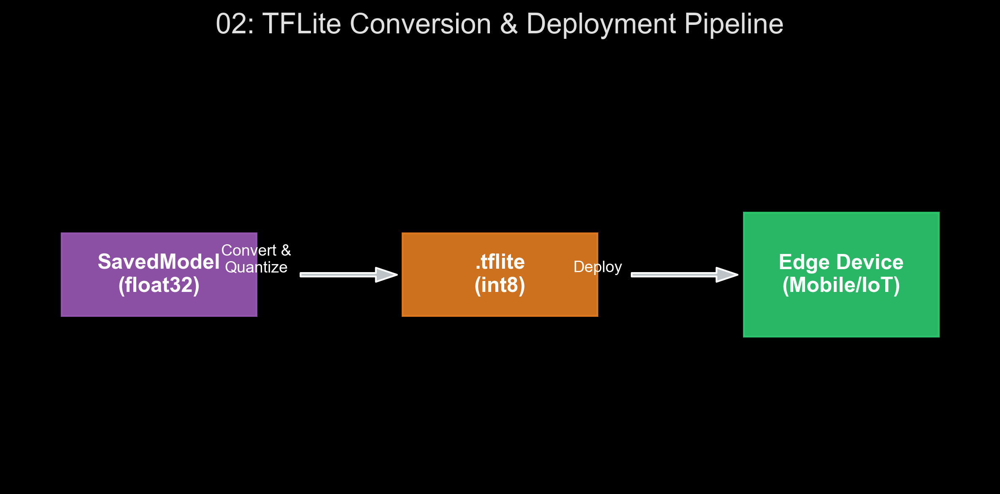

# 🏷️ Module 2: Deploying Models to Mobile and Embedded Devices
> **Ch. 19 — Hands-On ML with Scikit-Learn, Keras & TensorFlow (Aurélien Géron)**

---

## 📌 Table of Contents
1. [Start Here: The Big Picture](#big-picture)
2. [TensorFlow Lite Architecture](#concept-1)
3. [Deep Dive: Model Quantization Math](#concept-2)
4. [Quantization Aware Training (QAT)](#concept-3)
5. [TensorFlow.js (Web Edge ML)](#concept-4)
6. [Common Beginner Mistakes](#mistakes)
7. [Interview Q&A](#interview)
8. [⚡ One-Page Flash Card](#revision)

---

## 🌍 Start Here: The Big Picture {#big-picture}

> **TL;DR:** Inference on the edge (smartphones, IoT microcontrollers, web browsers) requires drastic reductions in model size, memory consumption, and power draw, while preserving privacy. TensorFlow Lite (TFLite) and TensorFlow.js (TF.js) allow us to shrink and optimize standard TensorFlow models so they can run locally in highly constrained environments.

**The Real-World Analogy 🍕:**
If a standard ResNet model is a comprehensive 10-volume encyclopaedia of recipes, an edge model is a laminated cheat sheet. It doesn't contain all the deep underlying theories, but it fits in your pocket and gives you the exact instructions you need on the fly, without needing an internet connection to call the library.

---

## 🔍 1. TensorFlow Lite Architecture {#concept-1}

TFLite is not used for training; it is purely an inference engine. The pipeline involves taking a standard TensorFlow `SavedModel` and passing it through the **TFLite Converter**. 
The converter shrinks the model by using the `FlatBuffers` serialization format (creating a `.tflite` file) rather than Protocol Buffers. FlatBuffers allow the TFLite Interpreter to access data directly in memory without parsing or unpacking it, drastically reducing RAM overhead on edge devices.


> 📊 **Graph 02:** TFLite Conversion & Deployment Pipeline. Demonstrates the flow from a Keras SavedModel (float32) through the Converter to generate the highly optimized .tflite flatbuffer for edge inference.

---

## 🔍 2. Deep Dive: Model Quantization Math {#concept-2}

Standard weights are 32-bit floating-point numbers (`float32`). **Quantization** maps these continuous values to a discrete set of 8-bit integers (`int8`). 
This reduces the model size by 75% (32 bits down to 8 bits) and allows CPUs to use faster integer-math units.

### The Quantization Mapping Equation
The relationship between the real `float32` value ($r$) and the quantized `int8` value ($q$) is defined by an affine transformation:
$$ r = S \times (q - Z) $$
*   $r$: The real floating-point value.
*   $q$: The quantized integer value (ranging from -128 to 127 for `int8`).
*   $S$: The **Scale factor** (a positive float32), representing the step size.
*   $Z$: The **Zero-point** (an integer), ensuring that the real value $0.0$ is mapped exactly to an integer $q$. This is critical because padding and ReLU activations heavily rely on exact zero values.

### Types of Post-Training Quantization (PTQ)
1. **Dynamic Range Quantization:** Weights are quantized to `int8` offline. Activations are dynamically quantized to `int8` *during inference*, math is done in integer space, and results are scaled back to float.
2. **Full Integer Quantization:** Both weights and activations are quantized to `int8` offline. This requires providing a **Representative Dataset** to the converter so it can observe the minimum and maximum ranges of the activations during a mock forward pass to calculate $S$ and $Z$.

```python
# Full Integer Quantization using a Representative Dataset
converter = tf.lite.TFLiteConverter.from_keras_model(model)
converter.optimizations = [tf.lite.Optimize.DEFAULT]

def representative_dataset_gen():
    for x in dataset.take(100):
        yield [x] # Must yield a list of input tensors

converter.representative_dataset = representative_dataset_gen
converter.target_spec.supported_ops = [tf.lite.OpsSet.TFLITE_BUILTINS_INT8]
converter.inference_input_type = tf.int8
converter.inference_output_type = tf.int8

tflite_model = converter.convert()
```

---

## 🔍 3. Quantization Aware Training (QAT) {#concept-3}

Post-Training Quantization (PTQ) often causes a slight drop in accuracy because the rounding introduces noise into the weights. 

If this accuracy drop is unacceptable, we use **Quantization Aware Training (QAT)**. During training, TensorFlow inserts "Fake Quantization" nodes into the graph. These nodes simulate the rounding effect of `int8` quantization during the forward pass. The model then uses backpropagation to *learn how to compensate* for the quantization noise, resulting in a model that, once actually quantized, retains nearly 100% of its original accuracy.

---

## 🔍 4. TensorFlow.js (Web Edge ML) {#concept-4}

TF.js brings ML to the browser environment. Why run in the browser?
*   **Zero Install:** Users don't need to install anything; they just visit a URL.
*   **Privacy:** Data (like webcam feeds or microphones) never leaves the user's machine.
*   **Hardware Acceleration:** TF.js utilizes WebGL to hijack the user's local GPU for accelerated tensor math.

You convert a Keras model to a web-friendly JSON format using the `tensorflowjs_converter` command-line tool.

---

## ❌ Common Beginner Mistakes {#mistakes}

**1. "Assuming edge devices can run large standard architectures"** ❌
> While quantization helps, converting a massive 150-layer ResNet model to TFLite will still result in lag, battery drain, and thermal throttling on a phone.
> **Fix:** You must start with an architecture designed specifically for the edge, such as **MobileNet** (uses Depthwise Separable Convolutions) or **EfficientNet-Lite**.

---

## 🎤 Interview Q&A {#interview}

**Q1: Why is the "Zero-point" ($Z$) parameter strictly necessary in the quantization formula $r = S(q - Z)$? Why not just use $r = S \times q$?**
> **A:** 
> In deep learning, the exact value of $0.0$ holds immense significance. Padding layers inject exact zeros, and the ReLU activation function clamps all negative values to exactly zero. If we didn't have the Zero-point ($Z$), the real value $0.0$ might map to a fractional quantized value (e.g., $q = 12.3$). Because $q$ must be an integer, rounding it would mean the network can *never* represent a true, exact $0.0$. By solving for $Z$ such that $0.0$ maps to an exact integer, we preserve the mathematical integrity of ReLU and padding.

---

## ⚡ One-Page Flash Card {#revision}

```
╔══════════════════════════════════════════════════════════════════╗
║               MODULE 2 — FLASH CARD                              ║
╠══════════════════════════════════════════════════════════════════╣
║                                                                  ║
║  KEY MECHANISMS:                                                 ║
║  - FlatBuffers: Allows zero-copy memory reads in TFLite.         ║
║  - Quantization Formula: r = S * (q - Z)                         ║
║                                                                  ║
║  QUANTIZATION STRATEGIES:                                        ║
║  - PTQ (Dynamic): Easiest, weights to int8, activations float.   ║
║  - PTQ (Full Integer): Needs Representative Dataset for ranges.  ║
║  - QAT: Simulates rounding during training to preserve accuracy. ║
║                                                                  ║
║  WEB DEPLOYMENT:                                                 ║
║  - TF.js: Runs in browser, utilizes WebGL for local GPU access.  ║
╚══════════════════════════════════════════════════════════════════╝
```

---

**🔗 Previous Module →** [01_Serving_TensorFlow_Models.md](01_Serving_TensorFlow_Models.md)  
**🔗 Next Module →** [03_Using_GPUs_to_Accelerate_Computations.md](03_Using_GPUs_to_Accelerate_Computations.md)
