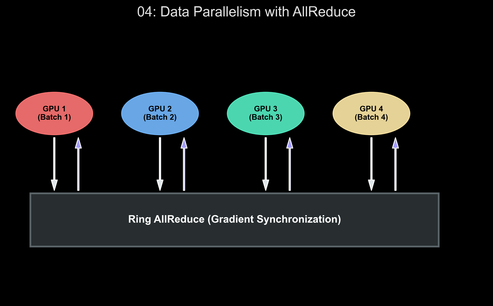

# 🏷️ Module 4: Training Models Across Multiple Devices
> **Ch. 19 — Hands-On ML with Scikit-Learn, Keras & TensorFlow (Aurélien Géron)**

---

## 📌 Table of Contents
1. [Start Here: The Big Picture](#big-picture)
2. [Data Parallelism vs. Model Parallelism](#concept-1)
3. [The Ring AllReduce Algorithm](#concept-2)
4. [TensorFlow Distribution Strategies](#concept-3)
5. [Scaling the Learning Rate (Goyal et al.)](#concept-4)
6. [Common Beginner Mistakes](#mistakes)
7. [Interview Q&A](#interview)
8. [⚡ One-Page Flash Card](#revision)

---

## 🌍 Start Here: The Big Picture {#big-picture}

> **TL;DR:** When a dataset is massive (e.g., ImageNet) or a model is colossal (e.g., GPT-4), a single GPU is insufficient. We must scale horizontally—spanning training across multiple GPUs in a single machine, or across clusters of thousands of machines over a network. TensorFlow's `tf.distribute` API abstracts the complex networking required to synchronize gradients and weights across these nodes.

**The Real-World Analogy 🍕:**
If one chef (GPU) takes 10 hours to make 1,000 pizzas, how do we do it in 1 hour?
*   **Data Parallelism**: You hire 10 identical chefs. You give them all the *exact same recipe* (the model), but they each process a *different batch of orders* (data split). At the end of the shift, they hold a meeting to average out their learnings and update the master recipe uniformly.
*   **Model Parallelism**: The recipe is so complex that one chef handles dough, one handles sauce, and one handles baking. They work on the *same pizza* sequentially, passing it down the line.

---

## 🔍 1. Data Parallelism vs. Model Parallelism {#concept-1}

### Data Parallelism (The Standard)
The entire model architecture and all its weights are copied (replicated) exactly to every GPU. The global batch of data is split evenly. If the global batch size is 128, and you have 4 GPUs, each GPU calculates the forward and backward pass on a mini-batch of 32. After the backward pass, the 4 GPUs communicate to average their gradients, and then identically update their own local weights.

### Model Parallelism
Used strictly when the model's parameters exceed the VRAM of a single GPU (e.g., a 175-billion parameter LLM needing 350GB of RAM). The model is sharded. GPU 1 might hold layers 1-10, and GPU 2 holds layers 11-20. The forward pass output of GPU 1 is sent over the network as the input to GPU 2. 

---

## 🔍 2. The Ring AllReduce Algorithm {#concept-2}

In Data Parallelism, the GPUs must average their gradients before updating the weights.
*   **Naive Approach (Parameter Server):** All GPUs send their gradients to one central server. The server averages them and sends them back. The central server's network bandwidth becomes a massive bottleneck.
*   **Ring AllReduce:** The GPUs are logically arranged in a ring. Instead of sending the full gradient vector, GPU 1 sends a chunk of its gradients to GPU 2, GPU 2 to GPU 3, etc. This is repeated in a Scatter-Reduce phase, followed by an All-Gather phase. **Result:** The network bandwidth utilization is perfectly balanced across all nodes, making it infinitely scalable.


> 📊 **Graph 04:** Data Parallelism via Ring AllReduce. Demonstrates the decentralized topology where gradients are aggregated in a ring, eliminating the Parameter Server bottleneck.

---

## 🔍 3. TensorFlow Distribution Strategies {#concept-3}

TensorFlow provides the `tf.distribute.Strategy` API. With just 3 lines of code, you can convert local training to cluster training.

1.  **`MirroredStrategy`**: Syncs training across multiple GPUs on a **single machine** using NVIDIA NVLink or PCIe. Uses AllReduce.
2.  **`MultiWorkerMirroredStrategy`**: Syncs training across multiple GPUs spread across **multiple machines (nodes)** communicating over ethernet/infiniband.
3.  **`ParameterServerStrategy`**: Uses the asynchronous Parameter Server architecture (useful if workers have vastly different compute speeds, preventing the fast workers from waiting for the slow ones at the AllReduce sync point).

```python
# Implementing MirroredStrategy for single-machine, multi-GPU
import tensorflow as tf
from tensorflow import keras

# 1. Define the strategy (TF auto-detects GPUs)
strategy = tf.distribute.MirroredStrategy()

# 2. Open the strategy scope. Everything created inside this block is replicated!
with strategy.scope():
    model = keras.Sequential([keras.layers.Dense(64, activation="relu")])
    model.compile(loss="mse", optimizer="sgd")

# 3. Call fit as normal. TF splits the dataset and manages AllReduce automatically.
# dataset = ...
# model.fit(dataset, epochs=10)
```

---

## 🔍 4. Scaling the Learning Rate (Goyal et al.) {#concept-4}

When you use Data Parallelism, your effective **Global Batch Size** increases. 
*   4 GPUs each processing a batch of 32 = Global Batch Size of 128.

### The Linear Scaling Rule
Because the gradients are being averaged over a much larger batch, the gradient vector points much more accurately toward the true minima (less noise). Therefore, you can take a much larger step.
**Rule:** If you multiply the batch size by $K$, you must multiply the learning rate by $K$. 
If your original LR was $0.01$ for 1 GPU, your new LR for 4 GPUs should be $0.04$.

### Learning Rate Warmup
Taking massive steps early in training with a huge learning rate can cause the model to diverge immediately. To fix this, you must "warm up" the learning rate—start it very small, and linearly increase it to the target $K \times \text{LR}$ over the first few epochs.

---

## ❌ Common Beginner Mistakes {#mistakes}

**1. "Instantiating the dataset outside the Strategy scope"** ❌
> While the `model` and `optimizer` must be created *inside* the `strategy.scope()`, the `tf.data.Dataset` should ideally be created outside, but passed to `strategy.experimental_distribute_dataset()`. However, `model.fit()` handles this distribution for you automatically in modern TF versions.

---

## 🎤 Interview Q&A {#interview}

**Q1: Contrast Synchronous vs Asynchronous Updates in Distributed Training.**
> **A:** 
> *   **Synchronous (MirroredStrategy):** All workers compute gradients. The system pauses until the slowest worker finishes. The gradients are averaged, weights updated, and all workers proceed to step 2 simultaneously. *Pros:* Stable math, exactly replicates single-GPU training. *Cons:* "Straggler effect"—one slow machine slows down the whole cluster.
> *   **Asynchronous (ParameterServerStrategy):** A worker computes a gradient and sends it to the server. The server updates the master weights immediately, without waiting for other workers. *Pros:* No waiting for stragglers. *Cons:* "Stale gradients"—Worker A computes a gradient based on weights at time $T$, but by the time it sends it, Worker B has already updated the master weights to time $T+1$. Worker A applies a gradient to the wrong weight space, causing chaotic training dynamics.

---

## ⚡ One-Page Flash Card {#revision}

```
╔══════════════════════════════════════════════════════════════════╗
║               MODULE 4 — FLASH CARD                              ║
╠══════════════════════════════════════════════════════════════════╣
║                                                                  ║
║  PARALLELISM ARCHITECTURES:                                      ║
║  - Data Parallel: Replicate model, split data. Use AllReduce.    ║
║  - Model Parallel: Split model layers, same data stream.         ║
║                                                                  ║
║  TF STRATEGY API:                                                ║
║  - MirroredStrategy: 1 Machine, Multiple GPUs.                   ║
║  - MultiWorkerMirroredStrategy: N Machines, N GPUs.              ║
║                                                                  ║
║  THE MATH RULE (CRITICAL):                                       ║
║  - Global Batch Size = Batch per Worker * Num Workers.           ║
║  - If Batch Size scales by K -> Learning Rate must scale by K.   ║
║  - Use Learning Rate Warmup to prevent initial divergence.       ║
╚══════════════════════════════════════════════════════════════════╝
```

---

**🔗 Previous Module →** [03_Using_GPUs_to_Accelerate_Computations.md](03_Using_GPUs_to_Accelerate_Computations.md)
