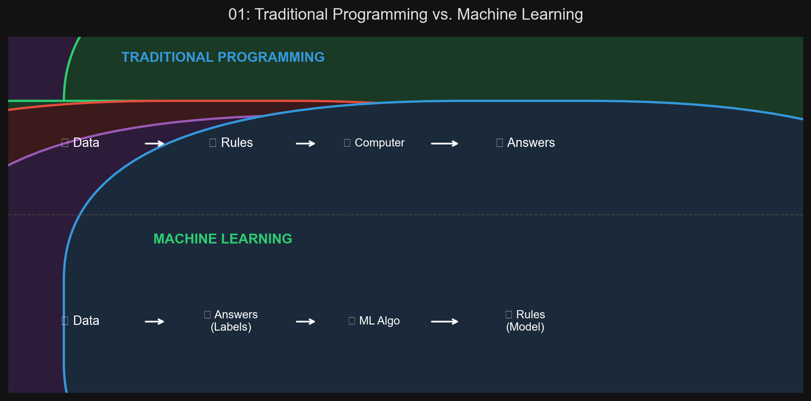
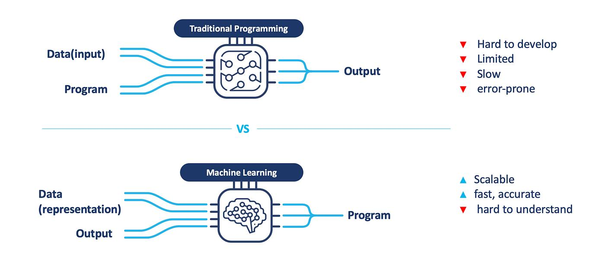
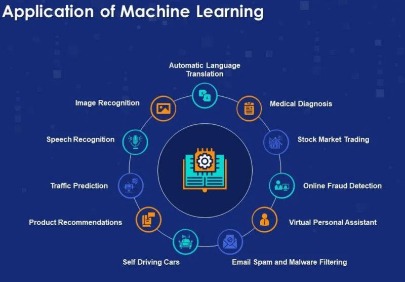

# 🏷️ Module 1: What Is Machine Learning?
> **Ch. 1 — Hands-On ML with Scikit-Learn, Keras & TensorFlow (Aurélien Géron)**

---

## 📌 Table of Contents
1. [Start Here: The Big Picture](#big-picture)
2. [The Three Definitions of ML](#concept-1)
3. [Why Use Machine Learning?](#concept-2)
4. [Examples of Real-World ML Applications](#concept-3)
5. [Common Beginner Mistakes](#mistakes)
6. [Interview Q&A](#interview)
7. [⚡ One-Page Flash Card](#revision)

---

## 🌍 Start Here: The Big Picture {#big-picture}

> **TL;DR:** Machine Learning is the art and science of programming computers to **learn from data** rather than be explicitly programmed with rules. Instead of writing `if "4U" in email → spam`, you show the algorithm thousands of spam and ham emails and let it discover the predictive rules itself.

**The Real-World Analogy 🍕:**
*   **Traditional Programming:** You're a chef who writes the recipe (rules) manually. If a new ingredient (spam word) appears, you manually update the cookbook.
*   **Machine Learning:** You hire an apprentice chef (algorithm). You show them thousands of good and bad pizzas (labeled data). The apprentice learns the recipe by themselves and can handle new, unseen ingredients without you updating anything.

---

## 🔍 1. The Three Definitions of Machine Learning {#concept-1}

Three famous definitions capture increasingly precise meanings:

| Perspective | Definition |
|---|---|
| **General** | *"Field of study that gives computers the ability to learn without being explicitly programmed."* — Arthur Samuel, 1959 |
| **Engineering** | *"A computer program is said to learn from experience E with respect to task T and performance measure P, if its performance on T, as measured by P, improves with E."* — Tom Mitchell, 1997 |
| **Simple** | Programming computers so they can learn from data. |

### The Mitchell Framework Applied to a Spam Filter
*   **Task (T):** Flag spam for new emails.
*   **Experience (E):** Training data of labeled spam/ham emails.
*   **Performance (P):** Accuracy (ratio of correctly classified emails).

> [!NOTE]
> Downloading Wikipedia is **NOT Machine Learning**. Your computer has more data, but it's not better at any task. Learning requires improving performance on a task.

### Core Vocabulary
*   **Training Set:** The set of examples used to train an ML algorithm.
*   **Training Instance (Sample):** A single example in the training set.
*   **Accuracy:** A performance measure for classification tasks = correct predictions / total predictions.

---

## 🔍 2. Why Use Machine Learning? {#concept-2}

### Traditional Programming vs. Machine Learning (Spam Filter Example)

**Traditional Approach:**
1. Study spam emails and notice patterns (e.g., "4U", "credit card", "free").
2. Write a detection algorithm for each pattern.
3. Repeat until acceptable. → Results in a **long list of complex, brittle rules**.

**Machine Learning Approach:**
1. Show algorithm thousands of labeled spam/ham examples.
2. Algorithm automatically learns statistical patterns.
3. When spammers bypass "4U" with "For U", the system automatically adapts.

```text
Traditional:
[Data + Rules] → Computer → Answers

Machine Learning:
[Data + Answers] → Computer → Rules (the Model)
```





### Machine Learning Shines In These 4 Scenarios:

| Scenario | Why ML Wins | Example |
|---|---|---|
| Long list of hand-tuned rules | ML simplifies code and often performs better than hand-crafted rules | Spam filter (hundreds of rules → one trained model) |
| No known algorithmic solution | ML finds patterns where humans can't write explicit rules | Speech recognition, image classification |
| Fluctuating environment | ML automatically adapts to new patterns without manual intervention | Evolving spam tactics, recommendation systems |
| Getting insights (Data Mining) | ML discovers unexpected correlations and patterns in large datasets | Supermarket purchase analysis reveals that buyers of BBQ sauce + chips also buy steak |

> [!NOTE]
> **Self-Supervised Learning** (a form of unsupervised learning) is increasingly important in modern ML. The model generates its own labels from the data itself (e.g., masking a word in a sentence and predicting it). GPT, BERT, and most large language models are trained this way. While the book focuses on the four traditional categories, self-supervised learning has become a dominant paradigm since publication.

---

## 🔍 3. Examples of Real-World ML Applications {#concept-3}

| Task | Type | Algorithm Family |
|---|---|---|
| Image classification on production line | Supervised / Classification | CNNs (Ch. 14) |
| Tumor detection in brain scans | Supervised / Semantic Segmentation | CNNs |
| Classifying news articles | Supervised / Classification | RNNs, CNNs, Transformers (Ch. 16) |
| Flagging offensive comments | Supervised / Classification | NLP Tools |
| Summarizing long documents | Supervised / Sequence-to-Sequence | RNNs, Transformers |
| Forecasting company revenue | Supervised / Regression | Linear Reg, SVM, Random Forest, ANNs |
| Speech recognition | Supervised | RNNs, CNNs, Transformers |
| Chatbot / personal assistant | Supervised + RL | NLP, Seq2Seq, RL |
| Credit card fraud detection | Unsupervised / Anomaly Detection | Ch. 9 |
| Customer segmentation | Unsupervised / Clustering | Ch. 9 |
| High-dimensional data visualization | Unsupervised / Dimensionality Reduction | Ch. 8 |
| Recommender systems | Supervised | ANNs, Collaborative Filtering |
| Game-playing bot | Reinforcement Learning | RL (Ch. 18), e.g., AlphaGo |



---

## ❌ Common Beginner Mistakes {#mistakes}

**1. "Using ML for tasks that have simple, deterministic solutions"** ❌
> Calculating payroll or sorting a list alphabetically requires zero ML. Applying a neural network to calculate someone's age from their birthdate adds probabilistic error to what is a perfect mathematical operation. Use ML where rules are unknown, complex, or change over time.

**2. "Thinking downloading data equals Machine Learning"** ❌
> Downloading Wikipedia doesn't make your computer smarter at any task. ML requires the system to improve its performance on a specific task through exposure to data.

---

## 🎤 Interview Q&A {#interview}

**Q1: Give Tom Mitchell's formal definition of Machine Learning. Break down all three components using a concrete example.**
> **A:** *"A computer program is said to learn from experience E with respect to task T and performance measure P, if its performance on T, as measured by P, improves with E."*
> Applied to a spam filter:
> *   **T (Task):** Flag spam emails for new, incoming messages.
> *   **E (Experience):** A training set of thousands of emails, each labeled "spam" or "ham" by users.
> *   **P (Performance):** Accuracy — the percentage of emails correctly classified.
> The spam filter "learns" if its accuracy increases as it sees more labeled training examples.

**Q2: Describe the four primary areas where ML excels over traditional programming.**
> **A:**
> 1. **Complex rules:** Problems requiring a huge, unmaintainable list of rules (spam filtering, OCR).
> 2. **No known solution:** Problems humans themselves can't solve algorithmically (speech recognition in any language, natural language understanding).
> 3. **Adapting environments:** Domains where patterns shift frequently (stock markets, evolving spam tactics, recommendation systems).
> 4. **Data Mining:** Discovering hidden patterns in large, complex datasets to generate new insights.

---

## ⚡ One-Page Flash Card {#revision}

```
╔══════════════════════════════════════════════════════════════════╗
║          MODULE 1 FLASH CARD — What is Machine Learning?         ║
╠══════════════════════════════════════════════════════════════════╣
║                                                                  ║
║  ARTHUR SAMUEL (1959):                                           ║
║  "Learn without being explicitly programmed."                    ║
║                                                                  ║
║  TOM MITCHELL (1997):                                            ║
║  Task T + Experience E + Performance P.                          ║
║  ML if performance on T (measured by P) improves with E.         ║
║                                                                  ║
║  TRADITIONAL vs ML FLOW:                                         ║
║  Traditional: Data + Rules → Answers                             ║
║  ML:          Data + Answers → Rules (Model)                     ║
║                                                                  ║
║  4 IDEAL USE CASES:                                              ║
║  1. Complex rules     3. Fluctuating environments                ║
║  2. No known algo     4. Data Mining                             ║
╚══════════════════════════════════════════════════════════════════╝
```

---

---

**🔗 Previous Module →** [Back to Chapter Index](../notes.md)  
**🔗 Next Module →** [02_Types_of_ML_Systems.md](02_Types_of_ML_Systems.md)
