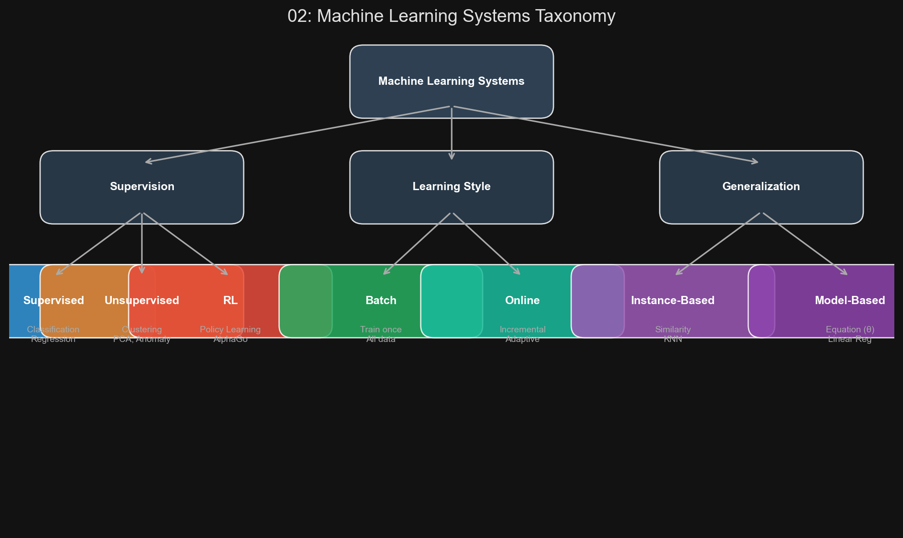
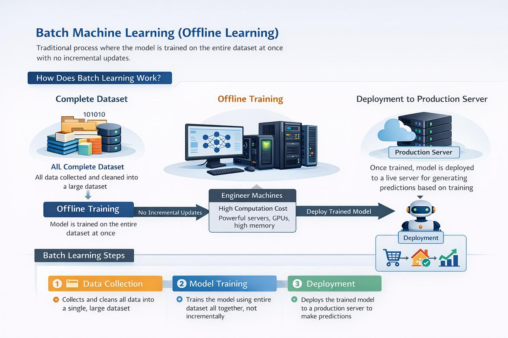

# 🏷️ Module 2: Types of Machine Learning Systems
> **Ch. 1 — Hands-On ML with Scikit-Learn, Keras & TensorFlow (Aurélien Géron)**

---

## 📌 Table of Contents
1. [Start Here: The Big Picture](#big-picture)
2. [Axis 1: Supervision — Supervised, Unsupervised, Semi-supervised, RL](#concept-1)
3. [Axis 2: Batch vs. Online Learning](#concept-2)
4. [Axis 3: Instance-Based vs. Model-Based Learning](#concept-3)
5. [Common Beginner Mistakes](#mistakes)
6. [Interview Q&A](#interview)
7. [⚡ One-Page Flash Card](#revision)

---

## 🌍 Start Here: The Big Picture {#big-picture}

> **TL;DR:** ML systems are classified along three independent axes: **how much human supervision** they receive during training, **whether they learn incrementally** or all at once, and **whether they generalize by comparison or by equation**. These axes are not mutually exclusive — a modern spam filter might be online, model-based, and supervised all at once.

**The Real-World Analogy 🍕:**
Think of three different ways to learn to make pizza:
*   **Supervised:** A teacher shows you labeled examples — "Good pizza ✅, Burnt pizza ❌."
*   **Unsupervised:** You're given 1000 pizzas, no labels. You must figure out groups by yourself.
*   **Reinforcement Learning:** You experiment, and a critic gives you points (+10 for tasty, -5 for burnt). You learn the optimal recipe through trial and error over thousands of attempts.



---

## 🔍 1. Axis 1: Supervision {#concept-1}

### 1A. Supervised Learning
The training data includes **desired solutions, called labels**.

*   **Classification:** Predict a discrete class label.
    *   Example: Spam filter (spam or ham), image classification (cat or dog).
*   **Regression:** Predict a continuous numeric value.
    *   Example: Predict car price given mileage, age, brand.

> [!NOTE]
> An *attribute* is a data type (e.g., "mileage"), while a *feature* is an attribute plus its value (e.g., "mileage = 15,000"). Many use these interchangeably.

**Key Supervised Learning Algorithms (from the book):**
| Algorithm | Type |
|---|---|
| k-Nearest Neighbors | Classification / Regression |
| Linear Regression | Regression |
| Logistic Regression | Classification |
| Support Vector Machines (SVMs) | Classification / Regression |
| Decision Trees and Random Forests | Classification / Regression |
| Neural Networks | Classification / Regression |

---

### 1B. Unsupervised Learning
The training data is **unlabeled**. The system must learn structure without a teacher.

**Key Unsupervised Learning Algorithms:**

| Category | Algorithms |
|---|---|
| **Clustering** | K-Means, DBSCAN, Hierarchical Cluster Analysis (HCA) |
| **Anomaly Detection / Novelty Detection** | One-class SVM, Isolation Forest |
| **Visualization & Dimensionality Reduction** | PCA, Kernel PCA, Locally Linear Embedding (LLE), t-SNE |
| **Association Rule Learning** | Apriori, Eclat |

**Clustering Example:** Running a clustering algorithm on a blog's 100,000 visitors might reveal that 40% are "male comic-book fans who browse in the evening" and 20% are "young sci-fi lovers who visit on weekends." No human labeled these groups — the algorithm discovered them.

**Dimensionality Reduction:** Simplifies data without losing too much information. A car's mileage may be strongly correlated with its age, so both can be merged into a single "wear-and-tear" feature. This is called **feature extraction**.

> [!TIP]
> Reduce dimensions *before* feeding data to a supervised algorithm. It runs faster, takes less memory, and can even improve accuracy.

**Anomaly vs. Novelty Detection:**
*   **Anomaly Detection:** Trained on normal data + a few anomalies. Flags unusual instances (e.g., credit card fraud).
*   **Novelty Detection:** Trained ONLY on normal data. Any new instance not resembling the training set is flagged. Requires a very "clean" training set.

**Association Rule Learning:** Dig into large datasets to discover relationships between attributes.
*   Example: Supermarket data reveals that people who buy barbecue sauce and potato chips also tend to buy steak → place these items near each other.

---

### 1C. Semisupervised Learning
Most real-world data is partially labeled — lots of unlabeled data, few labeled instances. Some algorithms handle this mixture:
*   **Example:** Google Photos automatically recognizes Person A in photos 1, 5, 11 (clustering). You just add one label "Grandmother" and it names her everywhere.
*   **Example:** Deep Belief Networks (DBNs) = stacked Restricted Boltzmann Machines (RBMs) trained unsupervised, then fine-tuned with supervised learning.

> [!TIP]
> **Transfer Learning** (covered in Ch. 11 & 14) is closely related: a model pre-trained on a large labeled dataset (e.g., ImageNet) is fine-tuned on a much smaller labeled dataset for a different task. This is the dominant approach in modern deep learning.

---

### 1E. Self-Supervised Learning
A rapidly growing paradigm where the model **generates its own labels from the data** — no human labeling required.

*   **How it works:** The algorithm creates a "pretext task" from the raw data. For example:
    *   **Masked Language Modeling (BERT):** Mask 15% of the words in a sentence → train the model to predict the masked words.
    *   **Next Sentence Prediction:** Given two sentences, predict whether the second follows the first.
    *   **Contrastive Learning (SimCLR):** Apply two random augmentations to the same image → train the model to recognize they came from the same image.

*   **Why it matters:** Most data in the real world is unlabeled. Self-supervised learning can leverage this vast unlabeled data to learn powerful representations, which are then fine-tuned with a small amount of labeled data. This is how GPT, BERT, and virtually all modern large language models are trained.

> [!IMPORTANT]
> Self-supervised learning is technically a form of unsupervised learning (no human labels), but it generates its own supervision signal. It has become arguably the most impactful learning paradigm in modern AI, enabling foundation models that power ChatGPT, image generators, etc.

---

### 1D. Reinforcement Learning
*   **Agent:** The learning system.
*   **Environment:** The world the agent operates in.
*   **Actions:** What the agent can do.
*   **Reward / Penalty:** The feedback signal.
*   **Policy:** The strategy the agent learns — it defines what action to take in each situation.

The agent observes the environment, selects actions, receives rewards or penalties, and learns the **policy** that maximizes cumulative reward over time.

**DeepMind AlphaGo** is the canonical example: it analyzed millions of Go games, played millions of games against itself, and learned a winning policy. During the actual championship match, AlphaGo was NOT learning — it was purely applying the learned policy.

---

## 🔍 2. Axis 2: Batch vs. Online Learning {#concept-2}

### Batch (Offline) Learning
*   Trained on **all available data at once**.
*   Cannot learn incrementally after deployment.
*   Adapting to new data requires **retraining from scratch** on the full old + new dataset, then redeploying.
*   **Cons:** Retraining is expensive (time, CPU, memory, disk I/O); if data changes rapidly (e.g., stock prices), 24-hour retraining cycles are too slow.

### Online Learning
*   Trained **incrementally** by feeding data instances sequentially, either one-by-one or in mini-batches.
*   Each learning step is fast and cheap — the system can adapt to new data **on the fly**.
*   Also used for **out-of-core learning**: datasets so large they don't fit in one machine's main memory. The algorithm loads and trains on chunks of data.

> [!WARNING]
> Out-of-core learning (training on huge datasets in chunks) is done offline. Don't confuse "online learning" with "training on the internet." The term "online" refers to the learning style (incremental), not the deployment location.



**The Learning Rate Parameter:**
| Learning Rate | Behavior |
|---|---|
| **High** | Adapts fast to new data, but quickly forgets old data. |
| **Low** | Learns slowly, more inertia. Less sensitive to noise or outlier sequences. |

> [!CAUTION]
> Big risk of online learning: **if bad data enters the system, performance degrades continuously**. A malfunctioning sensor or someone gaming a search engine (adversarial data) can corrupt the model. You must monitor performance closely and disable learning if a drop is detected.

---

## 🔍 3. Axis 3: Instance-Based vs. Model-Based Learning {#concept-3}

This axis describes **how the system generalizes** from training examples to new, unseen cases.

### Instance-Based Learning (Memorize & Compare)
*   The system **learns examples by heart**.
*   Generalizes to new cases by **measuring similarity** to known training instances.
*   Example: A spam filter flags a new email if it has many words in common with previously flagged spam emails.

*   **K-Nearest Neighbors (KNN):**
    *   To predict for a new instance, find the K most similar training instances and return the average (regression) or majority class (classification).
    *   For Cyprus's life satisfaction (GDP ≈ $22,587): Find Slovenia ($20,732, satisfaction 5.7), Portugal (5.1), Spain (6.5). Average = 5.77.

### Model-Based Learning (Build an Equation)
*   The system uses training data to build a **predictive mathematical model**.
*   It defines model parameters (e.g., θ₀, θ₁) and runs an algorithm to find the optimal parameter values that minimize a **cost function**.

**The Life Satisfaction Example from the book:**

```
Equation 1-1: life_satisfaction = θ₀ + θ₁ × GDP_per_capita
```

| Country | GDP per capita (USD) | Life satisfaction |
|---|---|---|
| Hungary | 12,240 | 4.9 |
| Korea | 27,195 | 5.8 |
| France | 37,675 | 6.5 |
| Australia | 50,962 | 7.3 |
| United States | 55,805 | 7.2 |

The algorithm finds optimal values: **θ₀ = 4.85, θ₁ = 4.91 × 10⁻⁵**

**Prediction for Cyprus (GDP = $22,587):**
```
life_satisfaction = 4.85 + 22,587 × 4.91×10⁻⁵ ≈ 5.96
```

```python
# Example 1-1 from the book: Linear model with Scikit-Learn
import sklearn.linear_model

model = sklearn.linear_model.LinearRegression()
model.fit(X, y)  # X = GDP per capita, y = Life satisfaction

X_new = [[22587]]  # Cyprus's GDP per capita
print(model.predict(X_new))  # OUTPUT: [[5.96242338]]
```

**Swap to KNN (3 neighbors) with one change:**
```python
import sklearn.neighbors
model = sklearn.neighbors.KNeighborsRegressor(n_neighbors=3)
```

### Summary of the ML Workflow (Model-Based)
1. **Study the data** (EDA).
2. **Select a model** (Model selection).
3. **Train it** on training data — algorithm finds parameters minimizing the cost function.
4. **Apply the model** (inference) on new cases.

---

## ❌ Common Beginner Mistakes {#mistakes}

**1. "Thinking Supervised and Unsupervised are the only categories"** ❌
> Semi-supervised and RL exist and are critical for production systems. Google Photos (semi-supervised) and AlphaGo (RL) are canonical, real-world examples that are not purely supervised or unsupervised.

**2. "Forgetting that online learning degrades if given bad data"** ❌
> Online learning systems exposed to adversarial data (spam bots gaming a search engine) will continuously degrade. Always pair online learning with anomaly detection on the input data and performance monitoring.

---

## 🎤 Interview Q&A {#interview}

**Q1: Distinguish Anomaly Detection from Novelty Detection. When do you use each?**
> **A:**
> *   **Anomaly Detection:** The training set contains normal instances AND some anomalies. The algorithm learns to identify unusual instances. It doesn't require a perfectly clean dataset. Use for fraud detection, fault detection, removing outliers from your dataset.
> *   **Novelty Detection:** Trained ONLY on normal (clean) instances. It flags any new instance that differs significantly from what it has seen. Requires a very clean training set devoid of the instances you want to detect. For example, training on 10,000 dog photos with 1% Chihuahuas: an anomaly detector might flag Chihuahuas; a novelty detector (trained without Chihuahuas) definitely would.

**Q2: Explain the concept of "out-of-core learning" and when it is used.**
> **A:**
> Out-of-core learning is when an online learning algorithm is used to process huge datasets that cannot fit in one machine's RAM. The algorithm loads a small chunk (mini-batch), trains on it, then loads the next chunk, and repeats until it has processed the entire dataset. It uses online/incremental learning algorithms, but the training process itself may be done offline (not on a live production system).

**Q3: What is the key difference between a utility function and a cost function in model-based learning?**
> **A:**
> *   **Utility (Fitness) Function:** Measures how *good* your model is. The goal is to **maximize** it.
> *   **Cost Function:** Measures how *bad* your model is (e.g., how far its predictions are from the correct labels). The goal is to **minimize** it.
> For Linear Regression, the training algorithm minimizes a cost function that measures the average distance between the model's predictions and the training labels. Mathematically, these are equivalent — maximizing utility = minimizing cost = minimizing negative utility.

**Q4: What is Self-Supervised Learning and why has it become so important?**
> **A:**
> Self-supervised learning is a paradigm where the model creates its own labels from raw, unlabeled data (e.g., masking words in text and predicting them, or predicting the next frame in a video). It's important because:
> 1. Most data in the world is unlabeled — self-supervised learning can exploit it.
> 2. It produces powerful **general-purpose representations** (embeddings) that can be fine-tuned for many downstream tasks with minimal labeled data.
> 3. It's the foundation of modern NLP (BERT, GPT) and increasingly computer vision (MAE, DINO).

---

## ⚡ One-Page Flash Card {#revision}

```
╔══════════════════════════════════════════════════════════════════╗
║         MODULE 2 FLASH CARD — Types of ML Systems               ║
╠══════════════════════════════════════════════════════════════════╣
║  AXIS 1: SUPERVISION                                             ║
║  - Supervised: Labeled data (Classification, Regression).        ║
║  - Unsupervised: Unlabeled (Clustering, PCA, Anomaly Detection). ║
║  - Semi-supervised: Mostly unlabeled + few labels (Google Photos)║
║  - RL: Agent learns via Rewards/Penalties (AlphaGo).             ║
║                                                                  ║
║  AXIS 2: LEARNING STYLE                                          ║
║  - Batch: All data at once, retrain from scratch.                ║
║  - Online: Incremental, fast. Key param: Learning Rate.          ║
║    Warning: Bad data = gradual performance degradation.          ║
║                                                                  ║
║  AXIS 3: GENERALIZATION                                          ║
║  - Instance-based: Memorize + Similarity measure (KNN).          ║
║  - Model-based: Learn equation (θ params) to minimize cost func. ║
║                                                                  ║
║  LIFE SATISFACTION MODEL:                                        ║
║  life_sat = θ₀ + θ₁ × GDP → Trained: θ₀=4.85, θ₁=4.91×10⁻⁵    ║
╚══════════════════════════════════════════════════════════════════╝
```

---

---

**🔗 Previous Module →** [01_What_is_Machine_Learning.md](01_What_is_Machine_Learning.md)  
**🔗 Next Module →** [03_Main_Challenges_of_ML.md](03_Main_Challenges_of_ML.md)
