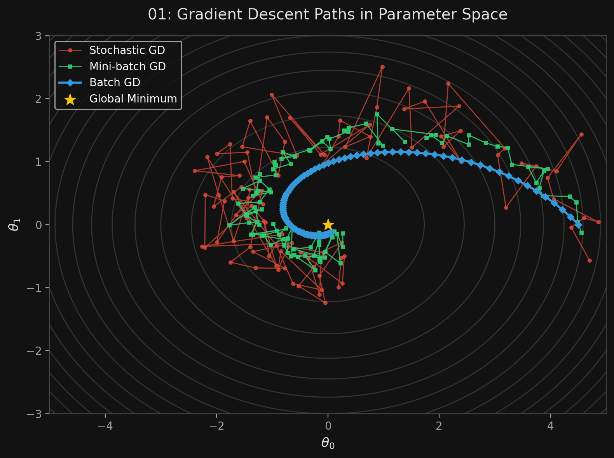
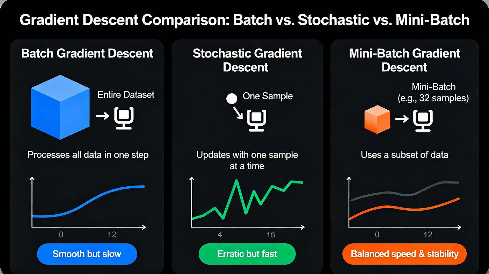

# 🏷️ Module 2: Gradient Descent (Batch, Stochastic, Mini-batch)
> **Ch. 4 — Hands-On ML with Scikit-Learn, Keras & TensorFlow (Aurélien Géron)**

---

## 📌 Table of Contents
1. [Start Here: The Big Picture](#big-picture)
2. [Gradient Descent Concepts & Pitfalls](#concept-1)
3. [Batch Gradient Descent](#concept-2)
4. [Stochastic Gradient Descent (SGD)](#concept-3)
5. [Mini-batch Gradient Descent](#concept-4)
6. [Algorithm Comparison Matrix](#concept-5)
7. [Common Beginner Mistakes](#mistakes)
8. [Interview Q&A](#interview)
9. [⚡ One-Page Flash Card](#revision)

---

## 🌍 Start Here: The Big Picture {#big-picture}

> **TL;DR:** When data has too many features, the exact math formulas from Module 1 crash the computer. We solve this with **Gradient Descent (GD)** — an iterative algorithm that starts with random parameters and tweaks them step-by-step to go "downhill" toward the lowest cost. 
> *   **Batch GD:** Uses all data per step (Slow but exact).
> *   **Stochastic GD (SGD):** Uses 1 random instance per step (Fast but erratic).
> *   **Mini-batch GD:** Uses a small chunk of data (The golden middle ground).

---

## 🔍 1. Gradient Descent Concepts & Pitfalls {#concept-1}

**The Mountain Analogy:** You are lost in the mountains in a dense fog. You can only feel the slope under your feet. To get to the bottom of the valley, you walk downhill in the direction of the steepest slope.

**Key Hyperparameter: Learning Rate ($\eta$)**
*   **Too small:** The algorithm takes tiny baby steps. It will eventually reach the bottom, but it will take a very long time.
*   **Too large:** The algorithm jumps across the valley and might end up higher on the other side. It **diverges** and never finds a solution.

**The Pitfalls of GD (Local Minima):**
*   If the cost function looks like a rugged mountain range, the algorithm might get stuck in a **local minimum** (a small dip) rather than finding the **global minimum** (the true bottom of the deepest valley).
*   *Lucky fact:* The MSE cost function for Linear Regression is a **convex function** (shaped like a perfect bowl). It has NO local minima, only one global minimum. It is guaranteed to reach the bottom!

> [!WARNING]
> **Mandatory Feature Scaling:** If features are on very different scales (e.g., $x_1$ ranges from 1-10, $x_2$ ranges from 1,000-10,000), the cost function bowl becomes an elongated, skinny ellipse. Gradient Descent will march down a long, flat valley very slowly. **Always use `StandardScaler` before using Gradient Descent.**

---

## 🔍 2. Batch Gradient Descent {#concept-2}

**How it works:**
It computes the gradient of the cost function with respect to every parameter based on the **entire training set** at every single step.

**The Equation:**
$$\nabla_{\theta} \text{MSE}(\theta) = \frac{2}{m} X^T (X \theta - y)$$
$$\theta^{\text{next step}} = \theta - \eta \nabla_{\theta} \text{MSE}(\theta)$$

**Code Implementation:**
```python
eta = 0.1  # learning rate
n_iterations = 1000
m = 100

theta = np.random.randn(2,1)  # random initialization

for iteration in range(n_iterations):
    gradients = 2/m * X_b.T.dot(X_b.dot(theta) - y)
    theta = theta - eta * gradients
```

**Pros & Cons:**
*   **Pro:** Scales perfectly with the number of features (millions of features are no problem).
*   **Con:** Terribly slow on very large training sets (millions of instances), because it computes the gradient over the whole set at every step.

---

## 🔍 3. Stochastic Gradient Descent (SGD) {#concept-3}

**How it works:**
Instead of using the whole dataset, it picks **one random instance** at every step and computes the gradient based only on that instance.

**Pros & Cons:**
*   **Pro:** Extremely fast. Capable of training on huge datasets since only one instance needs to be in memory (out-of-core learning).
*   **Con:** Highly erratic. The cost function bounces up and down. It will end up very close to the minimum but will never truly settle down (it keeps bouncing around the bottom).

**Simulated Annealing & Learning Schedule:**
To stop the bouncing at the end, we use a **learning schedule**: we start with a large learning rate (to make fast progress), and gradually reduce it so the algorithm settles down at the global minimum.

```python
n_epochs = 50
t0, t1 = 5, 50  # learning schedule hyperparameters

def learning_schedule(t):
    return t0 / (t + t1)

theta = np.random.randn(2,1)

for epoch in range(n_epochs):
    for i in range(m):
        random_index = np.random.randint(m)
        xi = X_b[random_index:random_index+1]
        yi = y[random_index:random_index+1]
        
        gradients = 2 * xi.T.dot(xi.dot(theta) - yi)
        eta = learning_schedule(epoch * m + i)
        theta = theta - eta * gradients
```

**Scikit-Learn Implementation:**
```python
from sklearn.linear_model import SGDRegressor
# Runs max 1000 epochs or stops early if loss doesn't improve by 1e-3
sgd_reg = SGDRegressor(max_iter=1000, tol=1e-3, penalty=None, eta0=0.1)
sgd_reg.fit(X, y.ravel())
```

> [!IMPORTANT]
> When using SGD, training instances must be independent and identically distributed (IID). You must **shuffle the training set** at the beginning of each epoch to ensure the model doesn't get biased by sorting order.

---

## 🔍 4. Mini-batch Gradient Descent {#concept-4}

**How it works:**
Computes gradients on small, random sets of instances called **mini-batches**.

**Why it's awesome:**
1. It is less erratic than SGD.
2. It gets a massive performance boost from hardware optimization of matrix operations (GPUs).
3. It ends up walking closer to the true minimum than SGD.

**Visualizing the paths:**
*   **Batch GD:** Smooth curve directly to the center. Stops perfectly.
*   **Stochastic GD:** Wild bouncing all over the place, circling the center.
*   **Mini-batch GD:** Mild bouncing, circles tighter around the center than SGD.


> 📊 **Graph 01:** Gradient Descent Paths in Parameter Space

---

## 🔍 5. Algorithm Comparison Matrix {#concept-5}



| Algorithm | Large $m$ (Instances) | Out-of-core | Large $n$ (Features) | Hyperparams | Scaling Required? | Scikit-Learn Class |
|---|---|---|---|---|---|---|
| **Normal Equation** | Fast | No | Slow | 0 | No | N/A |
| **SVD** | Fast | No | Slow | 0 | No | `LinearRegression` |
| **Batch GD** | Slow | No | Fast | 2 | Yes | `SGDRegressor` |
| **Stochastic GD** | Fast | **Yes** | Fast | $\ge 2$ | Yes | `SGDRegressor` |
| **Mini-batch GD** | Fast | **Yes** | Fast | $\ge 2$ | Yes | `SGDRegressor` |

> **Crucial Note:** There is almost NO difference after training. All these algorithms end up with very similar models and make predictions in exactly the same way (using $\theta^T \cdot x$).

---

## ❌ Common Beginner Mistakes {#mistakes}

**1. "Forgetting to scale features before running Gradient Descent"** ❌
> If you don't scale features using `StandardScaler`, the cost function bowl becomes extremely elongated. The gradient descent steps will bounce back and forth across the narrow valley and take agonizingly long to reach the minimum.

**2. "Using Batch Gradient Descent on a dataset with 5 million rows"** ❌
> Batch GD computes the gradient over the *entire dataset* at every single tiny step. With 5 million rows, one step takes forever. You must switch to Stochastic or Mini-batch GD.

**3. "Feeding sorted data into SGD without shuffling"** ❌
> If the data is sorted by label, SGD will optimize for one label, then completely overwrite those weights when it sees the next label. You must shuffle the data so the algorithm gets pulled toward the global optimum on average.

---

## 🎤 Interview Q&A {#interview}

**Q1: Can Gradient Descent get stuck in a local minimum when training a Linear Regression model?**
> **A:**
> No. The MSE cost function for a Linear Regression model is a strictly convex function (shaped like a bowl). This means it has no local minima, only one global minimum. It is guaranteed to converge as long as the learning rate is not too high.

**Q2: What is a learning schedule and why is it used in Stochastic Gradient Descent?**
> **A:**
> SGD picks instances randomly, which causes the cost function to bounce around wildly. It never actually settles down at the global minimum. To fix this, we use a learning schedule: we start with a large learning rate to make fast progress and escape potential plateaus, then gradually decay the learning rate. As the learning rate drops, the step size gets smaller, allowing the algorithm to finally settle closely into the global minimum (similar to simulated annealing).

---

## ⚡ One-Page Flash Card {#revision}

```
╔══════════════════════════════════════════════════════════════════╗
║  MODULE 2 FLASH CARD — Gradient Descent Architectures            ║
╠══════════════════════════════════════════════════════════════════╣
║  CORE CONCEPT:                                                   ║
║  Iteratively tweak weights to minimize the cost function.        ║
║  MUST scale features (StandardScaler) to prevent slow valleys.   ║
║                                                                  ║
║  BATCH GD:                                                       ║
║  - Uses ALL data every step.                                     ║
║  - Perfect path, stops at exact minimum.                         ║
║  - SLOW on large m. Fast on large n.                             ║
║                                                                  ║
║  STOCHASTIC GD (SGD):                                            ║
║  - Uses 1 random instance per step.                              ║
║  - Extremely fast. Out-of-core support.                          ║
║  - Erratic bouncing. Needs a learning schedule to settle.        ║
║                                                                  ║
║  MINI-BATCH GD:                                                  ║
║  - Uses a small random chunk (e.g., 32 instances) per step.      ║
║  - Hits the GPU optimization sweet spot. Best in practice.       ║
╚══════════════════════════════════════════════════════════════════╝
```

---

---

**🔗 Previous Module →** [01_Linear_Regression_Normal_Equation.md](01_Linear_Regression_Normal_Equation.md)  
**🔗 Next Module →** [03_Polynomial_Regression_Learning_Curves.md](03_Polynomial_Regression_Learning_Curves.md)
