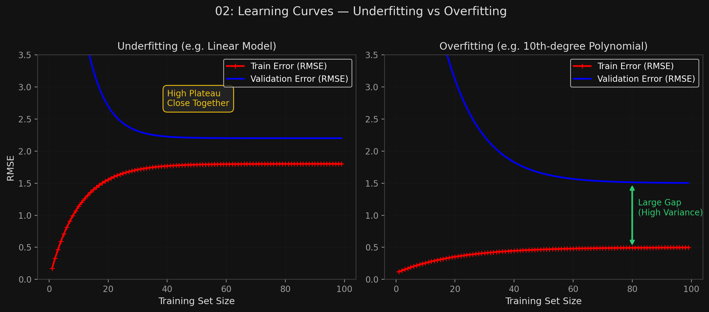

# 🏷️ Module 3: Polynomial Regression, Learning Curves & Bias/Variance
> **Ch. 4 — Hands-On ML with Scikit-Learn, Keras & TensorFlow (Aurélien Géron)**

---

## 📌 Table of Contents
1. [Start Here: The Big Picture](#big-picture)
2. [Polynomial Regression](#concept-1)
3. [The Combinatorial Explosion of Features](#concept-2)
4. [Learning Curves: Underfitting vs. Overfitting](#concept-3)
5. [The Bias/Variance Trade-off](#concept-4)
6. [Common Beginner Mistakes](#mistakes)
7. [Interview Q&A](#interview)
8. [⚡ One-Page Flash Card](#revision)

---

## 🌍 Start Here: The Big Picture {#big-picture}

> **TL;DR:** Linear models can fit non-linear data! We simply add powers of each feature (e.g., $x^2, x^3$) as new features, then train a standard linear model on them. This is **Polynomial Regression**. But adding too many powers leads to wild **overfitting**. How do we know if we're underfitting or overfitting? We look at **Learning Curves** (error vs. training set size). Ultimately, all modeling decisions boil down to managing the inescapable **Bias/Variance Trade-off**.

---

## 🔍 1. Polynomial Regression {#concept-1}

If data is more complex than a straight line, we can add powers of the original features as new features using `PolynomialFeatures`, then fit a `LinearRegression` model.

**Example: A Simple Quadratic Equation**
```python
m = 100
X = 6 * np.random.rand(m, 1) - 3
y = 0.5 * X**2 + X + 2 + np.random.randn(m, 1)  # Quadratic + noise

from sklearn.preprocessing import PolynomialFeatures

# Transform X -> [X, X^2]
poly_features = PolynomialFeatures(degree=2, include_bias=False)
X_poly = poly_features.fit_transform(X)

print(X[0])       # [-0.7527]
print(X_poly[0])  # [-0.7527, 0.5666]  <- The second number is (-0.7527)^2

# Now fit a plain Linear Regression model on X_poly
lin_reg = LinearRegression()
lin_reg.fit(X_poly, y)

print(lin_reg.intercept_, lin_reg.coef_)
# [1.78] [[0.93, 0.56]]
# The model correctly estimates: y = 0.56 x^2 + 0.93 x + 1.78
```

---

## 🔍 2. The Combinatorial Explosion of Features {#concept-2}

When there are multiple features, `PolynomialFeatures` doesn't just add squares ($a^2, b^2$). It adds **all combinations** of features up to the given degree.

*   If features are $a, b$ and `degree=3`:
*   Added features: $a^2, a^3, b^2, b^3, ab, a^2b, ab^2$.

> [!WARNING]
> `PolynomialFeatures(degree=d)` transforms an array of $n$ features into an array containing **$(n + d)! / d!n!$** features. This is a massive combinatorial explosion. Using degree 10 on 100 features produces over 500,000,000 features. The model will overfit instantly and the algorithm will crash.

---

## 🔍 3. Learning Curves: Underfitting vs. Overfitting {#concept-3}

A learning curve plots the model's performance on the **training set** and the **validation set** as a function of the **training set size**.

**How to generate them:** Train the model repeatedly on larger and larger subsets of the training data.

### Scenario A: Underfitting (e.g., plain linear line on quadratic data)
*   **Train error:** Starts at 0 (fits 1 point perfectly), goes up, then reaches a high plateau (a straight line can't capture the curve).
*   **Validation error:** Starts huge, goes down, and plateaus very close to the train error.
*   **Key signature:** Both curves reach a **high plateau and are close together**.
*   **Fix:** Adding more training instances will NOT help. You must use a more complex model or engineer better features.

### Scenario B: Overfitting (e.g., 10th-degree polynomial)
*   **Train error:** Much lower than the linear model. Fits the training data very well.
*   **Validation error:** Higher than train error.
*   **Key signature:** There is a **large gap** between the curves (model performs significantly better on training data than validation data).
*   **Fix:** Add more training data (until validation catches up to training), or **regularize** (constrain) the model.


> 📊 **Graph 02:** Underfitting vs Overfitting Learning Curves

---

## 🔍 4. The Bias/Variance Trade-off {#concept-4}

A model's generalization error can be broken down into three totally distinct mathematical components. This is a fundamental law of machine learning:

| Error Type | Definition | Result |
|---|---|---|
| **Bias** | Wrong assumptions (e.g., assuming quadratic data is linear). | High Bias $\rightarrow$ **Underfitting** |
| **Variance** | Excessive sensitivity to small variations in training data. | High Variance $\rightarrow$ **Overfitting** |
| **Irreducible Error** | Noisiness of the data itself (broken sensors, outliers). | Fix by cleaning data |

**The Trade-off:**
*   Increasing model complexity (e.g., moving from degree 1 to degree 10) **increases variance** and **reduces bias**.
*   Decreasing model complexity (e.g., adding regularization) **increases bias** and **reduces variance**.
*   You cannot minimize both independently. This is the inescapable trade-off.

---

## ❌ Common Beginner Mistakes {#mistakes}

**1. "My model is underfitting (high bias). I'll just gather more training data."** ❌
> As the learning curves prove, if your model is fundamentally underfitting (e.g., a straight line on a curved trend), adding a million more data points won't change the fact that a line can't bend. The curves will just flatline. You *must* change the model (increase complexity) or add better features.

**2. "Using PolynomialFeatures on text or high-dimensional data"** ❌
> The factorial combination explosion $(n + d)! / d!n!$ will instantly exhaust your RAM and CPU. Polynomial regression is only feasible for datasets with a small number of original features.

---

## 🎤 Interview Q&A {#interview}

**Q1: You plot the learning curves for your model. You notice a massive gap between the training error and validation error curves. What is happening and what are three ways to fix it?**
> **A:**
> A large gap where training error is low and validation error is high is the classic signature of **overfitting (high variance)**. The model is memorizing the training data but failing to generalize. Three ways to fix it are:
> 1. Get more training data (which forces the model to generalize).
> 2. Reduce the complexity of the model (e.g., fewer polynomial degrees).
> 3. Add regularization (e.g., Ridge/Lasso penalty) to constrain the model's weights.

**Q2: Explain the Bias/Variance Trade-off mathematically or conceptually.**
> **A:**
> Conceptually, generalization error equals $Bias + Variance + Irreducible Error$. 
> *   **Bias** is error from wrong assumptions (underfitting). 
> *   **Variance** is error from extreme sensitivity to noise in the training set (overfitting). 
> *   The trade-off means you cannot reduce one without increasing the other. If you make a model more complex (like a 300-degree polynomial), it perfectly fits the data (zero bias), but it wiggles wildly to hit every point (massive variance). If you make the model a simple flat line, it doesn't wiggle at all (zero variance), but completely misses the data's true shape (massive bias). We must find the sweet spot in the middle.

---

## ⚡ One-Page Flash Card {#revision}

```
╔══════════════════════════════════════════════════════════════════╗
║  MODULE 3 FLASH CARD — Polynomials & Learning Curves             ║
╠══════════════════════════════════════════════════════════════════╣
║  POLYNOMIAL REGRESSION:                                          ║
║  - Adds powers/combinations of features to allow linear models   ║
║    to fit non-linear data.                                       ║
║  - BEWARE combinatorial explosion (n+d)! / (d!n!)                ║
║                                                                  ║
║  LEARNING CURVES (Train vs Val Error by Data Size):              ║
║  - UNDERFITTING: Both curves plateau high. Close together.       ║
║    → Fix: More complex model / better features. (Data won't help)║
║  - OVERFITTING: Train error low, Val error high. Large GAP.      ║
║    → Fix: More data, or regularize/simplify the model.           ║
║                                                                  ║
║  BIAS/VARIANCE TRADE-OFF:                                        ║
║  - High Bias = Underfitting (Model is too rigid/simple)          ║
║  - High Variance = Overfitting (Model is too sensitive/complex)  ║
║  - Generalization Error = Bias + Variance + Irreducible Error    ║
╚══════════════════════════════════════════════════════════════════╝
```

---

---

**🔗 Previous Module →** [02_Gradient_Descent.md](02_Gradient_Descent.md)  
**🔗 Next Module →** [04_Regularized_Linear_Models.md](04_Regularized_Linear_Models.md)
