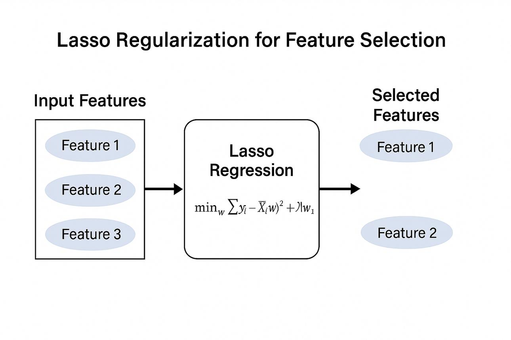
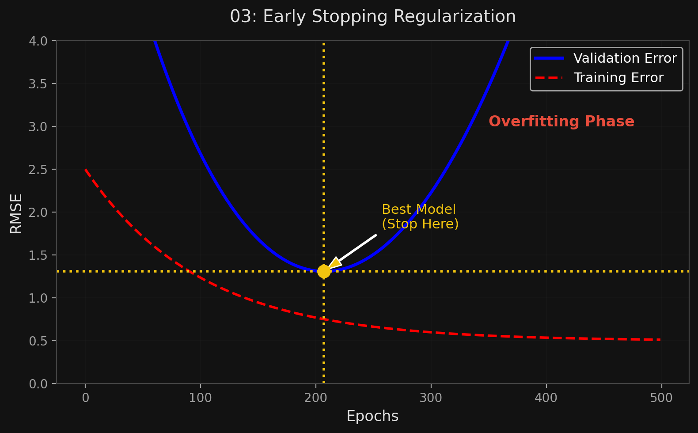

# 🏷️ Module 4: Regularized Linear Models
> **Ch. 4 — Hands-On ML with Scikit-Learn, Keras & TensorFlow (Aurélien Géron)**

---

## 📌 Table of Contents
1. [Start Here: The Big Picture](#big-picture)
2. [Ridge Regression ($\ell_2$ penalty)](#concept-1)
3. [Lasso Regression ($\ell_1$ penalty)](#concept-2)
4. [Elastic Net](#concept-3)
5. [Early Stopping](#concept-4)
6. [Common Beginner Mistakes](#mistakes)
7. [Interview Q&A](#interview)
8. [⚡ One-Page Flash Card](#revision)

---

## 🌍 Start Here: The Big Picture {#big-picture}

> **TL;DR:** To prevent a model from overfitting (high variance), we must **constrain** it (regularize it). For linear models, regularization means forcing the model weights ($\theta$) to be as small as possible. We do this by adding a penalty term to the cost function during training.
> *   **Ridge:** Adds $\ell_2$ penalty (squares of weights). Smoothly shrinks weights.
> *   **Lasso:** Adds $\ell_1$ penalty (absolute weights). Forces weights to exactly zero (feature selection).
> *   **Elastic Net:** A customizable mix of both.

---

## 🔍 1. Ridge Regression ($\ell_2$ Penalty) {#concept-1}

Also called *Tikhonov regularization*. We add a regularization term equal to $\alpha \sum_{i=1}^n \theta_i^2$ to the MSE cost function.

**The Objective:** Force the learning algorithm to not only fit the data, but also keep the model weights as small as possible.

**Cost Function:**
$$J(\theta) = \text{MSE}(\theta) + \alpha \frac{1}{2} \sum_{i=1}^n \theta_i^2$$

*   The hyperparameter **$\alpha$** controls how much you want to regularize.
*   $\alpha = 0 \rightarrow$ Plain Linear Regression.
*   $\alpha \rightarrow \infty \rightarrow$ All weights become close to 0 (flat horizontal line going through the data's mean).
*   **NOTE:** The bias term $\theta_0$ is NEVER regularized (the sum starts at $i=1$).

> [!WARNING]
> **Scaling is Mandatory!** Ridge regression is highly sensitive to the scale of the input features. If you don't scale (e.g., using `StandardScaler`), features with larger ranges will be penalized unfairly.

**Scikit-Learn Implementation (Closed-form Cholesky vs SGD):**
```python
from sklearn.linear_model import Ridge
from sklearn.linear_model import SGDRegressor

# Exact math solution
ridge_reg = Ridge(alpha=1, solver="cholesky")
ridge_reg.fit(X, y)

# Iterative solution (SGD with L2 penalty)
sgd_reg = SGDRegressor(penalty="l2")
sgd_reg.fit(X, y.ravel())
```

---

## 🔍 2. Lasso Regression ($\ell_1$ Penalty) {#concept-2}

**L**east **A**bsolute **S**hrinkage and **S**election **O**perator Regression.
Uses the $\ell_1$ norm (absolute values) instead of the $\ell_2$ norm (squares).

**Cost Function:**
$$J(\theta) = \text{MSE}(\theta) + \alpha \sum_{i=1}^n |\theta_i|$$

**The Magic of Lasso (Sparse Models):**
Lasso Regression tends to **eliminate the weights of the least important features** (sets them to exactly zero). 
*   In other words, Lasso automatically performs **feature selection** and outputs a *sparse model* (few non-zero weights).
*   Why? The $\ell_1$ penalty gradient pushes parameters directly toward 0, whereas $\ell_2$ gradient just shrinks them proportionally, slowing down as they approach 0 but never reaching it.

**Geometric Intuition (Why L1 Gives Sparsity):**
*   L2 (Ridge) constraint region = a **circle** (sphere in higher dimensions). The cost function's contours will first touch the circle at an arbitrary point — rarely on an axis.
*   L1 (Lasso) constraint region = a **diamond** (rotated square). The cost function's contours will first touch the diamond at a **corner** — which lies on an axis where one or more parameters = 0.
*   This is why Lasso naturally produces zero weights while Ridge only shrinks them.



**Scikit-Learn Implementation:**
```python
from sklearn.linear_model import Lasso

lasso_reg = Lasso(alpha=0.1)
lasso_reg.fit(X, y)

# Or using SGD:
# SGDRegressor(penalty="l1")
```

---

## 🔍 3. Elastic Net {#concept-3}

Elastic Net is a middle ground between Ridge and Lasso. It mixes their regularization terms.

$$J(\theta) = \text{MSE}(\theta) + r \alpha \sum_{i=1}^n |\theta_i| + \frac{1 - r}{2} \alpha \sum_{i=1}^n \theta_i^2$$

*   The mix ratio is $r$ (called `l1_ratio` in Scikit-Learn).
*   $r = 0 \rightarrow$ Ridge
*   $r = 1 \rightarrow$ Lasso

**When should you use which?**
1.  **Avoid plain Linear Regression.** Almost always use at least a little bit of regularization.
2.  **Ridge:** Good default.
3.  **Lasso:** Use if you suspect that only a few features are actually useful (it will eliminate the rest).
4.  **Elastic Net:** **Preferred over Lasso**. Lasso can behave erratically when the number of features > number of instances, or when features are highly correlated. Elastic Net stabilizes this.

```python
from sklearn.linear_model import ElasticNet
elastic_net = ElasticNet(alpha=0.1, l1_ratio=0.5)
elastic_net.fit(X, y)
```

---

## 🔍 4. Early Stopping {#concept-4}

A completely different (and incredibly simple) way to regularize iterative algorithms like Gradient Descent.

**How it works:**
Just stop training as soon as the validation error reaches its minimum!

1. As epochs go by, training error drops.
2. Validation error drops too, but eventually bottoms out.
3. If training continues, validation error starts going back *up* (the model is now overfitting).
4. **Early Stopping:** Stop the exact moment validation error hits rock bottom.

Geoffrey Hinton called this a **"beautiful free lunch."**


> 📊 **Graph 03:** Early Stopping Regularization

```python
from sklearn.base import clone

# Warm-start SGD for manual early stopping
sgd_reg = SGDRegressor(max_iter=1, tol=-np.infty, warm_start=True,
                        penalty=None, learning_rate="constant", eta0=0.0005)

minimum_val_error = float("inf")
best_epoch = None
best_model = None

for epoch in range(1000):
    sgd_reg.fit(X_train_poly_scaled, y_train)  # continues where it left off
    y_val_predict = sgd_reg.predict(X_val_poly_scaled)
    val_error = mean_squared_error(y_val, y_val_predict)
    if val_error < minimum_val_error:
        minimum_val_error = val_error
        best_epoch = epoch
        best_model = clone(sgd_reg)
```

> [!TIP]
> In practice, you often add a **patience** parameter: only stop if the validation error hasn't improved for N consecutive epochs. This avoids stopping too early due to temporary fluctuations.

---

## ❌ Common Beginner Mistakes {#mistakes}

**1. "Evaluating the model on the test set using the regularized cost function"** ❌
> The regularization term (the penalty) is ONLY added to the cost function *during training* to constrain the weights. When evaluating the model's final performance (testing/validation), you MUST use the unregularized performance measure (e.g., plain MSE or RMSE).

**2. "Regularizing the bias term"** ❌
> The bias term ($\theta_0$) controls the height/intercept of the line, not the steepness/complexity of the curve. Regularizing it makes the model artificially predict lower values, which introduces severe bias. Scikit-Learn automatically excludes the bias term from the penalty, but you must remember this if implementing from scratch.

---

## 🎤 Interview Q&A {#interview}

**Q1: What is the mathematical and practical difference between Ridge ($\ell_2$) and Lasso ($\ell_1$) regression?**
> **A:**
> *   **Mathematically:** Ridge adds the sum of *squared* weights ($\ell_2$ norm) to the cost function. Lasso adds the sum of *absolute* weights ($\ell_1$ norm). 
> *   **Practically:** The squared penalty in Ridge smoothly shrinks all weights toward zero, but never quite reaches exactly zero. The absolute penalty in Lasso pushes weights linearly and forcefully to exactly zero. Therefore, Lasso automatically performs **feature selection**, yielding a sparse model with only the most important features. Ridge keeps all features but shrinks their influence.

**Q2: You have a dataset where you suspect 90% of the features are completely useless noise. Which regularized linear model should you use and why?**
> **A:**
> You should use **Lasso Regression** or **Elastic Net**. Because Lasso uses the $\ell_1$ norm, it naturally drives the weights of the useless features to exactly zero, effectively dropping them from the model. Ridge would keep all the useless features (with tiny weights), leaving a noisy model. If there are strongly correlated features among the useless ones, Elastic Net is even better to avoid erratic behavior while still performing feature selection.

---

## ⚡ One-Page Flash Card {#revision}

```
╔══════════════════════════════════════════════════════════════════╗
║  MODULE 4 FLASH CARD — Regularized Linear Models                 ║
╠══════════════════════════════════════════════════════════════════╣
║  WHY REGULARIZE?                                                 ║
║  Constrain weights to prevent overfitting (reduce variance).     ║
║  MUST scale data first! Bias (theta_0) is never regularized.     ║
║                                                                  ║
║  RIDGE (L2 Penalty):                                             ║
║  - Adds sum of squared weights to cost function.                 ║
║  - Good default. Shrinks weights smoothly.                       ║
║                                                                  ║
║  LASSO (L1 Penalty):                                             ║
║  - Adds sum of absolute weights to cost function.                ║
║  - Forces weights to EXACTLY ZERO. Output is a sparse model.     ║
║  - Built-in feature selection.                                   ║
║                                                                  ║
║  ELASTIC NET:                                                    ║
║  - Mix of Ridge & Lasso (controlled by r ratio).                 ║
║  - Preferred over pure Lasso (more stable with correlated data). ║
║                                                                  ║
║  EARLY STOPPING:                                                 ║
║  - Stop GD the moment validation error stops dropping.           ║
╚══════════════════════════════════════════════════════════════════╝
```

---

---

**🔗 Previous Module →** [03_Polynomial_Regression_Learning_Curves.md](03_Polynomial_Regression_Learning_Curves.md)  
**🔗 Next Module →** [05_Logistic_Softmax_Regression.md](05_Logistic_Softmax_Regression.md)
