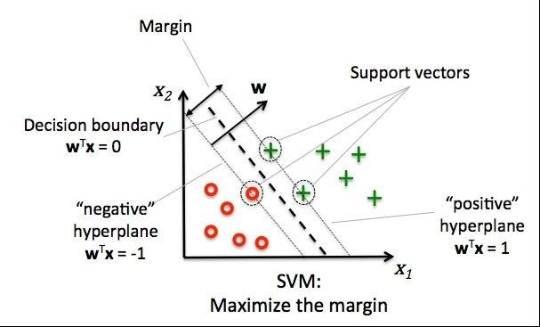
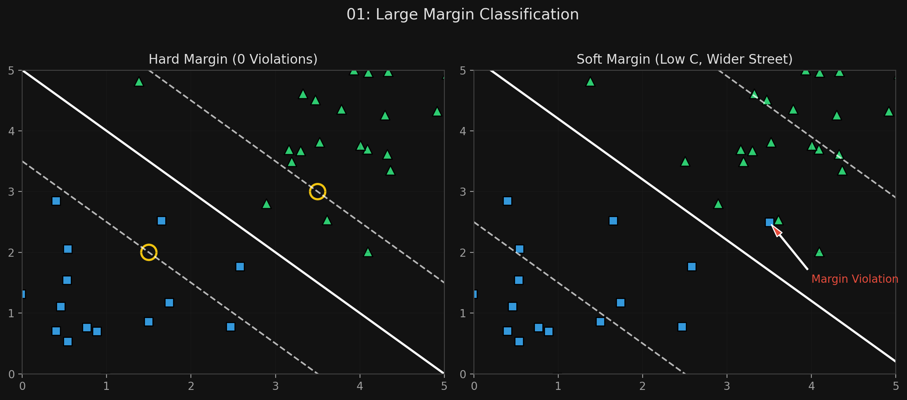
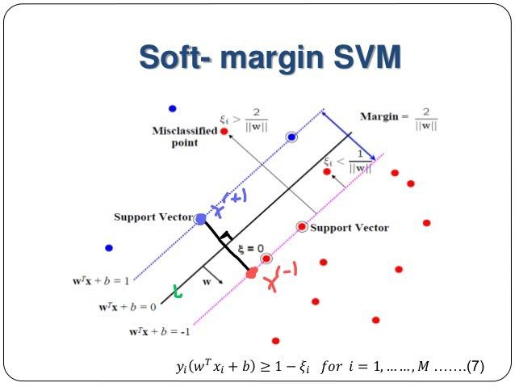

# 🏷️ Module 1: Linear SVM Classification & The Large Margin
> **Ch. 5 — Hands-On ML with Scikit-Learn, Keras & TensorFlow (Aurélien Géron)**

---

## 📌 Table of Contents
1. [Start Here: The Big Picture](#big-picture)
2. [The "Widest Street" Analogy (Hard Margin)](#concept-1)
3. [Sensitivity to Feature Scales](#concept-2)
4. [Soft Margin Classification (The C Hyperparameter)](#concept-3)
5. [Common Beginner Mistakes](#mistakes)
6. [Interview Q&A](#interview)
7. [⚡ One-Page Flash Card](#revision)

---

## 🌍 Start Here: The Big Picture {#big-picture}

> **TL;DR:** Support Vector Machines (SVMs) are incredibly powerful models used for classification, regression, and outlier detection. Instead of just finding *any* line that separates two classes (like Logistic Regression), an SVM tries to find the line that leaves the **widest possible margin** (street) between the classes. This makes the model highly robust and great for generalizing to new data.

---

## 🔍 1. The "Widest Street" Analogy (Hard Margin) {#concept-1}

If a dataset is linearly separable (you can draw a straight line between the two classes), you could draw infinite lines that work. But some lines come very close to the data points, meaning new unseen data might accidentally fall on the wrong side.

**Large Margin Classification:**
An SVM classifier thinks of the boundary as a **street**. It tries to fit the widest possible street between the classes.
*   The street is fully determined (supported) by the instances located exactly on the edge of the street.
*   These edge instances are called **Support Vectors**.
*   Adding more training data *off the street* will not affect the decision boundary at all! Only the support vectors matter.



**Hard Margin:**
When we strictly impose that *all* instances must be completely off the street and on the correct side, it is called a **Hard Margin**.
*   **Problem 1:** It only works if the data is perfectly linearly separable.
*   **Problem 2:** It is extremely sensitive to outliers. A single outlier can make the street tiny or impossible to draw.

---

## 🔍 2. Sensitivity to Feature Scales {#concept-2}

SVMs rely on calculating the distance between data points to draw the widest street. If the features are on wildly different scales, the "distance" will be completely dominated by the larger feature.

*   If $x_1$ ranges from 0-1 and $x_2$ ranges from 0-1000, the widest street will just be a nearly horizontal line cutting across $x_2$.
*   **Mandatory Rule:** You MUST scale the data (e.g., using `StandardScaler`) before training an SVM.


> 📊 **Graph 01:** Large Margin Classification & Soft Margins

---

## 🔍 3. Soft Margin Classification (The C Hyperparameter) {#concept-3}

To fix the issues with Hard Margins (outliers ruining the model), we use a **Soft Margin**. 
The goal is to find a balance between:
1.  Keeping the street as wide as possible.
2.  Limiting **margin violations** (instances that end up in the middle of the street, or even on the wrong side).



**The $C$ Hyperparameter:**
In Scikit-Learn, this balance is controlled by $C$.
*   **Low $C$:** The model is highly regularized. It allows *many* margin violations to get a much wider street. (Higher Bias, Lower Variance).
*   **High $C$:** The model is strictly penalized for violations. It forces a narrow street to avoid margin violations. (Lower Bias, Higher Variance).

> [!TIP]
> If your SVM model is overfitting, you can try regularizing it by **reducing $C$**.

**Scikit-Learn Implementation:**
```python
import numpy as np
from sklearn import datasets
from sklearn.pipeline import Pipeline
from sklearn.preprocessing import StandardScaler
from sklearn.svm import LinearSVC

iris = datasets.load_iris()
X = iris["data"][:, (2, 3)]  # petal length, petal width
y = (iris["target"] == 2).astype(np.float64)  # Iris virginica (binary)

svm_clf = Pipeline([
    ("scaler", StandardScaler()),
    # loss="hinge" is not the default, but standard for SVMs
    ("linear_svc", LinearSVC(C=1, loss="hinge")),
])

svm_clf.fit(X, y)
svm_clf.predict([[5.5, 1.7]])  # array([1.])
```

> [!NOTE]
> Unlike Logistic Regression, SVM classifiers do NOT output probabilities for each class (no `predict_proba()` method by default). They just output the class based on which side of the boundary the instance falls.

> [!TIP]
> **Alternative for large datasets:** `SGDClassifier(loss="hinge")` is mathematically equivalent to a linear SVM trained with SGD. It's much faster on large datasets and supports out-of-core learning. Similarly, `SGDClassifier(loss="log_loss")` gives you Logistic Regression via SGD. This makes SGDClassifier extremely versatile.

---

## ❌ Common Beginner Mistakes {#mistakes}

**1. "Forgetting to scale the features before training"** ❌
> SVMs are distance-based algorithms. Without `StandardScaler`, features with larger numerical ranges will dominate the margin calculation, resulting in a terrible decision boundary.

**2. "Increasing C to reduce overfitting"** ❌
> It's the exact opposite of Ridge/Lasso's $\alpha$. A smaller $C$ leads to a wider street (more regularization/generalization). If your model is overfitting, you must **decrease $C$**, not increase it.

---

## 🎤 Interview Q&A {#interview}

**Q1: What is a Support Vector?**
> **A:**
> In an SVM, the decision boundary (the "street") is entirely determined by the data points that lie exactly on the edges of the margin (and the margin violations). These critical instances are called Support Vectors. Any instances that lie comfortably away from the boundary (off the street) have zero influence on the model. You could delete them and the boundary would not change.

**Q2: What is the difference between Hard Margin and Soft Margin classification?**
> **A:**
> Hard Margin classification strictly requires every single training instance to be on the correct side of the boundary, with absolutely zero margin violations. It only works on perfectly linearly separable data and breaks completely if there is even one outlier. Soft Margin classification solves this by allowing a controlled number of margin violations (instances inside the street or on the wrong side) to achieve a wider, more robust margin that generalizes better. The trade-off is controlled by the hyperparameter $C$.

---

## ⚡ One-Page Flash Card {#revision}

```
╔══════════════════════════════════════════════════════════════════╗
║  MODULE 1 FLASH CARD — Linear SVM Classification                 ║
╠══════════════════════════════════════════════════════════════════╣
║  CORE CONCEPT:                                                   ║
║  Draw the "widest possible street" between two classes.          ║
║  The street edges are supported ONLY by the Support Vectors.     ║
║                                                                  ║
║  CRITICAL REQUIREMENT:                                           ║
║  You MUST scale the features (StandardScaler) first!             ║
║                                                                  ║
║  HARD MARGIN VS SOFT MARGIN:                                     ║
║  - Hard Margin: 0 violations allowed. Fails on outliers.         ║
║  - Soft Margin: Allows violations for a wider, better street.    ║
║                                                                  ║
║  THE C HYPERPARAMETER (Controls Regularization):                 ║
║  - Low C = More regularization, wider street, more violations.   ║
║  - High C = Less regularization, narrower street, strictly fits. ║
║  - If overfitting → Reduce C.                                    ║
╚══════════════════════════════════════════════════════════════════╝
```

---

---

**🔗 Previous Module →** [Back to Chapter Index](../notes.md)  
**🔗 Next Module →** [02_Nonlinear_SVM_Kernel_Trick.md](02_Nonlinear_SVM_Kernel_Trick.md)
