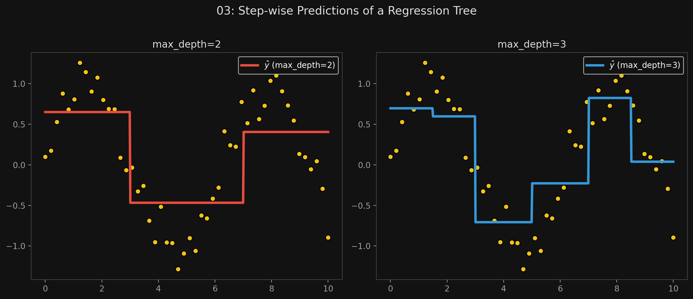

# 🏷️ Module 3: Regression Trees
> **Ch. 6 — Hands-On ML with Scikit-Learn, Keras & TensorFlow (Aurélien Géron)**

---

## 📌 Table of Contents
1. [Start Here: The Big Picture](#big-picture)
2. [How Regression Trees Predict Values](#concept-1)
3. [The CART Cost Function for Regression](#concept-2)
4. [Regularizing Regression Trees](#concept-3)
5. [Common Beginner Mistakes](#mistakes)
6. [Interview Q&A](#interview)
7. [⚡ One-Page Flash Card](#revision)

---

## 🌍 Start Here: The Big Picture {#big-picture}

> **TL;DR:** Decision Trees aren't just for classification; they can predict continuous numbers too! Instead of predicting the most frequent class in a leaf node, a Regression Tree predicts the **average target value** of all the training instances that fall into that leaf node. It creates a prediction line that looks like a series of flat, stair-step plateaus.

---

## 🔍 1. How Regression Trees Predict Values {#concept-1}

To build a Regression Tree, we use Scikit-Learn's `DecisionTreeRegressor`.

```python
from sklearn.tree import DecisionTreeRegressor

tree_reg = DecisionTreeRegressor(max_depth=2)
tree_reg.fit(X, y)
```

**Traversing the tree:**
1.  Just like classification, a new instance traverses the tree by answering True/False questions based on feature thresholds (e.g., $x_1 \le 0.197$).
2.  It eventually reaches a leaf node.
3.  **The Prediction:** The predicted value is simply the **average target value** of the training instances associated with that leaf node.

**Visualizing the Predictions:**
If you plot the predictions of a regression tree across a single feature ($x_1$), the prediction line does not look like a smooth curve or a straight slanted line. It looks like a series of flat horizontal steps (plateaus).
*   The algorithm splits regions so that most training instances are as close as possible to the average predicted value of that region.


> 📊 **Graph 03:** Step-wise Predictions of a Regression Tree

---

## 🔍 2. The CART Cost Function for Regression {#concept-2}

The CART algorithm works exactly the same way as it does for classification, except the goal changes:
*   **Classification:** Split the data to minimize *Impurity* (Gini/Entropy).
*   **Regression:** Split the data to minimize *Mean Squared Error (MSE)*.

**The Equation:**
$$J(k, t_k) = \frac{m_{\text{left}}}{m} \text{MSE}_{\text{left}} + \frac{m_{\text{right}}}{m} \text{MSE}_{\text{right}}$$

where:
$$\text{MSE}_{\text{node}} = \frac{1}{m_{\text{node}}} \sum_{i \in \text{node}} (\hat{y}_{\text{node}} - y^{(i)})^2$$
$$\hat{y}_{\text{node}} = \frac{1}{m_{\text{node}}} \sum_{i \in \text{node}} y^{(i)}$$

*   *Translation:* The algorithm searches for the threshold that splits the data into two regions, where the instances inside each region are as close to their own region's average as possible.

---

## 🔍 3. Regularizing Regression Trees {#concept-3}

Just like classification trees, Regression Trees are incredibly prone to overfitting.
If you use the default hyperparameters (no restrictions), the tree will grow until every leaf contains exactly 1 training instance. 
*   The result is a model that perfectly memorizes the training data. The prediction line will wildly zig-zag to hit every single point perfectly, completely failing to capture the underlying trend.

**The Fix:**
You must use regularization hyperparameters. For example, simply setting `min_samples_leaf=10` forces the tree to ensure at least 10 instances are averaged together to make a prediction, creating a much smoother, generalized model.

---

## ❌ Common Beginner Mistakes {#mistakes}

**1. "Expecting a Decision Tree to extrapolate beyond the training data"** ❌
> If you train a Regression Tree on data where $x$ goes from 0 to 10, and then ask it to predict the value for $x = 20$, the tree will simply drop the instance into the furthest right leaf node and predict the exact same flat value it predicted for $x = 10$. Decision Trees **cannot extrapolate** trends outside their training bounds (unlike Linear Regression).

**2. "Using a Regression Tree for a problem that requires a perfectly smooth output"** ❌
> Regression trees output flat step-wise plateaus. If you are predicting something that requires a smooth continuous gradient (like audio waveforms or smooth physics trajectories), a single tree will produce a jagged, stair-step output.

---

## 🎤 Interview Q&A {#interview}

**Q1: How does a DecisionTreeRegressor make a numerical prediction for a new instance?**
> **A:**
> It traverses the tree using the feature thresholds until it reaches a leaf node. The prediction is calculated by taking the average (mean) target value of all the training instances that fell into that specific leaf node during training. 

**Q2: What cost function does the CART algorithm minimize when building a Regression Tree?**
> **A:**
> It minimizes the Mean Squared Error (MSE). At each node, it searches for a feature and a split threshold that divides the data into two subsets such that the weighted sum of the MSE of both subsets is minimized. The MSE for a subset is calculated based on how far each instance is from the average target value of that subset.

---

## ⚡ One-Page Flash Card {#revision}

```
╔══════════════════════════════════════════════════════════════════╗
║  MODULE 3 FLASH CARD — Regression Trees                          ║
╠══════════════════════════════════════════════════════════════════╣
║  THE PREDICTION:                                                 ║
║  - Traverses the tree to a leaf node.                            ║
║  - Predicts the AVERAGE value of training instances in that leaf.║
║  - Visual output: Flat, stair-step plateaus. Cannot extrapolate. ║
║                                                                  ║
║  THE COST FUNCTION:                                              ║
║  - Classification minimizes Impurity (Gini).                     ║
║  - Regression minimizes Mean Squared Error (MSE).                ║
║  - Tries to group instances with similar values together.        ║
║                                                                  ║
║  REGULARIZATION:                                                 ║
║  - Without restrictions, it perfectly memorizes every point      ║
║    (extreme overfitting).                                        ║
║  - Must set min_samples_leaf (e.g., = 10) to force averaging     ║
║    and smooth out the predictions.                               ║
╚══════════════════════════════════════════════════════════════════╝
```

---

---

**🔗 Previous Module →** [02_CART_Algorithm_and_Regularization.md](02_CART_Algorithm_and_Regularization.md)  
**🔗 Next Module →** [04_Limitations_and_Instability.md](04_Limitations_and_Instability.md)
