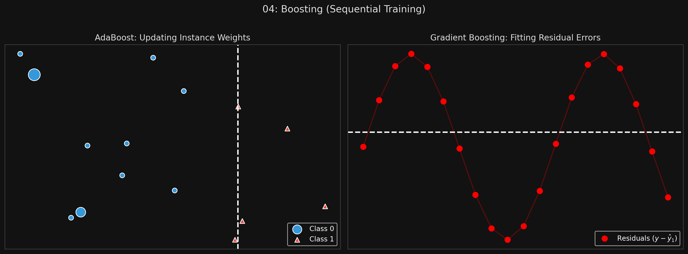

# 🏷️ Module 4: Boosting (AdaBoost & Gradient Boosting)
> **Ch. 7 — Hands-On ML with Scikit-Learn, Keras & TensorFlow (Aurélien Géron)**

---

## 📌 Table of Contents
1. [Start Here: The Big Picture](#big-picture)
2. [AdaBoost (Adaptive Boosting)](#concept-1)
3. [Gradient Boosting (GBRT)](#concept-2)
4. [Shrinkage & Early Stopping](#concept-3)
5. [XGBoost](#concept-4)
6. [Common Beginner Mistakes](#mistakes)
7. [Interview Q&A](#interview)
8. [⚡ One-Page Flash Card](#revision)

---

## 🌍 Start Here: The Big Picture {#big-picture}

> **TL;DR:** While Bagging builds models independently in parallel, **Boosting** builds models *sequentially*. Each new predictor is specifically trained to correct the mistakes made by its predecessor. By chaining together hundreds of weak learners, the ensemble gradually converges into a single, incredibly strong learner. The two most famous algorithms are AdaBoost and Gradient Boosting (including XGBoost).

---

## 🔍 1. AdaBoost (Adaptive Boosting) {#concept-1}

How does a new predictor correct the predecessor's mistakes? In AdaBoost, it does this by paying more attention to the training instances that were previously misclassified.

**The Process:**
1.  Train a base classifier (usually a Decision Stump: a tree with max depth 1).
2.  Evaluate predictions. Increase the relative weight of the training instances that it got wrong.
3.  Train a *second* classifier using the updated weights. It will naturally focus more on the hard cases.
4.  Repeat. Each subsequent predictor focuses harder and harder on the instances the previous predictors failed on.
5.  *Prediction Phase:* The ensemble casts a weighted majority vote (predictors that had high accuracy get a larger voice).

**The Major Drawback:**
Because each predictor requires the previous one to finish training and updating weights, **AdaBoost cannot be parallelized**. It does not scale as well as Bagging (Random Forests).

```python
from sklearn.ensemble import AdaBoostClassifier

# SAMME.R relies on class probabilities and performs better than standard SAMME
ada_clf = AdaBoostClassifier(
    DecisionTreeClassifier(max_depth=1), n_estimators=200,
    algorithm="SAMME.R", learning_rate=0.5
)
```
*(If AdaBoost overfits, reduce the number of estimators or regularize the base estimator).*


> 📊 **Graph 04:** AdaBoost updating instance weights vs Gradient Boosting fitting residuals

---

## 🔍 2. Gradient Boosting (GBRT) {#concept-2}

Gradient Boosting also works sequentially, but instead of tweaking instance *weights*, it trains the new predictor to fit the **residual errors** made by the previous predictor.

**The Process (Gradient Boosted Regression Trees):**
1.  Train Tree 1 on the target $y$.
2.  Calculate the residual errors ($y - \hat{y}_1$).
3.  Train Tree 2 to predict the *residual errors*.
4.  Calculate the new residual errors ($y - (\hat{y}_1 + \hat{y}_2)$).
5.  Train Tree 3 to predict the *new residual errors*.
6.  *Prediction Phase:* Simply add up the predictions of all the trees! $y_{\text{pred}} = \hat{y}_1 + \hat{y}_2 + \hat{y}_3 \dots$

```python
from sklearn.ensemble import GradientBoostingRegressor

gbrt = GradientBoostingRegressor(max_depth=2, n_estimators=3, learning_rate=1.0)
```

> [!IMPORTANT]
> **In practice, you'll almost always use one of these optimized libraries instead of Scikit-Learn's `GradientBoostingRegressor`:**
> - **XGBoost** (eXtreme Gradient Boosting): The Kaggle champion. Supports regularization, GPU training, missing value handling, and parallel tree construction.
> - **LightGBM** (Microsoft): Uses histogram-based algorithms for faster training. Grows trees leaf-wise (not level-wise) for better accuracy.
> - **CatBoost** (Yandex): Handles categorical features natively without one-hot encoding. Less tuning required.
> All three are dramatically faster than Scikit-Learn's implementation and support early stopping out of the box.

---

## 🔍 3. Shrinkage & Early Stopping {#concept-3}

The `learning_rate` hyperparameter scales the contribution of each tree. 
*   If you set it low (e.g., $0.1$), you will need more trees in the ensemble to fit the data, but the predictions will usually generalize better. 
*   This regularization technique is called **Shrinkage**.

**Finding the Optimal Number of Trees (Early Stopping):**
If you have too many trees, Gradient Boosting will overfit the training set. You can use early stopping to find the exact perfect number of trees.

```python
# Using warm_start=True allows incremental training
gbrt = GradientBoostingRegressor(max_depth=2, warm_start=True)

min_val_error = float("inf")
error_going_up = 0

for n_estimators in range(1, 120):
    gbrt.n_estimators = n_estimators
    gbrt.fit(X_train, y_train)
    y_pred = gbrt.predict(X_val)
    val_error = mean_squared_error(y_val, y_pred)
    
    if val_error < min_val_error:
        min_val_error = val_error
        error_going_up = 0
    else:
        error_going_up += 1 # The validation error is getting worse! Overfitting has begun.
        if error_going_up == 5:
            break # Stop training early!
```

---

## 🔍 4. XGBoost {#concept-4}

**XGBoost (Extreme Gradient Boosting)** is an incredibly popular, optimized, and highly scalable Python implementation of Gradient Boosting. It is famously used in winning Kaggle competition entries.

It offers several amazing features, including automatic early stopping built directly into the API!

```python
import xgboost

xgb_reg = xgboost.XGBRegressor()
xgb_reg.fit(X_train, y_train,
            eval_set=[(X_val, y_val)], 
            early_stopping_rounds=2) # Stops automatically if val error doesn't improve for 2 rounds!

y_pred = xgb_reg.predict(X_val)
```
> [!TIP]
> **Use XGBoost!** If you need Gradient Boosting in production or for a competition, skip Scikit-Learn and use XGBoost.

---

## ❌ Common Beginner Mistakes {#mistakes}

**1. "Setting `n_jobs=-1` on AdaBoost or GradientBoosting and wondering why it's not training faster"** ❌
> Bagging ensembles (Random Forests) train models independently, so they can use multiple CPU cores perfectly. Boosting ensembles train models *sequentially*. Tree 2 cannot start training until Tree 1 is completely finished. Therefore, traditional boosting cannot be parallelized across trees. (Note: XGBoost *does* parallelize the node-splitting math within individual trees, which is why it's so fast).

**2. "Using a deep Decision Tree as a base estimator for AdaBoost"** ❌
> Boosting relies on chaining together *weak learners*. If you use a deep, unregularized Decision Tree, the first model will instantly overfit the training data and get an error rate of 0. The subsequent models will have no errors to correct, destroying the boosting algorithm. AdaBoost almost exclusively uses "Decision Stumps" (trees with max_depth=1).

---

## 🎤 Interview Q&A {#interview}

**Q1: What is the fundamental difference between how Bagging and Boosting handle training instances?**
> **A:**
> Bagging generates independent models by training them on random subsets of the data in parallel, treating all instances equally. Boosting trains models sequentially. At each step, Boosting actively alters the dataset for the next model—either by increasing the weights of misclassified instances (AdaBoost) or by replacing the target labels with the residual errors of the previous model (Gradient Boosting).

**Q2: What is "Shrinkage" in the context of Gradient Boosting?**
> **A:**
> Shrinkage is a regularization technique where the contribution of each newly added tree is scaled down by a factor called the learning rate (e.g., 0.1). Instead of adding 100% of the tree's prediction to the ensemble, we only add 10%. This forces the algorithm to use more trees and learn more slowly, which prevents it from rapidly overfitting the training data and leads to much better generalization.

---

## ⚡ One-Page Flash Card {#revision}

```
╔══════════════════════════════════════════════════════════════════╗
║  MODULE 4 FLASH CARD — Boosting & XGBoost                        ║
╠══════════════════════════════════════════════════════════════════╣
║  THE CONCEPT:                                                    ║
║  Train weak learners SEQUENTIALLY. Each one fixes the mistakes   ║
║  made by the previous one. Cannot be parallelized across trees.  ║
║                                                                  ║
║  ADABOOST:                                                       ║
║  - Updates instance WEIGHTS. Misclassified points get heavier.   ║
║  - Next tree focuses on the heavier, harder points.              ║
║                                                                  ║
║  GRADIENT BOOSTING:                                              ║
║  - Fits the new tree to the RESIDUAL ERRORS of the old tree.     ║
║  - Final prediction = sum of all trees.                          ║
║  - Shrinkage: Use a low learning rate to regularize it.          ║
║                                                                  ║
║  XGBOOST:                                                        ║
║  - Extreme Gradient Boosting. Highly optimized, handles early    ║
║    stopping automatically. Industry standard for tabular data.   ║
╚══════════════════════════════════════════════════════════════════╝
```

---

---

**🔗 Previous Module →** [03_Random_Forests_and_Extra_Trees.md](03_Random_Forests_and_Extra_Trees.md)  
**🔗 Next Module →** [05_Stacking.md](05_Stacking.md)
