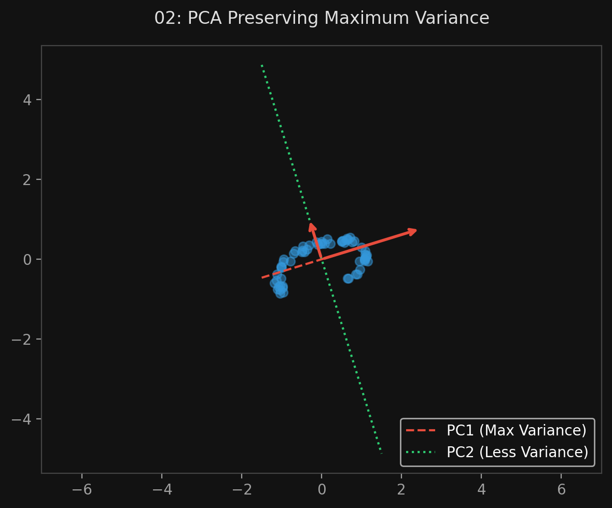
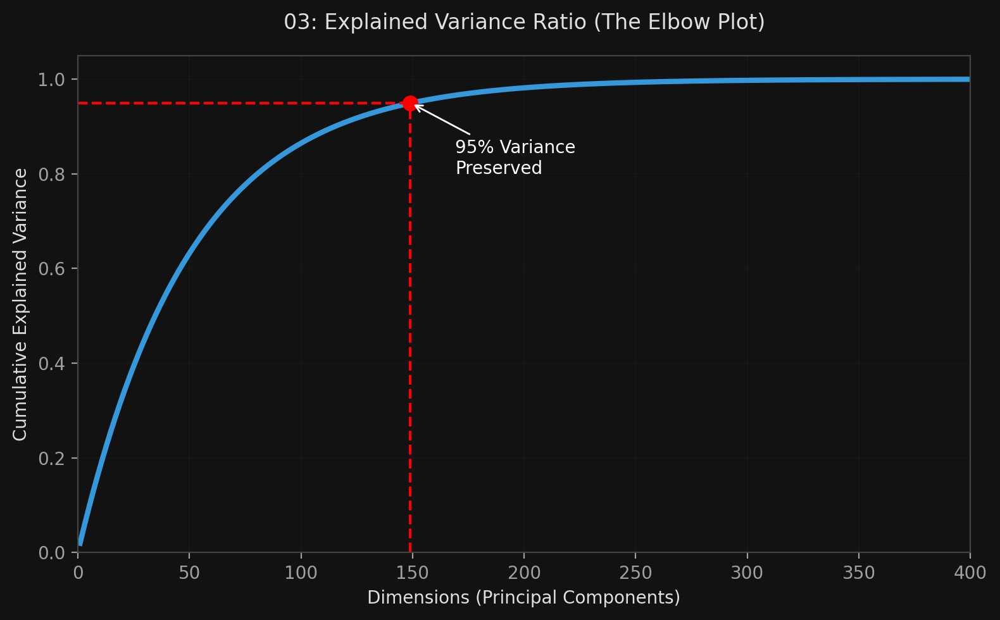

# 🏷️ Module 2: Principal Component Analysis (PCA)
> **Ch. 8 — Hands-On ML with Scikit-Learn, Keras & TensorFlow (Aurélien Géron)**

---

## 📌 Table of Contents
1. [Start Here: The Big Picture](#big-picture)
2. [Preserving the Variance](#concept-1)
3. [Principal Components & SVD](#concept-2)
4. [Using Scikit-Learn](#concept-3)
5. [Explained Variance Ratio](#concept-4)
6. [Common Beginner Mistakes](#mistakes)
7. [Interview Q&A](#interview)
8. [⚡ One-Page Flash Card](#revision)

---

## 🌍 Start Here: The Big Picture {#big-picture}

> **TL;DR:** **PCA (Principal Component Analysis)** is the most popular dimensionality reduction algorithm in the world. It uses the Projection approach. It looks at your data, finds the axis (the line) where the data is spread out the most (maximum variance), and projects the data onto that axis. By doing this, it throws away dimensions that don't contain much information, keeping only the "Principal Components" that matter most.

---

## 🔍 1. Preserving the Variance {#concept-1}

Before you can project a 3D dataset down to 2D, you have to choose which 2D plane to project it onto. How do you choose?

**The Rule:** You must select the axis that preserves the **maximum amount of variance**. 
*   Imagine a cigar-shaped cluster of data points. If you project them onto an axis that runs lengthwise down the cigar, the points remain spread out (high variance). You keep a lot of information.
*   If you project them onto an axis that cuts sideways across the cigar, all the points get squashed into a tiny dot. You lose all the information.

Mathematically, choosing the axis that preserves maximum variance is identical to choosing the axis that *minimizes the mean squared distance* between the original dataset and its projection.


> 📊 **Graph 02:** Selecting the projection axis that preserves maximum variance

---

## 🔍 2. Principal Components & SVD {#concept-2}

PCA identifies the axes that account for the largest amount of variance:
1.  **1st Principal Component (PC):** The axis that holds the absolute most variance.
2.  **2nd PC:** The axis *orthogonal* (perpendicular) to the 1st PC that holds the largest remaining variance.
3.  **3rd PC:** The axis orthogonal to both the 1st and 2nd PCs... and so on.

**How does it find them? Singular Value Decomposition (SVD)**
Under the hood, PCA uses a standard matrix factorization math trick called SVD. SVD decomposes the training set matrix $X$ into three matrices: $U \Sigma V^T$. 
*   The matrix $V$ contains all the unit vectors that define the Principal Components!

*(Note: PCA strictly assumes that the dataset is centered around the origin. If you code it from scratch, you must subtract the mean. Scikit-Learn does this automatically).*

> [!CAUTION]
> **PCA is NOT regularization.** A common anti-pattern is applying PCA to reduce overfitting. PCA is an unsupervised technique — it doesn't know the labels, so it may throw away the dimensions that are most predictive! Use proper regularization (Ridge, Dropout) instead. PCA is best for: (1) speeding up training, (2) visualization (reduce to 2-3D), (3) reducing memory usage.

> [!TIP]
> **For visualization**, consider **t-SNE** or **UMAP** instead of PCA. PCA preserves global linear structure but squashes non-linear clusters. t-SNE and UMAP preserve local neighborhood structure, producing much better 2D visualizations of high-dimensional data. Use `sklearn.manifold.TSNE` or the `umap-learn` library.

---

## 🔍 3. Using Scikit-Learn {#concept-3}

Scikit-Learn makes PCA trivial. 

```python
from sklearn.decomposition import PCA

# Reduce dataset down to exactly 2 dimensions
pca = PCA(n_components=2)
X_2D = pca.fit_transform(X)

# You can access the math vectors directly if needed
# print(pca.components_)
```

Instead of arbitrarily guessing how many dimensions to keep (like `n_components=2`), it is much smarter to ask PCA to preserve a specific percentage of the variance. 

```python
# Keep however many dimensions are required to preserve 95% of the variance
pca = PCA(n_components=0.95)
X_reduced = pca.fit_transform(X)
```

---

## 🔍 4. Explained Variance Ratio {#concept-4}

Once fitted, you can ask the PCA object how much "information" (variance) is contained inside each of the Principal Components it found.

```python
print(pca.explained_variance_ratio_)
# Output: array([0.842, 0.146])
```
*   This tells you that 84.2% of the dataset's variance lies along the 1st axis, and 14.6% lies along the 2nd axis. 
*   Combined, the first two PCs hold 98.8% of the information. This means dropping all other dimensions will only lose 1.2% of the original information!

**The Elbow Plot:**
A great way to decide how many dimensions to keep is to plot the cumulative explained variance. The curve will shoot up and then bend (the "elbow"). You want to stop keeping dimensions once the curve stops growing fast.


> 📊 **Graph 03:** The Explained Variance Elbow Plot

---

## ❌ Common Beginner Mistakes {#mistakes}

**1. "Forgetting to scale the data before applying PCA"** ❌
> While Scikit-Learn automatically centers the data (subtracts the mean), it does **not** scale the variance. If Feature A is measured in millimeters (values in the thousands) and Feature B is measured in kilometers (values < 1), PCA will assume Feature A has massive variance and Feature B is useless. You **MUST** run `StandardScaler` before running PCA!

**2. "Assuming the Principal Components have physical meaning"** ❌
> PCA combines features mathematically. If your original features were `height` and `weight`, the 1st Principal Component will be a mathematically optimal combination of the two (e.g., `0.8*height + 0.2*weight`). It is very difficult to explain to a business stakeholder what "Principal Component 1" actually represents in the real world.

---

## 🎤 Interview Q&A {#interview}

**Q1: What does PCA attempt to maximize when selecting a hyperplane for projection?**
> **A:**
> PCA attempts to select the hyperplane that preserves the maximum amount of variance in the dataset. Mathematically, this is identical to selecting the hyperplane that minimizes the mean squared distance between the original data points and their new projected locations on the hyperplane.

**Q2: What is the `explained_variance_ratio_` and how do you use it?**
> **A:**
> It is an array that tells you what proportion of the dataset's total variance (information) lies along each Principal Component axis. You use it to determine how many dimensions to keep. By plotting the cumulative sum of the explained variance ratio, you can find the "elbow" point where adding more dimensions yields rapidly diminishing returns in preserved information.

---

## ⚡ One-Page Flash Card {#revision}

```
╔══════════════════════════════════════════════════════════════════╗
║  MODULE 2 FLASH CARD — PCA (Principal Component Analysis)        ║
╠══════════════════════════════════════════════════════════════════╣
║  THE CONCEPT:                                                    ║
║  - Dimensionality reduction via PROJECTION.                      ║
║  - Finds the axes that preserve MAXIMUM VARIANCE.                ║
║  - Uses Singular Value Decomposition (SVD) math under the hood.  ║
║                                                                  ║
║  THE PRINCIPAL COMPONENTS (PCs):                                 ║
║  - PC1: The axis with the most variance.                         ║
║  - PC2: The orthogonal axis with the next most variance, etc.    ║
║                                                                  ║
║  IMPLEMENTATION TRICKS:                                          ║
║  - YOU MUST USE StandardScaler FIRST!                            ║
║  - Don't guess the number of dimensions. Use n_components=0.95   ║
║    to automatically keep 95% of the variance.                    ║
╚══════════════════════════════════════════════════════════════════╝
```

---

---

**🔗 Previous Module →** [01_Curse_and_Approaches.md](01_Curse_and_Approaches.md)  
**🔗 Next Module →** [03_Advanced_PCA.md](03_Advanced_PCA.md)
