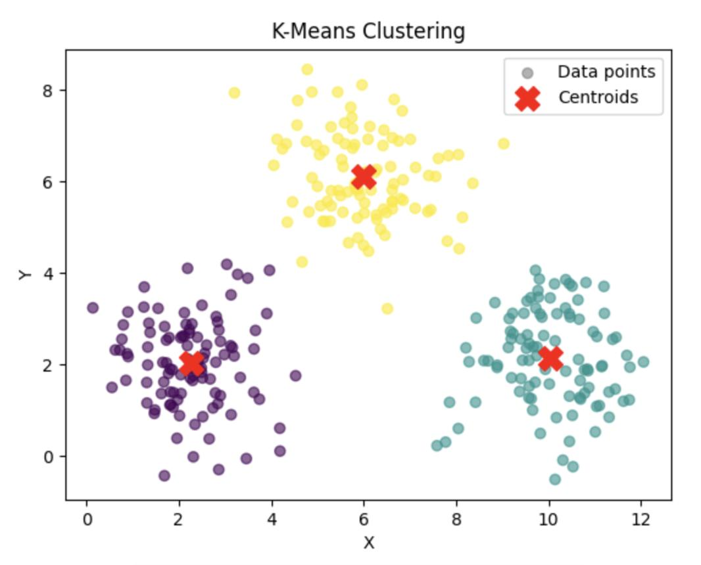
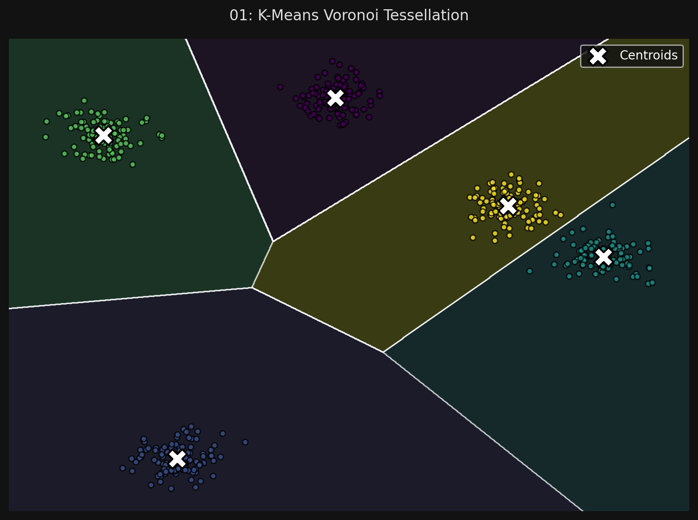

# 🏷️ Module 2: K-Means Clustering
> **Ch. 9 — Hands-On ML with Scikit-Learn, Keras & TensorFlow (Aurélien Géron)**

---

## 📌 Table of Contents
1. [Start Here: The Big Picture](#big-picture)
2. [How K-Means Works (The Algorithm)](#concept-1)
3. [Voronoi Tessellations & Hard vs Soft Clustering](#concept-2)
4. [Centroid Initialization (K-Means++)](#concept-3)
5. [Mini-Batch K-Means](#concept-4)
6. [Common Beginner Mistakes](#mistakes)
7. [Interview Q&A](#interview)
8. [⚡ One-Page Flash Card](#revision)

---

## 🌍 Start Here: The Big Picture {#big-picture}

> **TL;DR:** **K-Means** is the most famous clustering algorithm. If you give it a dataset of unlabeled blobs and tell it to find $k$ clusters, it will quickly place $k$ center points (centroids) into the data, mathematically pulling them towards the center of gravity of each blob. It is incredibly fast and efficient, but it requires you to know how many clusters you are looking for in advance.

---

## 🔍 1. How K-Means Works (The Algorithm) {#concept-1}

If you were given the centroids, assigning data points to clusters would be easy (just measure the distance). If you were given the cluster labels, finding the centroids would be easy (just calculate the mean). But since you start with neither, the algorithm uses a trick:

**The Expectation-Maximization (EM) Trick:**
1.  **Initialize:** Place $k$ centroids completely randomly into the dataset space.
2.  **Label (Expectation):** Assign every single instance in the dataset to the centroid it is currently closest to.
3.  **Update (Maximization):** Calculate the mean (center of gravity) of all the instances in a cluster, and move the centroid exactly to that mean.
4.  **Repeat:** Repeat steps 2 and 3 until the centroids stop moving. 

*(Because the mean squared distance between instances and centroids strictly decreases at every step, the algorithm is mathematically guaranteed to converge. It will never oscillate forever).*

```python
from sklearn.cluster import KMeans

# You MUST specify 'k' (the number of clusters)
kmeans = KMeans(n_clusters=5)
y_pred = kmeans.fit_predict(X)

# View the coordinates of the 5 centers of gravity
print(kmeans.cluster_centers_)
```



---

## 🔍 2. Voronoi Tessellations & Hard vs Soft Clustering {#concept-2}

If you plot the decision boundaries of a K-Means model, you get a beautiful geometric pattern called a **Voronoi tessellation**. Everything inside a specific polygonal boundary belongs to that centroid.

*   **Hard Clustering:** Assigning an instance definitively to a single cluster (e.g., "This point belongs to Cluster A").
*   **Soft Clustering:** Giving an instance a score per cluster. Usually, this score is the distance between the instance and the centroid. (e.g., "This point is 2.8 units away from A, and 0.3 units away from B").

You can use Soft Clustering as a fantastic **Dimensionality Reduction** technique! If you have a 10,000-dimensional dataset and you find $k=50$ clusters, you can transform the dataset into just 50 dimensions by replacing the original features with the distances to the 50 centroids.

```python
# Returns an array where each feature is the distance to a centroid
X_transformed = kmeans.transform(X)
```


> 📊 **Graph 01:** K-Means Voronoi Tessellation boundaries

---

## 🔍 3. Centroid Initialization (K-Means++) {#concept-3}

While K-Means is guaranteed to converge, it is **not** guaranteed to converge to the *correct* global optimum. Depending entirely on where the initial random centroids are placed, it can get permanently stuck in terrible, suboptimal local clusters.

**The Solution: K-Means++ and Multiple Initializations**
1.  **Multiple Initializations:** By default, Scikit-Learn runs the entire algorithm 10 times (`n_init=10`) using different random seeds, and keeps the one with the best (lowest) inertia.
2.  **K-Means++:** Instead of placing the initial centroids completely randomly, the K-Means++ algorithm places the first one randomly, but mathematically forces the subsequent initial centroids to be placed as far away from each other as possible. This drastically reduces the chance of converging to a bad solution. *(Scikit-Learn uses K-Means++ by default via `init="k-means++"`)*

**Inertia — The Optimization Metric:**

$$\text{Inertia} = \sum_{i=1}^m \min_{j} \| x^{(i)} - \mu_j \|^2$$

The **inertia** is the mean squared distance between each training instance and its nearest centroid. Lower inertia = tighter, more compact clusters. Access it via `kmeans.inertia_`.

> [!TIP]
> **The Elbow Method:** Plot inertia vs. $k$. The inertia always decreases as $k$ increases (more clusters = each point is closer to a centroid). Look for the "elbow" — the point where decreasing inertia sharply flattens. That's the optimal $k$. However, the elbow isn't always obvious. Use the **Silhouette Score** for a more reliable determination.

---

## 🔍 4. Mini-Batch K-Means {#concept-4}

Standard K-Means requires the entire dataset to fit in memory. If your dataset is huge, you can use **Mini-Batch K-Means**.

Instead of using the full dataset to calculate the mean and update the centroids at each step, it just pulls a random mini-batch (e.g., 100 instances) and moves the centroids slightly based on that batch.
*   It is typically **3 to 4 times faster** than standard K-Means.
*   It allows clustering on massive datasets that don't fit in RAM.
*   **Trade-off:** It is slightly less accurate (the inertia is slightly worse).

```python
from sklearn.cluster import MiniBatchKMeans

minibatch_kmeans = MiniBatchKMeans(n_clusters=5)
minibatch_kmeans.fit(X)
```

---

## ❌ Common Beginner Mistakes {#mistakes}

**1. "Forgetting to scale the data before using K-Means"** ❌
> K-Means relies entirely on Euclidean distance to assign points to centroids. If Feature A is measured in thousands (like Salary) and Feature B is measured in decimals (like Age ratio), the algorithm will only care about Salary. The clusters will become extremely stretched and useless. **Always run `StandardScaler` before K-Means!**

**2. "Assuming K-Means can cluster any shape"** ❌
> Because it relies on distance to a central point, K-Means assumes that all clusters are spherical. It behaves terribly when clusters have varying sizes, different densities, or non-spherical shapes (like elongated ellipses or moons). For those, you need algorithms like GMMs or DBSCAN.

---

## 🎤 Interview Q&A {#interview}

**Q1: Explain how the K-Means algorithm finds its clusters.**
> **A:**
> It uses an Expectation-Maximization approach. It starts by placing $k$ centroids randomly. In the expectation step, it assigns every data point to the nearest centroid. In the maximization step, it calculates the mean (center) of all points assigned to a cluster, and moves the centroid to that mean. It repeats these two steps until the centroids stop moving.

**Q2: What is the purpose of the K-Means++ initialization algorithm?**
> **A:**
> Standard random initialization can place centroids too close to each other, causing the algorithm to converge to a terrible, suboptimal local minimum. K-Means++ solves this by selecting the first centroid randomly, and then selecting subsequent initial centroids using a probability distribution that favors points that are farthest away from the already chosen centroids. This ensures the initial centroids are well spread out, vastly improving the algorithm's reliability.

---

## ⚡ One-Page Flash Card {#revision}

```
╔══════════════════════════════════════════════════════════════════╗
║  MODULE 2 FLASH CARD — K-Means Clustering                        ║
╠══════════════════════════════════════════════════════════════════╣
║  THE ALGORITHM:                                                  ║
║  1. Place k centroids randomly (using K-Means++ for spacing).    ║
║  2. Assign points to nearest centroid.                           ║
║  3. Move centroid to the mean of those points.                   ║
║  4. Repeat until they stop moving.                               ║
║                                                                  ║
║  HARD VS SOFT CLUSTERING:                                        ║
║  - Hard: Outputting the label (e.g., Cluster 2).                 ║
║  - Soft: Outputting the distances to all k centroids. (Great     ║
║    for dimensionality reduction!).                               ║
║                                                                  ║
║  CRITICAL RULES:                                                 ║
║  - You MUST specify the number of clusters (k).                  ║
║  - You MUST scale your data (StandardScaler).                    ║
║  - Only works well on spherical blobs.                           ║
╚══════════════════════════════════════════════════════════════════╝
```

---

---

**🔗 Previous Module →** [01_The_Big_Picture.md](01_The_Big_Picture.md)  
**🔗 Next Module →** [03_Optimal_Number_of_Clusters.md](03_Optimal_Number_of_Clusters.md)
