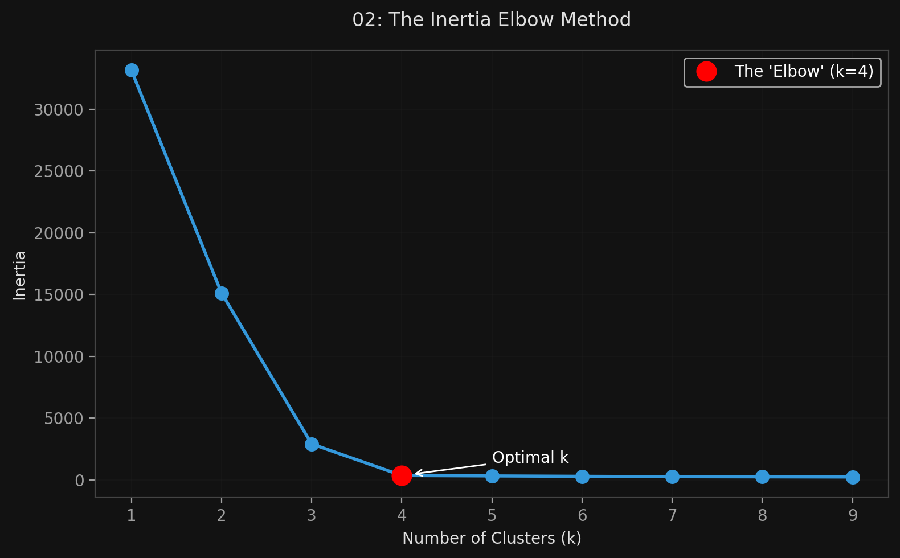
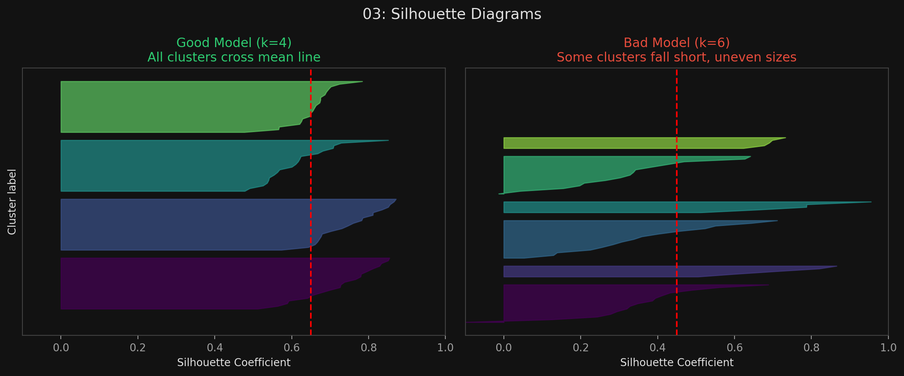

# 🏷️ Module 3: Finding the Optimal Number of Clusters
> **Ch. 9 — Hands-On ML with Scikit-Learn, Keras & TensorFlow (Aurélien Géron)**

---

## 📌 Table of Contents
1. [Start Here: The Big Picture](#big-picture)
2. [The Inertia Problem & The Elbow Method](#concept-1)
3. [The Silhouette Score](#concept-2)
4. [Silhouette Diagrams](#concept-3)
5. [Common Beginner Mistakes](#mistakes)
6. [Interview Q&A](#interview)
7. [⚡ One-Page Flash Card](#revision)

---

## 🌍 Start Here: The Big Picture {#big-picture}

> **TL;DR:** The biggest flaw of K-Means is that you must tell it exactly how many clusters ($k$) to look for. If you pick the wrong number, it will violently chop natural clusters in half or mash distinct clusters together. Since we can't always visually count clusters in high-dimensional space, we need mathematical metrics to find the optimal $k$. We use the **Inertia Elbow Method** (fast and coarse) and the **Silhouette Score** (slower but highly precise).

---

## 🔍 1. The Inertia Problem & The Elbow Method {#concept-1}

**Inertia** is the mean squared distance between each instance and its closest centroid. 

You might think: *"I'll just train models with different $k$ values and pick the one with the lowest inertia!"*
**The Problem:** Inertia *always* goes down as $k$ goes up. If you have 100 data points and you set $k=100$, every single point will be its own centroid, and the inertia will be 0. But that's a useless model.

**The Elbow Method:**
Instead of picking the lowest inertia, plot the inertia as a function of $k$. 
*   The curve drops very quickly as you add the first few necessary clusters.
*   Eventually, it reaches an **"elbow"** (an inflection point) where adding more clusters only yields diminishing returns (you are just chopping perfectly good clusters in half).
*   The $k$ value at this elbow is usually a good, coarse estimate for the optimal number of clusters.


> 📊 **Graph 02:** Finding the optimal $k$ using the Inertia Elbow curve

---

## 🔍 2. The Silhouette Score {#concept-2}

The elbow method is coarse. A much more precise metric is the **Silhouette Score**.
It calculates a coefficient for every single instance, ranging from -1 to +1:
*   **Close to +1:** The instance is well inside its own cluster and very far away from other clusters.
*   **Close to 0:** The instance is right on the boundary between two clusters.
*   **Close to -1:** The instance was probably assigned to the wrong cluster.

The overall Silhouette Score is the mean coefficient over all instances. Unlike inertia, you *can* simply pick the $k$ that yields the highest Silhouette Score!

```python
from sklearn.metrics import silhouette_score

# Assuming kmeans is a fitted KMeans object
score = silhouette_score(X, kmeans.labels_)
```

---

## 🔍 3. Silhouette Diagrams {#concept-3}

For the ultimate visualization, you can plot every single instance's silhouette coefficient, sorted by cluster. This creates a **Silhouette Diagram**.

*   Each cluster looks like a knife shape.
*   The **height** of the knife represents the number of instances in the cluster.
*   The **width** represents the silhouette coefficients (wider to the right is better).
*   A dashed red line shows the mean Silhouette Score.

**How to read it:**
If any cluster has a knife shape that stops short of the dashed red line, that cluster is bad (the instances are too close to other clusters). 
A good model has knife shapes that all extend well past the dashed line, and preferably have roughly similar heights (meaning the clusters are of similar sizes).


> 📊 **Graph 03:** Silhouette Diagrams showing bad clusters vs good clusters

---

## ❌ Common Beginner Mistakes {#mistakes}

**1. "Minimizing Inertia to find the best model"** ❌
> Inertia is not an absolute performance metric for choosing $k$. As you increase the number of clusters, the distance from any point to its nearest centroid naturally decreases. If $k$ equals the number of instances, inertia is 0. You must look for the *elbow*, not the minimum, or switch to the Silhouette score.

---

## 🎤 Interview Q&A {#interview}

**Q1: Explain what Inertia is in K-Means, and why you cannot simply pick the $k$ with the lowest inertia.**
> **A:**
> Inertia is the sum of squared distances of samples to their closest cluster center. You cannot use it directly to find the best $k$ because it is a monotonically decreasing function. As you increase $k$, the clusters get smaller, so points are naturally closer to their centroids. To use inertia, you must plot it and find the "elbow" point where the rate of decrease drops sharply, indicating diminishing returns for adding more clusters.

**Q2: How does the Silhouette Coefficient measure cluster quality?**
> **A:**
> It measures how similar an object is to its own cluster (cohesion) compared to other clusters (separation). It calculates the mean distance to all other points in its own cluster, and the mean distance to all points in the *next closest* cluster. A score near +1 indicates the point is far away from neighboring clusters, a score of 0 indicates it is on a decision boundary, and a negative score indicates it may be clustered incorrectly.

---

## ⚡ One-Page Flash Card {#revision}

```
╔══════════════════════════════════════════════════════════════════╗
║  MODULE 3 FLASH CARD — Finding the Optimal k                     ║
╠══════════════════════════════════════════════════════════════════╣
║  METRIC 1: INERTIA (The Elbow Method)                            ║
║  - Inertia: Mean squared distance to the closest centroid.       ║
║  - ALWAYS decreases as k increases.                              ║
║  - Don't pick the minimum. Plot it, and pick the "Elbow" where   ║
║    the drop slows down. Coarse but fast.                         ║
║                                                                  ║
║  METRIC 2: THE SILHOUETTE SCORE                                  ║
║  - Formula: (b - a) / max(a,b)                                   ║
║    a = distance to own cluster, b = distance to nearest cluster. ║
║  - Scale: -1 (wrong cluster) to 0 (boundary) to +1 (perfect).    ║
║  - You CAN just pick the highest overall score. Highly precise.  ║
║                                                                  ║
║  SILHOUETTE DIAGRAMS:                                            ║
║  - Visualizes the score of every point per cluster.              ║
║  - Good model: All clusters pass the mean score line and have    ║
║    roughly equal sizes (heights).                                ║
╚══════════════════════════════════════════════════════════════════╝
```

---

---

**🔗 Previous Module →** [02_K_Means_Clustering.md](02_K_Means_Clustering.md)  
**🔗 Next Module →** [04_Advanced_Applications_of_Clustering.md](04_Advanced_Applications_of_Clustering.md)
