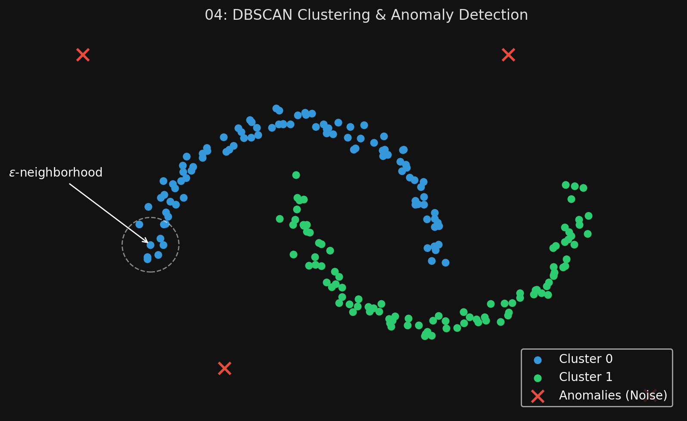
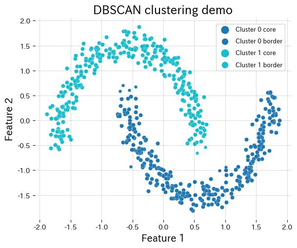

# 🏷️ Module 5: DBSCAN and Other Algorithms
> **Ch. 9 — Hands-On ML with Scikit-Learn, Keras & TensorFlow (Aurélien Géron)**

---

## 📌 Table of Contents
1. [Start Here: The Big Picture](#big-picture)
2. [How DBSCAN Works](#concept-1)
3. [DBSCAN Hyperparameters & Predictions](#concept-2)
4. [Other Clustering Algorithms (Brief Overview)](#concept-3)
5. [Common Beginner Mistakes](#mistakes)
6. [Interview Q&A](#interview)
7. [⚡ One-Page Flash Card](#revision)

---

## 🌍 Start Here: The Big Picture {#big-picture}

> **TL;DR:** K-Means assumes that all clusters are spherical blobs centered around a point, and fails miserably if they aren't. **DBSCAN** assumes that clusters are continuous regions of *high density*, separated by regions of *low density*. It can identify clusters of absolutely any shape (like two intertwined half-moons), and it is naturally built to instantly identify and filter out anomalies (outliers).

---

## 🔍 1. How DBSCAN Works {#concept-1}

DBSCAN (Density-Based Spatial Clustering of Applications with Noise) works based on local density. 

**The Algorithm:**
1.  **The $\epsilon$-neighborhood:** For every single instance in the dataset, the algorithm draws a tiny circle around it with a radius called $\epsilon$ (epsilon). It counts how many instances fall inside this circle.
2.  **Core Instances:** If an instance has at least `min_samples` (e.g., 5) instances inside its circle, it is officially designated as a **Core Instance**. This means it is located in a dense region.
3.  **Forming Clusters:** All instances in the neighborhood of a core instance belong to the same cluster. This neighborhood may include other core instances. Therefore, a long chain of connected core instances forms a single, massive cluster of any shape!
4.  **Anomalies (Noise):** Any instance that is NOT a core instance, and does NOT have a core instance in its neighborhood, is officially marked as an **Anomaly**.


> 📊 **Graph 04:** DBSCAN identifying core instances and anomaly points



---

## 🔍 2. DBSCAN Hyperparameters & Predictions {#concept-2}

DBSCAN has exactly two hyperparameters to tune:
*   `eps`: The radius of the neighborhood circle.
*   `min_samples`: How many neighbors are required to become a core instance.

If DBSCAN finds too many anomalies and shatters good clusters into tiny pieces, you need to widen the neighborhood by **increasing `eps`**.

```python
from sklearn.cluster import DBSCAN

# eps: radius, min_samples: density requirement
dbscan = DBSCAN(eps=0.2, min_samples=5)
dbscan.fit(X)

# Look at the assigned labels. 
# WARNING: Any instance labeled '-1' is considered an anomaly!
print(dbscan.labels_)
```

**The Prediction Quirk:**
Unlike K-Means, the `DBSCAN` class in Scikit-Learn does **not** have a `predict()` method! It cannot assign a cluster to a brand new, unseen instance. 
Why? Because different tasks require different rules. The authors decided to let you train a separate classifier (like a K-Nearest Neighbors classifier) on the DBSCAN outputs to make predictions for new data.

---

## 🔍 3. Other Clustering Algorithms (Brief Overview) {#concept-3}

Scikit-Learn provides several other clustering algorithms for niche situations:

*   **Agglomerative Clustering:**
    *   Works from the bottom up. Starts with every instance as its own tiny cluster. It then merges the nearest pair of clusters, then the next nearest pair, over and over, until there is one giant cluster. It creates a binary tree of clusters.
*   **BIRCH (Balanced Iterative Reducing and Clustering using Hierarchies):**
    *   Designed specifically for **extremely large datasets**. It builds a tree structure and assigns new instances quickly without needing to hold the whole dataset in memory. Faster than K-Means for massive datasets (if features < 20).
*   **Mean-Shift:**
    *   Places a circle on every instance, calculates the mean of the circle, and shifts the circle toward the mean (higher density). It repeats this until the circles settle at local density maximums. Can find any number of clusters of any shape, but scales terribly ($O(m^2)$).
*   **Spectral Clustering:**
    *   Creates a similarity matrix, maps the data to a lower-dimensional space, and then runs K-Means in that lower space. Can capture highly complex cluster structures and cut graphs (like identifying friend groups on a social network). Doesn't scale well.

---

## ❌ Common Beginner Mistakes {#mistakes}

**1. "Trying to use DBSCAN on clusters with varying densities"** ❌
> DBSCAN requires a fixed `eps` radius. If your dataset has one cluster that is extremely dense and tightly packed, and another cluster that is very spread out and low-density, DBSCAN will fail. You cannot tune a single `eps` to capture both simultaneously. (For varying densities, look into Hierarchical DBSCAN / HDBSCAN).

**2. "Calling dbscan.predict(X_new)"** ❌
> This will crash your code. DBSCAN does not have a predict method. To classify new instances, you must train a standard supervised classifier (like `KNeighborsClassifier`) on the core instances discovered by DBSCAN, and use *that* classifier to predict new data.

---

## 🎤 Interview Q&A {#interview}

**Q1: Explain how DBSCAN handles outliers (anomalies) compared to K-Means.**
> **A:**
> K-Means forces every single instance in the dataset into a cluster, no matter how far away it is from the centroid. It cannot detect outliers natively. DBSCAN is fundamentally density-based. If a data point is not a core instance (lacks sufficient neighbors within radius $\epsilon$) and is not within the neighborhood of a core instance, DBSCAN automatically labels it as noise/anomaly (assigning it a label of -1 in Scikit-Learn).

**Q2: What are the main limitations of DBSCAN?**
> **A:**
> First, it requires careful tuning of the `eps` hyperparameter. Second, it struggles immensely if the clusters in the dataset have significantly varying densities, because a single global `eps` cannot capture both dense and sparse clusters simultaneously. Third, it does not inherently have a `predict()` function for new, unseen data points.

---

## ⚡ One-Page Flash Card {#revision}

```
╔══════════════════════════════════════════════════════════════════╗
║  MODULE 5 FLASH CARD — DBSCAN                                    ║
╠══════════════════════════════════════════════════════════════════╣
║  HOW IT WORKS (Density-Based):                                   ║
║  - Draws a circle (radius = eps) around every instance.          ║
║  - If circle contains 'min_samples', it's a Core Instance.       ║
║  - Connected core instances form clusters of ANY shape.          ║
║  - Isolated points are automatically flagged as Anomalies (-1).  ║
║                                                                  ║
║  PROS:                                                           ║
║  - Can find any arbitrary shape (unlike K-Means).                ║
║  - Automatically detects and isolates outliers natively.         ║
║  - Does not require you to specify 'k' in advance.               ║
║                                                                  ║
║  CONS:                                                           ║
║  - Fails if clusters have significantly different densities.     ║
║  - Has no predict() method; you must train a separate            ║
║    classifier (like KNN) on its outputs to predict new data.     ║
╚══════════════════════════════════════════════════════════════════╝
```

---

---

**🔗 Previous Module →** [04_Advanced_Applications_of_Clustering.md](04_Advanced_Applications_of_Clustering.md)  
**🔗 Next Module →** [06_Gaussian_Mixture_Models.md](06_Gaussian_Mixture_Models.md)
