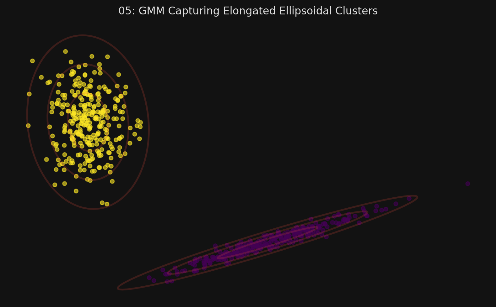
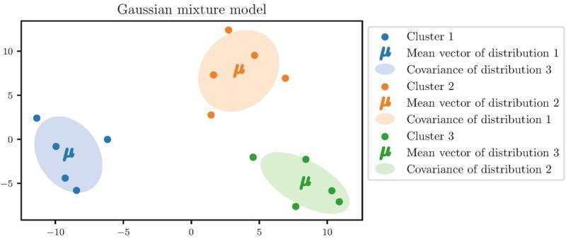

# 🏷️ Module 6: Gaussian Mixture Models
> **Ch. 9 — Hands-On ML with Scikit-Learn, Keras & TensorFlow (Aurélien Géron)**

---

## 📌 Table of Contents
1. [Start Here: The Big Picture](#big-picture)
2. [How GMMs Work (The Math Intuition)](#concept-1)
3. [Anomaly Detection with GMMs](#concept-2)
4. [Finding the Optimal Number of Clusters (AIC/BIC)](#concept-3)
5. [Bayesian Gaussian Mixture Models](#concept-4)
6. [Interview Q&A](#interview)
7. [⚡ One-Page Flash Card](#revision)

---

## 🌍 Start Here: The Big Picture {#big-picture}

> **TL;DR:** K-Means assumes all clusters are perfect spheres. DBSCAN assumes clusters are strictly defined by dense local neighborhoods. **Gaussian Mixture Models (GMMs)** take a probabilistic approach: they assume that the dataset was generated by a mixture of several Gaussian (normal) distributions. This allows GMMs to easily model clusters that look like **stretched ellipsoids** of varying sizes, orientations, and densities. They are also incredibly powerful for **Anomaly Detection**.

---

## 🔍 1. How GMMs Work (The Math Intuition) {#concept-1}

A GMM assumes there are $k$ distinct Gaussian distributions hidden in the data. When a new instance is generated, the mathematical "universe" first randomly picks one of the $k$ distributions (based on their relative weights), and then generates a point based on that specific distribution's mean and variance. 

Our job is to reverse-engineer this process. Given a pile of data, we need to find the location, size, shape, and weight of those $k$ original distributions.

**The EM Algorithm for GMMs:**
Scikit-Learn's `GaussianMixture` class solves this using the **Expectation-Maximization (EM)** algorithm (the exact same underlying math that powers K-Means!):
1.  **Initialize:** Randomly guess the parameters (mean, shape, weight) for $k$ distributions.
2.  **Expectation (Soft Labeling):** For every data point, calculate the probability that it belongs to each of the $k$ clusters. (e.g., 90% chance it belongs to Cluster A, 10% chance to B).
3.  **Maximization (Update):** Update the mean, shape, and weight of each cluster based on the points assigned to it. (Points with a 90% probability carry much more weight in the calculation than points with 10%).
4.  **Repeat** until convergence.

```python
from sklearn.mixture import GaussianMixture

# You still need to guess 'k' initially
gm = GaussianMixture(n_components=3, n_init=10)
gm.fit(X)

# Hard clustering (predicting the exact cluster)
y_pred = gm.predict(X)

# Soft clustering (predicting probabilities per cluster)
y_proba = gm.predict_proba(X)
```


> 📊 **Graph 05:** GMM capturing stretched ellipsoidal clusters with density contours



---

## 🔍 2. Anomaly Detection with GMMs {#concept-2}

GMMs are exceptional at **Anomaly Detection** (identifying instances that deviate strongly from the norm).

Because a GMM is a probabilistic model, it can estimate the probability density function (PDF) at any given location. Any instance located in an extremely low-density region (e.g., an area where the probability is in the bottom 4%) can immediately be flagged as an anomaly!

```python
# score_samples returns the log of the probability density function
densities = gm.score_samples(X)

# Define an anomaly as being in the bottom 4% of density
density_threshold = np.percentile(densities, 4)
anomalies = X[densities < density_threshold]
```

*Note: Novelty Detection is slightly different. In Novelty Detection, you assume your training set is perfectly clean (0% anomalies), and the algorithm only flags new, incoming data. In Anomaly Detection, you assume your training set is already polluted with anomalies, and you use the algorithm to clean it up.*

> [!TIP]
> **More robust modern alternatives for anomaly detection:**
> - **Isolation Forest** (`sklearn.ensemble.IsolationForest`): Randomly partitions data; anomalies are isolated in fewer splits. Works well in high dimensions.
> - **Local Outlier Factor (LOF)**: Compares a point's local density to its neighbors. Good for local anomalies.
> - **One-Class SVM**: Useful for novelty detection when anomalies are very rare during training.
> GMMs work best when the data is roughly Gaussian and the number of clusters is small.

---

## 🔍 3. Finding the Optimal Number of Clusters (AIC/BIC) {#concept-3}

With K-Means, we used Inertia and Silhouette scores to find $k$. You **cannot** use those metrics for GMMs, because GMMs form non-spherical clusters of different sizes. Those metrics would unfairly penalize elongated clusters.

Instead, you must use theoretical information criteria: **BIC** (Bayesian Information Criterion) or **AIC** (Akaike Information Criterion).
*   Both metrics measure how well the model fits the data, but they heavily penalize models that have too many parameters (to prevent overfitting).
*   You simply train models with different $k$ values, and **choose the $k$ that yields the lowest BIC or AIC.**

```python
# The lowest number wins!
bic_score = gm.bic(X)
aic_score = gm.aic(X)
```

---

## 🔍 4. Bayesian Gaussian Mixture Models {#concept-4}

Instead of manually training 20 different models to find the lowest BIC/AIC, you can use the `BayesianGaussianMixture` class.

**How it works:**
You give it a number of clusters that you *know* is way too high (e.g., $n\_components=10$). The algorithm will automatically detect that some clusters are completely unnecessary and will assign them a weight equal to exactly `0.0`. It automatically prunes itself down to the optimal number of clusters!

```python
from sklearn.mixture import BayesianGaussianMixture

# Set k higher than necessary
bgm = BayesianGaussianMixture(n_components=10, n_init=10)
bgm.fit(X)

# Check the weights. You'll see most are 0, revealing the true k!
print(np.round(bgm.weights_, 2))
# Output: [0.4 , 0.21, 0.4 , 0. , 0. , 0. , 0. , 0. , 0. , 0.]  -> Optimal k=3
```

---

## 🎤 Interview Q&A {#interview}

**Q1: Contrast K-Means and Gaussian Mixture Models.**
> **A:**
> K-Means is a hard-clustering, distance-based algorithm. It assigns points to centroids, forming rigid, spherical Voronoi boundaries. It is very fast but fails on complex cluster shapes. GMM is a soft-clustering, probability-based generative model. It assumes the data is formed by $k$ normal distributions. It can model elliptical clusters of varying sizes, orientations, and densities. GMM is much slower but far more flexible, and can natively perform anomaly detection using density thresholds.

**Q2: Why can't you use the Silhouette Score to evaluate a GMM? What do you use instead?**
> **A:**
> The Silhouette score relies entirely on Euclidean distance. It implicitly assumes that clusters are spherical and distinct. Since GMMs are designed to capture elongated, elliptical clusters that might overlap in probability space, the Silhouette score will incorrectly evaluate them as "bad" clusters. Instead, you must use theoretical information criteria like BIC or AIC, which balance the model's likelihood (how well it fits the data) against a penalty for complexity (number of parameters).

---

## ⚡ One-Page Flash Card {#revision}

```
╔══════════════════════════════════════════════════════════════════╗
║  MODULE 6 FLASH CARD — Gaussian Mixture Models (GMM)             ║
╠══════════════════════════════════════════════════════════════════╣
║  THE CONCEPT:                                                    ║
║  - Assumes data is generated by k Gaussian (normal) distributions║
║  - Uses EM Algorithm to find the mean, shape (covariance), and   ║
║    weight of each distribution.                                  ║
║  - Excels at finding elongated, ellipsoidal clusters!            ║
║                                                                  ║
║  ANOMALY DETECTION:                                              ║
║  - Because it calculates a Probability Density Function (PDF),   ║
║    you can instantly flag any instance in a low-density region   ║
║    (e.g., bottom 4%) as an anomaly.                              ║
║                                                                  ║
║  FINDING OPTIMAL k:                                              ║
║  - DO NOT use Inertia or Silhouette.                             ║
║  - Use BIC (Bayesian Information Criterion) or AIC. Lowest wins! ║
║  - Alternatively, use BayesianGaussianMixture to automatically   ║
║    prune unnecessary clusters.                                   ║
╚══════════════════════════════════════════════════════════════════╝
```

---

---

**🔗 Previous Module →** [05_DBSCAN_and_Other_Algorithms.md](05_DBSCAN_and_Other_Algorithms.md)  
**🔗 Chapter Complete! →** [Back to Chapter Index](../notes.md)
