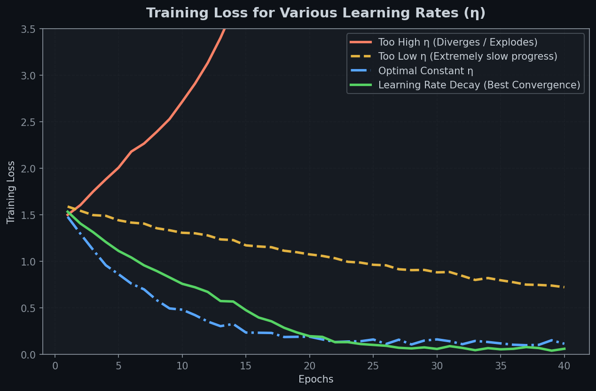
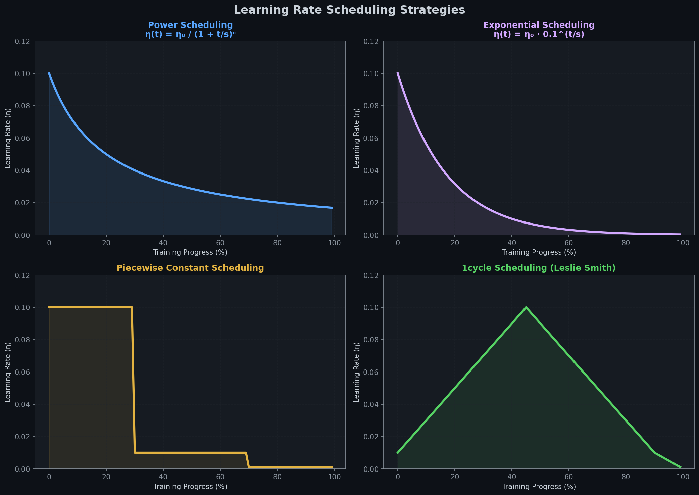
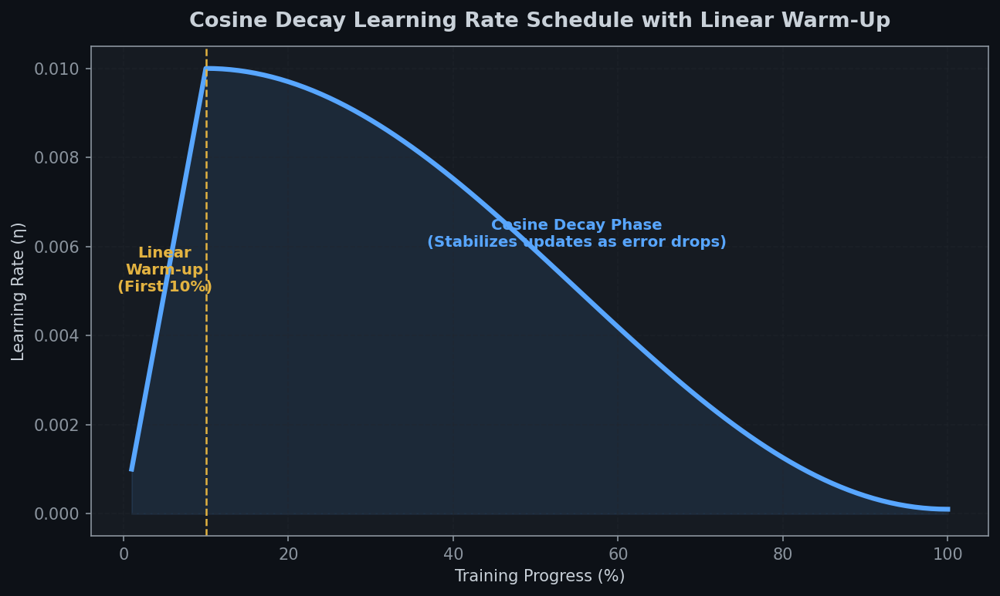

# 📉 Module 5: Learning Rate Scheduling
> **Ch. 11 — Hands-On ML with Scikit-Learn, Keras & TensorFlow (Aurélien Géron)**

---

## 📌 Table of Contents
1. [Start Here: The Big Picture](#big-picture)
2. [Finding the Optimal Learning Rate (The Range Test)](#lr-finder)
3. [The Core Learning Rate Schedules](#core-schedules)
4. [Leslie Smith's 1cycle Scheduling](#onecycle)
5. [Implementing Schedules in Keras (Step-by-Step)](#keras-scheduling)
6. [Common Beginner Mistakes](#mistakes)
7. [Interview Q&A (Top 5)](#interview)
8. [⚡ One-Page Flash Card](#revision)

---

## 🌍 Start Here: The Big Picture {#big-picture}

> **TL;DR:** Using a constant learning rate is suboptimal: too high and it diverges, too low and it takes forever. We start with a large learning rate to speed up exploration, then decrease it when progress slows. Advanced schedules like 1cycle ramp up learning rate first (acts as regularizer) before dropping it, leading to faster training and better generalization.

**The "Hot Air Balloon Landing" Analogy 🎈:**
Imagine navigating a hot air balloon to land on a target in a valley. If your vertical speed is constant and very fast, you will crash and bounce wildly (diverging learning rate). If it is constant and very slow, the balloon will drift and take hours to touch down (low learning rate). 

To land quickly and safely, you drop rapidly while far above (high initial learning rate) to cover distance, and then slowly fire the burner to decelerate to a gentle crawl as you approach the ground (learning rate decay), settling exactly on the target.

---

## 🔍 1. Finding the Optimal Learning Rate (The Range Test) {#lr-finder}

Before scheduling, you must find a good base learning rate. We use the **Learning Rate Range Test** (Leslie Smith):

1.  Start with a very small learning rate (e.g., $10^{-5}$).
2.  Train the model for a few hundred iterations, exponentially increasing the learning rate at each step until it reaches a very large value (e.g., $10$).
3.  Plot loss vs. learning rate. The loss will initially drop, then reach a minimum, and finally shoot back up (diverging).
4.  **The Rule of Thumb:** Choose a learning rate slightly lower than the point where the loss starts shooting up (typically **$10\times$ lower** than the minimum of the curve, or right in the middle of the steepest downward slope).


> 📊 **Graph 10:** Loss curves for different constant learning rates. Too high diverges, too low converges very slowly, and learning rate decay combines fast early progress with stable convergence.

---

## 🔍 2. The Core Learning Rate Schedules {#core-schedules}

We can adjust the learning rate dynamically during training using several mathematical schedules.


> 📊 **Graph 11:** Visual shapes of the four main learning rate schedules over the course of training. Notice the distinct linear ramp-up and ramp-down of the 1cycle schedule.


> 📊 **Graph 18:** Cosine Learning Rate Schedule with a Linear Warm-Up phase. Ramping up learning rate during early iterations prevents gradient explosion and stabilizes optimizer moments.

---

### 1. Power Scheduling
The learning rate drops at every iteration step $t$:
$$\eta(t) = \frac{\eta_0}{\left(1 + \frac{t}{s}\right)^c}$$
*   **Hyperparameters:** Initial rate $\eta_0$, power $c$ (typically $1$), and step scale $s$.
*   **Behavior:** The rate drops quickly initially, then slows down, continuing to decrease without ever reaching absolute zero.

### 2. Exponential Scheduling
The learning rate drops exponentially by a factor of 10 every $s$ steps:
$$\eta(t) = \eta_0 \cdot 0.1^{t/s}$$
*   **Behavior:** Continues to slash the learning rate by constant proportions. It is easy to tune and converges quickly.

### 3. Piecewise Constant Scheduling
Use a fixed learning rate for a set number of epochs, then step it down:
$$\eta = 0.1 \text{ for 5 epochs, } 0.01 \text{ for next 20 epochs, etc.}$$
*   **Behavior:** Effective, but requires manual tuning of step boundaries and decay factors.

### 4. Performance Scheduling (Reduce on Plateau)
Monitor validation loss at the end of each epoch, and multiply the learning rate by a decay factor $\lambda$ (e.g., $0.5$) if the validation loss fails to improve for $N$ consecutive epochs.

---

## 🔍 3. Leslie Smith's 1cycle Scheduling {#onecycle}

Introduced in 2018, the **1cycle schedule** outperforms traditional schedules. For example, on CIFAR10, it achieved $91.9\%$ validation accuracy in 100 epochs compared to $90.3\%$ in 800 epochs using traditional decay.

### The Algorithm:
1.  **First Half of Training:** Linearly increase the learning rate from $\eta_0$ to its maximum value $\eta_1$. Simultaneously, linearly decrease momentum from $0.95$ to $0.85$.
2.  **Second Half of Training:** Linearly decrease the learning rate back to $\eta_0$. Simultaneously, linearly increase momentum back to $0.95$.
3.  **Final Few Epochs:** Drop the learning rate by several orders of magnitude (linearly to nearly zero) while keeping momentum at its maximum ($0.95$).

*   **Why it works:** Ramping up the learning rate acts as a regularizer, preventing the model from getting stuck in sharp local minima. Ramping down allows it to settle into flat, stable minima that generalize better.

---

## 🔍 4. Implementing Schedules in Keras (Step-by-Step) {#keras-scheduling}

Keras offers two primary methods for implementing schedules: **Callbacks** (updated once per epoch) and **Scheduler Objects** (updated at every training step).

### Option 1: Power Scheduling via Optimizer Decay
Keras calculates: `lr = lr0 / (1 + decay * step)` (assuming $c=1$).
```python
import tensorflow as tf
from tensorflow import keras

# decay is the inverse of scale s
optimizer = keras.optimizers.SGD(lr=0.01, decay=1e-4)
# OUTPUT: SGD optimizer configured for power scheduling.
```

### Option 2: Exponential Scheduling via Callback (Epoch-based)
```python
def exponential_decay(lr0, s):
    def exponential_decay_fn(epoch):
        return lr0 * 0.1**(epoch / s)
    return exponential_decay_fn

exp_decay_fn = exponential_decay(lr0=0.01, s=20)
lr_scheduler = keras.callbacks.LearningRateScheduler(exp_decay_fn)

# Pass the callback to model.fit
# history = model.fit(X_train, y_train, callbacks=[lr_scheduler])
```

### Option 3: Performance Scheduling via ReduceLROnPlateau Callback
```python
# Halve the learning rate if validation loss plateaus for 5 epochs
plateau_scheduler = keras.callbacks.ReduceLROnPlateau(factor=0.5, patience=5)
# history = model.fit(X_train, y_train, callbacks=[plateau_scheduler])
```

### Option 4: Exponential Decay via Scheduler Object (Step-based)
This updates the learning rate at every step instead of every epoch and is saved with the model.
```python
# Calculate decay steps (e.g., over 20 epochs with batch size 32)
decay_steps = 20 * len(X_train_scaled) // 32

lr_schedule_obj = keras.optimizers.schedules.ExponentialDecay(
    initial_learning_rate=0.01,
    decay_steps=decay_steps,
    decay_rate=0.1
)
optimizer = keras.optimizers.SGD(learning_rate=lr_schedule_obj)
# OUTPUT: Optimizer built with step-based exponential decay schedule.
```

---

## ❌ Common Beginner Mistakes {#mistakes}

**1. Forgetting that epoch resets to 0 when loading a saved model for further training** ❌
> **Reality:** If your learning rate callback function depends on the `epoch` argument (e.g., `epoch / 20`), saving a model at epoch 50 and resuming training will reset the `epoch` counter to 0. This instantly resets the learning rate to its high initial value, which can destroy the fine-tuned weights.
> **Fix:** Manually pass `initial_epoch` to the `fit()` method so the counter resumes from the correct value (e.g., `model.fit(..., initial_epoch=50)`). Alternatively, use Keras step-based optimizer schedule objects, which save their step states inside the model file.

**2. Choosing the maximum learning rate from the absolute lowest point of the LR Finder curve** ❌
> **Reality:** The lowest point of the loss-LR curve is where the model is on the verge of divergence. If you set your learning rate to this value, training will likely diverge. Choose a rate **$10\times$ lower** than the minimum, or select the middle of the steepest downward section.

---

## 🎤 Interview Q&A (Top 5) {#interview}

**Q1: How do you find a good starting learning rate using the Learning Rate Range Test?**
> **A:** Train the model for a few hundred steps, exponentially increasing the learning rate from a tiny value ($10^{-5}$) to a large value ($10$). Plot the training loss vs. learning rate. Identify the point where the loss curve starts to rise. Choose a starting learning rate that is slightly lower (typically $10\times$ lower) than the point of divergence.

**Q2: What is the key difference between Keras `LearningRateScheduler` and `ReduceLROnPlateau`?**
> **A:** `LearningRateScheduler` is a deterministic scheduler; it updates the learning rate strictly based on the current epoch number according to a predefined formula, regardless of model performance. `ReduceLROnPlateau` is a dynamic performance scheduler; it only decays the learning rate when validation performance has stagnated (plateaued) for a specified number of epochs.

**Q3: Why does 1cycle scheduling use an inverse momentum schedule?**
> **A:** When the learning rate increases in the first half of training, it takes large gradient steps. Reducing momentum (e.g. from $0.95$ to $0.85$) acts as a regularizer, stabilizing updates and helping the model escape local minima. In the second half, as the learning rate drops to fine-tune, increasing momentum helps the model slide smoothly to the minimum.

**Q4: Compare step-based scheduling with epoch-based scheduling.**
> **A:** Epoch-based scheduling updates the learning rate once per epoch (at the end of all steps). Step-based scheduling updates the learning rate at every mini-batch step. Step-based scheduling is preferred when there are many iterations per epoch, preventing large gradient jumps between epoch boundaries.

**Q5: When resuming training from a saved model, what hazard does an epoch-based scheduler pose, and how do we solve it?**
> **A:** When calling `model.fit()`, Keras resets the internal epoch counter to $0$. An epoch-dependent callback will reset the learning rate to its initial high value, potentially destroying the trained weights. We solve this by passing the correct starting epoch value to `model.fit(..., initial_epoch=last_epoch)`, or by using Keras step-based `optimizers.schedules` objects which serialize their state inside the saved model.

---

## ⚡ One-Page Flash Card {#revision}

```
╔══════════════════════════════════════════════════════════════════╗
║               MODULE 5 — LR SCHEDULING                           ║
╠══════════════════════════════════════════════════════════════════╣
║                                                                  ║
║  LR FINDER (SMITH RANGE TEST):                                   ║
║  - Exponentially scale η from 1e-5 to 10.                        ║
║  - Plot Loss vs η. Find the point where loss rises.              ║
║  - Rule of thumb: Pick η₀ ≈ 10x lower than the minimum.          ║
║                                                                  ║
║  LR SCHEDULE MATH:                                               ║
║  - Power:       η(t) = η₀ / (1 + t/s)ᶜ                           ║
║  - Exponential: η(t) = η₀ · 0.1^(t/s)                            ║
║  - Piecewise:   Discrete jumps (e.g. 0.1 → 0.01 → 0.001)         ║
║  - Performance: Decays by factor λ when validation loss plateaus.║
║                                                                  ║
║  1CYCLE SCHEDULING (Leslie Smith):                               ║
║  - Step 1: Ramp η up to η_max, drop momentum down to 0.85.       ║
║  - Step 2: Ramp η down to η_min, bring momentum up to 0.95.      ║
║  - Step 3: Squeeze η down by 100x near-zero.                     ║
║                                                                  ║
║  KERAS IMPLEMENTATION MODES:                                     ║
║  1. Optimizer Decay: SGD(lr=0.01, decay=1e-4) (Power schedule)   ║
║  2. Callback:        LearningRateScheduler(decay_fn) (Epoch)     ║
║  3. Dynamic Callback:ReduceLROnPlateau(factor=0.5, patience=5)   ║
║  4. Schedule Object: ExponentialDecay(lr, steps, rate) (Step)    ║
║                                                                  ║
║  CRITICAL WARNING:                                               ║
║  - When loading models to resume training, always pass           ║
║    initial_epoch to fit() to prevent LR spikes.                  ║
╚══════════════════════════════════════════════════════════════════╝
```

---

---

**🔗 Previous Module →** [04_Faster_Optimizers.md](04_Faster_Optimizers.md)  
**🔗 Next Module →** [06_Regularization_Guidelines.md](06_Regularization_Guidelines.md)
