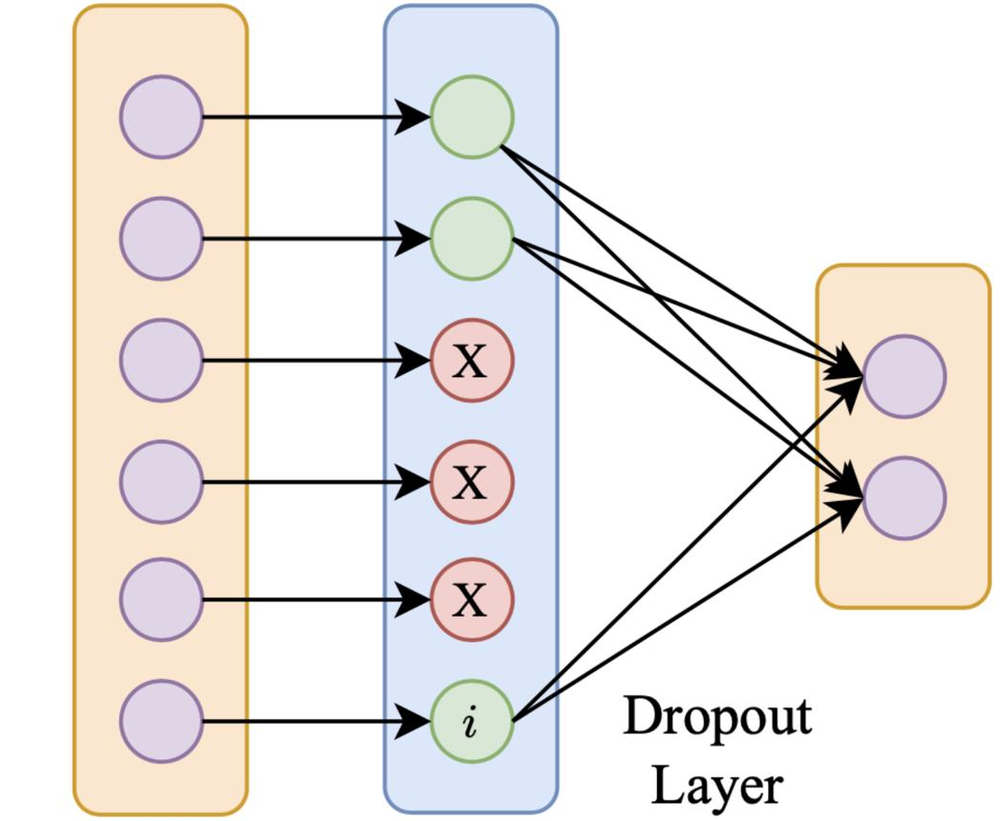
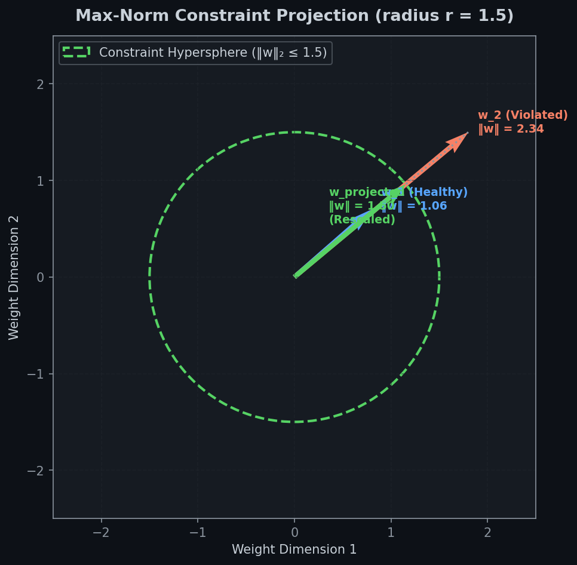
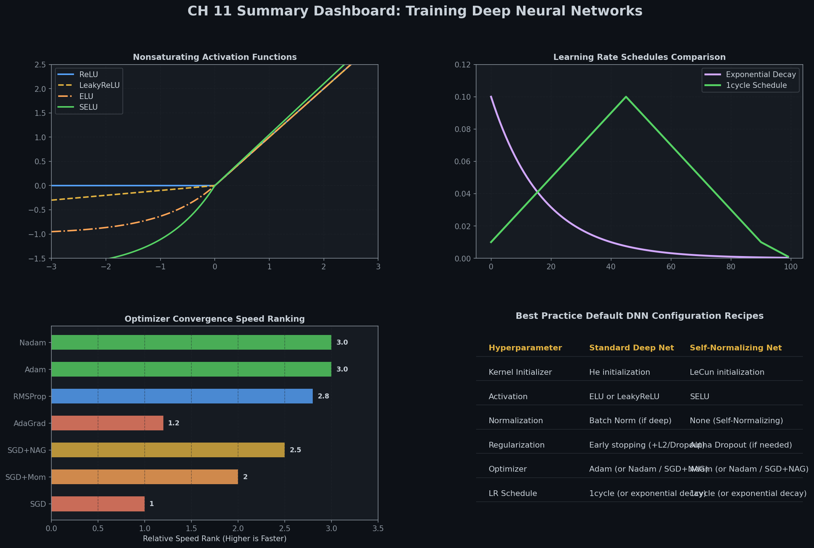

# 🛡️ Module 6: Regularization — Defeating Overfitting in Deep Networks
> **Ch. 11 — Hands-On ML with Scikit-Learn, Keras & TensorFlow (Aurélien Géron)**

---

## 📌 Table of Contents
1. [Start Here: The Big Picture](#big-picture)
2. [ℓ1 and ℓ2 Regularization](#l1-l2)
3. [Dropout — The Most Popular Technique](#dropout)
4. [The Math Behind Dropout: Why It Works](#dropout-math)
5. [MC Dropout — Bayesian Uncertainty Estimation](#mc-dropout)
6. [Alpha Dropout — For SELU Networks](#alpha-dropout)
7. [Max-Norm Regularization](#max-norm)
8. [Summary: Which Regularization to Use?](#summary)
9. [Practical Guidelines for Deep Networks](#guidelines)
10. [Common Beginner Mistakes](#mistakes)
11. [Interview Q&A](#interview)
12. [⚡ One-Page Flash Card](#revision)

---

## 🌍 Start Here: The Big Picture {#big-picture}

> **TL;DR:** Overfitting = memorizing training data. Regularization = forcing the model to learn general patterns instead. Dropout is the most powerful modern technique. L2 provides a baseline. Together they're a strong regularization suite.

**The "Cheat Sheet vs. Understanding" Analogy 📚**

A student who memorizes cheat sheets scores 100% on practice exams but fails the real exam (new questions). A student forced to understand the material (even if they score 85% on practice) does much better on the real exam.

- Memorizing cheat sheets = **overfitting** (train acc 99%, val acc 70%)
- Understanding principles = **regularization** (train acc 85%, val acc 83%)

**Signs of Overfitting:**
```
epoch 1: train_acc=65%, val_acc=63%   ← Both improving (good)
epoch 20: train_acc=97%, val_acc=75%  ← Gap widening = OVERFITTING
```

---

## 🔒 ℓ1 and ℓ2 Regularization {#l1-l2}

Both add a **penalty term to the loss function** that discourages large weights.

### ℓ2 (Ridge / Weight Decay)

$$\text{Loss}_\text{regularized} = \text{Loss} + \lambda \sum_i w_i^2$$

- Penalizes LARGE weights quadratically
- Pushes all weights toward 0, but rarely to exactly 0
- **Effect:** Keeps all weights small → reduces model complexity without removing features
- **Keras:** `kernel_regularizer=keras.regularizers.l2(0.01)`

### ℓ1 (Lasso)

$$\text{Loss}_\text{regularized} = \text{Loss} + \lambda \sum_i |w_i|$$

- Penalizes weights by their absolute value
- Tends to push some weights to EXACTLY 0 → **sparse model**
- **Effect:** Automatic feature selection — unimportant features get zeroed out
- **Keras:** `kernel_regularizer=keras.regularizers.l1(0.01)`

### ℓ1 + ℓ2 (Elastic Net)

```python
layer = keras.layers.Dense(100, activation="elu",
                            kernel_initializer="he_normal",
                            kernel_regularizer=keras.regularizers.l1_l2(l1=0.01, l2=0.01))
```

### The Problem with Applying Individually

When you have many layers, applying regularization to each one individually is verbose. Use a functional wrapper:

```python
from functools import partial

RegularizedDense = partial(keras.layers.Dense,
                           activation="elu",
                           kernel_initializer="he_normal",
                           kernel_regularizer=keras.regularizers.l2(0.01))

model = keras.models.Sequential([
    keras.layers.Flatten(input_shape=[28, 28]),
    RegularizedDense(300),
    RegularizedDense(100),
    RegularizedDense(10, activation="softmax", kernel_initializer="glorot_uniform")
])
```

---

## 💧 Dropout — The Most Popular Technique (Hinton et al., 2012) {#dropout}

**The Algorithm:**
1. At each training step, each neuron (except output) has probability $p$ of being **temporarily dropped** (output set to 0)
2. Different neurons dropped each step → network can't rely on any one neuron
3. At test time: all neurons active, but each neuron's input weights multiplied by keep probability $(1-p)$

**Keras implementation:**
```python
model = keras.models.Sequential([
    keras.layers.Flatten(input_shape=[28, 28]),
    keras.layers.Dropout(rate=0.2),           # drops 20% of inputs
    keras.layers.Dense(300, activation="elu", kernel_initializer="he_normal"),
    keras.layers.Dropout(rate=0.2),
    keras.layers.Dense(100, activation="elu", kernel_initializer="he_normal"),
    keras.layers.Dropout(rate=0.2),
    keras.layers.Dense(10, activation="softmax")
])
```

**Dropout rates:**
| Location | Typical Rate |
|----------|-------------|
| Input layer | 0.1–0.2 |
| Hidden layers (CNNs) | 0.4–0.5 |
| Hidden layers (RNNs) | 0.2–0.3 |
| Last hidden layer only | 0.5 |



> 📊 **Graph 12:** Dropout Mechanism. By randomly dropping neurons during training, the network is forced to learn redundant, robust representations.

**Key Properties:**
- ✅ Most effective regularizer for deep networks (1-2% accuracy boost even in SOTA models!)
- ✅ Equivalent to training an ensemble of $2^N$ different networks
- ❌ Slows convergence significantly (takes ~2x more epochs to converge)
- ❌ Makes training/validation loss comparison misleading (dropout is active during training, not validation)

> ⚠️ **The Train/Val Loss Trap:** A model with dropout can be overfitting even if training loss ≈ validation loss, because training loss was computed WITH dropout (more difficult = higher loss). Always evaluate training loss WITHOUT dropout to properly diagnose.

---

## 🧮 The Math Behind Dropout: Why It Works {#dropout-math}

### Interpretation 1: Ensemble of Exponentially Many Networks

With $N$ droppable neurons, there are $2^N$ possible network configurations. Each training step trains a slightly different sub-network. At test time, you get a "geometric ensemble" of all $2^N$ networks.

### Interpretation 2: Forced Redundancy

With dropout, neurons must learn to be useful **independently** — they cannot co-adapt with neighboring neurons. This forces the network to develop **redundant representations** that are more robust.

### The Scaling Trick at Test Time

During training, if dropout rate = $p$:
- Neuron is active with probability $(1-p)$
- Neuron is OFF with probability $p$
- Expected output = $(1-p) \times \text{output when active}$

At test time (no dropout):
- All neurons are active → their output is $(1-p)^{-1}$ times too large!
- **Solution A (Keras uses this):** During TRAINING, divide active outputs by $(1-p)$. Test time: pass-through unchanged.
- **Solution B (alternative):** During training: nothing. At TEST time: multiply all weights by $(1-p)$.

Keras uses **Solution A (inverted dropout)** so the model works identically at any time.

---

## 🎲 MC Dropout — Bayesian Uncertainty Estimation (Gal & Ghahramani, 2016) {#mc-dropout}

**The Discovery:** Dropout networks with `training=True` during inference are mathematically equivalent to **approximate Bayesian inference**. This means you can get **uncertainty estimates** for free!

**Implementation:**
```python
# Train model normally with dropout
# Then at inference time, run MULTIPLE forward passes with training=True

y_probas = np.stack([model(X_test_scaled, training=True)  # keep dropout active!
                     for _ in range(100)])  # 100 Monte Carlo samples
# y_probas.shape: (100, n_samples, n_classes)

y_proba = y_probas.mean(axis=0)        # final prediction (averaged)
y_std = y_probas.std(axis=0)           # uncertainty estimate!
```


> 📊 **Graph 13:** Monte Carlo Dropout. By running multiple stochastic forward passes at inference time, we obtain a distribution of predictions, allowing us to estimate model uncertainty.

**Benefits of MC Dropout:**
1. **Better accuracy**: Averaging 100 passes typically beats single-pass by ~1-2%
2. **Calibrated uncertainty**: High `y_std` means the model is uncertain → you can reject uncertain predictions
3. **Zero extra training**: Works on ANY already-trained dropout model!

**Practical use case:** In medical diagnosis, don't just predict "cancer vs. not cancer" — also report the model's CONFIDENCE. MC Dropout gives you this for free.

---

## α Alpha Dropout — For SELU Networks {#alpha-dropout}

Regular Dropout breaks SELU's self-normalization property! Why? Dropout randomly zeros out neurons, but the SELU self-normalization guarantee requires all neurons to be active.

**Alpha Dropout** is a special variant that:
- Drops and replaces dropped values with a learned "safe" value
- Preserves the mean and standard deviation of the layer's output
- Maintains the self-normalization property!

```python
# For SELU networks: use AlphaDropout instead of Dropout
model = keras.models.Sequential([
    keras.layers.Flatten(input_shape=[28, 28]),
    keras.layers.AlphaDropout(rate=0.1),     # ← not regular Dropout!
    keras.layers.Dense(300, activation="selu", kernel_initializer="lecun_normal"),
    keras.layers.AlphaDropout(rate=0.1),
    keras.layers.Dense(100, activation="selu", kernel_initializer="lecun_normal"),
    keras.layers.AlphaDropout(rate=0.1),
    keras.layers.Dense(10, activation="softmax")
])
```

---

## 📏 Max-Norm Regularization {#max-norm}

At the end of each training step, clip each neuron's incoming weight vector to have a maximum ℓ₂ norm of $r$:

$$\mathbf{w} \leftarrow \mathbf{w} \cdot \min\left(1, \frac{r}{\|\mathbf{w}\|_2}\right)$$

- Prevents any single neuron from having disproportionately large weights
- Can reduce the exploding gradients problem
- Has a mild regularization effect


> 📊 **Graph 14:** Max-Norm Regularization. Constraining weight vectors to lie within a hyper-sphere of radius r prevents the network weights from exploding.

```python
keras.layers.Dense(100, activation="elu", kernel_initializer="he_normal",
                   kernel_constraint=keras.constraints.max_norm(1.))
```

---

## 📋 Summary: Which Regularization to Use? {#summary}

| Situation | Recommended |
|-----------|-------------|
| Baseline, always add | ℓ2 (weight decay) with λ=10⁻⁴ to 10⁻² |
| Model overfitting significantly | Dropout (rate=0.4–0.5 on last layers) |
| SELU network overfitting | AlphaDropout |
| Need sparse model (feature selection) | ℓ1 or Elastic Net |
| Want uncertainty estimates | MC Dropout |
| Using very large layers | Dropout only on last 1-3 layers |
| Small dataset | Heavy dropout (rate up to 0.5) |
| Large dataset | Light or no dropout |

---

## 🗺️ Practical Guidelines for Deep Networks {#guidelines}

> These are the book's end-of-chapter recommendations for choosing all hyperparameters:

| Component | Default Choice |
|-----------|---------------|
| **Kernel initializer** | He normal |
| **Activation function** | ELU (or SELU for dense-only) |
| **Normalization** | Batch Normalization (or none if using SELU) |
| **Regularization** | Dropout (20–30% rate) |
| **Optimizer** | Adam |
| **Learning rate schedule** | 1Cycle or ReduceLROnPlateau |
| **Output activation** | Softmax (multi-class), Sigmoid (binary), Linear (regression) |
| **Loss function** | Categorical CE (multi-class), Binary CE (binary), MSE (regression) |

**Network size guidelines:**
- Start with 1-5 hidden layers, 100-300 neurons per layer
- Increase complexity if model underfits, add regularization if it overfits
- Pyramidal architecture (wider at bottom, narrower at top) often works well

---

## ❌ Common Beginner Mistakes {#mistakes}

**1. Using Dropout at test time unintentionally** ❌
> Reality: Using `model(X, training=True)` at test time enables dropout — this is what MC Dropout does intentionally. Using `model(X)` or `model.predict()` (training=False) disables dropout. If you accidentally evaluate with training=True, you get noisy inconsistent predictions.

**2. Not accounting for Dropout when comparing train/val loss** ❌
> Reality: Training loss is computed WITH dropout active (harder). Validation loss is WITHOUT dropout. The model may be overfitting even when train loss ≈ val loss. Always check training loss at evaluation time (with dropout OFF) for fair comparison.

**3. Using regular Dropout with SELU** ❌
> Reality: Dropout breaks SELU's self-normalization because it drops values to zero. Use `AlphaDropout` instead, which preserves the statistical properties of the layer's output.

**4. Using too high dropout rate on all layers** ❌
> Reality: High dropout everywhere severely slows learning. Only use high rates (0.4-0.5) on the final 1-3 layers. Early layers need lower rates (0.1-0.2) or no dropout.

---

## 🎤 Interview Q&A {#interview}

**Q1: Explain how dropout regularizes a neural network. Why does it work?**
> **A:** Dropout randomly zeroes out neurons with probability $p$ during each training step. This prevents neurons from co-adapting (relying on specific other neurons). Each neuron must learn features that are useful even when some of its inputs are missing. Mathematically, it's equivalent to training an ensemble of $2^N$ different sub-networks and combining their predictions at test time. The result is a more robust model that has learned redundant representations.

**Q2: What is MC Dropout and what does it give you?**
> **A:** MC Dropout runs multiple forward passes through the network with dropout ACTIVE (training=True) even at test time. Each pass gives slightly different predictions due to different neurons being dropped. The mean of 100+ passes gives a better prediction than a single deterministic pass. The standard deviation across passes gives an uncertainty estimate: high std = model is uncertain about this input. This is free on any trained dropout model — no retraining needed.

**Q3: Why is AlphaDropout needed for SELU and not regular Dropout?**
> **A:** SELU's self-normalization guarantee (mean≈0, std≈1 at each layer) depends on ALL neurons being active. Regular dropout sets neurons to zero, creating a distribution different from what SELU was designed for — this breaks self-normalization. AlphaDropout replaces dropped values with a specific negative value and scales the remaining values such that the mean and variance of the layer's output are preserved, maintaining the self-normalization property.

**Q4: What's the difference between ℓ1 and ℓ2 regularization? When to use which?**
> **A:** ℓ2 (Ridge): penalty = λΣwᵢ², pushes all weights toward zero but rarely to exactly zero. ℓ1 (Lasso): penalty = λΣ|wᵢ|, creates exact sparsity (many weights become exactly 0). Use ℓ2 as a baseline to keep weights small. Use ℓ1 when you want automatic feature selection (irrelevant features get zeroed out) or need a sparse model for efficiency. Elastic Net (both) combines both benefits.

---

## ⚡ One-Page Flash Card {#revision}

```
╔══════════════════════════════════════════════════════════════════════╗
║            MODULE 6 — REGULARIZATION FLASH CARD                       ║
╠══════════════════════════════════════════════════════════════════════╣
║                                                                        ║
║  ℓ2 REGULARIZATION: Loss + λΣwᵢ²                                    ║
║   → all weights shrink toward 0, none to exactly 0                   ║
║                                                                        ║
║  ℓ1 REGULARIZATION: Loss + λΣ|wᵢ|                                   ║
║   → many weights become EXACTLY 0 (sparse model)                     ║
║                                                                        ║
║  DROPOUT (p = dropout rate):                                           ║
║   Training: randomly zero neurons with probability p                  ║
║   Testing: all neurons active, Keras auto-scales (inverted dropout)  ║
║   = ensemble of 2^N sub-networks                                      ║
║   rate 20-30% for RNNs, 40-50% for CNNs                             ║
║   Don't compare train/val loss at face value (train has dropout ON!) ║
║                                                                        ║
║  MC DROPOUT:                                                           ║
║   model(X, training=True) 100 times → mean=prediction, std=uncertainty║
║   Free uncertainty estimation on any trained dropout model!           ║
║                                                                        ║
║  ALPHA DROPOUT:                                                        ║
║   Use INSTEAD of Dropout when activation = SELU                      ║
║   Preserves mean and std of output (maintains self-normalization)    ║
║                                                                        ║
╚══════════════════════════════════════════════════════════════════════╝
```

---

## 📈 Chapter 11 Summary Dashboard


> 📊 **Graph 15:** Comprehensive visual summary of all Chapter 11 concepts: initialization, activation functions, normalization, and optimization strategies.

---

---

**🔗 Previous Module →** [05_Learning_Rate_Scheduling.md](05_Learning_Rate_Scheduling.md)  
**🔗 Chapter Complete! →** [Back to Chapter Index](../notes.md)
