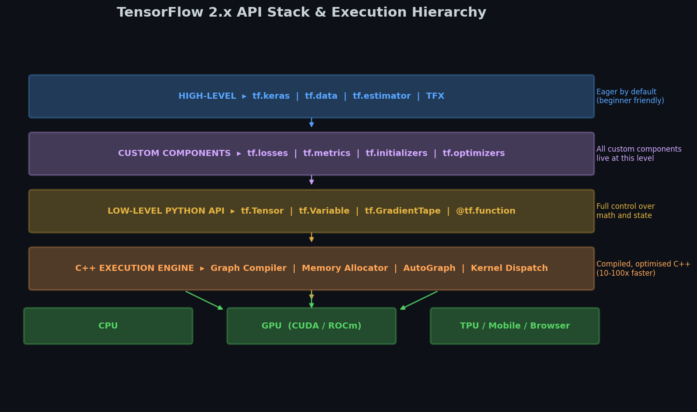
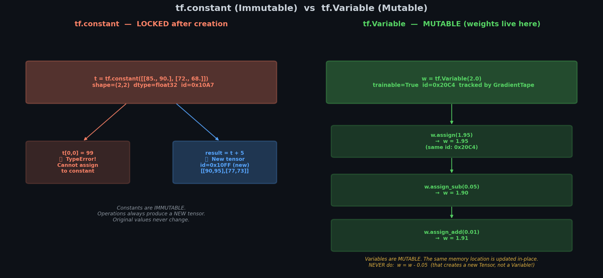

# 🔥 Module 1: TensorFlow — Tensors, Variables & Operations
> **Ch. 12 — Hands-On ML with Scikit-Learn, Keras & TensorFlow**
> **Rewritten: Plain English → Real Numbers → Code → Why It Matters**

---

## 📌 Table of Contents
1. [What IS TensorFlow? (Plain English)](#what-is-tf)
2. [What is a Tensor? (With Numbers)](#tensors)
3. [Tensor Types: constant vs. Variable vs. Sparse](#tensor-types)
4. [Why Variables Exist (The Real Reason)](#why-variables)
5. [Essential Operations (With Real Outputs)](#operations)
6. [Data Types: Why TF is Strict](#dtypes)
7. [TF vs. NumPy: The Key Differences](#vs-numpy)
8. [Common Mistakes (Wrong vs. Right)](#mistakes)
9. [How It All Connects](#connects)
10. [Flash Card](#flashcard)

---

## 🌍 1. What IS TensorFlow? (Plain English) {#what-is-tf}

**In one sentence:** TensorFlow is a calculator that runs on the GPU (100x faster), automatically tracks every step so it can compute gradients, and can be deployed anywhere.

### 🍕 The "Pizza Shop" Analogy

| Pizza Shop | TensorFlow |
|------------|-----------|
| Ingredients | Tensors (your data and weights) |
| Recipes (steps) | Operations (add, multiply, etc.) |
| Kitchen blueprint | Computation Graph |
| Running the kitchen | Execution |

When a customer orders pizza, ingredients flow through the kitchen (**forward pass**). If the pizza is wrong, you trace back which step failed (**backward pass = gradients**).

**TF 1.x** = Draw the full blueprint first, THEN run the kitchen. Hard to debug.
**TF 2.x** = Cook immediately as you write the recipe. Easy to debug. Same speed.



---

## 📦 2. What is a Tensor? (With Numbers) {#tensors}

A tensor is just a **multi-dimensional array of numbers**. That's it.

| Name | Dimensions | Example with Real Numbers |
|------|------------|--------------------------|
| Scalar | 0D | `42.0` — one temperature |
| Vector | 1D | `[1.2, 3.5, 0.8]` — 3 features of one house |
| Matrix | 2D | `[[85,90],[72,68]]` — 2 students, 2 scores each |
| 3D Tensor | 3D | 100 grayscale images 28x28 → shape `(100, 28, 28)` |
| 4D Tensor | 4D | 32 color images 224x224x3 → shape `(32, 224, 224, 3)` |

### 🔢 Worked Example: A 2D Matrix of Student Scores

```
Data: 3 students, each with 2 test scores

           Math   Science
Alice:    [85,    90]
Bob:      [72,    68]
Carol:    [95,    88]

Shape = (3, 2)   ← 3 rows (students), 2 columns (subjects)
Rank  = 2        ← 2 dimensions
Size  = 6        ← total count of numbers
```

```python
import tensorflow as tf

t = tf.constant([[85., 90.],
                 [72., 68.],
                 [95., 88.]])

print(t.shape)        # (3, 2)
print(tf.rank(t))     # 2
print(tf.size(t))     # 6

print(t[0])           # [85. 90.]     ← Alice's scores
print(t[:, 1])        # [90. 68. 88.] ← all Science scores
print(t[1, 0])        # 72.0          ← Bob's Math score
```

### 🔢 Indexing Visually

```
t = [[85, 90],
     [72, 68],
     [95, 88]]
      col0 col1

t[0]      → [85, 90]           ← row 0 = Alice
t[:, 0]   → [85, 72, 95]       ← column 0 = all Math scores
t[1:, :]  → [[72,68],[95,88]]  ← rows 1 and 2 = Bob and Carol
```

---

## 🎭 3. Tensor Types {#tensor-types}

| Type | Can Change? | Use For | Analogy |
|------|------------|---------|---------|
| `tf.constant` | ❌ No | Input data, fixed values | Printed recipe — can't edit |
| `tf.Variable` | ✅ Yes | Neural network weights | Whiteboard — erase and rewrite |
| `tf.SparseTensor` | ❌ No | Mostly-zero data (word counts) | Sparse chessboard |
| `tf.RaggedTensor` | ❌ No | Variable-length sequences | Sentences of different lengths |

### 🔢 SparseTensor: What It Looks Like

```
Dense matrix:         SparseTensor (only stores non-zeros):
[[1, 0, 0],
 [0, 0, 5],   →  indices = [[0,0], [1,2], [2,1]]
 [0, 7, 0]]      values  = [1, 5, 7]
                  dense_shape = [3, 3]
```

```python
sparse = tf.SparseTensor(
    indices=[[0,0], [1,2], [2,1]],
    values=[1.0, 5.0, 7.0],
    dense_shape=[3, 3]
)
print(tf.sparse.to_dense(sparse).numpy())
# [[1. 0. 0.]
#  [0. 0. 5.]
#  [0. 7. 0.]]
```

**Why save memory?** Word embedding for 50,000-word vocabulary: each word is a vector of 50,000 numbers, where 49,999 are zero. Dense = 50,000 numbers stored. Sparse = just 1 number stored.

---

## 🔑 4. Why Variables Exist (The Real Reason) {#why-variables}

> This is the most important concept in this module.

During training, you update weights like this every step:

```
new_weight = old_weight - learning_rate × gradient
```

The weight must be **changeable**. That is why `tf.Variable` exists — it is the ONLY tensor type that can be modified in-place.



### 🔢 One Manual Weight Update, Step by Step

```
Setup:
  weight    w  = 2.0
  learning_rate = 0.1
  gradient      = 0.5

Update formula:
  w_new = w - lr × grad
        = 2.0 - 0.1 × 0.5
        = 2.0 - 0.05
        = 1.95
```

```python
w = tf.Variable(2.0)
learning_rate = 0.1
gradient = 0.5

# CORRECT — updates the Variable IN-PLACE
w.assign_sub(learning_rate * gradient)
print(w.numpy())    # 1.95  ✅  (Variable still exists and is tracked)

# WRONG — creates a brand-new Tensor, loses tracking!
w = w - learning_rate * gradient
print(type(w))      # <class 'EagerTensor'>  ❌  (no longer a Variable!)
```

**Why the wrong way breaks things:** `w = w - 0.05` tells Python: "create a new object (a tf.Tensor) and name it `w`". The original tf.Variable is gone. TensorFlow cannot find it to compute gradients.

### Variable operations cheat sheet:

```python
v = tf.Variable(5.0)

v.assign(10.0)          # v = 10.0   (full replacement)
v.assign_add(2.0)       # v = 12.0   (v += 2)
v.assign_sub(1.5)       # v = 10.5   (v -= 1.5)
v[0].assign(0.0)        # for vector variables: set one element
```

---

## ⚙️ 5. Essential Operations (With Real Outputs) {#operations}

### 🔢 Using the Student Score Matrix

```python
scores = tf.constant([[85., 90.],
                       [72., 68.],
                       [95., 88.]])
# Shape: (3 students, 2 subjects)
```

**Add 5 bonus points to everything:**
```python
print((scores + 5).numpy())
# [[90. 95.]
#  [77. 73.]
#  [100. 93.]]
```

**Sum along an axis:**
```
axis=0 → collapse ROWS (go downward, get one value per column)
axis=1 → collapse COLUMNS (go across, get one value per row)

               Math  Science
Alice:          85     90
Bob:            72     68
Carol:          95     88
               ───    ───
axis=0 sum:   252    246      ← sum each subject across all students

Alice total:  85+90 = 175
Bob total:    72+68 = 140     ← axis=1 sum
Carol total:  95+88 = 183
```

```python
print(tf.reduce_sum(scores, axis=0).numpy())   # [252. 246.]
print(tf.reduce_sum(scores, axis=1).numpy())   # [175. 140. 183.]
print(tf.reduce_mean(scores, axis=1).numpy())  # [87.5  70.  91.5]
```

**Matrix Multiplication (the core of neural networks):**
```
scores     @ weights  =  result
(3, 2)     (2, 1)        (3, 1)

weights = [0.6, 0.4]   (60% Math, 40% Science)

Alice:  85×0.6 + 90×0.4 = 51.0 + 36.0 = 87.0
Bob:    72×0.6 + 68×0.4 = 43.2 + 27.2 = 70.4
Carol:  95×0.6 + 88×0.4 = 57.0 + 35.2 = 92.2
```

```python
weights = tf.constant([[0.6], [0.4]])
result = scores @ weights
print(result.numpy())
# [[87. ]
#  [70.4]
#  [92.2]]
```

**Conditional masking (tf.where):**
```
"Pass" if score >= 80, else 0.0

Scores:       Pass/Fail:    Result:
85  90        T  T         85  90
72  68   →    F  F    →     0   0
95  88        T  T         95  88
```

```python
pass_mask = scores >= 80.0
result = tf.where(pass_mask, scores, 0.0)
print(result.numpy())
# [[85.  90.]
#  [ 0.   0.]
#  [95.  88.]]
```

---

## 🔡 6. Data Types: Why TF is Strict {#dtypes}

TensorFlow does NOT auto-convert between types. This is intentional.

### 🔢 Type Error Example

```python
a = tf.constant([1, 2, 3])         # dtype = int32
b = tf.constant([0.5, 1.5, 2.5])   # dtype = float32

# tf.add(a, b)  ← ERROR!
# "cannot compute Add: input #1 has dtype float32 that does not match dtype int32"

# FIX: cast explicitly
a_float = tf.cast(a, tf.float32)
result = a_float + b
print(result.numpy())   # [1.5  3.5  5.5] ✅
```

**How to avoid dtype errors:**

```python
# BAD: creates int32 (default for whole numbers)
x = tf.constant([1, 2, 3])

# GOOD option 1: add decimal points
x = tf.constant([1., 2., 3.])    # float32

# GOOD option 2: specify dtype
x = tf.constant([1, 2, 3], dtype=tf.float32)
```

**Why does TF refuse to auto-cast?** On GPUs, int32 and float32 are computed by completely different hardware circuits. Silent auto-conversion would cause hidden bugs and performance issues. Explicit casting puts you in control.

---

## 🔄 7. TF vs. NumPy: Key Differences {#vs-numpy}

| Action | NumPy | TensorFlow |
|--------|-------|------------|
| Sum all elements | `np.sum(a)` | `tf.reduce_sum(a)` |
| Mean | `np.mean(a)` | `tf.reduce_mean(a)` |
| Transpose | `a.T` (shared memory view) | `tf.transpose(a)` (new copy) |
| Square | `np.square(a)` | `tf.square(a)` |
| Bool index | `a[a > 3]` | `tf.boolean_mask(a, a > 3)` |

### 🔢 Transpose Difference (Memory)

```python
import numpy as np

# NumPy transpose: shares memory!
a = np.array([[1, 2], [3, 4]])
at = a.T       # at is a VIEW of a (same memory)
a[0, 0] = 99
print(at[0, 0])    # 99 — changed because they share memory!

# TF transpose: completely new tensor (new memory)
t = tf.constant([[1., 2.], [3., 4.]])
tt = tf.transpose(t)   # separate memory
print(tt.numpy())
# [[1. 3.]
#  [2. 4.]]
```

### 🔢 Converting Between NumPy and TF

```python
import numpy as np

# numpy → TF tensor
np_data = np.array([1.0, 2.0, 3.0])
tf_tensor = tf.constant(np_data)

# TF tensor → numpy
back = tf_tensor.numpy()

# TF ops accept numpy directly (convenience)
result = tf.reduce_sum(np_data)   # works!
```

> ⚠️ **Critical:** NEVER call `.numpy()` inside `tf.GradientTape`
>
> ```python
> # WRONG
> with tf.GradientTape() as tape:
>     y = model(x)
>     loss = y.numpy() - target    # ← breaks gradient tracking!
>
> # CORRECT
> with tf.GradientTape() as tape:
>     y = model(x)
>     loss = loss_fn(y, target)    # keep everything as TF ops
> ```
> The tape watches TensorFlow operations only. `.numpy()` jumps out of TF, and gradient info is gone.

---

## ❌ 8. Common Mistakes (Wrong vs. Right) {#mistakes}

### Mistake 1: Reassigning a Variable

```python
# ❌ WRONG — w becomes a tf.Tensor, not a tf.Variable!
w = tf.Variable(2.0)
w = w - 0.1

# ✅ RIGHT — w stays a tf.Variable
w = tf.Variable(2.0)
w.assign_sub(0.1)    # w is now 1.9, still a Variable ✅
```

### Mistake 2: Mixing int32 and float32

```python
# ❌ WRONG
a = tf.constant([1, 2, 3])         # int32
b = tf.constant([0.5])              # float32
result = a + b                      # ERROR!

# ✅ RIGHT
a = tf.cast(a, tf.float32)
result = a + b                      # [1.5, 2.5, 3.5] ✅
```

### Mistake 3: .numpy() inside GradientTape

```python
# ❌ WRONG
with tf.GradientTape() as tape:
    loss = model(x).numpy() - y     # breaks tape!
grad = tape.gradient(loss, w)       # returns None

# ✅ RIGHT
with tf.GradientTape() as tape:
    loss = loss_fn(model(x), y)     # all TF operations
grad = tape.gradient(loss, w)       # returns actual gradient ✅
```

---

## 🔗 9. How It All Connects {#connects}

```
YOUR DATA (numpy array or Python list)
      │
      ▼  tf.constant()
INPUT TENSOR  (immutable, float32)
      │
      ▼  fed into model
WEIGHTS (tf.Variable — mutable, gradient-tracked)
  w = tf.Variable(random_init)
  b = tf.Variable(zeros)
      │
      ▼  TF operations: y_pred = X @ w + b
PREDICTION TENSOR
      │
      ▼  loss function
LOSS TENSOR (scalar number, e.g., 0.35)
      │
      ▼  tape.gradient(loss, [w, b])
GRADIENT TENSORS (how much each weight caused the loss)
      │
      ▼  w.assign_sub(lr * grad_w)
UPDATED WEIGHTS (tf.Variable changed in-place)
      │
      └── repeat for next batch
```

---

## ⚡ 10. Flash Card {#flashcard}

```
╔══════════════════════════════════════════════════════════╗
║           MODULE 1 — TENSORS FLASH CARD                  ║
╠══════════════════════════════════════════════════════════╣
║                                                          ║
║  TENSOR = N-dimensional array of numbers                 ║
║    Scalar (0D): 42.0                                     ║
║    Vector (1D): [1, 2, 3]                                ║
║    Matrix (2D): [[1,2],[3,4]]  shape=(2,2)               ║
║                                                          ║
║  tf.constant → IMMUTABLE. For input data.                ║
║  tf.Variable → MUTABLE.   For weights.                   ║
║    Update: .assign() .assign_add() .assign_sub()         ║
║    NEVER: v = v + 1  (turns into a Tensor, loses track!) ║
║                                                          ║
║  KEY OPS:                                                ║
║    scores @ weights           → matrix multiply          ║
║    tf.reduce_sum(t, axis=0)   → sum columns              ║
║    tf.reduce_mean(t, axis=1)  → mean per row             ║
║    tf.reshape(t, [-1])        → flatten to 1D            ║
║    tf.cast(t, tf.float32)     → type conversion          ║
║    tf.where(cond, a, b)       → conditional select       ║
║                                                          ║
║  DTYPE RULES:                                            ║
║    [1, 2, 3]   → int32   (add decimal or cast!)          ║
║    [1., 2., 3.] → float32                                ║
║    TF NEVER auto-casts. Always use tf.cast().            ║
║                                                          ║
║  TF vs NumPy:                                            ║
║    a.T  = VIEW (same memory)                             ║
║    tf.transpose(t) = NEW COPY                            ║
║    .numpy() inside GradientTape = BREAKS gradient!       ║
║                                                          ║
╚══════════════════════════════════════════════════════════╝
```

---

**🔗 Next Module →** [02_Custom_Losses_and_Components.md](02_Custom_Losses_and_Components.md)
