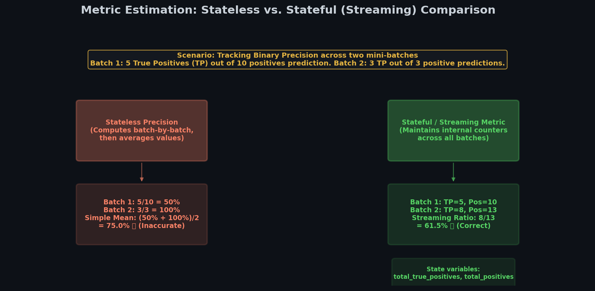

# 🔧 Module 2: Custom Losses, Metrics, Layers, and Models
> **Ch. 12 — Hands-On ML with Scikit-Learn, Keras & TensorFlow (Aurélien Géron)**

---

## 📌 Table of Contents
1. [Start Here: The Big Picture](#big-picture)
2. [Custom Loss Functions](#custom-loss)
3. [Saving Custom Objects with get_config()](#saving)
4. [Custom Activation Functions, Initializers, Regularizers, Constraints](#custom-activations)
5. [Custom Metrics — Stateful vs. Stateless](#custom-metrics)
6. [Custom Layers](#custom-layers)
7. [Custom Models](#custom-models)
8. [Common Beginner Mistakes](#mistakes)
9. [Interview Q&A](#interview)
10. [⚡ One-Page Flash Card](#revision)

---

## 🌍 Start Here: The Big Picture {#big-picture}

> **TL;DR:** Keras's high-level API covers 90% of use cases, but when you need something it doesn't support — a novel loss function, a research paper's custom layer, a GAN training loop — you must go custom. Keras makes this clean: subclass the right base class, implement `call()`, implement `get_config()`.

**When do you need customization?**
| Custom Thing | When Needed |
|-------------|-------------|
| Custom Loss | Novel research loss (e.g., focal loss, contrastive loss) |
| Custom Metric | Domain-specific evaluation (e.g., mAP, BLEU, IoU) |
| Custom Layer | Novel architecture (e.g., attention, graph conv) |
| Custom Model | Non-sequential data flow (e.g., GAN, siamese) |
| Custom Training Loop | Fine-grained control (multi-optimizer, custom backprop) |

**The general pattern for ALL custom Keras components:**
```python
class MyCustomComponent(keras.SomeBaseClass):
    def __init__(self, hyperparams, **kwargs):
        super().__init__(**kwargs)  # pass name, dtype etc.
        self.hyperparams = hyperparams

    def call(self, inputs):  # or __call__ for regularizers
        # The actual computation
        return output

    def get_config(self):   # REQUIRED for model saving!
        base_config = super().get_config()
        return {**base_config, "hyperparams": self.hyperparams}
```

---

## 📉 Custom Loss Functions {#custom-loss}


> 📊 **Graph 03:** The Huber Loss function compared to MSE and MAE. It is quadratic for small errors (like MSE) and linear for large errors (like MAE), making it robust to outliers while maintaining a smooth gradient near zero.

### Approach 1: Simple Function (No Hyperparameters to Save)

```python
import tensorflow as tf
from tensorflow import keras

def huber_fn(y_true, y_pred):
    """
    Huber loss: MSE for small errors, MAE for large errors.
    Less sensitive to outliers than MSE while remaining smooth.
    """
    error = y_true - y_pred
    is_small_error = tf.abs(error) < 1.0          # threshold = 1.0
    squared_loss = tf.square(error) / 2
    linear_loss  = 1.0 * tf.abs(error) - 1.0**2 / 2  # threshold * |e| - threshold²/2
    return tf.where(is_small_error, squared_loss, linear_loss)

# Usage:
model.compile(loss=huber_fn, optimizer="nadam")

# Loading with custom loss:
model = keras.models.load_model("model.h5",
                                 custom_objects={"huber_fn": huber_fn})
```

**Problem:** What if you want a configurable threshold? You CAN use a closure:
```python
def create_huber(threshold=1.0):
    def huber_fn(y_true, y_pred):
        error = y_true - y_pred
        is_small = tf.abs(error) < threshold
        squared = tf.square(error) / 2
        linear  = threshold * tf.abs(error) - threshold**2 / 2
        return tf.where(is_small, squared, linear)
    return huber_fn

model.compile(loss=create_huber(2.0), optimizer="nadam")
```

**Problem with closure:** When you save the model and reload it, the `threshold=2.0` parameter is LOST. You must specify it again at load time!

---

### Approach 2: Subclass keras.losses.Loss (Hyperparameters Saved!)

The solution for saving hyperparameters with the model:

```python
class HuberLoss(keras.losses.Loss):
    """
    Custom Huber Loss with configurable threshold.
    Hyperparameters are saved with the model via get_config().
    """
    def __init__(self, threshold=1.0, **kwargs):
        self.threshold = threshold
        super().__init__(**kwargs)   # handles: name=, reduction=

    def call(self, y_true, y_pred):
        """The actual loss computation — returns per-instance losses."""
        error = y_true - y_pred
        is_small = tf.abs(error) < self.threshold
        squared_loss = tf.square(error) / 2
        linear_loss  = self.threshold * tf.abs(error) - self.threshold**2 / 2
        return tf.where(is_small, squared_loss, linear_loss)

    def get_config(self):
        """Serialize hyperparameters for model saving."""
        base_config = super().get_config()  # includes 'name' and 'reduction'
        return {**base_config, "threshold": self.threshold}

# Usage:
model.compile(loss=HuberLoss(threshold=2.0), optimizer="nadam")
model.save("my_model.h5")

# Load — threshold IS preserved in the HDF5 file!
model = keras.models.load_model("my_model.h5",
                                 custom_objects={"HuberLoss": HuberLoss})
```

**How saving works:**
1. `model.save()` → calls `loss_instance.get_config()` → saves as JSON
2. `keras.models.load_model()` → reads JSON → calls `HuberLoss.from_config(config)`
3. `from_config(config)` is inherited from `Loss` base class — calls `HuberLoss(**config)`

---

## 💾 Saving Custom Objects with get_config() {#saving}

**The Rule:** Any custom class that will be saved with a model MUST implement `get_config()`.

**General pattern:**
```python
def get_config(self):
    # Start with parent's config (handles: name, dtype, etc.)
    base_config = super().get_config()
    # Add YOUR hyperparameters
    return {**base_config, "param1": self.param1, "param2": self.param2}
```

**Loading pattern:**
```python
# Must explicitly tell Keras about ALL custom classes
model = keras.models.load_model(
    "model.h5",
    custom_objects={
        "HuberLoss": HuberLoss,
        "MyCustomLayer": MyCustomLayer,
        "MyCustomMetric": MyCustomMetric
    }
)
```

---

## ⚡ Custom Activation Functions, Initializers, Regularizers, Constraints {#custom-activations}

### Custom Activation (as simple function)

```python
def my_softplus(z):
    """Softplus: smooth ReLU approximation. f(z) = log(1 + e^z)"""
    return tf.math.log(1.0 + tf.exp(z))

# Or as a class (for hyperparameters):
class LeakyReLU(keras.layers.Layer):
    def __init__(self, alpha=0.01, **kwargs):
        super().__init__(**kwargs)
        self.alpha = alpha
    def call(self, x):
        return tf.where(x >= 0, x, self.alpha * x)
    def get_config(self):
        return {**super().get_config(), "alpha": self.alpha}
```

### Custom Glorot Initializer

```python
def my_glorot_initializer(shape, dtype=tf.float32):
    """
    Glorot normal: stddev = sqrt(2 / (fan_in + fan_out))
    shape[0] = fan_in, shape[1] = fan_out (for Dense layers)
    """
    stddev = tf.sqrt(2. / (shape[0] + shape[1]))
    return tf.random.normal(shape, stddev=stddev, dtype=dtype)
```

### Custom L1 Regularizer

```python
def my_l1_regularizer(weights):
    """L1 regularization: penalizes sum of absolute values of weights."""
    return tf.reduce_sum(tf.abs(0.01 * weights))

# As class (saves factor with model):
class MyL1Regularizer(keras.regularizers.Regularizer):
    def __init__(self, factor=0.01):
        self.factor = factor

    def __call__(self, weights):        # regularizers use __call__, not call!
        return tf.reduce_sum(tf.abs(self.factor * weights))

    def get_config(self):
        return {"factor": self.factor}
```

### Custom Weight Constraint

```python
def my_positive_weights(weights):
    """Constraint: all weights must be non-negative (ReLU on weights)."""
    return tf.where(weights < 0., tf.zeros_like(weights), weights)
```

### Using All Together

```python
layer = keras.layers.Dense(
    30,
    activation=my_softplus,
    kernel_initializer=my_glorot_initializer,
    kernel_regularizer=my_l1_regularizer,
    kernel_constraint=my_positive_weights
)
```

**What happens during training:**
1. Weights initialized by `my_glorot_initializer`
2. Forward pass: `my_softplus` applied to output
3. Loss computation: `my_l1_regularizer(weights)` added to main loss
4. After each update step: `my_positive_weights` applied to clip weights

---

## 📊 Custom Metrics — Stateful vs. Stateless {#custom-metrics}

**The critical distinction:**


> 📊 **Graph 04:** Stateful vs Stateless metrics. Stateful metrics accumulate running variables (like total_sum and total_count) across batches to compute the true epoch metric, rather than just averaging the batch means.

| Type | When to Use | Example |
|------|-------------|---------|
| **Stateless** (function) | Each batch has all info needed | Simple mean error |
| **Stateful** (class) | Need to accumulate across batches | Streaming precision, AUC |

### Stateless Custom Metric (Function)

```python
def create_huber_metric(threshold=1.0):
    def huber_metric(y_true, y_pred):
        error = y_true - y_pred
        is_small = tf.abs(error) < threshold
        squared = tf.square(error) / 2
        linear  = threshold * tf.abs(error) - threshold**2 / 2
        per_instance = tf.where(is_small, squared, linear)
        return tf.reduce_mean(per_instance)
    return huber_metric

model.compile(..., metrics=[create_huber_metric(2.0)])
```

### Stateful Custom Metric (Class) — More Powerful

```python
class HuberMetric(keras.metrics.Metric):
    """
    Streaming Huber metric: accumulates total and count across batches.
    Keras calls update_state() for each batch.
    Keras calls result() to get the final metric value.
    Keras calls reset_state() between epochs.
    """
    def __init__(self, threshold=1.0, **kwargs):
        super().__init__(**kwargs)
        self.threshold = threshold
        # tf.Variable to accumulate across batches
        self.huber_fn = HuberLoss(threshold)
        self.total = self.add_weight("total", initializer="zeros")  # sum of losses
        self.count = self.add_weight("count", initializer="zeros")  # total instances

    def update_state(self, y_true, y_pred, sample_weight=None):
        """Called after each batch — accumulate running sums."""
        metric_value = self.huber_fn(y_true, y_pred)
        self.total.assign_add(tf.reduce_sum(metric_value))
        self.count.assign_add(tf.cast(tf.size(y_true), tf.float32))

    def result(self):
        """Return the current metric value (total / count)."""
        return self.total / self.count

    def get_config(self):
        base_config = super().get_config()
        return {**base_config, "threshold": self.threshold}

# Usage:
model.compile(..., metrics=[HuberMetric(2.0)])
```

**Why stateful?** If you evaluate on 1000 batches of 32 instances, you need:
- Batch 1: sum_loss_1, count = 32
- Batch 2: total_sum = sum_1 + sum_2, count = 64
- ...
- Final: total_sum / (1000 × 32) = true mean metric

A simple function would just average the batch means (wrong if batches are different sizes!).

---

## 🔩 Custom Layers {#custom-layers}

### When to subclass keras.layers.Layer

1. The layer has **learnable weights** (Dense, Conv, Attention)
2. The layer has **complex internal state** 
3. The layer is NOT just a combination of existing layers

```python
class MyDense(keras.layers.Layer):
    """
    Custom reimplementation of Dense layer.
    Demonstrates the proper custom layer pattern.
    """
    def __init__(self, units, activation=None, **kwargs):
        super().__init__(**kwargs)
        self.units = units
        self.activation = keras.activations.get(activation)

    def build(self, input_shape):
        """
        Called ONCE on first call with actual input shape.
        Create weight variables here (input_shape unknown until build()).
        """
        self.W = self.add_weight(name="weights",
                                  shape=[input_shape[-1], self.units],
                                  initializer="glorot_normal")
        self.b = self.add_weight(name="bias",
                                  shape=[self.units],
                                  initializer="zeros")
        super().build(input_shape)  # marks layer as built

    def call(self, X):
        """The forward computation."""
        return self.activation(X @ self.W + self.b)

    def compute_output_shape(self, input_shape):
        """Optional but useful for graph mode."""
        return tf.TensorShape(input_shape.as_list()[:-1] + [self.units])

    def get_config(self):
        base_config = super().get_config()
        return {**base_config, "units": self.units,
                "activation": keras.activations.serialize(self.activation)}
```

### Custom Layer with Different Train/Test Behavior

```python
class MyDropout(keras.layers.Layer):
    """Custom Dropout that drops neurons only during training."""

    def __init__(self, rate, **kwargs):
        super().__init__(**kwargs)
        self.rate = rate

    def call(self, X, training=None):
        """training argument is passed by Keras automatically."""
        if training:
            # During training: randomly zero out neurons
            keep_prob = 1 - self.rate
            random_tensor = tf.random.uniform(shape=tf.shape(X))
            binary_mask = tf.floor(random_tensor + keep_prob)
            return X * binary_mask / keep_prob  # inverted dropout scaling
        return X  # during evaluation: pass through unchanged

    def get_config(self):
        return {**super().get_config(), "rate": self.rate}
```

> ⚠️ **Critical:** Custom layers that behave differently during training vs. inference MUST accept a `training` argument in `call()` and propagate it if calling other layers internally.

---

## 🏗️ Custom Models {#custom-models}

### When to use the Subclassing API for Models

The Subclassing API gives maximum flexibility — any Python control flow (if/else, loops, etc.) is allowed.

```python
class ResidualUnit(keras.layers.Layer):
    """A single residual unit (skip connection block)."""

    def __init__(self, n_filters, strides=1, activation="relu", **kwargs):
        super().__init__(**kwargs)
        self.activation = keras.activations.get(activation)
        # Main path
        self.main_layers = [
            keras.layers.Conv2D(n_filters, 3, strides=strides,
                                 padding="same", use_bias=False),
            keras.layers.BatchNormalization(),
            keras.layers.Activation("relu"),
            keras.layers.Conv2D(n_filters, 3, strides=1, padding="same", use_bias=False),
            keras.layers.BatchNormalization()
        ]
        # Skip path (only if dimensions change)
        self.skip_layers = []
        if strides > 1:
            self.skip_layers = [
                keras.layers.Conv2D(n_filters, 1, strides=strides,
                                    padding="same", use_bias=False),
                keras.layers.BatchNormalization()
            ]

    def call(self, inputs):
        """Forward pass: main path + skip connection."""
        Z = inputs
        for layer in self.main_layers:
            Z = layer(Z)
        
        skip_Z = inputs
        for layer in self.skip_layers:
            skip_Z = layer(skip_Z)
        
        return self.activation(Z + skip_Z)  # element-wise add


class ResNet34(keras.Model):
    """Simplified ResNet-34 implementation."""

    def __init__(self, n_classes=10, **kwargs):
        super().__init__(**kwargs)
        self.n_classes = n_classes

        # Stem
        self.conv1 = keras.layers.Conv2D(64, 7, strides=2, padding="same", use_bias=False)
        self.bn1   = keras.layers.BatchNormalization()
        self.relu1 = keras.layers.Activation("relu")
        self.pool1 = keras.layers.MaxPooling2D(pool_size=3, strides=2, padding="same")

        # Residual blocks
        prev_filters = 64
        self.res_layers = []
        for filters, reps, strides in ((64, 3, 1), (128, 4, 2), (256, 6, 2), (512, 3, 2)):
            self.res_layers.append(ResidualUnit(filters, strides=strides))
            for _ in range(reps - 1):
                self.res_layers.append(ResidualUnit(filters))

        # Head
        self.gap = keras.layers.GlobalAveragePooling2D()
        self.output_layer = keras.layers.Dense(n_classes, activation="softmax")

    def call(self, inputs):
        Z = self.conv1(inputs)
        Z = self.bn1(Z)
        Z = self.relu1(Z)
        Z = self.pool1(Z)
        for res_layer in self.res_layers:
            Z = res_layer(Z)
        Z = self.gap(Z)
        return self.output_layer(Z)
```

---

## ❌ Common Beginner Mistakes {#mistakes}

**1. Not implementing get_config() for custom classes** ❌
> Reality: If you save a model with custom components (losses, layers, metrics) and don't implement `get_config()`, loading will fail or hyperparameters will be lost. ALWAYS implement `get_config()` for any custom class you want to save.

**2. Using Python mutable default arguments in __init__** ❌
> Reality: `def __init__(self, layers=[])` creates ONE list shared across all instances! Use `layers=None` and `self.layers = layers or []` inside the method.

**3. Not calling `super().__init__(**kwargs)` in custom layers** ❌
> Reality: The base class `__init__` sets the layer's `name`, `dtype`, and other important attributes. Skipping it can cause subtle bugs, missing names in model summaries, and serialization issues.

**4. Implementing custom metrics as functions when accumulation is needed** ❌
> Reality: A metric function called on each batch only has batch-level information. To compute a true mean across an epoch (especially with variable batch sizes), you need a stateful metric class with `add_weight()`, `update_state()`, and `result()`.

**5. Calling non-Keras Python control flow inside @tf.function** ❌
> Reality: `if x > 0:` inside `@tf.function` checks the Python VALUE of x during tracing (not the tensor value). Use `tf.cond(x > 0, ...)` for conditional logic on tensors, or `@tf.function(input_signature=...)` to control retracing.

---

## 🎤 Interview Q&A {#interview}

**Q1: What's the difference between implementing a custom loss as a function vs. a class?**
> **A:** A function is simpler but can't save hyperparameters with the model. A function closure (`create_huber(threshold=2.0)`) can be parameterized but loses the threshold at load time — you must specify it again. A class (subclassing `keras.losses.Loss`) implements `get_config()` which serializes all hyperparameters to JSON when saving, so they're automatically restored at load time.

**Q2: What are the three methods you must implement for a custom Keras metric class?**
> **A:** (1) `update_state(y_true, y_pred, sample_weight=None)`: called after each batch, accumulates running sums using `tf.Variable` added with `self.add_weight()`. (2) `result()`: called at the end of each epoch, returns `total / count` or similar. (3) `reset_state()`: inherited from base class, resets all weights to 0 between epochs (usually don't need to override). Also implement `get_config()` for saving.

**Q3: What is the difference between the `build()` and `call()` methods in a custom layer?**
> **A:** `build(input_shape)` is called ONCE the first time the layer is used — it creates the layer's weight variables. It's called lazily because the input shape (needed to determine weight shapes, e.g., kernel shape depends on `input_shape[-1]`) is only known when data flows through. `call(inputs)` is called for EVERY forward pass — it's the actual computation. Putting weight creation in `build()` instead of `__init__()` allows input-shape-dependent weights without knowing the shape ahead of time.

**Q4: How does Keras handle train vs. test behavior in custom layers?**
> **A:** The `call()` method receives an optional `training` boolean argument (passed automatically by Keras when the model is called with `training=True/False`). Your custom layer can use this to implement different behavior: `if training: (apply dropout) else: (pass through)`. This is how `Dropout` and `BatchNormalization` are implemented.

---

## ⚡ One-Page Flash Card {#revision}

```
╔══════════════════════════════════════════════════════════════════════╗
║         MODULE 2 — CUSTOM KERAS COMPONENTS FLASH CARD                 ║
╠══════════════════════════════════════════════════════════════════════╣
║                                                                        ║
║  CUSTOM LOSS:                                                          ║
║  Function: def loss(y_true, y_pred) → no hyperparameter saving       ║
║  Class: subclass Loss, implement call() + get_config() → SAVES       ║
║                                                                        ║
║  CUSTOM METRIC:                                                        ║
║  Stateless: function (batch-level only)                               ║
║  Stateful: subclass Metric, add_weight() + update_state() + result() ║
║  update_state() accumulates; result() = total/count                  ║
║                                                                        ║
║  CUSTOM LAYER:                                                         ║
║  Subclass Layer, implement:                                           ║
║    __init__: set hyperparams (don't create weights here!)            ║
║    build(input_shape): add_weight() — called ONCE                    ║
║    call(inputs, training=None): forward pass — called EVERY time     ║
║    get_config(): serialize hyperparams for saving                    ║
║                                                                        ║
║  CUSTOM REGULARIZER: __call__() (not call!), get_config()            ║
║                                                                        ║
║  SAVING RULE:                                                          ║
║  Any custom class → implement get_config() → return {**base, ...}   ║
║  Load with: custom_objects={"ClassName": ClassName}                  ║
║                                                                        ║
╚══════════════════════════════════════════════════════════════════════╝
```

---

---

**🔗 Previous Module →** [01_TensorFlow_Quick_Tour_and_NumPy_Basics.md](01_TensorFlow_Quick_Tour_and_NumPy_Basics.md)  
**🔗 Next Module →** [03_Custom_Layers_and_Models.md](03_Custom_Layers_and_Models.md)
