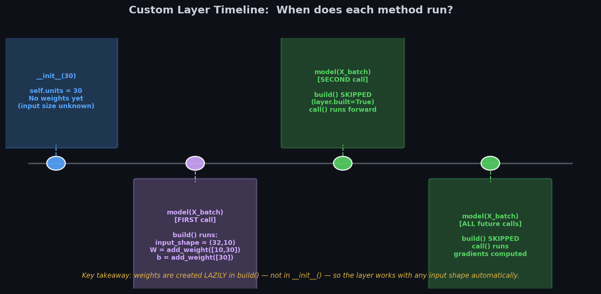
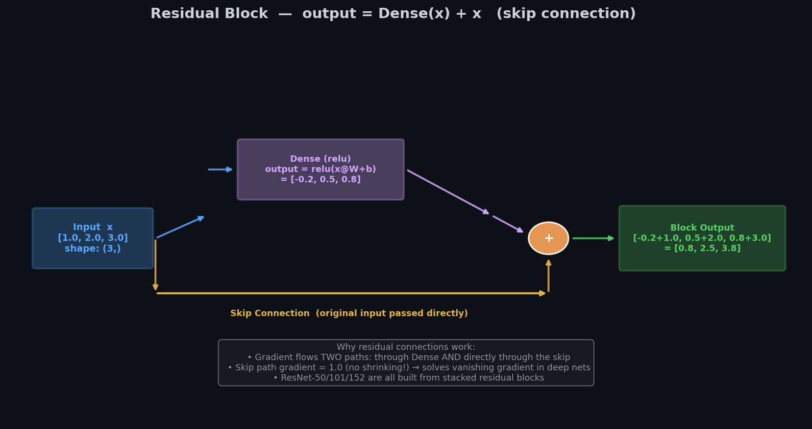

# 🏗️ Module 3: Custom Layers and Models
> **Ch. 12 — Hands-On ML with Scikit-Learn, Keras & TensorFlow**
> **Rewritten: Plain English → Real Numbers → Code → Why It Matters**

---

## 📌 Table of Contents
1. [The Big Picture: When Do You Need Custom Layers?](#big-picture)
2. [Stateless Layers (No Weights)](#stateless-layers)
3. [Stateful Layers (With Learnable Weights)](#stateful-layers)
4. [The build() vs. __init__() Distinction (Critical!)](#build-vs-init)
5. [Layers with Multiple Inputs/Outputs](#multi-io)
6. [Custom Models (Subclassing keras.Model)](#custom-models)
7. [Internal Losses (self.add_loss)](#internal-losses)
8. [Common Mistakes (Wrong vs. Right)](#mistakes)
9. [How It All Connects](#connects)
10. [Flash Card](#flashcard)

---

## 🌍 1. The Big Picture: When Do You Need Custom Layers? {#big-picture}

Keras has many built-in layers: `Dense`, `Conv2D`, `LSTM`, `Dropout`, etc.

**Use a custom layer when:**
- Your computation doesn't exist as a built-in
- You need learnable weights with a custom formula
- You're implementing a research paper's novel architecture

**Three levels of customization:**

```
Level 1: Stateless Layer (no weights, just math)
         → tf.keras.layers.Lambda(lambda x: tf.exp(x))

Level 2: Stateful Layer (has learnable weights)
         → Subclass keras.layers.Layer, implement build() and call()

Level 3: Custom Model (multiple layers, dynamic routing)
         → Subclass keras.Model, implement call() with Python logic
```

### 🏠 The LEGO Analogy

Standard Keras layers are like pre-made LEGO bricks. Most of the time they work. But if you need a custom curved brick that doesn't exist in the set, you have to design and mold your own. Custom layers are your mold.

---

## 🔍 2. Stateless Layers (No Weights) {#stateless-layers}

A **stateless** layer just applies a math function — no learnable parameters.

```python
import tensorflow as tf
from tensorflow import keras

# Exponential layer: output = e^input
exponential_layer = keras.layers.Lambda(lambda x: tf.exp(x))

# Used in a model:
model = keras.models.Sequential([
    keras.layers.Dense(30, activation="relu"),
    exponential_layer        # applies exp() to all outputs
])
```

### 🔢 What It Does with Numbers

```
Dense output: [0.5, -1.2, 2.1, 0.0]

After exponential_layer (e^x):
  e^0.5  = 1.649
  e^-1.2 = 0.301
  e^2.1  = 8.166
  e^0.0  = 1.000

Layer output: [1.649, 0.301, 8.166, 1.000]
```

**When to use Lambda:** Quick, one-line transformations. For anything more complex (needs weights, needs saving), use a proper subclass.

---

## 🏗️ 3. Stateful Layers (With Learnable Weights) {#stateful-layers}

A **stateful** layer has learnable parameters (like `Dense` — it has a weight matrix and a bias).

**You must implement these 4 methods:**


| Method | When Called | Purpose |
|--------|------------|---------|
| `__init__()` | When you write `MyLayer(30)` | Save hyperparameters (units, activation) |
| `build(input_shape)` | First time data flows through | Create weight tensors (W, b) |
| `call(inputs)` | Every forward pass | The actual computation |
| `get_config()` | When saving model | Serialize hyperparameters |

### 🔢 Building a Custom Dense Layer from Scratch

A normal `Dense` layer computes: `output = activation(input @ W + b)`

Let's build one manually:

```python
class MyDense(keras.layers.Layer):
    def __init__(self, units, activation=None, **kwargs):
        super().__init__(**kwargs)
        self.units = units
        self.activation = keras.activations.get(activation)

    def build(self, input_shape):
        # input_shape[-1] = number of input features
        # W shape: (n_inputs, n_outputs)
        self.W = self.add_weight(
            name="weights",
            shape=[input_shape[-1], self.units],
            initializer="glorot_uniform"
        )
        # b shape: (n_outputs,)
        self.b = self.add_weight(
            name="bias",
            shape=[self.units],
            initializer="zeros"
        )
        super().build(input_shape)    # marks layer as "built"

    def call(self, inputs):
        return self.activation(inputs @ self.W + self.b)

    def get_config(self):
        return {**super().get_config(),
                "units": self.units,
                "activation": keras.activations.serialize(self.activation)}
```

### 🔢 Forward Pass With Real Numbers

```
Input: 2 samples, 3 features each
X = [[1.0, 2.0, 3.0],
     [4.0, 5.0, 6.0]]
Shape: (2, 3)

Layer: MyDense(2) — 3 inputs, 2 output units

W (3×2, initialized):          b (1×2, zeros):
[[0.5, -0.3],                  [0.0, 0.0]
 [0.2,  0.4],
 [-0.1, 0.6]]

Computation: X @ W + b

Sample 1: [1,2,3] @ W + b
  unit 1: 1×0.5 + 2×0.2 + 3×(-0.1) + 0 = 0.5 + 0.4 - 0.3 = 0.6
  unit 2: 1×(-0.3) + 2×0.4 + 3×0.6 + 0 = -0.3 + 0.8 + 1.8 = 2.3

Sample 2: [4,5,6] @ W + b
  unit 1: 4×0.5 + 5×0.2 + 6×(-0.1) = 2.0 + 1.0 - 0.6 = 2.4
  unit 2: 4×(-0.3) + 5×0.4 + 6×0.6 = -1.2 + 2.0 + 3.6 = 4.4

Output (before activation):
[[0.6, 2.3],
 [2.4, 4.4]]
```

---

## 🔑 4. The build() vs. __init__() Distinction (Critical!) {#build-vs-init}

**The question:** Why create weights in `build()` instead of `__init__()`?

**The answer:** When you write `MyDense(30)`, you don't know yet how many input features there will be. You only know that when real data flows through. `build()` is called the first time data arrives, so it can use `input_shape[-1]` dynamically.

### 🔢 Wrong Way: Hardcoding in __init__

```python
# ❌ WRONG
class MyDense(keras.layers.Layer):
    def __init__(self, units, n_inputs, **kwargs):
        super().__init__(**kwargs)
        self.W = self.add_weight(shape=[n_inputs, units])  # hardcoded!
        self.b = self.add_weight(shape=[units])

# Problem: You have to know n_inputs when you create the layer.
# This breaks if you reuse the layer with different input sizes.
layer = MyDense(30, n_inputs=10)   # rigid, inflexible
```

```python
# ✅ RIGHT — input shape is detected automatically
class MyDense(keras.layers.Layer):
    def __init__(self, units, **kwargs):
        super().__init__(**kwargs)
        self.units = units

    def build(self, input_shape):
        # input_shape is passed automatically when first call happens
        self.W = self.add_weight(shape=[input_shape[-1], self.units])
        self.b = self.add_weight(shape=[self.units])

layer = MyDense(30)    # flexible, works with any input size ✅
```

### Timeline of what happens:



```
1. You write: layer = MyDense(30)
   → __init__() runs: saves self.units = 30
   → NO weights yet (input size unknown)

2. You write: model(X_batch)  ← first time with X of shape (32, 10)
   → build(input_shape=(32, 10)) runs: creates W shape (10,30), b shape (30,)
   → layer.built = True

3. Every subsequent: model(X_batch)
   → build() is SKIPPED (already built)
   → call(inputs) runs the forward pass
```

---

## 🔀 5. Layers with Multiple Inputs/Outputs {#multi-io}

Some layers take two inputs (like an attention layer combining query + context), or return multiple outputs.

### 🔢 Example: A layer that takes two inputs

```
Purpose: combine two student score arrays
Input A: [Math, Science] = [85, 90]
Input B: [Lab, Project]  = [70, 80]

Output 1 (sum):  [85+70, 90+80] = [155, 170]
Output 2 (diff): [85-70, 90-80] = [15,  10]
```

```python
class MergeLayer(keras.layers.Layer):
    def call(self, inputs):
        A, B = inputs            # unpack the tuple of inputs
        return A + B, A - B      # return a tuple of outputs

# Usage:
layer = MergeLayer()
A = tf.constant([[85., 90.]])
B = tf.constant([[70., 80.]])
sum_out, diff_out = layer((A, B))
print(sum_out.numpy())    # [[155. 170.]]
print(diff_out.numpy())   # [[ 15.  10.]]
```

---

## 🏗️ 6. Custom Models (Subclassing keras.Model) {#custom-models}

When you need **dynamic logic** in the forward pass — loops, branches, conditional paths — use `keras.Model` subclassing.

**The most famous example: Residual connections (Skip connections)**

### What is a residual connection?



```
Normal layer:          output = f(input)
Residual connection:   output = f(input) + input    ← ADD THE INPUT BACK!
```

**Why is this useful?** In very deep networks, gradients can vanish (become nearly zero) by the time they reach early layers. Adding the input directly creates a "shortcut highway" for gradients to flow back without shrinking.

### 🔢 Residual Block Worked Example

```
Input to block: [1.0, 2.0, 3.0]

Dense layer computes: [-0.2, 0.5, 0.8]   (simplified)

Residual output = Dense_output + original_input
               = [-0.2 + 1.0, 0.5 + 2.0, 0.8 + 3.0]
               = [0.8, 2.5, 3.8]

The gradient now flows both through Dense AND directly through the shortcut.
This is why ResNets can have 50, 100, even 1000 layers without vanishing gradients!
```

```python
class ResidualBlock(keras.layers.Layer):
    def __init__(self, units, **kwargs):
        super().__init__(**kwargs)
        self.dense = keras.layers.Dense(units, activation="relu")

    def call(self, inputs):
        # Main path: through the dense layer
        main_output = self.dense(inputs)
        # Skip connection: add original inputs back
        return main_output + inputs   # requires inputs and main_output have same shape!

    def get_config(self):
        return super().get_config()


class ResidualRegressor(keras.Model):
    def __init__(self, output_dim, **kwargs):
        super().__init__(**kwargs)
        self.hidden1 = keras.layers.Dense(30, activation="relu")
        self.block1  = ResidualBlock(30)    # skip connection block
        self.block2  = ResidualBlock(30)    # second skip connection block
        self.output_layer = keras.layers.Dense(output_dim)

    def call(self, inputs):
        x = self.hidden1(inputs)    # first transformation
        x = self.block1(x)          # + skip
        x = self.block2(x)          # + skip again
        return self.output_layer(x)
```

### 🔢 Forward Pass Through the Full Model

```
Input: [1.0, 0.5, -0.3, ...]  (some feature vector)
       ↓ hidden1 (Dense, 30 units, relu)
       [0.4, 1.2, 0.0, 0.7, ...]  (shape: 30)
       ↓ block1 (Dense + skip)
       main: [0.2, 0.9, 0.1, 0.6, ...]
       skip: [0.4, 1.2, 0.0, 0.7, ...]  ← the original input to this block
       sum:  [0.6, 2.1, 0.1, 1.3, ...]  (shape: 30)
       ↓ block2 (same thing again)
       ...
       ↓ output_layer (Dense, 1 unit)
       [4.2]  ← final prediction
```

---

## 📈 7. Internal Losses (self.add_loss) {#internal-losses}

Sometimes a layer wants to add its own penalty to the total loss — not based on predictions vs. targets, but based on its own internal state.

**Example: Reconstruction regularization**

The idea: Force a hidden layer to be able to reconstruct its input. This makes the hidden representation more informative.

```python
class ReconstructionRegressor(keras.Model):
    def __init__(self, output_dim, **kwargs):
        super().__init__(**kwargs)
        self.hidden = keras.layers.Dense(30, activation="relu")
        self.out_layer = keras.layers.Dense(output_dim)

    def build(self, input_shape):
        # Reconstruction layer tries to rebuild the original input
        self.reconstruct = keras.layers.Dense(input_shape[-1])
        super().build(input_shape)

    def call(self, inputs):
        hidden = self.hidden(inputs)
        reconstructed = self.reconstruct(hidden)

        # Penalty: how different is the reconstruction from the original?
        recon_loss = tf.reduce_mean(tf.square(reconstructed - inputs))
        self.add_loss(0.05 * recon_loss)   # weighted penalty added to total loss

        return self.out_layer(hidden)
```

### 🔢 What add_loss Does

```
Suppose main loss (MSE of predictions) = 0.50
And reconstruction error = 0.30
Weight = 0.05

Reconstruction penalty = 0.05 × 0.30 = 0.015

Total loss used for backpropagation = 0.50 + 0.015 = 0.515
                                        ↑              ↑
                                   from y_pred     from add_loss()
```

---

## ❌ 8. Common Mistakes (Wrong vs. Right) {#mistakes}

### Mistake 1: Creating weights in __init__

```python
# ❌ WRONG — must know input size upfront
class MyLayer(keras.layers.Layer):
    def __init__(self, units, n_inputs, **kwargs):
        super().__init__(**kwargs)
        self.W = self.add_weight(shape=[n_inputs, units])

# ✅ RIGHT — input size detected automatically
class MyLayer(keras.layers.Layer):
    def __init__(self, units, **kwargs):
        super().__init__(**kwargs)
        self.units = units

    def build(self, input_shape):
        self.W = self.add_weight(shape=[input_shape[-1], self.units])
```

### Mistake 2: Calling model.summary() before building

```python
# ❌ WRONG — model not built yet, summary shows nothing
model = ResidualRegressor(1)
model.summary()   # ValueError: This model has not yet been built

# ✅ RIGHT — build by passing dummy data first
model = ResidualRegressor(1)
model(tf.zeros([1, 10]))   # forces build() to run with shape (1, 10)
model.summary()            # now shows correct architecture ✅
```

### Mistake 3: Residual block input/output shape mismatch

```python
# ❌ WRONG — residual requires same shape for +
class ResidualBlock(keras.layers.Layer):
    def __init__(self, units, **kwargs):
        super().__init__(**kwargs)
        self.dense = keras.layers.Dense(units)    # units=50

    def call(self, inputs):
        return self.dense(inputs) + inputs    # ERROR if inputs.shape[-1] != 50!

# ✅ RIGHT — use a projection layer when sizes differ (or keep units the same)
def call(self, inputs):
    main = self.dense(inputs)
    # If input shape != output shape, add a 1x1 conv or linear projection
    # For same shape, the simple + works:
    return main + inputs
```

---

## 🔗 9. How It All Connects {#connects}

```
BUILDING BLOCKS (left to right = increasing complexity)

Lambda Layer          Stateful Layer          Custom Model
(no weights)         (has weights)           (dynamic logic)
     │                     │                      │
     │                     │                      │
tf.exp(x)            W, b learned             Multiple layers
                      via GradientTape         + Python if/loops
                                               + skip connections
                                               + add_loss()

ALL of these can be:
  ├── Used in Sequential model
  ├── Used in Functional API model
  ├── Used inside another custom model (composable!)
  └── Saved/loaded with model using get_config()
```

---

## ⚡ 10. Flash Card {#flashcard}

```
╔══════════════════════════════════════════════════════════════╗
║          MODULE 3 — CUSTOM LAYERS & MODELS FLASH CARD        ║
╠══════════════════════════════════════════════════════════════╣
║                                                              ║
║  STATEFUL LAYER (4 methods):                                 ║
║    __init__(units, **kwargs): store hyperparams              ║
║    build(input_shape): add_weight() — called ONCE            ║
║    call(inputs): the math — called EVERY forward pass        ║
║    get_config(): serialize hyperparams for saving            ║
║                                                              ║
║  WHY build() not __init__()?                                 ║
║    Input shape unknown until first data flows through.       ║
║    build() receives input_shape automatically.               ║
║                                                              ║
║  RESIDUAL CONNECTION:                                        ║
║    output = f(x) + x                                         ║
║    Gradient flows two paths: through f AND directly via x    ║
║    Solves vanishing gradient in very deep networks           ║
║                                                              ║
║  CUSTOM MODEL:                                               ║
║    Subclass keras.Model                                      ║
║    Define layers in __init__(), logic in call()              ║
║    Allows loops, branches, any Python control flow           ║
║    Tradeoff: harder to inspect/debug than Functional API     ║
║                                                              ║
║  INTERNAL LOSS:                                              ║
║    self.add_loss(penalty_tensor) inside call()               ║
║    Automatically added to total_loss during training         ║
║    Use for: reconstruction loss, KL divergence, sparsity     ║
║                                                              ║
╚══════════════════════════════════════════════════════════════╝
```

---

**🔗 Previous Module →** [02_Custom_Losses_and_Components.md](02_Custom_Losses_and_Components.md)
**🔗 Next Module →** [04_Autodiff_and_Custom_Training_Loops.md](04_Autodiff_and_Custom_Training_Loops.md)
