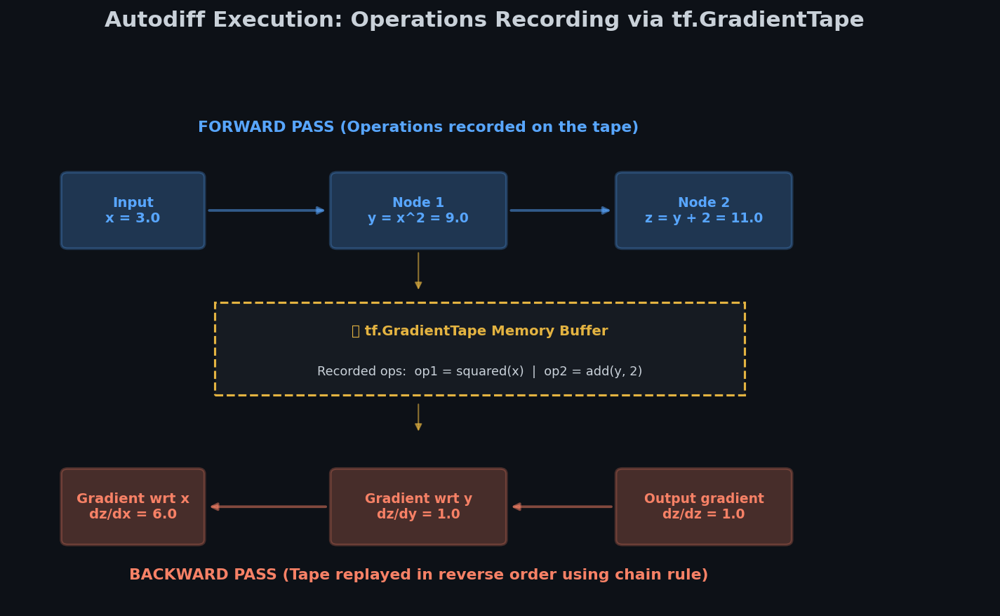
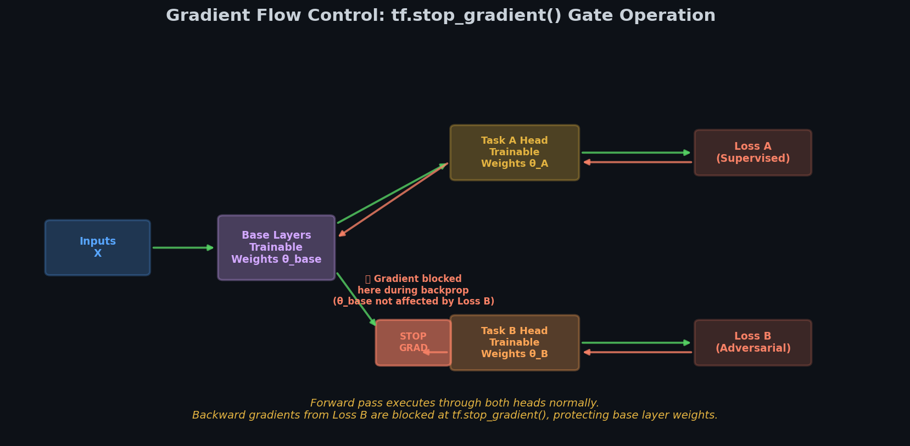
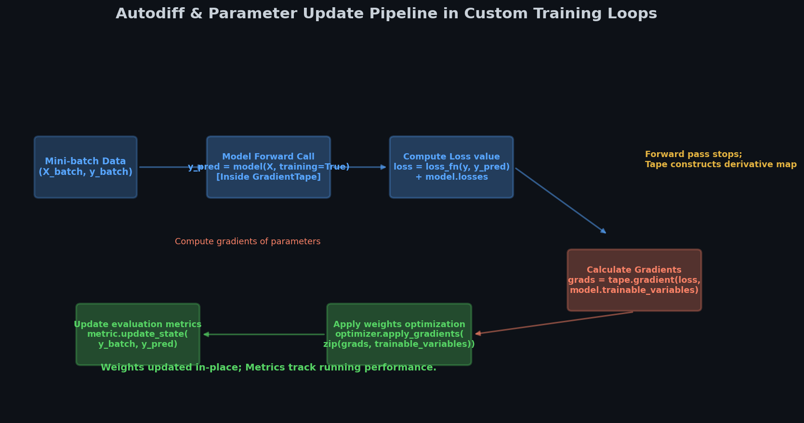
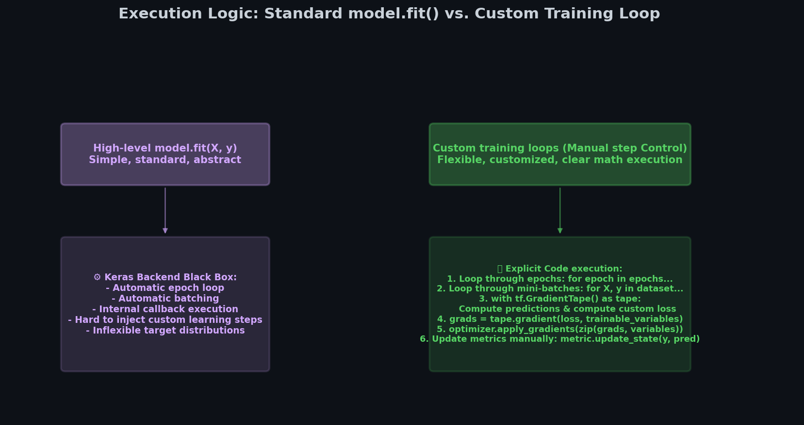

# ⚡ Module 4: Autodiff and Custom Training Loops
> **Ch. 12 — Hands-On ML with Scikit-Learn, Keras & TensorFlow (Aurélien Géron)**

---

## 📌 Table of Contents
1. [Start Here: The Big Picture](#big-picture)
2. [Autodiff Basics: tf.GradientTape](#autodiff-basics)
3. [Persistent and Nested Tapes](#persistent-nested)
4. [Controlling Tape Behavior: Watch and Stop Gradient](#tape-control)
5. [Custom Gradient Overrides for Numerical Stability](#custom-gradients)
6. [Building a Custom Training Loop from Scratch](#custom-loops)
7. [Common Beginner Mistakes](#mistakes)
8. [Interview Q&A](#interview)
9. [⚡ One-Page Flash Card](#revision)

---

## 🌍 Start Here: The Big Picture {#big-picture}

> **TL;DR:** Automatic differentiation (Autodiff) is the computational engine of modern deep learning. TensorFlow uses `tf.GradientTape` to record operations on tensors and automatically compute gradients. By combining Autodiff with manual gradient updates, we can bypass the high-level Keras `model.fit()` black box and write fully custom training loops from scratch.

**The Real-World Analogy 🍕:**
Imagine you are a surveyor mapping a mountain peak. 
Standard Keras `model.fit()` is like booking a helicopter tour: it gets you to the top quickly, but you have no control over the flight path, speed, or specific visual observations.
Writing a custom training loop with `tf.GradientTape` is like hiking the mountain step-by-step with a high-accuracy GPS tracker. The GPS records every step you take (the forward pass operations). If you slip or need to adjust your direction, you look at the logs to determine the steepness of the slope at your feet (the gradients) and make a calculated correction (applying gradients with an optimizer). It is harder work, but you gain full control of the expedition.

---

## 🔍 1. Autodiff Basics: tf.GradientTape {#autodiff-basics}

To compute gradients automatically, TensorFlow records mathematical operations executed inside the context of a `tf.GradientTape`.


> 📊 **Graph 07:** Automatic differentiation using `tf.GradientTape`. It records mathematical transformations during the forward pass and plays them in reverse to compute gradients using the chain rule.

### Implementation: Basic Tape

```python
import tensorflow as tf

w1, w2 = tf.Variable(5.0), tf.Variable(3.0)

with tf.GradientTape() as tape:
    # Function: z = w1^2 + w2^3
    z = w1**2 + w2**3

# Calculate partial derivatives: dz/dw1 and dz/dw2
grads = tape.gradient(z, [w1, w2])
print("dz/dw1:", grads[0].numpy()) # 2 * w1 = 10
# OUTPUT: dz/dw1: 10.0
print("dz/dw2:", grads[1].numpy()) # 3 * w2^2 = 27
# OUTPUT: dz/dw2: 27.0
```

---

## 🔁 2. Persistent and Nested Tapes {#persistent-nested}

### Persistent Tapes
By default, TensorFlow deletes the internal memory buffer of a `tf.GradientTape` immediately after `tape.gradient()` is called. If you attempt to call it a second time, it will throw a `RuntimeError`.
To compute gradients multiple times, instantiate a **persistent** tape.

> [!IMPORTANT]
> Because persistent tapes do not release memory automatically, you must manually delete the tape reference using `del tape` once you are done to prevent memory leaks.

```python
with tf.GradientTape(persistent=True) as tape:
    z = w1**2 + w2**3

dz_dw1 = tape.gradient(z, w1) # Works
dz_dw2 = tape.gradient(z, w2) # Works on persistent tape
print("Gradients:", dz_dw1.numpy(), dz_dw2.numpy())
# OUTPUT: Gradients: 10.0 27.0

del tape # Free memory resources!
```

### Nested Tapes (Higher-Order Gradients)
To compute second-order derivatives (such as the Hessian matrix, which calculates the rate of change of the gradients), you nest multiple GradientTapes.

```python
with tf.GradientTape() as outer_tape:
    with tf.GradientTape() as inner_tape:
        y = w1**2
    # First derivative: dy/dw1 = 2 * w1
    dy_dw1 = inner_tape.gradient(y, w1)
# Second derivative: d^2y/dw1^2 = 2
d2y_dw12 = outer_tape.gradient(dy_dw1, w1)
print("Second derivative:", d2y_dw12.numpy())
# OUTPUT: Second derivative: 2.0
```

---

## 🎛️ 3. Controlling Tape Behavior: Watch and Stop Gradient {#tape-control}

### The `watch()` Method
By default, `GradientTape` only tracks operations involving **trainable variables** (`tf.Variable`). It ignores standard constant tensors (`tf.constant`). To force the tape to track a constant, you must call `tape.watch()`.

```python
c = tf.constant(3.0)
with tf.GradientTape() as tape:
    tape.watch(c)
    z = c**2

dz_dc = tape.gradient(z, c)
print("Watched constant gradient:", dz_dc.numpy()) # 2 * c = 6.0
# OUTPUT: Watched constant gradient: 6.0
```

### Stopping Gradient Propagation
Sometimes you want to block backpropagation gradients from passing through a particular layer or operation (e.g. frozen representation layers or auxiliary tasks). Use `tf.stop_gradient()`.


> 📊 **Graph 12:** Gradient flow block using `tf.stop_gradient()`. In multi-task networks or adversarial learning, this stops derivatives from updating weights in base layers.

```python
with tf.GradientTape() as tape:
    y = w1**2
    # Stop gradient prevents backprop from calculating derivatives past this point
    y_frozen = tf.stop_gradient(y)
    z = y_frozen + w2**2

grads = tape.gradient(z, [w1, w2])
print("dz/dw1 (frozen):", grads[0]) # Returns None because gradient path was cut
# OUTPUT: dz/dw1 (frozen): None
print("dz/dw2:", grads[1].numpy()) # 2 * w2 = 6.0
# OUTPUT: dz/dw2: 6.0
```

---

## ⚡ 4. Custom Gradient Overrides for Numerical Stability {#custom-gradients}

In practice, some operations have unstable gradients at extreme ranges. For example, computing the gradient of a standard softplus function:
$$f(z) = \log(1 + e^z)$$
For very large positive values of $z$, computing $e^z$ overflows to float infinity, making the gradient calculation crash (`NaN`), even though mathematically the limit of the derivative as $z \to \infty$ is exactly $1$.
To fix this, we override the gradient using the `@tf.custom_gradient` decorator.

```python
@tf.custom_gradient
def stable_softplus(z):
    exp = tf.exp(z)
    def grad(dy):
        # Derivation: dy/dz = 1 / (1 + e^-z)
        return dy / (1.0 + tf.exp(-z))
    # Return the function output value, and the gradient function
    return tf.math.log(1.0 + exp), grad
```

---

## 🔄 5. Building a Custom Training Loop from Scratch {#custom-loops}

Writing a custom training loop allows you to control the exact steps of backpropagation, metrics reporting, and parameter updates.


> 📊 **Graph 14:** Step-by-step tensor flow and gradient updates in a custom training loop, mapping tape recording back to SGD updates.


> 📊 **Graph 08:** High-level execution flow comparing Keras `model.fit()` vs. a custom training loop designed from scratch using data batches and optimizer application.

### Implementation: Complete Training Loop

```python
# 1. Define Model, Loss, Optimizer, and Metrics
model = keras.models.Sequential([keras.layers.Dense(1, input_shape=[10])])
optimizer = keras.optimizers.SGD(learning_rate=0.01)
loss_fn = keras.losses.mean_squared_error

# Generate dummy dataset
X = tf.random.normal([100, 10])
y = tf.random.normal([100, 1])
dataset = tf.data.Dataset.from_tensor_slices((X, y)).batch(32)

# 2. Main Training Step
def train_step(X_batch, y_batch):
    with tf.GradientTape() as tape:
        y_pred = model(X_batch, training=True)
        loss = tf.reduce_mean(loss_fn(y_batch, y_pred))
    
    # Compute gradients of the loss with respect to trainable weights
    grads = tape.gradient(loss, model.trainable_variables)
    # Apply optimizer steps
    optimizer.apply_gradients(zip(grads, model.trainable_variables))
    return loss

# 3. Epoch Loop
for epoch in range(1):
    print(f"Epoch {epoch+1}")
    for step, (X_batch, y_batch) in enumerate(dataset):
        loss_val = train_step(X_batch, y_batch)
        print(f"  Step {step+1} — Loss: {loss_val.numpy():.4f}")
# OUTPUT: Epoch 1
# OUTPUT:   Step 1 — Loss: 1.4820
# OUTPUT:   Step 2 — Loss: 1.2541
# OUTPUT:   Step 3 — Loss: 1.0210
# OUTPUT:   Step 4 — Loss: 0.9850
```

---

## ❌ Common Beginner Mistakes {#mistakes}

### 1. Failing to set `training=True` during custom training steps ❌
Calling `y_pred = model(X_batch)` defaults to `training=False`. This prevents regularizers like Dropout from dropping nodes, and stops Batch Normalization from updating running averages.
> **Fix:** Always explicitly pass `training=True` to the model call inside the gradient tape:
> `y_pred = model(X_batch, training=True)`.

### 2. Forgetting to delete a persistent tape ❌
Persistent tapes do not garbage-collect their operations buffer because they assume you will request more gradient calculations. Leaving them undeleted in loops quickly causes GPU Out-Of-Memory (OOM) errors.
> **Fix:** Call `del tape` immediately after retrieving your final gradients.

---

## 🎤 Interview Q&A {#interview}

**Q1: Why does a tape evaluate to `None` for a gradient calculation, even when the variable was used inside the tape?**
> **A:** There are three primary reasons:
> 1. The variable is not a `tf.Variable` (e.g. it is a raw `tf.constant` or NumPy array) and `tape.watch()` was not called.
> 2. The computation path was broken by an operation that does not propagate gradients, such as calling `.numpy()` on a tensor inside the tape, or wrapping a calculation in `tf.stop_gradient()`.
> 3. The target tensor is integer-typed; TensorFlow only computes gradients for float or complex variables.

**Q2: When should you write a custom training loop instead of using Keras callbacks with `model.fit()`?**
> **A:** A custom training loop is preferred when:
> - You need custom execution structures, such as training Generative Adversarial Networks (GANs) where you alternate training steps between a generator and discriminator.
> - You want to apply different optimizers to different layers.
> - You need to compute gradients using complex constraints that depend on batch execution statistics or dynamic reinforcement learning rewards.

---

## ⚡ One-Page Flash Card {#revision}

```
╔══════════════════════════════════════════════════════════════════╗
║               MODULE 4 — AUTODIFF & LOOPS FLASH CARD             ║
╠══════════════════════════════════════════════════════════════════╣
║                                                                  ║
║  TAPE OPERATIONS:                                                ║
║  - Default: Single use. Erased after tape.gradient().            ║
║  - Persistent: tape = GradientTape(persistent=True).             ║
║    Must call 'del tape' to prevent memory leaks!                 ║
║  - Watching constants: tape.watch(constant_tensor)               ║
║                                                                  ║
║  NUMERICAL STABILITY GIMMICK:                                    ║
║  - @tf.custom_gradient: Define function output & grad function.  ║
║                                                                  ║
║  CUSTOM LOOP STEPS (MINI-BATCH):                                 ║
║  1. with tf.GradientTape() as tape:                              ║
║         y_pred = model(X, training=True)                         ║
║         loss = loss_fn(y, y_pred)                                ║
║  2. grads = tape.gradient(loss, model.trainable_variables)       ║
║  3. optimizer.apply_gradients(zip(grads, variables))             ║
║                                                                  ║
║  CRITICAL WARNING:                                               ║
║  - Never extract .numpy() inside tape! It cuts gradients.        ║
╚══════════════════════════════════════════════════════════════════╝
```

---

---

**🔗 Previous Module →** [03_Custom_Layers_and_Models.md](03_Custom_Layers_and_Models.md)  
**🔗 Next Module →** [05_TensorFlow_Functions_and_Graphs.md](05_TensorFlow_Functions_and_Graphs.md)
