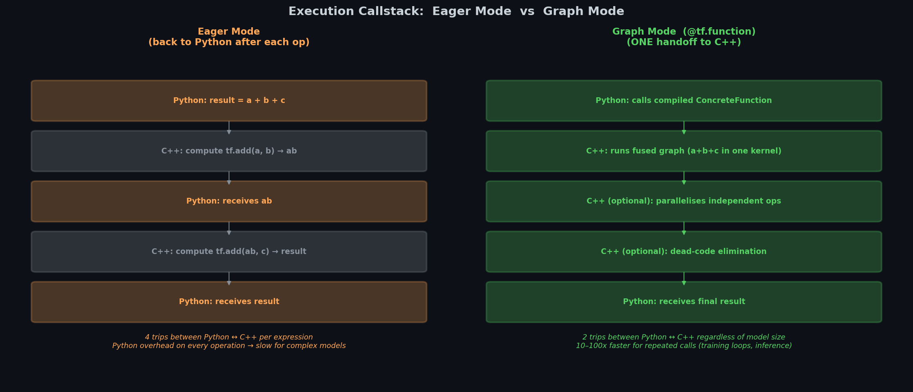
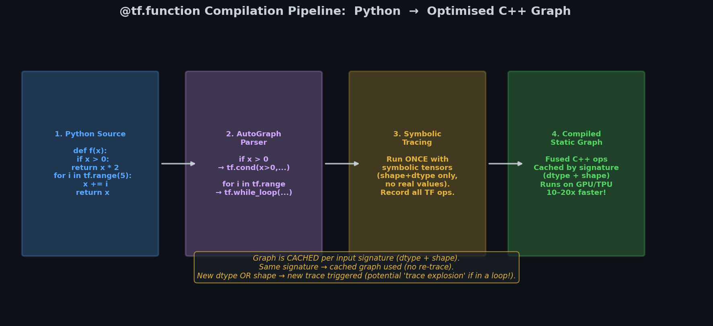
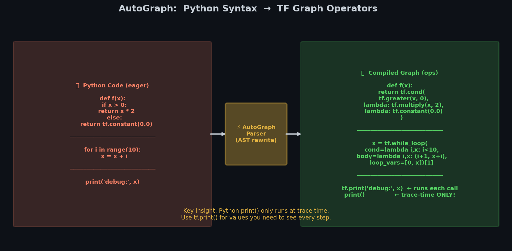
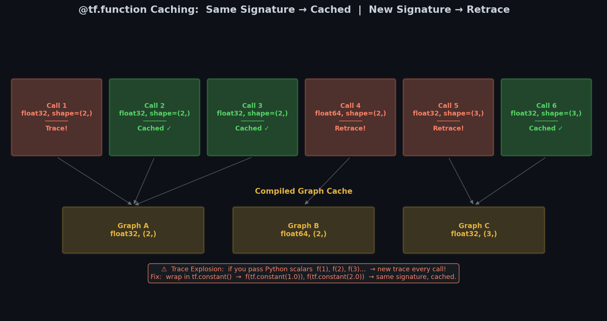

# 🕸️ Module 5: TensorFlow Functions and Graphs
> **Ch. 12 — Hands-On ML with Scikit-Learn, Keras & TensorFlow**
> **Rewritten: Plain English → Real Numbers → Code → Why It Matters**

---

## 📌 Table of Contents
1. [Eager vs. Graph: The Core Idea (Plain English)](#eager-vs-graph)
2. [@tf.function: What It Does and Why](#tf-function)
3. [How Tracing Works (Step by Step)](#tracing)
4. [AutoGraph: Python Code → TF Graph Nodes](#autograph)
5. [When Retracing Happens (The Hidden Trap)](#retracing)
6. [Rules for Code Inside @tf.function](#rules)
7. [Common Mistakes (Wrong vs. Right)](#mistakes)
8. [How It All Connects](#connects)
9. [Flash Card](#flashcard)

---

## 🌍 1. Eager vs. Graph: The Core Idea (Plain English) {#eager-vs-graph}

### What is "eager execution"?

When you run Python code normally, it executes line by line, immediately:

```python
x = tf.constant([2.0, 3.0])
y = x * x      # computed RIGHT NOW, result is [4.0, 9.0]
print(y)       # you can print it, debug it, check it
```

This is **eager execution** — operations execute immediately, you get real numbers back. Great for debugging.

### What is "graph execution"?

In graph mode, instead of computing results immediately, TF first builds a **blueprint** (the computation graph), then runs the whole blueprint at once in optimized C++ code.

```
Eager: Python → op1 → result → Python → op2 → result → Python → ...
            (back to Python after EACH operation)

Graph: Python builds blueprint → C++ runs ALL ops → returns result to Python
            (only two trips to/from Python, no matter how many ops)
```

### Why is Graph Faster?



| Optimization | What It Means | Example |
|-------------|---------------|---------|
| **Operator Fusion** | Combine consecutive ops into one GPU call | `(x*w) + b` becomes one fused kernel |
| **Parallel Execution** | Independent ops run simultaneously | Layer 1 and Layer 2 computed in parallel |
| **Dead Code Elimination** | Remove ops whose output is never used | Unused debug tensors removed |
| **Portability** | Graph works without Python | Deploy to mobile, browser, C++ server |

### 🔢 Speed Comparison (Real Impact)

```
Function: f(x) = x³ called 10,000 times

Eager mode:    ~2.1 seconds  (back to Python interpreter each call)
Graph mode:    ~0.1 seconds  (stays in C++, 20x faster!)

For large models with millions of parameters: 2x-10x speedup typical.
```

### 🏗️ Analogy: Building a Skyscraper

| Approach | Analogy |
|----------|---------|
| **Eager** | Build as you go — lay each brick, check it, then lay the next |
| **Graph** | Draw the full CAD blueprint first, then execute all at once with parallel crews |

The CAD blueprint approach is slower to set up but much faster to execute (especially when you run the building project 1000 times in training).

---

## 🚀 2. @tf.function: What It Does and Why {#tf-function}

Adding `@tf.function` above a Python function tells TensorFlow: "compile this into a graph the first time it's called."

```python
import tensorflow as tf

# Eager version: runs immediately, one op at a time
def eager_cube(x):
    return x ** 3

# Graph version: compiled and optimized
@tf.function
def graph_cube(x):
    return x ** 3

t = tf.constant([2.0, 3.0, 4.0])
print(eager_cube(t).numpy())    # [ 8. 27. 64.]  (computed eagerly)
print(graph_cube(t).numpy())    # [ 8. 27. 64.]  (same result, but via compiled graph)
```

**Same result, but graph_cube is faster** because:
1. First call: TF traces the function (builds the graph). This takes a moment.
2. All subsequent calls: TF runs the pre-built graph directly (skips Python entirely).

### When Should You Use @tf.function?

```
✅ Add @tf.function when:
   - Function is called many times (training steps, inference loops)
   - Function contains lots of tensor operations
   - Performance matters (production, training large models)

❌ Don't need @tf.function when:
   - Debugging (eager is easier to debug)
   - Function contains Python side-effects (print, list.append)
   - Function is called only once
```

---

## 🔍 3. How Tracing Works (Step by Step) {#tracing}

**Tracing** is the process of building the graph. Here's exactly what happens the first time you call a `@tf.function`:

### The Tracing Process



```
Step 1: AutoGraph transforms your Python code
        (Python if → tf.cond, Python for → tf.while_loop)

Step 2: TF runs your function with SYMBOLIC tensors
        (placeholders that have shape and dtype, but NO actual values)

Step 3: During this "dry run", TF records every TF operation

Step 4: The recorded operations become the computation graph

Step 5: The graph is compiled and cached for this input signature
```

### 🔢 Tracing with Real Example

```python
@tf.function
def my_fn(x):
    print("TRACING!")       # Python print — only during trace!
    tf.print("TF RUNNING")  # TF print — during every real execution
    return x * x

t = tf.constant([2.0, 3.0])
result = my_fn(t)    # First call: TRACES
# Output: TRACING!
# Output: TF RUNNING
# result: [4.0, 9.0]

result = my_fn(t)    # Second call: uses cached graph, NO tracing
# Output: TF RUNNING  (← only TF print, Python print skipped!)
# result: [4.0, 9.0]

result = my_fn(t)    # Third call: still uses cached graph
# Output: TF RUNNING
```

**Key insight:** `print("TRACING!")` only appeared once because it's Python code — it only runs during the trace phase. `tf.print()` runs every time because it becomes a node in the compiled graph.

---

## 📜 4. AutoGraph: Python Code → TF Graph Nodes {#autograph}



AutoGraph automatically converts Python control flow into equivalent TF operations:

| Python | AutoGraph converts to |
|--------|----------------------|
| `if condition:` | `tf.cond(condition, ...)` |
| `for i in tf.range(n):` | `tf.while_loop(...)` |
| `while condition:` | `tf.while_loop(...)` |
| `print(...)` | Nothing (only runs at trace time) |

### 🔢 Example: if statement

```python
@tf.function
def classify(x):
    if x > 0:      # AutoGraph converts this to tf.cond()
        return "positive"
    else:
        return "non-positive"
```

**What AutoGraph generates internally:**
```python
# Equivalent to:
@tf.function
def classify(x):
    return tf.cond(x > 0,
                   lambda: "positive",
                   lambda: "non-positive")
```

### 🔢 Example: for loop with tf.range

```python
@tf.function
def sum_range(n):
    total = tf.constant(0.0)
    for i in tf.range(n):         # tf.range → tf.while_loop
        total = total + tf.cast(i, tf.float32)
    return total

print(sum_range(5).numpy())   # 10.0  (0+1+2+3+4=10)
```

**If you use Python range instead:**
```python
@tf.function
def sum_python_range(n):
    total = 0.0
    for i in range(n):    # Python range!
        total = total + float(i)
    return total

# This UNROLLS the loop: 5 separate add ops in the graph (not a while_loop)
# For n=1000: 1000 separate ops in graph! Much larger graph.
```

---

## 🔁 5. When Retracing Happens (The Hidden Trap) {#retracing}



TF caches one graph per **input signature** (dtype + shape). A new signature = a new trace.

### 🔢 Retracing Example

```python
@tf.function
def square(x):
    print("Tracing!")
    return x * x

# Call 1: float32, shape=(2,)  → traces → caches
square(tf.constant([1.0, 2.0]))    # prints "Tracing!"

# Call 2: same signature → cached graph used
square(tf.constant([3.0, 4.0]))    # no "Tracing!" ← uses cached graph

# Call 3: float64, shape=(2,)  → new signature → retraces!
square(tf.constant([1.0, 2.0], dtype=tf.float64))   # prints "Tracing!" again!

# Call 4: shape=(3,) instead of (2,)  → new signature → retraces!
square(tf.constant([1.0, 2.0, 3.0]))   # prints "Tracing!" again!
```

### Python Scalars Cause Trace Explosion (!)

```python
@tf.function
def bad_fn(x, n):
    return x * n

# Each different Python int value triggers a new trace!
bad_fn(tf.constant(1.0), 1)    # traces with n=1
bad_fn(tf.constant(1.0), 2)    # traces with n=2
bad_fn(tf.constant(1.0), 3)    # traces with n=3
# 3 different traces! For 100 different values = 100 traces = slow!

# ✅ FIX: pass n as a tensor
@tf.function
def good_fn(x, n):
    return x * n

good_fn(tf.constant(1.0), tf.constant(1.0))   # traces once
good_fn(tf.constant(1.0), tf.constant(2.0))   # same signature, uses cache!
good_fn(tf.constant(1.0), tf.constant(3.0))   # same signature, uses cache!
```

**Diagnosis:** If you see "Tracing!" printed more than expected, you have a retracing problem.

---

## 📜 6. Rules for Code Inside @tf.function {#rules}

### Rule 1: No Python side-effects

Python statements (print, list.append, global variable changes) only run once during tracing. They are invisible during actual graph execution.

```python
results = []   # Python list

@tf.function
def bad_collect(x):
    results.append(x)   # Python list.append — only at trace time!
    return x * 2

bad_collect(tf.constant(1.0))
bad_collect(tf.constant(2.0))
bad_collect(tf.constant(3.0))

print(len(results))    # 1, not 3! Only trace call ran append.
```

**Fix:** Use `tf.TensorArray` or accumulate outside the function.

### Rule 2: Don't create tf.Variable inside @tf.function

```python
# ❌ WRONG
@tf.function
def create_var():
    w = tf.Variable(0.0)    # ValueError! Can't create Variable inside tf.function
    return w + 1

# ✅ RIGHT — create Variable outside
w = tf.Variable(0.0)    # created once, outside

@tf.function
def use_var():
    return w + 1
```

### Rule 3: Use tf.* operations, not NumPy inside the function

```python
import numpy as np

# ❌ WRONG — np.random.normal() runs ONCE at trace time, baked as constant
@tf.function
def bad_random(x):
    noise = np.random.normal(0, 1, x.shape)   # same noise every time!
    return x + noise

# ✅ RIGHT — tf.random.normal() generates new random values each call
@tf.function
def good_random(x):
    noise = tf.random.normal(tf.shape(x))     # different noise each call ✅
    return x + noise
```

### Rule 4: Use tf.range for loops (not Python range)

```python
# ❌ WRONG — Python range unrolls the loop
@tf.function
def unrolled_sum(n):
    total = tf.constant(0.0)
    for i in range(10):    # graph has 10 separate add ops
        total += float(i)
    return total

# ✅ RIGHT — tf.range creates a single while_loop node
@tf.function
def looped_sum(n):
    total = tf.constant(0.0)
    for i in tf.range(n):   # single while_loop node in graph
        total = total + tf.cast(i, tf.float32)
    return total
```

---

## ❌ 7. Common Mistakes (Wrong vs. Right) {#mistakes}

### Mistake 1: Python print vs. tf.print

```python
# ❌ WRONG for debugging inside @tf.function
@tf.function
def debug_fn(x):
    print("x =", x)    # only prints once, at trace time, shows symbolic tensor
    return x * 2

# ✅ RIGHT for debugging inside @tf.function
@tf.function
def debug_fn(x):
    tf.print("x =", x)    # prints every time the graph runs, shows real values
    return x * 2
```

### Mistake 2: Python scalar arguments causing retracing

```python
# ❌ WRONG — retracing for each value
@tf.function
def scale(x, factor):    # factor is Python int
    return x * factor

for i in range(10):
    scale(data, i)   # 10 retraces!

# ✅ RIGHT — use tf.constant so shape+dtype stays the same
for i in range(10):
    scale(data, tf.constant(float(i)))   # traced once, reused 9 times
```

### Mistake 3: NumPy ops inside @tf.function

```python
import numpy as np

# ❌ WRONG
@tf.function
def bad(x):
    return np.sqrt(x.numpy())    # errors in graph mode, .numpy() doesn't work in graph!

# ✅ RIGHT
@tf.function
def good(x):
    return tf.sqrt(x)    # TF equivalent ✅
```

### Mistake 4: if on a Python bool vs. tensor bool

```python
# ❌ WRONG — checking a Python bool, not a tensor!
is_training = True

@tf.function
def wrong_mode(x):
    if is_training:     # checks Python variable at trace time only!
        return x * 0.5  # dropout-like
    return x

# The graph is fixed to always use the trace-time value of is_training
# Changing is_training later has NO effect!

# ✅ RIGHT — pass it as a tensor argument
@tf.function
def correct_mode(x, training):    # tensor argument
    return tf.cond(training,
                   lambda: x * 0.5,   # if training
                   lambda: x)         # if not training
```

---

## 🔗 8. How It All Connects {#connects}

```
THE COMPLETE PICTURE: Eager ↔ Graph

Development / Debugging
─────────────────────────
Write model with keras.layers and standard Python
Run with eager execution (default in TF 2.x)
Debug freely: print tensors, use Python debugger

                    ↓ @tf.function applied
                    (or used inside Keras model automatically)

Production / Training at Scale
─────────────────────────────
First call with new signature:
  AutoGraph: Python if/for → tf.cond/tf.while_loop
  Trace: symbolic tensors, record all TF ops
  Compile: ops → optimized C++ computation graph
  Cache: store graph for this (dtype, shape) signature

All subsequent calls with same signature:
  Skip Python entirely
  Execute cached C++ graph
  Return result

                    ↓ Benefits

2x-20x faster training
Deployable to: TF Serving (C++), TF Lite (mobile), TF.js (browser)
Parallelism: independent ops run concurrently on GPU cores
```

---

## ⚡ 9. Flash Card {#flashcard}

```
╔══════════════════════════════════════════════════════════════╗
║          MODULE 5 — TF FUNCTIONS & GRAPHS FLASH CARD         ║
╠══════════════════════════════════════════════════════════════╣
║                                                              ║
║  EAGER vs. GRAPH:                                            ║
║    Eager: runs immediately, line-by-line, easy to debug      ║
║    Graph: compiled to C++, much faster, deployable           ║
║                                                              ║
║  @tf.function:                                               ║
║    First call with new signature → TRACE (builds graph)      ║
║    Same signature again → use CACHED graph (fast)            ║
║    New dtype or shape → RETRACE (new graph built)            ║
║                                                              ║
║  AUTOGRAPH converts:                                         ║
║    Python if  → tf.cond()                                    ║
║    for/while  → tf.while_loop()   (use tf.range!)            ║
║    print()    → runs at trace only (use tf.print instead!)   ║
║                                                              ║
║  RULES inside @tf.function:                                  ║
║    ❌ Don't: Python print, list.append, global var changes   ║
║    ❌ Don't: create tf.Variable inside function              ║
║    ❌ Don't: NumPy ops (use tf.* equivalents)                ║
║    ❌ Don't: Python scalars as args (causes trace explosion)  ║
║    ✅ Do: tf.print, tf.range, tf.Variable outside, tf.*      ║
║                                                              ║
║  TRACE EXPLOSION DIAGNOSIS:                                  ║
║    Put Python print inside function.                         ║
║    If it prints more than once = retracing = problem!        ║
║    Fix: wrap Python scalars in tf.constant()                 ║
║                                                              ║
╚══════════════════════════════════════════════════════════════╝
```

---

**🔗 Previous Module →** [04_Autodiff_and_Custom_Training_Loops.md](04_Autodiff_and_Custom_Training_Loops.md)
**🔗 Chapter Complete! →** [Back to Chapter Index](../notes.md)
