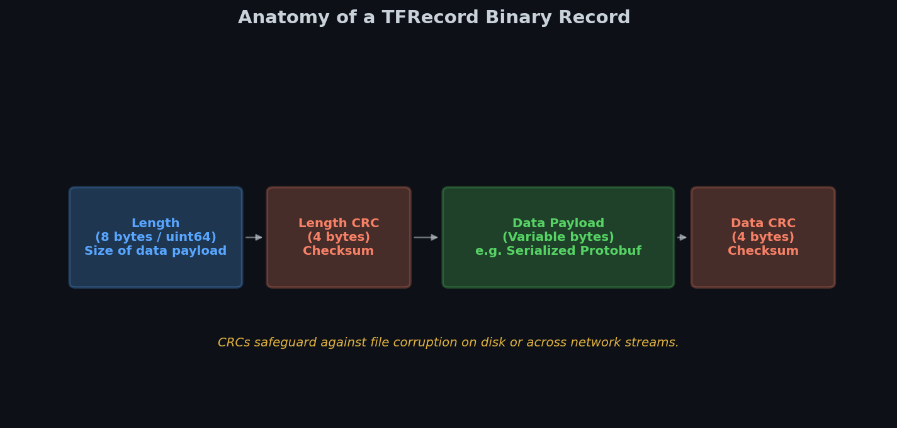
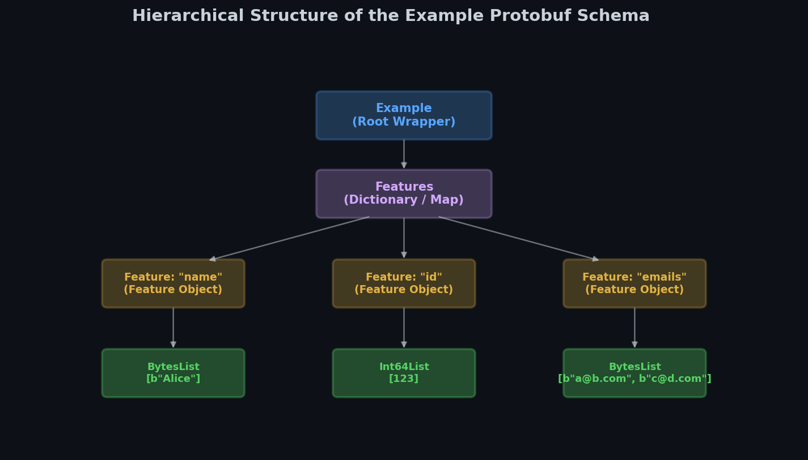
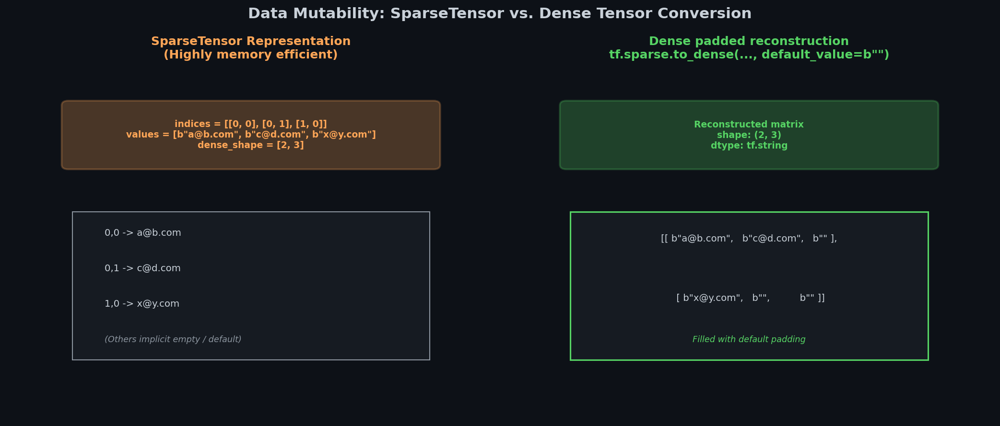

# 🧠 Module 2: The TFRecord Format and Protobufs
> **Ch. 13 — Hands-On ML with Scikit-Learn, Keras & TensorFlow (Aurélien Géron)**

---

## 📌 Table of Contents
1. [Start Here: The Big Picture](#big-picture)
2. [Anatomy of the TFRecord Binary Format](#tfrecord-anatomy)
3. [Protocol Buffers & Serialization](#protobufs)
4. [The Example Protobuf Schema](#example-schema)
5. [Loading, Parsing & Sparse Tensors](#parsing-sparse)
6. [Common Beginner Mistakes](#mistakes)
7. [Interview Q&A](#interview)
8. [⚡ One-Page Flash Card](#revision)

---

## 🌍 Start Here: The Big Picture {#big-picture}

> **TL;DR:** CSV and text files are human-readable but slow to parse and serialize. The **TFRecord** format is a high-performance binary storage format that packs structured data as raw byte streams. By utilizing **Protocol Buffers** (protobufs), TensorFlow can serialize multi-dimensional data, text, and images into unified binary records, dramatically reducing data loading latencies.

**The Real-World Analogy 🍕:**
Imagine mailing a puzzle to a friend. If you send it in a large assembled shape inside a generic cardboard box, it might rattle, break, and take up huge volume. Instead, you could use a high-density customized case that holds each piece in an exact, designated mold. A TFRecord file is that high-density customized case: it packs data structures tightly with checksum protection, ensuring the hardware can read it sequentially without parsing overhead.

---

## 🔍 1. Anatomy of the TFRecord Binary Format {#tfrecord-anatomy}

A TFRecord file consists of a sequential list of binary records of varying sizes. Each record has a strict structure:


> 📊 **Graph 04:** Layout of a TFRecord binary record. Length is followed by its CRC checksum, then the actual data payload, and finally the data's CRC checksum.

* **Length (8 bytes)**: A 64-bit integer specifying the size of the data payload.
* **Length CRC (4 bytes)**: Cyclic Redundancy Check to detect corruption in the length field.
* **Data Payload (Variable length)**: The actual serialized binary data (usually a serialized protobuf).
* **Data CRC (4 bytes)**: Checksum to detect corruption in the data payload.

### Compression
To minimize storage and network streaming overhead (e.g. reading from cloud buckets), TFRecords support GZIP compression.

```python
import tensorflow as tf

# 1. Writing a compressed TFRecord
options = tf.io.TFRecordOptions(compression_type="GZIP")
with tf.io.TFRecordWriter("compressed_data.tfrecord", options) as writer:
    writer.write(b"Serialized sample 1")
    writer.write(b"Serialized sample 2")

# 2. Reading a compressed TFRecord
dataset = tf.data.TFRecordDataset(["compressed_data.tfrecord"], compression_type="GZIP")
for record in dataset:
    print(record.numpy())
# OUTPUT:
# b'Serialized sample 1'
# b'Serialized sample 2'
```

---

## 🔍 2. Protocol Buffers & Serialization {#protobufs}

While TFRecords can store *any* binary payload, they almost exclusively contain serialized **Protocol Buffers (Protobufs)**. Protobufs are an open-source, language-agnostic data serialization format developed by Google.

### Protobuf Definition Syntax
Structures are defined in `.proto` files:
```protobuf
syntax = "proto3";
message Person {
  string name = 1;
  int32 id = 2;
  repeated string email = 3;
}
```
* The numbers `1, 2, 3` are binary field tags, not default values.
* `repeated` denotes a list array.

### Python Protobuf Operations
```python
# Assuming person_pb2 was compiled via 'protoc' compiler:
# from person_pb2 import Person
# person = Person(name="Alice", id=123, email=["a@b.com"])
# binary_bytes = person.SerializeToString() # Serializes to bytes
# person2 = Person()
# person2.ParseFromString(binary_bytes)     # Parses back to object
```

---

## 🔍 3. The Example Protobuf Schema {#example-schema}

TensorFlow has built-in pre-compiled protobufs for machine learning tasks. The primary structure is the **`Example`** protobuf, which represents a single instance (row) in a dataset.

### The Example Protobuf Definition
```protobuf
message BytesList { repeated bytes value = 1; }
message FloatList { repeated float value = 1 [packed = true]; }
message Int64List { repeated int64 value = 1 [packed = true]; }

message Feature {
    oneof kind {
        BytesList bytes_list = 1;
        FloatList float_list = 2;
        Int64List int64_list = 3;
    }
};
message Features { map<string, Feature> feature = 1; };
message Example { Features features = 1; };
```


> 📊 **Graph 05:** Example Protobuf Schema. Illustrates the wrapper relationships: `Example` $\rightarrow$ `Features` (map) $\rightarrow$ `Feature` $\rightarrow$ `BytesList`/`FloatList`/`Int64List`.

### Programmatic Creation
```python
from tensorflow.train import BytesList, FloatList, Int64List
from tensorflow.train import Feature, Features, Example

person_example = Example(
    features=Features(
        feature={
            "name": Feature(bytes_list=BytesList(value=[b"Alice"])),
            "id": Feature(int64_list=Int64List(value=[123])),
            "emails": Feature(bytes_list=BytesList(value=[b"a@b.com", b"c@d.com"]))
        }
    )
)

# Serialize and save
with tf.io.TFRecordWriter("contacts.tfrecord") as writer:
    writer.write(person_example.SerializeToString())
```

---

## 🔍 4. Loading, Parsing & Sparse Tensors {#parsing-sparse}

When loading TFRecords, the elements are raw binary strings. We parse them inside our dataset pipeline using `tf.io.parse_single_example()` or the batched version `tf.io.parse_example()`.

### Descriptors
To parse correctly, you must specify a **feature description dictionary**:
* `tf.io.FixedLenFeature(shape, dtype, default_value)`: For fixed size inputs. Returns a standard `tf.Tensor`.
* `tf.io.VarLenFeature(dtype)`: For variable-length inputs. Returns a `tf.SparseTensor`.


> 📊 **Graph 07:** Sparse to Dense Tensor representation. Shows how variable-length sparse sequences are padded during conversion to a dense matrix.

```python
feature_description = {
    "name": tf.io.FixedLenFeature([], tf.string, default_value=""),
    "id": tf.io.FixedLenFeature([], tf.int64, default_value=0),
    "emails": tf.io.VarLenFeature(tf.string)
}

def parse_record(serialized_example):
    parsed = tf.io.parse_single_example(serialized_example, feature_description)
    # Convert SparseTensor to Dense Tensor with pad value
    parsed["emails"] = tf.sparse.to_dense(parsed["emails"], default_value=b"")
    return parsed

dataset = tf.data.TFRecordDataset(["contacts.tfrecord"])
dataset = dataset.map(parse_record)

for item in dataset:
    print(item["name"].numpy(), item["emails"].numpy())
# OUTPUT: b'Alice' [b'a@b.com' b'c@d.com']
```

### Serializing Images and Tensors
You can store *any* tensor (like an image array) in a `BytesList` by serializing it using `tf.io.serialize_tensor()` and retrieving it via `tf.io.parse_tensor()`.

```python
# Serialize a 2D float tensor
tensor = tf.constant([[1.0, 2.0], [3.0, 4.0]])
serialized_tensor = tf.io.serialize_tensor(tensor)
# You can now save serialized_tensor.numpy() into BytesList
```

---

## ❌ Common Beginner Mistakes {#mistakes}

**1. Using the wrong list representation in Example** ❌
> **Mistake**: Wrapping floats in a `BytesList` instead of `FloatList`.
> **Fix**: Ensure that float datatypes map to `FloatList`, integer/booleans map to `Int64List`, and strings/raw bytes map to `BytesList`.

**2. Accessing VarLenFeature without converting to Dense** ❌
> **Mistake**: Passing raw `VarLenFeature` output directly into dense neural layers. This throws a type error because it's parsed as a `tf.SparseTensor`.
> **Fix**: Run `tf.sparse.to_dense(parsed_dict["feature_key"], default_value=...)` before feeding it to model layers.

---

## 🎤 Interview Q&A {#interview}

**Q1: Why does TensorFlow use tf.io.VarLenFeature for variable-length items and return a SparseTensor instead of padding directly?**
> **A:** Padding directly inside the record parser would require pre-specifying the maximum sequence length, wasting memory. By returning a `SparseTensor` containing index coordinates, values, and shape, TensorFlow minimizes memory allocation. The user can then dynamically pad sequences to the maximum length *in the current batch* using `tf.sparse.to_dense()`, which is much more efficient than padding to a global maximum.

---

## ⚡ One-Page Flash Card {#revision}

```
╔══════════════════════════════════════════════════════════════════╗
║            MODULE 2: TFRECORD & PROTOBUF — FLASH CARD            ║
╠══════════════════════════════════════════════════════════════════╣
║                                                                  ║
║  BINARY STRUCTURE:                                               ║
║  - Length (8B) -> CRC (4B) -> Data (Var) -> CRC (4B)             ║
║                                                                  ║
║  PROTOBUF STRUCTURES:                                            ║
║  - Example contains single "features" map.                       ║
║  - Feature holds ONE OF: BytesList, FloatList, Int64List.        ║
║                                                                  ║
║  PARSING MECHANICS:                                              ║
║  - FixedLenFeature: Returns a standard dense tf.Tensor.          ║
║  - VarLenFeature: Returns a tf.SparseTensor (must run            ║
║    tf.sparse.to_dense() to get a padded matrix).                 ║
║                                                                  ║
║  TENSOR STORAGE:                                                 ║
║  - tf.io.serialize_tensor(): Compels any shape to byte strings.  ║
║  - tf.io.parse_tensor(): Restores shapes on loading.             ║
║                                                                  ║
╚══════════════════════════════════════════════════════════════════╝
```

---

---

**🔗 Previous Module →** [01_The_Data_API_and_Ingestion_Pipelines.md](01_The_Data_API_and_Ingestion_Pipelines.md)  
**🔗 Next Module →** [03_SequenceExample_and_Nested_Data_Structures.md](03_SequenceExample_and_Nested_Data_Structures.md)
