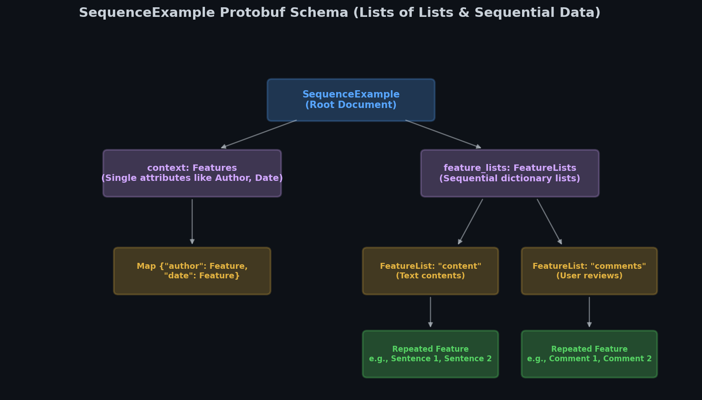

# 🧠 Module 3: SequenceExample and Nested Data Structures
> **Ch. 13 — Hands-On ML with Scikit-Learn, Keras & TensorFlow (Aurélien Géron)**

---

## 📌 Table of Contents
1. [Start Here: The Big Picture](#big-picture)
2. [The SequenceExample Protobuf Schema](#sequence-example-schema)
3. [Programmatic Creation & Serialization](#creation)
4. [Parsing SequenceExamples & RaggedTensors](#parsing-ragged)
5. [Common Beginner Mistakes](#mistakes)
6. [Interview Q&A](#interview)
7. [⚡ One-Page Flash Card](#revision)

---

## 🌍 Start Here: The Big Picture {#big-picture}

> **TL;DR:** While the `Example` protobuf handles flat tabular data well, it struggles with nested data structures like videos (sequences of image frames) or text documents (sequences of sentences, which are sequences of words). The **`SequenceExample`** protobuf is designed specifically for these "lists of lists," separating flat metadata (context) from dynamic sequences.

**The Real-World Analogy 🍕:**
Imagine a box set of a TV show. The box set has global metadata: the show name, the year it was released, and the cast list. This is the **context**. Inside the box, there are multiple DVDs, where each DVD contains a list of episodes, and each episode contains a sequence of video frames. Storing this using a flat `Example` would require repeating the show name and cast list on every single frame. `SequenceExample` structures this cleanly: it stores the show metadata *once* in the context, and stores the episodes sequentially.

---

## 🔍 1. The SequenceExample Protobuf Schema {#sequence-example-schema}

The `SequenceExample` splits data into two distinct fields:
1. **`context`**: A standard `Features` object (flat map of keys to `Feature`).
2. **`feature_lists`**: A `FeatureLists` object containing one or more named sequence lists.

### Schema Definition
```protobuf
message FeatureList { repeated Feature feature = 1; }
message FeatureLists { map<string, FeatureList> feature_list = 1; }
message SequenceExample {
    Features context = 1;
    FeatureLists feature_lists = 2;
}
```


> 📊 **Graph 06:** SequenceExample Protobuf Schema hierarchy. Shows how flat metadata is isolated in `context` while sequential lists are grouped in `feature_lists` containing multiple `FeatureList` entries.

---

## 🔍 2. Programmatic Creation & Serialization {#creation}

Creating a `SequenceExample` requires initializing a standard `Features` dictionary for context, and a `FeatureLists` dictionary for sequences.

```python
import tensorflow as tf
from tensorflow.train import BytesList, Int64List
from tensorflow.train import Feature, Features, FeatureList, FeatureLists, SequenceExample

# 1. Define flat context attributes
context = Features(feature={
    "author": Feature(bytes_list=BytesList(value=[b"Alice"])),
    "date": Feature(bytes_list=BytesList(value=[b"2026-06-20"]))
})

# 2. Define sequential list of lists
# Sentence 1: ["Hello", "world"] -> Sentence 2: ["TensorFlow", "is", "great"]
content_features = [
    Feature(bytes_list=BytesList(value=[b"Hello", b"world"])),
    Feature(bytes_list=BytesList(value=[b"TensorFlow", b"is", b"great"]))
]

feature_lists = FeatureLists(feature_list={
    "content": FeatureList(feature=content_features)
})

# 3. Assemble SequenceExample
seq_example = SequenceExample(context=context, feature_lists=feature_lists)
serialized_seq = seq_example.SerializeToString()
# OUTPUT: Serialized byte representation of sequence structure.
```

---

## 🔍 3. Parsing SequenceExamples & RaggedTensors {#parsing-ragged}

To parse serialized sequences, use `tf.io.parse_single_sequence_example()`. It requires two separate description dictionaries:
* **`context_features`**: Parsing rules for the flat context metadata.
* **`sequence_features`**: Parsing rules for the sequential lists.

### Ragged Tensors for Variable Sequences
Because sentences or video lengths vary, parsing returns a `tf.SparseTensor` inside `parsed_feature_lists`. Stacking these directly into dense tensors would waste memory on padding. Instead, we convert them to a **`tf.RaggedTensor`**, which supports non-uniform dimensions.

```python
# 1. Define descriptors
context_description = {
    "author": tf.io.FixedLenFeature([], tf.string, default_value=""),
    "date": tf.io.FixedLenFeature([], tf.string, default_value="")
}

sequence_description = {
    "content": tf.io.VarLenFeature(tf.string)
}

# 2. Parse serialized bytes
parsed_context, parsed_features = tf.io.parse_single_sequence_example(
    serialized_seq,
    context_features=context_description,
    sequence_features=sequence_description
)

# 3. Convert sparse representation to RaggedTensor
ragged_content = tf.RaggedTensor.from_sparse(parsed_features["content"])

print("Author:", parsed_context["author"].numpy())
print("Ragged Array:\n", ragged_content)
# OUTPUT:
# Author: b'Alice'
# Ragged Array:
# <tf.RaggedTensor [[b'Hello', b'world'], [b'TensorFlow', b'is', b'great']]>
```

---

## ❌ Common Beginner Mistakes {#mistakes}

**1. Using parse_single_example instead of parse_single_sequence_example** ❌
> **Mistake**: Attempting to decode sequence data using the flat `parse_single_example()` operation. This throws a parsing execution error as it cannot decode the `feature_lists` schema.
> **Fix**: Use `tf.io.parse_single_sequence_example()` and specify separate dictionaries for context and sequence features.

**2. Standard Padding of Ragged Sequences too early** ❌
> **Mistake**: Running `.to_dense()` on sequence lists before mapping them to model inputs. This forces massive zero padding across long dimensions, leading to excessive memory overhead.
> **Fix**: Use `tf.RaggedTensor.from_sparse()` to carry varying sequence shapes through the preprocessing pipeline, and let the model handle padding dynamically during batch generation.

---

## 🎤 Interview Q&A {#interview}

**Q1: What is a tf.RaggedTensor, and why is it preferred over standard dense padded tensors when working with natural language sequences?**
> **A:** A `tf.RaggedTensor` represents a tensor with non-uniform dimensions (e.g., a batch of sentences where each sentence has a different word count). 
> * **Standard Dense Padding** pads all sentences to match the longest one in the entire dataset, wasting computations on padded zeroes.
> * **RaggedTensors** keep the sequences at their natural lengths in memory, saving space. They support native operations (like slicing, string transformations, and embedding lookups) without exposing pad tokens to the calculations.

---

## ⚡ One-Page Flash Card {#revision}

```
╔══════════════════════════════════════════════════════════════════╗
║          MODULE 3: SEQUENCEEXAMPLE — FLASH CARD                  ║
╠══════════════════════════════════════════════════════════════════╣
║                                                                  ║
║  SCHEMA BLUEPRINT:                                               ║
║  - context: Flat dictionary (Features) mapping to scalar details.║
║  - feature_lists: Sequence dictionary (FeatureLists ->           ║
║    FeatureList -> list of Feature items).                        ║
║                                                                  ║
║  PARSING ENGINE:                                                 ║
║  - tf.io.parse_single_sequence_example(serialized,               ║
║      context_features, sequence_features)                        ║
║                                                                  ║
║  RECONSTRUCTION:                                                 ║
║  - sequence_features return SparseTensors.                       ║
║  - Convert immediately: tf.RaggedTensor.from_sparse() to         ║
║    maintain shape boundary without memory waste.                 ║
║                                                                  ║
╚══════════════════════════════════════════════════════════════════╝
```

---

---

**🔗 Previous Module →** [02_The_TFRecord_Format_and_Protobufs.md](02_The_TFRecord_Format_and_Protobufs.md)  
**🔗 Next Module →** [04_Preprocessing_Categorical_Features_and_Embeddings.md](04_Preprocessing_Categorical_Features_and_Embeddings.md)
