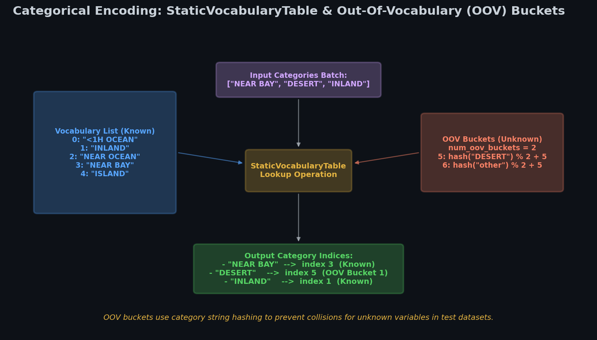
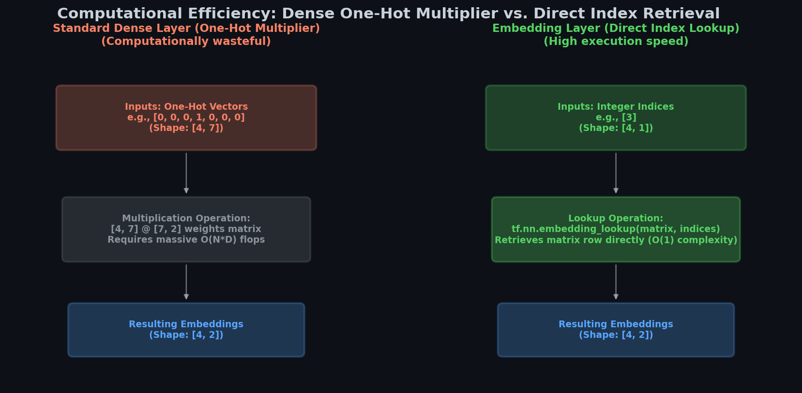

# 🧠 Module 4: Preprocessing Categorical Features and Embeddings
> **Ch. 13 — Hands-On ML with Scikit-Learn, Keras & TensorFlow (Aurélien Géron)**

---

## 📌 Table of Contents
1. [Start Here: The Big Picture](#big-picture)
2. [Custom Preprocessing Layers with State Adaptation](#state-adaptation)
3. [Categorical Encoding & Static Vocabulary Tables](#lookup-tables)
4. [One-Hot Encoding vs. Embedding Layers](#one-hot-vs-embeddings)
5. [Integrating Embeddings into Keras Models](#model-integration)
6. [Common Beginner Mistakes](#mistakes)
7. [Interview Q&A](#interview)
8. [⚡ One-Page Flash Card](#revision)

---

## 🌍 Start Here: The Big Picture {#big-picture}

> **TL;DR:** Neural networks only understand floating-point tensors. Categorical data (like ZIP codes or string labels) must be converted into numbers. We can do this using **one-hot encoding** (for small sets) or **embeddings** (for high-cardinality categories). Embedding layers map discrete index IDs to low-dimensional, continuous trainable vectors that capture semantic relationships during backpropagation.

**The Real-World Analogy 🍕:**
Imagine mapping world cities on a single 1D line: Paris, Tokyo, London, Rome. If you place them in a sequence (e.g., Paris = 1, Tokyo = 2, London = 3, Rome = 4), your model will assume Tokyo is mathematically closer to Paris than Rome is, which makes no geographic sense. Instead, if you map them onto a 2D coordinate grid (latitude and longitude), cities close in geographic distance (like Paris and London) will cluster together. An embedding matrix acts as this coordinate grid, dynamically learning coordinates for each category in a multi-dimensional space.

---

## 🔍 1. Custom Preprocessing Layers with State Adaptation {#state-adaptation}

Rather than keeping mean and variance metrics as global variables, we can encapsulate preprocessing variables in a custom layer subclassing `keras.layers.Layer`.

### Adaptable Layer Logic
The layer uses an `adapt()` method to calculate statistics (like mean $\mu$ and standard deviation $\sigma$) from a representative data sample, keeping the final parameters frozen during training.

```python
import numpy as np
import tensorflow as tf
from tensorflow import keras

class Standardization(keras.layers.Layer):
    def adapt(self, data_sample):
        # Calculate stats over the batch axis
        self.means_ = np.mean(data_sample, axis=0, keepdims=True)
        self.stds_ = np.std(data_sample, axis=0, keepdims=True)
        
    def call(self, inputs):
        # Standardize using Z-Score formula: (x - μ) / (σ + ε)
        # ε (epsilon) prevents division by zero
        eps = keras.backend.epsilon()
        return (inputs - self.means_) / (self.stds_ + eps)

# Usage
std_layer = Standardization()
std_layer.adapt(np.random.rand(100, 8)) # Adapt to a sample of 100 rows
```

---

## 🔍 2. Categorical Encoding & Static Vocabulary Tables {#lookup-tables}

To parse string categories (e.g., California ocean proximity), we map them to integer indices using a vocabulary lookup table.

### Out-of-Vocabulary (OOV) Hashing
If an unseen category appears (e.g. `"DESERT"` during validation, which wasn't in training), looking it up directly would fail. To handle this, we add **OOV buckets**. Unseen strings are hashed to one of these buckets, giving them a unique index.


> 📊 **Graph 08:** StaticVocabularyTable & OOV Buckets. Maps known categories to indices 0–4, while unknown strings are hashed to indices 5 or 6.

```python
# 1. Define vocabulary and indices
vocab = ["<1H OCEAN", "INLAND", "NEAR OCEAN", "NEAR BAY", "ISLAND"]
indices = tf.range(len(vocab), dtype=tf.int64)

# 2. Initialize lookup table
table_init = tf.lookup.KeyValueTensorInitializer(vocab, indices)
num_oov_buckets = 2
table = tf.lookup.StaticVocabularyTable(table_init, num_oov_buckets)

# 3. Test lookup
categories = tf.constant(["NEAR BAY", "DESERT", "INLAND"])
cat_indices = table.lookup(categories)
print("Indices:", cat_indices.numpy())
# OUTPUT: Indices: [3 5 1]  (DESERT is mapped to OOV bucket 5)
```

---

## 🔍 3. One-Hot Encoding vs. Embedding Layers {#one-hot-vs-embeddings}

### Math Representation
Once categories are mapped to index numbers, we can represent them as:
1. **One-Hot Vectors**: A sparse binary vector of size $|V| + OOV$.
   $$\mathbf{x}_{\text{one-hot}} = [0, 0, 0, 1, 0, 0, 0]$$
2. **Embeddings**: A dense vector retrieved from a lookup table.
   $$\mathbf{x}_{\text{embed}} = \text{Row}_i(\mathbf{W}_{\text{embed}})$$

### Computational Efficiency
Multiplying a one-hot vector $[1, D]$ with a dense weight matrix $[D, M]$ is mathematically equivalent to looking up Row $i$ directly in the weight matrix. However, the matrix multiplication requires $O(D \times M)$ floating-point operations (FLOPs), while lookup is an $O(1)$ memory slice.


> 📊 **Graph 09:** One-hot multiplication vs. Direct embedding lookup. Index retrieval completely bypasses large-scale matrix operations.

```python
# Manual lookup implementation
embedding_dim = 2
embed_init = tf.random.uniform([len(vocab) + num_oov_buckets, embedding_dim])
embedding_matrix = tf.Variable(embed_init) # Trainable variable

# Look up rows directly
print(tf.nn.embedding_lookup(embedding_matrix, cat_indices).numpy())
# OUTPUT:
# [[0.74011743 0.8724445 ]
#  [0.3103881  0.7223358 ]
#  [0.3528825  0.46448255]]
```

---

## 🔍 4. Integrating Embeddings into Keras Models {#model-integration}

We can combine numerical features and categorical features into a single model. We pass the category strings through a lookup layer and an embedding layer, and then concatenate the output with the numerical inputs.

```python
# 1. Define multiple inputs
regular_inputs = keras.layers.Input(shape=[8], name="num_features")
categories_input = keras.layers.Input(shape=[], dtype=tf.string, name="cat_features")

# 2. Category index lookup and embedding
cat_indices = keras.layers.Lambda(lambda cats: table.lookup(cats))(categories_input)
cat_embed = keras.layers.Embedding(input_dim=len(vocab) + num_oov_buckets, 
                                   output_dim=2)(cat_indices)

# 3. Concatenate and project
encoded_inputs = keras.layers.concatenate([regular_inputs, cat_embed])
outputs = keras.layers.Dense(1)(encoded_inputs)

# 4. Build Model
model = keras.models.Model(inputs=[regular_inputs, categories_input], outputs=[outputs])
# OUTPUT: Keras model architecture with multiple inputs and parallel embedding pipelines.
```

---

## ❌ Common Beginner Mistakes {#mistakes}

**1. Embedding dimensions larger than the downstream hidden units** ❌
> **Mistake**: Using a 256-dimensional embedding layer, immediately followed by a hidden Dense layer with only 32 units. Since the Dense layer only project to 32 dimensions, the remaining dimensions in the embedding are wasted capacity.
> **Fix**: Keep the embedding dimension smaller than or equal to the size of the following layer ($D_{\text{embed}} \le U_{\text{dense}}$).

**2. Placing Embedding inside frozen preprocessing stages** ❌
> **Mistake**: Wrapping `keras.layers.Embedding` inside a frozen preprocessing layer. Preprocessing layers are frozen during training, meaning the embedding weights won't update via gradient descent.
> **Fix**: Keep the embedding layer outside the preprocessing stage, placing it at the start of the trainable model architecture.

---

## 🎤 Interview Q&A {#interview}

**Q1: Explain the term-frequency x inverse-document-frequency (TF-IDF) technique and why it is useful for text preprocessing.**
> **A:** TF-IDF scales word frequency to reflect how informative a word is in a document.
> $$\text{TF-IDF}(w, d) = \text{TF}(w, d) \times \log\left(\frac{N}{\text{DF}(w)}\right)$$
> * **$\text{TF}(w, d)$** is the count of word $w$ in document $d$.
> * **$\text{DF}(w)$** is the count of documents containing word $w$, and $N$ is the total documents.
> Common filler words (like "and" or "the") appear in almost all documents (high $\text{DF}$), driving the log term close to 0. Rare terms (like "basketball" or "autodiff") have a low $\text{DF}$, giving them a high weight. This helps the model focus on highly informative words.

---

## ⚡ One-Page Flash Card {#revision}

```
╔══════════════════════════════════════════════════════════════════╗
║        MODULE 4: PREPROCESSING & EMBEDDINGS — FLASH CARD         ║
╠══════════════════════════════════════════════════════════════════╣
║                                                                  ║
║  ADAPTATION:                                                     ║
║  - adapt(sample): Calculates and freezes mean/stds values.       ║
║  - Prevents training/serving skew by packaging logic in layers.  ║
║                                                                  ║
║  INDEX LOOKUPS:                                                  ║
║  - KeyValueTensorInitializer: Maps strings to integer arrays.    ║
║  - StaticVocabularyTable: Manages lookups and hashes unknown     ║
║    inputs into out-of-vocabulary (OOV) buckets.                  ║
║                                                                  ║
║  EMBEDDINGS:                                                     ║
║  - Bypasses expensive one-hot matrix multiplications.            ║
║  - output_dim: Rule of thumb is 10 to 300 dimensions.            ║
║                                                                  ║
╚══════════════════════════════════════════════════════════════════╝
```

---

---

**🔗 Previous Module →** [03_SequenceExample_and_Nested_Data_Structures.md](03_SequenceExample_and_Nested_Data_Structures.md)  
**🔗 Next Module →** [05_Advanced_Preprocessing_TFT_and_TFDS.md](05_Advanced_Preprocessing_TFT_and_TFDS.md)
