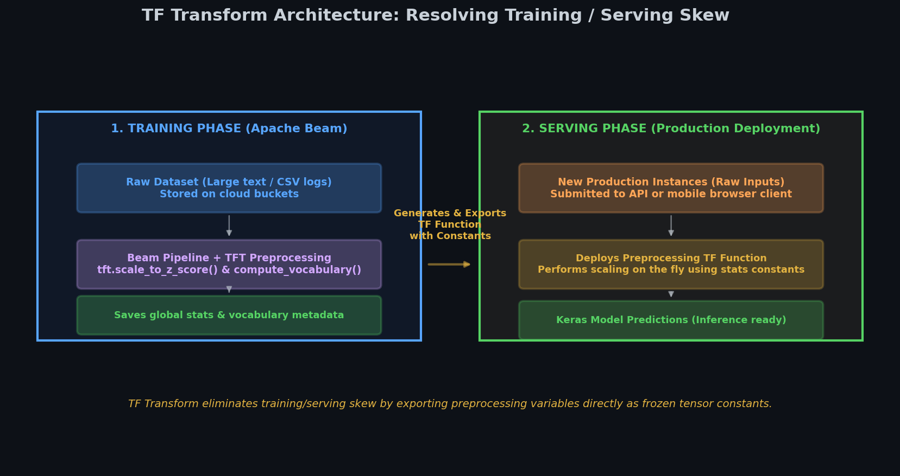
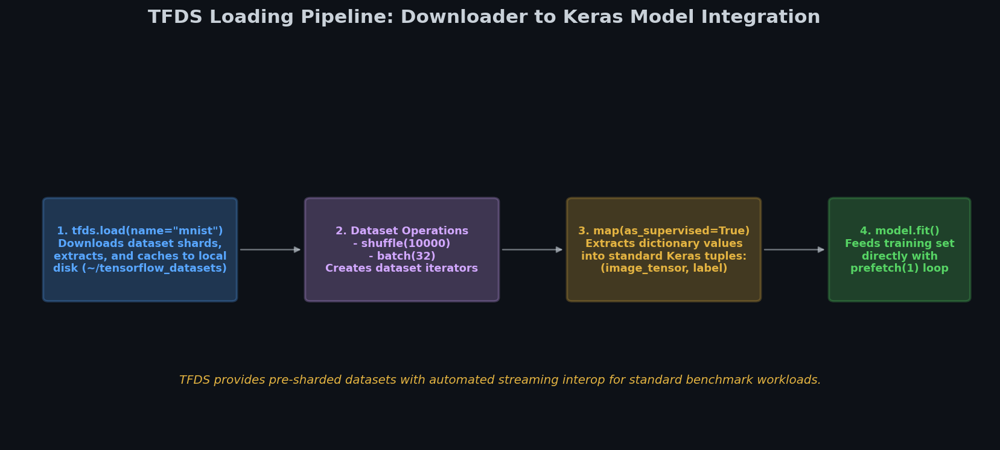
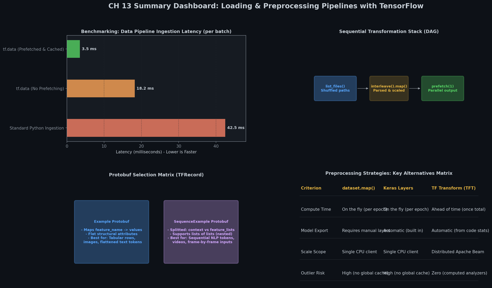

# 🧠 Module 5: Advanced Preprocessing, TF Transform, and TFDS
> **Ch. 13 — Hands-On ML with Scikit-Learn, Keras & TensorFlow (Aurélien Géron)**

---

## 📌 Table of Contents
1. [Start Here: The Big Picture](#big-picture)
2. [Advanced Keras Preprocessing Layers](#keras-preprocessing)
3. [TF Transform (TFX Component)](#tf-transform)
4. [The TensorFlow Datasets (TFDS) Catalog](#tfds)
5. [Common Beginner Mistakes](#mistakes)
6. [Interview Q&A](#interview)
7. [⚡ One-Page Flash Card](#revision)

---

## 🌍 Start Here: The Big Picture {#big-picture}

> **TL;DR:** Preprocessing data on the fly during training can slow down execution. However, preprocessing data ahead of time in a separate step can lead to **training/serving skew**—where the preprocessing logic in production shifts away from what the model was trained on. **TF Transform** solves this by letting you define preprocessing once, running it at scale during training, and exporting it as a frozen TF Function directly inside your deployed model.

**The Real-World Analogy 🍕:**
Imagine translating a book into multiple languages. If you translate each page on the fly as the reader turns it, reading is slow. If you translate the book beforehand, but your team of translators uses a slightly different dictionary than the one the author used, you introduce errors. TF Transform is like writing a single master translation dictionary: you use it to translate the book in bulk before publication, and you attach that exact dictionary to the back of every book so readers can look up terms.

---

## 🔍 1. Advanced Keras Preprocessing Layers {#keras-preprocessing}

Keras provides standard preprocessing layers to build robust preprocessing pipelines.

### Key Preprocessing Layers
* **`Discretization`**: Groups continuous data into bins (e.g. low, medium, high prices) and encodes them as one-hot vectors. This layer is non-differentiable and must be frozen during training.
* **`TextVectorization`**: Splits text into words, builds a vocabulary lookup, and outputs token indices or TF-IDF representations.
* **`PreprocessingStage`**: Chains multiple preprocessing layers together (similar to a Scikit-Learn `Pipeline`).

```python
import tensorflow as tf
from tensorflow import keras

# Discretization mapping continuous ages to bins
discretization = keras.layers.Discretization(bin_boundaries=[18.0, 35.0, 60.0])
# Maps ages to: <18, 18-35, 35-60, >60 (4 categories, one-hot encoded)
```

---

## 🔍 2. TF Transform (TFX Component) {#tf-transform}

For large-scale, computationally expensive preprocessing, doing it on the fly during training is a major bottleneck. Preprocessing ahead of time with tools like Apache Beam speeds up training, but often leads to training/serving skew.

### TFT Architecture
TF Transform (part of TensorFlow Extended) bridges this gap:
1. **Analyzers**: Run on Apache Beam to compute dataset-wide statistics (mean, variance, vocabularies) once across the entire training set.
2. **Transform Function**: Preprocesses the training data using these statistics.
3. **Exported Graph**: TFT compiles these operations (and the calculated statistics) into a standard TensorFlow function. This function is exported and prepended to your Keras model, ensuring production serving uses the exact same preprocessing math as training.


> 📊 **Graph 10:** TF Transform Pipeline. Shows how Apache Beam computes stats during training, and exports them as a preprocessing graph embedded directly in the production model.

```python
import tensorflow_transform as tft

def preprocess(inputs):
    # Inputs is a dictionary of raw input tensors
    raw_age = inputs["housing_median_age"]
    raw_ocean = inputs["ocean_proximity"]
    
    # TFT calculates statistics once across the training set (e.g., z-score mean/std)
    standardized_age = tft.scale_to_z_score(raw_age)
    ocean_id = tft.compute_and_apply_vocabulary(raw_ocean)
    
    return {
        "standardized_median_age": standardized_age,
        "ocean_proximity_id": ocean_id
    }
```

---

## 🔍 3. The TensorFlow Datasets (TFDS) Catalog {#tfds}

The **TensorFlow Datasets (TFDS)** project provides an easy way to download and load popular open-source datasets (e.g., MNIST, ImageNet, IMDB reviews) as ready-to-use `tf.data.Dataset` pipelines.


> 📊 **Graph 11:** TFDS load workflow. Downloads shards, caches them locally, and maps the output dictionary into standard feature/label tuples.

```python
import tensorflow_datasets as tfds

# 1. Download and load dataset in supervised format
# as_supervised=True returns a tuple (image, label) instead of a dictionary
dataset = tfds.load(name="mnist", batch_size=32, as_supervised=True)
mnist_train = dataset["train"]

# 2. Add prefetching directly to target devices
mnist_train = mnist_train.prefetch(tf.data.experimental.AUTOTUNE)

# 3. Fit Keras model directly
model = keras.models.Sequential([
    keras.layers.Flatten(input_shape=[28, 28, 1]),
    keras.layers.Dense(10, activation="softmax")
])
model.compile(loss="sparse_categorical_crossentropy", optimizer="sgd")
model.fit(mnist_train, epochs=5)
# OUTPUT: Training output showing step speed and accuracy.
```

---

## ❌ Common Beginner Mistakes {#mistakes}

**1. Training embeddings inside frozen preprocessing stages** ❌
> **Mistake**: Placing trainable embedding layers directly inside a Keras preprocessing stage. Since preprocessing stages are frozen during training, the embedding weights will never update.
> **Fix**: Place the embedding layer directly at the start of your neural network model, after the categorical input strings have been converted to indices.

**2. Forgetting to install the tensorflow-datasets package** ❌
> **Mistake**: Attempting to import `tensorflow_datasets` without installing it, thinking it comes bundled with TensorFlow.
> **Fix**: Run `pip install tensorflow-datasets` to install the package first.

---

## 🎤 Interview Q&A {#interview}

**Q1: What is training/serving skew, why does it happen, and how does TF Transform prevent it?**
> **A:** Training/serving skew is a performance drop that happens when the preprocessing logic used during training differs from the logic used in production serving. This commonly happens when:
> * Preprocessing is written in Python/Pandas for training, but rewritten in Java, JavaScript, or C++ for production.
> * Global statistics (like mean or vocabulary lists) are updated on the training set but get out-of-sync in production.
> TF Transform prevents this by letting you write the preprocessing code once in Python. It runs this code on Apache Beam to compute training statistics, and then exports both the logic and the calculated statistics as a standard TensorFlow computational graph. This graph is embedded directly in the deployed model, ensuring training and serving use identical code.

---

## ⚡ One-Page Flash Card {#revision}

```
╔══════════════════════════════════════════════════════════════════╗
║             MODULE 5: TFT AND TFDS — FLASH CARD                  ║
╠══════════════════════════════════════════════════════════════════╣
║                                                                  ║
║  TFT PIPELINE:                                                   ║
║  - Analyzers: Compute stats (mean, std, vocab) over the full     ║
║    dataset using Apache Beam.                                    ║
║  - Export: Saves preprocessing logic and stats as a TF Function. ║
║                                                                  ║
║  TFDS USAGE:                                                     ║
║  - tfds.load(name, as_supervised=True): Downloads and loads      ║
║    datasets directly as (feature, label) tuples.                 ║
║                                                                  ║
║  CRITICAL RULES:                                                 ║
║  - Do not put trainable layers (like Embeddings) inside frozen   ║
║    preprocessing stages.                                         ║
║  - Precompute statistics on the training set only, never on the  ║
║    validation or test sets, to avoid data leakage.               ║
║                                                                  ║
╚══════════════════════════════════════════════════════════════════╝
```

---

## 📈 Chapter 13 Summary Dashboard


> 📊 **Graph 12:** Comprehensive visual summary of all Chapter 13 concepts: The TF Data API, TFRecord parsing, Preprocessing layers, Embeddings, and the TFX ecosystem.

---

---

**🔗 Previous Module →** [04_Preprocessing_Categorical_Features_and_Embeddings.md](04_Preprocessing_Categorical_Features_and_Embeddings.md)  
**🔗 Chapter Complete! →** [Back to Chapter Index](../notes.md)
