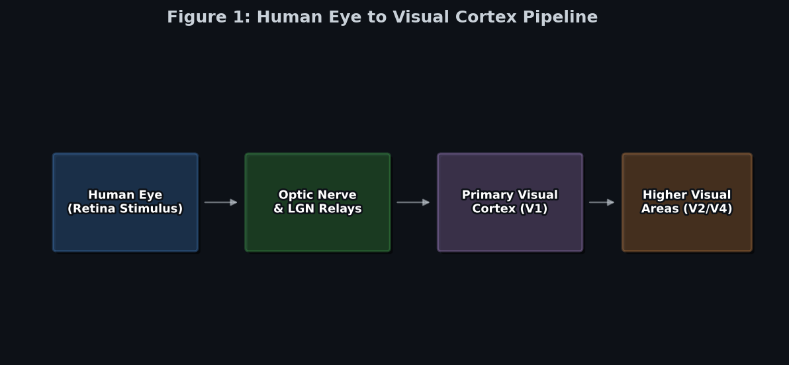
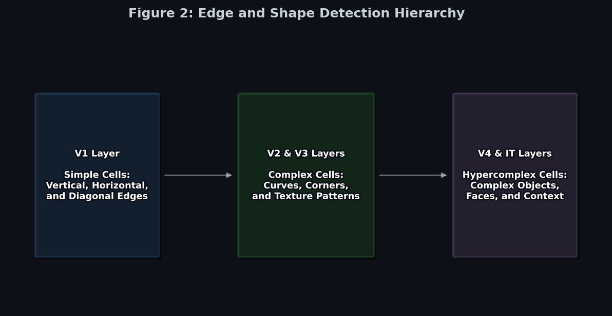
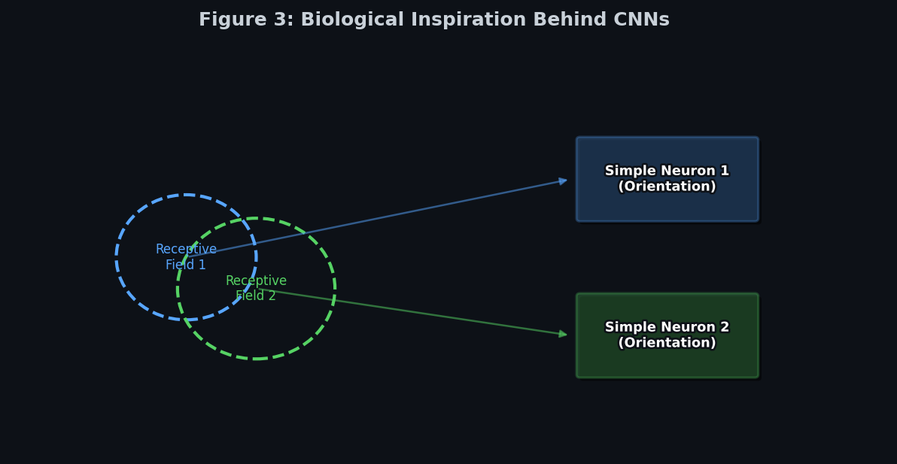
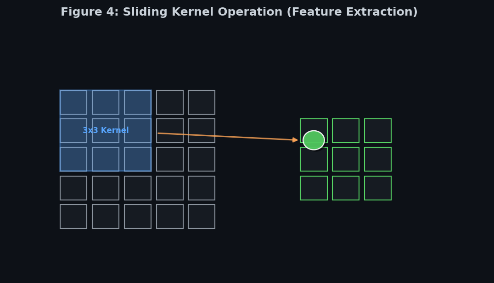
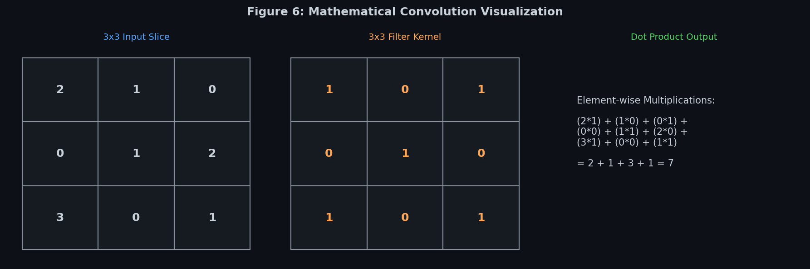
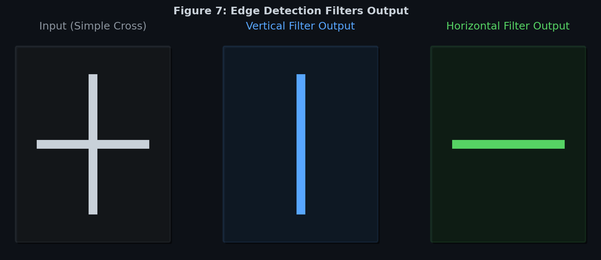
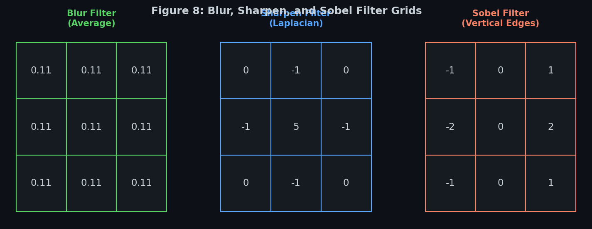
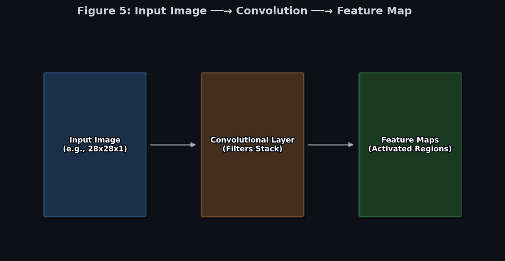
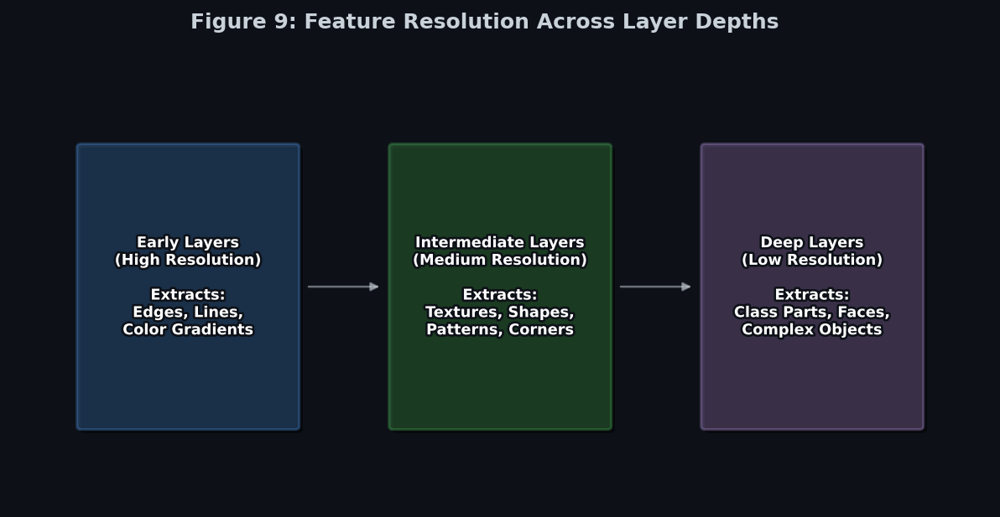

# 🧠 Module 1: The Architecture of the Visual Cortex and Convolutional Layers
> **Ch. 14 — Hands-On ML with Scikit-Learn, Keras & TensorFlow (Aurélien Géron)**

---

## 📌 Table of Contents
1. [Start Here: The Big Picture](#big-picture)
2. [The Biological Inspiration: Visual Cortex](#bio)
3. [Why Not Just Use Dense Layers?](#why-not-dense)
4. [The Convolutional Layer (The Sliding Kernel)](#conv-layer)
5. [Padding (SAME vs VALID) and Strides](#padding-strides)
6. [Filters and Feature Maps](#filters)
7. [TensorFlow Implementation & Memory Footprint](#tf-implementation)
8. [Key Terms Dictionary](#terms)
9. [Common Beginner Mistakes](#mistakes)
10. [Interview Q&A (Top 5)](#interview)
11. [⚡ One-Page Flash Card](#revision)

---

## 🌍 Start Here: The Big Picture {#big-picture}

> **TL;DR:** Before Convolutional Neural Networks (CNNs), computers struggled massively to understand images because they tried to look at every pixel at once. CNNs solve this by using small "magnifying glasses" (filters) that slide across the image, looking for simple patterns like edges, which are then combined in deeper layers to form complex objects like faces and cars.

**The "Where's Waldo" Analogy 🔍**

Imagine trying to find Waldo in a massive crowded poster. 
A **Dense Neural Network** tries to stare at the entire poster all at once without moving its eyes. It gets overwhelmed instantly. 
A **Convolutional Neural Network (CNN)** acts like a human: it takes a small magnifying glass and scans it systematically from top-left to bottom-right. Once it finds a red-and-white striped shirt, it registers a "hit". Because it uses the exact same magnifying glass (weights) everywhere, it can find Waldo no matter where he is hiding on the page (Translation Invariance).

---

## 🔬 The Biological Inspiration: Visual Cortex {#bio}

> **TL;DR:** CNNs were directly inspired by how mammalian brains process vision. The brain uses a strict hierarchy: early neurons detect simple edges, and deeper neurons combine those edges into complex shapes.

In 1958 and 1959, David H. Hubel and Torsten N. Wiesel performed revolutionary experiments on cats (and later monkeys), discovering exactly how the visual cortex works. 


> 📊 **Figure 1:** Light enters the retina and travels to the primary visual cortex (V1), which then relays information to higher visual areas (V2, V4).

They discovered that neurons in the visual cortex do **not** look at the entire visual field. Instead, each neuron only looks at a small region called a **local receptive field**.


> 📊 **Figure 2:** The hierarchical nature of the visual cortex. 

The cortex is organized hierarchically:
*   **Simple Cells (Early Layers)**: Only react to primitive patterns, such as a straight horizontal or vertical line in their receptive field.
*   **Complex Cells (Deeper Layers)**: Have larger receptive fields. They combine the outputs of simple cells to detect more complex structures like corners, curves, or movement.


> 📊 **Figure 3:** How biological receptive fields map to the mathematical concept of Convolutional Neural Networks.

This biological architecture directly inspired the *neocognitron* in 1980, which eventually evolved into the **LeNet-5** CNN architecture introduced by Yann LeCun in 1998 for recognizing handwritten check numbers.

---

## 🤔 Why Not Just Use Dense Layers? {#why-not-dense}

Why couldn't we just flatten an image into a 1D array and use a standard Multi-Layer Perceptron (MLP)?

**The Parameter Explosion Problem:**
If you have a small $100 \times 100$ color image, it has $100 \times 100 \times 3 \text{ (RGB channels)} = 30,000$ input pixels. 
If your first hidden Dense layer has just $1,000$ neurons, you would need:
$$30,000 \times 1,000 = \mathbf{30,000,000 \text{ connections}}$$
...for the **first layer alone**! 

> 🧮 **Math Example (Dense vs Conv):**
> *   **Dense Layer**: Connecting a $100 \times 100 \times 3$ image to 1,000 neurons requires **30,000,000** weights.
> *   **Conv Layer**: Applying 1,000 $3 \times 3$ filters to the same image requires: $3 \times 3 \times 3 \text{ (channels)} \times 1,000 = \mathbf{27,000}$ weights.
> *   *Result*: The CNN uses **99.9% fewer parameters** while preserving the 2D spatial relationships!

This massive number of parameters causes:
1.  **Out of Memory Errors**: The RAM required is astronomical.
2.  **Overfitting**: The model will simply memorize the training data.

CNNs solve this using **Local Connectivity** (neurons only connect to a small patch of pixels) and **Weight Sharing** (the same filter is used across the whole image).

---

## 🔍 The Convolutional Layer (The Sliding Kernel) {#conv-layer}

The most important building block of a CNN is the **convolutional layer**. Neurons in this layer are not connected to every pixel in the input image. They are only connected to pixels in their localized receptive fields.


> 📊 **Figure 4:** A $3 \times 3$ kernel sliding over an image. The dot product of the kernel weights and the image pixels creates one single value in the output feature map.


> 📊 **Figure 6:** The exact math inside the sliding kernel. We do element-wise multiplication between the input slice and the kernel, then sum them all up (plus a bias) to get the final output.

Because images are natively 2D (or 3D with color channels), CNN layers are kept in 2D/3D shapes, making it much easier to preserve spatial relationships.

---

## 📏 Padding (SAME vs VALID) and Strides {#padding-strides}

When you slide a kernel across an image, what happens when it hits the edge? We have two padding strategies:

1.  **VALID Padding (No Padding)**: The kernel is only applied where it fits perfectly inside the image. 
    *   *Result*: The output map shrinks. A $5 \times 5$ image with a $3 \times 3$ kernel becomes a $3 \times 3$ output.
2.  **SAME Padding (Zero Padding)**: Fake pixels with a value of $0$ are added evenly all around the image border.
    *   *Result*: The output map has the exact same height and width as the original input image.

### Strides
To dramatically reduce the size of the image (dimensionality reduction) and lower the computational load, we can space out the receptive fields by skipping over pixels. 
The shift from one receptive field to the next is called the **stride**.
*   A **stride of 1** moves the kernel 1 pixel at a time.
*   A **stride of 2** moves the kernel 2 pixels at a time, effectively halving the height and width of the output image.

> 🧮 **Math Example (Spatial Dimensions):**
> How big is the output image? The formula is $O = \lfloor \frac{W - K + 2P}{S} \rfloor + 1$
> *   $W$ = Input size (e.g., $224$)
> *   $K$ = Kernel size (e.g., $3$)
> *   $P$ = Padding (e.g., $0$ for VALID)
> *   $S$ = Stride (e.g., $2$)
> *   Calculation: $\lfloor \frac{224 - 3 + 0}{2} \rfloor + 1 = \lfloor \frac{221}{2} \rfloor + 1 = 110 + 1 = \mathbf{111 \times 111}$ output size.

---

## 🎨 Filters and Feature Maps {#filters}

A neuron’s weights in a CNN form a small matrix called a **filter** (or convolution kernel). 
During training, the network actually learns the best values for these filters.


> 📊 **Figure 7:** Different filters applied to a cross. A vertical filter highlights the vertical line and ignores the horizontal one. 


> 📊 **Figure 8:** Classic image processing filters like Blur (averaging) and Sobel (edge detection). In a CNN, the network learns to create these filters automatically!

If an entire layer uses the exact same filter across the whole image, the 2D output is called a **feature map**. It highlights the locations where the filter's specific pattern (like a vertical line) was detected.


> 📊 **Figure 5:** The flow from an input image to a stack of feature maps.

### Weight Sharing & Translation Invariance
Because all the neurons in a single feature map share the exact same filter, the parameter count drops massively. Furthermore, it provides **Translation Invariance**: if a network learns to recognize a cat in the top-left corner, it can recognize that exact same cat in the bottom-right corner using the same shared weights!


> 📊 **Figure 9:** As you go deeper into the network, feature maps become physically smaller (due to strides/pooling) but much deeper (more filters). Early layers detect edges, deep layers detect faces.

---

## 💻 TensorFlow Implementation & Memory Footprint {#tf-implementation}

In TensorFlow, images are 4D tensors: `[batch_size, height, width, channels]`.
Weights (filters) are: `[kernel_height, kernel_width, input_channels, output_channels]`.

```python
from tensorflow import keras

# A standard convolutional layer
conv = keras.layers.Conv2D(filters=32, kernel_size=3, strides=1,
                           padding="same", activation="relu")
```

### 🧠 The RAM Bottleneck (OOM Errors)
While CNNs have very few parameters (weights) compared to Dense networks, they require an **enormous amount of RAM** during training.

**Why?** During the forward pass, backpropagation requires the network to store the output of *every single layer* in memory to compute the gradients later. 
If a layer outputs 200 feature maps of size $150 \times 100$, and your batch size is 100, that is **1.2 GB of RAM** just for *one layer's* output in the forward pass!

**How to fix Out-Of-Memory (OOM) Errors:**
1.  Reduce the **mini-batch size**.
2.  Increase the **stride** to shrink spatial dimensions faster.
3.  Remove a few layers from the architecture.
4.  Use **16-bit floats** instead of 32-bit floats.
5.  Distribute the model across multiple GPUs.

---

## 📖 Key Terms Dictionary {#terms}

| Term | Simple Explanation |
|------|--------------------|
| **Receptive Field** | The small, localized area of the input image that a single neuron looks at. |
| **Filter / Kernel** | A small matrix of weights (e.g., 3x3). Slides across the image to detect a specific pattern (like an edge). |
| **Feature Map** | The 2D output resulting from sliding a single filter across the entire image. |
| **SAME Padding** | Adding zero-borders to the image so the output size perfectly matches the input size. |
| **VALID Padding** | No padding. The kernel only goes where it fits, causing the output size to shrink. |
| **Stride** | How many pixels the filter shifts horizontally/vertically at each step. Stride 2 halves the image size. |
| **Translation Invariance** | The ability of a CNN to detect a pattern regardless of where it is physically located in the image (due to weight sharing). |

---

## ❌ Common Beginner Mistakes {#mistakes}

> These mistakes are very common in interviews and practice — know them all!

**1. "CNNs reduce parameters so they use less RAM"** ❌
> Reality: CNNs have drastically fewer parameters than MLPs, but they use **significantly more RAM** during training because they generate massive 3D feature maps at every layer, and all these activations must be kept in memory for backpropagation.

**2. Confusing SAME and VALID padding** ❌
> Reality: It's easy to forget which is which. Remember: **VALID** means the kernel must be completely *valid* inside the image (no fake pixels), so it shrinks. **SAME** means the output stays the *same* size.

**3. Trying to flatten the image before the Conv2D layer** ❌
> Reality: Dense networks require 1D flattened inputs. Conv2D layers absolutely require 2D spatial structures (represented as 3D tensors: Height $\times$ Width $\times$ Channels) to slide their kernels across.

---

## 🎤 Interview Q&A (Top 5) {#interview}

**Q1: Why do CNNs outperform standard MLPs on image data?**
> **A:** MLPs look at all pixels at once, losing spatial structure (the fact that a pixel is next to another pixel) and suffering from a parameter explosion ($O(N^2)$). CNNs use localized receptive fields to preserve spatial structure and weight sharing to drastically reduce parameters while achieving translation invariance.

**Q2: What is the difference between a Filter and a Feature Map?**
> **A:** A **filter** is the small matrix of weights (e.g., $3 \times 3$) that detects a specific pattern. A **feature map** is the 2D output generated by sliding that single filter across the entire input image.

**Q3: How do you calculate the output size of a convolutional layer?**
> **A:** For a 1D sequence, the formula is: $O = \lfloor(W - K + 2P) / S\rfloor + 1$. Where $W$ is input size, $K$ is kernel size, $P$ is padding size, and $S$ is stride.

**Q4: Your CNN training crashes with an Out Of Memory (OOM) error. What are three ways to fix it?**
> **A:** (1) Reduce the batch size. (2) Increase the stride in early layers to reduce spatial dimensions quickly. (3) Cast tensors from 32-bit floats to 16-bit floats. 

**Q5: What happens in the early layers of a CNN vs. the deep layers?**
> **A:** Early layers act as primitive feature extractors, detecting simple edges, lines, and color gradients. Deep layers combine these primitive features into highly complex, abstract patterns like faces, wheels, or specific textures.

---

## ⚡ One-Page Flash Card {#revision}

```
╔══════════════════════════════════════════════════════════════════╗
║                MODULE 1 — CNN FOUNDATIONS                        ║
╠══════════════════════════════════════════════════════════════════╣
║                                                                  ║
║  BIOLOGICAL INSPIRATION:                                         ║
║  - Visual Cortex uses local receptive fields (Hubel & Wiesel)    ║
║  - Simple cells (lines) → Complex cells (shapes)                 ║
║                                                                  ║
║  WHY NOT DENSE LAYERS?                                           ║
║  - 100x100 RGB image = 30k inputs. Too many parameters!          ║
║  - Loses 2D spatial structure.                                   ║
║                                                                  ║
║  CONVOLUTIONAL LAYER MECHANICS:                                  ║
║  - Filter/Kernel: Small weight matrix (e.g., 3x3)                ║
║  - Feature Map: The output of one filter sliding over the image  ║
║  - Weight Sharing: Same filter used everywhere → Translation     ║
║    Invariance (finds the object anywhere in the picture).        ║
║                                                                  ║
║  HYPERPARAMETERS:                                                ║
║  - SAME Padding: Pads with 0s. Output size = Input size.         ║
║  - VALID Padding: No padding. Output size shrinks.               ║
║  - Stride: Step size. Stride 2 = skips 1 pixel = halves output.  ║
║                                                                  ║
║  MEMORY CRASH (OOM):                                             ║
║  - CNNs use HUGE RAM during training.                            ║
║  - Reason: Forward pass activations must be kept in memory       ║
║    to calculate gradients during backpropagation.                ║
║  - Fix: Lower batch size, use stride 2, or use 16-bit floats.    ║
╚══════════════════════════════════════════════════════════════════╝
```

---

**🔗 Next Module →** [02_Pooling_Layers_and_Classic_CNN_Architectures.md](02_Pooling_Layers_and_Classic_CNN_Architectures.md)
