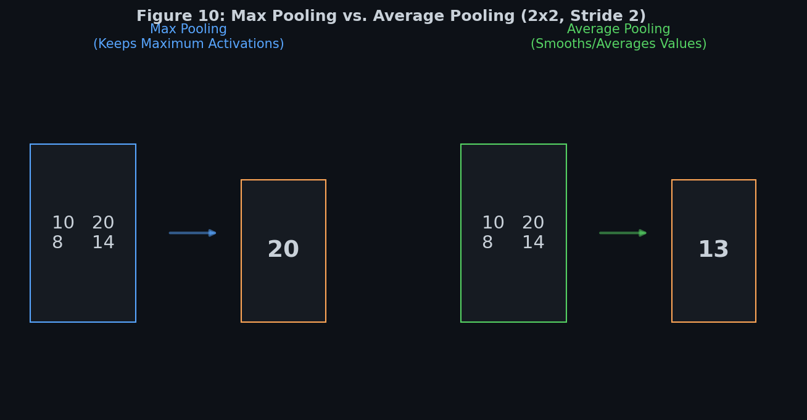
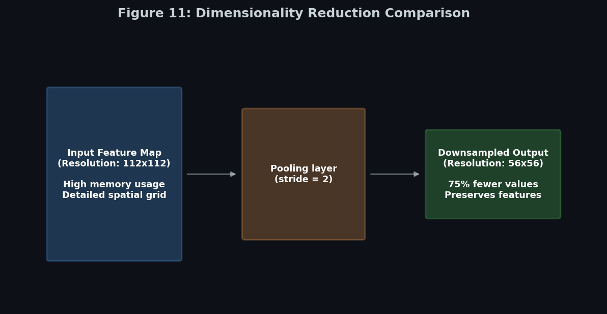
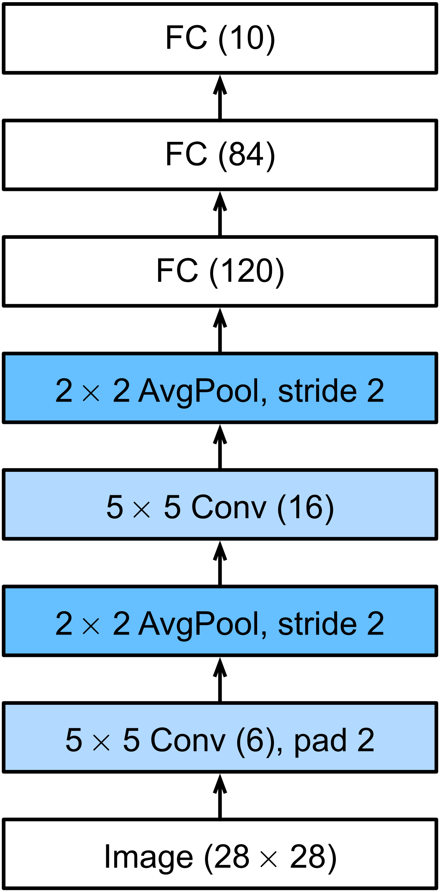
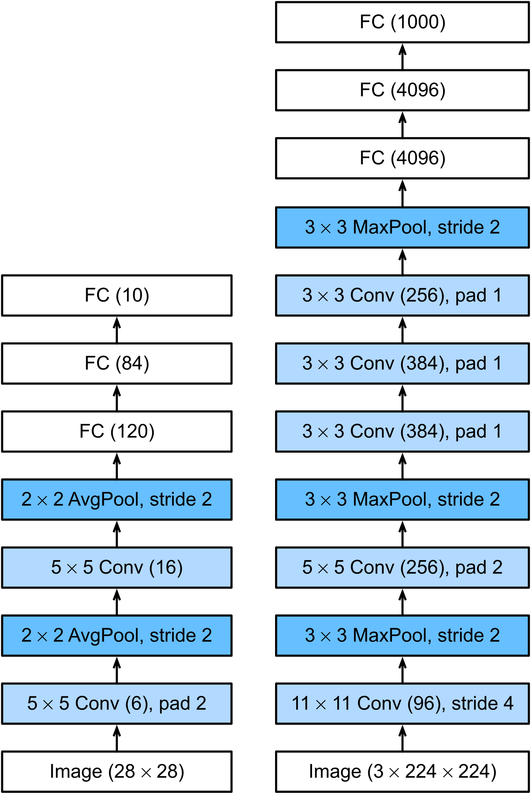
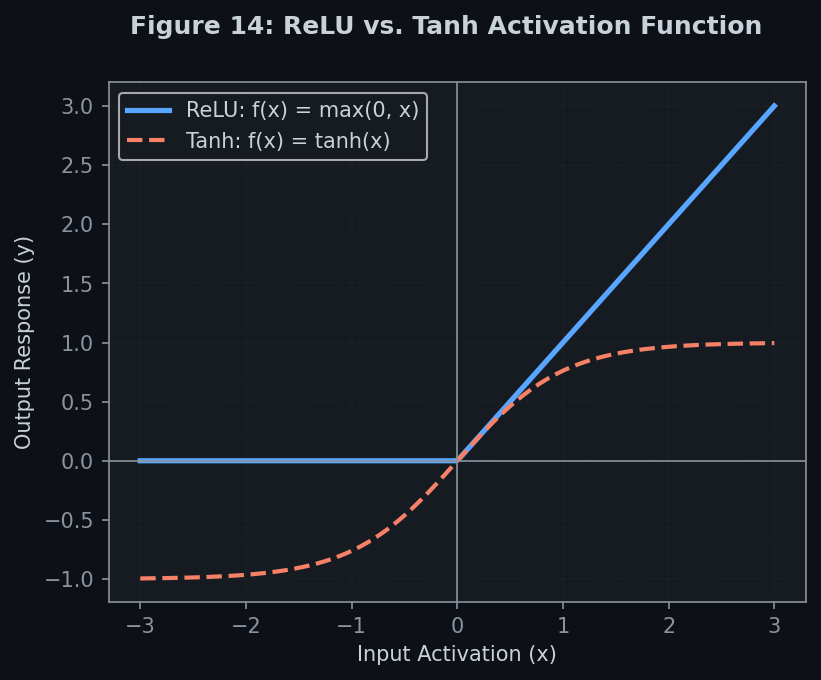
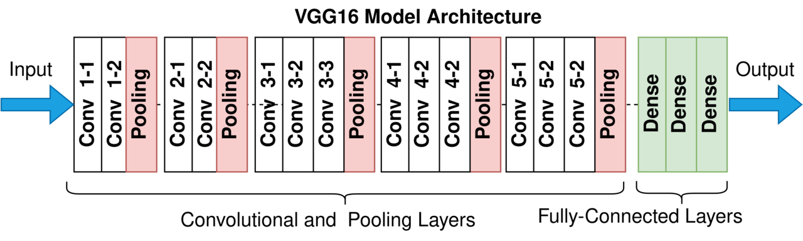
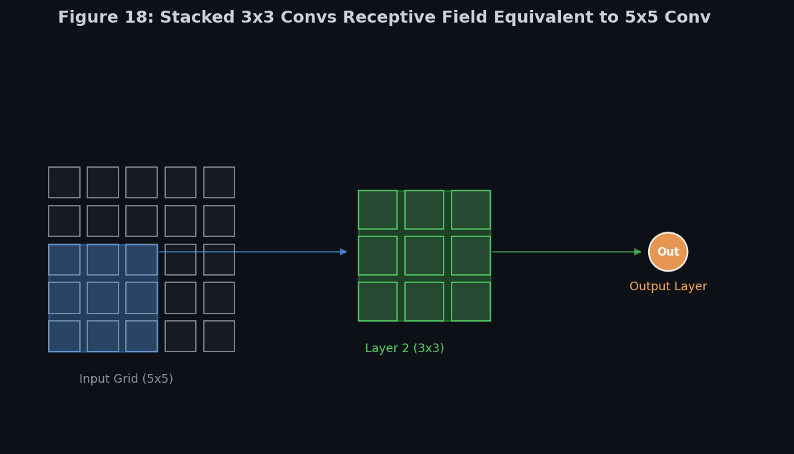

# 🧠 Module 2: Pooling Layers and Classic CNN Architectures

---

## 📌 Table of Contents
1. [Pooling Layers](#pooling-layers)
2. [LeNet-5](#lenet-5)
3. [AlexNet](#alexnet)
4. [VGGNet](#vggnet)

---

## 🔬 1. Pooling Layers {#pooling-layers}

### Concept Explanation
Pooling layers are used to **downsample** feature maps, reducing spatial dimensionality, computational cost, and memory footprint. Unlike convolutional layers, pooling layers do not have any trainable weights or biases. They apply a fixed mathematical function over a sliding window:
*   **Max Pooling**: Extracts the maximum value in each window. It acts as a salient feature detector, propagating only the strongest signal forward while discarding quiet background noise.
*   **Average Pooling**: Calculates the mean value of the window. It tends to smooth out features and is rarely used for downsampling in modern architectures because it dilutes strong signals.
*   **Global Average Pooling (GAP)**: Computes the average of each entire feature map. A feature map of shape $(H, W, C)$ is converted to $(1, 1, C)$ (or a flat vector of length $C$). This is often used at the end of networks to replace heavy fully connected (Dense) layers, significantly reducing parameter counts.

#### Translation Invariance
Max pooling provides **local translation invariance**. If an input pattern shifts by a few pixels, the location of the activation in the feature map shifts, but the output of the max pooling window remains exactly the same.

### Real-World Example 🔍
Imagine reading a summary of a book chapter. You do not need to memorize every single word (pixels) to understand the plot. Instead, you extract only the key main ideas (max values) and skip the minor details. This allows you to discuss the book even if the wording shifts slightly.

### Key Takeaways
*   **No Parameters**: Pooling layers contain zero learnable weights.
*   **Max vs Average**: Max pooling keeps the strongest signals; average pooling dilutes them.
*   **GAP**: Replaces final Dense layers to prevent overfitting and save parameters.

### Common Interview Questions
*   **Q: Why is Max Pooling preferred over Average Pooling for spatial downsampling?**
    *   *Answer:* Neural networks represent features using high activation values. Max pooling extracts the peak activation (the feature's presence), whereas average pooling averages the peak with surrounding low activations (noise), diluting the feature signal.
*   **Q: How does Global Average Pooling (GAP) prevent overfitting?**
    *   *Answer:* GAP collapses the entire spatial dimension of each channel to a single value. This eliminates the need for a huge fully connected layer that connects all spatial grid coordinates to output classes, reducing millions of parameters to zero in that block.

---

[FIGURE 10: Max Pooling vs. Average Pooling]
*   **Caption**: 2x2 max pooling and average pooling operations with a stride of 2.
*   **Purpose**: Demonstrates how max and average pooling calculate outputs.
*   **Importance**: Foundational arithmetic of downsampling.
*   **Placement**: Immediately after the pooling concept explanation.
*   **Image Type**: Comparison Chart
*   **Suggested Content**: Visual comparison of a 4x4 input block being pooled to a 2x2 output via Max and Average methods.

---

[FIGURE 11: Dimensionality Reduction Comparison]
*   **Caption**: Reducing spatial resolution from a large feature map to a compact output map.
*   **Purpose**: Shows grid resolution reduction and scaling.
*   **Importance**: Illustrates how pooling reduces computational workload.
*   **Placement**: Right after translation invariance section.
*   **Image Type**: Illustration
*   **Suggested Content**: Diagram showing a high-resolution grid shrinking to a medium-resolution and finally a low-resolution grid.

---

## 🏛️ 2. LeNet-5 {#lenet-5}

### Concept Explanation
Introduced by Yann LeCun in 1998, **LeNet-5** is the grandfather of all modern CNNs. It was designed to recognize handwritten digits on checks (MNIST dataset).
*   **Key Architecture**: Alternates between $5 \times 5$ convolutions and $2 \times 2$ average pooling layers, followed by dense layers.
*   **Activation Functions**: Used Tanh and Sigmoid activations (which suffer from vanishing gradients in deeper networks).
*   **Historical Note**: Biases were added *after* pooling, and some connections were sparsely connected (unlike modern dense layouts).

### Real-World Example 🔍
Think of early optical character recognition (OCR) machines at post offices sorting letters. They scanned the zip code block-by-block using small receptive fields to extract digit strokes and classify them into numbers from 0 to 9.

### Key Takeaways
*   **Foundational Model**: First successful application of backpropagation to train multi-layer convolutional structures.
*   **Alternating Blocks**: Established the standard `Conv -> Pool -> Conv -> Pool -> FC` layout template.

### Common Interview Questions
*   **Q: What are the main limitations of LeNet-5 compared to modern CNNs?**
    *   *Answer:* LeNet-5 uses sigmoid/tanh activations (which cause vanishing gradients in deep networks), average pooling (which dilutes activations), and has a tiny capacity (60,000 parameters) which makes it unable to scale to complex datasets like ImageNet.

---

[FIGURE 12: LeNet-5 Complete Architecture]
*   **Caption**: Complete layer-by-layer sequence of LeNet-5 digit classifier.
*   **Purpose**: Details the architectural layout of the classic 1998 CNN.
*   **Importance**: Grandfather template of all CNN pipelines.
*   **Placement**: Immediately after the LeNet-5 architecture description.
*   **Image Type**: Architecture Diagram
*   **Suggested Content**: Flowchart showing: Input (32x32) -> Conv (28x28x6) -> Pool (14x14x6) -> Conv (10x10x16) -> Pool (5x5x16) -> Conv (120) -> FC (84) -> Out (10).

---

## 🚀 3. AlexNet {#alexnet}

### Concept Explanation
In 2012, Alex Krizhevsky, Ilya Sutskever, and Geoffrey Hinton won the ImageNet competition by a massive margin using **AlexNet**, marking the beginning of the modern deep learning boom.
*   **GPU Parallelism**: Split the network weights across two GTX 580 GPUs (each with 3GB VRAM) due to physical memory constraints, allowing GPU-to-GPU cross-talk only in specific layers.
*   **ReLU Activations**: Replaced sigmoid/tanh with Rectified Linear Units ($f(x) = \max(0, x)$), which solved vanishing gradients and accelerated training speeds by 6x.
*   **Overlapping Pooling**: Used $3 \times 3$ max pooling with a stride of 2, reducing overfitting.
*   **Dropout**: Used 50% dropout in fully connected layers to prevent neural co-adaptation and overfitting.
*   **Data Augmentation**: Expanded the training set via flips, crops, and color shifts.
*   **Local Response Normalization (LRN)**: Normalized pixel values across adjacent channels to model lateral inhibition (strongly active channels suppress neighbors, increasing contrast).

### Real-World Example 🔍
Imagine convolving images with highly active GPU processors working in parallel. Because the data is huge, we divide the work: Processor A handles horizontal stripes, Processor B handles vertical layouts, and they compare their work only at checkpoint gates.

### Key Takeaways
*   **Deep Learning Catalyst**: Demonstrated that deep CNNs trained on GPUs can outperform hand-crafted visual models by a large margin.
*   **ReLU Revolution**: Shifted activations from saturating functions to linear rectifiers.
*   **Dropout & Augmentation**: Solved deep network overfitting.

### Common Interview Questions
*   **Q: Why does ReLU train faster than Sigmoid?**
    *   *Answer:* Sigmoid saturates at 0 and 1, meaning its gradient becomes extremely close to zero for large positive or negative inputs, causing vanishing gradients. ReLU has a constant gradient of 1 for all positive inputs, allowing gradients to propagate backward without shrinking.

---

[FIGURE 13: AlexNet Architecture]
*   **Caption**: AlexNet split-GPU architecture diagram showing dual-path processing.
*   **Purpose**: Illustrates parallel GPU training layout.
*   **Importance**: Shows how memory constraints were handled historically using hardware splitting.
*   **Placement**: Immediately after the AlexNet introduction.
*   **Image Type**: Architecture Diagram
*   **Suggested Content**: Dual parallel pipelines of convolutional layers communicating only at specific layers.

---

[FIGURE 14: ReLU Activation Plot]
*   **Caption**: Plot showing ReLU vs. Tanh activation functions.
*   **Purpose**: Visually compares saturating vs. non-saturating activations.
*   **Importance**: Core reason for the scalability of modern deep neural networks.
*   **Placement**: After the ReLU explanation.
*   **Image Type**: Comparison Chart
*   **Suggested Content**: Line plot of $y = \max(0, x)$ vs. $y = \tanh(x)$ with gradient indicators.

---

## 🎨 4. VGGNet {#vggnet}

### Concept Explanation
Developed by the Visual Geometry Group at Oxford in 2014, **VGGNet** (specifically VGG-16 and VGG-19) introduced simplicity and uniformity:
*   **Small Kernels**: Uses only $3 \times 3$ convolutions and $2 \times 2$ max pooling with stride 2 throughout the entire network.
*   **Stacked Kernels**: Two stacked $3 \times 3$ convolutions have the same effective receptive field as a single $5 \times 5$ convolution, but with:
    1.  **Fewer parameters**: $2 \times (3 \times 3 \times C \times C) = 18 C^2$ vs. $5 \times 5 \times C \times C = 25 C^2$ (a 28% reduction).
    2.  **More non-linearities**: Two activation functions instead of one, helping the network learn more complex decision boundaries.
*   **Uniform Channels**: Channels double after each pooling layer (64 $\rightarrow$ 128 $\rightarrow$ 256 $\rightarrow$ 512).

### Real-World Example 🔍
Imagine stacking two layers of small window panes instead of one large window pane. It is easier to manufacture, uses less glass overall (parameters), and lets you add tint (non-linear activations) between the panes for better light filtering.

### Key Takeaways
*   **Clean Design**: Standardized modular architectures by using uniform conv and pooling sizes throughout.
*   **Stacking Principle**: Proved that stacking small filters is computationally superior to using single large filters.

### Common Interview Questions
*   **Q: What is the parameter reduction percentage when replacing a 5x5 conv layer with a stack of two 3x3 conv layers?**
    *   *Answer:* A 5x5 conv has 25 weights per channel, while two 3x3 convs have 18 weights per channel. This represents a **28% parameter reduction** ($18/25 = 72\%$).
*   **Q: Why does VGGNet double its channels after every max pooling layer?**
    *   *Answer:* Max pooling halves the spatial resolution ($H \times W$). To preserve the information capacity of the feature volumes, VGGNet doubles the channel depth ($C$), balancing spatial resolution loss with feature channel capacity.

---

[FIGURE 17: VGG-16 Deep Network Channel Progression]
*   **Caption**: Block-by-block stack of VGG-16 showing channel doubling.
*   **Purpose**: Demonstrates simple, uniform channel progression.
*   **Importance**: Shows standard modular CNN design conventions.
*   **Placement**: Immediately after the VGGNet introduction.
*   **Image Type**: Architecture Diagram
*   **Suggested Content**: Visual stacks representing convolutional layers doubling in depth while halving in height and width.

---

[FIGURE 18: Stacked 3x3 Convs Receptive Field Equivalent to 5x5 Conv]
*   **Caption**: Two stacked 3x3 convolutions mapping to a 5x5 spatial receptive field.
*   **Purpose**: Explains stacked receptive field mechanics.
*   **Importance**: Key proof of stacked kernel parameters efficiency.
*   **Placement**: After the stacked kernels parameter reduction proof.
*   **Image Type**: Illustration
*   **Suggested Content**: Input grid connected to a middle layer of neurons, which connect to an output neuron, illustrating spatial span.

---

---

**🔗 Previous Module →** [01_The_Architecture_of_the_Visual_Cortex_and_Convolutional_Layers.md](01_The_Architecture_of_the_Visual_Cortex_and_Convolutional_Layers.md)  
**🔗 Next Module →** [03_Advanced_CNN_Architectures.md](03_Advanced_CNN_Architectures.md)
