# 🧠 Module 3: Advanced CNN Architectures
> **Ch. 14 — Hands-On ML with Scikit-Learn, Keras & TensorFlow (Aurélien Géron)**

---

## 📌 Table of Contents

### Part 1: The Evolution of Convolutions (2014-2016)
1. [Start Here: The Big Picture](#big-picture)
2. [GoogLeNet & The Inception Module (2014)](#googlenet)
3. [ResNet & Residual Learning (2015)](#resnet)
4. [Xception & Depthwise Separable Convolutions (2016)](#xception)

### Part 2: The Era of Attention & Scaling (2017-Present)
5. [SENet & Channel Attention (2017)](#senet)
6. [EfficientNet & Compound Scaling (2019)](#efficientnet)
7. [Vision Transformer (ViT) (2020)](#vit)
8. [ConvNeXt (2022)](#convnext)

### Appendices
9. [Final Evolution Summary](#evolution)
10. [Key Terms Dictionary](#terms)
11. [Common Beginner Mistakes](#mistakes)
12. [Interview Q&A (Top 5)](#interview)
13. [⚡ One-Page Flash Card](#revision)

---

## 🌍 Start Here: The Big Picture {#big-picture}

> **TL;DR:** While classic architectures (AlexNet, VGGNet) relied on stacking layers in a straight line, modern advanced architectures treat the neural network like a complex assembly line. They use parallel branches, bypass highways (skip connections), and specialized teams to achieve much higher accuracy using a fraction of the computational power.

**The "Assembly Line" Analogy 🏭**

*   **Classic CNNs (VGG)**: A single assembly line. The car chassis must go through Station A, then Station B, then Station C in order. If the line gets too long (too deep), the workers at the start lose sight of the end goal (Vanishing Gradient).
*   **GoogLeNet**: An assembly line where Station A splits the car into 4 parallel teams working at once, then glues the parts back together.
*   **ResNet**: An assembly line with a bypass highway. If Station B doesn't know what to do, the car just drives around it straight to Station C.
*   **Xception**: A highly specialized assembly line where one team *only* looks at spatial shapes, and another team *only* looks at how different shapes connect to each other.
*   **SENet**: An intelligent manager on the assembly line that dynamically shouts at the workers to completely ignore irrelevant parts and focus heavily on the most crucial components.
*   **EfficientNet**: A mathematically perfectly scaled factory. If you want to build twice as many cars, you don't just randomly hire more workers—you systematically scale the building size, the number of workers, and the speed of the conveyor belt *together*.
*   **Vision Transformer (ViT)**: Completely destroys the traditional assembly line. Instead of a conveyor belt, it looks at a blueprint of the entire car all at once and instantly connects distant parts together without passing them down a line.
*   **ConvNeXt**: A modern rebuild of the classic assembly line, equipped with all the advanced tools stolen from the Transformer factory.

---

## 📘 Part 1: The Evolution of Convolutions (2014-2016)

---

## 🏗️ GoogLeNet & The Inception Module (2014) {#googlenet}

**GoogLeNet**, also known as **Inception-v1**, was developed by researchers at **Google** and won the **ImageNet Large Scale Visual Recognition Challenge (ILSVRC) 2014**.

### Basic Information
*   **Year:** 2014
*   **Input Size:** 224 × 224 × 3
*   **Depth:** 22 trainable layers (9 Inception Modules)
*   **Parameters:** Approximately **6.8 million**
*   **Activation Function:** ReLU
*   **Pooling:** Max Pooling + Global Average Pooling

### Why was GoogLeNet introduced?
Previous CNNs had a parameter explosion problem (AlexNet had ~60M, VGG-16 had ~138M). Large models required more memory, longer training time, and carried a higher risk of overfitting. 
**The Goal:** Increase network depth and improve accuracy, while drastically reducing the number of parameters and computational cost.

---

### Main Idea: The Inception Module
Instead of deciding whether a **$1\times1$**, **$3\times3$**, or **$5\times5$** filter is best, GoogLeNet applies all of them **in parallel** and combines their outputs.

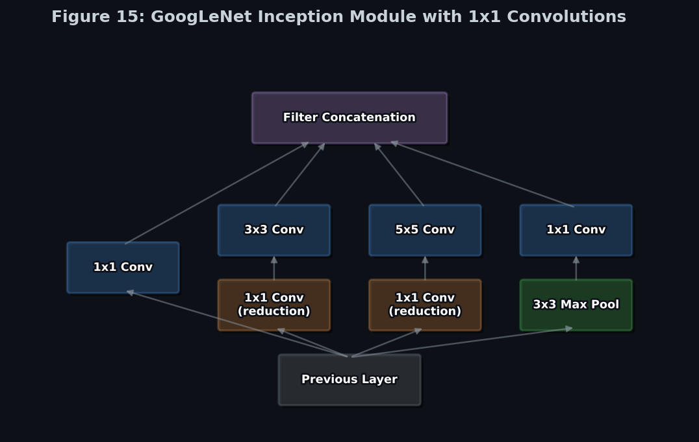
> 📊 **Figure 15:** The Inception block splits the input into parallel branches, computes convolutions of different sizes, and mathematically concatenates the outputs along the depth dimension. 

Why use multiple filter sizes? Different objects have different sizes!
*   **Small object** $\to$ $1\times1$ or $3\times3$ filters
*   **Medium object** $\to$ $3\times3$ filters
*   **Large object** $\to$ $5\times5$ filters

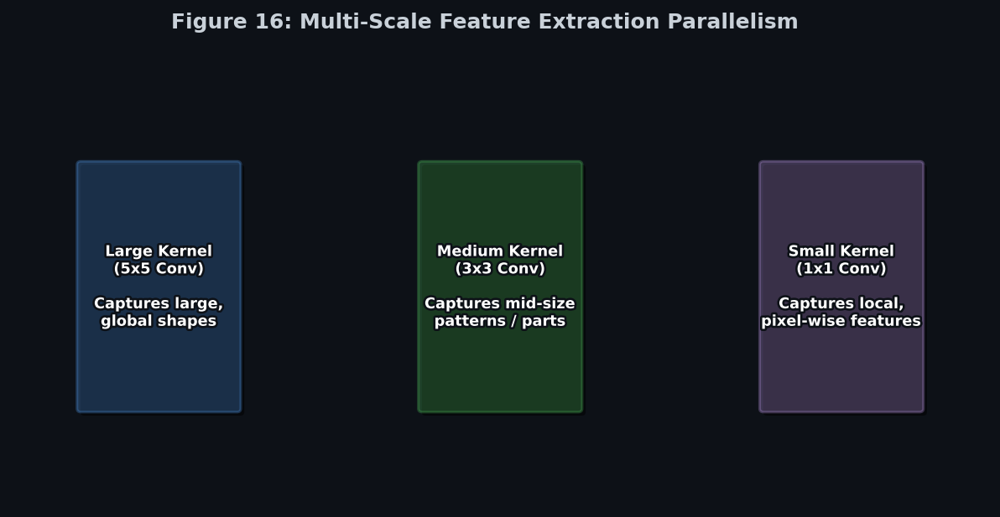
> 📊 **Figure 16:** By running different kernels simultaneously, the network captures small, medium, and large-scale features all at the exact same time.

---

### The Role of the $1 \times 1$ Convolution (The Bottleneck)
One of the biggest innovations in GoogLeNet is the use of **$1 \times 1$ convolutions**. It serves three purposes:

1.  **Reduce the number of channels (Dimensionality Reduction):** Squashing a deep feature map (e.g., 192 channels down to 32) before passing it to an expensive $5 \times 5$ filter.
2.  **Increase Non-Linearity:** Each $1 \times 1$ convolution is followed by a ReLU activation, allowing the network to learn more complex feature representations.
3.  **Reduce Computation:**

> 🧮 **Math Example ($1 \times 1$ Bottleneck Savings):**
> Imagine an input of $14 \times 14 \times 480$. We want to apply forty-eight $5 \times 5$ filters.
> *   **Without Bottleneck**: Operations $\approx (14 \times 14 \times 480) \times (5 \times 5 \times 48) \approx \mathbf{112 \text{ Million operations}}$.
> *   **With Bottleneck**: First, use a $1 \times 1$ conv to reduce 480 channels to 16. 
>     *   Step 1 ($1 \times 1$): $(14 \times 14 \times 480) \times (1 \times 1 \times 16) \approx 1.5M$ ops.
>     *   Step 2 ($5 \times 5$): $(14 \times 14 \times 16) \times (5 \times 5 \times 48) \approx 3.7M$ ops.
>     *   Total = $1.5M + 3.7M = \mathbf{5.2 \text{ Million operations}}$.
> *   *Result*: The $1 \times 1$ bottleneck reduced computation by **~95%**!

---

### Global Average Pooling (GAP)
Instead of flattening the feature maps and using massive, memory-hogging fully connected dense layers, GoogLeNet applies **Global Average Pooling**.
*   **Example:** A final feature map of $7 \times 7 \times 1024$ is averaged out spatially into a $1 \times 1 \times 1024$ vector.
*   **Benefits:** Drops the parameter count by millions, heavily lowers the risk of overfitting, and makes the model highly efficient.

### Auxiliary Classifiers
Training a very deep network (22 layers) causes gradients to vanish as they propagate backward. To fix this, GoogLeNet adds **auxiliary classifiers** to the intermediate layers of the network.
*   They act as regularizers and improve gradient flow during training.
*   They are discarded during inference.

### Key Characteristics
*   **Advantages:** Much deeper than AlexNet but uses only ~6.8 million parameters. Efficient computation and reduced overfitting.
*   **Limitations:** Complex, intricate architecture with parallel branches that is harder to implement and understand than a straight-line network like VGG.

### 📝 Key Exam Points
*   **GoogLeNet** is also called **Inception-v1** (Winner of ILSVRC 2014).
*   Introduced the **Inception Module** (parallel $1\times1$, $3\times3$, $5\times5$ branches).
*   Uses **$1 \times 1$ convolutions** strictly for dimensionality reduction.
*   Eliminated dense layers with **Global Average Pooling (GAP)**.
*   Uses **Auxiliary Classifiers** to fight vanishing gradients.

---

## 🎢 ResNet & Residual Learning (2015) {#resnet}

**ResNet (Residual Network)** was introduced by researchers at **Microsoft Research** in **2015**, winning the **ImageNet Large Scale Visual Recognition Challenge (ILSVRC) 2015**.

The main innovation of ResNet is **Residual Learning**, which allows very deep neural networks (50, 101, or even 152 layers) to be trained effectively by overcoming the **vanishing gradient problem**.

### Why was ResNet Needed?
As CNNs became deeper, researchers expected accuracy to improve. However, after a certain depth, performance started getting worse due to vanishing gradients and optimization difficulties.

**The Degradation Problem:** Adding more layers should not make a model perform worse, but in practice, a 56-layer network had *lower* accuracy than a 20-layer network. This decrease in accuracy despite deeper layers is called the degradation problem.

---

### Idea Behind Residual Learning
Instead of learning the complete mapping $H(x)$, ResNet learns the **residual** $F(x) = H(x) - x$.
Therefore, $H(x) = F(x) + x$, where $x$ is the original input, added directly to the output using a **skip connection (shortcut connection)**.


> 📊 **Figure 19:** The Residual Unit. Instead of learning the complete map, the layer learns the residual $F(x)$. The input $x$ is then added back at the end.

**Why does this work?**
If a layer is useless and its weights initialize near zero, it outputs $F(x) \approx 0$. 
Because of the skip connection, the final output is simply $x + 0 = x$. 
Learning zero (or a small correction) is mathematically much easier than forcing a network layer to learn the full identity mapping.

### The Bypass Highway (Gradient Flow)
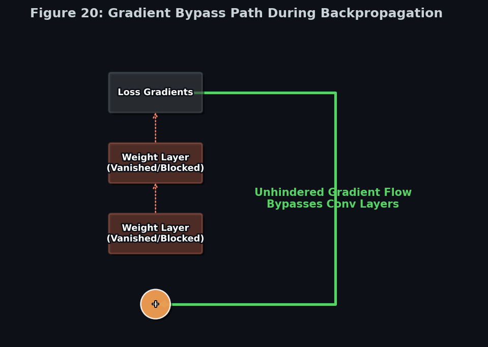
> 📊 **Figure 20:** During backpropagation, the gradients flow completely unhindered down the skip connection, easily reaching the earliest layers of the network and solving the vanishing gradient problem.

> 🧮 **Math Example (Vanishing Gradient Calculus):**
> Without skip connections, the gradient $\frac{\partial \mathcal{E}}{\partial x}$ depends on multiplying many weights $W$. If $W < 1$, multiplying them deeply causes the gradient to shrink to 0.
> With a skip connection $H(x) = F(x) + x$, the derivative during backpropagation becomes:
> $$\frac{\partial \mathcal{E}}{\partial x} = \frac{\partial \mathcal{E}}{\partial y} \left( \frac{\partial F}{\partial x} + 1 \right)$$
> Notice the **$+1$**. Even if the weights of the layer $\frac{\partial F}{\partial x}$ vanish to 0, the gradient simply passes through the $+1$, preventing the gradient from ever dying!

---

### Architecture & Variants
The architecture alternates between Convolution, Batch Normalization, and ReLU, heavily relying on Skip Connections and ending with Global Average Pooling.

| Model | Number of Layers |
| :--- | :--- |
| **ResNet-18** | 18 |
| **ResNet-34** | 34 |
| **ResNet-50** | 50 |
| **ResNet-101** | 101 |
| **ResNet-152** | 152 |

Deeper versions provide better feature extraction but require more computation.

---

### Bottleneck Residual Block (ResNet-50 and Above)
For deeper models, ResNet uses a bottleneck design (similar to GoogLeNet):
1.  **$1 \times 1$ Conv**: Reduce Channels
2.  **$3 \times 3$ Conv**: Process Features
3.  **$1 \times 1$ Conv**: Restore Channels

This lowers the number of parameters and decreases computational cost before performing the expensive $3 \times 3$ convolution.

### Global Average Pooling (GAP)
Like GoogLeNet, ResNet replaces dense layers with GAP (e.g., $7 \times 7 \times 2048 \to 1 \times 1 \times 2048$). This significantly reduces parameters and overfitting.

### Key Characteristics
*   **Advantages:** Solves the degradation problem. Reduces the vanishing gradient problem. Enables training of massive networks. Achieves excellent performance.
*   **Limitations:** Deep models require significant computation, memory, and training time compared to simpler classic networks.

### 🏆 Advanced CNN Comparison Table

| Feature | AlexNet | VGGNet | GoogLeNet | ResNet |
| :--- | :--- | :--- | :--- | :--- |
| **Year** | 2012 | 2014 | 2014 | 2015 |
| **Layers** | 8 | 16/19 | 22 | 18–152+ |
| **Main Innovation**| ReLU, Dropout | Uniform 3×3 Filters | Inception Module | Residual Learning |
| **Parameters** | ~60M | ~138M | ~6.8M | Varies by Model |
| **Skip Connections**| No | No | No | Yes |
| **Global Avg Pool**| No | No | Yes | Yes |

### 📝 Key Exam Points
*   **ResNet** stands for **Residual Network** (Winner of ILSVRC 2015).
*   Main innovation: **Residual Learning** using **Skip (Shortcut) Connections**.
*   Learns the residual function **$F(x)$** instead of the complete mapping $H(x)$.
*   Output of a residual block is **$F(x) + x$**.
*   Solves the **degradation problem** and mitigates the **vanishing gradient problem**.
*   Deeper versions (ResNet-50+) use **Bottleneck** $1 \times 1$ convolutions.

---

## ✂️ Xception & Depthwise Separable Convolutions (2016) {#xception}

**Xception** stands for **Extreme Inception**. Introduced by **François Chollet** in **2017**, the main idea is to replace the standard convolution with **Depthwise Separable Convolutions**, drastically increasing efficiency while maintaining high accuracy.

### Why was Xception Introduced?
Traditional convolution performs two tasks simultaneously:
1.  **Extract spatial features** (height and width).
2.  **Combine information across channels** (depth).

Doing both together requires massive amounts of parameters and computations. Xception separates these operations into two simpler steps, saving immense computational cost.


> 📊 **Figure 21:** Step 1 applies a single 2D spatial filter to each channel separately. Step 2 uses a $1 \times 1$ convolution to mix those channels together. 

### The Math: Standard vs Depthwise Separable
Assume an input of $32 \times 32 \times 3$. We want 64 output channels using $3 \times 3$ filters.

> 🧮 **Math Example (Standard Convolution Parameters):**
> *   Each filter spans all 3 input channels: $3 \times 3 \times 3$.
> *   We need 64 of these filters: $(3 \times 3 \times 3) \times 64 = \mathbf{1,728 \text{ parameters}}$.

Now, let's do it the **Depthwise Separable** way:
> 🧮 **Math Example (Depthwise Separable Parameters):**
> *   **Step 1 (Depthwise Conv):** Apply one $3 \times 3$ filter per channel independently.
>     *   $(3 \times 3) \times 3 \text{ channels} = \mathbf{27 \text{ parameters}}$.
> *   **Step 2 (Pointwise $1 \times 1$ Conv):** Use $1 \times 1$ convolutions to mix the channels into 64 outputs.
>     *   $(1 \times 1 \times 3) \times 64 = \mathbf{192 \text{ parameters}}$.
> *   **Total Parameters**: $27 + 192 = \mathbf{219 \text{ parameters}}$.

**Result:** A staggering **87% reduction** ($1728 \to 219$) in parameters!

### Xception Architecture
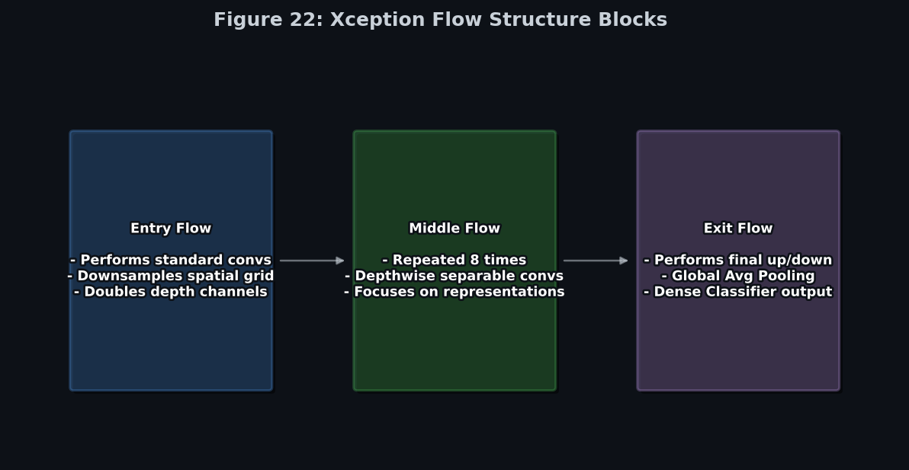
> 📊 **Figure 22:** The architecture of Xception flows through an Entry, Middle (repeated 8 times), and Exit flow.

1.  **Entry Flow:** Initial feature extraction and spatial reduction.
2.  **Middle Flow:** Repeated depthwise separable blocks learning increasingly complex features.
3.  **Exit Flow:** Final extraction, Global Average Pooling, and Classification.

Like ResNet, Xception uses **Residual (Skip) Connections** to guarantee better gradient flow and easier optimization across its deep architecture.

### Key Characteristics
*   **Advantages:** Extremely efficient. High classification accuracy. Faster training and lower memory usage. Combines depthwise separable efficiency with residual connection optimization.
*   **Limitations:** More complex to implement. Performance is highly dependent on how well optimized the deep learning libraries are for depthwise operations.

### 🏆 Convolution Architecture Comparison Table

| Feature | Standard CNN | Inception | Xception |
| :--- | :--- | :--- | :--- |
| **Convolution** | Standard | Inception Module | Depthwise Separable |
| **Uses 1×1 Conv** | Sometimes | Yes | Yes (Pointwise) |
| **Parameter Count** | High | Moderate | Low |
| **Computation** | High | Moderate | Low |
| **Skip Connections** | No | No (original v1) | Yes |

### 📝 Key Exam Points
*   **Xception** stands for **Extreme Inception** (Chollet, 2017).
*   Replaces standard convolutions with **Depthwise Separable Convolutions**.
*   It splits into: **Depthwise Convolution** (spatial) and **Pointwise $1 \times 1$ Convolution** (channel mixing).
*   Uses **Residual (Skip) Connections** just like ResNet.
*   Divides network into **Entry Flow, Middle Flow, and Exit Flow**.
*   Uses **Global Average Pooling** before final classification.

---

## 📙 Part 2: The Era of Attention & Scaling (2017-Present)

---

## 🧠 SENet & Channel Attention (2017) {#senet}

**SENet (Squeeze-and-Excitation Network)** was introduced in **2018** (winning ILSVRC 2017) by researchers at Huazhong University of Science and Technology and Momenta. 

Its main innovation is the **Squeeze-and-Excitation (SE) Block**, which introduces **Channel Attention**. Instead of treating all feature channels equally, SENet learns which channels are more important and mathematically gives them higher weights.

### What is Channel Attention?
Channel Attention answers the question: > **"Which feature channels are most important for this specific image?"**
Instead of changing the image height and width, Channel Attention adjusts the importance of each **channel (depth)**.

For example, if Channel 1 detects *Edges*, Channel 2 detects *Eyes*, and Channel 3 detects *Noise*, SENet automatically learns to heavily weight Channels 1 and 2, while aggressively suppressing the *Noise* channel.

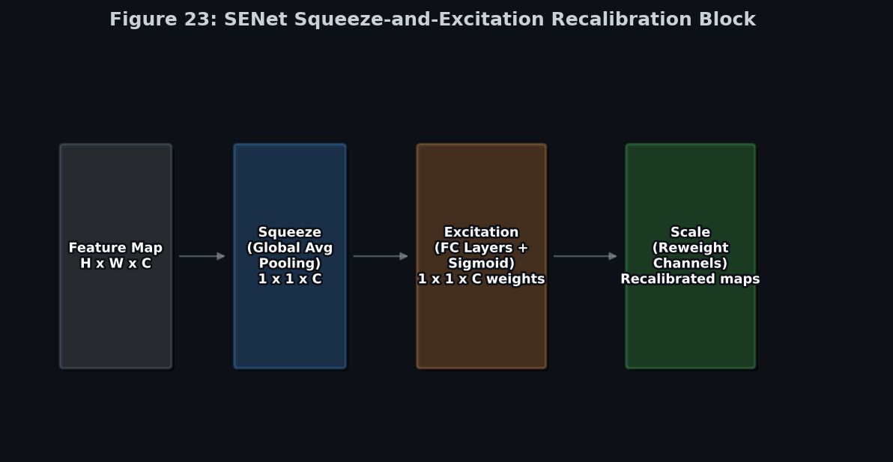
> 📊 **Figure 23:** The SE Block uses Global Average Pooling to squeeze the maps, then uses a small neural network to output a recalibration scale (between 0 and 1) for every single channel.

---

### The SE Block: 3 Main Steps

#### Step 1: Squeeze (Global Average Pooling)
The goal is to summarize each feature map into a single value using Global Average Pooling (GAP).
> *   $7 \times 7 \times 64$ Feature Map $\xrightarrow{\text{GAP}}$ $1 \times 1 \times 64$ Vector
> *   This compressed vector captures the overall global importance of each channel.

#### Step 2: Excitation (Reduction & Expansion)
The squeezed vector is passed through a small neural network (Fully Connected $\to$ ReLU $\to$ Fully Connected $\to$ Sigmoid). The final **Sigmoid** activation produces a weight between **0 and 1** for each channel.

To keep computational cost low, the first Dense layer reduces the dimensionality by a **Reduction Ratio ($r$)** (e.g., $r=16$), before the second Dense layer expands it back up.
> *   $256 \text{ channels} \to 16 \text{ neurons} \to 256 \text{ channels}$.

#### Step 3: Feature Recalibration (Scale)
Each original feature map is multiplied by its corresponding new channel weight. 
*   **Weight $\approx 1$**: The channel is important and remains unchanged.
*   **Weight $\approx 0$**: The channel is useless and gets zeroed out.

> 🧮 **Math Example (Excitation Tensor):**
> Let the squeezed vector be $z \in \mathbb{R}^C$.
> The scale vector $s$ is computed as: $s = \sigma(W_2 \cdot \text{ReLU}(W_1 z))$
> Where $W_1$ shrinks the dimension to $C/r$, and $W_2$ expands it back to $C$.

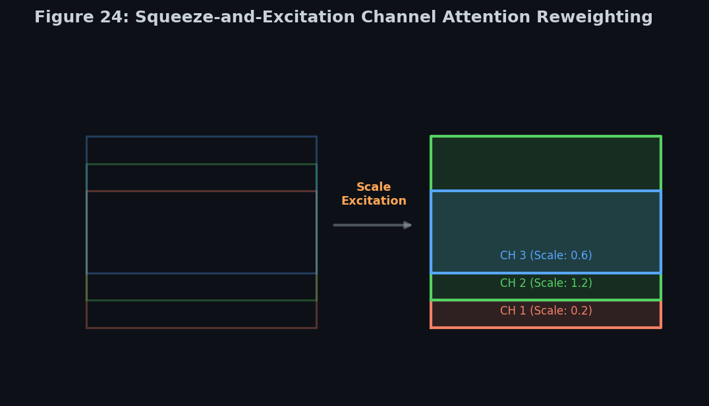
> 📊 **Figure 24:** The resulting scales are multiplied directly into the feature maps. Irrelevant channels are muted, like lowering the volume on a noisy audio track.

---

### Key Characteristics & Applications
*   **Architecture:** The SE block is lightweight and can be easily inserted into almost any CNN (ResNet, Inception, MobileNet).
*   **Advantages:** Dramatically improves feature representation and accuracy while adding relatively few parameters.
*   **Limitations:** Slight increase in computational cost and focuses *only* on channel relationships, completely ignoring spatial attention (where things are in the image).
*   **Applications:** Highly used in Fine-Grained Image Recognition, Medical Image Analysis, and Object Detection.

### 🏆 Channel Attention vs Spatial Attention

| Feature | Channel Attention | Spatial Attention |
| :--- | :--- | :--- |
| **Focus** | **Which** feature maps (channels) are important. | **Where** in the feature map important info is located. |
| **Mechanism**| Reweights channels (depth). | Reweights spatial locations (pixels). |
| **Used In** | SENet | CBAM (Convolutional Block Attention Module) |

### 📝 Key Exam Points
*   **SENet** stands for **Squeeze-and-Excitation Network**.
*   Introduces **Channel Attention**.
*   The **SE Block** consists of 3 phases:
    1.  **Squeeze**: Global Average Pooling.
    2.  **Excitation**: Fully connected network with reduction ratio + Sigmoid.
    3.  **Recalibration**: Multiply weights back into the feature maps.
*   Learns the importance of each feature channel automatically.
*   Can be inserted into any existing CNN architecture with minimal overhead.

---

## 📐 EfficientNet & Compound Scaling (2019) {#efficientnet}

**EfficientNet** was introduced by researchers at **Google in 2019**. The main idea was: instead of randomly making a CNN deeper, wider, or increasing image size, scale all three dimensions in a balanced way using a method called **Compound Scaling**.

### The Problem with Previous CNN Scaling
When improving CNN accuracy, researchers traditionally scaled only one dimension at a time:
1.  **Depth (More layers):** E.g., ResNet-50 $\to$ ResNet-101 $\to$ ResNet-152. 
    *   *Problem:* Huge computations and harder to train (vanishing gradients).
2.  **Width (More channels):** E.g., 64 filters $\to$ 128 filters $\to$ 256 filters.
    *   *Problem:* Massively increased parameter count and memory usage.
3.  **Resolution (Larger Input):** E.g., $224 \times 224 \to 384 \times 384$.
    *   *Problem:* Exponentially higher computational cost.

### The Solution: Compound Scaling
EfficientNet scales Depth, Width, and Resolution *together* using a fixed set of mathematical scaling coefficients.

> 🧮 **Math Example (Compound Scaling Formula):**
> *   $\text{Depth} = \alpha^\phi$
> *   $\text{Width} = \beta^\phi$
> *   $\text{Resolution} = \gamma^\phi$
>
> Where $\phi$ is a user-specified constant controlling overall model size, and $\alpha, \beta, \gamma$ are constants found via a grid search on a baseline model.
>
> **The Grid Search Results:** Google found the optimal mathematical balance to be:
> *   $\alpha \approx 1.2$ (Depth)
> *   $\beta \approx 1.1$ (Width)
> *   $\gamma \approx 1.15$ (Resolution)
> *   Constraint: $\alpha \cdot \beta^2 \cdot \gamma^2 \approx 2$

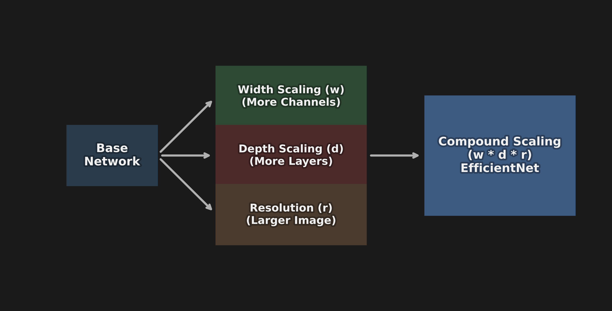
> 📊 **Figure 25:** Compound Scaling systematically increases Width (channels), Depth (layers), and Resolution (image size) together, unlike previous methods which randomly scaled only one dimension.

---

### MBConv: The Building Block
EfficientNet uses the **MBConv (Mobile Inverted Bottleneck Convolution)** block, originally introduced in MobileNet.

#### MBConv Structure: 4 Steps
1.  **Expansion ($1 \times 1$ Conv):** Increases the number of channels (e.g., $32 \to 192$). *Why?* More channels allow the network to learn richer, high-dimensional features.
2.  **Depthwise Convolution ($3 \times 3$):** Instead of a normal convolution spanning all channels, it uses exactly one $3 \times 3$ filter per channel. *Why?* Drastically fewer parameters and less computation (just like Xception).
3.  **Squeeze-and-Excitation (SE Block):** Adds channel attention! It gives importance weights to channels (e.g., Channel A=0.9, Channel B=0.2), automatically enhancing important features and suppressing noise.
4.  **Projection ($1 \times 1$ Conv):** Reduces the channels back down (e.g., $192 \to 32$) before moving to the next block.

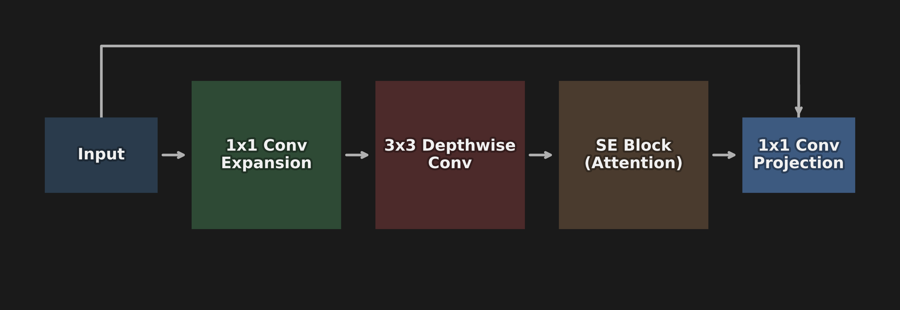
> 📊 **Figure 26:** The MBConv Block architecture. Notice how the channels are heavily expanded, processed individually via Depthwise convolution, weighted by Attention, and then squeezed back down.

---

### EfficientNet Versions & Scaling

| Model | Input Size | Parameters |
| :--- | :--- | :--- |
| **EfficientNet-B0** | $224 \times 224$ | 5.3M |
| **EfficientNet-B1** | $240 \times 240$ | 7.8M |
| **EfficientNet-B4** | $380 \times 380$ | 19M |
| **EfficientNet-B7** | $600 \times 600$ | 66M |

*Notice how all 3 dimensions (Resolution, Depth/Width causing parameter spikes) scale up together.*

### Key Characteristics & Applications
*   **Advantages:** Achieves extremely high accuracy with astonishingly few parameters. It is highly efficient to train and is excellent for mobile and cloud applications.
*   **Innovations:** Beautifully combines Depthwise Convolutions, Squeeze-and-Excitation (SE) blocks, and Compound Scaling.
*   **Applications:** Image classification, Object detection, Medical imaging, and mobile vision systems.

### 📝 Key Exam Points
*   Introduced **Compound Scaling** (scaling Depth, Width, and Resolution uniformly).
*   Uses the **MBConv** block.
*   MBConv integrates **Depthwise Separable Convolutions** and **SE (Squeeze-and-Excitation)** attention blocks into a single powerful unit.
*   The baseline model is **EfficientNet-B0**, scaled all the way up to **B7**.

---

## 👁️ Vision Transformer (ViT) (2020) {#vit}

**Vision Transformer (ViT)** applies the Transformer architecture—originally developed for natural language processing—directly to images.

**The Key Idea:** Treat an image exactly like a sequence of words.
*   **NLP:** `word1` $\to$ `word2` $\to$ `word3`
*   **ViT:** `patch1` $\to$ `patch2` $\to$ `patch3`

### How ViT Works: 4 Steps
Assume we have an input image of $224 \times 224 \times 3$.

#### Step 1: Divide Image into Patches
The image is chopped into a grid of small, fixed-size patches (e.g., $16 \times 16$).
> 🧮 **Math Example (Number of Patches):**
> *   $\text{Grid Size} = \frac{224}{16} \times \frac{224}{16} = 14 \times 14$
> *   **Total Patches** = $196 \text{ patches}$

Each patch is treated identically to how a word "token" is treated in an NLP Transformer.

#### Step 2: Patch Embedding
Each $16 \times 16 \times 3$ image patch is flattened and linearly projected (converted) into a 1D vector (e.g., a 768-dimensional vector). 
*   **Result:** The image is now a sequence of 196 vectors.

#### Step 3: Add Position Information
Transformers do not have convolutions; they process everything simultaneously and do not naturally know the order or location of patches. 
*   **Solution:** Positional embeddings are added to the vectors. (e.g., `Patch 1 + Position 1`). This tells the model where each patch came from in the original image.

#### Step 4: Transformer Encoder
The sequence of embedded patches is fed into a standard Transformer Encoder. The flow is:
`Patch Embeddings` $\to$ `Multi-Head Self Attention` $\to$ `MLP` $\to$ `Layer Normalization` $\to$ `Output`.

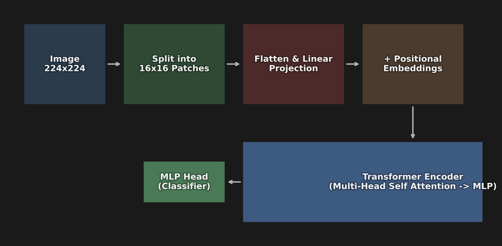
> 📊 **Figure 27:** The Vision Transformer completely bypasses convolutions. It cuts an image into a grid, treats each patch like a sequence word, and processes them all simultaneously through a Transformer Encoder.

### The Power of Self-Attention
Self-Attention asks: > *"Which other patches are important for understanding THIS patch?"*

To do this mathematically, the Transformer uses **Query (Q), Key (K), and Value (V)** vectors:
1.  **Query (Q):** What a patch is "looking for".
2.  **Key (K):** What a patch "contains".
3.  **Value (V):** The actual feature information of the patch.
The attention score is calculated by taking the dot product of one patch's Query with all other patches' Keys. 

> 🧮 **Math Example (Attention Score):**
> $$\text{Attention}(Q, K, V) = \text{softmax}\left(\frac{QK^T}{\sqrt{d_k}}\right)V$$

Unlike a CNN that only looks at local neighbors (like a $3 \times 3$ window), Self-Attention can look globally. For example, in a picture of a dog, the **ear patch** can directly look at the **eye patch** and **nose patch** on the opposite side of the image, immediately learning distant relationships without needing deep layers.

### Key Characteristics & Applications
*   **Advantages:** Captures global relationships instantly. Scales incredibly well with massive datasets. Completely eliminates the need for convolution operations, offering extremely powerful feature learning.
*   **Limitations:** Requires enormous datasets to train effectively (e.g., JFT-300M dataset). It is much more computationally expensive and noticeably less effective on small datasets compared to CNNs (which have built-in inductive biases for images).
*   **Applications:** Image classification, object detection, medical imaging, and image generation models.

---

## 🧬 ConvNeXt (2022) {#convnext}

**ConvNeXt** is a modern CNN architecture designed in 2022 to answer a critical question: *Can a pure CNN compete with Vision Transformers?*

**The Answer:** Yes. ConvNeXt takes the best ideas from Transformers and applies them directly to CNNs, modernizing the architecture without giving up the efficiency of convolutions.

### 4 Main Improvements in ConvNeXt

#### 1. Large Kernel Convolution
*   **Older CNN:** $3 \times 3$ kernel. Sees only nearby pixels.
*   **ConvNeXt:** Uses massive **$7 \times 7$ depthwise convolutions**. 
*   *Why?* Larger kernels capture a much wider context (similar to the global attention in ViT), allowing it to see larger object regions instantly.

#### 2. Depthwise Convolution
Instead of normal, heavy convolutions, ConvNeXt uses **Depthwise Separable Convolutions** (Depthwise followed by $1 \times 1$ pointwise), identical to the approach pioneered by Xception. This guarantees less computation and efficient feature extraction.

#### 3. Layer Normalization
*   **Traditional CNNs:** Use Batch Normalization.
*   **ConvNeXt & Transformers:** Use **Layer Normalization**.
*   *Why?* It results in much more stable training and better scaling on massive datasets.

#### 4. Inverted Bottleneck
Similar to EfficientNet's MBConv block, the internal structure expands and then reduces:
*   `Input` $\to$ `$1 \times 1$ Expansion` $\to$ `Depthwise Conv` $\to$ `$1 \times 1$ Reduction` $\to$ `Output`

### The ConvNeXt Block & Architecture
The block follows a very specific Transformer-inspired flow:
> `Input` $\to$ `$7 \times 7$ Depthwise Conv` $\to$ `Layer Norm` $\to$ `$1 \times 1$ Conv` $\to$ `GELU Activation` $\to$ `$1 \times 1$ Conv` $\to$ `Residual Connection` $\to$ `Output`

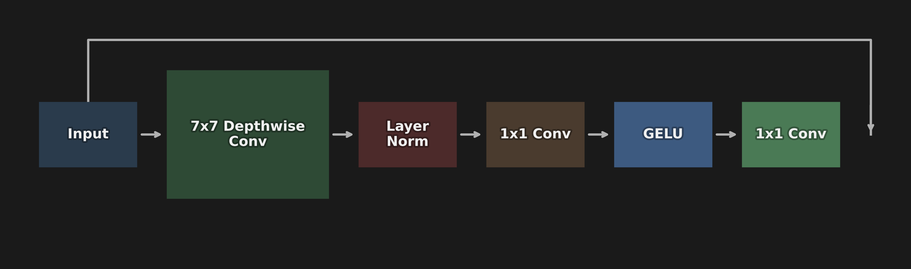
> 📊 **Figure 28:** The ConvNeXt block borrows heavily from ViT and EfficientNet. It uses massive $7 \times 7$ kernels and an inverted bottleneck structure, all wrapped in modern Layer Normalization and GELU activations.

**Macro Architecture (Swin Transformer Ratios):**
ConvNeXt adjusted the number of blocks in each stage to match the macro-architecture ratios of the highly successful Swin Transformer. Instead of ResNet's (3, 4, 6, 3) block distribution, ConvNeXt uses a ratio of **(3, 3, 9, 3)**, heavily prioritizing feature processing in Stage 3.

`Image` $\to$ `Stem` $\to$ `Stage 1` $\to$ `Stage 2` $\to$ `Stage 3` $\to$ `Stage 4` $\to$ `Global Average Pooling` $\to$ `Classifier`

### 🏆 Modern Architectures Comparison Table

| Feature | EfficientNet | Vision Transformer (ViT) | ConvNeXt |
| :--- | :--- | :--- | :--- |
| **Year** | 2019 | 2020 | 2022 |
| **Type** | CNN | Transformer | Modern CNN |
| **Main Idea** | Compound Scaling | Self Attention | Transformer-inspired CNN |
| **Main Operation**| MBConv | Attention | Large Kernel Conv ($7 \times 7$) |
| **Attention** | SE Block | Self Attention | No attention |
| **Efficiency** | Very High | Medium | High |
| **Data Needed** | Medium | Large | Medium |

### Key Characteristics
*   **Advantages:** Achieves Transformer-level accuracy using a pure CNN architecture. It is much easier to deploy than Transformers and incredibly efficient for many vision tasks.

---

## 📈 Final Evolution Summary {#evolution}

How did we get here? Trace the history of CNN evolution:

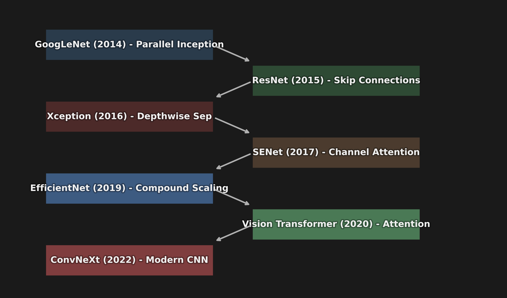
> 📊 **Figure 29:** The lineage of Deep Computer Vision Architectures. Each network fundamentally built upon or challenged the paradigm of the one before it, culminating in the modern CNN vs. Transformer era.

1.  **GoogLeNet (2014):** Inception modules (parallel computing)
    $\downarrow$
2.  **ResNet (2015):** Skip Connections (solving vanishing gradients)
    $\downarrow$
3.  **Xception (2016):** Depthwise Separable Convolutions (efficiency)
    $\downarrow$
4.  **SENet (2017):** Channel Attention (Squeeze-and-Excitation)
    $\downarrow$
5.  **EfficientNet (2019):** Compound Scaling
    $\downarrow$
6.  **Vision Transformer (2020):** Self Attention (treating images as word tokens)
    $\downarrow$
7.  **ConvNeXt (2022):** Modern CNN (bringing Transformer ideas back to CNNs)

---

## 📖 Key Terms Dictionary {#terms}

| Term | Simple Explanation |
|------|--------------------|
| **Inception Module** | A block that runs $1 \times 1$, $3 \times 3$, and $5 \times 5$ convolutions in parallel and concatenates them. |
| **$1 \times 1$ Convolution** | A filter that looks at 1 pixel but spans across all channels. Used to change the depth (dimensionality) of the feature maps. |
| **Skip Connection** | A wire that bypasses a layer, adding the original input directly to the layer's output ($f(x) + x$). |
| **Residual Learning** | Learning the difference (residual) between the input and the desired output, rather than learning the output from scratch. |
| **Depthwise Separable** | Splitting a convolution into two phases: Spatial filtering (per channel) and Pointwise filtering ($1 \times 1$ across channels). |
| **SE Block** | A mechanism that scales (recalibrates) feature maps based on how important they are for the current image. |

---

## ❌ Common Beginner Mistakes {#mistakes}

> These mistakes are very common in interviews and practice — know them all!

**1. "A 1x1 convolution is useless because it only looks at one pixel."** ❌
> Reality: While it only looks at a $1 \times 1$ spatial area, it performs a weighted sum across the **entire depth** of the input channels. It is arguably the most powerful tool for dimensionality reduction (bottlenecking) in modern CNNs.

**2. "Skip connections just add more parameters to the model."** ❌
> Reality: Standard identity skip connections have **zero parameters**. They are purely a structural wiring change that mathematically adds two tensors together.

**3. "Xception and Inception are basically the same."** ❌
> Reality: Inception uses parallel paths of different kernel sizes. Xception entirely drops the Inception block and instead uses a completely linear stack of Depthwise Separable Convolutions.

---

## 🎤 Interview Q&A (Top 5) {#interview}

**Q1: How does ResNet solve the vanishing gradient problem?**
> **A:** ResNet introduces skip connections (shortcut connections) that bypass one or more layers. During backpropagation, gradients flow backward through the network. Because the skip connection performs a simple addition operation ($f(x) + x$), its derivative is 1, creating an unhindered "highway" that allows gradients to reach the earliest layers without vanishing.

**Q2: Why did GoogLeNet use 1x1 convolutions inside the Inception block?**
> **A:** To act as a bottleneck layer. $5 \times 5$ convolutions are incredibly expensive to compute if the input has many channels. GoogLeNet uses a $1 \times 1$ convolution to reduce the number of channels (depth) *before* passing the data to the $3 \times 3$ and $5 \times 5$ layers, saving massive amounts of compute.

**Q3: Explain the two steps of a Depthwise Separable Convolution.**
> **A:** Step 1 (Depthwise): A spatial filter is applied independently to each individual input channel. Step 2 (Pointwise): A $1 \times 1$ convolution is applied across all channels to linearly combine the spatial outputs. This separation drastically reduces the total parameter count.

**Q4: What is the primary purpose of an SE (Squeeze-and-Excitation) Block?**
> **A:** It provides Channel Attention. It "squeezes" spatial information via Global Average Pooling into a small vector, then uses a Dense bottleneck to output a scaling factor (between 0 and 1) for each channel. It multiplies these factors with the feature maps, effectively boosting relevant features and muting irrelevant ones.

**Q5: Can you plug an SE Block into ResNet?**
> **A:** Yes! The SE Block was designed to be modular. You can attach it to the end of a Residual Unit in ResNet, creating an SE-ResNet, which almost always yields a boost in accuracy for minimal computational cost.

---

## ⚡ One-Page Flash Card {#revision}

```
╔══════════════════════════════════════════════════════════════════╗
║                MODULE 3 — ADVANCED ARCHITECTURES                 ║
╠══════════════════════════════════════════════════════════════════╣
║                                                                  ║
║  1. GOOGLENET (2014) - The Inception Block                       ║
║  - Runs 1x1, 3x3, and 5x5 convolutions IN PARALLEL.              ║
║  - Uses 1x1 convs as bottlenecks to shrink depth before math.    ║
║                                                                  ║
║  2. RESNET (2015) - Residual Learning                            ║
║  - Stacks up to 152 layers deep.                                 ║
║  - Solves vanishing gradients via Skip Connections (f(x) + x).   ║
║  - Creates a gradient highway during backpropagation.            ║
║                                                                  ║
║  3. XCEPTION (2016) - Depthwise Separable Convolutions           ║
║  - Separates spatial filtering from channel mixing.              ║
║  - Step 1: Spatial filter per channel separately.                ║
║  - Step 2: 1x1 pointwise conv to combine them.                   ║
║  - Saves ~9x parameters for 3x3 kernels.                         ║
║                                                                  ║
║  4. SENET (2017) - Channel Attention (Recalibration)             ║
║  - Squeeze: Global Avg Pool creates 1D channel summary vector.   ║
║  - Excitation: 2 Dense layers output a 0-1 scale per channel.    ║
║  - Reweights feature maps to boost important features and        ║
║    mute irrelevant noise.                                        ║
║                                                                  ║
║  5. EFFICIENTNET & ViT (2019-2020)                               ║
║  - EfficientNet: Compound scaling (Depth, Width, Resolution).    ║
║  - ViT: No convolutions. Cuts image into 16x16 grid sequence.    ║
║    Uses Q, K, V Self-Attention to map global relationships.      ║
╚══════════════════════════════════════════════════════════════════╝
```

---

**🔗 Previous Module →** [02_Pooling_Layers_and_Classic_CNN_Architectures.md](02_Pooling_Layers_and_Classic_CNN_Architectures.md)  
**🔗 Next Module →** [04_Pretrained_Models_and_Transfer_Learning.md](04_Pretrained_Models_and_Transfer_Learning.md)
