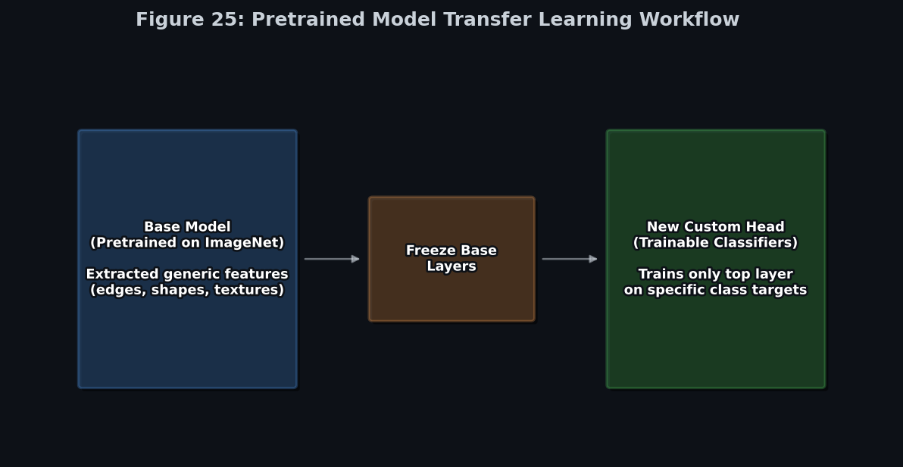

# Module 4: Pretrained Models and Transfer Learning
> **Ch. 14 — Hands-On ML with Scikit-Learn, Keras & TensorFlow (Aurélien Géron)**

---

## Table of Contents
1. [Start Here: The Big Picture](#big-picture)
2. [Choosing the Right Pretrained Model](#choosing-model)
3. [Using Pretrained Models in Keras](#keras-api)
4. [Data Preprocessing & Modern TF Pipelines](#preprocessing)
5. [Transfer Learning Workflow & Fine-Tuning](#transfer-learning)
6. [Training Optimizations](#training-optimizations)
7. [Data Augmentation](#augmentation)
8. [Beyond Traditional CNNs](#foundation-models)
9. [Real-World Considerations](#real-world)
10. [Key Terms Dictionary](#terms)
11. [Common Beginner Mistakes & Best Practices](#mistakes)
12. [Interview Q&A (Top 5)](#interview)
13. [One-Page Flash Card](#revision)

---

## Start Here: The Big Picture {#big-picture}

> **Summary:** Training massive architectures like ResNet from scratch requires millions of images and significant computational resources. **Transfer Learning** allows practitioners to leverage a model that has already learned generalized visual features (such as edges, shapes, and textures) and retrain only the final layers to recognize specific custom objects. 

**A Practical Analogy: Medical Training**

Consider the task of training an AI to identify rare brain tumors from MRI scans, given a limited dataset of 500 scans.
*   **Training from scratch**: This is analogous to expecting an untrained individual to interpret complex MRI scans. Without foundational knowledge of visual structures, the model will struggle to converge.
*   **Transfer Learning**: This is analogous to providing the 500 scans to an experienced medical professional. They already possess the foundational knowledge required to interpret medical imagery; they only require slight "fine-tuning" to specialize in the new task.

---

## Choosing the Right Pretrained Model {#choosing-model}

Different pretrained models present varying trade-offs between accuracy, inference speed, and parameter size. Selecting the appropriate backbone architecture is a critical initial step.

| Model | Advantages | Disadvantages | Best Use Case |
|--------|------------|---------------|---------------|
| **MobileNetV3** | Highly compact, rapid inference | Lower baseline accuracy | Mobile and Edge deployments |
| **EfficientNetV2** | Excellent speed-to-accuracy ratio | Moderate architectural complexity | Most standard real-world projects |
| **ResNet50** | Highly stable, established baseline | Larger parameter footprint than MobileNet | Educational and baseline production |
| **Xception** | High accuracy | Computationally demanding | General image classification |
| **ConvNeXt** | Modern CNN achieving Transformer-level performance | Substantial model size | High-performance CNN requirements |
| **Vision Transformer (ViT)** | State-of-the-art on massive datasets | Requires substantial data and compute | Large-scale enterprise applications |

### General Recommendation

- **Small dataset:** EfficientNetV2 or ResNet50
- **Mobile deployment:** MobileNetV3
- **Maximum accuracy:** ConvNeXt or ViT

---

## Using Pretrained Models in Keras {#keras-api}

Keras provides streamlined access to models pretrained on the **ImageNet** dataset (which contains 1.2 million images across 1,000 categories).

```python
from tensorflow import keras

# Loads a complete ResNet-50 model with weights pre-trained on ImageNet
model = keras.applications.resnet50.ResNet50(weights="imagenet")
```

The `keras.applications` module includes most standard architectures, such as `VGG16`, `ResNet50`, `InceptionV3`, `Xception`, and optimized models for edge computing like `MobileNetV2`.

---

## Data Preprocessing & Modern TF Pipelines {#preprocessing}

Input images must be strictly formatted to match the preprocessing steps applied to the model's original training data.

1.  **Resizing**: ResNet-50 and Xception require images scaled to $224 \times 224$. InceptionV3 requires $299 \times 299$.
2.  **Scaling**: Architectures differ in their required pixel scaling (e.g., $[0, 1]$, $[-1, 1]$, or $[0, 255]$).

Keras abstracts this complexity via architecture-specific `preprocess_input()` functions.

```python
import tensorflow as tf

# Apply architecture-specific scaling
inputs = keras.applications.resnet50.preprocess_input(images_resized)
```

### Modern TensorFlow Data Pipeline

The recommended input pipeline utilizes `tf.data` to ensure efficient CPU/GPU utilization and concurrent processing.

**Typical workflow:**
`Read Images → Decode → Resize → Preprocess → Augment → Batch → Prefetch`

```python
# Prefetching ensures the GPU does not idle while waiting for the CPU to load batches
dataset = dataset.prefetch(tf.data.AUTOTUNE)
```

---

## Transfer Learning Workflow & Fine-Tuning {#transfer-learning}

To train a pretrained model on a custom dataset, the model's original output layer must be replaced.


**Figure 25:** The general workflow involves extracting the base model, freezing its pre-trained weights to preserve learned features, and appending a new custom classification head.

### Step-by-Step Code Walkthrough

**1. Load the Base Model without the Top**
Setting `include_top=False` loads the Convolutional feature-extraction layers while omitting the final Dense classification layers.
```python
base_model = keras.applications.xception.Xception(weights="imagenet", include_top=False)
```

**2. Attach a Custom Head**
Append a Global Average Pooling layer to flatten the feature maps, followed by a Dense layer matching the custom class count.
```python
avg = keras.layers.GlobalAveragePooling2D()(base_model.output)
output = keras.layers.Dense(n_custom_classes, activation="softmax")(avg)
model = keras.Model(inputs=base_model.input, outputs=output)
```

**3. Freeze the Base Layers**
The newly initialized Dense layer contains random weights. Training the entire network immediately would cause the large error gradients from the random weights to backpropagate, destroying the carefully pre-trained weights in the base model (a phenomenon known as **Catastrophic Forgetting**).
```python
for layer in base_model.layers:
    layer.trainable = False
```


**Figure 26:** The first phase involves freezing the base to optimize the random weights of the custom head. The second phase involves unfreezing the base layers and fine-tuning with a significantly reduced learning rate.

**4. Train, Unfreeze, and Fine-Tune**
Compile and train for several epochs. Once the custom head has converged to a reasonable accuracy, unfreeze the top layers of the base model, drastically reduce the learning rate (e.g., to $10^{-5}$), and resume training to fine-tune the model to the specific dataset.

### Modern Fine-Tuning Strategies

Depending on dataset size and its semantic similarity to ImageNet, three primary strategies are employed:

1. **Feature Extraction:** Freeze the entire pretrained backbone. Train only the classifier. This is highly efficient and minimizes overfitting on small datasets.
2. **Partial Fine-Tuning (Most Common):** Freeze early layers and train only deeper layers. Early layers capture generic features (edges, shapes), whereas deeper layers capture domain-specific semantic features.
3. **Full Fine-Tuning:** Train all layers. This approach requires substantial data, a very low learning rate, and significant computational power.

### Discriminative Learning Rates & Gradual Unfreezing

Advanced fine-tuning protocols often employ:
- **Discriminative Learning Rates:** Applying varying learning rates across layers (e.g., `1e-3` for the new classifier, `1e-4` for upper CNN layers, `1e-5` for lower layers).
- **Gradual Unfreezing:** Iteratively unfreezing deeper blocks of the network during training to stabilize optimization and mitigate catastrophic forgetting.

### Label Smoothing

To reduce model overconfidence and improve generalization, modern training often utilizes soft labels (e.g., Target=0.9, Non-Target=0.1) instead of hard binary labels.
```python
loss = keras.losses.CategoricalCrossentropy(label_smoothing=0.1)
```

---

## Training Optimizations {#training-optimizations}

Modern deep learning incorporates specific hardware and algorithmic optimizations to accelerate convergence.

### Mixed Precision Training

Contemporary GPUs support **float16** computations, which reduce memory bandwidth requirements and accelerate matrix operations.
```python
from tensorflow.keras import mixed_precision
mixed_precision.set_global_policy("mixed_float16")
```

### Callbacks for Stable Training

- **EarlyStopping:** Halts training when validation metrics plateau, serving as a primary defense against overfitting.
- **ModelCheckpoint:** Automatically serializes the model weights that achieve the highest validation performance.

### Learning Rate Scheduling

Rather than maintaining a static learning rate, modern training regimes gradually decay it. Standard schedulers include **Cosine Decay**, **Exponential Decay**, **ReduceLROnPlateau**, and the **OneCycle Policy**.

---

## Data Augmentation {#augmentation}

Applying Transfer Learning to small datasets heightens the risk of overfitting. **Data Augmentation** algorithmically expands the dataset by applying random, label-preserving transformations during the training loop.

### Modern Data Augmentation Layers

TensorFlow offers native preprocessing layers that execute on the GPU and are automatically bypassed during inference.
```python
data_augmentation = keras.Sequential([
    keras.layers.RandomFlip("horizontal"),
    keras.layers.RandomRotation(0.1),
    keras.layers.RandomZoom(0.2),
    keras.layers.RandomContrast(0.2)
])
```

### Advanced Data Augmentation

To further enhance model robustness, research heavily relies on compositional augmentations:
- **MixUp:** Linearly interpolates two images and their respective labels.
- **CutMix:** Replaces a patch of one image with a patch from another, proportionally adjusting the labels.
- **RandAugment / AutoAugment:** Automated search algorithms designed to find optimal augmentation policies.

### Test-Time Augmentation (TTA)

During inference, predictions are aggregated (usually averaged) across multiple augmented variations of the same input image (e.g., original, flipped, rotated), yielding more robust final predictions.

---

## Beyond Traditional CNNs {#foundation-models}

The field of computer vision is expanding beyond purely supervised CNN architectures trained on ImageNet.

### Self-Supervised Pretraining (SSL)

Instead of predicting manual labels, models learn robust representations by solving pretext tasks (e.g., masking patches of an image and predicting the missing pixels). 
*   **Examples:** DINO, DINOv2, SimCLR, MoCo, MAE.
*   **Advantage:** Frequently outperforms supervised pretraining and eliminates the need for annotated datasets.

### Foundation Vision Models

These models are pretrained on vast, web-scale datasets (often paired with text) and demonstrate strong zero-shot transfer capabilities across diverse downstream tasks.
*   **Examples:** Segment Anything Model (SAM), SigLIP.

### CLIP: Contrastive Language-Image Pretraining

CLIP learns a multimodal embedding space linking Images and Text. By learning `Image ↔ Text` rather than `Image → Label`, CLIP enables zero-shot classification and sophisticated multimodal retrieval systems.

---

## Real-World Considerations {#real-world}

### Choosing a Strategy by Dataset Size

| Dataset Size | Recommended Strategy |
|---------------|----------------------|
| < 1,000 images | Feature extraction (freeze the vast majority of layers) |
| 1,000–10,000 | Partial fine-tuning |
| > 10,000 | Fine-tune entire model |
| > 100,000 | Consider training from scratch |

### Domain Shift

Transfer learning yields the best results when the source and target data distributions are statistically similar. 
*   **ImageNet → Standard Objects**: Highly effective.
*   **ImageNet → Medical Scans**: Moderately effective; requires careful fine-tuning.
*   **ImageNet → Satellite Imagery**: Generally ineffective due to severe domain shift.

### Domain-Specific Pretrained Models

To counter severe domain shift, practitioners should utilize specialized pretrained weights.
*   **Medical Imaging:** RadImageNet, CheXNet
*   **Remote Sensing:** SatMAE, Prithvi
*   **Agriculture:** PlantCLEF 

### Evaluation Metrics Beyond Accuracy

Accuracy is often an inadequate metric for imbalanced datasets. Practitioners must evaluate models using **Precision**, **Recall**, **F1-score**, **ROC-AUC**, and **PR-AUC**.

---

## Key Terms Dictionary {#terms}

| Term | Professional Definition |
|------|--------------------|
| **ImageNet** | A standard benchmark dataset containing over 1.2M annotated images. |
| **Transfer Learning** | The practice of applying learned feature representations from a source task to a novel target task. |
| **Catastrophic Forgetting** | The rapid degradation of previously learned weights when subjected to large error gradients from untrained layers. |
| **Layer Freezing** | Disabling gradient updates for specific layers during backpropagation (`trainable = False`). |
| **Fine-Tuning** | The process of unfreezing pre-trained layers and optimizing them with a minimal learning rate. |
| **Data Augmentation** | The algorithmic expansion of a dataset via spatial and color space transformations. |
| **Foundation Model** | A large-scale model trained on broad data, designed to be adapted to a wide range of downstream tasks. |
| **Self-Supervised Learning**| A training paradigm where the model generates its own supervisory signal from the data structure. |
| **Mixed Precision** | The strategic use of float16 and float32 data types to optimize memory and throughput. |
| **Domain Shift** | The statistical divergence between the training (source) data distribution and the deployment (target) data distribution. |
| **Test-Time Augmentation** | The technique of averaging model predictions over multiple augmented views of a single input during inference. |

---

## Common Beginner Mistakes & Best Practices {#mistakes}

### Methodological Errors to Avoid
1. **Bypassing Preprocessing Requirements:** Pretrained models are highly sensitive to input scaling. Failing to use the designated `preprocess_input()` function will severely degrade performance.
2. **Immediate Full-Network Training:** Training an entire network before converging the newly appended classification head will induce Catastrophic Forgetting.
3. **Augmenting Validation Data:** Data augmentation must be strictly confined to the training set to preserve the integrity of the validation metrics.

### Modern Best Practices Checklist
- [x] Prioritize **EfficientNetV2** or **ConvNeXt** as baseline architectures for new projects.
- [x] Implement **`tf.data` pipelines** utilizing `.prefetch(tf.data.AUTOTUNE)` to maximize I/O throughput.
- [x] Employ **gradual unfreezing** and **discriminative learning rates** during the fine-tuning phase.
- [x] Activate **mixed precision** (`float16`) on compatible hardware to accelerate training.
- [x] Standardize the use of **EarlyStopping** and **ModelCheckpoint** callbacks.
- [x] Rely on **F1-score** or **ROC-AUC** for evaluating imbalanced real-world datasets.
- [x] Evaluate **Foundation Models** (e.g., CLIP, SAM) for tasks requiring robust zero-shot capabilities.

---

## Interview Q&A (Top 5) {#interview}

**Q1: What is the primary motivation for utilizing Transfer Learning over training from scratch?**
> **A:** Training deep CNNs from an uninitialized state requires immense datasets and computational power. Transfer learning bypasses this by leveraging a model that has already converged on generalized visual features, allowing practitioners to achieve high performance on limited datasets with minimal compute.

**Q2: What is the mechanical function of `include_top=False` in Keras applications?**
> **A:** It imports the convolutional feature extraction hierarchy while excluding the final Global Average Pooling and Dense classification layers. This allows the engineer to append a custom classification head tailored to a specific dataset.

**Q3: Detail the standard two-phase training protocol for Transfer Learning.**
> **A:** Phase 1 involves freezing the base model and training only the randomly initialized custom head to prevent large, destructive gradients from propagating backward. Phase 2 involves unfreezing some or all of the base layers and resuming training with a drastically reduced learning rate to finely adjust the feature representations to the target domain.

**Q4: Why is a reduced learning rate strictly required during the fine-tuning phase?**
> **A:** The weights in the base layers are already near an optimal state for feature extraction. A standard or large learning rate would aggressively perturb these weights, destroying their learned representations. A minimal learning rate restricts the optimizer to making subtle, localized adjustments.

**Q5: How does Data Augmentation mitigate overfitting?**
> **A:** Overfitting occurs when a model memorizes the exact pixel layout of a limited training set. Data augmentation combats this by continually generating transformed variations of the data, forcing the model to learn invariant, generalized features rather than memorizing spatial noise.

---

## One-Page Flash Card {#revision}

```
╔══════════════════════════════════════════════════════════════════╗
║                MODULE 4 — MODERN TRANSFER LEARNING               ║
╠══════════════════════════════════════════════════════════════════╣
║                                                                  ║
║  THE WORKFLOW:                                                   ║
║  1. Load Pretrained Base:                                        ║
║     - base = Xception(weights="imagenet", include_top=False)     ║
║  2. Attach Custom Head:                                          ║
║     - GAP layer + Dense(custom_classes, activation="softmax")    ║
║  3. Freeze Base:                                                 ║
║     - base.trainable = False                                     ║
║  4. Train (Warm up):                                             ║
║     - Trains only the custom head so random weights don't        ║
║       destroy the pretrained base (Catastrophic Forgetting).     ║
║  5. Fine-Tune (Gradual Unfreezing):                              ║
║     - Unfreeze base. Use a minimal learning rate (e.g., 1e-5).   ║
║                                                                  ║
║  BEST PRACTICES & PIPELINES:                                     ║
║  - ALWAYS use keras.applications.model.preprocess_input().       ║
║  - Use tf.data with .prefetch(AUTOTUNE) for throughput.          ║
║  - Use mixed_precision.set_global_policy("mixed_float16").       ║
║                                                                  ║
║  DATA AUGMENTATION:                                              ║
║  - Apply RandomFlip/Rotation via Keras Layers to TRAINING ONLY.  ║
║  - Advanced Methods: MixUp, CutMix, Test-Time Augmentation.      ║
║                                                                  ║
║  MODERN ARCHITECTURES & PARADIGMS:                               ║
║  - Backbones: EfficientNetV2 (General), ConvNeXt (High Acc).     ║
║  - SSL: DINOv2, MAE (Self-supervised, no manual labels).         ║
║  - Foundation Models: CLIP (Image-Text), SAM.                    ║
╚══════════════════════════════════════════════════════════════════╝
```

---

**Previous Module →** [03_Advanced_CNN_Architectures.md](03_Advanced_CNN_Architectures.md)  
**Next Module →** [05_Deep_Computer_Vision_Tasks.md](05_Deep_Computer_Vision_Tasks.md)
