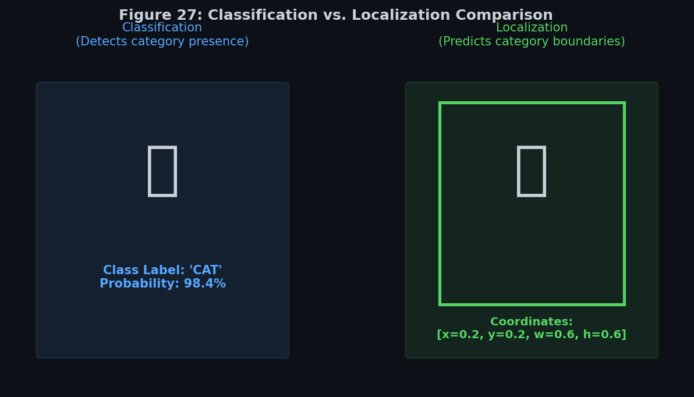
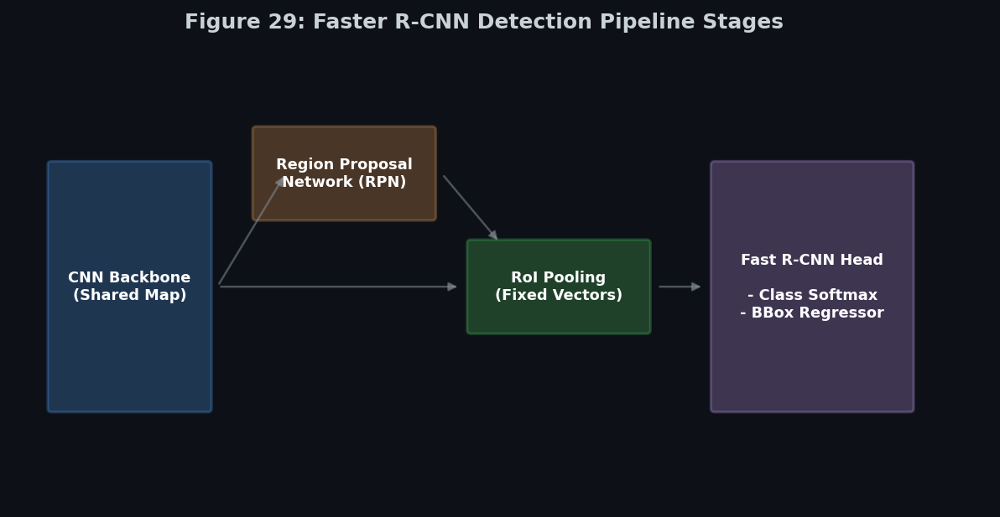
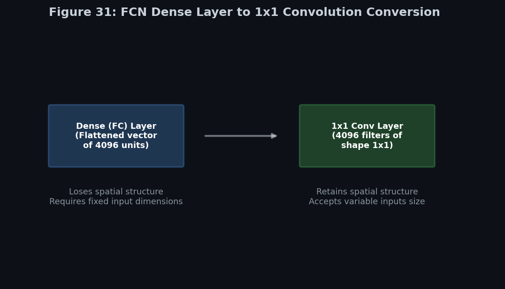
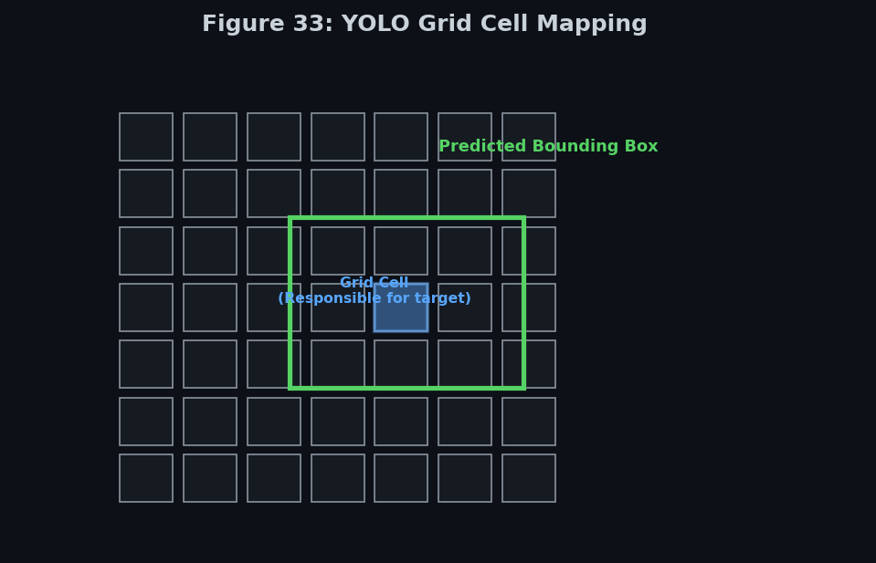
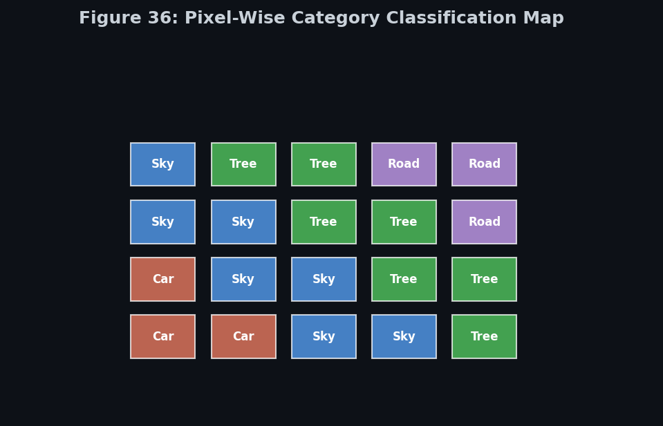
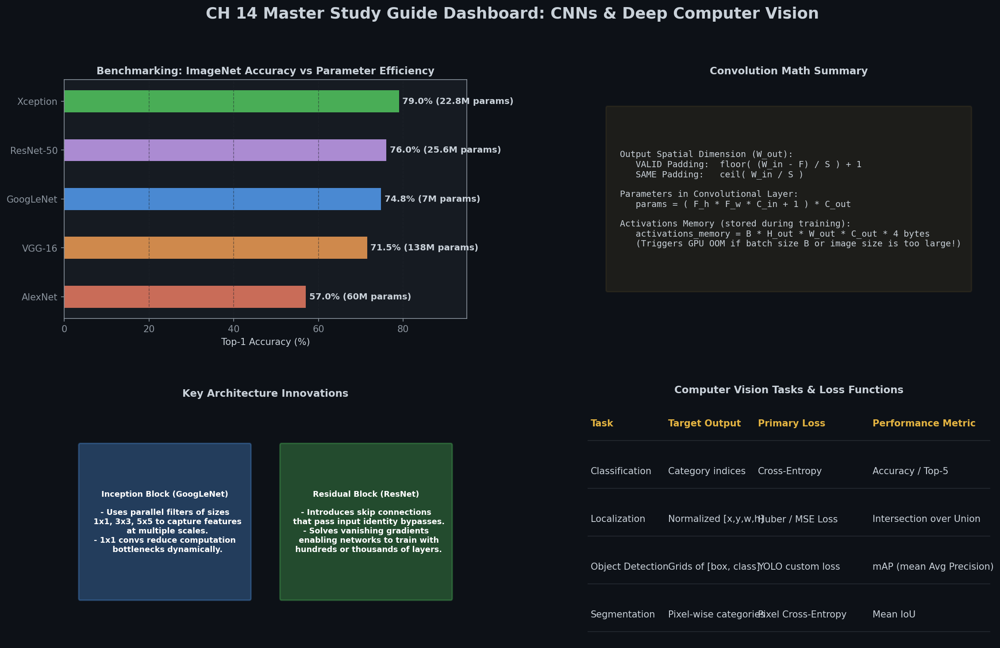

# 🎯 Module 5: Deep Computer Vision Tasks — Detection, Segmentation & Localization
> **Ch. 14 — Hands-On ML with Scikit-Learn, Keras & TensorFlow (Aurélien Géron)**

---

## 📌 Table of Contents
1. [Start Here: The Big Picture](#big-picture)
2. [Classification and Localization — Dual-Output Networks](#localization)
3. [Intersection over Union (IoU) — The Standard Metric](#iou)
4. [Non-Maximum Suppression (NMS)](#nms)
5. [Object Detection: Two-Stage vs One-Stage](#detection)
6. [Fully Convolutional Networks (FCN)](#fcn)
7. [YOLO — You Only Look Once](#yolo)
8. [Semantic Segmentation](#segmentation)
9. [Transposed Convolutions — The Math](#transposed)
10. [Dilated (Atrous) Convolutions](#dilated)
11. [U-Net and Skip Connections](#unet)
12. [Common Beginner Mistakes](#mistakes)
13. [Interview Q&A](#interview)
14. [⚡ One-Page Flash Card](#revision)

---

## 🌍 Start Here: The Big Picture {#big-picture}

> **TL;DR:** Four core computer vision tasks, in order of difficulty: (1) Classification (what is in the image?), (2) Localization (where is the one object?), (3) Object Detection (where are ALL the objects?), (4) Semantic Segmentation (what class is EACH PIXEL?).

**The 4 Vision Tasks:**

```
┌──────────────────────────────────────────────────────────────────────┐
│  INPUT IMAGE: A photo with a cat and two cars                         │
├──────────────────────────────────────────────────────────────────────┤
│  1. CLASSIFICATION:   Output: "Cat" (or "Car" — picks one)           │
│  2. LOCALIZATION:     Output: "Cat" + [x=0.3, y=0.2, w=0.4, h=0.5]  │
│  3. OBJECT DETECTION: Output: [Cat bbox], [Car1 bbox], [Car2 bbox]   │
│  4. SEMANTIC SEG:     Output: pixel map — each pixel → class label   │
└──────────────────────────────────────────────────────────────────────┘
```

**The Task Hierarchy:**

| Task | Output Type | Multiple Objects? | Per-Pixel? |
|------|-------------|------------------|-----------|
| Classification | Class label | ❌ | ❌ |
| Localization | Class + 1 bbox | ❌ | ❌ |
| Object Detection | N classes + N bboxes | ✅ | ❌ |
| Semantic Segmentation | Class per pixel | ✅ | ✅ |
| Instance Segmentation | Class + mask per object | ✅ | ✅ |

---

## 📦 Classification and Localization — Dual-Output Networks {#localization}


> 📊 **Graph 27:** The difference between classification (predicting the class) and localization (predicting both the class and a bounding box).

**The Task:** Given an image, predict: (1) the class of the object, AND (2) a bounding box around it.

**The Architecture — Two Output Heads:**

```python
# Shared backbone (feature extractor)
base_model = keras.applications.Xception(weights="imagenet", include_top=False,
                                          input_shape=[224, 224, 3])
avg = keras.layers.GlobalAveragePooling2D()(base_model.output)

# Head 1: Classification
class_output = keras.layers.Dense(n_classes, activation="softmax",
                                   name="class_output")(avg)

# Head 2: Localization (4 outputs: cx, cy, width, height — all normalized 0 to 1)
loc_output = keras.layers.Dense(4, name="loc_output")(avg)  # no activation = linear

# Multi-output model
model = keras.Model(inputs=base_model.input,
                    outputs=[class_output, loc_output])
```

**Bounding Box Convention:**
```
(cx, cy, width, height) — ALL values normalized between 0 and 1!
cx = center x / image width
cy = center y / image height
width = box width / image width
height = box height / image height

Example: object centered at (320, 240) in a 640×480 image, box is 100×80 pixels:
cx = 320/640 = 0.5
cy = 240/480 = 0.5
w  = 100/640 = 0.156
h  = 80/480  = 0.167
```

**Why normalize?** Scale-invariant training — the same network works for 224×224 and 1024×1024 inputs.

**Training the dual-head network:**
```python
model.compile(
    loss={
        "class_output": "sparse_categorical_crossentropy",   # classification head
        "loc_output": "mse"                                   # localization head
    },
    loss_weights={
        "class_output": 1.0,    # how much to weight each loss
        "loc_output": 100.0     # scale up — MSE of normalized coords is tiny!
    },
    optimizer=keras.optimizers.SGD(lr=0.01, momentum=0.9),
    metrics={"class_output": "accuracy"}
)

model.fit(X_train, {"class_output": y_class, "loc_output": y_bbox}, epochs=20)
```

> ⚠️ **The loss weight issue:** MSE on normalized coords (e.g., error = 0.05 → MSE = 0.0025) is TINY compared to cross-entropy (often 0.5-2.0). Without `loss_weights`, the model ignores localization! Multiply MSE loss by 100 to balance.

---

## 📏 Intersection over Union (IoU) — The Standard Metric {#iou}

**The central metric for object detection accuracy:**

$$\text{IoU} = \frac{\text{Area}(B_\text{pred} \cap B_\text{gt})}{\text{Area}(B_\text{pred} \cup B_\text{gt})}$$

```
                Ground Truth (GT):                  Predicted:
                ┌──────────┐                        ┌──────────┐
                │          │                    ┌───┤          │
                │    GT    │                    │Ovr│  Pred    │
                │          │                    └───┤          │
                └──────────┘                        └──────────┘

IoU = Overlap Area / (GT Area + Pred Area - Overlap Area)
```

**Interpretation:**
| IoU | Meaning |
|-----|---------|
| 1.0 | Perfect overlap |
| ≥ 0.5 | ✅ Correct detection (standard threshold) |
| < 0.5 | ❌ False detection (too little overlap) |
| 0.0 | No overlap at all |

**In code:**
```python
def compute_iou(box1, box2):
    """
    box = [cx, cy, w, h] normalized format
    Returns IoU value [0, 1]
    """
    # Convert cx,cy,w,h → x1,y1,x2,y2
    b1_x1 = box1[0] - box1[2]/2; b1_x2 = box1[0] + box1[2]/2
    b1_y1 = box1[1] - box1[3]/2; b1_y2 = box1[1] + box1[3]/2
    b2_x1 = box2[0] - box2[2]/2; b2_x2 = box2[0] + box2[2]/2
    b2_y1 = box2[1] - box2[3]/2; b2_y2 = box2[1] + box2[3]/2
    
    # Intersection
    ix1 = max(b1_x1, b2_x1); iy1 = max(b1_y1, b2_y1)
    ix2 = min(b1_x2, b2_x2); iy2 = min(b1_y2, b2_y2)
    inter = max(0, ix2 - ix1) * max(0, iy2 - iy1)
    
    # Union
    b1_area = box1[2] * box1[3]
    b2_area = box2[2] * box2[3]
    union = b1_area + b2_area - inter + 1e-10
    
    return inter / union
```

**Mean Average Precision (mAP):** The standard detection metric. For each class, compute Average Precision (area under Precision-Recall curve) at IoU threshold 0.5. mAP = mean across all classes.

---

## 🧹 Non-Maximum Suppression (NMS) {#nms}

**The Problem:** Object detectors predict HUNDREDS of bounding boxes. Multiple boxes may predict the same object with slight variations. NMS cleans this up.

**The NMS Algorithm:**

```
Input: List of (box, confidence_score) pairs, IoU threshold
Output: Cleaned list of final detections

1. Sort all boxes by confidence score (descending)
2. Take the highest-confidence box → add to final predictions
3. Calculate IoU of this box with ALL remaining boxes
4. Remove any box with IoU ≥ threshold (e.g., 0.5) ← they're duplicates!
5. Repeat from step 2 with remaining boxes
6. Stop when no boxes remain
```

**Why this works:** Two different boxes for the same object will have high IoU. NMS keeps the most confident one and discards the rest.

```
Before NMS:                     After NMS:
┌─────┐                         ┌─────┐
│ 0.9 │  (slightly different)   │ 0.9 │  ← kept (highest confidence)
│ 0.8 │  (same object!)         │     │  ← removed (IoU > 0.5 with kept)
│ 0.7 │  (same object!)         │     │  ← removed
│ 0.4 │  (different object!)    │ 0.4 │  ← kept (different position, low IoU)
└─────┘                         └─────┘
```

---

## 🔍 Object Detection: Two-Stage vs One-Stage {#detection}

### Two-Stage Detectors (R-CNN Family)


> 📊 **Graph 29:** Two-stage object detection pipeline. First, a Region Proposal Network (RPN) suggests candidate bounding boxes, which are then classified and refined.

**Faster R-CNN Architecture:**
```
Input Image
    ↓
Backbone CNN (VGG16/ResNet) → Feature Map (e.g., 14×14×512)
    ↓
Region Proposal Network (RPN): "Which regions might contain objects?"
  → Generates ~2000 "Region of Interest" (RoI) proposals
    ↓
RoI Pooling: Extracts fixed-size feature maps for each proposal (7×7×512)
    ↓
Classification Head → class probabilities for each RoI
Regression Head → refined bounding box coordinates
    ↓
Non-Max Suppression → final predictions
```

**Pros/Cons:**
- ✅ More accurate (especially for small objects)
- ❌ Slower (2 stages, not suitable for real-time)
- ~5 FPS on a GPU (Faster R-CNN)

### One-Stage Detectors (YOLO, SSD)

**Skip the proposal stage entirely → directly predict all boxes in one pass**

- ✅ Real-time speed (45-150 FPS)
- ❌ Slightly less accurate for very small/overlapping objects
- Used in autonomous vehicles, video surveillance

---

## 🌐 Fully Convolutional Networks (FCN) {#fcn}

**The Key Insight (Long et al., 2015):** Dense layers force a fixed input size. Replace them with 1×1 convolutions → variable-size input, spatial output!

**Dense Layer → 1×1 Convolution Conversion:**


> 📊 **Graph 31:** Converting dense layers to 1x1 convolutions allows networks to accept inputs of variable spatial dimensions and produce dense feature maps.

```
DENSE LAYER approach:
  Feature map: (7, 7, 512) → Flatten → 25,088-dim vector → Dense(4096)
  = 25,088 × 4096 = 102M parameters
  = Fixed input size! (7×7×512 must be fixed)

1×1 CONVOLUTION approach:
  Feature map: (7, 7, 512) → Conv2D(4096, 1×1) → (7, 7, 4096)
  = 1 × 1 × 512 × 4096 = 2M parameters
  = Variable input size! (7×7 can become 14×14 for larger input)
```

**The power of FCNs for segmentation:**
```
Large image (500×500) → pass through FCN

  Encoder: 500 → 250 → 125 → 62 → 31 (downsampling)
  Feature map at bottleneck: (31, 31, 512) — rich semantic features but coarse

  Decoder: 31 → 62 → 125 → 250 → 500 (upsampling)
  Final output: (500, 500, n_classes) — one class probability per pixel!
```

```python
# Simplified FCN for segmentation (encoder only shown)
model = keras.models.Sequential([
    keras.layers.Conv2D(64, 3, activation="relu", padding="same"),
    keras.layers.MaxPooling2D(2),
    keras.layers.Conv2D(128, 3, activation="relu", padding="same"),
    keras.layers.MaxPooling2D(2),
    # Replace Dense with 1×1 Conv (fully convolutional!)
    keras.layers.Conv2D(n_classes, 1, activation="softmax")
])
```

---

## ⚡ YOLO — You Only Look Once (Redmon et al., 2015) {#yolo}

**The Core Idea:** Divide the image into an S×S grid. Each grid cell predicts B bounding boxes AND C class probabilities simultaneously.

**The Output Tensor:**


> 📊 **Graph 33:** The YOLO grid system. The image is divided into an SxS grid, and each cell predicts bounding boxes and class probabilities for objects whose center falls inside it.

For S=7, B=2 bounding boxes, C=20 classes (PASCAL VOC):
$$\text{Output tensor shape: } 7 \times 7 \times (B \times 5 + C) = 7 \times 7 \times 30$$

Each cell predicts: `[cx, cy, w, h, conf]` for EACH of B boxes + `[P(class1), ..., P(classC)]`
- `cx, cy`: center x, y RELATIVE to the grid cell (0 to 1)
- `w, h`: width, height RELATIVE to the WHOLE IMAGE (0 to 1)
- `conf`: confidence = P(object) × IoU(predicted, ground truth)

**The Responsibility Rule:**
- An object's ground-truth center → determines WHICH grid cell is "responsible"
- That cell predicts the bounding box and class
- One grid cell can detect only ONE object (original YOLO limitation)

**The Loss Function (complex!):**

$$\mathcal{L} = \lambda_\text{coord} \sum_{i=0}^{S^2} \sum_{j=0}^{B} \mathbb{1}_{ij}^\text{obj} \left[(x_i - \hat{x}_i)^2 + (y_i - \hat{y}_i)^2\right]$$
$$+ \lambda_\text{coord} \sum_{i=0}^{S^2} \sum_{j=0}^{B} \mathbb{1}_{ij}^\text{obj} \left[(\sqrt{w_i} - \sqrt{\hat{w}_i})^2 + (\sqrt{h_i} - \sqrt{\hat{h}_i})^2\right]$$
$$+ \text{(confidence terms)} + \text{(class probability terms)}$$

**Why sqrt for w and h?** Large boxes need less precision than small boxes. Squaring errors in linear space over-penalizes large box misses. Taking sqrt brings them to comparable scale.

**YOLO vs Faster R-CNN:**

| | YOLO | Faster R-CNN |
|--|------|-------------|
| Stages | 1 (end-to-end) | 2 (RPN + detection) |
| Speed | 45-150 FPS | ~5 FPS |
| Accuracy (small objects) | Lower | Higher |
| Global context | ✅ Sees whole image | ❌ Only sees proposals |
| Use case | Real-time video | High-accuracy tasks |

---

## 🎨 Semantic Segmentation {#segmentation}

**The Task:** Assign a class label to EVERY pixel in the image.

**Output:** A 2D map of shape `(H, W, n_classes)` — one probability distribution per pixel.


> 📊 **Graph 36:** Semantic segmentation output. Every single pixel is classified into a category, creating a dense mask.

**Architecture:** Encoder-Decoder with skip connections:

```
Input: (224, 224, 3)
    │
ENCODER (downsampling):
    Conv+Pool → (112, 112, 64)
    Conv+Pool → (56, 56, 128)
    Conv+Pool → (28, 28, 256)
    Conv+Pool → (14, 14, 512) ← bottleneck (rich features, coarse spatial)
    │
DECODER (upsampling):
    TranspConv → (28, 28, 256) + skip from encoder(28,28,256) → concat
    TranspConv → (56, 56, 128) + skip from encoder(56,56,128) → concat
    TranspConv → (112, 112, 64) + skip from encoder(112,112,64) → concat
    Conv       → (224, 224, n_classes)
    │
Softmax per pixel → class probability maps
```

**Keras Implementation:**
```python
# Simple segmentation network
def build_segmentation_model(n_classes):
    inputs = keras.Input(shape=[None, None, 3])  # None = variable size (FCN)
    
    # Encoder
    x = keras.layers.Conv2D(64, 3, activation="relu", padding="same")(inputs)
    skip1 = x
    x = keras.layers.MaxPooling2D(2)(x)  # 112×112
    
    x = keras.layers.Conv2D(128, 3, activation="relu", padding="same")(x)
    skip2 = x
    x = keras.layers.MaxPooling2D(2)(x)  # 56×56
    
    # Bottleneck
    x = keras.layers.Conv2D(256, 3, activation="relu", padding="same")(x)
    
    # Decoder
    x = keras.layers.Conv2DTranspose(128, 2, strides=2)(x)  # 112×112
    x = keras.layers.Concatenate()([x, skip2])               # + skip connection
    x = keras.layers.Conv2D(128, 3, activation="relu", padding="same")(x)
    
    x = keras.layers.Conv2DTranspose(64, 2, strides=2)(x)   # 224×224
    x = keras.layers.Concatenate()([x, skip1])               # + skip connection
    x = keras.layers.Conv2D(64, 3, activation="relu", padding="same")(x)
    
    # Output: one channel per class, softmax per pixel
    outputs = keras.layers.Conv2D(n_classes, 1, activation="softmax")(x)
    
    return keras.Model(inputs=inputs, outputs=outputs)

model = build_segmentation_model(n_classes=21)  # e.g., 21 PASCAL VOC classes
model.compile(loss="sparse_categorical_crossentropy",
              optimizer="adam", metrics=["accuracy"])
```

---

## 🔄 Transposed Convolutions — The Math {#transposed}

**Regular convolution:** maps large spatial → smaller spatial (downsampling)
**Transposed convolution:** maps small spatial → larger spatial (upsampling)

**How it works:**

```
Input:  [a, b]    ← 1×2 feature map
Kernel: [1, 2, 1] ← 1D kernel of size 3, stride = 2 upsampling
        
Step 1: multiply each input by kernel:
        a × [1, 2, 1] = [a, 2a, a]
        b × [1, 2, 1] = [b, 2b, b]
        
Step 2: place with stride=2, add overlaps:
        [a, 2a, a, 0, 0]
        [0,  0, b, 2b, b]  ← shifted by 2
        ─────────────────
        [a, 2a, a+b, 2b, b]  ← output!
```

**Checkerboard artifacts:** Uneven overlaps from stride-2 transposed conv create a checkerboard pattern in output. Modern solution:

```python
# Option A: Transposed Convolution (may cause artifacts)
x = keras.layers.Conv2DTranspose(64, kernel_size=2, strides=2)(x)

# Option B (Better): Bilinear upsampling + Conv (no artifacts)
x = keras.layers.UpSampling2D(size=2, interpolation="bilinear")(x)
x = keras.layers.Conv2D(64, 3, padding="same", activation="relu")(x)
```

---

## 🔭 Dilated (Atrous) Convolutions {#dilated}

**The Idea:** Insert "holes" (zeros) between kernel elements to increase receptive field WITHOUT increasing parameters or losing resolution!

```
Standard 3×3 conv (rate=1):      Dilated 3×3 (rate=2):
■ ■ ■                             ■ _ ■ _ ■
■ ■ ■   → receptive field 3×3    _ _ _ _ _   → receptive field 5×5!
■ ■ ■                             ■ _ ■ _ ■
                                  _ _ _ _ _
                                  ■ _ ■ _ ■
```

Same number of parameters (9 weights), but sees a 5×5 area! With rate=4: sees 9×9 area with 9 weights!

```python
# Dilated convolutions in Keras
x = keras.layers.Conv2D(64, 3, dilation_rate=2, padding="same")(x)  # rate=2
x = keras.layers.Conv2D(64, 3, dilation_rate=4, padding="same")(x)  # rate=4

# Stacking with increasing dilation rates = exponentially growing receptive field!
# Common in segmentation: dilation rates [1, 2, 4, 8] → very large context
```

**DeepLab** architecture uses dilated convolutions heavily instead of pooling — maintains full resolution throughout the network while having a large receptive field.

---

## 🔗 U-Net and Skip Connections {#unet}

**U-Net** (Ronneberger et al., 2015) — the gold standard for biomedical image segmentation.

**Key innovations:**
1. **Symmetric encoder-decoder**: Exact mirror structure (left = encoder, right = decoder)
2. **Skip connections via CONCATENATION** (not addition like ResNet): preserves both high-level AND low-level features
3. **No pooling in bottleneck**: preserves maximum spatial information

**Why concatenation (not addition)?**
- Addition: requires same number of channels, merges features
- Concatenation: appends channels, PRESERVES both sets independently → decoder can choose which to use

**The U shape:**
```
Input (572×572)
  [Enc 1: 572→570→568] ──────────────────────────────→ [Dec 4: concat → conv]
    [Enc 2: 568→284→280] ─────────────────────────→ [Dec 3: concat → conv]
      [Enc 3: 280→140→136] ──────────────────────→ [Dec 2: concat → conv]
        [Enc 4: 136→68→64] ─────────────────────→ [Dec 1: concat → conv]
          [Bottleneck: 64→32→32] ← deepest features
                                  Output (388×388 × n_classes)
```

---

## ❌ Common Beginner Mistakes {#mistakes}

**1. Not scaling loss weights for multi-task learning** ❌
> Reality: MSE on normalized bounding box coordinates produces values like 0.001-0.01. Cross-entropy is typically 0.5-2.0. Without `loss_weights`, the model ignores the tiny MSE signal and only optimizes classification. Scale bbox loss by ~100x.

**2. Using transposed convolution without considering artifacts** ❌
> Reality: Transposed convolutions with stride=2 can create checkerboard artifacts in upsampled outputs (visible as periodic intensity patterns). Use `UpSampling2D(interpolation="bilinear")` followed by a regular conv as a cleaner alternative.

**3. Using standard pooling in segmentation (loses spatial info)** ❌
> Reality: MaxPooling halves spatial dimensions and discards WHERE the features were. In segmentation, you need to know exactly which pixel belongs to which class. Use dilated convolutions to grow receptive field without downsampling.

**4. Confusing semantic vs. instance segmentation** ❌
> Reality: Semantic segmentation labels every pixel with a class (all cars are "car" color). Instance segmentation goes further — it also distinguishes INDIVIDUAL objects (car 1 vs. car 2 get different colors). Mask R-CNN does instance segmentation; FCN/U-Net do semantic.

**5. Applying NMS across all classes together** ❌
> Reality: NMS must be applied INDEPENDENTLY per class. A high-confidence "cat" box should not suppress a high-confidence "car" box even if they overlap, because they're different objects.

---

## 🎤 Interview Q&A {#interview}

**Q1: What is IoU and how is it used in object detection?**
> **A:** Intersection over Union = Area(overlap) / Area(union) of two bounding boxes. Range [0,1]. Used in two ways: (1) During training, it determines which anchor boxes are "responsible" for predicting which ground-truth objects (typically IoU > 0.5 → positive anchor). (2) During evaluation, a predicted box is a "correct detection" if IoU with the closest ground-truth box ≥ 0.5.

**Q2: Explain how Non-Maximum Suppression (NMS) works.**
> **A:** NMS removes duplicate bounding boxes for the same object: (1) Sort all boxes by confidence score descending. (2) Keep the highest-confidence box. (3) Remove any remaining box with IoU ≥ threshold (0.5) with the kept box (they're duplicates). (4) Repeat. This ensures at most one box per object. Crucial for any detector that predicts hundreds of candidate boxes.

**Q3: What's the difference between transposed convolutions and standard upsampling?**
> **A:** Standard upsampling (bilinear/nearest-neighbor) enlarges feature maps by interpolation — fast, parameter-free, but can be blurry. Transposed (deconvolution): learned upsampling — the network learns the best way to expand. Parameters allow learning optimal upsampling. Downside: checkerboard artifacts at stride boundaries due to uneven kernel overlaps. Modern practice: replace transposed conv with bilinear upsampling + regular conv (clean + learned).

**Q4: Why does U-Net concatenate instead of add encoder features to decoder?**
> **A:** Addition requires same channel count and MERGES the two feature representations (early + late). Concatenation preserves both sets independently as separate channels — the decoder can learn to use them selectively. Since the encoder and decoder may have different numbers of channels and represent different levels of abstraction, concatenation is more flexible and preserves more information for the decoder to work with.

---

## ⚡ One-Page Flash Card {#revision}

```
╔══════════════════════════════════════════════════════════════════════╗
║     MODULE 5 — DEEP COMPUTER VISION TASKS FLASH CARD                  ║
╠══════════════════════════════════════════════════════════════════════╣
║                                                                        ║
║  TASK HIERARCHY:                                                       ║
║  Classification (1 label) < Localization (1 bbox) <                  ║
║  Detection (N bboxes) < Segmentation (per-pixel labels)               ║
║                                                                        ║
║  LOCALIZATION:                                                         ║
║  Two output heads: class head (softmax) + bbox head (linear, 4 units) ║
║  Bbox format: (cx, cy, w, h) — ALL normalized 0-1                    ║
║  Loss weights: class=1.0, bbox=100.0 (MSE is tiny without scaling!)  ║
║                                                                        ║
║  IoU = Overlap / Union  (≥0.5 = correct detection)                   ║
║  NMS: sort by conf → keep highest → remove IoU≥threshold → repeat    ║
║                                                                        ║
║  DETECTION ARCHITECTURES:                                              ║
║  Faster R-CNN: 2-stage (RPN→RoI Pooling→class+bbox) — accurate, slow ║
║  YOLO: 1-stage, S×S grid, output: S×S×(B×5+C) — fast, real-time    ║
║                                                                        ║
║  FCN: Dense layers → 1×1 convolutions = variable input size!         ║
║                                                                        ║
║  SEGMENTATION:                                                         ║
║  Encoder (downsample) → bottleneck → Decoder (upsample)              ║
║  Skip connections: CONCAT encoder→decoder (preserves spatial detail)  ║
║  Dilated conv (rate=r): receptive field grows by 2r-1 per side       ║
║  Transposed conv artifacts? → use UpSampling2D + Conv instead        ║
║                                                                        ║
╚══════════════════════════════════════════════════════════════════════╝
```

---

## 📈 Chapter 14 Summary Dashboard


> 📊 **Graph 24:** Comprehensive visual summary of all Chapter 14 concepts: CNN Architectures, Object Detection, Semantic Segmentation, and Advanced Techniques.

---

---

**🔗 Previous Module →** [04_Pretrained_Models_and_Transfer_Learning.md](04_Pretrained_Models_and_Transfer_Learning.md)  
**🔗 Chapter Complete! →** [Back to Chapter Index](../notes.md)
