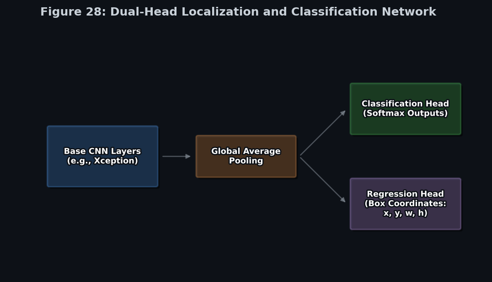
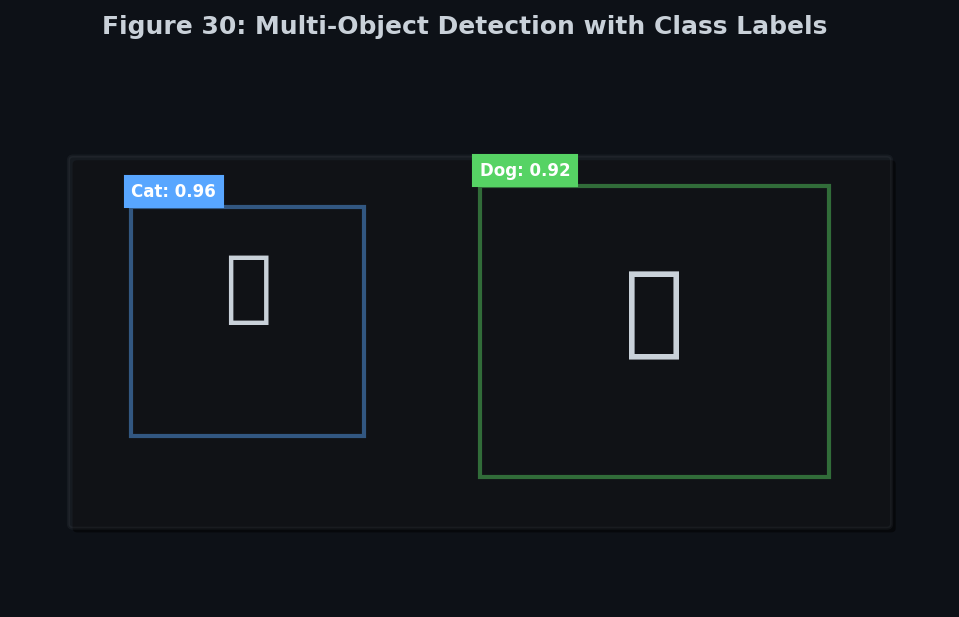
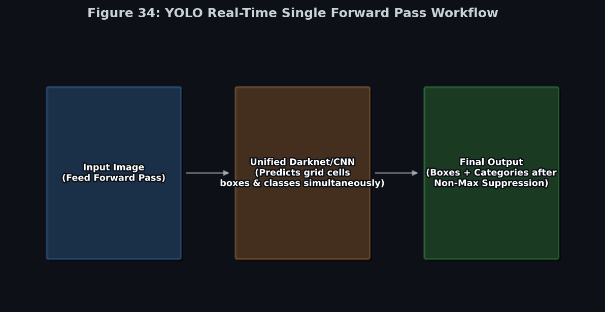
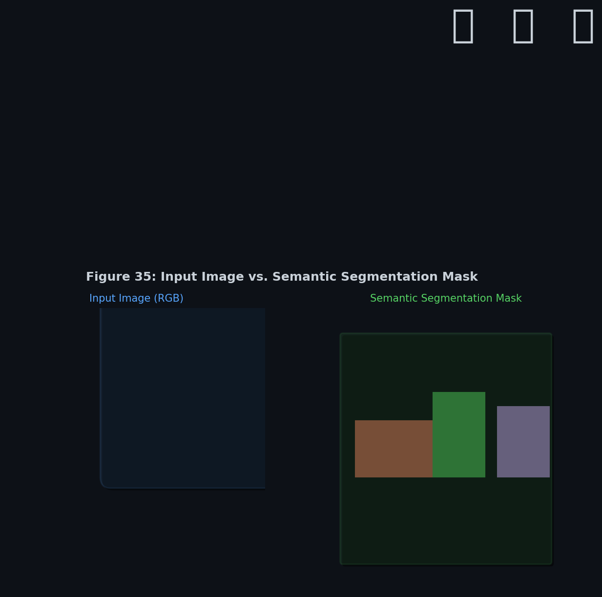
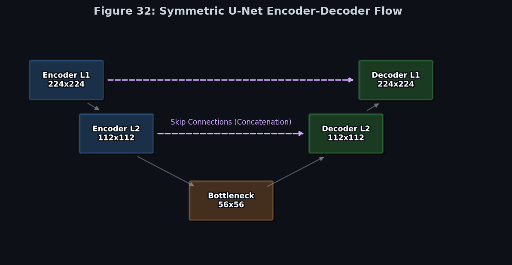

# Module 5: Deep Computer Vision Tasks
> **Ch. 14 — Hands-On ML with Scikit-Learn, Keras & TensorFlow (Aurélien Géron)**

---

## Table of Contents
1. [Start Here: The Big Picture](#big-picture)
2. [Classification vs. Localization](#localization)
3. [Object Detection & YOLO](#object-detection)
4. [Evaluation Metrics: IoU & COCO mAP](#metrics)
5. [Image Segmentation](#segmentation)
6. [Advanced Vision Tasks](#advanced-tasks)
7. [Vision Transformers & Foundation Models](#transformers-foundation)
8. [Real-World Deployment & Data](#deployment-data)
9. [Key Terms Dictionary](#terms)
10. [Common Beginner Mistakes & Best Practices](#mistakes)
11. [Interview Q&A (Top 5)](#interview)
12. [One-Page Flash Card](#revision)

---

## Start Here: The Big Picture {#big-picture}

> **Summary:** Previous modules focused on the foundational task of Image Classification ("What is this image?"). However, complex applications such as autonomous driving and robotics require precise spatial understanding ("Where exactly is it?") via Localization, multi-object recognition via Object Detection, and pixel-level classification via Semantic Segmentation.

**A Practical Analogy: Drone Operation**

Consider an automated drone conducting surveillance over a forested area.
*   **Classification**: The system identifies the presence of an object: *"Bear detected."* (Spatial location is unknown).
*   **Localization**: The system specifies exact coordinates: *"Bear detected, bounded within this coordinate region."*
*   **Object Detection**: The system identifies and bounds multiple distinct entities: *"Detected three bears, two wolves, and one human, each bounded by independent coordinate regions."*
*   **Semantic Segmentation**: The system classifies every individual pixel in the visual field: *"Pixels representing foliage are classified as class 'Tree', water as class 'Water', and the target as class 'Bear'."*

---

## Classification vs. Localization {#localization}

Predicting *what* is in an image constitutes **classification** (categorical output). Predicting *where* it is in the image constitutes **localization** (regression output).


**Figure 27:** The distinction between classification (yielding a class probability distribution) and localization (yielding regression coordinates).

To localize an object, the network is trained on a regression task to predict four bounding box parameters: $x$, $y$ (the center coordinates), and $h$, $w$ (the height and width of the bounding box).


**Figure 28:** A dual-head network architecture. The convolutional base feeds into a classification head (optimized via Cross-Entropy Loss) and a parallel regression head.

### Modern Bounding Box Loss Functions

Instead of relying solely on standard Mean Squared Error (MSE), modern detection architectures directly optimize bounding box overlap using specialized metric-based loss functions:
*   **Smooth L1 Loss**
*   **Generalized IoU (GIoU)**
*   **Distance IoU (DIoU)**
*   **Complete IoU (CIoU)**

These advanced loss functions heavily penalize predictions that fail to overlap with the ground truth, substantially improving localization precision compared to basic MSE.

---

## Object Detection & YOLO {#object-detection}

When an image contains multiple objects, predicting a single bounding box is insufficient. This necessitates **Object Detection**. Modern architectures are generally categorized into three paradigms:


**Figure 30:** Object detection identifies and localizes multiple independent entities simultaneously.

### 1. One-Stage Detectors (Real-Time)
Predict object classes and bounding box coordinates in a **single forward pass** through the network.
*   **Models:** YOLO (v1 to v11), SSD, RetinaNet, EfficientDet.
*   **Pros/Cons:** Optimized for real-time inference speed. Historically lower localization precision compared to two-stage methods, though the gap has narrowed significantly.
*   **Use Cases:** Autonomous driving, UAVs, real-time surveillance.

### 2. Two-Stage Detectors (High Accuracy)
First generate **candidate object regions** (Stage 1), then process and classify each individual region (Stage 2).
*   **Models:** Faster R-CNN, Mask R-CNN.
*   **Pros/Cons:** Yields higher detection accuracy and excels at detecting small objects. The two-stage pipeline results in higher computational overhead and slower inference.

### 3. Transformer-Based Detectors
Utilizes **Transformers** for end-to-end set prediction, bypassing the need for handcrafted anchor boxes and complex post-processing logic.
*   **Models:** DETR, RT-DETR.

### The YOLO Architecture (You Only Look Once)


**Figure 31:** YOLO architectures leverage Fully Convolutional Networks (FCNs) rather than dense layers to process inputs at extreme speeds.

YOLO partitions the input image into a uniform spatial grid (e.g., $13 \times 13$). For every cell within the grid, the network simultaneously predicts bounding boxes, an object confidence score, and conditional class probabilities.


**Figure 33:** The YOLO spatial grid approach. Each cell is responsible for detecting objects whose center falls within it.


**Figure 34:** The complete YOLO pipeline from spatial grid processing to Non-Max Suppression.

*   **Anchor Boxes**: YOLOv2 and later versions utilize K-Means clustering on the training dataset to identify standard bounding box dimensions (priors). The network is tasked with predicting minor scaling offsets to these anchors rather than arbitrary shapes.
*   **Non-Max Suppression (NMS)**: Because the grid approach generates multiple bounding boxes for a single object, NMS identifies the highest-confidence prediction and eliminates all highly overlapping redundant boxes.

**The Evolution of YOLO**
Modern YOLO iterations serve as the industry standard for real-time computer vision.
*   **YOLOv5 & YOLOv8**: Introduced production-friendly training pipelines, anchor-free detection mechanics, and native support for instance segmentation.
*   **YOLOv10 & YOLO11**: Implemented end-to-end NMS-free detection, achieving unparalleled performance metrics for edge deployment.

### Zero-Shot & Open-Vocabulary Detection

Traditional object detectors are strictly limited to the discrete classes present in their training data.
*   **Zero-Shot Detection (e.g., Grounding DINO)**: Detects novel, unseen object categories utilizing natural language prompts (Prompt: `"Locate bicycles."` → Outputs bounding boxes for bicycles).
*   **Open-Vocabulary**: Demonstrates the capability to parse and detect complex, arbitrary descriptions (e.g., `"Locate red sports cars with broken windows."`) without requiring dataset retraining.

---

## Evaluation Metrics: IoU & COCO mAP {#metrics}

Evaluating bounding box precision requires specialized metrics that account for spatial overlap.

### Intersection over Union (IoU)
IoU calculates the area of intersection between the predicted bounding box and the ground truth box, divided by the area of their union. An IoU of 1.0 represents perfect alignment. A detection is typically classified as a True Positive if IoU $> 0.5$.

### Mean Average Precision (mAP)
For a specific class, the Average Precision (AP) represents the area under the Precision-Recall curve. The **mAP** is the average of these AP scores across all classes evaluated.

### Modern COCO Evaluation Metrics
Contemporary benchmarks rarely rely on a singular `mAP@0.5` metric. The standard **COCO evaluation protocol** averages performance across multiple, increasingly strict IoU thresholds to yield a more rigorous evaluation:
*   **mAP@[0.5:0.95]**: The primary COCO metric (the average mAP calculated across IoU thresholds from 0.50 to 0.95 in 0.05 increments).
*   **AP50 / AP75**: mAP calculated at strict 0.50 and 0.75 IoU thresholds.
*   **APS / APM / APL**: Granular metrics calculated explicitly for Small, Medium, and Large objects based on pixel area.

---

## Image Segmentation {#segmentation}

While bounding boxes are computationally efficient, they inherently capture irrelevant background pixels. **Segmentation** addresses this by classifying the image precisely at the pixel level.

### 1. Semantic Segmentation
Groups all pixels belonging to the same semantic class into a single contiguous mask (e.g., all vehicle pixels share a single class label, regardless of the individual vehicle).


**Figure 35:** Semantic segmentation groups specific object classes into cohesive pixel masks. 


**Figure 36:** Each pixel is individually classified through a spatial map.

**The U-Net Approach:**
Deep CNNs aggressively downsample spatial dimensions to extract robust semantic features. The U-Net architecture resolves the resulting loss of spatial resolution via:
1.  **Transposed Convolutions**: Upsampling the low-resolution feature maps back toward the original image dimensions.
2.  **Skip Connections**: Bypassing the bottleneck by wiring high-resolution spatial feature maps from the early encoder layers directly into the corresponding decoder layers, enabling the reconstruction of precise pixel boundaries.


**Figure 32:** The symmetric U-Net architecture featuring contracting and expansive paths linked by skip connections.

### 2. Instance Segmentation
Extends object detection by generating an independent **pixel mask** for every distinct object detected in the scene (e.g., Vehicle A and Vehicle B receive independent masks despite sharing the same class).
*   **Popular Models**: Mask R-CNN, YOLOv8-Seg.

### 3. Panoptic Segmentation
The most comprehensive form of segmentation. It unifies Semantic and Instance segmentation by ensuring every pixel receives a semantic category label (e.g., Road, Sky) AND a unique instance identifier for countable foreground objects.

### Segment Anything Model (SAM)
SAM is a prompt-driven foundation model for segmentation. It accepts diverse inputs (e.g., an image combined with point clicks or bounding box coordinates) and generates pixel-perfect masks of the targeted object zero-shot. It is widely utilized for automated dataset annotation.

### Modern Architectures
In addition to U-Net, the modern segmentation landscape relies heavily on architectures such as **DeepLabV3+**, **Mask2Former**, and **SegFormer**.

---

## Advanced Vision Tasks {#advanced-tasks}

*   **Multi-Object Tracking (MOT)**: Tracks unique objects across sequential video frames, maintaining persistent IDs (e.g., DeepSORT, ByteTrack). Critical for traffic analysis and surveillance.
*   **3D Object Detection**: Predicts three-dimensional bounding boxes utilizing sensory data from LiDAR, Radar, or calibrated RGB cameras (e.g., PointPillars). Fundamental to autonomous vehicle navigation.
*   **OCR (Scene Text Detection)**: Extracts text from complex natural images, requiring a pipeline of both Text Detection and Text Recognition (e.g., PaddleOCR).

---

## Vision Transformers & Foundation Models {#transformers-foundation}

The dominance of purely convolutional networks is actively being challenged by attention-based architectures.

### Vision Transformers (ViT)
Transformer architectures, originally designed for NLP, have been successfully adapted for vision. Models such as **ViT**, **Swin Transformer**, and **DeiT** process images as a sequence of patches, frequently achieving state-of-the-art results on large-scale datasets.

### Foundation Models
Massive models pretrained on billions of images—frequently paired with extensive text corpora—that generalize to novel vision tasks with robust zero-shot capabilities.
*   **CLIP**: Learns a shared, multimodal embedding space bridging visual and textual features.
*   **DINOv2**: Generates highly robust self-supervised visual features without manual annotations.

---

## Real-World Deployment & Data {#deployment-data}

### Edge AI Deployments
Executing models on resource-constrained hardware (e.g., Raspberry Pi, embedded controllers, mobile devices) necessitates highly optimized architectures. **YOLOv11n** (Nano), **MobileNet**, and **EfficientDet-Lite** serve as standard solutions for Edge AI.

### Common Detection Challenges
*   **Occlusion, Small Objects, Motion Blur, Low Illumination**
*   **Solutions**: Employing multi-scale training, integrating advanced backbone architectures, and utilizing **Focal Loss** (a loss function that dynamically scales cross-entropy to focus gradients on hard-to-detect objects rather than overwhelming the network with easy background examples).

### Advanced Data Augmentation
To ensure model robustness, modern detection pipelines rely on compositional augmentations:
*   **Mosaic**: Aggregates four distinct images into a single training composite.
*   **MixUp & CutMix**: Mathematically interpolates images and their corresponding bounding box coordinates to encourage generalized feature learning.

### Annotation Formats
*   **COCO JSON**: The comprehensive standard for complex datasets.
*   **YOLO TXT**: A highly lightweight flat-file format representing bounding boxes as normalized coordinates (`class, x_center, y_center, width, height`).
*   **Pascal VOC XML**: An established, older XML-based format.

---

## Key Terms Dictionary {#terms}

| Term | Professional Definition |
|------|--------------------|
| **Localization** | The regression task of predicting bounding box coordinates (x, y, h, w) for a single object. |
| **Object Detection** | The dual task of locating and classifying multiple distinct objects simultaneously. |
| **YOLO** | A highly optimized, grid-based, one-stage object detection architecture. |
| **Non-Max Suppression** | An algorithmic post-processing step required to eliminate redundant, overlapping bounding box predictions. |
| **IoU** | The primary spatial accuracy metric, defined as the Area of Intersection divided by the Area of Union. |
| **COCO mAP** | The industry standard detection benchmark evaluating precision across multiple stringent IoU thresholds. |
| **Semantic Segmentation** | Categorizing the image at the pixel level by grouping identical classes into contiguous masks. |
| **Instance Segmentation** | Generating independent pixel masks for every distinct object in the scene. |
| **Panoptic Segmentation** | The unification of semantic and instance segmentation across the entire image. |
| **Vision Transformer (ViT)**| An attention-based architecture adapted to process image patches. |
| **Segment Anything (SAM)**| A prompt-based foundation model capable of zero-shot image segmentation. |
| **Open-Vocabulary** | The capacity of a model to detect arbitrary objects using unconstrained natural language prompts. |

---

## Common Beginner Mistakes & Best Practices {#mistakes}

### Methodological Errors to Avoid
1. **Misapplying Evaluation Metrics:** Relying on MSE or CIoU to evaluate a detector. These are strictly used for loss optimization during training; true evaluation must be conducted using **mAP** and **IoU**.
2. **Conflating Segmentation Types:** Assuming Semantic and Instance segmentation are identical. Semantic segmentation merges objects of the same class; Instance segmentation isolates them.
3. **Misinterpreting Transposed Convolutions:** Referring to transposed convolutions mathematically as "deconvolutions." A transposed convolution expands spatial dimensions by inserting padding and applying a standard convolution, it does not reverse the convolution matrix.

### Modern Best Practices Checklist
- [x] Standardize on modern YOLO iterations (**YOLOv8–YOLO11**) for real-time detection requirements.
- [x] Evaluate Transformer-based detectors (**DETR**, RT-DETR) for complex end-to-end detection tasks.
- [x] Integrate foundation models (**CLIP**, **SAM**) when zero-shot or open-vocabulary capabilities are necessary.
- [x] Strictly report evaluation metrics using the **COCO mAP@[0.5:0.95]** protocol.
- [x] Ensure training pipelines incorporate advanced compositional augmentations (**Mosaic, MixUp, CutMix**).
- [x] Optimize bounding box regression utilizing **CIoU / GIoU loss functions** rather than standard MSE.
- [x] Deploy specifically designed lightweight architectures (**YOLO11n, MobileNet**) for Edge AI and mobile environments.

---

## Interview Q&A (Top 5) {#interview}

**Q1: Detail the fundamental difference between One-Stage and Two-Stage Object Detectors.**
> **A:** Two-stage detectors (e.g., Faster R-CNN) utilize a discrete Region Proposal Network to isolate candidate regions before passing them to a classification head, yielding high precision at the cost of computational speed. One-stage detectors (e.g., YOLO) compute bounding boxes and class probabilities simultaneously across a dense grid in a single forward pass, heavily optimizing for real-time inference.

**Q2: What is the architectural purpose of Anchor Boxes in YOLO?**
> **A:** Rather than predicting arbitrary bounding box dimensions from a random initialization, YOLO utilizes K-Means clustering on the training distribution to establish standard bounding box dimensions (priors). The regression head is then tasked with predicting minor scaling and translation offsets relative to these anchors, leading to significantly faster and more stable convergence.

**Q3: Describe the mechanics of Non-Max Suppression (NMS).**
> **A:** NMS is a crucial post-processing algorithm used to filter redundant predictions. It functions by: (1) Discarding all bounding boxes below a predefined confidence threshold. (2) Selecting the box with the highest remaining confidence. (3) Computing the IoU between the selected box and all remaining boxes, discarding any that exceed a certain overlap threshold. (4) Iterating this process until only discrete, independent boxes remain.

**Q4: Why are Skip Connections critical for U-Net and similar segmentation architectures?**
> **A:** Deep Convolutional Neural Networks aggressively downsample spatial feature maps via pooling and strided convolutions to extract high-level semantic representations (identifying "what" an object is), which inherently destroys high-frequency spatial details (identifying "where" the object boundaries are). Skip connections wire these high-resolution spatial features directly from the encoder stages into the upsampled decoder stages, providing the necessary spatial context to reconstruct exact pixel boundaries.

**Q5: Articulate the distinction between Semantic, Instance, and Panoptic Segmentation.**
> **A:** Semantic segmentation assigns a class label to every pixel, aggregating all objects of a specific class into a uniform mask (e.g., all individual vehicles are masked as a single "vehicle" entity). Instance segmentation isolates countable objects, generating a unique, independent mask for each one (e.g., Vehicle A and Vehicle B are distinct). Panoptic segmentation unifies these approaches, parsing the entire scene by applying semantic labels to uncountable background structures (sky, road) while simultaneously isolating foreground entities with instance-specific IDs.

---

## One-Page Flash Card {#revision}

```
╔══════════════════════════════════════════════════════════════════╗
║                MODULE 5 — MODERN VISION TASKS                    ║
╠══════════════════════════════════════════════════════════════════╣
║                                                                  ║
║  1. DETECTION PARADIGMS:                                         ║
║  - One-Stage (YOLOv11, SSD): Single pass, optimized for speed.   ║
║  - Two-Stage (Faster R-CNN): Region proposal, high precision.    ║
║  - Transformers (DETR): End-to-end, anchor-free, NMS-free.       ║
║                                                                  ║
║  2. OBJECT DETECTION (YOLO & LOSSES):                            ║
║  - Computes spatial offsets to Anchor Boxes across a grid.       ║
║  - Employs Non-Max Suppression (NMS) to eliminate redundancy.    ║
║  - Optimized via CIoU/GIoU metrics to improve localization.      ║
║                                                                  ║
║  3. METRICS (COCO STANDARD):                                     ║
║  - IoU = Area of Intersection / Area of Union.                   ║
║  - Standard evaluation requires COCO mAP@[0.5:0.95].             ║
║                                                                  ║
║  4. IMAGE SEGMENTATION:                                          ║
║  - Semantic: Pixel-level class assignment (U-Net, DeepLab).      ║
║  - Instance: Independent masks per object (Mask R-CNN, YOLO).    ║
║  - Panoptic: Semantic + Instance unification across the scene.   ║
║  - SAM (Segment Anything): Prompt-driven zero-shot generation.   ║
║                                                                  ║
║  5. MODERN ARCHITECTURAL TRENDS:                                 ║
║  - Vision Transformers (ViT) outperforming standard CNNs.        ║
║  - Foundation Models (CLIP) enabling Open-Vocabulary detection.  ║
║  - Edge AI: YOLO11n deployed on resource-constrained hardware.   ║
╚══════════════════════════════════════════════════════════════════╝
```

---

**Previous Module →** [04_Pretrained_Models_and_Transfer_Learning.md](04_Pretrained_Models_and_Transfer_Learning.md)  
**Return to Index →** [notes.md](../notes.md)
