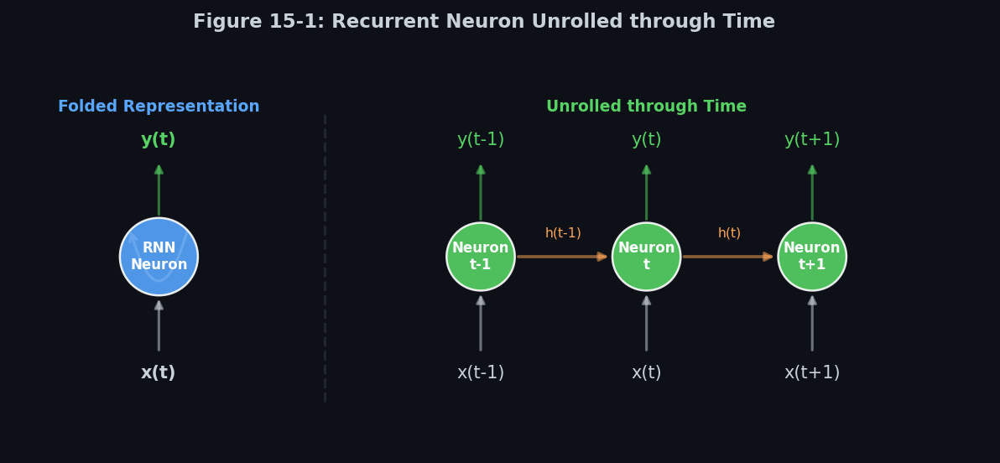
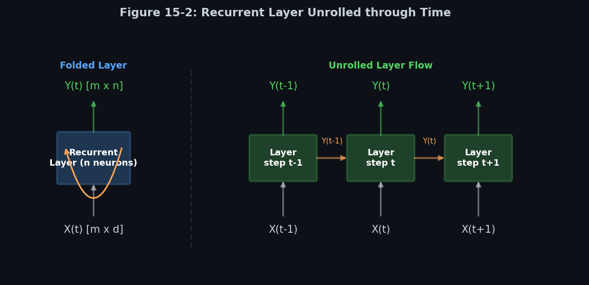
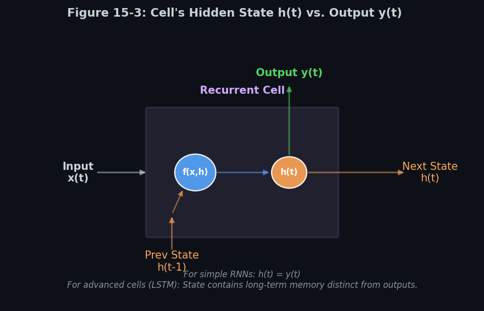
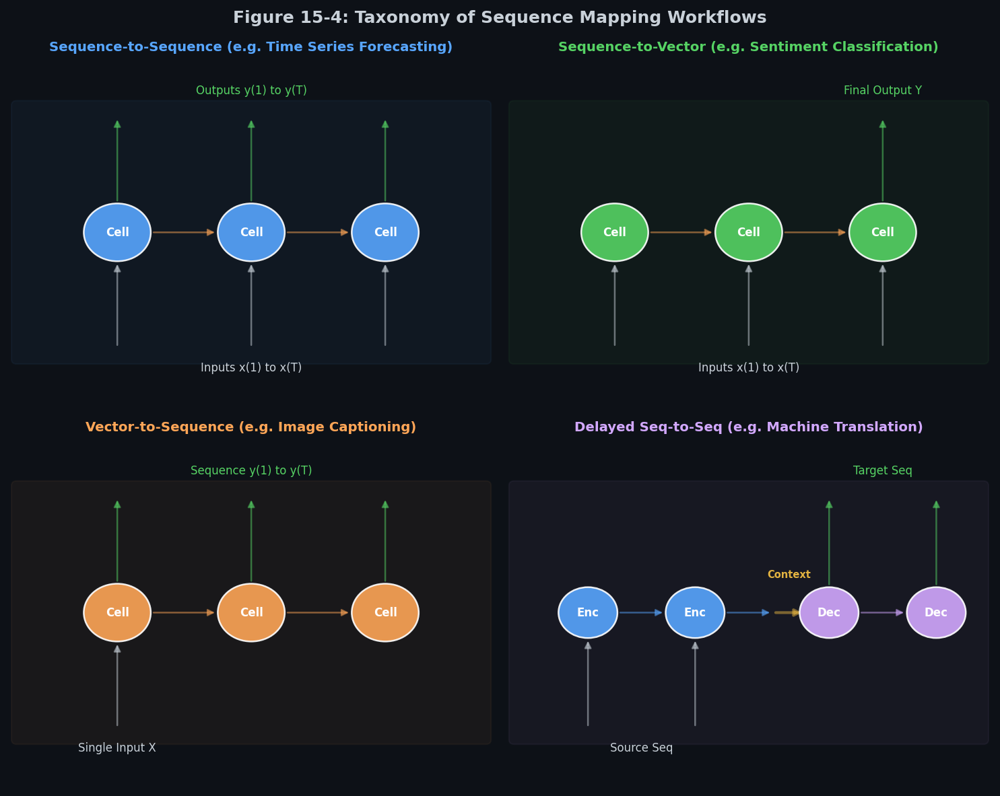

# 🧠 Module 1: Recurrent Neurons and Input/Output Sequences
> **Ch. 15 — Hands-On ML with Scikit-Learn, Keras & TensorFlow (Aurélien Géron)**

---

## 📌 Table of Contents
1. [Start Here: The Big Picture](#big-picture)
2. [Feedforward vs. Recurrent Neurons: A Structural Comparison](#comparison)
3. [Recurrent Neurons & Unrolling Through Time](#neurons-unrolling)
4. [The Mathematics of Recurrent Layers (Equations 15-1 & 15-2)](#recurrent-math)
5. [Memory Cells & Hidden States](#memory-cells)
6. [Taxonomy of Sequence-to-Sequence Workflows](#taxonomy)
7. [Common Beginner Mistakes](#mistakes)
8. [Interview Q&A](#interview)
9. [⚡ One-Page Flash Card](#revision)

---

## 🌍 Start Here: The Big Picture {#big-picture}

> **TL;DR:** Unlike standard feedforward neural networks that process inputs in a single forward pass, Recurrent Neural Networks (RNNs) maintain an internal state (memory) that flows horizontally across time. This allows them to read, process, and generate sequences of arbitrary length by reusing the same weight matrices at every temporal step.

**The Real-World Analogy 🍕:**
Imagine you are reading a mystery novel. A standard feedforward network reads each word in isolation, completely forgetting the previous word by the time it reaches the next. In contrast, an RNN reads a word, updates its mental summary of the plot (the hidden state), and uses that summary to interpret the next word. Without this temporal connection, it would be impossible to understand a sentence, let alone solve the mystery!

---

## 🏗️ Feedforward vs. Recurrent Neurons: A Structural Comparison {#comparison}

| Feature | Feedforward Neurons (FNN) | Recurrent Neurons (RNN) |
| :--- | :--- | :--- |
| **Data Flow** | Acyclic (Strictly forward from layer to layer). | Cyclic (Outputs feed back as input at next step). |
| **Temporal Handling** | Static (Processes inputs of fixed size). | Dynamic (Processes sequences of variable length). |
| **Weight Application** | Unique weights per layer. | Shared weights across all time steps. |
| **Memory** | None (Activation depends only on current input). | State-dependent (Activation depends on history). |

---

## 🔍 1. Recurrent Neurons & Unrolling Through Time {#neurons-unrolling}

A recurrent neuron looks very much like a conventional neuron, except that its output is sent back into itself as an additional input at the next time step.

### Unrolling the Graph
To visualize how an RNN operates, we can "unroll" it through time. This involves replicating the neuron for each time step, showing the sequential flow of inputs, outputs, and internal state.


> 📊 **Graph 01:** Folded representation showing the feedback loop (left) and the unrolled network over three consecutive time steps (right).

* **Temporal Re-use**: The weights of the recurrent neuron are shared across all time steps. The network does not learn different weights for $t=1$ and $t=2$; rather, the same function is applied repeatedly.
* **Input-to-Output Flow**: At time step $t$, the neuron receives the input vector $x_{(t)}$ and its own output from the previous time step $y_{(t-1)}$.
* **Initial State Initialization**: At $t=0$, there is no previous output $y_{(-1)}$. By default, standard frameworks initialize $y_{(-1)} = \mathbf{0}$.

---

## 🔍 2. The Mathematics of Recurrent Layers {#recurrent-math}

A recurrent layer consists of a set of recurrent neurons. At each time step $t$, every neuron receives both the input vector $\mathbf{x}_{(t)}$ and the output vector from the previous step $\mathbf{y}_{(t-1)}$.


> 📊 **Graph 02:** Unrolling a layer of recurrent neurons. The layer takes a mini-batch of inputs $X_{(t)}$ and outputs a batch of states $Y_{(t)}$.

### Single Instance Equation (Equation 15-1)
For a single instance, the output vector $\mathbf{y}_{(t)}$ of a recurrent layer at time step $t$ is calculated as:

$$\mathbf{y}_{(t)} = \phi\left( \mathbf{W}_x^T \mathbf{x}_{(t)} + \mathbf{W}_y^T \mathbf{y}_{(t-1)} + \mathbf{b} \right)$$

### Mini-Batch Equation (Equation 15-2)
For a mini-batch of instances, we can compute the layer's output in one shot:

$$\mathbf{Y}_{(t)} = \phi\left( \mathbf{X}_{(t)} \mathbf{W}_x + \mathbf{Y}_{(t-1)} \mathbf{W}_y + \mathbf{b} \right) = \phi\left( \left[ \mathbf{X}_{(t)} \quad \mathbf{Y}_{(t-1)} \right] \mathbf{W} + \mathbf{b} \right) \quad \text{with} \quad \mathbf{W} = \begin{bmatrix} \mathbf{W}_x \\ \mathbf{W}_y \end{bmatrix}$$

### Structural Shape and Dimensionality Table:
Let $m$ be the batch size, $d$ be the input feature dimension, and $n$ be the number of neurons in the recurrent layer.

| Term | Dimensions | Description |
| :--- | :--- | :--- |
| $\mathbf{X}_{(t)}$ | $m \times d$ | Input matrix at step $t$ ($m$ instances, $d$ input features). |
| $\mathbf{Y}_{(t)}$ | $m \times n$ | Output matrix at step $t$ ($m$ instances, $n$ neurons). |
| $\mathbf{Y}_{(t-1)}$ | $m \times n$ | Output matrix of the layer at the previous step $t-1$. |
| $\mathbf{W}_x$ | $d \times n$ | Weight matrix for connection to the inputs. |
| $\mathbf{W}_y$ | $n \times n$ | Weight matrix for connection to previous outputs. |
| $\mathbf{b}$ | $1 \times n$ | Bias vector, broadcasted across the batch dimension. |
| $\left[ \mathbf{X}_{(t)} \quad \mathbf{Y}_{(t-1)} \right]$ | $m \times (d + n)$ | Concatenated input and previous output matrices. |
| $\mathbf{W}$ | $(d + n) \times n$ | Concatenated weight matrix stacking $\mathbf{W}_x$ and $\mathbf{W}_y$. |

---

## 🔍 3. Memory Cells & Hidden States {#memory-cells}

Because the output of a recurrent neuron at step $t$ depends on its inputs from previous steps, it preserves a form of memory. Any part of a network that preserves state across time steps is called a **Memory Cell**.


> 📊 **Graph 03:** Inside the recurrent cell: separating the state transmission channel $h_{(t)}$ from the output prediction channel $y_{(t)}$.

### Hidden State Formula
A cell's hidden state $\mathbf{h}_{(t)}$ is a function of its current input and its previous state:

$$\mathbf{h}_{(t)} = f\left(\mathbf{x}_{(t)}, \mathbf{h}_{(t-1)}\right)$$

* **Simple RNN**: The hidden state is identical to the output vector: $\mathbf{h}_{(t)} = \mathbf{y}_{(t)}$.
* **Advanced RNN Cells (LSTM, GRU)**: The cell maintains a separate long-term state $\mathbf{C}_{(t)}$ that flows down a dedicated channel, distinct from the short-term state $\mathbf{h}_{(t)}$ used for the step-by-step prediction outputs.

---

## 🔍 4. Taxonomy of Sequence-to-Sequence Workflows {#taxonomy}

RNNs are highly flexible and can handle different configurations of input and output lengths.


> 📊 **Graph 04:** The four primary sequence mapping architectures.

### 1. Sequence-to-Sequence (Seq-to-Seq) 🔗
* **Mechanic**: Accepts a sequence of inputs and produces a sequence of outputs at every step.
* **Concrete Example**: Predict stock prices over time. Given prices from days 1 to $N$, output predictions for days 2 to $N+1$.
* **Shape Relation**: Inputs `[batch, steps, features]` $\rightarrow$ Outputs `[batch, steps, outputs]`.

### 2. Sequence-to-Vector (Seq-to-Vec) 🎯
* **Mechanic**: Accepts a sequence of inputs but ignores all outputs except the final step.
* **Concrete Example**: Sentiment analysis on reviews. Feed the model a sequence of words, and output a single score (positive vs. negative).
* **Shape Relation**: Inputs `[batch, steps, features]` $\rightarrow$ Output `[batch, outputs]`.

### 3. Vector-to-Sequence (Vec-to-Seq) 🖼️
* **Mechanic**: Accepts a single static input and outputs a sequence.
* **Concrete Example**: Image captioning. Feed the model an image feature vector, and output a sequence of text words.
* **Shape Relation**: Input `[batch, features]` $\rightarrow$ Outputs `[batch, steps, outputs]`.

### 4. Delayed Sequence-to-Sequence (Encoder-Decoder / Seq-to-Vec-to-Seq) 🌐
* **Mechanic**: A Seq-to-Vec network (Encoder) reads the input sequence and creates a final context vector, which a Vec-to-Seq network (Decoder) then translates into an output sequence.
* **Concrete Example**: Machine Translation. Read an entire French sentence before generating its English translation (as word-by-word translation lacks context).
* **Shape Relation**: Source `[batch, steps_in, features]` $\rightarrow$ Context `[batch, bottleneck]` $\rightarrow$ Target `[batch, steps_out, outputs]`.

---

## ❌ Common Beginner Mistakes {#mistakes}

**1. Treating sequence inputs as flat 2D arrays** ❌
> **Why it fails:** Standard dense layers expect 2D inputs `[batch_size, features]`. Keras recurrent layers (`SimpleRNN`, `LSTM`, `GRU`) require 3D arrays of shape `[batch_size, time_steps, dimensionality]`.
> **The Fix:** Ensure your input dataset is reshaped to include the time dimension, even if the feature dimension is 1:
```python
# If inputs are shape (1000, 50), add the feature dimension:
X_train = X_train[..., np.newaxis] # shape becomes (1000, 50, 1)
```

---

## 🎤 Interview Q&A {#interview}

**Q1: Why do we share the same weight matrices $\mathbf{W}_x$ and $\mathbf{W}_y$ across all time steps?**
> **A:** Sharing weights is the core constraint that gives RNNs their strength. It provides two critical benefits:
> 1. **Temporal Invariance**: The model can recognize a pattern regardless of when it occurs in the sequence (similar to spatial translational invariance in CNNs via shared kernels).
> 2. **Parameter Efficiency**: The number of parameters remains constant regardless of the sequence length. If weights were not shared, a sequence of length 1000 would require 1000 times more parameters, leading to massive overfitting.

**Q2: What is the fundamental difference between a Feedforward Neural Network (FNN) and a Recurrent Neural Network (RNN) in terms of computational graphs?**
> **A:** FNNs represent Directed Acyclic Graphs (DAGs) where information flows strictly in one direction from input to output. RNNs introduce cycles, transforming the network into a cyclic graph. By unrolling the RNN through time, we map the cyclic graph onto an equivalent acyclic graph of length $T$, allowing backpropagation to compute gradients.

---

## ⚡ One-Page Flash Card {#revision}

```
╔══════════════════════════════════════════════════════════════════╗
║             MODULE 1 — RECURRENT NEURONS & TAXONOMY               ║
╠══════════════════════════════════════════════════════════════════╣
║                                                                  ║
║  KEY EQUATIONS:                                                  ║
║  - Output: Y(t) = tanh(X(t)*Wx + Y(t-1)*Wy + b)                  ║
║  - Concatenated weights: W = [Wx; Wy]                            ║
║                                                                  ║
║  INPUT FORMAT (CRITICAL):                                        ║
║  - Shape must be 3D: [Batch Size, Time Steps, Features]          ║
║                                                                  ║
║  SEQUENCE ARCHITECTURES:                                         ║
║  - Seq-to-Seq: Inputs & Outputs at all steps (Forecasting)       ║
║  - Seq-to-Vec: Outputs only at last step (Classification)        ║
║  - Vec-to-Seq: Input only at first step (Captioning)             ║
║  - Encoder-Decoder: Translate sequence to vector, then decoder   ║
║                                                                  ║
║  KEY TAKEAWAY:                                                   ║
║  - Temporal weight sharing provides sequence-length flexibility  ║
║    and translational invariance in time.                         ║
║                                                                  ║
╚══════════════════════════════════════════════════════════════════╝
```

---

---

**🔗 Previous Module →** [Back to Chapter Index](../notes.md)  
**🔗 Next Module →** [02_Forecasting_Time_Series_and_Deep_RNNs.md](02_Forecasting_Time_Series_and_Deep_RNNs.md)
