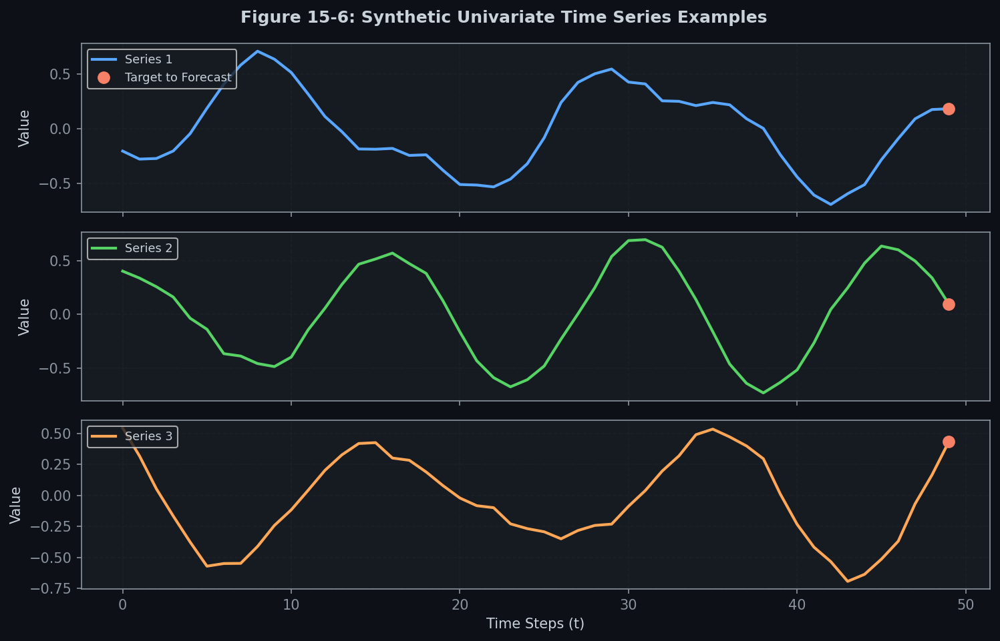
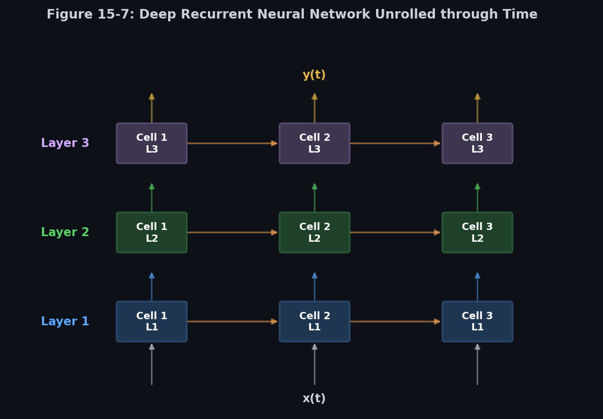
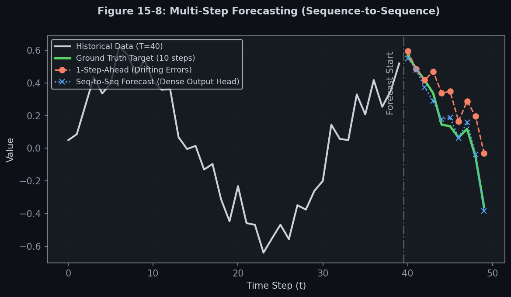

# 🧠 Module 2: Forecasting Time Series and Deep RNNs
> **Ch. 15 — Hands-On ML with Scikit-Learn, Keras & TensorFlow (Aurélien Géron)**

---

## 📌 Table of Contents
1. [Start Here: The Big Picture](#big-picture)
2. [Dataset and Evaluation Baselines](#dataset-baselines)
3. [Implementing a Simple RNN in Keras](#simple-rnn)
4. [Deep RNNs: Stacking Recurrent Layers](#deep-rnns)
5. [Forecasting Several Steps Ahead](#multi-step-forecasting)
6. [Common Beginner Mistakes](#mistakes)
7. [Interview Q&A](#interview)
8. [⚡ One-Page Flash Card](#revision)

---

## 🌍 Start Here: The Big Picture {#big-picture}

> **TL;DR:** Forecasting time series is a core sequential modeling task. Before building complex networks, we must always establish naive and linear baselines. We then transition to Simple RNNs, stack them into Deep RNNs, and structure them as Sequence-to-Sequence models to predict multiple future steps simultaneously, ensuring the model trains on predictions at every time step rather than only the final step.

**The Real-World Analogy 🍕:**
Imagine predicting weather patterns. A naive approach is simply to say "tomorrow's weather will be exactly the same as today's." A linear approach looks at the average change over the last few days. An RNN is like a meteorologist who tracks historical pressure systems, recognizes recurring cycles (highs and lows), and uses the historical context to predict temperature trends for the next week.

---

## 🔍 1. Dataset and Evaluation Baselines {#dataset-baselines}

To demonstrate forecasting, we generate a synthetic univariate time series where each sequence is 50 time steps long.


> 📊 **Graph 06:** Examples of synthetic time series generated by combining random sine waves with additive noise.

### Synthetic Data Generator Code
The function below creates a dataset of shape `[batch_size, time_steps, 1]`.
```python
import numpy as np

def generate_time_series(batch_size, n_steps):
    freq1, freq2, offsets1, offsets2 = np.random.rand(4, batch_size, 1)
    time = np.linspace(0, 1, n_steps)
    # Combine two sine waves with random frequencies and offsets, plus gaussian noise
    series = 0.5 * np.sin((time - offsets1) * (freq1 * 10 + 10))  # wave 1
    series += 0.2 * np.sin((time - offsets2) * (freq2 * 20 + 20)) # + wave 2
    series += 0.1 * (np.random.rand(batch_size, n_steps) - 0.5)   # + noise
    return series[..., np.newaxis].astype(np.float32)

# Generate splits
n_steps = 50
series = generate_time_series(10000, n_steps + 10) # 50 steps input, 10 steps target
X_train, Y_train = series[:7000, :n_steps], series[:7000, -10:, 0]
X_valid, Y_valid = series[7000:9000, :n_steps], series[7000:9000, -10:, 0]
X_test, Y_test = series[9000:, :n_steps], series[9000:, -10:, 0]
```

### Baseline 1: Naive Forecasting
The naive baseline predicts that the future value at step $t+1$ will be exactly equal to the observed value at step $t$.
```python
# To forecast 1 step ahead: predict value at step 50 as prediction for step 51
Y_pred_naive = X_valid[:, -1] # Shape: [2000, 1]
naive_mse = np.mean(keras.losses.mean_squared_error(Y_valid[:, 0:1], Y_pred_naive))
# OUTPUT: Naive MSE ≈ 0.020
```

### Baseline 2: Linear Regression (Fully Connected Network)
A simple linear model that maps the 50 past steps directly to the future prediction.
```python
from tensorflow import keras

model_linear = keras.models.Sequential([
    keras.layers.Flatten(input_shape=[50, 1]),
    keras.layers.Dense(1)
])
model_linear.compile(loss="mse", optimizer="adam")
model_linear.fit(X_train, Y_train[:, 0:1], epochs=20, validation_data=(X_valid, Y_valid[:, 0:1]))
# OUTPUT: Linear FCN MSE ≈ 0.004
```

---

## 🔍 2. Implementing a Simple RNN in Keras {#simple-rnn}

A basic RNN layer containing a single recurrent neuron unrolled over the 50 time steps.
```python
model_simple_rnn = keras.models.Sequential([
    # None allows sequences of variable length. 1 feature dimension.
    keras.layers.SimpleRNN(1, input_shape=[None, 1])
])
model_simple_rnn.compile(loss="mse", optimizer="adam")
model_simple_rnn.fit(X_train, Y_train[:, 0:1], epochs=20, validation_data=(X_valid, Y_valid[:, 0:1]))
# OUTPUT: Simple RNN MSE ≈ 0.014
```
> [!NOTE]
> Setting `input_shape=[None, 1]` allows the model to process sequences of **any** temporal length, as the recurrent weight matrices $\mathbf{W}_x$ and $\mathbf{W}_y$ do not depend on the sequence length. By default, Keras recurrent layers use the $\tanh$ activation function.

---

## 🔍 3. Deep RNNs: Stacking Recurrent Layers {#deep-rnns}

To model more complex relationships, we stack multiple recurrent layers. 


> 📊 **Graph 07:** A stacked Deep RNN unrolled through time. Outputs from lower recurrent layers feed into the inputs of higher recurrent layers.

### Stacking Rules and Shape Conversions
For all recurrent layers except the last one, you **must** set `return_sequences=True`. If you don't, the layer will only output a 2D tensor for the last time step, and the subsequent recurrent layer will throw a shape error because it expects a 3D temporal input.

#### Step-by-Step Tensor Shapes Trace:
* **Input**: `[Batch Size, 50, 1]`
* **SimpleRNN(20, return_sequences=True)**: Recurrent calculations yield an output vector of size 20 at each of the 50 time steps $\rightarrow$ Output Shape: `[Batch Size, 50, 20]`.
* **SimpleRNN(20, return_sequences=True)**: Takes the 3D sequence as input, outputs another 3D sequence $\rightarrow$ Output Shape: `[Batch Size, 50, 20]`.
* **SimpleRNN(1, return_sequences=False)**: Extracts the recurrent output *only* at the final time step ($t=50$) $\rightarrow$ Output Shape: `[Batch Size, 1]`.

```python
model_deep_rnn = keras.models.Sequential([
    keras.layers.SimpleRNN(20, return_sequences=True, input_shape=[None, 1]),
    keras.layers.SimpleRNN(20, return_sequences=True),
    keras.layers.SimpleRNN(1) # return_sequences=False
])
# OUTPUT: Deep RNN MSE ≈ 0.003
```

### Improving Performance with a Dense Output Head
Instead of forcing the final recurrent layer to output a single value (which constrains the internal hidden state dimensionality to 1), it is much better to let the final recurrent layer have many hidden units and add a `Dense` output layer:
```python
model_dense_head = keras.models.Sequential([
    keras.layers.SimpleRNN(20, return_sequences=True, input_shape=[None, 1]),
    keras.layers.SimpleRNN(20), # return_sequences=False
    keras.layers.Dense(1) # Linear activation for regression
])
```
* **Benefit**: The model trains faster, can use any output activation, and allows the final recurrent layer to maintain a high-dimensional hidden state ($n=20$) right up to the final classification/regression projection.

---

## 🔍 4. Forecasting Several Steps Ahead {#multi-step-forecasting}

We have forecasted 1 step ahead. How do we forecast the next 10 steps?


> 📊 **Graph 08:** Comparison of error propagation in recursive 1-step-ahead forecasting vs. direct sequence-to-sequence forecasting.

### Approach A: Recursive 1-Step-Ahead Forecasting
Predict step $t+1$, append this prediction to the input sequence, and use this extended sequence to predict step $t+2$.
* **Drawback**: Error drift. Any error in the prediction for step $t+1$ is fed back as input, compounding errors rapidly over time.
```python
# Pseudo-code of recursive forecasting loop
X_new = X_valid.copy()
for step in range(10):
    y_pred_one_step = model_simple_rnn.predict(X_new) # Predict next step
    X_new = np.concatenate([X_new, y_pred_one_step[:, np.newaxis, :]], axis=1)
y_pred_recursive = X_new[:, -10:]
# OUTPUT: Recursive MSE ≈ 0.029 (Drifting error accumulation)
```

### Approach B: Sequence-to-Vector (Seq-to-Vec) Multi-Step Output
Train a model to predict all 10 steps at once at the final step.
```python
# Predicts 10 values at the final step
model_seq_to_vec = keras.models.Sequential([
    keras.layers.SimpleRNN(20, return_sequences=True, input_shape=[None, 1]),
    keras.layers.SimpleRNN(20), # Output shape: [Batch, 20]
    keras.layers.Dense(10) # 10 output units representing steps t+1 to t+10
])
# OUTPUT: Seq-to-Vec MSE ≈ 0.008
```

### Approach C: Sequence-to-Sequence (Seq-to-Seq) Multi-Step Output
Train the model to predict the next 10 steps at **every single time step** of the sequence. This is a Sequence-to-Sequence network unrolled across time.
* **Why it's better**: The loss function gets computed at every time step, which stabilizes training by providing gradients at every step rather than only at the very end.

We implement this by wrapping the output `Dense` layer in Keras's `TimeDistributed` layer, which applies the Dense layer independently at every single time step.

#### Shape transformations:
* **Input**: `[Batch Size, 50, 1]`
* **SimpleRNN(20, return_sequences=True)** $\rightarrow$ Output `[Batch Size, 50, 20]`
* **SimpleRNN(20, return_sequences=True)** $\rightarrow$ Output `[Batch Size, 50, 20]`
* **TimeDistributed(Dense(10))** $\rightarrow$ Output `[Batch Size, 50, 10]`

```python
# Predict the next 10 steps at every single time step
model_seq_to_seq = keras.models.Sequential([
    keras.layers.SimpleRNN(20, return_sequences=True, input_shape=[None, 1]),
    keras.layers.SimpleRNN(20, return_sequences=True),
    keras.layers.TimeDistributed(keras.layers.Dense(10))
])

# Custom evaluation metric to evaluate MSE only on the last step's forecast
def last_time_step_mse(Y_true, Y_pred):
    return keras.metrics.mean_squared_error(Y_true[:, -1], Y_pred[:, -1])

model_seq_to_seq.compile(loss="mse", 
                         optimizer=keras.optimizers.Adam(lr=0.01), 
                         metrics=[last_time_step_mse])
```

---

## ❌ Common Beginner Mistakes {#mistakes}

**1. Forgetting `return_sequences=True` in stacked RNN layers** ❌
> **Why it fails:** Submitting a 2D tensor of shape `[batch_size, units]` to another recurrent layer will crash with: `ValueError: Input 0 is incompatible with layer... expected ndim=3, found ndim=2`.
> **The Fix:** Ensure all recurrent layers except the final one have `return_sequences=True`.

---

## 🎤 Interview Q&A {#interview}

**Q1: Why does a Sequence-to-Sequence architecture train better than a Sequence-to-Vector architecture for time series forecasting?**
> **A:** In a Sequence-to-Vector model, the loss is only calculated on the final output step. This means gradients must backpropagate all the way from the end of the sequence through many temporal steps, making them susceptible to vanishing gradients. In a Sequence-to-Sequence model, the loss is calculated and backpropagated at *every* time step. This provides a strong, short-distance gradient signal to the recurrent weights, leading to faster convergence and more stable training.

**Q2: What does the `TimeDistributed` layer actually do?**
> **A:** The `TimeDistributed` layer wraps a standard layer (e.g. `Dense`) and applies it to every time step of the input sequence. Under the hood, it reshapes the input from 3D `[batch_size, time_steps, features]` to 2D `[batch_size * time_steps, features]`, performs the dense multiplication, and then reshapes it back to 3D. This ensures that the dense weights are shared identically across all time steps.

---

## ⚡ One-Page Flash Card {#revision}

```
╔══════════════════════════════════════════════════════════════════╗
║               MODULE 2 — DEEP RNNs & TIME SERIES                 ║
╠══════════════════════════════════════════════════════════════════╣
║                                                                  ║
║  STACKING RULE:                                                  ║
║  - Intermediate RNN layers: return_sequences=True (required!)    ║
║  - Final RNN layer: return_sequences=False (unless Seq-to-Seq)   ║
║                                                                  ║
║  DENSE HEAD BENEFIT:                                             ║
║  - Allows high-dimensional internal state; maps to predictions   ║
║    efficiently without bottlenecking recurrent capacity.         ║
║                                                                  ║
║  MULTI-STEP FORECASTING STYLES:                                  ║
║  1. Recursive: Predict 1 step, feed back (prone to error drift).  ║
║  2. Seq-to-Vec: Direct Dense(10) head at last step.              ║
║  3. Seq-to-Seq: TimeDistributed(Dense(10)) head at all steps.    ║
║                                                                  ║
║  KEY METRIC FOR SEQ-TO-SEQ EVALUATION:                           ║
║  - last_time_step_mse: checks error only at final unrolled step. ║
║                                                                  ║
╚══════════════════════════════════════════════════════════════════╝
```

---

---

**🔗 Previous Module →** [01_Recurrent_Neurons_and_Input_Output_Sequences.md](01_Recurrent_Neurons_and_Input_Output_Sequences.md)  
**🔗 Next Module →** [03_Fighting_Unstable_Gradients_in_RNNs.md](03_Fighting_Unstable_Gradients_in_RNNs.md)
