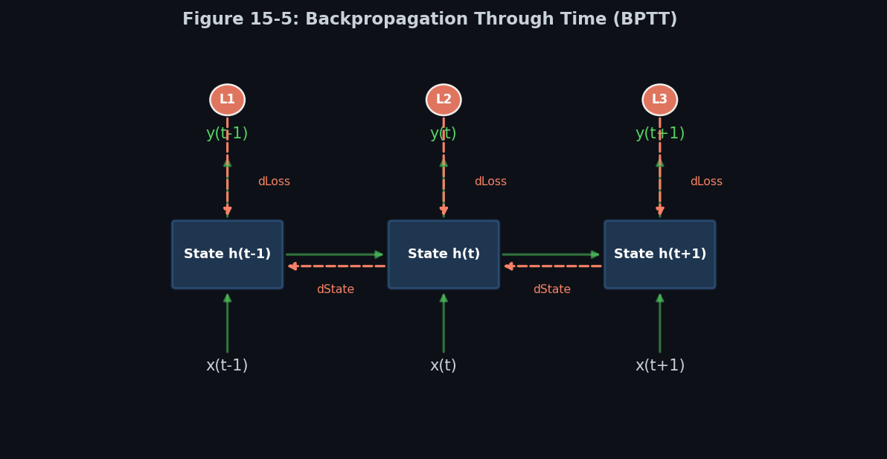

# 🧠 Module 3: Fighting Unstable Gradients in RNNs
> **Ch. 15 — Hands-On ML with Scikit-Learn, Keras & TensorFlow (Aurélien Géron)**

---

## 📌 Table of Contents
1. [Start Here: The Big Picture](#big-picture)
2. [Why RNNs Suffer from Unstable Gradients](#unstable-gradients)
3. [Gradient Clipping](#gradient-clipping)
4. [Layer Normalization in Custom RNN Cells](#layer-normalization)
5. [Regularizing RNNs: Dropout vs. Recurrent Dropout](#dropout)
6. [Stateful vs. Stateless RNNs](#stateful-vs-stateless)
7. [Common Beginner Mistakes](#mistakes)
8. [Interview Q&A](#interview)
9. [⚡ One-Page Flash Card](#revision)

---

## 🌍 Start Here: The Big Picture {#big-picture}

> **TL;DR:** Unrolled RNNs behave like extremely deep feedforward networks. This makes them highly vulnerable to vanishing and exploding gradients. To stabilize training, we use gradient clipping to prevent explosion, replace Batch Normalization with Layer Normalization at each time step, and transition from stateless to stateful RNNs when training on long sequences.

**The Real-World Analogy 🍕:**
Imagine whispering a secret down a line of 100 people (a long sequence of steps). If each person whispers slightly quieter than the last (multiplier < 1), by person 50, the secret is completely lost (vanishing gradients). If each person shouts it slightly louder (multiplier > 1), by person 20, everyone is deafened (exploding gradients). To make this communication stable, we need a mechanism that normalizes volume at each person's ear (Layer Normalization) and puts a hard cap on the maximum volume allowed (Gradient Clipping).

---

## 🔍 1. Why RNNs Suffer from Unstable Gradients {#unstable-gradients}

When backpropagating through time (BPTT), gradients must travel backward through the entire sequence step-by-step.


> 📊 **Graph 05:** Backpropagation through time. Gradients are computed at each step and flow backward across the temporal sequence, which acts as a chain of matrix multiplications.

### The Mechanics of Instability
Because the same weight matrix $\mathbf{W}_y$ is multiplied repeatedly at each step, any gradient value is multiplied by $\mathbf{W}_y^T$ repeatedly:
* If the largest eigenvalue of $\mathbf{W}_y$ is greater than 1, the gradients will grow exponentially, causing **Exploding Gradients**.
* If the largest eigenvalue of $\mathbf{W}_y$ is less than 1, the gradients will shrink exponentially, causing **Vanishing Gradients**.

Standard deep network tricks do not always work:
* **ReLU activation**: In RNNs, ReLU can cause outputs to grow unbounded at each step, leading to numerical overflow. $\tanh$ is generally preferred because it naturally bounds outputs between -1 and 1.
* **Batch Normalization**: BN normalizes across batches. Applying it to sequences is difficult because statistics must be computed per time step, requiring massive memory. It performs poorly on variable-length sequences.

---

## 🔍 2. Gradient Clipping {#gradient-clipping}

To prevent exploding gradients, a simple and highly effective trick is to clip the gradients during backpropagation so they never exceed a threshold.

In Keras, you configure clipping by adding arguments to the optimizer:
```python
import tensorflow as tf
from tensorflow import keras

# Clip values: cuts any gradient component that exceeds the threshold
optimizer_val = keras.optimizers.SGD(clipvalue=1.0)

# Clip norms: preserves gradient direction by scaling the entire gradient vector
optimizer_norm = keras.optimizers.SGD(clipnorm=1.0)
```
> [!TIP]
> **Use `clipnorm` instead of `clipvalue`**: If you have a gradient vector like `[0.9, 100.0]`, clipping by *value* changes it to `[0.9, 1.0]`, which alters its direction. Clipping by *norm* divides the entire vector by its norm if it exceeds 1.0, preserving the direction of the optimization step.

---

## 🔍 3. Layer Normalization in Custom RNN Cells {#layer-normalization}

While Batch Normalization works poorly, **Layer Normalization (LN)** is highly effective. LN normalizes across the features dimension for each instance independently. This makes it independent of batch size and time step length.

### Mathematical Formulation
For an activation vector $\mathbf{x} = [x_1, x_2, \dots, x_d]^T$ of feature dimension $d$ (representing the pre-activation outputs of the recurrent neurons for a single instance at step $t$), the Layer Normalization output $\mathbf{y} = [y_1, y_2, \dots, y_d]^T$ is computed as:

1. **Layer Mean ($\mu$)**:
   $$\mu = \frac{1}{d} \sum_{i=1}^d x_i$$
2. **Layer Variance ($\sigma^2$)**:
   $$\sigma^2 = \frac{1}{d} \sum_{i=1}^d (x_i - \mu)^2$$
3. **Rescaled Activation ($\hat{x}_i$)**:
   $$\hat{x}_i = \frac{x_i - \mu}{\sqrt{\sigma^2 + \epsilon}}$$
4. **Scale and Shift Output ($y_i$)**:
   $$y_i = \gamma_i \hat{x}_i + \beta_i$$

Where:
* $\epsilon$ is a small constant (e.g., $10^{-5}$) to prevent division by zero.
* $\gamma$ and $\beta$ are learnable scale (gain) and shift (bias) parameter vectors of shape $1 \times d$ updated via backpropagation.

In an RNN cell, Layer Normalization is applied right after the linear combination of inputs and hidden states, but before the activation function.

### Implementing a Custom LN Cell in Keras
To implement a custom cell, Keras requires class compatibility with the following cell API guidelines:
* Inherit from `keras.layers.Layer`.
* Constructor must set `self.state_size` and `self.output_size`. For cells with multiple states (e.g., LSTM), `state_size` is a list/tuple of shapes (e.g. `[units, units]` for long-term and short-term states).
* `call(self, inputs, states)` must accept current inputs and a list of previous states, and return `outputs, [new_states]`.

```python
class LNSimpleRNNCell(keras.layers.Layer):
    def __init__(self, units, activation="tanh", **kwargs):
        super().__init__(**kwargs)
        self.state_size = units
        self.output_size = units
        # Simple RNN Cell without activation (so we can apply LN first)
        self.simple_rnn_cell = keras.layers.SimpleRNNCell(units, activation=None)
        self.layer_norm = keras.layers.LayerNormalization()
        self.activation = keras.activations.get(activation)

    def call(self, inputs, states):
        # 1. Compute linear combination: outputs = Wx*x + Wy*h + b
        outputs, new_states = self.simple_rnn_cell(inputs, states)
        # 2. Normalize and activate
        norm_outputs = self.activation(self.layer_norm(outputs))
        # 3. Return outputs and list of states
        return norm_outputs, [norm_outputs]
```

To use our custom cell, we wrap it in a general-purpose `RNN` layer:
```python
model = keras.models.Sequential([
    keras.layers.RNN(LNSimpleRNNCell(20), return_sequences=True, input_shape=[None, 1]),
    keras.layers.RNN(LNSimpleRNNCell(20), return_sequences=True),
    keras.layers.TimeDistributed(keras.layers.Dense(10))
])
```

---

## 🔍 4. Regularizing RNNs: Dropout vs. Recurrent Dropout {#dropout}

Standard dropout applied to sequence inputs can disrupt training because it acts as noise injected at every time step. To prevent this, Yarin Gal and Ghahramani proposed a variational dropout method for recurrent networks.

### Variational Dropout Mechanics
1. **Input Dropout (`dropout`)**: Sets a fraction of input features to 0. In RNNs, the *same* dropout mask is applied at each time step (rather than generating a new random mask at each step), preserving consistency.
2. **Recurrent Dropout (`recurrent_dropout`)**: Sets a fraction of hidden state connections to 0 as they flow across steps, regularizing the temporal memory pathways.

```python
# Keras implementation of LSTM with regular and recurrent dropout
model_dropout = keras.models.Sequential([
    keras.layers.LSTM(20, dropout=0.2, recurrent_dropout=0.2, input_shape=[None, 1])
])
```
> [!WARNING]
> **GPU Acceleration Limit**: Standard Keras `LSTM` and `GRU` layers are accelerated on GPUs using CuDNN. However, CuDNN does not support recurrent dropout. Using `recurrent_dropout != 0` will force Keras to fall back to a slower CPU implementation, increasing training times significantly.

---

## 🔍 5. Stateful vs. Stateless RNNs {#stateful-vs-stateless}

For very long sequences, we cannot feed the entire sequence into the network at once due to memory limits. Instead, we break it into smaller windows.

### Stateless RNNs (Default)
Before each training batch, the hidden states of the recurrent cells are reset to 0. 
* **Drawback**: The model cannot learn dependencies that span longer than a single window, as it forgets everything at the boundary.

### Stateful RNNs
The model preserves the final hidden state of batch $i$ and uses it as the initial hidden state for batch $i+1$.

#### Explicit Sequential Alignment between Batches:
For stateful memory to be mathematically correct, the sequence in slot $k$ of batch $i+1$ must be the direct continuation of slot $k$ in batch $i$:

```
Batch 1:
Slot 0: [Time step 0   to 99]
Slot 1: [Time step 1000 to 1099]

Batch 2:
Slot 0: [Time step 100 to 199]   <-- Direct continuation of Slot 0, Batch 1
Slot 1: [Time step 1100 to 1199] <-- Direct continuation of Slot 1, Batch 1
```

```python
# Stateful Model Setup
model_stateful = keras.models.Sequential([
    # Stateful RNNs require a fixed batch size at compile time
    keras.layers.SimpleRNN(20, stateful=True, return_sequences=True,
                           batch_input_shape=[32, None, 1]), # batch_size=32
    keras.layers.SimpleRNN(20, stateful=True),
    keras.layers.Dense(1)
])

# Custom training loop to reset states between epochs
for epoch in range(10):
    for X_batch, Y_batch in train_dataset:
        model_stateful.train_on_batch(X_batch, Y_batch)
    model_stateful.reset_states()
```

---

## ❌ Common Beginner Mistakes {#mistakes}

**1. Forgetting to call `model.reset_states()` in stateful RNNs** ❌
> **Why it fails:** If you don't reset the states at the end of an epoch, the model will start the second epoch carrying over hidden states from the end of the previous epoch, confusing the relationship between different epochs.
> **The Fix:** Register a custom callback or use a custom training loop to trigger `.reset_states()` at the end of every training epoch.

---

## 🎤 Interview Q&A {#interview}

**Q1: Why is Layer Normalization preferred over Batch Normalization in Recurrent Neural Networks?**
> **A:** Batch Normalization calculates mean and variance across the batch dimension. In sequential data, this means you must compute separate statistics for each time step. If validation sequences are longer than training sequences, BN fails because it lacks statistics for the unseen steps. Furthermore, BN is heavily affected by batch sizes, which are often small in RNNs. Layer Normalization, however, normalizes across features *within* a single step of a single instance, making it completely independent of batch size and sequence length.

**Q2: What is the main structural constraint when compiling a Stateful RNN?**
> **A:** Stateful RNNs require a fixed batch size at compile time (using `batch_input_shape` instead of `input_shape`). This is because Keras must pre-allocate the hidden state tensor arrays (of shape `[batch_size, hidden_units]`) in memory so they can be persisted and updated across consecutive calls to `predict()` or `train_on_batch()`.

---

## ⚡ One-Page Flash Card {#revision}

```
╔══════════════════════════════════════════════════════════════════╗
║               MODULE 3 — RNN STABILIZATION CARD                  ║
╠══════════════════════════════════════════════════════════════════╣
║                                                                  ║
║  GRADIENT CLIPPING:                                              ║
║  - SGD(clipnorm=1.0) is superior to clipvalue (preserves direction)║
║                                                                  ║
║  LAYER NORMALIZATION (LN):                                       ║
║  - Normalizes across features within each time step.             ║
║  - Applied *after* linear combinations, *before* activation.    ║
║                                                                  ║
║  VARIATIONAL DROPOUT:                                            ║
║  - Use same mask at each step.                                   ║
║  - Recurrent dropout is not CuDNN accelerated.                   ║
║                                                                  ║
║  STATEFUL RNN RULES:                                             ║
║  - Define fixed batch_input_shape=[batch_size, None, features]   ║
║  - Must manually reset states: model.reset_states() per epoch    ║
║  - Sequences across consecutive batches must align.              ║
║                                                                  ║
╚══════════════════════════════════════════════════════════════════╝
```

---

---

**🔗 Previous Module →** [02_Forecasting_Time_Series_and_Deep_RNNs.md](02_Forecasting_Time_Series_and_Deep_RNNs.md)  
**🔗 Next Module →** [04_Long_Term_Dependency_Cells_LSTM_and_GRU.md](04_Long_Term_Dependency_Cells_LSTM_and_GRU.md)
