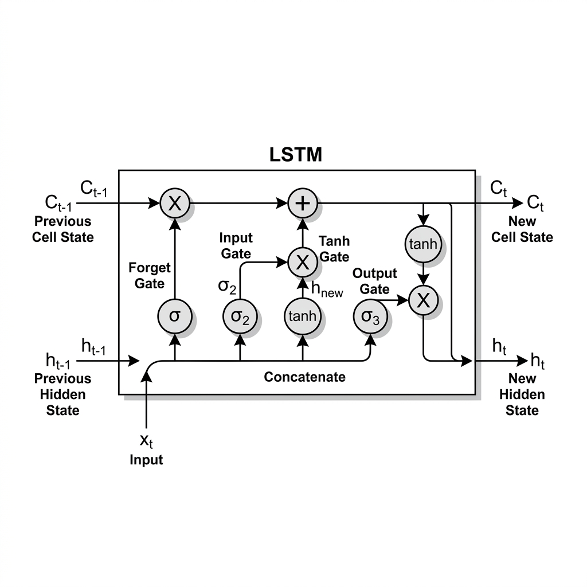
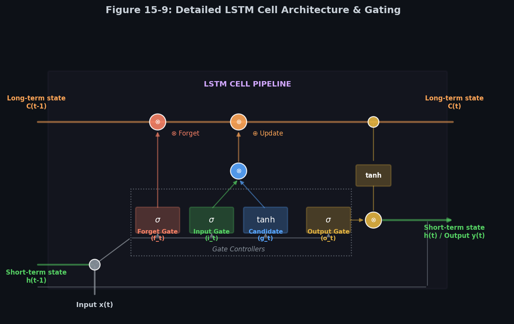
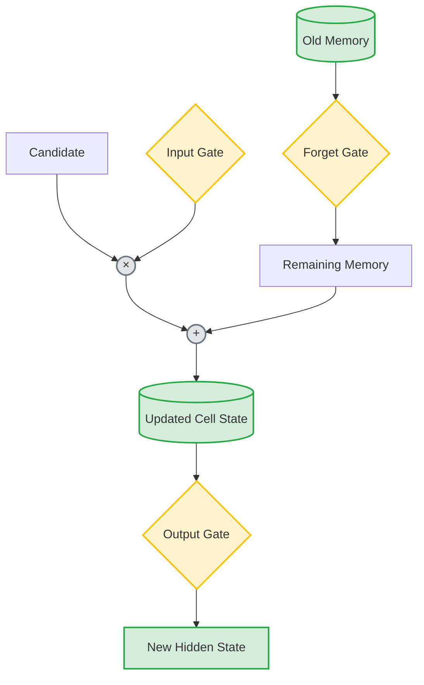
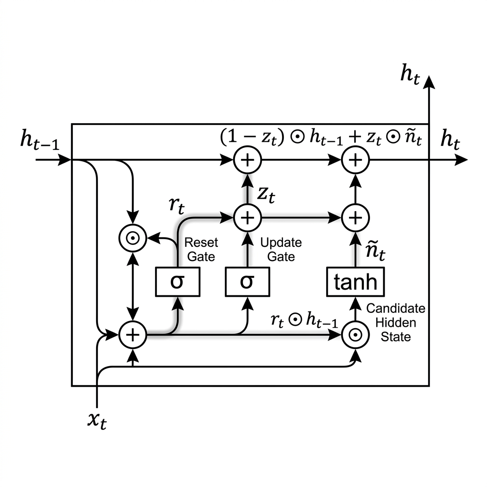
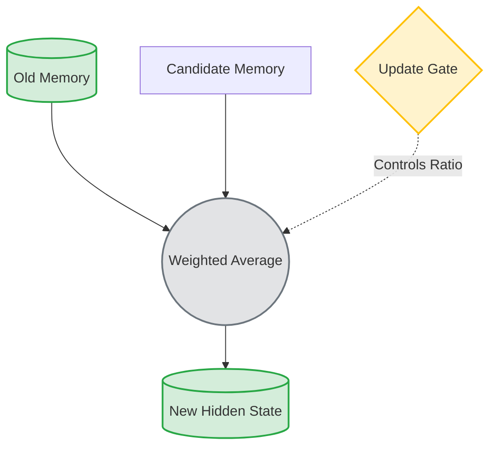

# 🧠 Module 4: Long-Term Dependency Cells (LSTM and GRU)
> **Ch. 15 — Hands-On ML with Scikit-Learn, Keras & TensorFlow (Aurélien Géron)**

---

## 📌 Table of Contents
0. [Why LSTMs Still Matter](#lstm-still-matter)
1. [Why Simple RNN Actually Forgets](#rnn-forgets)
2. [The LSTM Cell (Long Short-Term Memory)](#lstm-cell)
3. [Deep Dive: Gates, States, and Intuition](#deep-dive)
4. [LSTM Forward Pass Step-by-Step](#forward-pass)
5. [The Core of LSTM: Addition and CEC](#core-lstm)
6. [LSTM Hyperparameters and Best Practices](#lstm-best-practices)
7. [Advanced LSTM Architectures (Bidirectional, Stacked, Stateful)](#advanced-lstm)
8. [The GRU Cell (Gated Recurrent Unit)](#gru-cell)
9. [Advanced Variants & Hardware Considerations](#variants-hardware)
10. [LSTM vs. Transformer](#lstm-vs-transformer)
11. [Interview Q&A](#interview)
12. [⚡ One-Page Flash Card](#revision)

---

## 🚀 0. Why LSTMs Still Matter {#lstm-still-matter}

Many beginners think LSTMs are obsolete because Transformers dominate NLP. This is only partially true. 

**Where LSTMs are still widely used:**
- Time-series forecasting
- Financial prediction
- Sensor data
- IoT devices
- ECG/EEG signal analysis
- Embedded AI
- Speech processing
- Small datasets
- Low-latency systems
- Edge AI

Transformers require large memory because self-attention scales roughly as $\mathcal{O}(n^2)$, while LSTM requires only $\mathcal{O}(n)$ memory. 

For sequences with millions of timesteps, LSTM is often still the better engineering choice.

---

## 🔍 1. Why Simple RNN Actually Forgets {#rnn-forgets}

Instead of only saying "vanishing gradients", let's explain mathematically.

**Simple RNN:**
$$h_t = \tanh(W_h h_{t-1} + W_x x_t + b)$$

During backprop, the gradient flow from $t$ to $t-1$ involves:
$$\frac{\partial h_{t-1}}{\partial h_t} = W_h^T \cdot \text{diag}(1 - \tanh^2)$$

The derivative of $\tanh$ is $1 - \tanh^2(x)$, whose maximum value is $1$ but usually much smaller. 

Therefore after 100 timesteps, the gradient becomes:
$$(W_h)^T (W_h)^T (W_h)^T ...$$
multiplied hundreds of times.

- If the largest eigenvalue $< 1 \downarrow$ Gradient $\rightarrow 0$ (Vanishing gradient)
- If the eigenvalue $> 1 \downarrow$ Gradient $\rightarrow \infty$ (Exploding gradient)

This explains BOTH the vanishing and exploding gradient problems in Simple RNNs!

---

## 🔍 2. The LSTM Cell (Long Short-Term Memory) {#lstm-cell}

Proposed by Hochreiter and Schmidhuber in 1997, the LSTM cell splits the state into two paths.


> 🎨 **Concept Art:** A cyberpunk, high-tech visualization of an LSTM cell's inner workings.

### Cell State vs Hidden State Better
Many beginners confuse these. Imagine a notebook.
- **Cell State ($C$)** $\downarrow$ The Notebook (stores everything).
- **Hidden State ($h$)** $\downarrow$ Current spoken sentence (reveals only part of it).

The long-term cell state $C_{(t)}$ glides along the top, while the short-term hidden state $h_{(t)}$ flows along the bottom, providing the cell's output prediction for the current step.


> 📊 **Graph 09:** LSTM cell internal architecture. Gated controllers control information flow.

---

## 🧠 3. Deep Dive: Gates, States, and Intuition {#deep-dive}

### Intuition for Every Gate
This simple interpretation helps during interviews:
- **Forget Gate:** Think *"Delete old memory?"*
- **Input Gate:** Think *"Should I write this?"*
- **Candidate:** Think *"What should I write?"*
- **Output Gate:** Think *"What part should I reveal?"*

### Why Gates Use Sigmoid
Many interviewers ask this. 
Sigmoid outputs $0 \le \sigma(x) \le 1$. Therefore it behaves like a valve.
* Examples:
  - Forget gate $0 \downarrow$ Forget everything
  - Forget gate $1 \downarrow$ Remember everything
  - Forget gate $0.25 \downarrow$ Keep only 25%

A ReLU cannot do this because ReLU outputs $0, \infty$, which cannot represent probabilities.

### Why Candidate Uses tanh
The candidate state is $g_t = \tanh(...)$ instead of sigmoid.
* **Reason:** Candidate contains new information, not probabilities. We need values $[-1, +1]$ rather than $[0, 1]$. Negative values are important because memory sometimes needs subtraction (e.g., reversing an increment).

---

## ⚙️ 4. LSTM Forward Pass Step-by-Step {#forward-pass}

Instead of equations only, describe step-by-step:

* **Step 1:** Read $x_{(t)}$ and $h_{(t-1)}$ $\downarrow$
* **Step 2:** Compute Forget gate $\downarrow$ Decide what old memories survive. $\downarrow$
* **Step 3:** Compute Input gate $\downarrow$ Decide whether new information is useful. $\downarrow$
* **Step 4:** Generate candidate memory. $\downarrow$
* **Step 5:** Update Cell State $\downarrow$ Old memory $\times$ Forget + New memory $\times$ Input. $\downarrow$
* **Step 6:** Compute Output gate $\downarrow$ Reveal part of updated memory $\downarrow$ Generate hidden state $h_{(t)}$.

### Mathematical Formulations
$$\mathbf{f}_{(t)} = \sigma\left(\mathbf{W}_{xf}^T \mathbf{x}_{(t)} + \mathbf{W}_{hf}^T \mathbf{h}_{(t-1)} + \mathbf{b}_f\right)$$
$$\mathbf{i}_{(t)} = \sigma\left(\mathbf{W}_{xi}^T \mathbf{x}_{(t)} + \mathbf{W}_{hi}^T \mathbf{h}_{(t-1)} + \mathbf{b}_i\right)$$
$$\mathbf{g}_{(t)} = \tanh\left(\mathbf{W}_{xg}^T \mathbf{x}_{(t)} + \mathbf{W}_{hg}^T \mathbf{h}_{(t-1)} + \mathbf{b}_g\right)$$
$$\mathbf{o}_{(t)} = \sigma\left(\mathbf{W}_{xo}^T \mathbf{x}_{(t)} + \mathbf{W}_{ho}^T \mathbf{h}_{(t-1)} + \mathbf{b}_o\right)$$
$$\mathbf{C}_{(t)} = \mathbf{f}_{(t)} \otimes \mathbf{C}_{(t-1)} + \mathbf{i}_{(t)} \otimes \mathbf{g}_{(t)}$$
$$\mathbf{h}_{(t)} = \mathbf{y}_{(t)} = \mathbf{o}_{(t)} \otimes \tanh\left(\mathbf{C}_{(t)}\right)$$

---

## 🎯 5. The Core of LSTM: Addition and CEC {#core-lstm}

### Why Addition Is Important
This is the heart of LSTM.
- **Simple RNN:** Hidden state is *overwritten* every step.
- **LSTM:** Memory is updated via $\mathbf{C}_{(t)} = \mathbf{f}_{(t)} \mathbf{C}_{(t-1)} + \mathbf{i}_{(t)} \mathbf{g}_{(t)}$

Notice **Addition** instead of repeated nonlinear transformation. Addition preserves gradient. This is why LSTM works.

### Visualization of Information Flow

This diagram is extremely useful.

### Constant Error Carousel More Deeply
Most books only give equations. Let's explain intuition:
Cell state behaves like a highway.
- **Simple RNN:** Memory $\downarrow$ modified $\downarrow$ modified $\downarrow$ modified $\downarrow$ modified. Information slowly disappears.
- **LSTM:** Memory =======================> Only small gates interact. Memory mostly flows untouched.

Hence **Constant Error Carousel** means Error gradient also flows along this highway. 

---

## 🔧 6. LSTM Hyperparameters and Best Practices {#lstm-best-practices}

### Common Hyperparameters
| Hyperparameter | Typical Values |
| :--- | :--- |
| Hidden units | 32–512 |
| Layers | 1–4 |
| Dropout | 0.1–0.5 |
| Learning rate | 1e-3 (Adam) |
| Gradient clipping | 1.0 |
| Batch size | 32–256 |

### Forget Gate Bias Trick
Modern LSTMs initialize **Forget bias** to $1$ instead of $0$.
* **Reason:** $\sigma(1) \approx 0.73$. Initially the model prefers remembering rather than forgetting. Empirically this improves convergence. Many frameworks do this automatically.

### Orthogonal Initialization
Most modern LSTM implementations initialize recurrent matrices using **Orthogonal initialization**.
* **Reason:** Orthogonal matrices preserve vector norms. Better gradient flow. TensorFlow and PyTorch both use orthogonal recurrent initialization by default.

### Dropout Variants
- **Standard dropout** ❌ changes every timestep. This injects too much noise.
- **Variational Dropout** uses the SAME dropout mask across all timesteps. 
* TensorFlow `dropout=` and `recurrent_dropout=` control these independently.

---

## 🏛️ 7. Advanced LSTM Architectures {#advanced-lstm}

### Bidirectional LSTM
Very important interview topic. 
Instead of Sentence $\rightarrow$, use $\leftarrow$ Sentence $\rightarrow$
Two LSTMs (Forward and Backward). Outputs are concatenated.
* **Example:** "I went to the bank". Future words help determine if "bank" means river bank or financial bank.

**Keras Example:**
```python
keras.layers.Bidirectional(
    keras.layers.LSTM(128)
)
```

### Stacked LSTM
Multiple LSTM layers.
Input $\downarrow$ LSTM $\downarrow$ LSTM $\downarrow$ LSTM $\downarrow$ Dense
- **Lower layers:** $\downarrow$ Learn local patterns
- **Higher layers:** $\downarrow$ Learn abstract temporal features

### Stateful vs Stateless LSTM
Very commonly asked.
- **Stateless:** Every batch starts with `hidden state = 0`.
- **Stateful:** Hidden state is carried between batches. Useful for Streaming, Sensor data, Real-time forecasting. Need `model.reset_states()` when sequence ends.

### Sequence-to-One vs Sequence-to-Sequence
- **Sequence $\rightarrow$ One:** Stock prices $\downarrow$ Tomorrow's price.
- **Sequence $\rightarrow$ Sequence:** Sentence $\downarrow$ Translated sentence.
Need `return_sequences=True` except last recurrent layer.

---

## ⚡ 8. The GRU Cell (Gated Recurrent Unit) {#gru-cell}

Proposed by Kyunghyun Cho et al. in 2014, the GRU cell is a simplified variant of the LSTM cell.


> 📊 **Graph 10:** GRU cell internal architecture.

### GRU Intuition (Visual)
Instead of saying "Update gate merges forget and input", explain visually:


The update gate decides: How much old memory, How much new memory.

### Why GRU Trains Faster
- **Parameter count:** LSTM 4 matrices, GRU 3 matrices.
- Approximately 25–33% fewer parameters $\downarrow$ Less GPU memory $\downarrow$ Faster forward pass $\downarrow$ Faster backward pass.

---

## 🛠️ 9. Advanced Variants & Hardware Considerations {#variants-hardware}

### Practical Rule of Thumb
| Dataset | Recommendation |
| :--- | :--- |
| Small dataset | GRU |
| Huge dataset | LSTM |
| Embedded device | GRU |
| Very long dependency | LSTM |
| Real-time inference | GRU |
| Maximum accuracy | Try both |

### CuDNN Requirements (Important)
GPU acceleration is only used when:
- `activation=tanh`
- `recurrent_activation=sigmoid`
- no custom cell
- no peephole
- no recurrent constraints

Otherwise TensorFlow falls back to slower kernels.

### Advanced Variants (Mention briefly)
- **Peephole LSTM:** Gate sees cell state.
- **CIFG LSTM:** Couples Forget and Input gates. Reduces parameters.
- **Layer Normalized LSTM:** Uses LayerNorm instead of BatchNorm. Better for RNNs.
- **ConvLSTM:** Uses convolutions instead of dense layers. Excellent for Video, Radar, Weather prediction.
- **Attention + LSTM:** Still common. Attention lets decoder focus on relevant encoder states. Used before Transformers became dominant.

---

## 🤖 10. LSTM vs Transformer {#lstm-vs-transformer}

| Feature | LSTM | Transformer |
| :--- | :--- | :--- |
| Sequential computation | Yes | No |
| Parallel training | No | Yes |
| Long-range dependency | Good | Excellent |
| Small datasets | Excellent | Moderate |
| Huge datasets | Moderate | Excellent |
| Memory complexity | $\mathcal{O}(n)$ | $\mathcal{O}(n^2)$ (standard attention) |
| Edge devices | Better | Usually heavier |
| Current NLP dominance | Limited | Dominant |

---

## 🎤 11. Interview Q&A {#interview}

**Q1: How mathematically does the LSTM cell solve the vanishing gradient problem?**
> **A:** In a Simple RNN, backpropagating through time requires multiplying by $W_h^T$ at each step, causing exponential decay. In an LSTM, the long-term state $C_{(t)}$ is updated via a linear addition: $C_{(t)} = f_{(t)} \otimes C_{(t-1)} + i_{(t)} \otimes g_{(t)}$. The derivative of $C_{(t)}$ with respect to $C_{(t-1)}$ is just the forget gate $f_{(t)}$. If the forget gate is open ($f \approx 1$), the gradient flows back unimpeded.

**Q2: Compare LSTM and GRU cells. Which one should you use?**
> **A:** GRU has fewer parameters, trains faster, and is less prone to overfitting on smaller datasets. LSTM is more expressive with separate long-term and short-term memory states. Rule of thumb: start with GRU, transition to LSTM if underfitting on complex sequences.

---

## ⚡ 12. One-Page Flash Card {#revision}

```text
╔══════════════════════════════════════════════════════════════════╗
║                      MODULE 4 — LSTM & GRU                       ║
╠══════════════════════════════════════════════════════════════════╣
║                                                                  ║
║  WHY LSTMS STILL MATTER:                                         ║
║  - O(n) memory (vs O(n^2) for Transformers).                     ║
║  - Great for time-series, edge devices, ECG, small data.         ║
║                                                                  ║
║  LSTM CORE STATE:                                                ║
║  - C(t): Long-term memory (Notebook).                            ║
║  - h(t): Short-term memory (Current sentence).                   ║
║                                                                  ║
║  LSTM GATES (Sigmoid = Valve, Tanh = Subtraction capable):       ║
║  - Forget (f): f(t) * C(t-1)  -> "Delete old memory?"            ║
║  - Input (i): i(t) * g(t)     -> "Should I write this?"          ║
║  - Candidate (g): tanh        -> "What should I write?"          ║
║  - Output (o): o(t) * tanh(C) -> "What part should I reveal?"    ║
║                                                                  ║
║  THE ADDITION MAGIC (CEC):                                       ║
║  - Cell state updates via addition, not repeated multiplication. ║
║  - Gradients flow perfectly along the Constant Error Carousel.   ║
║                                                                  ║
║  GRU SIMPLIFICATIONS:                                            ║
║  - Merges C(t) and h(t) into h(t). 33% fewer parameters.         ║
║  - Gating addition: z * h(t-1) + (1-z) * candidate(t)            ║
║                                                                  ║
║  GPU TIP:                                                        ║
║  - Stick to defaults (tanh, sigmoid, no peepholes) for CuDNN.    ║
║                                                                  ║
╚══════════════════════════════════════════════════════════════════╝
```

---

**🔗 Previous Module →** [03_Fighting_Unstable_Gradients_in_RNNs.md](03_Fighting_Unstable_Gradients_in_RNNs.md)  
**🔗 Next Module →** [05_Processing_Sequences_Using_1D_CNNs_and_WaveNet.md](05_Processing_Sequences_Using_1D_CNNs_and_WaveNet.md)
