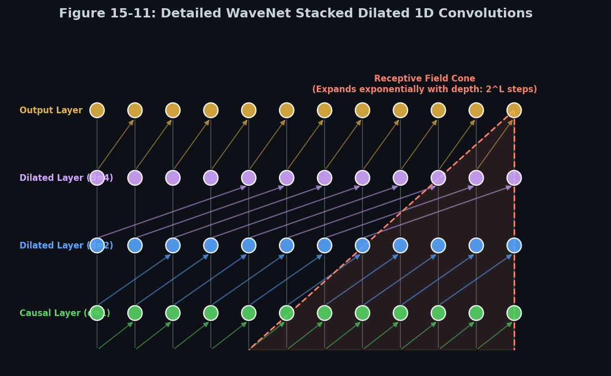

# 🧠 Module 5: Processing Sequences Using 1D CNNs and WaveNet
> **Ch. 15 — Hands-On ML with Scikit-Learn, Keras & TensorFlow (Aurélien Géron)**

---

## 📌 Table of Contents
1. [Start Here: The Big Picture](#big-picture)
2. [Replacing RNNs with 1D Convolutions](#conv1d-foundations)
3. [Causal Padding Mechanics & ASCII Visuals](#causal-padding)
4. [Hybrid CNN-RNN Architectures & Stride Math](#hybrid-architectures)
5. [The WaveNet Architecture & Dilated Math](#wavenet)
6. [WaveNet Gated Activation & Residual Blocks](#wavenet-details)
7. [Common Beginner Mistakes](#mistakes)
8. [Interview Q&A](#interview)
9. [⚡ One-Page Flash Card](#revision)

---

## 🌍 Start Here: The Big Picture {#big-picture}

> **TL;DR:** While RNNs process sequences step-by-step, 1D Convolutional Neural Networks (CNNs) process windows of sequence steps in parallel, making training significantly faster. By stacking 1D convolutions with causal padding and exponential dilation rates (WaveNet), we can capture long-term dependencies across thousands of steps with a highly efficient receptive field.

**The Real-World Analogy 🍕:**
Imagine you are a security guard reviewing a 24-hour video surveillance tape. An RNN is like watching the tape in real-time, frame by frame—it is slow but captures transitions. A 1D CNN is like laying out the tape on a table and looking at 5-minute clips in parallel. A dilated WaveNet is like looking at frame 1, frame 2, frame 4, frame 8, frame 16... allowing you to scan the entire 24-hour timeline in seconds while maintaining a clear view of how events connect.

---

## 🔍 1. Replacing RNNs with 1D Convolutions {#conv1d-foundations}

For many sequence tasks, a 1D Convolutional layer can slide a kernel over a sequence of inputs, extracting local temporal features.
* **Why use 1D Convolutions?** 1D convolutions process sequence steps in parallel. Unlike RNNs, which must calculate step $t$ before starting step $t+1$, 1D CNNs run highly parallel operations on GPUs, leading to massive speedups during training.
* **1D Conv Math**: A 1D convolutional kernel of size $K$ slides along the time dimension, computing dot products of size $K \times d$ (where $d$ is the input feature dimension).

---

## 🔍 2. Causal Padding Mechanics & ASCII Visuals {#causal-padding}

In standard computer vision, a 2D convolution pads all borders with zeros. In sequential forecasting, this is a fatal bug: padding the right side of a time step allows the kernel to look into future steps to predict the past, causing **data leakage**.

To prevent this, sequential 1D CNNs use **Causal Padding**.
* **Definition**: Causal padding pads the input sequence with zeros **only on the left side**.
* **Effect**: This shifts the kernel's receptive window so that the output at step $t$ is computed using only inputs from step $t$ and earlier ($t-1, t-2, \dots$), ensuring the network cannot look into the future.

### ASCII Gating Alignment (Kernel Size K=3)
```
Input Sequence:   [  0  ] [  0  ] [ x_1 ] [ x_2 ] [ x_3 ] [ x_4 ]
                    │       │       │       │       │       │
                    └───────┴───────┬───────┘       │       │
                                    ▼               │       │
Output Sequence:                  [ y_1 ] ──────────┼───────┘
                                                    ▼
                                                  [ y_2 ] (depends only on x_2, x_1, 0)
```

---

## 🔍 3. Hybrid CNN-RNN Architectures & Stride Math {#hybrid-architectures}

If a sequence is extremely long (e.g. thousands of steps), recurrent layers still struggle due to memory consumption and computational cost. We can build a hybrid network that uses a 1D convolution to downsample the sequence before feeding it to recurrent layers.

### Downsampling Shape Mathematics
When using `padding="valid"` and a stride of $S$, the output length $N_{\text{out}}$ is computed from the input sequence length $N_{\text{in}}$ and kernel size $K$ using the formula:

$$N_{\text{out}} = \left\lfloor \frac{N_{\text{in}} - K}{S} \right\rfloor + 1$$

#### Shape Trace Example:
* Input sequence length: $N_{\text{in}} = 50$ steps.
* Conv1D layer: `filters=20, kernel_size=4, strides=2, padding="valid"`.
* Calculation:
  $$N_{\text{out}} = \left\lfloor \frac{50 - 4}{2} \right\rfloor + 1 = \lfloor 23.0 \rfloor + 1 = 24 \text{ steps}$$
* The sequence is downsampled from 50 steps to 24 steps, reducing the temporal dimensions by over 50%. The subsequent recurrent layers (LSTMs or GRUs) only need to unroll over 24 steps, training faster and capturing longer-term patterns.

```python
from tensorflow import keras

# Hybrid Model: 1D Conv Preprocessor + GRU layers
model_hybrid = keras.models.Sequential([
    # Input shape: [None, 1] (variable length sequences, 1 feature)
    keras.layers.Conv1D(filters=20, kernel_size=4, strides=2, padding="valid",
                        input_shape=[None, 1]),
    keras.layers.GRU(20, return_sequences=True),
    keras.layers.GRU(20, return_sequences=True),
    keras.layers.TimeDistributed(keras.layers.Dense(10))
])
```

---

## 🔍 4. The WaveNet Architecture & Dilated Math {#wavenet}

Proposed by Aaron van den Oord et al. at Google DeepMind in 2016 for raw audio generation, **WaveNet** stacks causal 1D convolutional layers with growing **Dilation Rates**.


> 📊 **Graph 11:** WaveNet dilated convolutions. Dilation rates double at each layer (1, 2, 4, 8), expanding the receptive field exponentially.

### Dilated Convolutions
A dilated convolution is a convolution where the kernel has gaps. A dilation rate $d$ means the kernel elements are spaced $d$ steps apart.

#### Mathematical Equation
For an input sequence $\mathbf{x}$, the output $\mathbf{y}_t$ of a 1D dilated convolution with kernel size $K$ and dilation rate $d$ is:

$$\mathbf{y}_t = \sum_{\tau=0}^{K-1} \mathbf{w}_\tau \cdot \mathbf{x}_{t - d \cdot \tau}$$

Where $\mathbf{w}_\tau$ are the learnable filter weights. When $d=1$, this simplifies to a standard causal 1D convolution.

#### Receptive Field Calculations
For a stack of $L$ causal convolutional layers with kernel size $K$, where layer $l$ has dilation rate $d_l$, the total unrolled receptive field $R$ (in time steps) is:

$$R = 1 + (K - 1) \sum_{l=1}^L d_l$$

For a simplified WaveNet block where $K=2$ and dilation rates grow as powers of two ($d_l = 2^{l-1}$ for $l=1, \dots, L$):

$$R = 1 + (2 - 1) \sum_{l=1}^L 2^{l-1} = 1 + (2^L - 1) = 2^L \text{ steps}$$

If this entire block of $L$ layers is repeated $B$ times (to further expand the context without losing fine resolution), the total receptive field becomes:

$$R = 1 + B \cdot (K - 1) \sum_{l=1}^L d_l$$

For a network with kernel size $K=2$ and dilations $1, 2, 4, 8$ ($L=4$) repeated $B=2$ times (as implemented in the Keras code below):

$$R = 1 + 2 \cdot (2 - 1) \cdot (1 + 2 + 4 + 8) = 1 + 2 \cdot 15 = 31 \text{ steps}$$

* **Exponential Expansion**: The receptive field grows exponentially with depth, while the number of parameters only grows linearly with the number of layers, making it highly efficient.
* **Benefit**: The network can capture dependencies across thousands of steps with only a few layers, without losing resolution and using very few parameters.

### Keras WaveNet Implementation
```python
# Custom metric to check MSE only on the final step's multi-step forecast
def last_time_step_mse(Y_true, Y_pred):
    return keras.metrics.mean_squared_error(Y_true[:, -1], Y_pred[:, -1])

# Simplified WaveNet Model
model_wavenet = keras.models.Sequential()
model_wavenet.add(keras.layers.InputLayer(input_shape=[None, 1]))

# Stack dilated causal convolutions: double the dilation rate, then repeat the block
for rate in (1, 2, 4, 8) * 2: # yields dilation rates: 1, 2, 4, 8, 1, 2, 4, 8
    model_wavenet.add(keras.layers.Conv1D(
        filters=20, 
        kernel_size=2, 
        padding="causal",
        activation="relu", 
        dilation_rate=rate
    ))

# 1x1 Convolution output projection layer (10 output values)
model_wavenet.add(keras.layers.Conv1D(filters=10, kernel_size=1))

model_wavenet.compile(loss="mse", optimizer="adam", metrics=[last_time_step_mse])
```

---

## 🔍 5. WaveNet Gated Activation & Residual Blocks {#wavenet-details}

The complete WaveNet architecture published by Google DeepMind includes two critical features omitted in the simplified sequential model:

### 1. Gated Activation Unit
Instead of using standard ReLU activations, WaveNet uses a gated activation mechanism (similar to LSTM/GRU gates) to control signal flow through layers:

$$\mathbf{z} = \tanh\left(\mathbf{W}_{f,k} * \mathbf{x}\right) \otimes \sigma\left(\mathbf{W}_{g,k} * \mathbf{x}\right)$$

Where:
* $*$ represents the 1D causal dilated convolution.
* $\mathbf{W}_{f,k}$ is the filter weight matrix at layer $k$.
* $\mathbf{W}_{g,k}$ is the gate weight matrix at layer $k$.
* $\otimes$ is element-wise multiplication.

### 2. Residual and Skip Connections
* **Residual Connection**: Adds the layer input directly to the output of the gated activation block before passing it to the next layer.
* **Skip Connection**: Outputs from all hidden layers skip directly to the end of the network, bypassing intermediate stacks to be summed together before the final output projection.

---

## ❌ Common Beginner Mistakes {#mistakes}

**1. Forgetting to crop targets when using `padding="valid"` in pre-processing convolutions** ❌
> **Why it fails:** If your 1D Conv layer uses `padding="valid"` and a stride of 2, the output length is shorter than the input sequence length. If you attempt to compute the loss directly against your original un-cropped targets $\mathbf{Y}$, Keras will crash with a shape mismatch error.
> **The Fix:** Crop the target sequences to match the downsampled output sequence of the convolutional layer:
```python
# Crop targets to match the final sequence steps output by the CNN
Y_train_cropped = Y_train[:, 3:] # adjust crop slice to match model shape output
```

---

## 🎤 Interview Q&A {#interview}

**Q1: What is "causal padding", and why is it mandatory for sequential forecasting architectures?**
> **A:** Causal padding pads the input sequence with zeros only on the left side. This ensures that the convolutional kernel at time step $t$ only covers inputs from step $t$ and earlier ($t, t-1, t-2, \dots$). If we used standard `same` or `valid` padding, the kernel would look at future time steps ($t+1, t+2$) to compute the output at step $t$. This causes **data leakage** (future information leaking into the past), leading to a model that performs artificially well during training but fails completely during real-world inference where future values are unknown.

**Q2: How does WaveNet achieve a massive receptive field without using pooling layers?**
> **A:** WaveNet uses **dilated convolutions**. In standard convolutions, expanding the receptive field requires either increasing the kernel size (which increases parameter count) or using pooling layers (which reduces sequence resolution). Dilated convolutions skip input steps at regular intervals ($d=1, 2, 4, 8 \dots$). By doubling the dilation rate at each layer, the receptive field grows exponentially with depth, allowing the network to cover thousands of steps at the top layer while retaining fine-grained step-by-step resolution.

---

## ⚡ One-Page Flash Card {#revision}

```
╔══════════════════════════════════════════════════════════════════╗
║               MODULE 5 — 1D CNNs & WAVENET CARD                  ║
╠══════════════════════════════════════════════════════════════════╣
║                                                                  ║
║  1D CNN SPEED:                                                   ║
║  - Computes features across sequence steps in parallel.          ║
║  - Faster training on GPUs than sequential RNNs.                 ║
║                                                                  ║
║  CAUSAL PADDING:                                                 ║
║  - Left-only padding: output y(t) only depends on x(<=t).        ║
║  - Crucial to prevent future data leakage in forecasting.        ║
║                                                                  ║
║  HYBRID NETWORKS:                                                ║
║  - Conv1D(stride=2) downsamples sequence length by 50%.          ║
║  - Cuts RNN unrolling steps, saving memory and training time.     ║
║                                                                  ║
║  WAVENET STRATEGY:                                               ║
║  - Stacked Conv1D layers with doubling dilations: 1, 2, 4, 8...  ║
║  - Receptive field grows exponentially: RF = 1 + sum(d)*(K-1).   ║
║  - Gated activation: tanh(Wf*x) * sigmoid(Wg*x) stabilizes.      ║
║                                                                  ║
╚══════════════════════════════════════════════════════════════════╝
```

---

---

**🔗 Previous Module →** [04_Long_Term_Dependency_Cells_LSTM_and_GRU.md](04_Long_Term_Dependency_Cells_LSTM_and_GRU.md)  
**🔗 Chapter Complete! →** [Back to Chapter Index](../notes.md)
