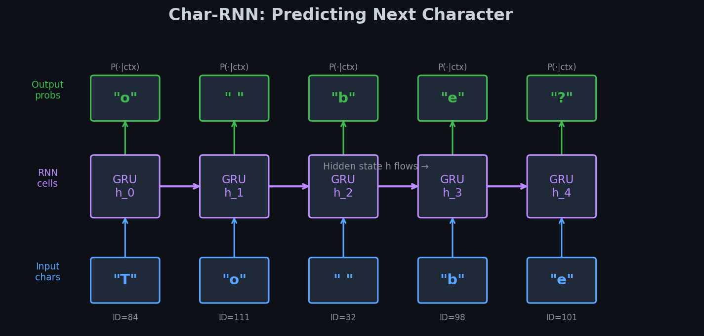
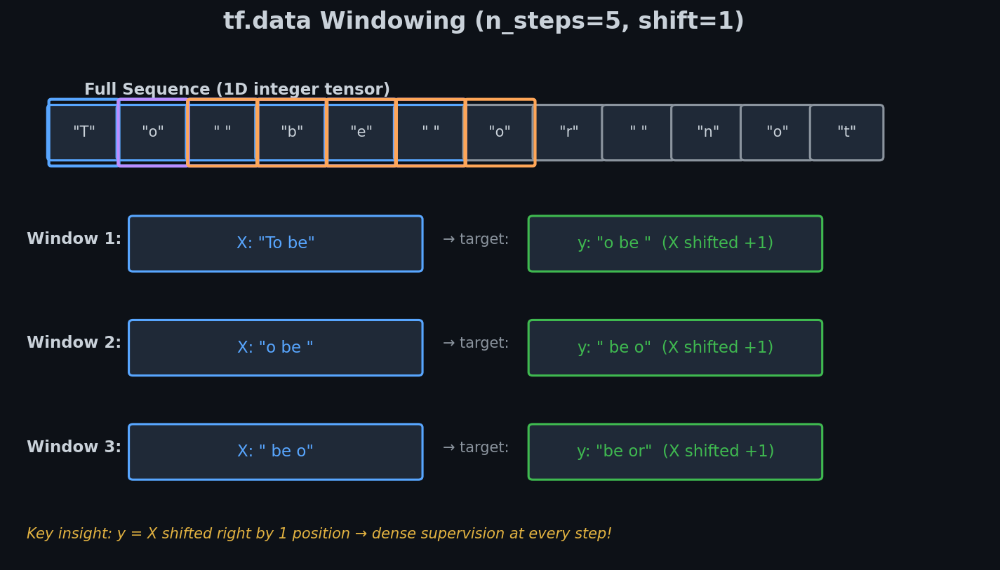
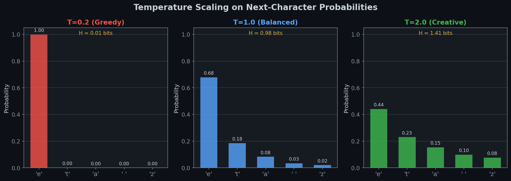
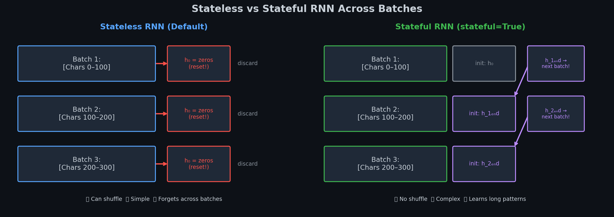

# 🔤 Module 1: Character RNNs and Text Generation
> **Ch. 16 — Hands-On ML with Scikit-Learn, Keras & TensorFlow (Aurélien Géron)**

---

## 📌 Table of Contents
1. [🌍 The Big Picture: What Are We Building?](#big-picture)
2. [📝 Step 0: Encode Text as Numbers](#encoding)
3. [🗃️ Step 1: Create a Windowed Dataset](#windowing)
4. [🏗️ Step 2: Build the Char-RNN Model](#model)
5. [🎲 Step 3: Generate Text with Temperature](#temperature)
6. [💾 Step 4: Stateful vs Stateless RNNs](#stateful)
7. [❌ Common Beginner Mistakes](#mistakes)
8. [🎤 Interview Q&A](#interview)
9. [⚡ Flash Card Cheat Sheet](#revision)

---

## 🌍 The Big Picture: What Are We Building? {#big-picture}

We want to teach a neural network to write like Shakespeare — character by character.

**The Core Idea:**
> Train a model to predict "given this sequence of characters, what comes next?"
> Then feed its output back as input to generate text forever.

**Intuition with numbers:**
Suppose Shakespeare's full text has **1 million characters**, and our vocabulary is **39 unique characters** (a–z, spaces, punctuation). We slice the text into thousands of overlapping windows, each 100 chars long:

```
Window 1: "To be or not to be, t"  →  Target: "o be or not to be, th"
Window 2: "o be or not to be, th"  →  Target: " be or not to be, tha"
...
```

The model trains to predict the next character at **every single position**. After 20 epochs, it internalizes the statistical patterns of Shakespearean English.


> 📊 **Graph 01:** At each time step $t$, the RNN cell receives character $X_t$ (encoded as an ID) and the previous hidden state $h_{t-1}$. It outputs a probability distribution over all 39 possible next characters $y_t$.

---

## 📝 Step 0: Encode Text as Numbers {#encoding}

Neural networks cannot process raw text. Every character must be mapped to an integer ID.

**Concrete Example:**

| Character | Integer ID |
|-----------|-----------|
| `a` | 0 |
| `b` | 1 |
| ... | ... |
| `z` | 25 |
| ` ` (space) | 26 |
| `,` | 27 |
| `.` | 28 |
| `!` | 29 |
| `?` | 30 |
| ... | ... |

The full text of *Romeo and Juliet* (~145,000 characters) becomes a 1D array of integers:

```python
import tensorflow as tf

# Full text of Shakespeare
shakespeare_url = "https://homl.info/shakespeare"
filepath = tf.keras.utils.get_file("shakespeare.txt", shakespeare_url)
with open(filepath) as f:
    shakespeare_text = f.read()

# Example snippet of text:
print(shakespeare_text[:80])
# → "First Citizen:\nBefore we proceed any further, hear me speak.\n\nAll:\nSpeak, speak"

# All unique characters
tokenizer = tf.keras.preprocessing.text.Tokenizer(char_level=True)
tokenizer.fit_on_texts([shakespeare_text])

# Vocabulary size
print(len(tokenizer.word_index))  # → 39

# Encode full text
encoded = tf.cast(
    tokenizer.texts_to_sequences([shakespeare_text])[0],
    tf.int32
)
# encoded is now a 1D int tensor of length ~1,115,394

print(encoded[:10].numpy())    # → [20, 6, 16, 8, 20, 1, 3, 6, 20, 2]
```

**Key insight:** Each unique character now lives in a 1D space. The RNN will later learn to embed these into 16D dense vectors.

---

## 🗃️ Step 1: Create a Windowed Dataset {#windowing}

We cannot feed the entire 1M character sequence to a network (it would need to backpropagate through 1M timesteps). We create overlapping windows.


> 📊 **Graph 02:** Windowing splits the long sequence into overlapping sub-sequences of length `n_steps+1`. Each window is split: first `n_steps` chars are the input X; last `n_steps` chars are the target y (shifted by 1 position).

**Numerical Walk-Through (small example with n_steps=5):**

```
Full text: "To be or not to be"
Indices:    4  2 26  5 ... 

Window 1 (length=6): [4, 2, 26, 5, 3, 26]
  Input  X: [4, 2, 26, 5, 3]   → "To be"
  Target y: [2, 26, 5, 3, 26]  → "o be " (shifted by 1!)

Window 2 (length=6): [2, 26, 5, 3, 26, 2]
  Input  X: [2, 26, 5, 3, 26]  → "o be "
  Target y: [26, 5, 3, 26, 2]  → " be o"
```

Notice: **y is always X shifted right by 1 position.** The loss is computed at every time step!

```python
n_steps = 100
window_length = n_steps + 1   # +1 because y is X shifted by 1

# Step 1: Slice the big 1D tensor into overlapping windows
dataset = tf.data.Dataset.from_tensor_slices(encoded)
dataset = dataset.window(window_length, shift=1, drop_remainder=True)
# At this point: dataset contains "nested" datasets. We need to flatten them.

# Step 2: Convert nested datasets to flat tensors
dataset = dataset.flat_map(lambda window: window.batch(window_length))
# Now each element is a tensor of shape [101]

# Step 3: SHUFFLE before splitting into X, y (critical for stochastic gradient descent)
dataset = dataset.shuffle(10000).batch(32)

# Step 4: Split into (X, y) pairs
dataset = dataset.map(lambda windows: (windows[:, :-1], windows[:, 1:]))
# X shape: [batch=32, time=100]  y shape: [batch=32, time=100]

# Step 5: One-hot encode the inputs
dataset = dataset.map(
    lambda X_batch, y_batch: (tf.one_hot(X_batch, depth=vocab_size), y_batch)
)

# Step 6: Prefetch to overlap CPU/GPU work
dataset = dataset.prefetch(1)
```

**What does `flat_map` do?**

| Step | Shape of Data | Explanation |
|------|--------------|-------------|
| `from_tensor_slices` | scalar elements | Individual character IDs |
| `.window(101, shift=1)` | Nested `Dataset<Dataset<int>>` | Each element is a mini-dataset of 101 elements |
| `.flat_map(lambda w: w.batch(101))` | `Tensor[101]` | Convert each mini-dataset into a flat tensor |
| `.batch(32)` | `Tensor[32, 101]` | Group into batches |
| `.map((X,y) split)` | `(Tensor[32,100], Tensor[32,100])` | Separate inputs and targets |

---

## 🏗️ Step 2: Build the Char-RNN Model {#model}

**Architecture Overview:**

```
Input Shape: [batch_size=32, time_steps=100]
       │
Embedding(39, 16)  → [32, 100, 16]   ← Each of 39 chars becomes 16D vector
       │
GRU(128, return_sequences=True) → [32, 100, 128]  ← Hidden state at every step
       │
GRU(128, return_sequences=True) → [32, 100, 128]  ← Stack deeper for complexity
       │
TimeDistributed(Dense(39, softmax)) → [32, 100, 39]  ← 39 class probs at each step
       │
Output: Probability distribution over next character, for all 100 positions!
```

**Why `TimeDistributed(Dense)`?**

`Dense(39)` applied normally would only work on the last dimension. `TimeDistributed` applies the SAME dense layer independently at EVERY time step. This means we compute loss at all 100 positions simultaneously — 100x more gradient signal per batch!

```python
from tensorflow import keras

vocab_size = 39
embed_size = 16

model = keras.models.Sequential([
    # Optional: Embedding layer (instead of one-hot encoding)
    keras.layers.Lambda(lambda x: tf.one_hot(x, depth=vocab_size)),  
    # Or: keras.layers.Embedding(vocab_size, embed_size, input_shape=[None])
    
    keras.layers.GRU(128, return_sequences=True, dropout=0.2),
    keras.layers.GRU(128, return_sequences=True),
    
    keras.layers.TimeDistributed(
        keras.layers.Dense(vocab_size, activation="softmax")
    )
])

model.compile(
    loss="sparse_categorical_crossentropy",
    optimizer=keras.optimizers.Adam(lr=0.001)
)

history = model.fit(dataset, epochs=20)
```

**GRU Equations (what's happening inside each cell):**

At each time step $t$, the GRU computes:
$$z_t = \sigma(W_z x_t + U_z h_{t-1} + b_z) \quad \text{Update gate}$$
$$r_t = \sigma(W_r x_t + U_r h_{t-1} + b_r) \quad \text{Reset gate}$$
$$\tilde{h}_t = \tanh(W_h x_t + U_h (r_t \odot h_{t-1}) + b_h) \quad \text{Candidate hidden state}$$
$$h_t = (1 - z_t) \odot h_{t-1} + z_t \odot \tilde{h}_t \quad \text{Final hidden state}$$

Where:
- $\sigma$ = sigmoid (outputs 0-1 for gating)
- $z_t$ = update gate (0=keep old state, 1=take new candidate)
- $r_t$ = reset gate (0=forget past when computing candidate)
- $\odot$ = element-wise multiplication

**Parameter count for our model:**
| Layer | Parameters |
|-------|-----------|
| Embedding(39, 16) | 39 × 16 = **624** |
| GRU(128) input=16 | 3 × (128 × 16 + 128 × 128 + 128) = **61,952** |
| GRU(128) input=128 | 3 × (128 × 128 + 128 × 128 + 128) = **99,072** |
| Dense(39) | 128 × 39 + 39 = **5,031** |
| **Total** | **~166,679 parameters** |

---

## 🎲 Step 3: Generate Text with Temperature {#temperature}

After training, we generate text by repeatedly asking the model "what comes next?"

**The Problem with Greedy Decoding:**

```python
# WRONG approach (greedy):
next_char = tf.argmax(predictions, axis=-1)
# Always picks the SINGLE most likely char.
# Result: "to be to be to be to be to be to be" (stuck in loops!)
```

**Solution: Temperature Scaling + Random Sampling**


> 📊 **Graph 03:** Effect of temperature on the probability distribution for next character. Low $\tau$ makes the model "confident" (one dominant peak). High $\tau$ flattens all probabilities, increasing creativity at the cost of coherence.

**Numerical Example:**

Suppose the model's raw logits for the next character after "To b" are:
```
Character:  'a'  'e'  'i'  'o'  ' '   others
Raw logits: [0.1, 3.2, 0.5, 1.2, 1.8,   ...]
```

**With Temperature $\tau = 1.0$ (standard):**
$$\hat{p}_i = \frac{e^{z_i / 1.0}}{\sum_j e^{z_j / 1.0}}$$
```
After softmax: P('e') ≈ 0.75, P(' ') ≈ 0.12, P('o') ≈ 0.08 ...
→ Model almost always picks 'e'. Gets repetitive.
```

**With Temperature $\tau = 0.5$ (sharper/more confident):**
$$\hat{p}_i = \frac{e^{z_i / 0.5}}{\sum_j e^{z_j / 0.5}}$$
```
After rescaling: P('e') ≈ 0.98, all others ≈ 0.02
→ Almost always 'e'. Very predictable.
```

**With Temperature $\tau = 2.0$ (flatter/more creative):**
$$\hat{p}_i = \frac{e^{z_i / 2.0}}{\sum_j e^{z_j / 2.0}}$$
```
After rescaling: P('e') ≈ 0.40, P(' ') ≈ 0.20, P('o') ≈ 0.15 ...
→ Much more varied. Could output any of the top candidates.
```

**The Math Why:**
Dividing by $\tau > 1$ makes all logits smaller → softmax becomes more uniform (higher entropy).
Dividing by $\tau < 1$ makes all logits bigger → softmax becomes more peaked (lower entropy).

**Complete Text Generation Function:**

```python
import numpy as np

def preprocess(texts, tokenizer):
    """Convert text to a padded sequence of integer IDs."""
    X = np.array(tokenizer.texts_to_sequences(texts))
    return X

def next_char(model, tokenizer, text, temperature=1.0):
    """Predict the single next character after `text`."""
    X_new = preprocess([text], tokenizer)
    y_proba = model.predict(X_new)[0, -1, :]   # Probabilities for very last position
    
    # Apply temperature: rescale logits before sampling
    rescaled_logits = tf.math.log(y_proba + 1e-8) / temperature
    char_id = tf.random.categorical([rescaled_logits], num_samples=1)
    
    # Convert ID back to character
    return tokenizer.sequences_to_texts(char_id.numpy())[0]

def generate_text(model, tokenizer, seed, n_chars=300, temperature=1.0):
    """Generate `n_chars` characters starting from `seed`."""
    generated = seed
    for _ in range(n_chars):
        generated += next_char(model, tokenizer, generated, temperature)
    return generated

# Example outputs at different temperatures:
print("Temperature 0.5 (Greedy-ish):")
print(generate_text(model, tokenizer, "To be or ", temperature=0.5))
# → "To be or not to be, that is the question, whether 'tis nobler in the mind..."

print("\nTemperature 2.0 (Creative/Chaotic):")
print(generate_text(model, tokenizer, "To be or ", temperature=2.0))
# → "To be or the! fair; from wove light thither not 'tis yet... "
```

---

## 💾 Step 4: Stateful vs Stateless RNNs {#stateful}

**The core difference** is whether the RNN "remembers" across batches:


> 📊 **Graph 04:** Stateless RNN resets to $h_0 = \mathbf{0}$ at every batch. Stateful RNN passes the final state $h_{end}$ of batch $i$ as the initial state of batch $i+1$. This allows learning patterns longer than the window size.

**Stateless (Default):**
```
Batch 1: Text[0:100]   →  h_0 = zeros  →  Train  →  discard h_100
Batch 2: Text[100:200] →  h_0 = zeros  →  Train  →  discard h_200
```

**Stateful:**
```
Batch 1: Text[0:100]   →  h_0 = zeros  →  Train  →  SAVE h_100
Batch 2: Text[100:200] →  h_0 = h_100  →  Train  →  SAVE h_200
```

**The Critical Constraint:** Because hidden states map 1-to-1 between batches, **you cannot shuffle**. If batch 2 is at a random position, the saved hidden state from batch 1 is meaningless noise.

**Creating a Stateful Dataset:**

For a batch_size=32, we must split the text into 32 equal consecutive segments. The $i^{th}$ window in batch 2 must immediately follow the $i^{th}$ window in batch 1.

```python
# 1. Split text into 32 non-overlapping segments
total_length = len(encoded)
batch_size = 32
seg_len = total_length // batch_size          # Length of each segment
segments = [encoded[i*seg_len:(i+1)*seg_len]  # 32 segments
            for i in range(batch_size)]

# 2. Create non-shuffled, consecutive windows from each segment
# This ensures batch alignment is maintained!
```

**Keras Stateful Model:**

```python
model = keras.models.Sequential([
    keras.layers.GRU(
        128,
        return_sequences=True,
        stateful=True,                         # ← KEY: preserve state across batches
        batch_input_shape=[32, None, vocab_size]  # ← batch_size MUST be fixed!
    ),
    keras.layers.GRU(128, return_sequences=True, stateful=True),
    keras.layers.TimeDistributed(
        keras.layers.Dense(vocab_size, activation="softmax")
    )
])

# MANDATORY: Reset state at end of EVERY epoch
class ResetStatesCallback(keras.callbacks.Callback):
    def on_epoch_begin(self, epoch, logs=None):
        self.model.reset_states()
        print(f"\nReset states at start of epoch {epoch}")

model.compile(loss="sparse_categorical_crossentropy", optimizer="adam")
model.fit(dataset_stateful, epochs=20, callbacks=[ResetStatesCallback()])
```

| Feature | Stateless | Stateful |
|---------|-----------|----------|
| State reset | Every batch | Every epoch (manual) |
| Dataset shuffling | ✅ Required (for generalization) | ❌ MUST NOT shuffle |
| Batch size | Flexible | Fixed — must match `batch_input_shape` |
| Learns patterns longer than window | ❌ No | ✅ Yes |
| Code complexity | Simple | High |
| Use case | Short text, fast prototyping | Long text, theoretical max performance |

---

## ❌ Common Beginner Mistakes {#mistakes}

**1. Shuffling with a Stateful RNN** ❌
```python
# WRONG — shuffling breaks sequential alignment:
dataset = dataset.shuffle(10000)  # ← NEVER do this with stateful=True

# CORRECT — no shuffle at all:
# (Accept that training won't generalize as well without shuffling)
```

**2. Forgetting `batch_input_shape` in Stateful RNNs** ❌
```python
# WRONG — no fixed batch size:
keras.layers.GRU(128, stateful=True, input_shape=[None, 39])

# CORRECT — batch size is explicitly part of the shape:
keras.layers.GRU(128, stateful=True, batch_input_shape=[32, None, 39])
# Keras creates ONE state tensor per sample in the batch (32 state tensors)
```

**3. Greedy argmax generation = boring looping text** ❌
```python
# WRONG — argmax:
next_id = tf.argmax(probs, axis=-1)  # Always the peak

# CORRECT — temperature sampling:
next_id = tf.random.categorical(tf.math.log(probs)/temperature, num_samples=1)
```

**4. Not using `return_sequences=True` in stacked RNNs** ❌
```python
# WRONG — first GRU only outputs [batch, 128] (just the final state):
keras.layers.GRU(128),            # outputs [32, 128]
keras.layers.GRU(128),            # expects [32, 128] but this layer needs a sequence!

# CORRECT — every intermediate RNN layer outputs full sequence:
keras.layers.GRU(128, return_sequences=True),   # outputs [32, 100, 128]
keras.layers.GRU(128, return_sequences=True),   # takes [32, 100, 128] as input
```

---

## 🎤 Interview Q&A {#interview}

**Q1: What is the purpose of Temperature in text generation?**
> **A:** Temperature $\tau$ rescales the logits before softmax: $\hat{p}_i = e^{z_i/\tau} / \sum e^{z_j/\tau}$. 
> - $\tau \to 0$: Deterministic (always pick argmax). Repetitive but coherent.
> - $\tau = 1$: Standard softmax. Balanced creativity/coherence.
> - $\tau > 1$: Flatter distribution. More creative but more spelling errors.
> It prevents the model getting stuck in repetitive loops while still allowing control over creativity.

**Q2: Explain the `flat_map()` step in the windowed dataset creation.**
> **A:** `dataset.window(n, shift=1)` creates a "dataset of nested datasets" — each element is itself a small dataset of n elements. You cannot batch nested datasets directly. `flat_map(lambda w: w.batch(n))` converts each nested dataset into a flat tensor of shape `[n]`, which can then be batched normally. Think of it as "flattening one level of nesting."

**Q3: How does a Stateful RNN differ from Stateless during training?**
> **A:** Stateless: hidden state is reset to zero vectors at the beginning of every batch. Great for parallel computation, requires shuffling for generalization. Stateful: the hidden state from the END of batch $i$ becomes the INITIAL state of batch $i+1$. This allows learning temporal patterns longer than the window size. The downside: batches must be fed strictly in sequential order (no shuffling), and the batch size must be fixed.

---

## ⚡ Flash Card Cheat Sheet {#revision}

```
╔═══════════════════════════════════════════════════════════════════════╗
║          MODULE 1 CHEAT SHEET: CHAR-RNNs & TEXT GENERATION            ║
╠═══════════════════════════════════════════════════════════════════════╣
║                                                                         ║
║  1. DATA PREPARATION:                                                   ║
║     Text → Integer IDs via tokenizer.texts_to_sequences()              ║
║     Window(n+1, shift=1) → flat_map(batch(n+1)) → shuffle → batch     ║
║     Split: X = window[:-1], y = window[1:] (shifted by 1!)            ║
║                                                                         ║
║  2. ARCHITECTURE:                                                       ║
║     Embedding(vocab, dim) → GRU(128, retseq=True) → GRU(128, retseq)  ║
║     → TimeDistributed(Dense(vocab, softmax))                            ║
║     Loss computed at EVERY time step (dense supervision)               ║
║                                                                         ║
║  3. TEMPERATURE SAMPLING:                                               ║
║     p_i = exp(logit_i / T) / Σ exp(logit_j / T)                        ║
║     T < 1.0 → Sharp (confident) → Repetitive                           ║
║     T = 1.0 → Standard softmax                                          ║
║     T > 1.0 → Flat (uncertain) → Creative but noisy                    ║
║     Use: tf.random.categorical(log_probs / T, num_samples=1)           ║
║                                                                         ║
║  4. STATEFUL RNN RULES:                                                 ║
║     stateful=True → batch_input_shape=[N, None, vocab] REQUIRED        ║
║     ❌ NEVER shuffle a stateful dataset                                 ║
║     ✅ ALWAYS reset_states() at start of each epoch via Callback       ║
║                                                                         ║
╚═══════════════════════════════════════════════════════════════════════╝
```

---

---

**🔗 Previous Module →** [Back to Chapter Index](../notes.md)  
**🔗 Next Module →** [02_Sentiment_Analysis_and_Word_Embeddings.md](02_Sentiment_Analysis_and_Word_Embeddings.md)
