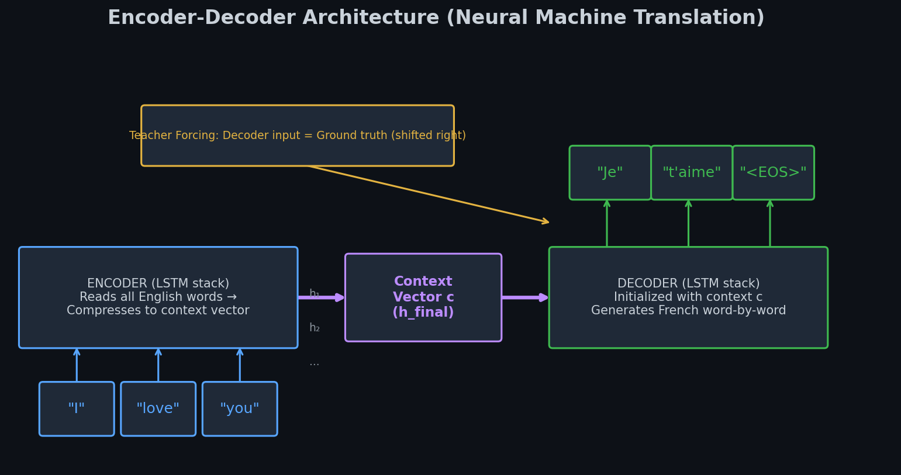
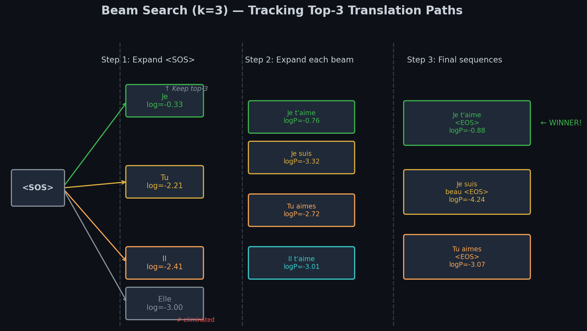

# 🌐 Module 3: Encoder-Decoder Networks and Neural Machine Translation
> **Ch. 16 — Hands-On ML with Scikit-Learn, Keras & TensorFlow (Aurélien Géron)**

---

## 📌 Table of Contents
1. [🌍 The Big Picture: Sequence-to-Sequence Tasks](#big-picture)
2. [🚦 Why a Standard RNN Can't Do Translation](#standard-fails)
3. [🏗️ The Encoder-Decoder Architecture: Step by Step](#architecture)
4. [👨‍🏫 Teacher Forcing: Stable Training](#teacher-forcing)
5. [🔮 Inference: Generating the Translation](#inference)
6. [🔦 Beam Search: Smarter Decoding with Numbers](#beam-search)
7. [💻 Full Keras Implementation](#keras-impl)
8. [❌ Common Beginner Mistakes](#mistakes)
9. [🎤 Interview Q&A](#interview)
10. [⚡ Flash Card Cheat Sheet](#revision)

---

## 🌍 The Big Picture: Sequence-to-Sequence Tasks {#big-picture}

An Encoder-Decoder network maps a **variable-length input sequence** to a **variable-length output sequence**. The input and output can differ in length, word order, and vocabulary.

**Applications:**
| Task | Input | Output |
|------|-------|--------|
| Machine Translation | "I love you" (EN, 3 words) | "Je t'aime" (FR, 2 words) |
| Text Summarization | 500-word article | 3-sentence summary |
| Question Answering | Passage + Question | 1-sentence answer |
| Speech Recognition | Audio waveform (2000 ms) | "Hello World" (2 words) |

**The Key Challenge:**
Input length ≠ Output length, and word order can be **completely different** between languages.

```
English: "The cat sat on the mat"     (6 words, Subject-Verb pattern)
French:  "Le chat s'est assis sur le tapis"  (7 words)
Spanish: "El gato se sentó en la alfombra"   (7 words, but adjective order flips)
German:  "Die Katze saß auf der Matte"       (6 words, verb at end in complex sentences)
```

---

## 🚦 Why a Standard RNN Can't Do Translation {#standard-fails}

**Option A: Many-to-Many RNN (synchronized):**

```
Time:    t=1   t=2    t=3    t=4
Input:  [Je] [t'aime] [X]   [X]     ← French input
Output: [I]  [love]   [you] [X]     ← English output
```

**Problem:** The model must output English word 1 while STILL reading French word 1. It cannot wait to "see" the full French sentence before translating. 

- French "Je ne mange pas" → "I don't eat" (order: I, don't, eat)
- But French grammar is: Subject-Negation-Verb-Negation ("Je ne mange pas")
- Without seeing the WHOLE input, the model cannot know that "ne" means this is a negative sentence!

**Option B: Many-to-One then One-to-Many:**

```
Encoder Phase: Read "Je t'aime" → context vector c
Decoder Phase: c → "I love you"
```

This works! The Encoder first reads the ENTIRE input, then the Decoder generates the translation.

---

## 🏗️ The Encoder-Decoder Architecture: Step by Step {#architecture}


> 📊 **Graph 06:** The Encoder reads the source sentence and compresses it into the Context Vector (the final hidden state). The Decoder uses the context vector as its starting memory and generates the translated sentence word by word.

### Phase 1: The Encoder

**Input:** English sentence "I love you" → token IDs: `[3, 18, 12]`

The Encoder is a standard LSTM/GRU. It processes each word and updates its hidden state:

```
Initial state:  h_0 = [0, 0, ..., 0]  (zeros, shape: 256D)

Step 1: h_1 = LSTM(embed("I"),    h_0)  → [0.12, -0.45, ...]  (256D)
Step 2: h_2 = LSTM(embed("love"), h_1)  → [0.82,  0.31, ...]  (256D)
Step 3: h_3 = LSTM(embed("you"),  h_2)  → [0.67, -0.12, ...]  (256D)
```

We throw away `h_1` and `h_2`. **Only `h_3` (the final state) is kept.** This is the **Context Vector** `c`.

> **Intuition:** `h_3` is like a summary note that the Encoder passes to the Decoder saying *"This was a sentence expressing loving affection toward someone."*

### Phase 2: The Decoder

The Decoder is initialized with `c = h_3` as its starting state. It then generates words in the target language one at a time.

```
Initial state: s_0 = c = h_3 (from Encoder!)

Step 1: Input = <SOS> token
        Probs = softmax(Dense(LSTM(<SOS>, s_0)))
        → {'Je': 0.72, 'Tu': 0.11, 'Il': 0.08, ...}
        → Select "Je"

Step 2: Input = embed("Je")
        Probs = softmax(Dense(LSTM(embed("Je"), s_1)))
        → {"t'aime": 0.65, "suis": 0.12, "vais": 0.09, ...}
        → Select "t'aime"

Step 3: Input = embed("t'aime")
        Probs = softmax(Dense(LSTM(embed("t'aime"), s_2)))
        → {"<EOS>": 0.89, "bien": 0.06, ...}
        → Select "<EOS>" → STOP
```

**Final output:** "Je t'aime" ✅

**The information bottleneck:**
The entire meaning of "I love you" is compressed into a 256D vector. For short sentences, this works well. For 50-word sentences, critical information from the beginning gets washed out by the time the encoder reads the end.

---

## 👨‍🏫 Teacher Forcing: Stable Training {#teacher-forcing}

**The Problem Without Teacher Forcing:**

```
Target:  "Je t'aime <EOS>"
Step 1: Model inputs <SOS>, predicts "Tu" (WRONG! should be "Je")
Step 2: Model inputs "Tu", predicts "veux" (another wrong word, compounding the error!)
Step 3: Model inputs "veux", predicts "pas" (garbage input → garbage output)
```

Each mistake cascades into the next step. The model never gets clean input, making training unstable and slow.

**Teacher Forcing Solution:**

During training, we **IGNORE the model's own predictions** and always feed it the **ground truth previous word**.

```
Target sequence: "Je t'aime <EOS>"
Decoder inputs:  "<SOS> Je t'aime"   ← This is just target, shifted right by 1!
Decoder targets: "Je t'aime <EOS>"   ← What we want the decoder to predict
```

```
Step 1: Input = <SOS>       → Target = "Je"     → Loss computed
Step 2: Input = "Je"        → Target = "t'aime" → Loss computed
Step 3: Input = "t'aime"    → Target = "<EOS>"  → Loss computed
```

Even if step 1 is wrong, step 2 gets the correct "Je" input. Training is fast and stable.

**The Shift Trick:**

```
Full target string:    <SOS> Je t'aime <EOS>
Decoder input  (X_d): <SOS> Je t'aime        (all except last token)
Decoder target (y_d):       Je t'aime <EOS>  (all except first token)
```

These are the same sequence, offset by 1. Very easy to create:
```python
# decoder_input  = target_seq[:, :-1]   # everything EXCEPT last token
# decoder_target = target_seq[:, 1:]    # everything EXCEPT first token
```

---

## 🔮 Inference: Generating the Translation {#inference}

At inference time, we have NO ground truth. We must decode step-by-step:

```python
def decode_sequence(input_seq, encoder_model, decoder_model, 
                    target_tokenizer, max_len=50):
    """
    input_seq: shape [1, input_len]
    """
    # Step 1: Encode the input sentence → get context vector
    states_value = encoder_model.predict(input_seq)  # → [h_state, c_state] for LSTM
    
    # Step 2: Initialize decoder with <SOS> token
    target_seq = np.array([[target_tokenizer.word_index["<SOS>"]]])  # shape: [1, 1]
    
    translation = []
    stop = False
    
    while not stop:
        # Step 3: Decode one step
        output_tokens, h, c = decoder_model.predict([target_seq] + states_value)
        
        # Step 4: Sample a token
        sampled_idx = np.argmax(output_tokens[0, -1, :])   # Greedy decoding
        sampled_word = target_tokenizer.index_word.get(sampled_idx, "<UNK>")
        
        if sampled_word == "<EOS>" or len(translation) > max_len:
            stop = True
        else:
            translation.append(sampled_word)
        
        # Step 5: Feed sampled token back as next input
        target_seq = np.array([[sampled_idx]])
        states_value = [h, c]   # Update decoder states
    
    return " ".join(translation)

print(decode_sequence([[3, 18, 12]]))
# → "Je t'aime"
```

---

## 🔦 Beam Search: Smarter Decoding with Numbers {#beam-search}

**Greedy Decoding Problem:**

```
Step 1: Best word is "Je" (prob = 0.72)
         → But what if "Je suis" (0.72 × 0.05 = 0.036) is globally much worse
         → than "Tu aimes" (0.11 × 0.60 = 0.066)?
```

Greedy decoding picks "Je" at step 1, commits to it, and may produce a suboptimal sentence.

**Beam Search with k=3:**


> 📊 **Graph 07:** Beam Search with k=3. At each step, we keep the top-k partial sequences. We expand EACH of the k sequences into the full vocabulary, compute joint probabilities, and keep only the top-k new sequences.

**Step-by-step with real numbers (k=3):**

```
Start: <SOS>

STEP 1: Expand <SOS> → evaluate all vocab words
  Probabilities:
  <SOS> "Je"     : P=0.72  (log: -0.33)
  <SOS> "Tu"     : P=0.11  (log: -2.21)
  <SOS> "Il"     : P=0.08  (log: -2.53)
  <SOS> "Elle"   : P=0.06  (log: -2.81)
  ...
  
  Keep TOP 3: ["Je", "Tu", "Il"]
  Beam scores: [-0.33, -2.21, -2.53]

STEP 2: Expand EACH of the 3 beams → 3 × vocab_size candidates
  From "Je":   "Je t'aime": 0.72×0.65=0.47 (log: -0.76)
               "Je suis"  : 0.72×0.05=0.04 (log: -3.22)
               "Je vais"  : 0.72×0.03=0.02 (log: -3.91)
               ...
  From "Tu":   "Tu t'aimes": 0.11×0.50=0.06 (log: -2.81)
               "Tu es"     : 0.11×0.30=0.03 (log: -3.51)
               ...
  From "Il":   "Il t'aime" : 0.08×0.55=0.04 (log: -3.22)
               ...

  Keep TOP 3: 
  1. "Je t'aime"  (log score: -0.76)
  2. "Tu t'aimes" (log score: -2.81)
  3. "Il t'aime"  (log score: -3.22)

STEP 3: Expand each beam again...
  From "Je t'aime":   "Je t'aime <EOS>": 0.47×0.89=0.42  ← strong candidate!
  From "Tu t'aimes":  ...
  From "Il t'aime":   ...

FINAL: Select sequence with highest total log-probability:
  "Je t'aime <EOS>"  →  log P = -0.76 + log(0.89) = -0.76 + (-0.12) = -0.88
```

**Why log probabilities?**

Multiplying many small probabilities causes numerical underflow:
$0.72 × 0.65 × 0.89 × 0.95 × ... = \text{infinitesimally small}$

Log converts multiplication to addition (no underflow):
$\log(0.72) + \log(0.65) + \log(0.89) + ... = -0.33 + (-0.43) + (-0.12) + ...$

**Length Penalty:**
Without it, Beam Search prefers SHORT sequences (fewer multiplications of < 1). 
Common fix: $\text{score} = \frac{\sum \log P}{L^\alpha}$ where $L$ is length and $\alpha \approx 0.7$.

---

## 💻 Full Keras Implementation {#keras-impl}

```python
from tensorflow import keras
import numpy as np

# Parameters
encoder_vocab = 5000    # Source language vocab size (English)
decoder_vocab = 5000    # Target language vocab size (French)
embed_dim = 256
latent_dim = 512        # LSTM hidden state size

# ════════════════════════════════════════════
# ENCODER
# ════════════════════════════════════════════
encoder_inputs = keras.layers.Input(shape=[None])
enc_emb = keras.layers.Embedding(encoder_vocab, embed_dim)(encoder_inputs)
_, state_h, state_c = keras.layers.LSTM(
    latent_dim, 
    return_state=True    # Returns: (output, final_h, final_c)
)(enc_emb)
encoder_states = [state_h, state_c]   # The Context Vector (for LSTM = 2 states)

# ════════════════════════════════════════════
# DECODER (training mode — uses teacher forcing)
# ════════════════════════════════════════════
decoder_inputs = keras.layers.Input(shape=[None])  # Teacher-forced targets
dec_emb_layer = keras.layers.Embedding(decoder_vocab, embed_dim)
dec_emb = dec_emb_layer(decoder_inputs)

dec_lstm = keras.layers.LSTM(latent_dim, return_sequences=True, return_state=True)
decoder_outputs, _, _ = dec_lstm(
    dec_emb,
    initial_state=encoder_states   # Initialize with encoder context!
)

dec_dense = keras.layers.Dense(decoder_vocab, activation="softmax")
decoder_probs = dec_dense(decoder_outputs)

# ════════════════════════════════════════════
# FULL TRAINING MODEL
# ════════════════════════════════════════════
model = keras.Model(
    inputs=[encoder_inputs, decoder_inputs],
    outputs=decoder_probs
)

model.compile(
    optimizer="adam",
    loss="sparse_categorical_crossentropy",
    metrics=["accuracy"]
)

# Training on (English_X, French_input), French_target
model.fit(
    [encoder_input_data, decoder_input_data],
    decoder_target_data,
    batch_size=64,
    epochs=100,
    validation_split=0.2
)
```

---

## ❌ Common Beginner Mistakes {#mistakes}

**1. Training model with teacher forcing but forgetting to build inference models** ❌
```python
# During training: encoder & decoder are fused in one model.
# During inference: you need SEPARATE encoder model and decoder model!

# Inference Encoder: just outputs the context states
encoder_model = keras.Model(encoder_inputs, encoder_states)

# Inference Decoder: takes states as INPUT (so you can pass them in a loop)
decoder_state_input_h = keras.layers.Input(shape=[latent_dim])
decoder_state_input_c = keras.layers.Input(shape=[latent_dim])
decoder_states_inputs = [decoder_state_input_h, decoder_state_input_c]

dec_emb2 = dec_emb_layer(decoder_inputs)
dec_outputs2, state_h2, state_c2 = dec_lstm(dec_emb2, initial_state=decoder_states_inputs)
dec_outputs2 = dec_dense(dec_outputs2)

decoder_model = keras.Model(
    [decoder_inputs] + decoder_states_inputs,
    [dec_outputs2, state_h2, state_c2]
)
```

**2. Expecting the Context Vector to remember long sentences** ❌
> Reality: Compressing a 50-word sentence into a 512D vector causes severe information loss. Words at the beginning of the sentence have passed through ~50 LSTM matrix multiplications. Their signal is dramatically attenuated. This is EXACTLY why Attention mechanisms were invented.

---

## 🎤 Interview Q&A {#interview}

**Q1: Explain Teacher Forcing and why it's needed.**
> **A:** Without teacher forcing, the untrained decoder makes mistakes early on. Since its own (wrong) predictions are fed as the next input, errors compound catastrophically — the decoder is essentially trying to learn from garbage inputs. Teacher forcing solves this by feeding the ground-truth previous token at each step during training. This stabilizes gradients and massively speeds up convergence. The cost: a training/inference mismatch (during inference, the model must use its own predictions, having never practiced this). Scheduled sampling is one mitigation strategy.

**Q2: Why do we use log probabilities in Beam Search instead of raw probabilities?**
> **A:** Multiplying many conditional probabilities (each < 1) leads to numerical underflow in floating point arithmetic. For example, $0.7^{50} \approx 1.8 \times 10^{-10}$, which rounds to 0.0 in float32. Taking the logarithm converts multiplication to addition: $\log \prod P_t = \sum \log P_t$, which remains numerically stable for any sequence length.

**Q3: What happens to performance as input sentence length increases in a standard Encoder-Decoder?**
> **A:** Performance degrades sharply. The context vector has fixed capacity (e.g., 512D). As sentence length grows, more information must be compressed into the same sized vector, causing information loss. Bahdanau (2015) showed in experiments that BLEU scores for a standard Encoder-Decoder plateau around 30 words then drop significantly for 40+ word sentences. With Attention, performance stays much more stable with length.

---

## ⚡ Flash Card Cheat Sheet {#revision}

```
╔═════════════════════════════════════════════════════════════════════════╗
║         MODULE 3 CHEAT SHEET: ENCODER-DECODER & TRANSLATION             ║
╠═════════════════════════════════════════════════════════════════════════╣
║                                                                           ║
║  ARCHITECTURE:                                                            ║
║  Encoder: Reads ALL input → discards intermediate states → keeps h_T    ║
║  Context Vector: h_T (512D) — single bottleneck vector                  ║
║  Decoder: Starts from h_T → generates one word per step until <EOS>    ║
║                                                                           ║
║  TEACHER FORCING (training):                                             ║
║  Decoder input  = <SOS> + target[:-1]   (ground truth shifted right)   ║
║  Decoder target = target[1:]             (ground truth shifted left)    ║
║  ✅ Stable gradients  ❌ Training/inference mismatch                   ║
║                                                                           ║
║  INFERENCE (greedy):                                                      ║
║  1. Encode input → get encoder states                                   ║
║  2. Input <SOS> to decoder                                              ║
║  3. Get prediction → feed back as next input                            ║
║  4. Repeat until <EOS>                                                  ║
║                                                                           ║
║  BEAM SEARCH (k=3):                                                      ║
║  Keep top-k partial sequences at each step.                             ║
║  Score = Σ log P(y_t | y_<t, X) — sum of log probabilities              ║
║  Add length penalty: score / L^α (α≈0.7) to avoid short-seq bias      ║
║                                                                           ║
╚═════════════════════════════════════════════════════════════════════════╝
```

---

---

**🔗 Previous Module →** [02_Sentiment_Analysis_and_Word_Embeddings.md](02_Sentiment_Analysis_and_Word_Embeddings.md)  
**🔗 Next Module →** [04_Attention_Mechanisms.md](04_Attention_Mechanisms.md)
