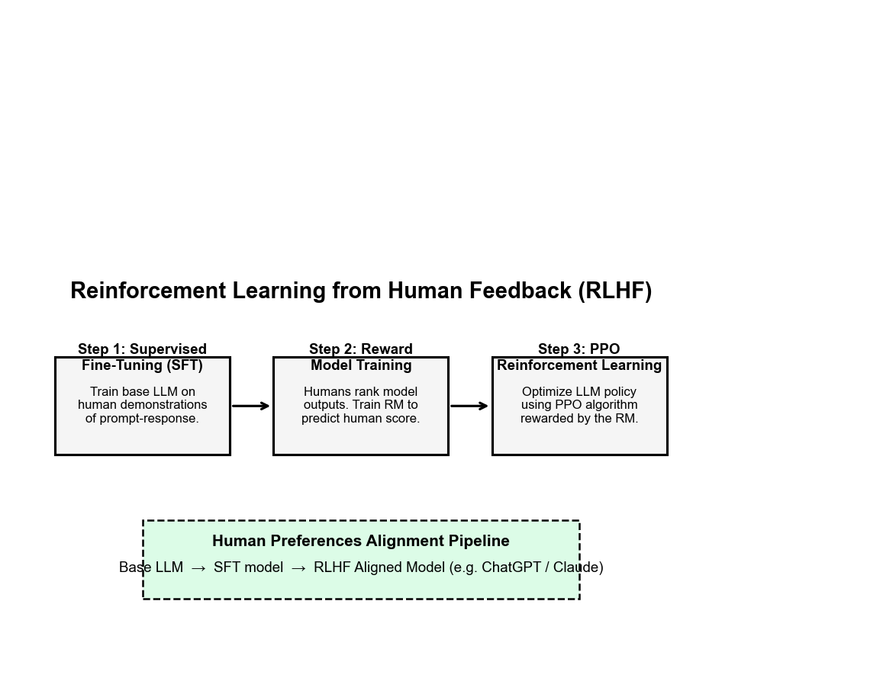
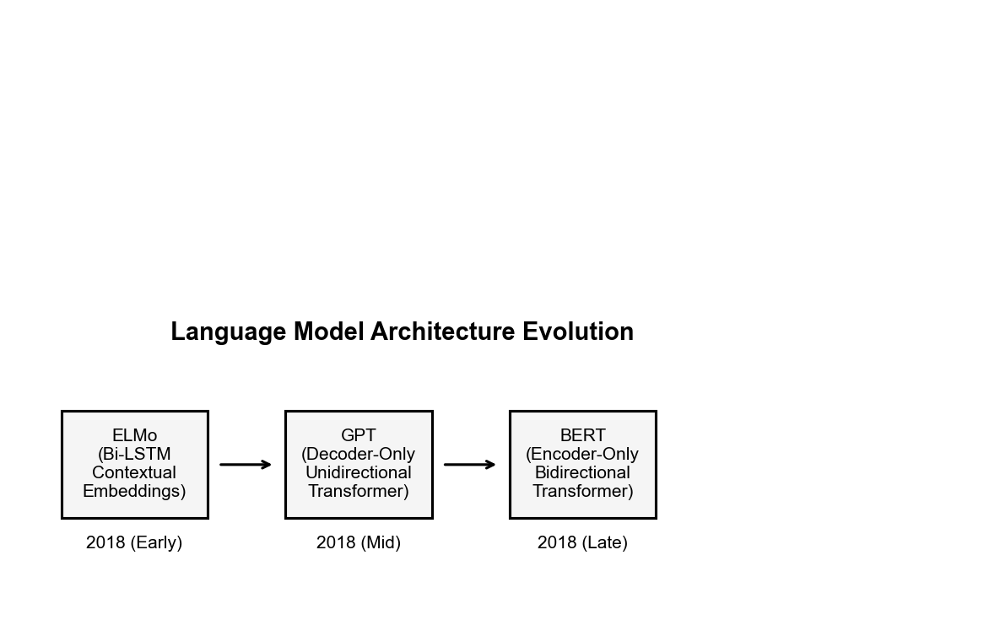
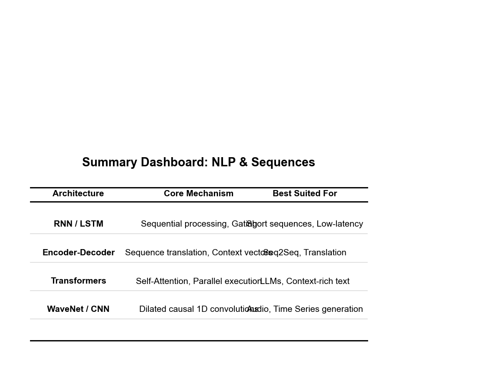

# 🚀 Module 6: Recent Innovations in Language Models (ELMo, GPT, BERT)
> **Ch. 16 — Hands-On ML with Scikit-Learn, Keras & TensorFlow (Aurélien Géron)**

---

## 📌 Table of Contents
1. [🌍 The Big Picture: The Pre-Training Revolution](#big-picture)
2. [❌ The Limitation of Static Embeddings (Word2Vec, GloVe)](#static-limit)
3. [🎭 ELMo — Contextual Embeddings from Bidirectional LSTMs](#elmo)
4. [🗣️ GPT — Generative Pre-Training with Decoder Transformers](#gpt)
5. [🔍 BERT — Bidirectional Encoder Representations](#bert)
6. [⚔️ GPT vs BERT: Side-by-Side Comparison](#comparison)
7. [💻 Using BERT in Practice (Fine-Tuning)](#fine-tune)
8. [❌ Common Beginner Mistakes](#mistakes)
9. [🎤 Interview Q&A](#interview)
10. [📈 Chapter 16 Summary Dashboard](#dashboard)
11. [⚡ Flash Card Cheat Sheet](#revision)

---

## 🌍 The Big Picture: The Pre-Training Revolution {#big-picture}

Before 2018: NLP models were trained from scratch on small task-specific datasets (50K examples). Top performance on GLUE benchmark: ~70%.

After 2018: Researchers discovered that training massive Transformers on **unlabelled text** (the entire internet) using self-supervised objectives, then fine-tuning on small labelled datasets, was dramatically better.

**The Pre-Training Revolution Timeline:**

| Year | Model | Architecture | Pre-training Task | Params | GLUE |
|------|-------|-------------|------------------|---------|-------|
| 2018 Q1 | **ELMo** | BiLSTM | Next/Prev word prediction | 93M | 70.0 |
| 2018 Q2 | **GPT-1** | Decoder Transformer | Next word prediction | 117M | 72.8 |
| 2018 Q4 | **BERT-base** | Encoder Transformer | MLM + NSP | 110M | 80.5 |
| 2018 Q4 | **BERT-large** | Encoder Transformer | MLM + NSP | 340M | 82.1 |
| 2019 | **GPT-2** | Decoder Transformer | Next word prediction | 1.5B | — |
| 2020 | **GPT-3** | Decoder Transformer | Next word prediction | 175B | 88.5 (few-shot) |
| 2022 | **InstructGPT / ChatGPT** | GPT-3 + RLHF | SFT + RLHF | 175B | — |
| 2023 | **GPT-4** | Decoder (multimodal) | Undisclosed | ~1T (est.) | 94.1 |
| 2023 | **LLaMA 2** | Decoder Transformer | Next word prediction | 7B–70B | ~86 |
| 2023 | **Gemini** | Multimodal Transformer | Undisclosed | Undisclosed | 90.0+ |
| 2024 | **Claude 3** | Decoder (Constitutional AI) | RLHF + CAI | Undisclosed | ~90+ |

> **The paradigm shift:** Instead of "design a smart model for each task", the new approach is "pre-train ONE large model on everything, then fine-tune."

> [!IMPORTANT]
> **Post-2020 Key Concepts (beyond the book):**
> - **RLHF (Reinforcement Learning from Human Feedback):** Used to align ChatGPT/InstructGPT. Human raters score model outputs; a reward model is trained; the LLM is fine-tuned using PPO to maximize reward.
> - **Instruction Tuning:** Fine-tuning on examples of (instruction → response) pairs, making models follow natural language directions.
> - **RAG (Retrieval-Augmented Generation):** Combines LLMs with external knowledge retrieval, giving models access to up-to-date information without retraining.
> - **LoRA (Low-Rank Adaptation):** Parameter-efficient fine-tuning that freezes most model weights and adds low-rank decomposition matrices, dramatically reducing fine-tuning cost.

---

## ❌ The Limitation of Static Embeddings (Word2Vec, GloVe) {#static-limit}

**Word2Vec/GloVe Problem — The "Bank" Example:**

```
Sentence A: "I went to the river bank to fish."
Sentence B: "I deposited money at the bank."

Word2Vec representation of "bank":
→ SAME VECTOR in both sentences!
→ Some average of "financial institution" and "riverbank"
→ Neither meaning is accurately represented!
```

**Concrete Numbers:**

If we look up the GloVe 100D vector for "bank":
```python
glove["bank"] = [0.42, -0.17, 0.83, ...]   # Static, fixed vector
# Doesn't know if it's a river bank or a financial bank!
```

The vector is the average of all uses of "bank" in the training corpus. For very polysemous words (words with multiple meanings), this average is poor for every specific meaning.

**Frequency also skews embeddings:**
- "like" appears in sentences like "I like dogs" and "She looks like her mother"
- The GloVe embedding blends both meanings, working well for neither

---

## 🎭 ELMo — Contextual Embeddings from Bidirectional LSTMs {#elmo}

**Paper:** *"Deep contextualized word representations"* — Peters et al., Allen AI, 2018

**Key Insight:** A word's meaning DEPENDS ON its context. Don't give words static vectors — compute their vectors dynamically from the surrounding context using a deep bidirectional LSTM.

**Architecture:**

```
Input: "I went to the river bank to fish"

Left-to-right LSTM (forward):
  h→_1 = LSTM_fwd(embed("I"),     h→_0)  → [...]
  h→_2 = LSTM_fwd(embed("went"),  h→_1)  → [...]
  ...
  h→_5 = LSTM_fwd(embed("bank"),  h→_4)  → captures "I went to the river" context

Right-to-left LSTM (backward):
  h←_9 = LSTM_bwd(embed("fish"),  h←_10) → [...]
  ...
  h←_5 = LSTM_bwd(embed("bank"),  h←_6)  → captures "to fish" context

ELMo embedding for "bank" = concat([h→_5, h←_5]) from ALL layers
                           = weighted combination of Layer 0, Layer 1, Layer 2 outputs
```

**Why 3 layers?**

Different layers capture different types of information:
- **Layer 0** (embedding layer): Pure syntactic information (word type, POS tags)
- **Layer 1** (first LSTM): Syntax-heavy (subject-verb, phrase structure)
- **Layer 2** (second LSTM): Semantics-heavy (word sense, co-reference)

ELMo LEARNS a weighted sum of all layer outputs for each downstream task!

**Numerical Example — "bank" disambiguation:**

```
Context A: "river bank"
  ELMo("bank") = 0.1 × Layer0 + 0.3 × Layer1 + 0.6 × Layer2
  → [0.71, -0.23, 0.55, ...]  ← "geographical feature" region of space

Context B: "bank account"  
  ELMo("bank") = 0.1 × Layer0 + 0.3 × Layer1 + 0.6 × Layer2
  → [-0.31, 0.82, -0.12, ...]  ← "financial institution" region of space

cosine_similarity("bank" in A, "bank" in B) ≈ 0.11   ← Very different! ✅
cosine_similarity("bank" GloVe, "bank" GloVe) = 1.0  ← Same vector 🚫
```

**Using ELMo as Features (no fine-tuning, just feature extraction):**
```python
import tensorflow_hub as hub

# Load pretrained ELMo from TF Hub
elmo = hub.load("https://tfhub.dev/google/elmo/3")

# Get embeddings for a batch of sentences
sentences = [
    "I went to the river bank to fish",
    "I deposited money at the bank"
]

# ELMo returns per-token 1024D vectors
embeddings = elmo(sentences, signature="default", as_dict=True)["elmo"]
print(embeddings.shape)   # → (2, 8, 1024)  — 8 tokens, each 1024D

bank_river   = embeddings[0, 5, :]  # "bank" in sentence 1, token index 5
bank_finance = embeddings[1, 6, :]  # "bank" in sentence 2, token index 6

cos_sim = tf.keras.losses.cosine_similarity(bank_river, bank_finance)
print(f"Similarity: {-cos_sim.numpy():.3f}")   # → ~0.11 (very different!)
```

---

## 🗣️ GPT — Generative Pre-Training with Decoder Transformers {#gpt}

**Paper:** *"Improving Language Understanding by Generative Pre-Training"* — Radford et al., OpenAI, 2018

**Core Architecture:** Stacked Transformer **Decoder** blocks (Decoder-only).

```
                Input: "The cat sat"
                     ↓
          Token Embeddings + Positional Encoding
                     ↓
          ┌────────────────────────┐
          │  Decoder Block 1       │
          │  Masked Self-Attention │ ← Can only look LEFT (past)
          │  FFN                   │
          └────────────────────────┘
                     ↓
          ┌────────────────────────┐
          │  Decoder Block 2       │
          │  Masked Self-Attention │
          │  FFN                   │
          └────────────────────────┘
                     ...× 12 blocks
                     ↓
          Softmax over vocabulary → P(next word)
```

**GPT-1 Specifications:**
- 12 Decoder blocks
- $d_{model} = 768$
- 12 attention heads
- $d_{ff} = 3072$ (feed-forward hidden size)
- Context window: 512 tokens
- Total parameters: **117 million**
- Pre-trained on BooksCorpus: **4.6 GB** of text, 800M+ words from 7,000 unpublished books

**Pre-Training Objective (Language Modeling = Predict Next Token):**

$$\mathcal{L} = -\sum_{i} \log P(u_i | u_{i-k}, ..., u_{i-1}; \Theta)$$

Where:
- $u_i$ = current token to predict
- $u_{i-k}, ..., u_{i-1}$ = context window of $k$ previous tokens
- $\Theta$ = model parameters

This is SELF-SUPERVISED — no human labels needed! Just raw text.

**Fine-Tuning for Downstream Tasks:**

```python
# Pre-trained GPT-1 base
gpt_base = load_pretrained_gpt()  # 12 Decoder blocks

# Task: Sentiment Classification
# Add a simple linear head on top of the final token's representation
sentiment_head = keras.layers.Dense(2, activation="softmax")(gpt_base.output[:, -1, :])

model = keras.Model(inputs=gpt_base.input, outputs=sentiment_head)

# Fine-tune objective (combined with a small language modeling penalty):
# L_total = L_classification + λ × L_language_model
# λ = 0.5 works well empirically
```

**GPT-2 (2019):** 1.5B parameters, trained on WebText (8M web pages). Zero-shot generalization — could answer questions, translate, summarize WITHOUT fine-tuning!

**GPT-3 (2020):** 175B parameters. Few-shot learning emerged as an ability — the model could perform tasks from just 3-5 examples shown in the prompt, no gradient updates needed.

### 🤖 InstructGPT & ChatGPT: The RLHF Alignment Phase
While GPT-3 was powerful, it was hard to control. It was trained to predict the next word on the internet, so a prompt like *"Write a Python script for binary search"* might result in a list of other coding exercises instead of the code itself!

To make LLMs helpful, honest, and harmless, researchers introduced **Reinforcement Learning from Human Feedback (RLHF)** to align them.


> 📊 **Graph 18:** The 3-step RLHF alignment process that transforms a raw language model into a conversational assistant.

1. **SFT (Supervised Fine-Tuning):** Human annotators write prompts and the ideal responses. The base model is fine-tuned on this high-quality dataset.
2. **Reward Model (RM) Training:** The SFT model generates multiple outputs for a prompt. Humans rank these outputs from best to worst. A separate neural network (the Reward Model) is trained to look at a prompt-response pair and predict the human rating score.
3. **PPO Reinforcement Learning:** The SFT model's policy is updated using Proximal Policy Optimization (PPO). It generates responses, the Reward Model scores them, and PPO updates the LLM's weights to maximize the predicted human score (with a KL-divergence penalty to ensure the model doesn't drift too far from the SFT base).

---

## 🔍 BERT — Bidirectional Encoder Representations from Transformers {#bert}

**Paper:** *"BERT: Pre-training of Deep Bidirectional Transformers for Language Understanding"* — Devlin et al., Google AI, 2018

**Core Architecture:** Stacked Transformer **Encoder** blocks (Encoder-only).

```
Input: "[CLS] The cat sat [MASK] the mat [SEP]"
                     ↓
          Token Embeddings + Segment Embeddings + Positional Encoding
                     ↓
          ┌────────────────────────────────────┐
          │  Encoder Block 1                    │
          │  UNMASKED Self-Attention            │ ← Can look LEFT AND RIGHT!
          │  FFN                                │
          └────────────────────────────────────┘
                     ...× 12 blocks (BERT-base)
                     ↓
          Contextual representations for every token
```

### Why Can't BERT Use Standard Next-Token Prediction?

If we tried to train BERT with "predict the next word": since BERT is bidirectional, word at position $t$ can see word at position $t+1$... and directly "copy" it as its prediction! The model learns nothing useful.

**BERT's Genius Solution: Masked Language Modeling (MLM)**

```
Original:   "The cat sat on the mat"
Masked:     "The cat [MASK] on the mat"     ← Replace 15% of tokens with [MASK]

Task: Predict the original token at [MASK] positions using ALL surrounding context.
```

**The 15% Rule (detailed breakdown):**
Of every token selected for replacement:
- **80%** of the time: Replace with `[MASK]` token → e.g., "sat" → `[MASK]`
- **10%** of the time: Replace with a RANDOM word → e.g., "sat" → "elephant"
- **10%** of the time: Keep the original word → e.g., "sat" → "sat"

**Why this 80/10/10 split?**
If we always used `[MASK]`, the model would learn to predict only when it sees `[MASK]`. But during fine-tuning and inference, there are NO `[MASK]` tokens! By sometimes keeping the original word or random words, the model learns to produce useful representations for ALL tokens.

**BERT's Second Training Task: Next Sentence Prediction (NSP)**

```
Input:  [CLS] "The man went to the store." [SEP] "He bought milk." [SEP]
Label: IsNextSentence (True)

Input:  [CLS] "The man went to the store." [SEP] "Penguins can't fly." [SEP]  
Label: NotNextSentence (False)
```

50% of training pairs are consecutive sentences, 50% are random pairs.

The `[CLS]` token's final representation is used to predict IsNext/NotNext. This teaches the model document-level coherence.

**BERT Specifications:**

| | BERT-base | BERT-large |
|-|-----------|------------|
| Encoder blocks | 12 | 24 |
| d_model | 768 | 1024 |
| Attention heads | 12 | 16 |
| FFN size | 3072 | 4096 |
| Parameters | **110M** | **340M** |
| Pre-training data | 16GB (Wikipedia + BooksCorpus) | Same |
| Training time | 4 days on 16 TPU v3 | 4 days on 64 TPU v3 |

---

## ⚔️ GPT vs BERT: Side-by-Side Comparison {#comparison}


> 📊 **Graph 14:** The divergence of pre-trained language models. GPT (Decoder-only, causal/autoregressive) excels at generation. BERT (Encoder-only, bidirectional) excels at understanding. Modern architectures like T5 use full Encoder-Decoder, while LLaMA/GPT-4 use scaled Decoder-only.

| Aspect | **GPT (Decoder-only)** | **BERT (Encoder-only)** |
|--------|----------------------|------------------------|
| Attention type | Masked (causal, left-to-right) | Unmasked (bidirectional) |
| Context | Past only ($t-1, t-2, ...$) | Past AND future ($t-k, ..., t+k$) |
| Pre-training | Next token prediction | Masked LM + Next Sentence Prediction |
| Generation | ✅ Native — just keep sampling | ❌ Not suitable |
| Classification | ✅ Add head to last token | ✅ Add head to [CLS] token |
| Token prediction | ✅ At every position | ✅ At every masked position |
| Computational cost | Lower (fewer operations per step) | Higher (bidirectional = full attention) |
| Best tasks | Chatbots, text generation, creative writing | Classification, NER, QA, semantic search |
| Flagship models | GPT-3, GPT-4, LLaMA, Mistral | BERT, RoBERTa, DistilBERT, ALBERT |

---

## 💻 Using BERT in Practice (Fine-Tuning) {#fine-tune}

BERT is available through the `transformers` library (Hugging Face).

**Full Fine-Tuning on IMDB Sentiment:**

```python
from transformers import BertTokenizer, TFBertForSequenceClassification
import tensorflow as tf

# Step 1: Load BERT tokenizer and model
tokenizer = BertTokenizer.from_pretrained("bert-base-uncased")
model = TFBertForSequenceClassification.from_pretrained(
    "bert-base-uncased",
    num_labels=2    # Binary classification: positive/negative
)

# Step 2: Tokenize inputs (BERT-specific format)
reviews = [
    "This movie was absolutely brilliant and moving!",
    "Terrible waste of time. Nothing made sense."
]

# BERT expects: [CLS] sentence [SEP] — tokenizer handles this automatically
encoded = tokenizer(
    reviews,
    max_length=128,
    padding="max_length",
    truncation=True,
    return_tensors="tf"
)

print(encoded["input_ids"][0][:10])
# → [101, 2023, 3185, 2001, 3756, 9895, 1998, 3048, 999, 102]
# 101 = [CLS], 102 = [SEP] (BERT's special tokens)

# Step 3: Fine-tune
optimizer = tf.keras.optimizers.Adam(learning_rate=2e-5)  # Very small LR!
loss = tf.keras.losses.SparseCategoricalCrossentropy(from_logits=True)

model.compile(optimizer=optimizer, loss=loss, metrics=["accuracy"])

# Format the data
train_dataset = tf.data.Dataset.from_tensor_slices((
    dict(encoded),     # {'input_ids': ..., 'attention_mask': ..., 'token_type_ids': ...}
    labels             # Ground truth labels [1, 0]
)).batch(16)

model.fit(train_dataset, epochs=3)
# Epoch 3: loss=0.12, accuracy=0.958   ← Excellent! On just 3 epochs!

# Step 4: Inference
test_reviews = ["I loved every minute of this film!"]
test_encoded = tokenizer(test_reviews, return_tensors="tf", padding=True, truncation=True, max_length=128)
logits = model(test_encoded).logits
predicted_class = tf.argmax(logits, axis=1)
print(f"Prediction: {'Positive 👍' if predicted_class[0] == 1 else 'Negative 👎'}")
# → Prediction: Positive 👍
```

**Fine-tuning Guidelines:**

```python
# Recommended hyperparameters from the BERT paper:
learning_rate = 2e-5         # (tried: 1e-5, 2e-5, 3e-5, 5e-5)
num_epochs    = 3            # (tried: 2, 3, 4)
batch_size    = 32           # (tried: 16, 32)
max_seq_len   = 128          # (for most tasks; use 512 for QA)
warmup_steps  = 10% of total training steps  # Linear LR warmup
```

**Understanding the BERT Input Format:**

```
Token Type IDs (Segment Embeddings):
  "The cat sat" [SEP] "on the mat"
   0  0   0      0     1  1   1    ← Segment A=0, Segment B=1
                                      Used for NSP and pair tasks (QA)

Attention Mask:
  [1, 1, 1, 1, 0, 0, 0, 0]  ← 1=real token, 0=padding
  (Tells BERT to ignore padding positions in self-attention)
```

---

## ❌ Common Beginner Mistakes {#mistakes}

**1. Using BERT to generate text (it can't!)** ❌
```python
# WRONG — BERT is NOT generative:
# It was trained to fill in BLANKS, not to generate sequences!

# Generating with BERT would require:
# - Iteratively masking one position at a time
# - Not autoregressive → exponential search space
# - No natural stopping condition

# CORRECT — use GPT-2 or similar for text generation:
from transformers import GPT2LMHeadModel, GPT2Tokenizer
model = GPT2LMHeadModel.from_pretrained("gpt2")
```

**2. Fine-tuning with learning rate too large** ❌
```python
# WRONG — Adam with lr=0.001 will destroy BERT's pretrained weights:
optimizer = tf.keras.optimizers.Adam(learning_rate=0.001)  # 50x too large!
# After 1 epoch: pretrained knowledge is gone, performs worse than baseline.

# CORRECT — very small learning rate for fine-tuning:
optimizer = tf.keras.optimizers.Adam(learning_rate=2e-5)   # ← The "BERT sweet spot"
```

**3. Ignoring the warmup schedule** ❌
```python
# Fine-tuning BERT without warmup causes catastrophic forgetting early in training.
# CORRECT — use a linear warmup then linear decay:
from transformers import get_linear_schedule_with_warmup

total_steps = len(train_dataset) * num_epochs
scheduler = get_linear_schedule_with_warmup(
    optimizer,
    num_warmup_steps=total_steps // 10,   # 10% warmup
    num_training_steps=total_steps
)
```

**4. Not using `attention_mask` with the BERT model** ❌
```python
# WRONG — feeding padding tokens through BERT self-attention:
outputs = model(input_ids)   # No attention_mask!

# CORRECT — mask out padding positions:
outputs = model(
    input_ids=input_ids,
    attention_mask=attention_mask   # [1, 1, 1, 0, 0, 0] — 0 masks padding
)
```

---

## 🎤 Interview Q&A {#interview}

**Q1: What is Masked Language Modeling (MLM) and why does BERT use it instead of next-word prediction?**
> **A:** MLM randomly replaces 15% of input tokens with a `[MASK]` token and trains the model to predict the original tokens. BERT uses this instead of next-word prediction because BERT is BIDIRECTIONAL — it sees both left and right context. Standard left-to-right next-word prediction would allow word $t$ to "look at" word $t+1$ in its bidirectional attention and trivially copy it, learning nothing useful. MLM prevents this by hiding the targets and requiring the model to use surrounding context from BOTH directions to reconstruct them.

**Q2: What is the architectural difference between GPT and BERT?**
> **A:** GPT uses only Transformer **Decoder** blocks with masked self-attention — it can only attend to past tokens (causal/autoregressive). This makes it naturally suited for text generation. BERT uses only Transformer **Encoder** blocks with unmasked self-attention — every token can attend to every other token bidirectionally. This gives BERT richer contextual representations but makes it unsuitable for auto-regressive generation. GPT excels at generation tasks (chatbots, creative writing), while BERT excels at understanding tasks (classification, NER, question answering).

**Q3: What are ELMo embeddings and how do they differ from Word2Vec?**
> **A:** Word2Vec produces a single STATIC vector per word, regardless of context. "bank" always maps to the same vector whether it's a riverbank or a financial institution. ELMo produces DYNAMIC contextual embeddings by passing the entire sentence through a bidirectional LSTM and extracting the internal states. The same word "bank" produces completely different 1024D vectors in different contexts. Additionally, ELMo uses a weighted combination of ALL LSTM layers (not just the final), with task-specific learned weights, capturing both syntactic (early layers) and semantic (later layers) information.

---

## 📈 Chapter 16 Summary Dashboard {#dashboard}


> 📊 **Graph 15:** Comprehensive visual summary of all Chapter 16 concepts: Char-RNNs → Sentiment Analysis → Encoder-Decoder → Attention → Transformer → Modern LLMs.

---

## ⚡ Flash Card Cheat Sheet {#revision}

```
╔══════════════════════════════════════════════════════════════════════╗
║          MODULE 6 CHEAT SHEET: MODERN LANGUAGE MODELS                ║
╠══════════════════════════════════════════════════════════════════════╣
║                                                                        ║
║  ELMO (2018):                                                          ║
║  • BiLSTM (2 layers, bidirectional) → contextual word vectors         ║
║  • Same word = different vectors in different contexts! 🎉            ║
║  • Layer 0=syntax, Layer 1=syntax, Layer 2=semantics                  ║
║  • ELMo = weighted sum of all 3 layer outputs (task-specific weights) ║
║                                                                        ║
║  GPT (2018, OpenAI):                                                   ║
║  • Decoder-only Transformer (12 blocks, 117M params)                  ║
║  • Training: predict NEXT token on BooksCorpus (4.6GB text)           ║
║  • Causal/left-to-right (masked self-attention)                       ║
║  • Best for: GENERATION (chatbots, text completion)                   ║
║                                                                        ║
║  BERT (2018, Google):                                                  ║
║  • Encoder-only Transformer (12 blocks, 110M params)                  ║
║  • Training: MLM (predict 15% masked tokens) + NSP                    ║
║    80% → [MASK], 10% → random word, 10% → unchanged                  ║
║  • Bidirectional (unmasked self-attention)                            ║
║  • Best for: UNDERSTANDING (classification, QA, NER)                  ║
║  • Fine-tuning: lr=2e-5, 3 epochs, add [CLS] head for classification  ║
║                                                                        ║
╚══════════════════════════════════════════════════════════════════════╝
```

---

---

**🔗 Previous Module →** [05_The_Transformer_Architecture.md](05_The_Transformer_Architecture.md)  
**🔗 Chapter Complete! →** [Back to Chapter Index](../notes.md)
