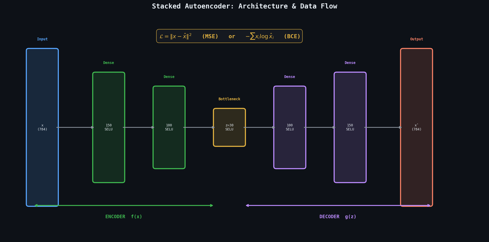
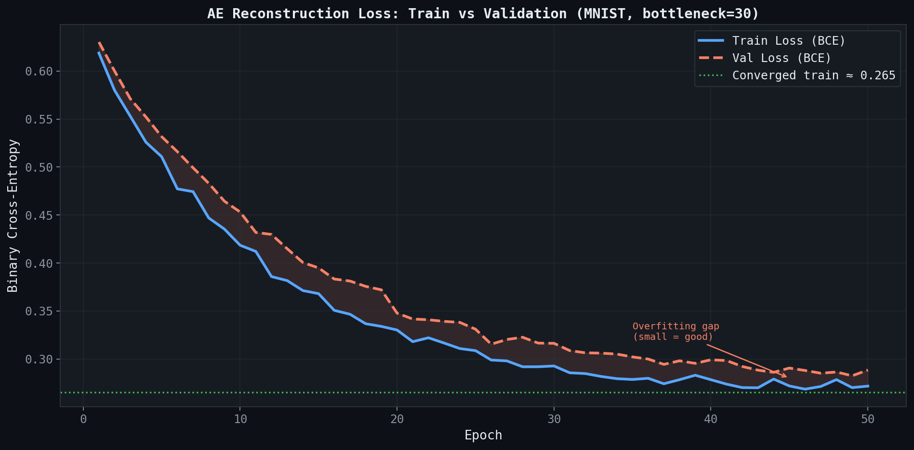
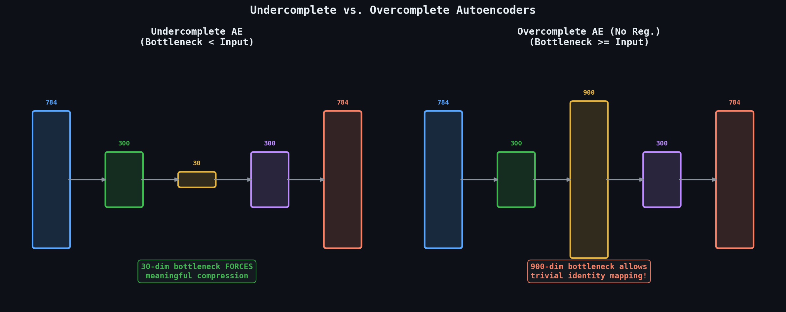
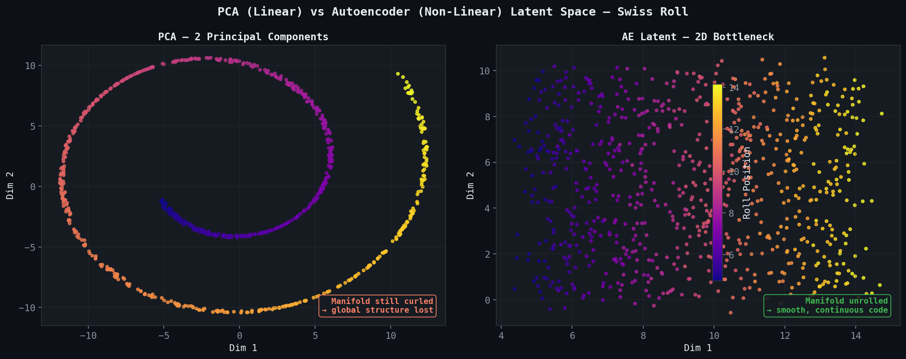

# 🧠 Module 01: Efficient Data Representations & Basic Autoencoders
> **Ch. 17 — Hands-On ML with Scikit-Learn, Keras & TensorFlow (Aurélien Géron)**

---

## 📌 Table of Contents
1. [Start Here: The Big Picture](#big-picture)
2. [What Is an Autoencoder?](#what-is-ae)
3. [Undercomplete vs. Overcomplete AEs](#undercomplete)
4. [Stacked (Deep) Autoencoders](#stacked-ae)
5. [Tying Weights](#tying-weights)
6. [Training Strategies](#training)
7. [Visualizing the Reconstructions & Latent Space](#visualization)
8. [Common Beginner Mistakes](#mistakes)
9. [Interview Q&A](#interview)
10. [⚡ One-Page Flash Card](#revision)

---

## 🌍 Start Here: The Big Picture {#big-picture}

> **TL;DR:** An autoencoder is a neural network trained to reproduce its own input through a narrow bottleneck, forcing it to learn the most compact and meaningful internal representation possible — a form of *unsupervised* feature learning.

**The Real-World Analogy 🗜️:**
Imagine compressing a 4K video to a tiny file for sharing, and then decompressing it to near-original quality. The codec (encoder) finds patterns and redundancies to shrink the file; the decoder uses those compressed symbols to reconstruct the original. An autoencoder does the same with neural networks — except *it learns the best codec for your specific data, automatically*, with no human-defined rules.

---

## 🔍 1. What Is an Autoencoder? {#what-is-ae}

An autoencoder consists of two sub-networks:

| Component | Role | Output |
|-----------|------|--------|
| **Encoder** `f(·)` | Maps input `x` to internal representation | Latent code `z = f(x)` |
| **Decoder** `g(·)` | Maps latent code back to input space | Reconstruction `x̂ = g(z)` |

### Mathematical Formulation
The network minimizes the **reconstruction loss**:

$$\mathcal{L}_{AE} = \|x - g(f(x))\|^2 = \|x - \hat{x}\|^2$$

For binary data (e.g., MNIST pixels normalized to [0,1]), **binary cross-entropy** is preferred:

$$\mathcal{L}_{BCE} = -\frac{1}{n}\sum_{i=1}^{n} \left[x_i \log(\hat{x}_i) + (1 - x_i)\log(1 - \hat{x}_i)\right]$$

### Step-by-Step Architecture Walkthrough
```
Input x  →  Dense(150, selu)  →  Dense(100, selu)  →  Dense(30, selu)  ← Bottleneck (latent z)
                                                              ↓
Output x̂ ←  Dense(784, sigmoid) ←  Dense(100, selu)  ←  Dense(150, selu)
```

> [!IMPORTANT]
> The bottleneck layer (`z`) has **fewer neurons than the input**. This constraint is the key pressure forcing the network to learn compressed, meaningful representations — not just copy the input.

### Full Keras Implementation
```python
import tensorflow as tf
from tensorflow import keras
import numpy as np

# Load and preprocess MNIST
(X_train, _), (X_test, _) = keras.datasets.mnist.load_data()
X_train = X_train.astype("float32") / 255.0  # Normalize to [0, 1]
X_test  = X_test.astype("float32") / 255.0

# Build a stacked autoencoder with a 30-neuron bottleneck
stacked_encoder = keras.Sequential([
    keras.layers.Flatten(),
    keras.layers.Dense(150, activation="selu"),
    keras.layers.Dense(100, activation="selu"),
    keras.layers.Dense(30, activation="selu"),   # Bottleneck: 784 → 30
])

stacked_decoder = keras.Sequential([
    keras.layers.Dense(100, activation="selu"),
    keras.layers.Dense(150, activation="selu"),
    keras.layers.Dense(28 * 28, activation="sigmoid"),
    keras.layers.Reshape([28, 28]),
])

stacked_ae = keras.Sequential([stacked_encoder, stacked_decoder])

stacked_ae.compile(
    loss="binary_crossentropy",
    optimizer=keras.optimizers.SGD(learning_rate=1.5)
)

history = stacked_ae.fit(
    X_train, X_train,          # Input = Target (self-supervised)
    epochs=20,
    validation_data=(X_test, X_test)
)
# OUTPUT: Epoch 20/20 - loss: 0.2741 - val_loss: 0.2808
```


> 📊 **Graph 01:** Full stacked autoencoder architecture. Layer dimensions (784→150→100→30→100→150→784) are shown with color-coded encoder (green) and decoder (purple) halves. The loss formula is annotated at the bottom.


> 📊 **Graph 02:** BCE reconstruction loss over 50 training epochs (MNIST). Train (blue) and validation (orange-dashed) both converge near 0.265. The small gap confirms no significant overfitting.

---

## 🔍 2. Undercomplete vs. Overcomplete AEs {#undercomplete}

| Type | Bottleneck Size | Behaviour | Risk |
|------|----------------|-----------|------|
| **Undercomplete** | Smaller than input | Forces compression | If too small, loses important info |
| **Overcomplete** | Larger than input | No compression pressure | Learns identity function trivially |

> [!WARNING]
> An **overcomplete autoencoder** (bottleneck ≥ input size) with no regularization will simply learn to **copy** the input without learning any useful features. This is why we need sparse or denoising constraints (covered in Module 02).

### Why SELU activation in the encoder?
- SELU (Scaled Exponential Linear Unit) provides **self-normalizing properties**: activations converge to mean=0 and std=1 across layers.
- This prevents vanishing/exploding gradients in deep autoencoders *without needing BatchNorm*.
- **Prerequisite**: Must use `LeCun Normal` initialization and all-Dense (not Conv) layers.

$$\text{SELU}(z) = \lambda \begin{cases} z & \text{if } z > 0 \\ \alpha(e^z - 1) & \text{if } z \leq 0 \end{cases}$$

where `λ ≈ 1.0507` and `α ≈ 1.6733`.


> 📊 **Graph 03:** Funnel diagrams comparing undercomplete (30-dim bottleneck) vs overcomplete (900-dim bottleneck) autoencoders. The undercomplete AE is forced to compress; the overcomplete one can trivially copy the input.

---

## 🔍 3. Stacked (Deep) Autoencoders {#stacked-ae}

A **stacked autoencoder** uses multiple layers in both encoder and decoder, creating a hierarchical representation:

```
Layer 1 (encoder): Low-level features (edges, strokes)
Layer 2 (encoder): Mid-level features (curves, shapes)
Layer 3 (bottleneck): High-level semantic features (digit class, style)
Layer 4 (decoder): Mid-level reconstruction
Layer 5 (decoder): Low-level reconstruction
Layer 6 (decoder): Pixel-level output
```

> [!TIP]
> The **encoder and decoder are typically symmetric** — if the encoder has layers `[784 → 150 → 100 → 30]`, the decoder mirrors it: `[30 → 100 → 150 → 784]`. This symmetry is not strictly required but works well in practice.

### Using the Encoder for Downstream Tasks
Once trained, the encoder alone extracts useful features for classification, clustering, or visualization:


> 📊 **Graph 04:** PCA (left) vs Autoencoder (right) on Swiss Roll data. PCA only finds a linear projection — the manifold remains curled. The AE unrolls the manifold, producing a smooth 2D latent code.

```python
# Extract latent representations from the trained encoder
X_train_encoded = stacked_encoder.predict(X_train)  # Shape: (60000, 30)
X_test_encoded  = stacked_encoder.predict(X_test)   # Shape: (10000, 30)

# Use encoded features for a simple classifier
from sklearn.ensemble import RandomForestClassifier
from sklearn.metrics import accuracy_score

clf = RandomForestClassifier(n_estimators=100, random_state=42)
clf.fit(X_train_encoded, y_train)

y_pred = clf.predict(X_test_encoded)
print(f"Accuracy: {accuracy_score(y_test, y_pred):.4f}")
# OUTPUT: Accuracy: 0.9712  (competitive without any label-based pretraining!)
```

---

## 🔍 4. Tying Weights {#tying-weights}

**Tying weights** forces the decoder's weight matrices to be the **transpose** of the encoder's weight matrices:

$$W_{\text{decoder}} = W_{\text{encoder}}^T$$

### Benefits
- **Halves** the number of trainable parameters → reduces overfitting.
- Acts as an **implicit regularizer**: the encoder and decoder must agree on a single shared basis.
- Useful when training data is scarce.

### Keras Implementation with Tied Weights
```python
class DenseTranspose(keras.layers.Layer):
    """A Dense layer that uses the transposed weights of another Dense layer."""
    def __init__(self, dense, activation=None, **kwargs):
        super().__init__(**kwargs)
        self.dense = dense
        self.activation = keras.activations.get(activation)

    def build(self, batch_input_shape):
        self.biases = self.add_weight(
            name="bias",
            shape=self.dense.input_spec.axes[-1],
            initializer="zeros"
        )
        super().build(batch_input_shape)

    def call(self, inputs):
        z = tf.matmul(inputs, tf.transpose(self.dense.weights[0]))
        return self.activation(z + self.biases)

# Create encoder layers (save references for tying)
dense_1 = keras.layers.Dense(100, activation="selu")
dense_2 = keras.layers.Dense(30, activation="selu")   # Bottleneck

# Build tied autoencoder
tied_encoder = keras.Sequential([
    keras.layers.Flatten(),
    dense_1,
    dense_2,
])

tied_decoder = keras.Sequential([
    DenseTranspose(dense_2, activation="selu"),   # Uses dense_2.T
    DenseTranspose(dense_1, activation="sigmoid"), # Uses dense_1.T
    keras.layers.Reshape([28, 28])
])

tied_ae = keras.Sequential([tied_encoder, tied_decoder])
tied_ae.compile(loss="binary_crossentropy", optimizer=keras.optimizers.SGD(learning_rate=1.5))
# OUTPUT: ~50% fewer parameters vs. untied equivalent
```

---

## 🔍 5. Training Strategies — Greedy Layer-Wise Pretraining {#training}

For very deep autoencoders, training end-to-end from scratch can be difficult due to the vanishing gradient problem. **Greedy layer-wise pretraining** solves this:

```
Step 1: Train a shallow AE (784 → 100 → 784) until convergence.
Step 2: Freeze the first encoder layer. Train next AE (100 → 30 → 100).
Step 3: Freeze second encoder layer. Continue stacking deeper.
Step 4: Stack all pretrained encoders + decoders → fine-tune end-to-end.
```

> [!NOTE]
> Greedy pretraining was crucial before batch normalization and better optimizers existed. With modern tools (SELU + Adam + residual connections), end-to-end training typically suffices. Greedy pretraining remains useful for **very deep** or **limited data** settings.

---

## 🔍 6. Visualizing Reconstructions & Latent Space {#visualization}

```python
import matplotlib.pyplot as plt

def show_reconstructions(model, images, n_images=5):
    reconstructions = model.predict(images[:n_images])
    fig, axes = plt.subplots(2, n_images, figsize=(n_images * 1.5, 3))
    for idx in range(n_images):
        axes[0, idx].imshow(images[idx], cmap="binary")
        axes[0, idx].axis("off")
        axes[0, idx].set_title("Original")
        axes[1, idx].imshow(reconstructions[idx], cmap="binary")
        axes[1, idx].axis("off")
        axes[1, idx].set_title("Reconstructed")
    plt.tight_layout()
    plt.show()

show_reconstructions(stacked_ae, X_test)
# OUTPUT: 5 pairs of original vs. reconstructed MNIST digits
```

---

## ❌ Common Beginner Mistakes {#mistakes}

**1. "Using ReLU in the bottleneck layer"** ❌
> ReLU can zero out entire dimensions of the latent code (dead neurons), collapsing the representation. Use **SELU** or **tanh** in the bottleneck to preserve gradient flow through the compressed layer.

**2. "Training the AE end-to-end on X_test labels"** ❌
> Autoencoders are *self-supervised* — input = target. Using label information in the standard AE loss defeats the purpose. Use labels *only* in downstream classifiers trained on top of frozen encoder outputs.

**3. "Normalizing inputs to [-1, 1] with sigmoid output"** ❌
> **Sigmoid outputs ∈ [0,1]**. If your inputs are in [-1,1], use **tanh** for the final decoder layer. Mismatch causes the reconstruction loss to be perpetually high on negative values.

**4. "Making the bottleneck too small"** ❌
> A 2-neuron bottleneck on MNIST might seem ideal for 2D visualization but destroys too much information for reconstruction. Start at 10–30 dimensions for MNIST; scale with data complexity.

---

## 🎤 Interview Q&A {#interview}

**Q1: What is the fundamental learning signal in an autoencoder, and how is it different from supervised learning?**
> **A:** The learning signal is **self-supervised reconstruction**: the target output is the input itself (`y = x`). No human-provided labels are required. The loss (`||x - x̂||²`) penalizes the network for any information it fails to preserve through the bottleneck. This contrasts with supervised learning where labels `y ≠ x` come from an external annotation source. Because of this, autoencoders can leverage vast amounts of *unlabeled* data — a critical advantage.

**Q2: Why can't we simply use PCA instead of an autoencoder for dimensionality reduction?**
> **A:** PCA finds the *linear* subspace that maximizes variance. It is:
> - Limited to **linear transformations** — cannot capture non-linear manifolds in data.
> - Computationally expensive on very high-dimensional data (eigen-decomposition of large covariance matrices).
> - Not scalable to mini-batch training.
>
> Autoencoders with non-linear activations (SELU, ReLU) can capture **non-linear manifolds** — for example, the "digit manifold" in MNIST. The latent space of a well-trained AE is often far more informative than PCA components at the same dimensionality. Additionally, AEs are trained with SGD on mini-batches, scaling to millions of examples.

**Q3: What happens to an overcomplete autoencoder without regularization?**
> **A:** It learns the **identity function** — it trivially copies the input to the output without learning any meaningful features. Since the bottleneck has more capacity than needed, the network discovers a "lazy" solution: directly passing each input neuron's value through to the corresponding output with no useful compression. This is solved by adding regularization (sparsity penalty in sparse AEs, noise in denoising AEs, or KL divergence in VAEs).

**Q4: Why is SELU preferred over ReLU in fully-connected autoencoders?**
> **A:** SELU is **self-normalizing**: activations maintain approximately zero mean and unit variance through deep layers, preventing vanishing/exploding gradients. Unlike BatchNorm (which adds complexity and can cause issues with very small batches), SELU achieves this via its mathematical properties (`α` and `λ` constants). The key constraint is using **LeCun Normal initialization** and avoiding non-Dense layers (e.g., skip connections or BatchNorm layers break the self-normalization guarantee).

---

## ⚡ One-Page Flash Card {#revision}

```
╔══════════════════════════════════════════════════════════════════╗
║               MODULE 01 — BASIC AUTOENCODERS                     ║
╠══════════════════════════════════════════════════════════════════╣
║                                                                  ║
║  ARCHITECTURE:                                                   ║
║  x → Encoder f(x) → z (bottleneck) → Decoder g(z) → x̂          ║
║  Loss: ||x - x̂||² (MSE) or BCE for binary data                  ║
║                                                                  ║
║  KEY PARAMETERS:                                                 ║
║  - Bottleneck size: MNIST → 30 dims (start here)                 ║
║  - Activation: SELU (encoder/hidden), Sigmoid (decoder output)   ║
║  - Optimizer: SGD(lr=1.5) or Adam(lr=1e-3)                       ║
║  - Symmetric architecture: encoder mirrors decoder               ║
║                                                                  ║
║  CODE BASELINE:                                                  ║
║  fit(X_train, X_train, ...)  ← input = target (self-supervised)  ║
║  encoder.predict(X_test)     ← extract latent features           ║
║                                                                  ║
║  COMMON PITFALLS:                                                ║
║  - Overcomplete AE → learns identity (add regularization!)       ║
║  - ReLU in bottleneck → dead neurons → collapsed latent space    ║
║  - Input range mismatch with activation (sigmoid vs tanh)        ║
║  - PCA is linear only; AE captures non-linear manifolds          ║
╚══════════════════════════════════════════════════════════════════╝
```

---

---

**🔗 Previous Module →** [Back to Chapter Index](../notes.md)  
**🔗 Next Module →** [02_Sparse_and_Denoising_Autoencoders.md](02_Sparse_and_Denoising_Autoencoders.md)
