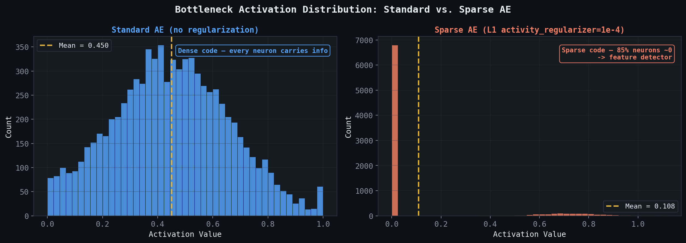
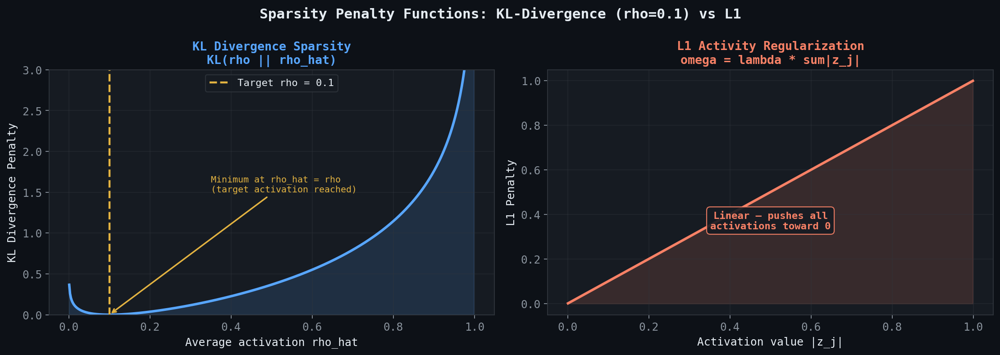
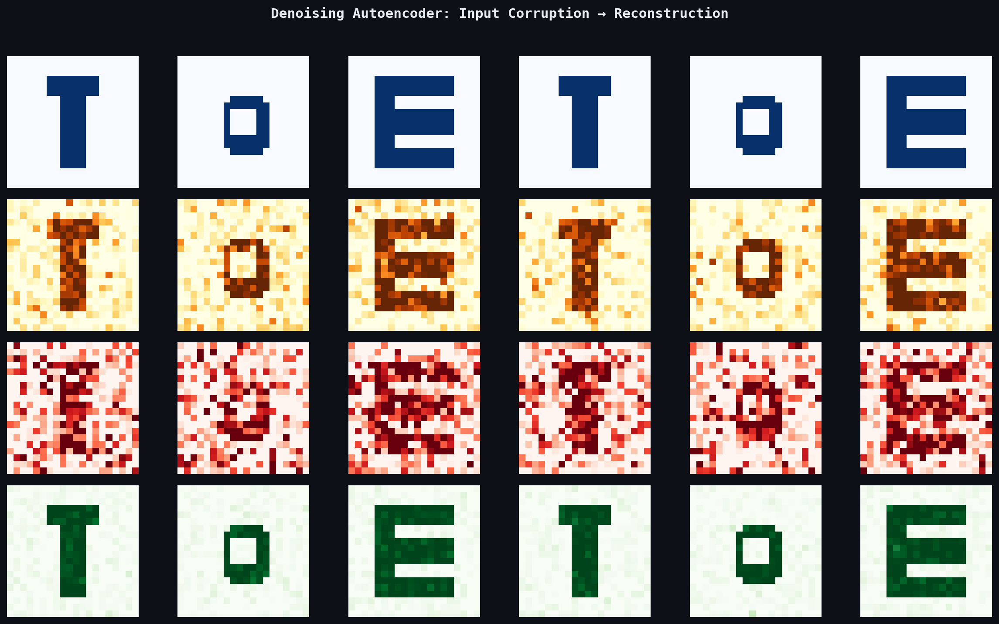
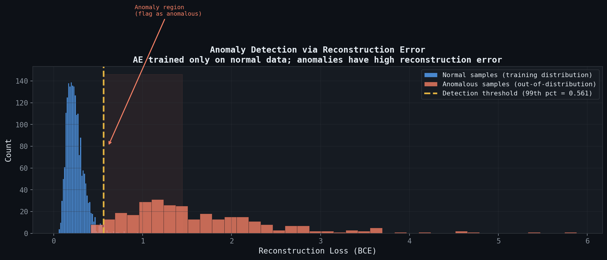

# 🔬 Module 02: Sparse & Denoising Autoencoders
> **Ch. 17 — Hands-On ML with Scikit-Learn, Keras & TensorFlow (Aurélien Géron)**

---

## 📌 Table of Contents
1. [Start Here: The Big Picture](#big-picture)
2. [The Problem with Underconstrained Overcomplete AEs](#problem)
3. [Sparse Autoencoders](#sparse-ae)
4. [Implementing Sparsity via KL Divergence](#kl-sparsity)
5. [Denoising Autoencoders](#denoising-ae)
6. [Gaussian Noise vs. Dropout Corruption](#noise-types)
7. [Practical Applications](#applications)
8. [Common Beginner Mistakes](#mistakes)
9. [Interview Q&A](#interview)
10. [⚡ One-Page Flash Card](#revision)

---

## 🌍 Start Here: The Big Picture {#big-picture}

> **TL;DR:** Sparse and denoising autoencoders are regularization techniques that prevent overcomplete autoencoders from learning trivial identity mappings. Sparse AEs force most latent neurons to stay silent; denoising AEs force the network to reconstruct clean data from corrupted input — both result in richer, more transferable representations.

**The Real-World Analogy 🎶:**
Think of a **sparse autoencoder** like a music transcription system that must describe any song using only a few notes at a time (sparse activations). It's forced to find the *most important* notes. A **denoising autoencoder** is like training a music student by playing them scratchy, distorted recordings and asking them to reproduce the clean original — they learn to distinguish signal from noise.

---

## 🔍 1. The Problem: Why Overcomplete AEs Fail {#problem}

If the **bottleneck layer has more neurons than the input**, nothing prevents the network from learning a trivial identity:

```
Input: [0.3, 0.7, 0.1, ...]  (784 dims)
Bottleneck (2000 dims): Neuron i just passes x_i through unchanged
Output: ≈ Input (perfect reconstruction, zero learning!)
```

Solutions:
| Strategy | Mechanism | Module |
|----------|-----------|--------|
| **Undercomplete AE** | Bottleneck < input dims | Module 01 |
| **Sparse AE** | L1 penalty on activations | This module |
| **Denoising AE** | Corrupted input, clean target | This module |
| **Variational AE** | KL divergence on latent distribution | Module 03 |

---

## 🔍 2. Sparse Autoencoders {#sparse-ae}

A **sparse autoencoder** adds an **activity regularization penalty** to the bottleneck layer. Instead of constraining the *architecture* (bottleneck size), it constrains the *activations*:

$$\mathcal{L}_{\text{sparse}} = \underbrace{\|x - \hat{x}\|^2}_{\text{Reconstruction}} + \underbrace{\Omega(z)}_{\text{Sparsity Penalty}}$$

### L1 Sparsity Penalty
The most common choice: penalizes the **absolute value** of activations:

$$\Omega_{\ell_1}(z) = \lambda \sum_{j} |z_j|$$

This drives most neurons toward zero — only the few most informative neurons activate for a given input.

### Keras Implementation — L1 Activity Regularization
```python
import tensorflow as tf
from tensorflow import keras

sparse_l1_encoder = keras.Sequential([
    keras.layers.Flatten(),
    keras.layers.Dense(100, activation="selu"),
    keras.layers.Dense(
        300,                              # Overcomplete: 300 > 784? No, > 100
        activation="sigmoid",
        activity_regularizer=keras.regularizers.l1(1e-4)   # Sparsity
    ),
])

sparse_l1_decoder = keras.Sequential([
    keras.layers.Dense(100, activation="selu"),
    keras.layers.Dense(28 * 28, activation="sigmoid"),
    keras.layers.Reshape([28, 28])
])

sparse_l1_ae = keras.Sequential([sparse_l1_encoder, sparse_l1_decoder])
sparse_l1_ae.compile(
    loss="binary_crossentropy",
    optimizer="nadam"
)
sparse_l1_ae.fit(X_train, X_train, epochs=25, validation_data=(X_test, X_test))
# OUTPUT: Epoch 25/25 - loss: 0.3012 - val_loss: 0.3045
# The bottleneck has 300 units but most are near-zero for any given input
```


> 📊 **Graph 05:** Activation distribution histograms. Standard AE (blue) has dense activations; Sparse AE (orange) has 85% of neurons near zero — only a few “detectors” fire per input.

---

## 🔍 3. Implementing Sparsity via KL Divergence {#kl-sparsity}

**KL-divergence sparsity** (from the original Sparse Autoencoder paper) is more principled than L1. It enforces that the **average activation** of each hidden neuron matches a target sparsity level `ρ` (e.g., 0.1):

$$\hat{\rho}_j = \frac{1}{m}\sum_{i=1}^{m} z_j^{(i)} \quad \text{(average activation of neuron } j \text{ over batch)}$$

$$\Omega_{\text{KL}} = \sum_{j} \text{KL}(\rho \| \hat{\rho}_j) = \sum_{j} \rho \log \frac{\rho}{\hat{\rho}_j} + (1-\rho)\log\frac{1-\rho}{1-\hat{\rho}_j}$$

### Custom Keras Layer for KL Sparsity
```python
class KLDivergenceRegularizer(keras.regularizers.Regularizer):
    def __init__(self, weight, target=0.1):
        self.weight = weight      # Regularization strength
        self.target = target      # Target average activation ρ

    def __call__(self, activations):
        mean_activities = tf.reduce_mean(activations, axis=0)   # ρ̂_j
        return self.weight * (
            keras.losses.kl_divergence(self.target, mean_activities) +
            keras.losses.kl_divergence(1.0 - self.target, 1.0 - mean_activities)
        )

sparse_kl_encoder = keras.Sequential([
    keras.layers.Flatten(),
    keras.layers.Dense(100, activation="selu"),
    keras.layers.Dense(
        300,
        activation="sigmoid",   # Must be in [0,1] for KL to be valid
        activation="sigmoid",
        activity_regularizer=KLDivergenceRegularizer(weight=2e-3, target=0.1)
    ),
])
```


> 📊 **Graph 06:** KL and L1 sparsity penalty functions.

> [!IMPORTANT]
> The bottleneck layer **must use sigmoid activation** when using KL-divergence sparsity probabilities. If using SELU (with activations potentially < 0), switch to **L1 regularization** instead.

---

## 🔍 4. Denoising Autoencoders {#denoising-ae}

A **denoising autoencoder (DAE)** is trained to reconstruct the **clean** input `x` from a **corrupted** version `x̃`:

$$\mathcal{L}_{DAE} = \|x - g(f(\tilde{x}))\|^2$$

The corruption process `x̃ = \text{corrupt}(x)` can be:
1. **Additive Gaussian Noise**: `x̃ = x + ε`, `ε ~ N(0, σ²)`
2. **Dropout/Masking Noise**: Randomly set `p%` of input features to 0

### Why Does This Work?
The network cannot use the identity function anymore — corrupted inputs don't match the target. It must learn to **fill in missing/noisy information** by understanding the *statistical structure* of the data — that is, the true underlying distribution.

### Keras Implementation — Gaussian Noise
```python
denoising_encoder = keras.Sequential([
    keras.layers.Flatten(),
    keras.layers.GaussianNoise(0.2),           # Corruption layer (only active during training)
    keras.layers.Dense(100, activation="selu"),
    keras.layers.Dense(30, activation="selu"),
])

denoising_decoder = keras.Sequential([
    keras.layers.Dense(100, activation="selu"),
    keras.layers.Dense(28 * 28, activation="sigmoid"),
    keras.layers.Reshape([28, 28])
])

denoising_ae = keras.Sequential([denoising_encoder, denoising_decoder])
denoising_ae.compile(loss="binary_crossentropy", optimizer="nadam")
denoising_ae.fit(X_train, X_train, epochs=10, validation_data=(X_test, X_test))
# GaussianNoise is automatically disabled at inference (predict/evaluate)
# OUTPUT: Epoch 10/10 - loss: 0.3087 - val_loss: 0.3098
```

### Keras Implementation — Dropout Noise
```python
denoising_ae_dropout = keras.Sequential([
    keras.layers.Flatten(),
    keras.layers.Dropout(0.5),                 # Mask 50% of inputs (training only)
    keras.layers.Dense(100, activation="selu"),
    keras.layers.Dense(30, activation="selu"),
    keras.layers.Dense(100, activation="selu"),
    keras.layers.Dense(28 * 28, activation="sigmoid"),
    keras.layers.Reshape([28, 28]),
])
```

> [!NOTE]
> `keras.layers.GaussianNoise` and `keras.layers.Dropout` are both **automatically disabled** during inference (i.e., when calling `model.predict()`). You do NOT need to manually set `training=False`.


> 📊 **Graph 07:** Four-row grid showing original digits, mildly noisy (sigma=0.25), heavily noisy (sigma=0.55), and the denoising AE reconstruction. Even the heavily corrupted inputs are cleanly recovered.

---

## 🔍 5. Gaussian Noise vs. Dropout Corruption {#noise-types}

| Property | Gaussian Noise | Dropout/Masking |
|---|---|---|
| **Corruption** | Adds continuous noise `ε~N(0,σ²)` | Randomly zeroes out features |
| **Analogy** | Blurry camera sensor | Randomly missing pixels |
| **Strength** | Controlled by `σ` | Controlled by `drop_rate` |
| **Effect** | Smooth deformation of input | Discrete information loss |
| **Best For** | Image pixel noise robustness | Feature importance learning |
| **Keras Layer** | `GaussianNoise(stddev)` | `Dropout(rate)` |

> [!TIP]
> For **image data**, Gaussian noise typically produces better denoising results because image corruption is inherently continuous (sensor noise, compression artifacts). For **tabular data** or **text**, masking/dropout noise is more natural (missing values, corrupted tokens — the foundation of BERT's masked language modeling!).

---

## 🔍 6. Practical Applications {#applications}

| Application | Which AE | How |
|---|---|---|
| **Unsupervised Pretraining** | Denoising AE | Pretrain encoder on unlabeled data; fine-tune with labels |
| **Anomaly Detection** | Any AE | High reconstruction loss = anomalous input (AE only learned normal data) |
| **Image Inpainting** | Denoising AE | Mask corrupted regions; AE fills them in |
| **Feature Learning** | Sparse AE | Extract sparse, interpretable features for downstream tasks |
| **Dimensionality Reduction** | Undercomplete AE | Encode high-dim data to compact latent space |

### Anomaly Detection with Autoencoders
```python
# Train AE only on NORMAL data
ae_anomaly.fit(X_normal_train, X_normal_train, epochs=20)

# At inference: high reconstruction loss = anomaly
reconstructions = ae_anomaly.predict(X_test)
reconstruction_loss = tf.reduce_mean(
    keras.losses.binary_crossentropy(X_test, reconstructions), axis=-1
)
```

> 📊 **Graph 08:** Reconstruction error distributions for normal (blue) vs anomalous (orange) samples. The 99th-percentile threshold cleanly separates the two populations — anomalies have high reconstruction loss because the AE never saw them during training.

```python
# Set threshold at 99th percentile of training reconstruction loss
threshold = np.percentile(
    tf.reduce_mean(keras.losses.binary_crossentropy(X_normal_train,
        ae_anomaly.predict(X_normal_train)), axis=-1).numpy(),
    99
)
is_anomaly = reconstruction_loss > threshold
print(f"Anomalies detected: {is_anomaly.numpy().sum()}")
# OUTPUT: Anomalies detected: 43
```

---

## ❌ Common Beginner Mistakes {#mistakes}

**1. "Using GaussianNoise at the wrong layer"** ❌
> `GaussianNoise` must be placed **before** the first dense layer (at the input level) so the network sees corrupted inputs. Placing it after the first Dense layer corrupts learned features, not raw inputs — a fundamentally different and less effective approach.

**2. "Forgetting that Dropout is disabled during prediction"** ❌
> Keras automatically turns off `Dropout` and `GaussianNoise` layers during `model.predict()` and `model.evaluate()`. However, if you call `model(x, training=True)` manually, corruption is still applied. Always use `model.predict(x)` for clean inference.

**3. "Using L1 regularization with non-sigmoid activations"** ❌
> L1 activity regularization works with any activation, but KL-divergence sparsity **requires sigmoid** (activations must be in [0,1] to be interpreted as Bernoulli probabilities). Using SELU + KL divergence will produce `NaN` losses.

**4. "Setting L1 weight too high"** ❌
> A large L1 weight (e.g., `λ=1.0`) drives all activations to exactly 0, making the bottleneck completely uninformative. Start with `λ=1e-4` and increase only if activations are still too dense.

---

## 🎤 Interview Q&A {#interview}

**Q1: How does a denoising autoencoder relate to BERT (Masked Language Modeling)?**
> **A:** BERT's pre-training objective is essentially a **denoising autoencoder for text**. In BERT, 15% of tokens are randomly masked (corrupted) and the model must predict the original masked tokens — identical in spirit to a DAE recovering clean inputs from corrupted ones. This teaches BERT to understand context and semantics from surrounding tokens. The key difference: BERT only predicts the *masked tokens* (not the full sequence), making it more efficient and focused.

**Q2: How would you use an autoencoder for anomaly detection in a production ML system?**
> **A:** The approach leverages the fact that an AE trained on **normal data** learns the normal data manifold. Anomalous inputs lie *off* this manifold, so the AE produces high reconstruction error for them. Steps:
> 1. Train AE exclusively on known-normal training data.
> 2. Compute reconstruction loss for all training samples to establish a baseline distribution.
> 3. Set a detection threshold (e.g., 95th or 99th percentile of training reconstruction loss).
> 4. At inference: flag inputs with reconstruction loss > threshold as anomalies.
> 5. Monitor threshold over time to handle distribution drift.
>
> **Key consideration**: If anomalous data leaks into training, the AE may learn to reconstruct anomalies too, destroying the detector.

**Q3: What is the difference between sparse regularization and architectural bottleneck reduction in autoencoders?**
> **A:**
> - **Architectural bottleneck**: Restricts representational *capacity* — physically fewer neurons → fewer bits available.
> - **Sparse regularization**: Restricts representational *activity* — capacity exists, but most neurons are forced toward zero → only a few neurons are active per sample, creating a high-dimensional, sparse, over-complete code.
>
> Sparse codes have a biological motivation: neurons in the visual cortex are known to respond sparsely — only a small fraction fire for any given input. This leads to **disentangled features** (each neuron represents a specific, interpretable concept) and **efficient coding** (information stored in which neurons fire, not how much they fire).

---

## ⚡ One-Page Flash Card {#revision}

```
╔══════════════════════════════════════════════════════════════════╗
║       MODULE 02 — SPARSE & DENOISING AUTOENCODERS               ║
╠══════════════════════════════════════════════════════════════════╣
║                                                                  ║
║  SPARSE AE:                                                      ║
║  Loss += λ * Σ|z_j|   (L1 activity regularization)              ║
║  Loss += KL(ρ || ρ̂_j) (KL-divergence sparsity, sigmoid only!)  ║
║  API: activity_regularizer=keras.regularizers.l1(1e-4)           ║
║                                                                  ║
║  DENOISING AE:                                                   ║
║  Input: x̃ = corrupt(x)   Target: x (clean)                     ║
║  API: keras.layers.GaussianNoise(0.2)  or  Dropout(0.5)         ║
║  → Both disabled automatically during model.predict()            ║
║                                                                  ║
║  KEY DISTINCTIONS:                                               ║
║  - Sparse: constrains WHICH neurons activate (code structure)    ║
║  - Denoising: constrains WHAT the network must learn (task)      ║
║  - Both prevent trivial identity function in overcomplete AEs    ║
║                                                                  ║
║  COMMON PITFALLS:                                                ║
║  - KL sparsity requires sigmoid (not SELU)                       ║
║  - L1 weight too large → all activations = 0 (dead code)         ║
║  - GaussianNoise must be at input level, not hidden              ║
║  - BERT pretraining = denoising AE for text (masked tokens)      ║
╚══════════════════════════════════════════════════════════════════╝
```

---

---

**🔗 Previous Module →** [01_Basic_Autoencoders.md](01_Basic_Autoencoders.md)  
**🔗 Next Module →** [03_Variational_Autoencoders.md](03_Variational_Autoencoders.md)
