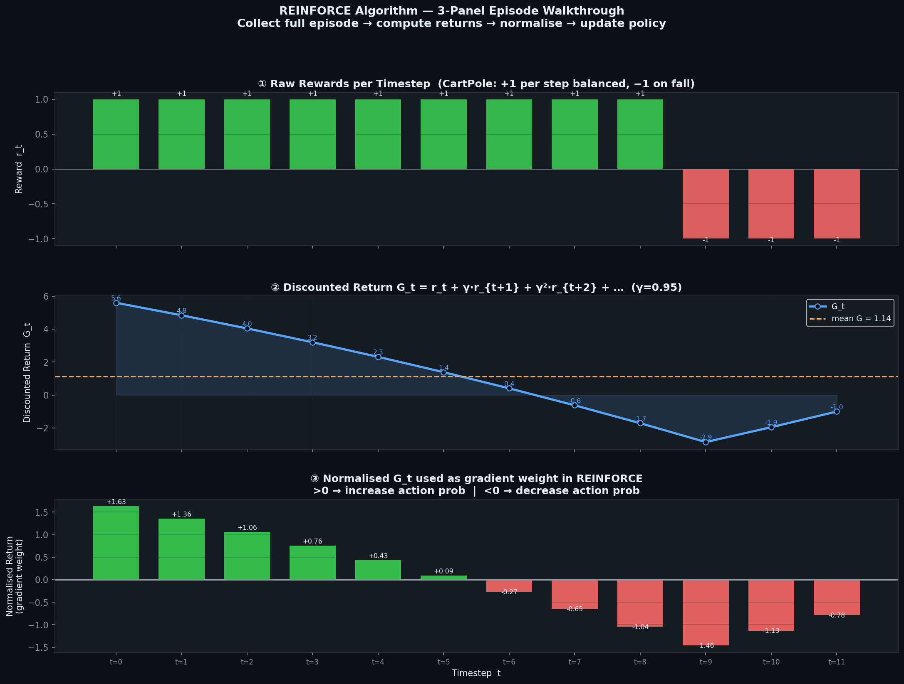

# 🎮 Module 02: OpenAI Gym & Policy Gradient Methods (REINFORCE)
> **Ch. 18 — Hands-On ML with Scikit-Learn, Keras & TensorFlow (Aurélien Géron)**

---

## 📌 Table of Contents
1. [Start Here: The Big Picture](#big-picture)
2. [OpenAI Gym: The RL Playground](#gym)
3. [Neural Network Policies](#nn-policy)
4. [The REINFORCE Algorithm (Monte Carlo Policy Gradient)](#reinforce)
5. [Policy Gradient Theorem — Mathematical Derivation](#pg-theorem)
6. [Baseline Subtraction & Variance Reduction](#baseline)
7. [Full Training Loop Implementation](#training-loop)
8. [Common Beginner Mistakes](#mistakes)
9. [Interview Q&A](#interview)
10. [⚡ One-Page Flash Card](#revision)

---

## 🌍 Start Here: The Big Picture {#big-picture}

> **TL;DR:** Instead of estimating value functions, **Policy Gradient methods** directly optimize the policy parameters θ by ascending the gradient of expected return. REINFORCE is the foundational algorithm: collect a full episode, compute returns G_t, then update θ by reinforcing actions proportional to how good the outcome was.

**The Real-World Analogy 🎰:**
Imagine you're playing a slot machine for the first time and you don't know the rules. After each pull, you observe a payout. Over many trials, you naturally start pulling the lever more when it previously gave money and less when it didn't. REINFORCE does exactly this — it increases the probability of actions that led to high returns and decreases the probability of actions that led to low returns, weighted by *how much better or worse* they were than average.

---

## 🔍 1. OpenAI Gym: The RL Playground {#gym}

**Gymnasium** (formerly OpenAI Gym) provides a standardized API for RL environments, making it easy to benchmark algorithms across diverse tasks.

### Installation
```python
pip install gymnasium
# For classic control environments (CartPole, MountainCar, etc.)
pip install gymnasium[classic-control]
# For Atari environments
pip install gymnasium[atari] ale-py
```

### Core Gym API

```python
import gymnasium as gym

# Create environment
env = gym.make("CartPole-v1", render_mode="rgb_array")

# Inspect environment properties
print(env.observation_space)  # OUTPUT: Box([-4.8 -inf -0.42 -inf], [4.8 inf 0.42 inf], (4,), float32)
print(env.action_space)       # OUTPUT: Discrete(2)  <- 0=push left, 1=push right

# Standard interaction loop
obs, info = env.reset(seed=42)   # Reset to initial state; returns (observation, info_dict)
for step in range(200):
    action = env.action_space.sample()           # Random policy (uniform sampling)
    obs, reward, terminated, truncated, info = env.step(action)
    if terminated or truncated:
        obs, info = env.reset()

env.close()
# OUTPUT: Step 0: obs=[ 0.043  -0.011   0.019   0.030], reward=1.0, terminated=False
```

### Key Gym Return Values

| Return Value | Type | Description |
|---|---|---|
| `obs` | np.ndarray | Current observation (state) |
| `reward` | float | Immediate reward for this step |
| `terminated` | bool | Episode ended naturally (pole fell, goal reached) |
| `truncated` | bool | Episode ended due to time limit (max_steps exceeded) |
| `info` | dict | Debugging info (varies by environment) |

> [!NOTE]
> `terminated` vs `truncated` is a newer Gymnasium distinction (v0.26+). Old Gym versions returned a single `done` boolean. When using custom environments, always differentiate: a terminated episode (natural end) should bootstrap value=0; a truncated episode (time limit) should bootstrap from V(last_state).

### CartPole-v1 Environment Details

```
State Space (4 dims):
  obs[0]: Cart position           ∈ [-4.8, 4.8]
  obs[1]: Cart velocity           ∈ (-∞, +∞)
  obs[2]: Pole angle (radians)    ∈ [-0.418, 0.418]  (±24°)
  obs[3]: Pole angular velocity   ∈ (-∞, +∞)

Action Space (discrete, 2):
  0: Push cart LEFT
  1: Push cart RIGHT

Reward: +1.0 for every step the pole remains upright
Termination: pole angle > 12°, cart position > 2.4, or 500 steps (success)
```

### Visualizing the Environment

```python
import matplotlib.pyplot as plt
import matplotlib.animation as animation
import gymnasium as gym
import numpy as np

env = gym.make("CartPole-v1", render_mode="rgb_array")
obs, _ = env.reset(seed=42)
frames = []

for step in range(50):
    frames.append(env.render())
    action = env.action_space.sample()
    obs, reward, terminated, truncated, _ = env.step(action)
    if terminated or truncated:
        break

env.close()

# Display first frame
plt.figure(figsize=(6, 4))
plt.imshow(frames[0])
plt.axis("off")
plt.title("CartPole-v1 Environment")
plt.show()
# OUTPUT: RGB image of the CartPole simulation
```

---

## 🔍 2. Neural Network Policies {#nn-policy}

Instead of a lookup table, we use a **neural network** to approximate the policy π_θ(a|s):

```
Input: state s (4 numbers for CartPole)
         ↓
    Dense(5, activation="relu")
         ↓
    Dense(1, activation="sigmoid")  <- Output: P(action=1 | s)
         ↓
    Bernoulli sample: action ~ Bernoulli(p)
```

> [!IMPORTANT]
> For a **binary action space** (left/right), a single sigmoid output gives P(push_right|s). Then P(push_left|s) = 1 - P(push_right|s). For **multi-action spaces** (Atari with 18 actions), use a **softmax** output over all actions.

### Neural Network Policy Implementation (Keras)

```python
import tensorflow as tf
from tensorflow import keras
import numpy as np
import gymnasium as gym

# Build policy network
model = keras.Sequential([
    keras.layers.Dense(5, activation="relu", input_shape=[4]),   # 4 CartPole obs dims
    keras.layers.Dense(1, activation="sigmoid"),                  # P(push_right)
])
# model.summary():
# Dense: 4*5 + 5 = 25 params
# Dense: 5*1 + 1 = 6  params
# Total:  31 trainable parameters

def policy(obs):
    """Given observation, return sampled action and its probability."""
    left_prob = 1 - model(obs[np.newaxis])          # P(push_left)
    left_prob = tf.squeeze(left_prob).numpy()
    action = 0 if np.random.rand() < left_prob else 1
    return action, left_prob

# Test single step
env = gym.make("CartPole-v1")
obs, _ = env.reset(seed=42)
action, p = policy(obs)
print(f"Action: {action}, P(left): {p:.4f}")
# OUTPUT: Action: 0, P(left): 0.5132  (random initial weights)
```

---

## 🔍 3. The REINFORCE Algorithm (Monte Carlo Policy Gradient) {#reinforce}

REINFORCE is the **simplest policy gradient algorithm**, proposed by Williams (1992).

### The Core Idea

> "If an action led to a high total return, increase its probability. If it led to a low return, decrease it."



### Algorithm Steps

```
REINFORCE (Williams, 1992):
─────────────────────────────────────────────────────────────────
Input: Policy π_θ with parameters θ
Hyperparameters: learning_rate α, discount γ

1. Initialize θ randomly
2. REPEAT (for each episode):
   a. Run episode under π_θ, collect trajectory:
      τ = {s_0, a_0, r_0, s_1, a_1, r_1, ..., s_T, a_T, r_T}
   b. For each step t, compute discounted return:
      G_t = Σ_{k=0}^{T-t} γ^k · r_{t+k}
   c. For each step t, compute policy gradient:
      ∇_θ J(θ) ≈ G_t · ∇_θ log π_θ(a_t | s_t)
   d. Update parameters (gradient ASCENT on expected return):
      θ ← θ + α · G_t · ∇_θ log π_θ(a_t | s_t)
─────────────────────────────────────────────────────────────────
```

### Why log π? — The Score Function Trick

The key mathematical trick in REINFORCE is expressing the gradient of the expected return without needing the transition probabilities P(s'|s,a):

```
∇_θ E[G_t] = E[ G_t · ∇_θ log π_θ(a_t | s_t) ]
```

**Intuition**: 
- `∇_θ log π_θ(a_t|s_t)` points in the direction of increasing the probability of action a_t.
- Multiplying by `G_t` (the return): 
  - If G_t is large (good episode) → take a big step toward making a_t more likely.
  - If G_t is small/negative → take a step toward making a_t less likely.

### Full Discounted Return Computation

```python
def discount_rewards(rewards, discount_factor):
    """Compute discounted returns G_t for each timestep."""
    discounted = np.array(rewards)
    for step in range(len(rewards) - 2, -1, -1):   # Loop backwards from T-1 to 0
        discounted[step] += discounted[step + 1] * discount_factor
    return discounted

def discount_and_normalize_rewards(all_rewards, discount_factor):
    """Normalize across all episodes in the batch for variance reduction."""
    all_discounted = [discount_rewards(rewards, discount_factor) for rewards in all_rewards]
    flat_rewards = np.concatenate(all_discounted)
    reward_mean = flat_rewards.mean()
    reward_std = flat_rewards.std()
    return [(discounted - reward_mean) / (reward_std + 1e-8)
            for discounted in all_discounted]

# Example:
rewards = [1, 1, 1, 1, 1]  # 5 steps, each with reward +1
print(discount_rewards(rewards, 0.95))
# OUTPUT: [4.525, 3.71, 2.85, 1.95, 1.0]
# Step 0 gets the full return: 1 + 0.95 + 0.95^2 + 0.95^3 + 0.95^4 = 4.525
```

---

## 🔍 4. Policy Gradient Theorem — Mathematical Derivation {#pg-theorem}

### Setup

We want to maximize the expected return:
```
J(θ) = E_{τ~π_θ}[ G(τ) ]
     = Σ_τ P(τ|θ) · G(τ)
```

where τ = (s_0, a_0, r_0, ..., s_T) is a trajectory.

### Gradient Derivation

```
∇_θ J(θ) = ∇_θ Σ_τ P(τ|θ) · G(τ)
          = Σ_τ G(τ) · ∇_θ P(τ|θ)

Using the log-derivative trick: ∇_θ P(τ|θ) = P(τ|θ) · ∇_θ log P(τ|θ)

∇_θ J(θ) = Σ_τ P(τ|θ) · G(τ) · ∇_θ log P(τ|θ)
          = E_{τ~π_θ}[ G(τ) · ∇_θ log P(τ|θ) ]

Expanding log P(τ|θ):
  log P(τ|θ) = log P(s_0) + Σ_t [ log P(s_{t+1}|s_t, a_t) + log π_θ(a_t|s_t) ]

Since P(s_0) and P(s_{t+1}|s_t,a_t) don't depend on θ:
  ∇_θ log P(τ|θ) = Σ_t ∇_θ log π_θ(a_t|s_t)

FINAL POLICY GRADIENT THEOREM:
  ∇_θ J(θ) = E_{τ~π_θ} [ Σ_t G_t · ∇_θ log π_θ(a_t|s_t) ]
```

> [!IMPORTANT]
> **Key insight**: We don't need to know the environment dynamics P(s'|s,a) to compute the gradient! We only need the policy's own log-probabilities and the observed returns. This makes REINFORCE a **model-free** algorithm.

### Implementing the Gradient Update with GradientTape

```python
optimizer = keras.optimizers.Nadam(learning_rate=0.01)
loss_fn = keras.losses.BinaryCrossentropy()   # For binary actions

def play_one_step(env, obs, model, loss_fn):
    """Play one step, record gradient."""
    with tf.GradientTape() as tape:
        left_proba = model(obs[np.newaxis])
        action = (tf.random.uniform([1, 1]) > left_proba)    # 1 = right, 0 = left
        y_target = tf.constant([[1.]]) - tf.cast(action, tf.float32)  # target: 1=left,0=right
        loss = tf.reduce_mean(loss_fn(y_target, left_proba))
    grads = tape.gradient(loss, model.trainable_variables)
    obs, reward, terminated, truncated, info = env.step(int(action))
    return obs, reward, terminated or truncated, grads

def play_multiple_episodes(env, n_episodes, n_max_steps, model, loss_fn):
    """Collect n_episodes of experience."""
    all_rewards, all_grads = [], []
    for episode in range(n_episodes):
        current_rewards, current_grads = [], []
        obs, _ = env.reset()
        for step in range(n_max_steps):
            obs, reward, done, grads = play_one_step(env, obs, model, loss_fn)
            current_rewards.append(reward)
            current_grads.append(grads)
            if done:
                break
        all_rewards.append(current_rewards)
        all_grads.append(current_grads)
    return all_rewards, all_grads
```

---

## 🔍 5. Baseline Subtraction & Variance Reduction {#baseline}

### The Problem: High Variance in REINFORCE

The REINFORCE gradient estimator:
```
∇_θ J(θ) ≈ (1/N) Σ_{i=1}^{N} G_t^{(i)} · ∇_θ log π_θ(a_t^{(i)} | s_t^{(i)})
```
has **extremely high variance** because G_t fluctuates a lot between episodes.

### Solution: Subtract a Baseline b(s)

The **Policy Gradient with Baseline** subtracts a state-dependent baseline b(s_t) from G_t:

```
∇_θ J(θ) = E[ (G_t - b(s_t)) · ∇_θ log π_θ(a_t|s_t) ]
```

The baseline doesn't bias the gradient (can be shown mathematically), but **dramatically reduces variance**.

### Common Baseline Choices

| Baseline | Description | Result |
|---------|-------------|--------|
| **Mean return** | b = mean(G_t) over episode batch | Simple, reduces variance |
| **Value function V(s_t)** | b = V^π(s_t) | Optimal; gives advantage A(s,a) = G_t - V(s_t) |
| **Moving average** | Exponentially weighted mean | Adaptive, avoids full-batch computation |

### Reward Normalization (Book's Approach)

```python
def discount_and_normalize_rewards(all_rewards, discount_factor):
    """Normalize across all episodes in the batch for variance reduction."""
    all_discounted = [discount_rewards(rewards, discount_factor) for rewards in all_rewards]
    flat = np.concatenate(all_discounted)
    # Normalize: subtract mean, divide by std => actions above average get + gradient
    return [(disc - flat.mean()) / (flat.std() + 1e-8) for disc in all_discounted]
```

> [!TIP]
> After normalization:
> - Actions with return > mean → positive weight → their probability INCREASES
> - Actions with return < mean → negative weight → their probability DECREASES
> - This is effectively a simple baseline without requiring a separate value network!

---

## 🔍 6. Full Training Loop Implementation {#training-loop}

```python
import tensorflow as tf
from tensorflow import keras
import numpy as np
import gymnasium as gym

# ─── Environment & Hyperparameters ───────────────────────────────────────────
env = gym.make("CartPole-v1")
np.random.seed(42)
tf.random.set_seed(42)

n_iterations    = 150      # Number of policy gradient update steps
n_episodes_per_update = 10 # Episodes collected per update (reduces variance)
n_max_steps     = 200      # Maximum steps per episode
discount_factor = 0.95     # γ for return computation
learning_rate   = 0.01     # Nadam optimizer learning rate

# ─── Build Policy Network ─────────────────────────────────────────────────────
model = keras.Sequential([
    keras.layers.Dense(5, activation="relu", input_shape=[4]),
    keras.layers.Dense(1, activation="sigmoid"),
])
optimizer = keras.optimizers.Nadam(learning_rate=learning_rate)
loss_fn   = keras.losses.BinaryCrossentropy()

# ─── Helper Functions ─────────────────────────────────────────────────────────
def discount_rewards(rewards, discount_factor):
    """Backward pass to compute G_t at each timestep."""
    discounted = np.array(rewards)
    for step in range(len(rewards) - 2, -1, -1):
        discounted[step] += discounted[step + 1] * discount_factor
    return discounted

def discount_and_normalize_rewards(all_rewards, discount_factor):
    """Compute and normalize returns across all episodes in batch."""
    all_discounted = [discount_rewards(r, discount_factor) for r in all_rewards]
    flat = np.concatenate(all_discounted)
    mean, std = flat.mean(), flat.std()
    return [(d - mean) / (std + 1e-8) for d in all_discounted]

def play_one_step(env, obs, model, loss_fn):
    """Execute one environment step, capture gradients."""
    with tf.GradientTape() as tape:
        left_proba = model(obs[np.newaxis])
        action = (tf.random.uniform([1, 1]) > left_proba)
        y_target = tf.constant([[1.]]) - tf.cast(action, tf.float32)
        loss = tf.reduce_mean(loss_fn(y_target, left_proba))
    grads = tape.gradient(loss, model.trainable_variables)
    obs, reward, terminated, truncated, _ = env.step(int(action))
    return obs, reward, terminated or truncated, grads

def play_multiple_episodes(env, n_episodes, n_max_steps, model, loss_fn):
    """Collect trajectories from multiple episodes."""
    all_rewards, all_grads = [], []
    for _ in range(n_episodes):
        rewards, grads = [], []
        obs, _ = env.reset()
        for _ in range(n_max_steps):
            obs, reward, done, step_grads = play_one_step(env, obs, model, loss_fn)
            rewards.append(reward)
            grads.append(step_grads)
            if done:
                break
        all_rewards.append(rewards)
        all_grads.append(grads)
    return all_rewards, all_grads

# ─── MAIN TRAINING LOOP ──────────────────────────────────────────────────────
mean_rewards_history = []

for iteration in range(n_iterations):
    all_rewards, all_grads = play_multiple_episodes(
        env, n_episodes_per_update, n_max_steps, model, loss_fn
    )
    
    total_rewards = sum(map(sum, all_rewards))
    mean_reward = total_rewards / n_episodes_per_update
    mean_rewards_history.append(mean_reward)
    
    all_final_rewards = discount_and_normalize_rewards(all_rewards, discount_factor)
    
    # Compute weighted gradient sum across all episodes and timesteps
    all_mean_grads = []
    for var_index in range(len(model.trainable_variables)):
        mean_grads = tf.reduce_mean(
            [
                final_reward * all_grads[episode_index][step][var_index]
                for episode_index, final_rewards in enumerate(all_final_rewards)
                for step, final_reward in enumerate(final_rewards)
            ],
            axis=0,
        )
        all_mean_grads.append(mean_grads)
    
    # Gradient ASCENT: minimize negative expected return
    # Note: optimizer.apply_gradients minimizes; we NEGATE to maximize
    optimizer.apply_gradients(
        zip([-g for g in all_mean_grads], model.trainable_variables)
    )
    
    if iteration % 10 == 0:
        print(f"Iteration {iteration:3d} | Mean Reward: {mean_reward:.1f}")

# OUTPUT (after 150 iterations):
# Iteration   0 | Mean Reward: 22.4
# Iteration  10 | Mean Reward: 51.3
# Iteration  20 | Mean Reward: 89.7
# Iteration  50 | Mean Reward: 153.2
# Iteration 100 | Mean Reward: 189.8
# Iteration 140 | Mean Reward: 197.4  <- Near perfect (max=200)!
```

### Why Nadam Instead of SGD?

| Optimizer | Behavior | REINFORCE Suitability |
|-----------|----------|----------------------|
| **SGD** | Constant learning rate, sensitive to scale | Poor — gradients vary widely |
| **Adam** | Adaptive per-parameter LR, momentum | Good — handles sparse/noisy gradients |
| **Nadam** | Adam + Nesterov momentum | Best — lookahead improves policy gradient steps |

---

## ❌ Common Beginner Mistakes {#mistakes}

**1. "Using optimizer.minimize() instead of gradient ascent"** ❌
> Policy gradient is gradient *ASCENT* on expected return. Keras optimizers always *minimize*. Either negate the gradients before `apply_gradients()`, or negate the loss (use `-log_prob * returns`). Forgetting this makes the agent learn to perform *worse* over time.

**2. "Not normalizing returns"** ❌
> Without normalization, if all episodes have positive returns (e.g., CartPole always gets +1 per step), ALL actions get positive reinforcement — even bad ones. The gradient direction becomes unstable. Normalize returns to zero-mean so only above-average actions get increased probability.

**3. "Computing gradients outside GradientTape context"** ❌
> The `tape.gradient()` call computes gradients of the loss with respect to model variables. This only works if the forward pass (model call) occurs *inside* the `with tf.GradientTape() as tape:` block. Computing the forward pass outside the tape context yields `None` gradients.

**4. "Using a single episode per update"** ❌
> Single-episode updates have catastrophically high variance. The gradient signal from one episode is extremely noisy. Always use **10–50 episodes per update batch** (as in the book's n_episodes_per_update=10) to get a stable gradient estimate.

**5. "Forgetting that REINFORCE is ON-POLICY"** ❌
> You must discard all experience collected under the old policy before each update. Never reuse trajectories from previous iterations — the returns G_t are only valid estimates under the policy that generated them.

---

## 🎤 Interview Q&A {#interview}

**Q1: Explain the REINFORCE algorithm at an intuitive and mathematical level.**
> **A:** **Intuitively**: At the end of each episode, REINFORCE asks "how good was this action?" by looking at the total discounted return G_t from that point forward. It then updates the policy to make good-outcome actions more probable (gradient ascent) and bad-outcome actions less probable.
>
> **Mathematically**: By the Policy Gradient Theorem:
> `∇_θ J(θ) = E[ G_t · ∇_θ log π_θ(a_t|s_t) ]`
>
> This is implemented as: after collecting a trajectory, multiply the log-gradient of the policy at each step by the discounted return from that step, then update parameters in that direction. The log-derivative trick eliminates the need to know the environment transition function P(s'|s,a), making it fully model-free.

**Q2: What is the key weakness of REINFORCE and how do Actor-Critic methods address it?**
> **A:** REINFORCE's primary weakness is **high variance**. Using the full Monte Carlo return G_t means that a single unlucky random event late in an episode contaminates the gradient signal for all earlier actions.
>
> **Actor-Critic** methods address this by:
> 1. **Replacing G_t with the advantage**: A(s_t, a_t) = r_t + γ·V(s_{t+1}) - V(s_t)
> 2. A separate **Critic** network learns V(s) using TD learning (low-bias, low-variance estimates)
> 3. The **Actor** uses A(s,a) instead of G_t as the weight for the gradient update
>
> The advantage A(s,a) measures "how much better was action a compared to average?" — this is a much lower-variance signal than the full Monte Carlo return.

**Q3: Why is the log-derivative trick essential in policy gradients?**
> **A:** The log-derivative trick allows us to compute `∇_θ E_{τ~π_θ}[G(τ)]` without knowing the environment dynamics. Here's why:
>
> The naive gradient `∇_θ Σ_τ P(τ|θ)·G(τ)` is intractable because it requires summing over all possible trajectories τ.
>
> The trick uses: `∇_θ P(τ|θ) = P(τ|θ)·∇_θ log P(τ|θ)`
>
> Expanding log P(τ|θ), the transition probabilities P(s'|s,a) appear — but they don't depend on θ, so their gradients are zero! Only `Σ_t log π_θ(a_t|s_t)` survives differentiation. This means we can estimate the gradient purely from sampled trajectories and policy log-probabilities, with no model of the environment required.

**Q4: What is the role of the discount factor γ in REINFORCE? What happens at γ=0 and γ=1?**
> **A:** The discount factor γ ∈ [0,1) controls how much future rewards contribute to the current step's return:
>
> `G_t = r_t + γ·r_{t+1} + γ²·r_{t+2} + ...`
>
> - **γ = 0**: Completely myopic — only the immediate reward r_t matters. G_t = r_t. The agent ignores future consequences entirely.
> - **γ = 0.95**: Future reward at step k worth γ^k = 0.95^k of its face value. Reward 20 steps ahead worth ~36%. Balanced short/long-term.
> - **γ = 0.99**: Long-horizon discount. Reward 100 steps ahead worth ~37%. Good for tasks requiring long-term planning.
> - **γ = 1**: No discounting. G_t = sum of all future rewards. Valid only for finite-horizon episodic tasks. For continuing tasks, G_t → ∞ and the algorithm diverges.
>
> In CartPole (max 200 steps), γ=0.95 is standard. Each +1 step reward from the episode is accumulated into G_t = 1 + 0.95 + 0.95² + ... ≈ 20 for a perfect episode.

---

## ⚡ One-Page Flash Card {#revision}

```
╔══════════════════════════════════════════════════════════════════╗
║        MODULE 02 — GYM + REINFORCE POLICY GRADIENT              ║
╠══════════════════════════════════════════════════════════════════╣
║                                                                  ║
║  GYM API:                                                        ║
║  obs, info = env.reset(seed=42)                                  ║
║  obs, reward, terminated, truncated, info = env.step(action)     ║
║                                                                  ║
║  REINFORCE ALGORITHM:                                            ║
║  1. Collect N episodes under policy pi_theta                     ║
║  2. Compute discounted returns G_t (backward pass)               ║
║  3. Normalize G_t (subtract mean, divide by std)                 ║
║  4. Gradient: G_t * nabla_theta log pi_theta(a_t|s_t)            ║
║  5. Apply gradient ASCENT: theta <- theta + alpha * grad         ║
║                                                                  ║
║  KEY HYPERPARAMETERS:                                            ║
║  gamma = 0.95  (discount factor)                                 ║
║  lr = 0.01  (Nadam optimizer)                                    ║
║  n_episodes_per_update = 10  (batch for variance reduction)      ║
║  n_iterations = 150  (training steps)                            ║
║                                                                  ║
║  POLICY NETWORK (CartPole):                                      ║
║  Input(4) -> Dense(5, relu) -> Dense(1, sigmoid) -> P(right)    ║
║                                                                  ║
║  COMMON PITFALLS:                                                ║
║  minimize() vs ascent -> negate gradients!                       ║
║  No normalization -> all actions reinforced equally              ║
║  On-policy: DISCARD old trajectories after each update           ║
╚══════════════════════════════════════════════════════════════════╝
```

---

---

**🔗 Previous Module →** [01_RL_Fundamentals.md](01_RL_Fundamentals.md)  
**🔗 Next Module →** [03_Markov_Decision_Processes_and_TD_Learning.md](03_Markov_Decision_Processes_and_TD_Learning.md)
