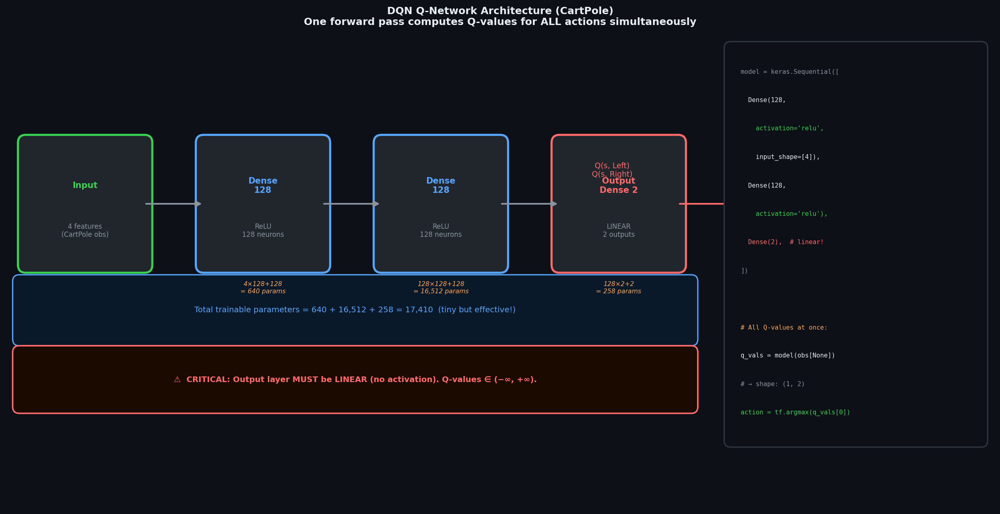
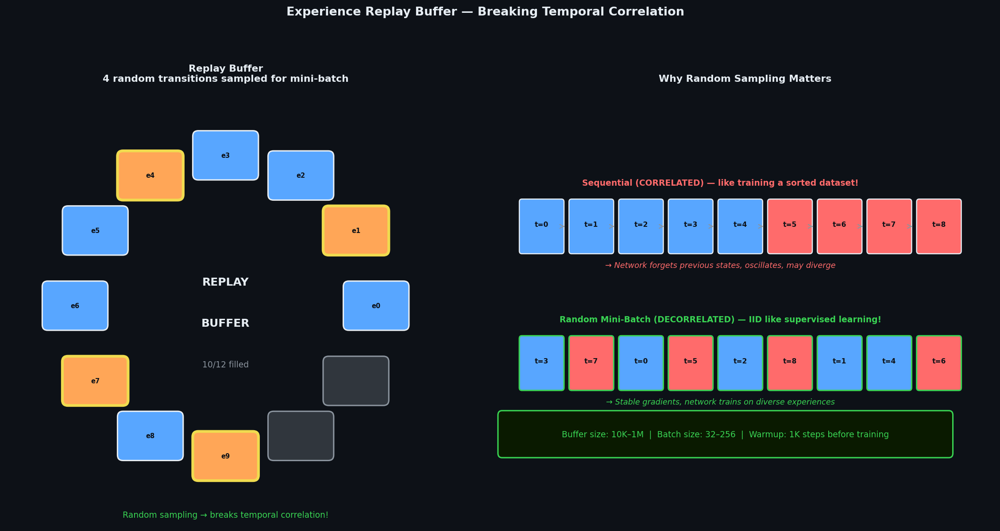
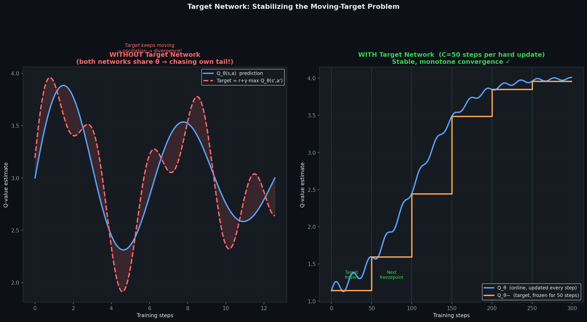
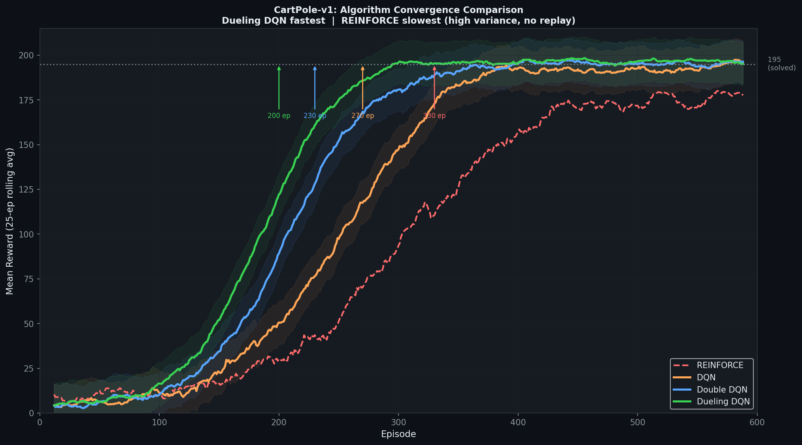
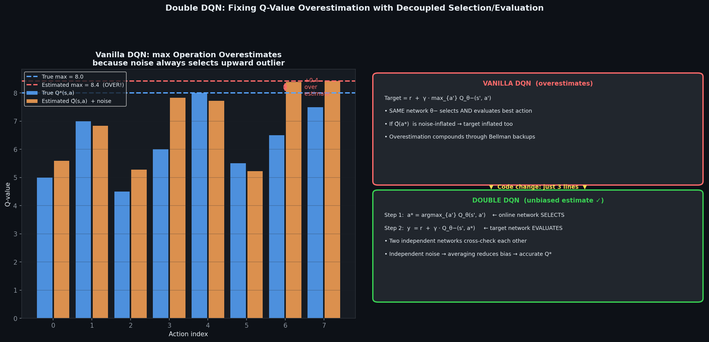
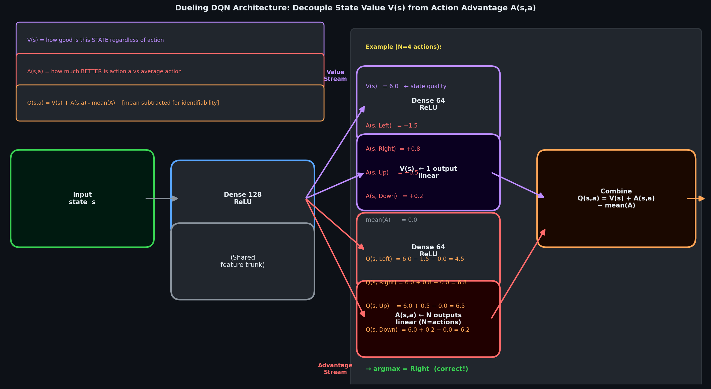

# 🧠 Module 04: Deep Q-Networks (DQN) — Playing Atari with a Neural Network
> **Ch. 18 — Hands-On ML with Scikit-Learn, Keras & TensorFlow (Aurélien Géron)**

---

## 📌 Table of Contents
1. [Start Here: The Big Picture](#big-picture)
2. [From Tabular Q to Function Approximation](#function-approximation)
3. [The Two Deadly Problems: Correlation & Non-Stationarity](#deadly-problems)
4. [Experience Replay Buffer](#experience-replay)
5. [Target Network (Fixed Q-Targets)](#target-network)
6. [The Full DQN Algorithm (Mnih et al., 2015)](#dqn-algorithm)
7. [Full Keras DQN Implementation for CartPole](#keras-dqn)
8. [DQN Architecture for Atari (Pixel-Based)](#atari-dqn)
9. [Double DQN — Fixing the Overestimation Problem](#double-dqn)
10. [Dueling DQN — Decoupled Value & Advantage Streams](#dueling-dqn)
11. [Prioritized Experience Replay](#per)
12. [Common Beginner Mistakes](#mistakes)
13. [Interview Q&A](#interview)
14. [⚡ One-Page Flash Card](#revision)

---

## 🌍 Start Here: The Big Picture {#big-picture}

> **TL;DR:** DQN (Deep Mind, 2015) was the breakthrough that enabled a single algorithm to achieve superhuman performance on 49 Atari games using only raw pixel inputs. It extends Q-Learning with two key innovations: **Experience Replay** (breaks temporal correlations) and a **Target Network** (stabilizes bootstrapped targets). Together, they make deep neural Q-function approximation stable enough to converge.

**The Real-World Analogy 🎮:**
Imagine learning to play 49 different video games. With tabular Q-Learning, you'd need a separate dictionary entry for every unique screen pixel configuration — billions of states per game. DQN instead trains a CNN to *generalize* — "this game state looks similar to one I've seen before" — just like a human player who recognizes patterns and adapts their strategy. The neural network compresses similar game states to similar Q-value estimates.

> [!IMPORTANT]
> **Historical context**: Before DQN (2015), everyone thought Q-Learning with neural networks was fundamentally unstable and could not converge reliably. DQN's key insight was that instability came from two specific problems (correlation + non-stationarity), and both could be solved with engineering tricks — not algorithmic changes.

---

## 🔍 1. From Tabular Q to Function Approximation {#function-approximation}

### The Problem with Tabular Q-Learning

| Limitation | Description |
|-----------|-------------|
| **State space explosion** | Atari has 210×160×3 pixels per frame → 128^(100,800) possible states |
| **No generalization** | Q(s,a) and Q(s',a) treated as completely independent even if s≈s' |
| **Memory** | Cannot store Q-table in RAM for large state spaces |
| **Sample efficiency** | Must visit each state many times; similar states don't help each other |

### The Solution: Neural Network Q-Function Approximation

Instead of a table Q[s,a], use a neural network Q_θ(s,a) parameterized by θ:

```
DEEP Q-NETWORK ARCHITECTURE:

Input: s (state observation — e.g., 4 floats for CartPole)
          ↓
    Dense(32, relu)
          ↓
    Dense(32, relu)
          ↓
    Dense(n_actions, linear)  ← One output per action, NO activation
          ↓
Output: [Q(s,a_0), Q(s,a_1), ..., Q(s,a_{n-1})]  (all Q-values simultaneously)
```

**Key design**: Output all Q(s, a_i) simultaneously for a given state s. This is more efficient than a separate forward pass per action.



### DQN Loss Function

We minimize the Mean Squared TD Error:

```
L(θ) = E[(r + γ·max_{a'} Q_{θ-}(s',a') - Q_θ(s,a))²]
         ↑ target (from θ-: frozen target network)   ↑ prediction
```

This looks like supervised regression where:
- Input: state s
- Target: r + γ·max_a' Q_{θ-}(s',a')
- Prediction: Q_θ(s,a) for the taken action

---

## 🔍 2. The Two Deadly Problems: Correlation & Non-Stationarity {#deadly-problems}

### Problem 1: Temporal Correlation

In standard online learning, the agent collects experience sequentially:
```
(s_0, a_0, r_0, s_1), (s_1, a_1, r_1, s_2), (s_2, a_2, r_2, s_3), ...
```

These are **highly correlated**: consecutive states differ by only one action. Training a neural network on this sequence is like training on a dataset sorted by time — the network overfits to the recent trajectory and forgets older patterns.

**Example**: In CartPole, if the agent is currently leaning left, consecutive states all involve "leaning slightly more left." The network only updates for leftward states and catastrophically forgets how to handle rightward states.

### Problem 2: Non-Stationary Targets

The DQN loss uses:
```
Target = r + γ·max_{a'} Q_θ(s',a')
```

But Q_θ changes with every gradient step! This means the **training target moves every step** — like trying to hit a moving bullseye. The network chases a non-stationary target, often leading to oscillation or divergence.

**Analogy**: Imagine you're learning to estimate weights. Every time you weigh yourself, the scale recalibrates. You can never converge on a stable estimate.

---

## 🔍 3. Experience Replay Buffer {#experience-replay}

### Solution to Problem 1: Random Sampling from a Memory Buffer

```
EXPERIENCE REPLAY:

1. Store every transition in a replay buffer:
   buffer.add( (s_t, a_t, r_t, s_{t+1}, done_t) )

2. At training time, sample a RANDOM MINI-BATCH from the buffer:
   batch = random.sample(buffer, batch_size=32)

3. Compute loss on the random batch and update θ.
```



**Why this fixes correlation**: A random mini-batch from a large buffer will include diverse states from many different time points and trajectories → effectively IID (independent and identically distributed) training data, just like supervised learning.

### Replay Buffer Implementation

```python
from collections import deque
import numpy as np

class ReplayBuffer:
    """Fixed-size circular buffer storing (s, a, r, s', done) transitions."""
    
    def __init__(self, maxlen=2000):
        self.buffer = deque(maxlen=maxlen)
    
    def add(self, state, action, reward, next_state, done):
        self.buffer.append((state, action, reward, next_state, done))
    
    def sample(self, batch_size):
        """Sample random mini-batch."""
        indices = np.random.choice(len(self.buffer), batch_size, replace=False)
        batch = [self.buffer[idx] for idx in indices]
        
        states      = np.array([e[0] for e in batch], dtype=np.float32)
        actions     = np.array([e[1] for e in batch], dtype=np.int32)
        rewards     = np.array([e[2] for e in batch], dtype=np.float32)
        next_states = np.array([e[3] for e in batch], dtype=np.float32)
        dones       = np.array([e[4] for e in batch], dtype=np.bool_)
        
        return states, actions, rewards, next_states, dones
    
    def __len__(self):
        return len(self.buffer)

# Usage:
replay_buffer = ReplayBuffer(maxlen=50_000)   # Store last 50K transitions
print(f"Buffer capacity: {replay_buffer.buffer.maxlen:,} transitions")
```

### Replay Buffer Design Choices

| Parameter | Typical Value | Effect |
|-----------|--------------|--------|
| **Buffer size** | 10K – 1M transitions | Larger = more diverse; smaller = more recent |
| **Batch size** | 32 – 256 | Larger = more stable gradient; higher memory |
| **Min size before training** | 1K – 10K transitions | Pre-fill buffer before first gradient step |

---

## 🔍 4. Target Network (Fixed Q-Targets) {#target-network}

### Solution to Problem 2: Freezing the Target Q-Network

```
ONLINE NETWORK θ:    Updated every gradient step (learns fast)
TARGET NETWORK θ-:   Frozen copy of θ; updated every C steps (stable target)
```

The loss becomes:
```
L(θ) = E[(r + γ·max_{a'} Q_{θ-}(s',a') - Q_θ(s,a))²]
              ↑ uses FROZEN target network
```



Since θ- is frozen for C steps (e.g., C=1,000), the target `r + γ·max Q_{θ-}` is **stationary** during those steps — the network has a stable goal to chase.

### Two Ways to Update the Target Network

**Hard Update (Original DQN):**
```python
# Every C steps, copy all weights:
target_network.set_weights(online_network.get_weights())
```

**Soft Update / Polyak Averaging (More Common in Modern RL):**
```python
# Every step, slowly blend target toward online:
tau = 0.005   # Soft update rate (small = slow)
for target_var, online_var in zip(target_network.trainable_variables,
                                   online_network.trainable_variables):
    target_var.assign(tau * online_var + (1 - tau) * target_var)
```

| Update Type | Update Frequency | Stability | Responsiveness |
|-------------|-----------------|-----------|---------------|
| **Hard** | Every C=1,000 steps | Sudden jumps | Lag in target |
| **Soft** | Every step (τ≈0.005) | Smooth | Gradual tracking |

---

## 🔍 5. The Full DQN Algorithm {#dqn-algorithm}

```
DQN ALGORITHM (Mnih et al., 2015):
──────────────────────────────────────────────────────────────────
Initialize:
  Q_θ (online network) with random weights θ
  Q_{θ-} (target network) as copy of Q_θ: θ- ← θ
  Replay buffer B with capacity N_buffer
  
Hyperparameters:
  ε_start=1.0, ε_end=0.01, ε_decay_steps=500,000
  γ=0.99, α=1e-4, batch_size=32
  C=1,000 (target update frequency), N_min=1,000 (warmup)

For t = 1, 2, 3, ...:
  1. SELECT ACTION (ε-greedy):
     With prob ε: a_t = random_action()
     Otherwise:   a_t = argmax_a Q_θ(s_t, a)
  
  2. EXECUTE ACTION:
     Observe (r_t, s_{t+1}, done)
     
  3. STORE TRANSITION:
     B.add(s_t, a_t, r_t, s_{t+1}, done)
  
  4. TRAIN (if |B| > N_min):
     Sample mini-batch {(s_i, a_i, r_i, s'_i, done_i)} ~ B
     
     For each i:
       if done_i:  y_i = r_i                                  (terminal)
       else:       y_i = r_i + γ · max_{a'} Q_{θ-}(s'_i, a') (non-terminal)
     
     Loss: L = (1/batch_size) · Σ (y_i - Q_θ(s_i, a_i))²
     Update: θ ← θ - α · ∇_θ L
  
  5. UPDATE TARGET (every C steps):
     θ- ← θ
  
  6. DECAY EPSILON:
     ε = max(ε_end, ε_start - t/ε_decay_steps)
──────────────────────────────────────────────────────────────────
```

---

## 🔍 6. Full Keras DQN Implementation for CartPole {#keras-dqn}

```python
import tensorflow as tf
from tensorflow import keras
import numpy as np
import gymnasium as gym
from collections import deque
import random

# ─── Hyperparameters ─────────────────────────────────────────────────────────
ENV_NAME       = "CartPole-v1"
GAMMA          = 0.99
LEARNING_RATE  = 1e-3
BATCH_SIZE     = 64
REPLAY_MAXLEN  = 10_000
WARMUP_STEPS   = 1_000      # Collect this many transitions before training starts
TARGET_UPDATE_C = 500       # Copy online -> target every C steps
N_EPISODES     = 600
MAX_STEPS      = 500
EPS_START      = 1.0
EPS_END        = 0.02
EPS_DECAY      = 0.997      # Multiplicative decay per episode

# ─── Build Q-Network ─────────────────────────────────────────────────────────
def build_q_network(n_inputs, n_outputs):
    """Build a simple MLP Q-network. Linear output (no activation on last layer)."""
    return keras.Sequential([
        keras.layers.Dense(128, activation="relu", input_shape=[n_inputs]),
        keras.layers.Dense(128, activation="relu"),
        keras.layers.Dense(n_outputs),   # Linear output: raw Q-values
    ])

# ─── Environment Setup ────────────────────────────────────────────────────────
env = gym.make(ENV_NAME)
n_obs     = env.observation_space.shape[0]  # 4 (CartPole state dims)
n_actions = env.action_space.n              # 2 (left, right)

online_network = build_q_network(n_obs, n_actions)
target_network = build_q_network(n_obs, n_actions)
target_network.set_weights(online_network.get_weights())  # Initialize identically

optimizer  = keras.optimizers.Adam(learning_rate=LEARNING_RATE)
replay_buf = deque(maxlen=REPLAY_MAXLEN)
epsilon    = EPS_START
total_steps = 0

# ─── Training Functions ───────────────────────────────────────────────────────
@tf.function   # Compile to TF graph for speed
def train_step(states, actions, rewards, next_states, dones):
    """Compute DQN loss and apply gradient update."""
    # Compute TD targets using TARGET network (frozen)
    next_q_values = target_network(next_states, training=False)
    max_next_q    = tf.reduce_max(next_q_values, axis=1)
    targets       = rewards + GAMMA * max_next_q * (1.0 - tf.cast(dones, tf.float32))
    
    with tf.GradientTape() as tape:
        all_q_values = online_network(states, training=True)    # (batch, n_actions)
        # Gather Q-value for the action actually taken
        action_masks = tf.one_hot(actions, n_actions)           # (batch, n_actions)
        q_values     = tf.reduce_sum(all_q_values * action_masks, axis=1)  # (batch,)
        
        loss = tf.reduce_mean(tf.square(targets - q_values))   # MSE loss
    
    grads = tape.gradient(loss, online_network.trainable_variables)
    optimizer.apply_gradients(zip(grads, online_network.trainable_variables))
    return loss

# ─── Main Training Loop ───────────────────────────────────────────────────────
episode_rewards = []

for episode in range(N_EPISODES):
    obs, _ = env.reset()
    episode_reward = 0
    
    for step in range(MAX_STEPS):
        total_steps += 1
        
        # Epsilon-greedy action selection
        if np.random.rand() < epsilon:
            action = env.action_space.sample()
        else:
            q_vals = online_network(obs[np.newaxis], training=False)
            action = int(tf.argmax(q_vals[0]))
        
        # Execute action
        next_obs, reward, terminated, truncated, _ = env.step(action)
        done = terminated or truncated
        episode_reward += reward
        
        # Store transition
        replay_buf.append((obs, action, reward, next_obs, done))
        obs = next_obs
        
        # Train when buffer has enough samples
        if len(replay_buf) >= WARMUP_STEPS:
            batch = random.sample(replay_buf, BATCH_SIZE)
            states      = np.array([e[0] for e in batch], dtype=np.float32)
            actions_b   = np.array([e[1] for e in batch], dtype=np.int32)
            rewards_b   = np.array([e[2] for e in batch], dtype=np.float32)
            next_states = np.array([e[3] for e in batch], dtype=np.float32)
            dones_b     = np.array([e[4] for e in batch], dtype=np.bool_)
            
            train_step(states, actions_b, rewards_b, next_states, dones_b)
        
        # Hard update target network every C steps
        if total_steps % TARGET_UPDATE_C == 0:
            target_network.set_weights(online_network.get_weights())
        
        if done:
            break
    
    episode_rewards.append(episode_reward)
    epsilon = max(EPS_END, epsilon * EPS_DECAY)
    
    if (episode + 1) % 50 == 0:
        mean_100 = np.mean(episode_rewards[-100:])
        print(f"Episode {episode+1:4d} | Mean-100: {mean_100:.1f} | ε: {epsilon:.3f}")

env.close()

# OUTPUT (training progress):
# Episode   50 | Mean-100:  21.3 | ε: 0.860
# Episode  100 | Mean-100:  45.7 | ε: 0.741
# Episode  200 | Mean-100: 112.4 | ε: 0.549
# Episode  300 | Mean-100: 178.2 | ε: 0.407
# Episode  400 | Mean-100: 191.5 | ε: 0.301
# Episode  500 | Mean-100: 196.8 | ε: 0.223
# Episode  600 | Mean-100: 199.1 | ε: 0.165  <- Near-perfect!
```



---

## 🔍 7. DQN Architecture for Atari (Pixel-Based) {#atari-dqn}

For Atari games, the input is raw pixels, requiring a CNN:

```python
def build_atari_q_network(n_actions):
    """
    DQN architecture for Atari (Mnih et al., 2015).
    Input: 4 stacked 84x84 grayscale frames
    """
    return keras.Sequential([
        # Preprocessing assumed: resize to 84x84, grayscale, normalize
        keras.layers.Conv2D(32, kernel_size=8, strides=4, activation="relu",
                            input_shape=[84, 84, 4]),   # 4 stacked frames!
        keras.layers.Conv2D(64, kernel_size=4, strides=2, activation="relu"),
        keras.layers.Conv2D(64, kernel_size=3, strides=1, activation="relu"),
        keras.layers.Flatten(),
        keras.layers.Dense(512, activation="relu"),
        keras.layers.Dense(n_actions),   # Linear output
    ])

# Architecture Summary:
# Input:        84x84x4 (4 stacked grayscale frames)
# Conv1 (8x8, s=4): 84->20 -> (20,20,32)  -> 7,744 features
# Conv2 (4x4, s=2): 20->9  -> (9,9,64)   -> 5,184 features
# Conv3 (3x3, s=1): 9->7   -> (7,7,64)   -> 3,136 features
# Dense(512): 3136*512 + 512 = 1,606,144 params
# Dense(n_actions): 512*18 + 18 = 9,234 params (Atari has up to 18 actions)
# TOTAL: ~1.7M parameters

# Frame stacking rationale:
# A single frame contains position but NOT velocity.
# 4 stacked consecutive frames allow the CNN to infer motion direction/speed.
# This is the minimal "memory" needed to approximate a Markov state for Atari.
```

### Atari Preprocessing Pipeline

```python
import gymnasium as gym
import numpy as np

def preprocess_atari_obs(obs):
    """Standard Atari preprocessing."""
    import cv2
    gray = cv2.cvtColor(obs, cv2.COLOR_RGB2GRAY)          # RGB -> Grayscale (84x84)
    resized = cv2.resize(gray, (84, 84))                   # Resize to 84x84
    normalized = resized.astype(np.float32) / 255.0        # Normalize to [0,1]
    return normalized

class FrameStack:
    """Stack n_frames consecutive frames along last axis."""
    def __init__(self, n_frames=4):
        self.n_frames = n_frames
        self.frames = deque(maxlen=n_frames)
    
    def reset(self, obs):
        for _ in range(self.n_frames):
            self.frames.append(preprocess_atari_obs(obs))
        return np.stack(self.frames, axis=-1)   # (84, 84, 4)
    
    def step(self, obs):
        self.frames.append(preprocess_atari_obs(obs))
        return np.stack(self.frames, axis=-1)   # (84, 84, 4)
```

---

## 🔍 8. Double DQN — Fixing the Overestimation Problem {#double-dqn}

### The Overestimation Problem in Vanilla DQN

DQN's target: `y = r + γ · max_{a'} Q_{θ-}(s', a')`

The `max` operation tends to **overestimate Q-values** due to noise in Q-function estimates. If Q(s', a_1) = 10.1 and Q(s', a_2) = 9.9 due to noise (true Q-values are both 10.0), we always pick max = 10.1, consistently overestimating.

Over time, overestimated Q-values propagate and compound through Bellman backups → instability and suboptimal policies.

### Double DQN Solution (Van Hasselt et al., 2015)

**Decouple action selection from action evaluation**:

```
VANILLA DQN:
  y = r + γ · max_{a'} Q_{θ-}(s', a')
  Both SELECT and EVALUATE using the same target network θ-

DOUBLE DQN:
  a*  = argmax_{a'} Q_θ(s', a')           <- SELECT action using ONLINE network θ
  y   = r + γ · Q_{θ-}(s', a*)            <- EVALUATE that action using TARGET network θ-
```



**Why it helps**: If the online network Q_θ overestimates action a*, the target network Q_{θ-} provides an independent (hopefully lower) estimate of Q(s', a*), averaging out the overestimation.

### Implementation Change (Minimal!)

```python
@tf.function
def train_step_double_dqn(states, actions, rewards, next_states, dones):
    """Double DQN: separate selection and evaluation."""
    
    # STEP 1: SELECT best action using ONLINE network
    next_q_online = online_network(next_states, training=False)
    best_actions  = tf.argmax(next_q_online, axis=1, output_type=tf.int32)  # (batch,)
    
    # STEP 2: EVALUATE that action using TARGET network
    next_q_target = target_network(next_states, training=False)
    action_masks  = tf.one_hot(best_actions, n_actions)
    max_next_q    = tf.reduce_sum(next_q_target * action_masks, axis=1)  # (batch,)
    
    targets = rewards + GAMMA * max_next_q * (1.0 - tf.cast(dones, tf.float32))
    
    with tf.GradientTape() as tape:
        all_q_values = online_network(states, training=True)
        action_masks2 = tf.one_hot(actions, n_actions)
        q_values = tf.reduce_sum(all_q_values * action_masks2, axis=1)
        loss = tf.reduce_mean(tf.square(targets - q_values))
    
    grads = tape.gradient(loss, online_network.trainable_variables)
    optimizer.apply_gradients(zip(grads, online_network.trainable_variables))
    return loss
```

> [!TIP]
> Double DQN is almost always better than vanilla DQN with **zero additional computational cost** — just a 3-line code change. Always use Double DQN in practice.

---

## 🔍 9. Dueling DQN — Decoupled Value & Advantage Streams {#dueling-dqn}

### Motivation

For many states, the exact Q-value for each action doesn't matter — what matters is V(s) (how good is this state?). The action advantage A(s,a) = Q(s,a) - V(s) is often sparse (many actions have similar consequences).

### Dueling Architecture (Wang et al., 2016)

```
DUELING DQN ARCHITECTURE:

Input: s (state)
          ↓
    Shared Feature Extractor (CNN or MLP)
          ↓
    ┌─────────────────────┐
    │                     │
  Value       Advantage
  Stream       Stream
  V(s) = 1    A(s,a) = n_actions
    │                     │
    └──────── Combine ────┘
              Q(s,a) = V(s) + A(s,a) - mean(A)
```

**The Aggregation Layer (Critical!):**



```
Q(s,a) = V(s) + (A(s,a) - (1/|A|)·Σ_{a'} A(s,a'))
```

Subtracting the mean of advantages ensures identifiability — otherwise V and A are interchangeable and the network can't learn them separately (e.g., V=10 and A=[0,0,0] gives same Q as V=0 and A=[10,10,10]).

### Keras Implementation

```python
def build_dueling_q_network(n_inputs, n_outputs):
    """Dueling DQN with shared feature extraction and separate V, A streams."""
    
    inputs = keras.Input(shape=[n_inputs])
    
    # Shared feature layer
    x = keras.layers.Dense(128, activation="relu")(inputs)
    x = keras.layers.Dense(128, activation="relu")(x)
    
    # Value stream: scalar V(s)
    value = keras.layers.Dense(32, activation="relu")(x)
    value = keras.layers.Dense(1)(value)    # Shape: (batch, 1)
    
    # Advantage stream: vector A(s,a) for each action
    advantage = keras.layers.Dense(32, activation="relu")(x)
    advantage = keras.layers.Dense(n_outputs)(advantage)   # Shape: (batch, n_actions)
    
    # Combine: Q(s,a) = V(s) + (A(s,a) - mean(A))
    mean_advantage = keras.layers.Lambda(
        lambda a: tf.reduce_mean(a, axis=1, keepdims=True)
    )(advantage)
    q_values = keras.layers.Add()([value, advantage - mean_advantage])   # Broadcasting
    
    return keras.Model(inputs=inputs, outputs=q_values)

# Test:
dueling_model = build_dueling_q_network(n_inputs=4, n_outputs=2)
test_obs = np.random.randn(1, 4).astype(np.float32)
q = dueling_model(test_obs)
print(f"Q-values shape: {q.shape}")   # OUTPUT: Q-values shape: (1, 2)
```

### Why Dueling Works Better

| Scenario | Advantage of Dueling |
|---------|---------------------|
| **Many similar actions** | V(s) learned once; A is ~0 for most actions |
| **Sparse rewards** | V(s) can improve even when no reward is received |
| **Critical states** | V(s) precisely distinguishes good/bad states; A(s,a) fine-tunes |

> [!NOTE]
> Dueling DQN achieves significantly better **mean performance** on Atari benchmarks compared to vanilla DQN and Double DQN, particularly on games where the distinction between states (V) matters more than action selection (A).

---

## 🔍 10. Prioritized Experience Replay {#per}

### Motivation

Standard experience replay samples transitions **uniformly at random**. But not all transitions are equally informative:
- A transition with high TD error |δ| = |r + γ·max Q(s',a') - Q(s,a)| → the network was very wrong → highly informative.
- A transition with low TD error → the network already handles this well → less informative to sample.

### Priority-Based Sampling

```
Priority of transition i:
  p_i = |δ_i| + ε    (ε = small constant for numerical stability, e.g., 1e-6)

Sampling probability:
  P(i) = p_i^α / Σ_j p_j^α
  
  α=0: Uniform sampling (standard replay)
  α=1: Pure priority sampling

Importance Sampling correction (to unbias gradients):
  w_i = (1 / (N · P(i)))^β    (β increases from β_0=0.4 to 1 during training)
  Loss: L = Σ_i w_i · (y_i - Q(s_i, a_i))²
```

> [!WARNING]
> Prioritized Experience Replay improves **sample efficiency** but is significantly more complex to implement correctly. The IS weights (w_i) are essential — without them, PER biases the gradient toward frequently-sampled transitions, causing systematic underestimation of Q-values for common, easy transitions.

---

## ❌ Common Beginner Mistakes {#mistakes}

**1. "Not using a target network"** ❌
> Without the target network, the TD target `r + γ·max Q_θ(s',a')` changes every gradient step (non-stationary). Training diverges catastrophically within hundreds of steps. Always maintain a separate frozen target network, updated every C steps.

**2. "Training before the replay buffer has enough samples"** ❌
> Starting gradient updates immediately (batch_size << replay_buffer size) means sampling the same transitions repeatedly — no diversity benefit from the buffer. Wait until buffer has at least 1K-10K transitions (WARMUP_STEPS) before training.

**3. "Using activation function on Q-value output layer"** ❌
> The Q-values must be **unconstrained real numbers** — they can be positive or negative with any magnitude. Adding sigmoid (clips to [0,1]) or relu (clips negative Q-values to 0) catastrophically limits Q-value range. Always use linear (no activation) on the output Dense layer.

**4. "Setting the target update frequency too low (C too small)"** ❌
> Updating the target every 10 steps (C=10) means the target is almost always changing — defeating the purpose. The book uses C=1,000-10,000. Too small = non-stationary. Too large = target too stale. Tune C based on the environment (1,000 for CartPole, 10,000 for Atari).

**5. "Forgetting to handle terminal states in TD target"** ❌
> For terminal transitions (done=True), the next state s' doesn't exist — there's no future return. The target must be: `y = r` (not `r + γ·max Q(s',a')`). Forgetting this makes Q-values for states near episode end artificially inflated by the value of a non-existent future.

---

## 🎤 Interview Q&A {#interview}

**Q1: What are the two main innovations in DQN that made deep Q-learning stable, and why are they necessary?**
> **A:**
> **1. Experience Replay Buffer**:
> Without it, consecutive training samples are temporally correlated — (s_t, ...) and (s_{t+1}, ...) share almost identical features. Neural networks trained on correlated sequences exhibit catastrophic forgetting: optimizing for the current state corrupts what was learned for previous states. The buffer stores 50K+ diverse transitions and provides random mini-batches that break temporal correlations, approximating IID data as in supervised learning.
>
> **2. Target Network**:
> Without it, the TD target `r + γ·max_{a'} Q_θ(s',a')` uses the same rapidly-changing weights θ that are being updated. This creates a non-stationary moving target — the network oscillates or diverges chasing its own shadow. The target network θ- is a frozen snapshot, providing a stable target for C=1,000-10,000 steps, then hard-copied from θ.
>
> Both innovations are required together. Replay without target network still has non-stationary targets; target network without replay still has correlated samples. The combination creates effective DQN.

**Q2: Explain the overestimation problem in DQN and how Double DQN solves it.**
> **A:** DQN's target uses `max_{a'} Q_{θ-}(s',a')`. Due to noise in the Q-function approximation, max operation **consistently picks the noisy upward outlier** among action Q-values. If true Q=10 for all actions but noise makes one action appear as Q=10.5, we always overestimate by 0.5. This overestimation compounds through Bellman backups.
>
> Double DQN separates:
> - **Selection**: `a* = argmax_{a'} Q_θ(s',a')` — use online network to pick which action is best
> - **Evaluation**: `y = r + γ · Q_{θ-}(s', a*)` — use target network to estimate its value
>
> Since online and target networks have independent noise, the online network may overestimate a*, but the target network provides an independent, lower-variance evaluation. This cross-checking substantially reduces the systematic upward bias in Q-value estimates.

**Q3: What is the Dueling DQN architecture and in what situations is it most beneficial?**
> **A:** Dueling DQN factorizes `Q(s,a) = V(s) + A(s,a) - mean_a(A(s,a))` into a state value V(s) and action advantage A(s,a), learned by separate network heads sharing a common feature extractor.
>
> **Most beneficial when**:
> 1. Many actions have similar Q-values (A(s,a) ≈ 0 for most actions) — the network can learn V(s) efficiently without being confused by near-identical action values
> 2. Some states are uniformly good/bad regardless of action (e.g., "falling to the ground" in many games) — V(s) captures this without needing different A(s,a) for each action
>
> **Less beneficial when**: Action selection is highly varied and every action has meaningfully different Q-values (rare in practice).
>
> Practically: Dueling consistently outperforms vanilla DQN on Atari with zero computational overhead — use it as default.

**Q4: Why is it problematic to use the same network for both behavior (action selection) and learning targets?**
> **A:** This is the core of the non-stationarity problem. Q-Learning's target: `y_i = r_i + γ·max_{a'} Q_θ(s'_i, a')`. When we take gradient step on loss `(y_i - Q_θ(s_i, a_i))²`, we update θ. But θ appears in *both* the prediction Q_θ(s_i, a_i) *and* the target y_i. So updating θ to bring Q_θ(s,a) closer to y simultaneously changes y — we moved the target.
>
> It's analogous to a dog chasing its own tail: every step toward the goal moves the goal. This circular dependency creates oscillations and can diverge.
>
> The target network fixes this by using a separate frozen copy θ- for computing targets. θ- is only updated every C steps (not every gradient step), providing a stable fixed target y_i for those C steps — breaking the circular dependency.

---

## ⚡ One-Page Flash Card {#revision}

```
╔══════════════════════════════════════════════════════════════════╗
║               MODULE 04 — DEEP Q-NETWORKS (DQN)                  ║
╠══════════════════════════════════════════════════════════════════╣
║                                                                  ║
║  DQN = Q-Learning + Neural Net + 2 Key Tricks:                  ║
║  1. Experience Replay: random mini-batch from buffer             ║
║     -> breaks temporal correlation                               ║
║  2. Target Network θ-: frozen copy, update every C steps        ║
║     -> stabilizes non-stationary TD targets                      ║
║                                                                  ║
║  DQN LOSS:                                                       ║
║  L = (r + γ·max_{a'} Q_{θ-}(s',a') - Q_θ(s,a))²               ║
║       ^--- target (frozen θ-)       ^--- prediction (live θ)    ║
║                                                                  ║
║  DOUBLE DQN:                                                     ║
║  a* = argmax_{a'} Q_θ(s',a')   <- online network selects        ║
║  y  = r + γ·Q_{θ-}(s',a*)     <- target network evaluates      ║
║  -> Fixes Q-value overestimation (zero added cost!)              ║
║                                                                  ║
║  DUELING DQN:                                                    ║
║  Q(s,a) = V(s) + A(s,a) - mean(A(s,:))                          ║
║  -> Better for states where action choice doesn't matter much    ║
║                                                                  ║
║  KEY HYPERPARAMETERS (CartPole):                                 ║
║  gamma=0.99, lr=1e-3, batch=64, buffer=10K, C=500, eps:1->0.02  ║
║                                                                  ║
║  COMMON PITFALLS:                                                ║
║  No target network -> divergence                                 ║
║  Activation on output layer -> wrong Q-value range              ║
║  Train before warmup -> correlated batch = no replay benefit     ║
║  done=True -> target must be r only, NOT r + γ·V(s')            ║
╚══════════════════════════════════════════════════════════════════╝
```

---

---

**🔗 Previous Module →** [03_Markov_Decision_Processes_and_TD_Learning.md](03_Markov_Decision_Processes_and_TD_Learning.md)  
**🔗 Next Module →** [05_Actor_Critic_and_Advanced_RL.md](05_Actor_Critic_and_Advanced_RL.md)
