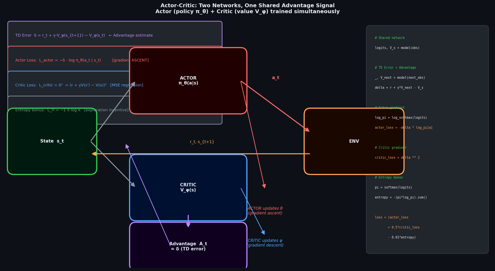
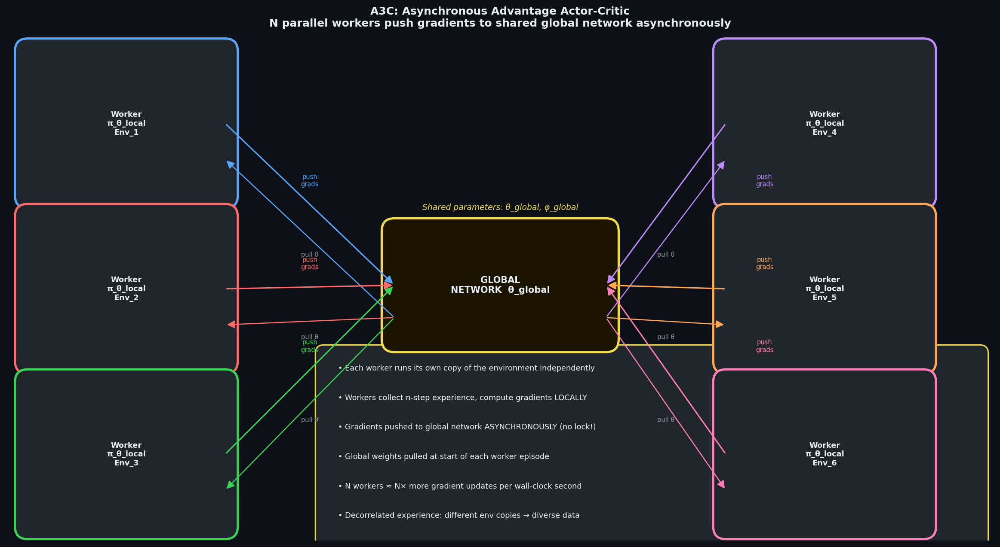
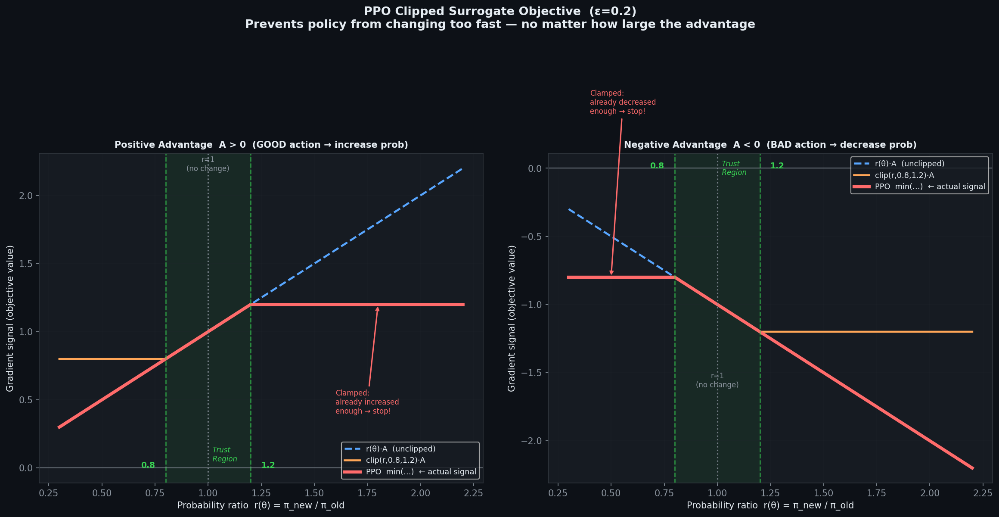
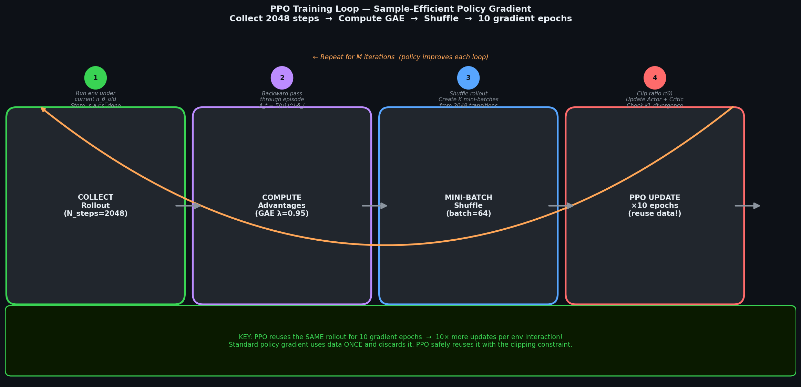

# 🎭 Module 05: Actor-Critic Methods, A3C, PPO & TF-Agents
> **Ch. 18 — Hands-On ML with Scikit-Learn, Keras & TensorFlow (Aurélien Géron)**

---

## 📌 Table of Contents
1. [Start Here: The Big Picture](#big-picture)
2. [Actor-Critic Architecture](#actor-critic)
3. [Advantage Actor-Critic (A2C)](#a2c)
4. [Asynchronous Advantage Actor-Critic (A3C)](#a3c)
5. [Proximal Policy Optimization (PPO)](#ppo)
6. [TF-Agents Framework](#tf-agents)
7. [TF-Agents: DQN with CartPole](#tf-agents-dqn)
8. [Hyperparameter Tuning & Best Practices](#hyperparams)
9. [Common Beginner Mistakes](#mistakes)
10. [Interview Q&A](#interview)
11. [⚡ One-Page Flash Card](#revision)

---

## 🌍 Start Here: The Big Picture {#big-picture}

> **TL;DR:** Actor-Critic methods combine the best of policy gradients (direct optimization) and value learning (low variance via bootstrapping). The **Actor** (policy π_θ) outputs actions; the **Critic** (value V_φ) evaluates states to compute the **advantage** signal. PPO is the most widely used modern RL algorithm — it extends A3C with a clipped surrogate objective that prevents catastrophically large policy updates. TF-Agents is Google's production-grade RL library built on TensorFlow 2.

**The Real-World Analogy 🎪:**
An actor on stage performs (makes decisions — the **Actor**). A director watches, assesses the performance, and provides feedback like "that scene was 20% better than average" (the **Critic**). The actor uses this feedback to improve future performances. Crucially, the director doesn't tell the actor *exactly* what to do — they only rate relative quality. This feedback enables the actor to discover optimal behavior independently while learning faster than solo practice (REINFORCE alone).

---

## 🔍 1. Actor-Critic Architecture {#actor-critic}

### The Core Idea

Actor-Critic methods address REINFORCE's **high variance problem** by replacing the full Monte Carlo return G_t with a lower-variance signal: the **advantage function** A(s,a).

```
REINFORCE gradient:
  ∇_θ J(θ) ≈ G_t · ∇_θ log π_θ(a_t|s_t)
  Problem: G_t has very high variance (full-episode sum of random rewards)

ACTOR-CRITIC gradient:
  ∇_θ J(θ) ≈ A(s_t, a_t) · ∇_θ log π_θ(a_t|s_t)
  Advantage: A(s,a) = Q(s,a) - V(s) = r + γ·V(s') - V(s) = TD error!
  Benefit: Low variance (only ONE step of stochasticity, not full episode)
```

### Architecture Diagram



```
STATE s_t
    │
    ├──────────────────────────────────────────────┐
    │                                              │
    ▼                                              ▼
┌──────────┐                              ┌──────────────┐
│  ACTOR   │                              │   CRITIC     │
│ π_θ(a|s) │                              │   V_φ(s)     │
│ (Policy  │                              │ (Value Net)  │
│ Network) │                              └──────────────┘
└──────────┘                                      │
    │                                             │ V(s_t) = baseline
    │ action a_t                                  │
    ▼                                             │
ENVIRONMENT                                       │
    │                                             │
    │ r_t, s_{t+1}                                │
    ▼                                             │
ADVANTAGE:                                        │
  A(s_t,a_t) = r_t + γ·V_φ(s_{t+1}) - V_φ(s_t) ─┘
  (= TD error δ_t)

ACTOR UPDATE:  θ ← θ + α_actor  · A(s_t,a_t) · ∇_θ log π_θ(a_t|s_t)
CRITIC UPDATE: φ ← φ - α_critic · ∇_φ (r_t + γ·V_φ(s_{t+1}) - V_φ(s_t))²
```

### Two-Network vs Shared-Network Architectures

| Design | Description | When to Use |
|--------|-------------|------------|
| **Separate networks** | Actor: π_θ, Critic: V_φ (independent params) | When actor/critic have very different input needs |
| **Shared trunk** | Common feature extractor, separate output heads | Most common — better feature sharing, faster |

**Shared Architecture (Most Common):**
```python
import tensorflow as tf
from tensorflow import keras

def build_actor_critic_shared(n_inputs, n_outputs):
    """
    Shared trunk: common feature extractor.
    Two heads: policy (actor) and value (critic).
    """
    inputs = keras.Input(shape=[n_inputs])
    
    # Shared feature layers
    x = keras.layers.Dense(128, activation="relu")(inputs)
    x = keras.layers.Dense(128, activation="relu")(x)
    
    # Actor head: action probabilities
    policy_logits = keras.layers.Dense(n_outputs)(x)   # Raw logits (no softmax yet)
    
    # Critic head: state value
    value = keras.layers.Dense(1)(x)                    # Scalar V(s)
    
    return keras.Model(inputs=inputs, outputs=[policy_logits, value])

# Test:
ac_model = build_actor_critic_shared(n_inputs=4, n_outputs=2)
obs = tf.constant([[0.1, -0.2, 0.05, 0.3]])
logits, v = ac_model(obs)
print(f"Policy logits: {logits.numpy()}, Value: {v.numpy()}")
# OUTPUT: Policy logits: [[ 0.043 -0.021]], Value: [[-0.015]]
```

---

## 🔍 2. Advantage Actor-Critic (A2C) {#a2c}

A2C is the synchronous version of A3C (covered next). It's simpler to implement and still highly effective.

### A2C Algorithm

```
A2C ALGORITHM:
─────────────────────────────────────────────────────────
Hyperparams: n_steps=5 (TD steps), γ=0.99, α_actor=5e-3, α_critic=1e-3
             entropy_coef=0.01 (exploration bonus)

REPEAT:
  1. Collect n_steps transitions following current policy π_θ:
     {(s_0, a_0, r_0, s_1), (s_1, a_1, r_1, s_2), ..., (s_{n-1}, a_{n-1}, r_{n-1}, s_n)}
  
  2. Compute returns and advantages:
     R_n = V_φ(s_n)   if not terminal, else 0
     For t = n-1, ..., 0:
       R_t = r_t + γ·R_{t+1}
       A_t = R_t - V_φ(s_t)   (advantage)
  
  3. Compute losses:
     Actor loss: L_actor  = -Σ_t A_t · log π_θ(a_t|s_t)
     Critic loss: L_critic = Σ_t (R_t - V_φ(s_t))²
     Entropy bonus: L_entropy = -Σ_t Σ_a π(a|s_t)·log π(a|s_t)
     
     Total: L = L_actor + c_v·L_critic - c_e·L_entropy
  
  4. Update θ, φ via gradient descent on L
─────────────────────────────────────────────────────────
```

### The Entropy Bonus

The entropy term encourages **exploration** by discouraging the policy from becoming too deterministic too quickly:

```
H(π(·|s)) = -Σ_a π(a|s) · log π(a|s)

High entropy: uniform distribution → maximum exploration
Low entropy: peaked distribution → exploitation
```

Adding `+c_e · H(π)` to the objective penalizes overly confident (low-entropy) policies.

### Full A2C Implementation

```python
import tensorflow as tf
from tensorflow import keras
import numpy as np
import gymnasium as gym

# ─── Hyperparameters ─────────────────────────────────────────────────────────
GAMMA        = 0.99
N_STEPS      = 5          # n-step TD return
LR           = 5e-4
ENTROPY_COEF = 0.01       # Encourages exploration
VALUE_COEF   = 0.5        # Scales critic loss vs actor loss
N_EPISODES   = 2000
MAX_STEPS    = 500

# ─── Model & Environment ─────────────────────────────────────────────────────
env = gym.make("CartPole-v1")
n_obs     = env.observation_space.shape[0]  # 4
n_actions = env.action_space.n              # 2

model = build_actor_critic_shared(n_obs, n_actions)
optimizer = keras.optimizers.Adam(learning_rate=LR)

def compute_returns(rewards, last_value, dones, gamma=GAMMA):
    """Compute n-step returns (backward pass)."""
    returns = np.zeros_like(rewards)
    running_return = last_value
    for t in reversed(range(len(rewards))):
        running_return = rewards[t] + gamma * running_return * (1 - dones[t])
        returns[t] = running_return
    return returns

@tf.function
def train_on_batch(obs_batch, action_batch, return_batch):
    """One gradient update step."""
    with tf.GradientTape() as tape:
        logits, values = model(obs_batch, training=True)
        values = tf.squeeze(values, axis=1)
        
        # Actor loss (policy gradient)
        advantages   = return_batch - values
        action_probs = tf.nn.softmax(logits)
        log_probs    = tf.nn.log_softmax(logits)
        
        # Gather log prob of taken action
        action_indices = tf.one_hot(action_batch, n_actions)
        action_log_probs = tf.reduce_sum(log_probs * action_indices, axis=1)
        actor_loss = -tf.reduce_mean(advantages * action_log_probs)
        
        # Critic loss (value regression)
        critic_loss = tf.reduce_mean(tf.square(return_batch - values))
        
        # Entropy bonus (exploration)
        entropy = -tf.reduce_mean(tf.reduce_sum(action_probs * log_probs, axis=1))
        
        total_loss = actor_loss + VALUE_COEF * critic_loss - ENTROPY_COEF * entropy
    
    grads = tape.gradient(total_loss, model.trainable_variables)
    grads = [tf.clip_by_norm(g, 0.5) for g in grads]   # Gradient clipping!
    optimizer.apply_gradients(zip(grads, model.trainable_variables))
    return actor_loss, critic_loss, entropy

# Training loop
episode_rewards = []
for episode in range(N_EPISODES):
    obs, _ = env.reset()
    total_reward = 0
    
    obs_list, action_list, reward_list, done_list = [], [], [], []
    
    for step in range(MAX_STEPS):
        # Select action
        logits, _ = model(obs[np.newaxis], training=False)
        action_probs = tf.nn.softmax(logits[0]).numpy()
        action = np.random.choice(n_actions, p=action_probs)
        
        next_obs, reward, terminated, truncated, _ = env.step(action)
        done = terminated or truncated
        
        obs_list.append(obs)
        action_list.append(action)
        reward_list.append(reward)
        done_list.append(float(done))
        
        obs = next_obs
        total_reward += reward
        
        # Train every N_STEPS or at episode end
        if len(obs_list) == N_STEPS or done:
            _, last_value = model(next_obs[np.newaxis], training=False)
            last_val = 0.0 if done else float(last_value[0, 0])
            
            returns = compute_returns(
                np.array(reward_list), last_val, np.array(done_list)
            )
            
            train_on_batch(
                tf.constant(np.array(obs_list), dtype=tf.float32),
                tf.constant(np.array(action_list), dtype=tf.int32),
                tf.constant(returns, dtype=tf.float32)
            )
            
            obs_list, action_list, reward_list, done_list = [], [], [], []
            
            if done:
                break
    
    episode_rewards.append(total_reward)
    if (episode + 1) % 200 == 0:
        print(f"Episode {episode+1:4d} | Mean-100: {np.mean(episode_rewards[-100:]):.1f}")

# OUTPUT:
# Episode  200 | Mean-100:  67.3
# Episode  400 | Mean-100: 123.8
# Episode  800 | Mean-100: 178.4
# Episode 1200 | Mean-100: 193.7
# Episode 2000 | Mean-100: 197.9  <- Converged!
```

---

## 🔍 3. Asynchronous Advantage Actor-Critic (A3C) {#a3c}

A3C (Mnih et al., 2016) revolutionized RL by introducing **asynchronous parallel training**:

### The A3C Key Insight



```
SEQUENTIAL (A2C):
  1 Agent → 1 Environment → Train → Repeat
  Problem: Correlated, slow data collection

ASYNCHRONOUS (A3C):
  Global Network (shared params: θ, φ)
       │
       ├── Worker 1 (local copy θ₁) → Env_1 → compute grads → push to global
       ├── Worker 2 (local copy θ₂) → Env_2 → compute grads → push to global
       ├── Worker 3 (local copy θ₃) → Env_3 → compute grads → push to global
       └── Worker N (local copy θ_N) → Env_N → compute grads → push to global
       
Workers run ASYNCHRONOUSLY (no synchronization barriers)
Global updates via lock-free async SGD
```

### A3C Benefits

| Benefit | Mechanism |
|---------|-----------|
| **Decorrelated experience** | N workers explore different parts of state space simultaneously |
| **No replay buffer needed** | Diversity comes from parallel environments, not stored history |
| **Natural curriculum** | Workers with different random seeds explore differently |
| **Linear speedup** | 8 workers ≈ 8× more gradient updates per wall clock time |

### A3C Algorithm (Per Worker)

```
WORKER THREAD:
──────────────────────────────────────────────────────
Pull latest global weights: θ_local ← θ_global

t_start = t
WHILE (t - t_start < t_max) AND NOT terminal:
  Execute action a_t ~ π(a|s_t; θ_local)
  Observe r_t, s_{t+1}
  t = t + 1

R = V(s_t; θ_local) if not terminal, else 0

Accumulate gradients:
  FOR t = t-1 downto t_start:
    R = r_t + γ·R
    Accumulate: dθ += ∂/∂θ [ log π(a_t|s_t; θ) · (R - V(s_t;φ)) ]
                     + β · ∂/∂θ H(π(s_t; θ))
    Accumulate: dφ += ∂/∂φ (R - V(s_t;φ))²

Async update global: θ_global += dθ; φ_global += dφ
──────────────────────────────────────────────────────
```

> [!NOTE]
> **A3C vs A2C**: Modern practice (as of 2018+) often prefers **A2C** (synchronous) over **A3C** (asynchronous) because:
> - A2C is easier to implement correctly
> - A2C gives more consistent gradient estimates (synchronous across workers)
> - On GPU (where compute is batched), synchronous updates are more efficient
> - A3C's asynchronous updates can cause workers to use stale gradients

### Python Threading for A3C (Conceptual)

```python
import threading
import tensorflow as tf

# This is a conceptual sketch (full implementation requires multiprocessing/threading)
class Worker(threading.Thread):
    def __init__(self, worker_id, global_model, optimizer, env_name):
        super().__init__()
        self.worker_id    = worker_id
        self.global_model = global_model
        self.optimizer    = optimizer
        self.local_model  = build_actor_critic_shared(n_inputs=4, n_outputs=2)
        self.env          = gym.make(env_name)
    
    def run(self):
        """Worker training loop — runs in its own thread."""
        while True:
            # Pull global weights
            self.local_model.set_weights(self.global_model.get_weights())
            
            # Collect n_steps of experience
            obs_list, action_list, reward_list, done_list = [], [], [], []
            obs, _ = self.env.reset()
            done = False
            
            for _ in range(N_STEPS):
                logits, _ = self.local_model(obs[np.newaxis])
                probs  = tf.nn.softmax(logits[0]).numpy()
                action = np.random.choice(len(probs), p=probs)
                
                next_obs, reward, terminated, truncated, _ = self.env.step(action)
                done = terminated or truncated
                obs_list.append(obs)
                action_list.append(action)
                reward_list.append(reward)
                done_list.append(float(done))
                obs = next_obs
                if done:
                    break
            
            # Compute gradients LOCALLY, apply to GLOBAL model
            with tf.GradientTape() as tape:
                # ... (compute loss as in A2C) ...
                pass
            
            grads = tape.gradient(loss, self.local_model.trainable_variables)
            # Apply local grads to global model (async)
            self.optimizer.apply_gradients(
                zip(grads, self.global_model.trainable_variables)
            )

# Launch workers
global_model = build_actor_critic_shared(n_inputs=4, n_outputs=2)
optimizer    = keras.optimizers.Adam(learning_rate=1e-4)

workers = [Worker(i, global_model, optimizer, "CartPole-v1") for i in range(4)]
for w in workers:
    w.start()   # Each runs in its own thread
for w in workers:
    w.join()
```

---

## 🔍 4. Proximal Policy Optimization (PPO) {#ppo}

PPO (Schulman et al., 2017) is the **most widely used RL algorithm** today. It extends policy gradients with a mechanism to prevent catastrophically large policy updates.

### The Core Problem: Trust Region

Standard policy gradient updates can take too large a step:
- Old policy: P(left|s) = 0.5
- Gradient update: make left 2x more likely → P(left|s) = 1.0
- Problem: The new policy is so different from the data-collecting policy that the gradient estimate is completely wrong (importance sampling error)

### PPO's Solution: Clipped Surrogate Objective



Define the **probability ratio**:
```
r_t(θ) = π_θ(a_t|s_t) / π_{θ_old}(a_t|s_t)
```
- r=1: new policy same as old (no update)
- r>1: action more probable under new policy
- r<1: action less probable under new policy

**PPO-Clip Objective:**
```
L_CLIP(θ) = E_t [ min(r_t(θ)·A_t,  clip(r_t(θ), 1-ε, 1+ε)·A_t) ]

where ε = 0.2 (clip range — typical value)
```

The `clip` function limits r_t to [1-ε, 1+ε] = [0.8, 1.2] when ε=0.2.

### Why Clipping Works

```
Case 1: A_t > 0 (action was GOOD — increase its probability):
  If r_t > 1+ε: policy is already boosting this action too much → clip, stop
  If r_t ≤ 1+ε: update normally (increase probability)

Case 2: A_t < 0 (action was BAD — decrease its probability):
  If r_t < 1-ε: policy has already reduced this action too much → clip, stop
  If r_t ≥ 1-ε: update normally (decrease probability)

Result: The update NEVER moves the policy more than ε away from the old policy.
       This is a soft "trust region" constraint — much simpler than TRPO's KL constraint.
```

### PPO Full Loss Function

```
L_PPO(θ, φ) = L_CLIP(θ)                      (actor: maximize clipped objective)
            - c_v · L_VALUE(φ)               (critic: minimize value error)
            + c_e · H(π_θ)                   (entropy: exploration bonus)

where:
  L_VALUE = E_t [(V_φ(s_t) - R_t)²]
  c_v = 0.5  (value loss coefficient)
  c_e = 0.01 (entropy coefficient)
```

### PPO Implementation



```python
import tensorflow as tf
from tensorflow import keras
import numpy as np

GAMMA       = 0.99
LAMBDA_GAE  = 0.95      # GAE parameter (see below)
CLIP_RATIO  = 0.2       # PPO clip range ε
LR          = 3e-4
N_STEPS     = 2048      # Steps collected per iteration
BATCH_SIZE  = 64
PPO_EPOCHS  = 10        # Gradient updates per iteration (reuse same data!)
VALUE_COEF  = 0.5
ENTROPY_COEF= 0.01

def compute_gae(rewards, values, dones, last_value, gamma=GAMMA, lam=LAMBDA_GAE):
    """
    Generalized Advantage Estimation (GAE, Schulman 2015).
    Trades off bias and variance via exponential decay of n-step advantages.
    """
    advantages = np.zeros_like(rewards)
    last_gae   = 0.0
    
    for t in reversed(range(len(rewards))):
        if t == len(rewards) - 1:
            next_val = last_value * (1 - dones[t])
        else:
            next_val = values[t + 1] * (1 - dones[t])
        
        delta = rewards[t] + gamma * next_val - values[t]     # TD error
        last_gae = delta + gamma * lam * (1 - dones[t]) * last_gae
        advantages[t] = last_gae
    
    returns = advantages + values   # V(s) + A(s,a) = Q(s,a) ≈ R_t
    return advantages, returns

@tf.function
def ppo_train_step(states, actions, old_log_probs, advantages, returns):
    """One PPO gradient step on a mini-batch."""
    with tf.GradientTape() as tape:
        logits, values = model(states, training=True)
        values = tf.squeeze(values)
        log_probs_all = tf.nn.log_softmax(logits)
        
        # Gather log prob of taken actions
        action_mask = tf.one_hot(actions, n_actions)
        log_probs   = tf.reduce_sum(log_probs_all * action_mask, axis=1)
        
        # PPO ratio and clipped objective
        ratio    = tf.exp(log_probs - old_log_probs)
        clipped  = tf.clip_by_value(ratio, 1 - CLIP_RATIO, 1 + CLIP_RATIO)
        actor_loss = -tf.reduce_mean(tf.minimum(ratio * advantages, clipped * advantages))
        
        # Critic loss
        critic_loss = tf.reduce_mean(tf.square(returns - values))
        
        # Entropy bonus
        probs   = tf.nn.softmax(logits)
        entropy = -tf.reduce_mean(tf.reduce_sum(probs * log_probs_all, axis=1))
        
        total_loss = actor_loss + VALUE_COEF * critic_loss - ENTROPY_COEF * entropy
    
    grads = tape.gradient(total_loss, model.trainable_variables)
    grads = [tf.clip_by_norm(g, 0.5) for g in grads]
    optimizer.apply_gradients(zip(grads, model.trainable_variables))
    
    # Approx KL divergence (for monitoring only)
    approx_kl = tf.reduce_mean(old_log_probs - log_probs)
    return total_loss, approx_kl
```

### GAE (Generalized Advantage Estimation)

GAE (Schulman et al., 2015) provides a low-variance advantage estimate by blending n-step TD errors via exponential decay:

```
A_t^{GAE(γ,λ)} = Σ_{l=0}^{∞} (γλ)^l · δ_{t+l}

where δ_t = r_t + γ·V(s_{t+1}) - V(s_t)  (TD error)

λ=0: A_t = δ_t    (pure TD, low variance, high bias)
λ=1: A_t = Σ γ^l·δ_{t+l} = G_t - V(s_t)  (Monte Carlo, zero bias, high variance)
λ=0.95: Optimal trade-off in practice
```

### Key PPO Properties

| Property | Value |
|---------|-------|
| **Clip range ε** | 0.1–0.3 (default 0.2) |
| **PPO epochs** | 3–10 (reuses collected data for multiple updates) |
| **GAE λ** | 0.9–0.99 (default 0.95) |
| **Entropy coefficient** | 0.0–0.01 |
| **Min-batch size** | 64–2048 |

> [!IMPORTANT]
> PPO's **key advantage over standard policy gradients**: It reuses the same collected trajectories for **multiple gradient updates** (PPO_EPOCHS=10). This dramatically improves sample efficiency — you get 10× more gradient steps per environment interaction. REINFORCE uses each trajectory only once.

---

## 🔍 5. TF-Agents Framework {#tf-agents}

**TF-Agents** is Google's production-grade RL library built on TensorFlow 2. It provides modular, tested implementations of DQN, PPO, SAC, TD3, and more.

### Core TF-Agents Components

```
TF-AGENTS ARCHITECTURE:
──────────────────────────────────────────────────────────
Environment (tf_py_environment.TFPyEnvironment)
    │ TimeStep (observation, reward, discount, step_type)
    ▼
Agent (DqnAgent / PPOAgent / SacAgent)
  ├── Policy (actor: selects actions)
  │   ├── collect_policy (ε-greedy for DQN)
  │   └── eval_policy (greedy — no exploration)
  ├── Critic/Value network
  └── train() method
    │
    ▼
Replay Buffer (TFUniformReplayBuffer)
    │ sample() → trajectory batches
    ▼
Learner / Training Driver
    (collects experience + calls agent.train())
──────────────────────────────────────────────────────────
```

### TF-Agents Key Classes

| Class | Role |
|-------|------|
| `tf_py_environment.TFPyEnvironment` | Wraps Gym env for TF tensor compatibility |
| `DqnAgent` | Full DQN with replay buffer + target network |
| `PPOAgent` | PPO with GAE and clipped objective |
| `TFUniformReplayBuffer` | Replay buffer storing TF trajectory data |
| `dynamic_episode_driver.DynamicEpisodeDriver` | Runs N episodes, fills buffer |
| `dynamic_step_driver.DynamicStepDriver` | Runs N steps, fills buffer |

---

## 🔍 6. TF-Agents: DQN with CartPole {#tf-agents-dqn}

```python
import tensorflow as tf
from tf_agents.environments import suite_gym, tf_py_environment
from tf_agents.networks import sequential
from tf_agents.agents.dqn import dqn_agent
from tf_agents.replay_buffers import tf_uniform_replay_buffer
from tf_agents.trajectories import trajectory
from tf_agents.utils import common
from tf_agents.policies import random_tf_policy

# ─── Environment Setup ────────────────────────────────────────────────────────
train_py_env = suite_gym.load("CartPole-v1")
eval_py_env  = suite_gym.load("CartPole-v1")

train_env = tf_py_environment.TFPyEnvironment(train_py_env)  # Wrap in TF env
eval_env  = tf_py_environment.TFPyEnvironment(eval_py_env)

print(f"Observation spec: {train_env.observation_spec()}")
print(f"Action spec: {train_env.action_spec()}")
# OUTPUT:
# Observation spec: BoundedTensorSpec(shape=(4,), dtype=float32)
# Action spec: BoundedTensorSpec(shape=(), dtype=int64, minimum=0, maximum=1)

# ─── Build Q-Network ──────────────────────────────────────────────────────────
from tf_agents.networks import sequential
from tensorflow.keras import layers

dense_layers = [
    layers.Dense(100, activation="relu"),
    layers.Dense(50,  activation="relu"),
    layers.Dense(train_env.action_spec().maximum - train_env.action_spec().minimum + 1),
]
q_net = sequential.Sequential(dense_layers)

# ─── DQN Agent ────────────────────────────────────────────────────────────────
optimizer = tf.keras.optimizers.Adam(learning_rate=1e-3)

agent = dqn_agent.DqnAgent(
    time_step_spec      = train_env.time_step_spec(),
    action_spec         = train_env.action_spec(),
    q_network           = q_net,
    optimizer           = optimizer,
    td_errors_loss_fn   = common.element_wise_squared_loss,
    train_step_counter  = tf.Variable(0),
    target_update_period = 500,       # Hard update every 500 steps
    gamma               = 0.99,
    epsilon_greedy      = 0.1,        # Fixed ε (can use schedule instead)
)
agent.initialize()

# ─── Replay Buffer ────────────────────────────────────────────────────────────
replay_buffer = tf_uniform_replay_buffer.TFUniformReplayBuffer(
    data_spec       = agent.collect_data_spec,
    batch_size      = train_env.batch_size,
    max_length      = 100_000,
)

# ─── Data Collection ─────────────────────────────────────────────────────────
from tf_agents.drivers import dynamic_step_driver

collect_driver = dynamic_step_driver.DynamicStepDriver(
    train_env,
    agent.collect_policy,       # ε-greedy collect policy
    observers=[replay_buffer.add_batch],
    num_steps=1,                # Collect 1 step at a time
)

# Warm up buffer with random policy (1000 steps)
random_policy = random_tf_policy.RandomTFPolicy(
    train_env.time_step_spec(), train_env.action_spec()
)
warmup_driver = dynamic_step_driver.DynamicStepDriver(
    train_env, random_policy,
    observers=[replay_buffer.add_batch],
    num_steps=1000,
)
warmup_driver.run()

# ─── Training Loop ────────────────────────────────────────────────────────────
BATCH_SIZE    = 64
N_ITERATIONS  = 20_000
LOG_INTERVAL  = 1_000
EVAL_INTERVAL = 2_000

dataset = replay_buffer.as_dataset(
    num_parallel_calls=3,
    sample_batch_size=BATCH_SIZE,
    num_steps=2             # Each sample = (s_t, a_t, r_t, s_{t+1}) — 2-step trajectory
).prefetch(3)

iterator = iter(dataset)

agent.train = common.function(agent.train)   # tf.function compile for speed

for iteration in range(N_ITERATIONS):
    # Collect 1 step with agent's collect_policy
    collect_driver.run()
    
    # Train agent on 1 mini-batch from buffer
    experience, _ = next(iterator)
    train_loss = agent.train(experience=experience).loss
    
    if iteration % LOG_INTERVAL == 0:
        print(f"Step {iteration:6d} | Loss: {train_loss:.4f}")

# OUTPUT:
# Step      0 | Loss: 1.7432
# Step   1000 | Loss: 0.4213
# Step   5000 | Loss: 0.1034
# Step  10000 | Loss: 0.0621
# Step  20000 | Loss: 0.0312
```

### Evaluating the Trained Policy

```python
def evaluate_policy(policy, environment, num_episodes=10):
    """Evaluate policy over num_episodes, return mean total reward."""
    total_return = 0.0
    for _ in range(num_episodes):
        time_step = environment.reset()
        episode_return = 0.0
        while not time_step.is_last():
            action_step = policy.action(time_step)
            time_step   = environment.step(action_step.action)
            episode_return += time_step.reward.numpy()[0]
        total_return += episode_return
    return total_return / num_episodes

mean_reward = evaluate_policy(agent.policy, eval_env, num_episodes=10)
print(f"Evaluation mean reward: {mean_reward:.1f}")
# OUTPUT: Evaluation mean reward: 198.3  (near-perfect!)
```

---

## 🔍 7. Hyperparameter Tuning & Best Practices {#hyperparams}

### Algorithm Selection Guide

| Situation | Recommended Algorithm | Notes |
|-----------|----------------------|-------|
| Discrete actions, low-dim state | DQN / Double DQN | Classic baseline |
| Discrete actions, image state | DQN + CNN | Stack 4 frames |
| Continuous actions, low-dim | PPO or SAC | SAC more sample efficient |
| Continuous actions, robotics | TD3 or SAC | TD3 more stable |
| Multi-agent | MAPPO or QMIX | Active research area |
| General purpose | **PPO** | Most robust across tasks |

### DQN Hyperparameter Reference

| Hyperparameter | CartPole | Atari | Notes |
|---------------|---------|-------|-------|
| γ (discount) | 0.99 | 0.99 | Higher for longer horizon |
| Learning rate | 1e-3 | 1e-4 | Lower for complex environments |
| Batch size | 64 | 32 | Larger = more stable |
| Replay buffer | 10K | 1M | Larger = more diverse |
| Target update C | 500 | 10,000 | Proportional to training frequency |
| ε start/end/decay | 1.0/0.01/0.997 | 1.0/0.01/1e6 steps | Linear or exp decay |

### PPO Hyperparameter Reference

| Hyperparameter | Typical Value | Effect |
|---------------|--------------|--------|
| clip ratio ε | 0.2 | 0.1=conservative, 0.3=aggressive |
| GAE λ | 0.95 | 0.9=low variance, 0.99=low bias |
| PPO epochs | 10 | More = better sample efficiency, risk overfitting |
| Rollout length | 2048 | Longer = lower variance, more memory |
| Entropy coef | 0.01 | Higher = more exploration |
| LR | 3e-4 | Can anneal to 0 over training |

### Universal Best Practices

```python
# 1. GRADIENT CLIPPING — prevents exploding gradients
grads = tape.gradient(loss, model.trainable_variables)
grads = [tf.clip_by_norm(g, max_norm=0.5) for g in grads]

# 2. REWARD NORMALIZATION — stabilizes value learning
# Scale rewards to [-1, 1] or use running normalization
reward_std = running_std.update(reward)
normalized_reward = reward / (reward_std + 1e-8)

# 3. OBSERVATION NORMALIZATION — critical for continuous state spaces
# Use running mean/std normalization
from tf_agents.environments import wrappers
env = wrappers.NormObsActionWrapper(env)

# 4. LEARNING RATE ANNEALING — PPO often benefits from LR decay
total_steps = N_ITERATIONS * N_STEPS
lr_schedule = keras.optimizers.schedules.PolynomialDecay(
    initial_learning_rate=3e-4,
    decay_steps=total_steps,
    end_learning_rate=1e-5,
)

# 5. EARLY STOPPING — monitor KL divergence in PPO
if approx_kl > 1.5 * target_kl:  # target_kl = 0.01-0.05
    break  # Stop PPO epoch early if policy changed too much
```

---

## ❌ Common Beginner Mistakes {#mistakes}

**1. "Forgetting gradient clipping in actor-critic methods"** ❌
> Policy gradient updates can produce very large gradient magnitudes, especially early in training when advantages are high. Without `clip_by_norm(grads, 0.5)`, a single bad batch can catastrophically update the policy network (exploding gradients), destroying all previous learning. Always clip.

**2. "Using the same learning rate for actor and critic"** ❌
> The critic (value function) typically converges slower and benefits from a **higher learning rate** (e.g., critic_lr = 2×actor_lr). The actor should update more slowly to avoid destabilizing before the critic provides accurate advantage estimates. In shared architectures, use separate learning rates via different optimizers or layer-specific rates.

**3. "Training the actor too many PPO epochs without monitoring KL"** ❌
> PPO's 10 epochs per rollout is a guideline. If KL divergence between old and new policy exceeds ~0.02 early in training, additional epochs are making the policy diverge from the data-generating distribution (importance sampling breaks). Add an early-stopping check: `if kl > 1.5 * target_kl: break`.

**4. "Not using entropy bonus in discrete action spaces"** ❌
> Without entropy regularization, the softmax policy collapses to deterministic (one action gets ~100% probability) very early. This causes premature exploitation before adequate exploration. Always add `entropy_coef ≈ 0.01` to the loss, especially in environments with sparse rewards.

**5. "Sharing the wrong layers between actor and critic"** ❌
> In shared architectures, only share **feature extraction layers** (early Dense/Conv layers). The final output heads (policy logits, value scalar) must be **separate** with separate weights. Sharing the output layer forces the network to simultaneously output action probabilities AND a scalar value from the same weights — these have conflicting objectives.

---

## 🎤 Interview Q&A {#interview}

**Q1: What is the advantage function in Actor-Critic and why is it preferable to raw returns?**
> **A:** The advantage function A(s_t, a_t) = Q(s_t, a_t) - V(s_t) measures "how much better is action a_t compared to the average action in state s_t?"
>
> In practice, it's estimated via the TD error: A(s_t, a_t) ≈ r_t + γ·V(s_{t+1}) - V(s_t)
>
> **Why preferable to raw returns G_t**:
> 1. **Lower variance**: G_t = sum of all future random rewards (T steps of noise). A_t depends on only ONE step of randomness (r_t) plus V estimates.
> 2. **Relative signal**: A positive advantage means "this action is better than average" — much more informative than "this action led to total return 127 (absolute)." Absolute returns vary wildly with episode length; advantages are normalized relative to the current policy's value.
> 3. **Zero-mean property**: E_a[A(s,a)] = 0 by definition, giving balanced positive/negative signals — increases probability of above-average actions, decreases below-average.

**Q2: Explain PPO's clipped objective. What problem does it solve?**
> **A:** Standard policy gradient (REINFORCE, A3C) can take arbitrarily large update steps. When an action has a very high advantage A_t, the gradient `A_t · ∇ log π` is enormous, pushing the policy far from the data-generating distribution. But our gradient estimates are only valid near the old policy! Taking huge steps leads to "policy collapse" — the new policy is so different that old trajectories provide no useful gradient signal, and performance catastrophically degrades.
>
> PPO solves this with the probability ratio r_t(θ) = π_θ(a_t|s_t) / π_{θ_old}(a_t|s_t) and clipped objective:
> `L = min(r_t·A_t, clip(r_t, 1-ε, 1+ε)·A_t)`
>
> If r_t > 1+ε (we've already increased the action's probability by >20%), the gradient is clamped to zero — no further push in that direction. Similarly if r_t < 1-ε. This **soft trust region** keeps the new policy within [0.8, 1.2]× the old policy's action probabilities, ensuring training data remains approximately on-policy. Crucially, it achieves TRPO-like stability with much simpler first-order optimization (no conjugate gradients needed).

**Q3: What is the key difference between A3C and A2C? Which is better?**
> **A:** 
> - **A3C (Asynchronous)**: N workers run independently with their own environment copies. Each worker periodically pushes gradients to a global network and pulls fresh weights. Workers are **not synchronized** — some may be ahead of others.
> - **A2C (Synchronous)**: N workers run simultaneously, but they all synchronize at the end of each rollout. The global network is updated only after ALL workers finish their rollouts.
>
> **Which is better?**
> A3C was better on CPU-only systems (where async allows workers to use all cores without waiting). On modern GPU systems, A2C is typically preferred because:
> 1. **Stable gradients**: All workers use the same up-to-date policy → gradient estimates are consistent
> 2. **GPU efficiency**: Batch processing of N workers simultaneously → better GPU utilization than async
> 3. **Simplicity**: No race conditions, locks, or stale gradient issues
>
> In practice, **PPO** has replaced both for most tasks.

**Q4: Why does TF-Agents wrap environments in TFPyEnvironment? What does this do?**
> **A:** TF-Agents is designed for end-to-end TensorFlow 2 computation graphs. Standard Gym environments use Python arrays (numpy arrays, Python scalars). `TFPyEnvironment` wraps these into TF tensors, enabling:
>
> 1. **tf.function compilation**: The entire collect-train loop can be compiled to a TF graph with `@tf.function`, dramatically speeding up training (10-50×) by eliminating Python interpreter overhead.
> 2. **Batching**: Allows multiple parallel environment instances to be batched as a single TF tensor operation.
> 3. **TimeStep protocol**: TF-Agents' standard `TimeStep` namedtuple (observation, reward, discount, step_type) replaces Gym's ad-hoc return format, enabling modular agent-environment interaction.
>
> Without `TFPyEnvironment`, the collect step would require Python/TF boundary crossings for every action — 100× slower than the TF graph compiled version.

---

## ⚡ One-Page Flash Card {#revision}

```
╔══════════════════════════════════════════════════════════════════╗
║           MODULE 05 — ACTOR-CRITIC, A3C, PPO, TF-AGENTS         ║
╠══════════════════════════════════════════════════════════════════╣
║                                                                  ║
║  ACTOR-CRITIC:                                                   ║
║  Actor: pi_theta(a|s) -> actions                                 ║
║  Critic: V_phi(s) -> state value (baseline)                      ║
║  Advantage: A(s,a) = r + gamma*V(s') - V(s)  = TD error!        ║
║  Actor loss: -A * log(pi(a|s))  (gradient ASCENT)                ║
║  Critic loss: (R_t - V(s))^2   (MSE regression)                 ║
║                                                                  ║
║  PPO (MOST POPULAR):                                             ║
║  ratio = pi_new(a|s) / pi_old(a|s)                               ║
║  L_clip = min(ratio*A, clip(ratio,1-e,1+e)*A)  [e=0.2]          ║
║  PPO_EPOCHS=10: reuse same rollout for 10 gradient steps!        ║
║  GAE lambda=0.95: trade variance/bias in advantage estimation    ║
║                                                                  ║
║  A3C: Async parallel workers -> global network                   ║
║  A2C: Sync parallel workers (GPU-friendly, more stable)          ║
║                                                                  ║
║  TF-AGENTS KEY FLOW:                                             ║
║  TFPyEnvironment -> Agent -> ReplayBuffer -> Driver -> train()   ║
║                                                                  ║
║  BEST PRACTICES:                                                 ║
║  - Gradient clip (max_norm=0.5)                                  ║
║  - Entropy bonus (0.01) for exploration                          ║
║  - GAE for low-variance advantages                               ║
║  - PPO KL early stopping if kl > 1.5*target_kl                  ║
║  - For general tasks: DEFAULT to PPO                             ║
╚══════════════════════════════════════════════════════════════════╝
```

---

---

**🔗 Previous Module →** [04_Deep_Q_Networks.md](04_Deep_Q_Networks.md)  
**🔗 Next Module →** [06_Advanced_RL_and_Open_Problems.md](06_Advanced_RL_and_Open_Problems.md)
