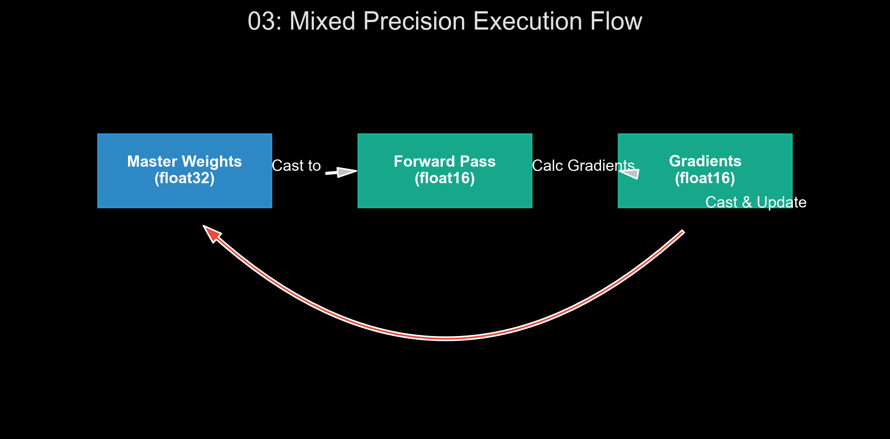

# 🏷️ Module 3: Using GPUs to Accelerate Computations
> **Ch. 19 — Hands-On ML with Scikit-Learn, Keras & TensorFlow (Aurélien Géron)**

---

## 📌 Table of Contents
1. [Start Here: The Big Picture](#big-picture)
2. [Hardware Mechanics: Why GPUs?](#concept-1)
3. [Deep Dive: Mixed Precision Training](#concept-2)
4. [XLA Compiler & Kernel Fusion](#concept-3)
5. [Common Beginner Mistakes](#mistakes)
6. [Interview Q&A](#interview)
7. [⚡ One-Page Flash Card](#revision)

---

## 🌍 Start Here: The Big Picture {#big-picture}

> **TL;DR:** Deep learning is fundamentally constrained by math—specifically, the millions of matrix multiplications required for a single forward/backward pass. Standard CPUs cannot keep up. To scale training, we rely on GPUs (massive parallelization), Mixed Precision (using `float16` to double throughput), and XLA compilation (fusing operations to reduce memory bottlenecks).

**The Real-World Analogy 🍕:**
A CPU is a Michelin-star Executive Chef: highly intelligent, capable of executing complex, branching recipes with extreme speed, but there's only one of them. A GPU is an army of 5,000 line cooks. Individually, they are slow and can only do basic math, but if you need to chop 100,000 carrots (a massive matrix multiplication), the army will finish in seconds.

---

## 🔍 1. Hardware Mechanics: Why GPUs? {#concept-1}

### Architecture Breakdown
*   **CPU (Central Processing Unit):** Has 4 to 64 cores. Optimized for low-latency, sequential logic, and branching (`if/else`).
*   **GPU (Graphics Processing Unit):** Has thousands of CUDA cores (NVIDIA). Optimized for high-throughput, highly parallel operations (like calculating the colors of millions of pixels simultaneously—or multiplying matrices).
*   **Tensor Cores:** Modern NVIDIA GPUs (Volta architecture and newer) contain specialized hardware called Tensor Cores. These cores are physically hardwired to perform $D = A \times B + C$ (a 4x4 matrix multiply-accumulate) in exactly one clock cycle, provided the inputs are in `float16`.

### cuDNN (CUDA Deep Neural Network library)
TensorFlow doesn't write assembly code for GPUs. It relies on NVIDIA's cuDNN, a highly optimized library that contains the fastest known algorithms for common operations (like Convolutions).

---

## 🔍 2. Deep Dive: Mixed Precision Training {#concept-2}

Standard models train using 32-bit floats (`float32`). Mixed precision training leverages 16-bit floats (`float16`) to slash memory requirements in half and activate the lightning-fast Tensor Cores.

### The Problem: Numerical Underflow
During backpropagation, gradients are often infinitesimally small. A `float16` can only represent numbers down to roughly $6 \times 10^{-5}$. If a gradient is smaller than this, `float16` rounds it down to `0.0`. This is called **Numerical Underflow**, and it halts the learning process.

### The Solution: Master Weights & Loss Scaling
1.  **Master Weights in FP32:** The "master" copy of the model's weights and the optimizer's momentum states are kept strictly in `float32`.
2.  **Cast for Forward Pass:** For the forward and backward passes (the heavy matrix math), a copy of the weights is cast to `float16`.
3.  **Loss Scaling:** Before calculating the gradients, the loss is artificially multiplied by a massive constant (e.g., $1024$). This scales up the gradients so they safely fit within the `float16` range, preventing underflow.
4.  **Update:** The gradients are calculated, scaled back down (divided by $1024$), cast to `float32`, and applied to the Master Weights.


> 📊 **Graph 03:** Mixed Precision Execution Flow. Illustrates the casting of weights to float16, the loss scaling during the backward pass, and the application of gradients to the float32 master weights.

```python
# Enabling Mixed Precision in TensorFlow Keras
import tensorflow as tf
from tensorflow import keras

# Set the global policy. This automatically handles loss scaling!
keras.mixed_precision.set_global_policy("mixed_float16")
# OUTPUT: INFO:tensorflow:Mixed precision compatibility check (mixed_float16): OK
```

---

## 🔍 3. XLA Compiler & Kernel Fusion {#concept-3}

XLA (Accelerated Linear Algebra) is a JIT (Just-In-Time) compiler for TensorFlow. 

### The Memory Bandwidth Bottleneck
By default, TF executes operations individually. If your graph has `x * y + z`, TF calls a CUDA kernel for `multiply`, writes the intermediate result to GPU RAM, then calls a CUDA kernel for `add`, and reads the result back. GPU memory is fast, but reading/writing intermediate results for simple element-wise operations wastes massive amounts of time (Memory Bandwidth bound).

### Kernel Fusion
XLA analyzes the computation graph and **fuses** these operations into a single, custom CUDA kernel. It computes `(x * y) + z` entirely within the GPU registers, skipping the expensive round-trip to GPU RAM entirely.

---

## ❌ Common Beginner Mistakes {#mistakes}

**1. "Starving the GPU (I/O Bottleneck)"** ❌
> You buy a $10,000 GPU, but training is still slow, and `nvidia-smi` shows 20% GPU utilization. 
> **Why?** Your CPU is downloading, decoding, and preprocessing JPEGs too slowly. The GPU is constantly idling, waiting for the next batch.
> **Fix:** Use the `tf.data` API's `.prefetch(tf.data.AUTOTUNE)` command. This tells the CPU to prepare batch $N+1$ in the background *while* the GPU is currently training on batch $N$.

---

## 🎤 Interview Q&A {#interview}

**Q1: Why does Mixed Precision training require the Batch Size to be a multiple of 8?**
> **A:** 
> Hardware optimization. NVIDIA's Tensor Cores are physically designed as 4x4 matrix multiplication units. To fully utilize the hardware pipelines and prevent idle clock cycles, all tensor dimensions (batch size, number of filters, dense layer units) should ideally be multiples of 8. If they aren't, the hardware must pad the tensors with zeros, wasting the theoretical speedup of the Tensor Cores.

---

## ⚡ One-Page Flash Card {#revision}

```
╔══════════════════════════════════════════════════════════════════╗
║               MODULE 3 — FLASH CARD                              ║
╠══════════════════════════════════════════════════════════════════╣
║                                                                  ║
║  MIXED PRECISION MECHANICS:                                      ║
║  - Forward/Backward Math: float16 (fast, uses Tensor Cores).     ║
║  - Master Weights: float32 (prevents numerical underflow).       ║
║  - Loss Scaling: Multiply loss by a constant before backprop to  ║
║    keep gradients out of the float16 underflow zone.             ║
║                                                                  ║
║  XLA COMPILER:                                                   ║
║  - Kernel Fusion: Combines multiple ops (e.g., multiply + add)   ║
║    into one GPU kernel, eliminating intermediate memory I/O.     ║
║                                                                  ║
║  PERFORMANCE FIX:                                                ║
║  - GPU Idling? Use dataset.prefetch(tf.data.AUTOTUNE)            ║
╚══════════════════════════════════════════════════════════════════╝
```

---

---

**🔗 Previous Module →** [02_Deploying_Models_to_Mobile_and_Embedded_Devices.md](02_Deploying_Models_to_Mobile_and_Embedded_Devices.md)  
**🔗 Next Module →** [04_Training_Models_Across_Multiple_Devices.md](04_Training_Models_Across_Multiple_Devices.md)
