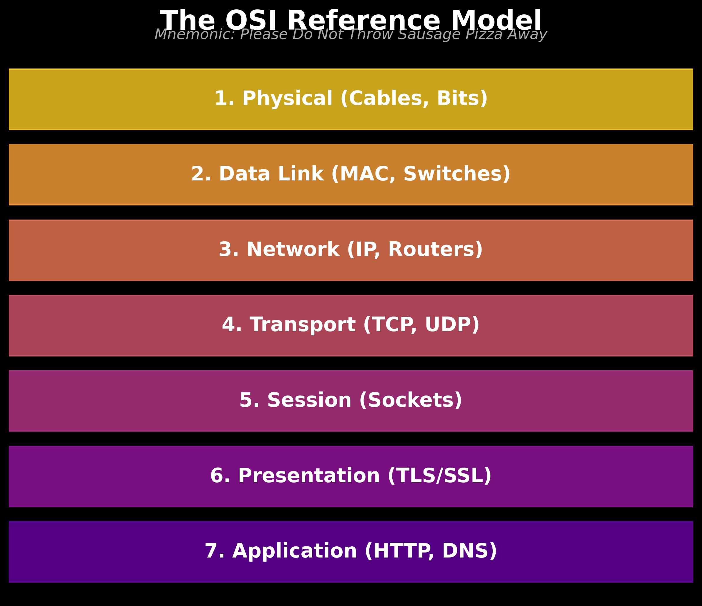
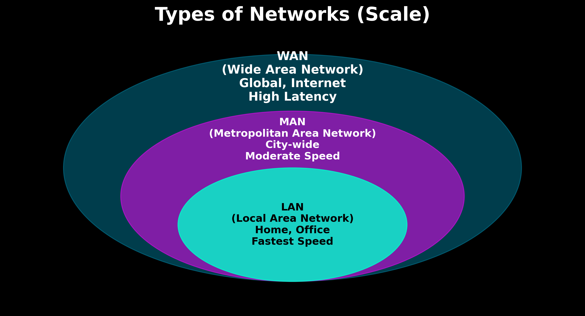
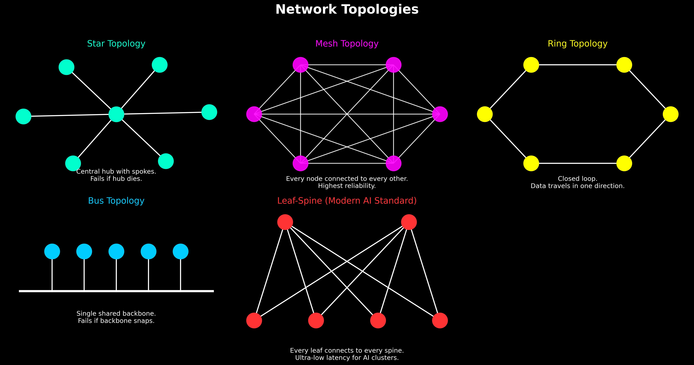
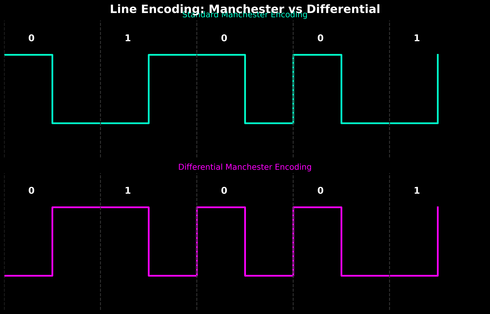
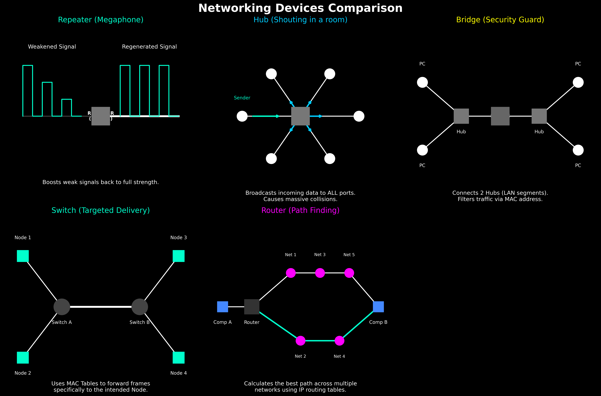

# 🌐 Computer Networks: Fundamentals & Interview Prep (2026 Edition)
> **Source**: Gate Smashers CN Playlist (Videos 1-15)
> **Focus**: Placement Aptitude, Software Engineering (SWE), and AI/ML Interviews

---

## 📚 1. Introduction & The OSI Model (Videos 1, 2)
*The OSI model is a 7-step theoretical guide to understand how an email gets from your screen, through a cable, and onto your friend's screen.*

**Mnemonic to remember the layers**: *Please Do Not Throw Sausage Pizza Away*

| Layer | Name | What it does (Explained Simply) | Protocols |
| :--- | :--- | :--- | :--- |
| **7** | **Application** | User interface. This is the layer your web browser uses to fetch websites. | HTTP, DNS |
| **6** | **Presentation**| Translates, compresses, and encrypts the data (like making sure a JPEG looks like a JPEG). | TLS/SSL |
| **5** | **Session** | Starts, pauses, and ends the "conversation" between two computers. | Sockets |
| **4** | **Transport** | Chops large data into pieces. Ensures data gets to the right application using **Port Numbers**. | TCP, UDP |
| **3** | **Network** | Figures out the best global path across the internet using **IP Addresses**. | IP |
| **2** | **Data Link** | Moves data to the *very next* physical device using **MAC Addresses**. | Ethernet |
| **1** | **Physical** | Converts your data into raw bits (0s and 1s) over cables or Wi-Fi. | USB, DSL |

---

## 🌍 2. Types of Networks (Video 3)
*Networks are categorized by how large of an area they cover.*

### 📊 Network Scale Comparison
| Network Type | Scope | Speed | Real-World Example |
| :--- | :--- | :--- | :--- |
| **PAN (Personal)** | Within 10 meters | Moderate | Connecting phone to Bluetooth earbuds. |
| **LAN (Local)** | Room or Building | Very Fast (Gbps) | Home Wi-Fi, Office building network. |
| **CAN (Campus)** | Multiple Buildings | Fast | A University Campus network. |
| **MAN (Metropolitan)**| Entire City | Moderate | A city's Cable TV network. |
| **WAN (Wide)** | Country or Global | Slower (Latency) | **The Internet**. |

---

## 🛠️ 3. TCP/IP Protocol Suite (Video 4)
*If OSI is the "theory", TCP/IP is the "practical reality".*

- The **TCP/IP Model** is what the internet actually runs on today.
- It compresses the OSI's 7 layers into **4 practical layers**:
  1. **Application** (Combines OSI's Application, Presentation, and Session layers)
  2. **Transport** (Same as OSI)
  3. **Internet** (Same as OSI's Network layer)
  4. **Network Access** (Combines OSI's Data Link and Physical layers)

---

## 🔗 4. Network Topologies (Videos 5, 6, 7)
*A "Topology" is simply the shape or physical layout of how devices are connected.*

### 📊 Topologies Comparison
| Topology | Analogy & Explanation | Pros & Cons |
| :--- | :--- | :--- |
| **⭐ Star** | **A bicycle wheel with spokes**. All computers connect to a central Hub/Switch. | **Pros**: Easy setup. **Cons**: If the central Hub dies, the whole network dies. |
| **🕸️ Mesh** | **A spiderweb**. Every computer connects directly to *every* other computer. | **Pros**: Bulletproof reliability. **Cons**: Extremely expensive and messy wiring. |
| **🚌 Bus** | **A single highway**. All computers share one long main cable. | **Pros**: Very cheap. **Cons**: If the main cable snaps, everything dies. |
| **⭕ Ring** | **A roundabout**. Computers connected in a circle, passing a "token". | **Pros**: No data collisions. **Cons**: One broken link breaks the loop. |

---

## 〰️ 5. Line Encoding (Video 8)
*How do we physically send a "1" or a "0" over a copper wire? We use voltage changes!*

| Encoding Type | How it reads a bit | Why it matters |
| :--- | :--- | :--- |
| **Standard Manchester** | Looks at the **direction** of voltage change. (0 = High to Low, 1 = Low to High) | Needs perfect clock synchronization. |
| **Differential Manchester** | Looks for a **change at the start** of a bit. (0 = Change happens, 1 = No change) | Much better at resisting electrical noise. |

---

## ⚡ 6. Types of Cables (Video 10)
*The physical pathways that carry data.*

| Cable Type | What is it? | Why use it? |
| :--- | :--- | :--- |
| **Twisted Pair** | Standard copper wires twisted together. | Cheap. Twisting cancels out electrical noise. Used in home Ethernet. |
| **Coaxial Cable** | Thick copper core with heavy plastic shielding. | Highly resistant to outside interference. Used in old Cable TV. |
| **Fiber Optic** | Uses pure light (lasers) inside glass tubes. | The absolute fastest speed possible. Used in modern AI datacenters. |

---

## 🖥️ 7. Networking Devices (Videos 9, 11-15)
*The hardware that moves your data around.*

### 📊 Device Intelligence Comparison
| Device | OSI Layer | Analogy | How it works |
| :--- | :--- | :--- | :--- |
| **Repeater** | Layer 1 | 📢 **A Megaphone** | Takes a weak electrical signal on a long cable, cleans it, and shouts it out at full strength. |
| **Hub** | Layer 1 | 🗣️ **Shouting in a room**| Receives data and blindly broadcasts it to *every* port. Causes massive traffic jams (collisions). |
| **Bridge** | Layer 2 | 🚪 **A Security Guard** | Connects 2 LANs. It learns MAC addresses and only lets data cross the bridge if necessary. |
| **Switch** | Layer 2 | ☎️ **Private Switchboard**| Highly intelligent. Uses a **MAC Table** to send data *only* to the intended computer. No collisions. |
| **Router** | Layer 3 | 🗺️ **GPS Navigation** | Connects different networks (like your home to the Internet) by calculating paths using **IP Addresses**. |

---

## 🎯 8. Top Interview Q&A & Aptitude Math

**Q1: What is the difference between TCP and UDP?**

| Protocol | Analogy | Reliability | Speed | Real-World Use Case |
| :--- | :--- | :--- | :--- | :--- |
| **TCP** | 📦 **Registered Package** | **High**. Requires a signature (acknowledgment) to prove data arrived. | Slower | Web browsing, Emails, File Downloads |
| **UDP** | ⚾ **Throwing a Baseball** | **Low**. "Fire and forget". Doesn't care if a packet drops. | Very Fast | Live video calls, Online gaming |

**Q2: What is the difference between a MAC address and an IP address?**

| Feature | MAC Address | IP Address |
| :--- | :--- | :--- |
| **Analogy** | 🪪 Your **Social Security Number** | 🏠 Your **Home Address** |
| **Nature** | Physical address burned into the hardware. | Logical address assigned by the network. |
| **Changeability** | Never changes. | Changes when you join a different Wi-Fi. |
| **Used by** | Switches (Layer 2) | Routers (Layer 3) |

### 🧮 Aptitude Math & Problem Solving (Topologies)
*Topologies are the most common source of math questions in early CN placement exams.*

**Formula Cheat Sheet (For `N` computers):**
| Topology | Total Cables Needed | Ports Needed *Per Computer* | Total Ports in Network |
| :--- | :--- | :--- | :--- |
| **Mesh** | `N * (N - 1) / 2` | `N - 1` | `N * (N - 1)` |
| **Star** | `N` | `1` | `N` (Hub needs `N` ports) |
| **Ring** | `N` | `2` | `2 * N` |

#### 📝 Practice Questions

**Q1: A company wants to connect 15 computers in a fully connected Mesh topology. How many physical cables are required?**
- **Solution**: The formula is `N * (N - 1) / 2`. 
- `15 * 14 / 2` = `210 / 2` = **105 cables**.

**Q2: In the same 15-computer Mesh network, how many ports are required on EACH individual computer?**
- **Solution**: Every computer must connect to every *other* computer.
- The formula is `N - 1`. 
- `15 - 1` = **14 ports** per computer.

**Q3: A startup has 50 computers connected in a Star topology using a central Hub. If they want to upgrade to a Mesh topology for better reliability, how many *additional* cables will they need to buy?**
- **Solution**:
  1. Cables in current Star: `N = 50`.
  2. Cables needed for Mesh: `50 * 49 / 2 = 1225`.
  3. Additional cables required: `1225 - 50` = **1175 extra cables**.

**Q4: If a Ring network has 30 computers, how many total ports exist in the entire network?**
- **Solution**: In a ring, each computer connects to its left and right neighbor (2 ports per computer).
- `30 * 2` = **60 total ports**.
