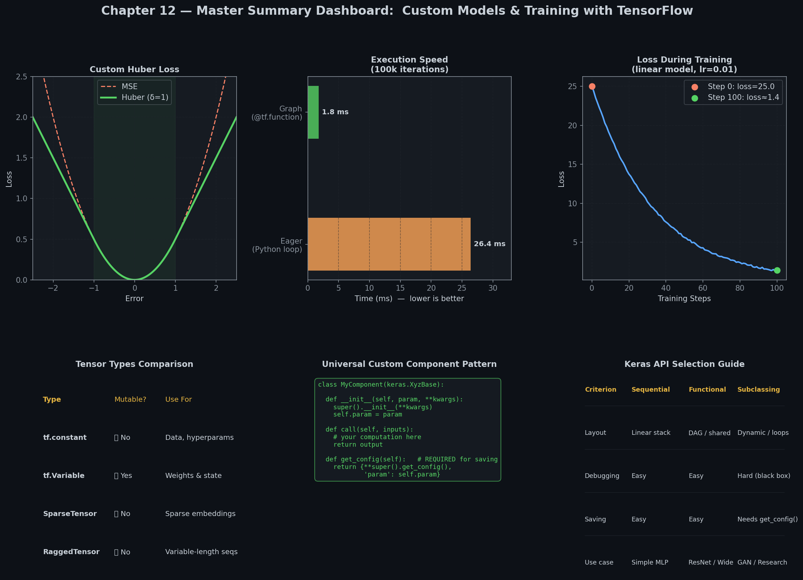

# 📚 Chapter 12: Custom Models and Training with TensorFlow
### Complete Study Notes — Professor Level

> **All 38 pages analyzed. All concepts covered. Zero shortcuts.**

---

## 🖼️ Visual Gallery (AI-Generated Diagrams)

> All visuals are in the [`Visuals/`](Visuals/) folder and are embedded in each module.

| # | Graph | Module | File |
|---|-------|--------|------|
| 01 | TensorFlow Python API & Execution Hierarchy | 1 | [01_tensorflow_api_structure.png](Visuals/01_tensorflow_api_structure.png) |
| 02 | Data Mutability: tf.Tensor vs. tf.Variable | 1 | [02_tensor_vs_variable.png](Visuals/02_tensor_vs_variable.png) |
| 03 | Huber Loss vs. Classic Losses (MSE & MAE) | 2 | [03_custom_loss_huber.png](Visuals/03_custom_loss_huber.png) |
| 04 | Metric Estimation: Stateless vs. Stateful | 2 | [04_stateful_vs_stateless_metric.png](Visuals/04_stateful_vs_stateless_metric.png) |
| 05 | Keras Custom Layer Execution Lifecycle | 3 | [05_custom_layer_structure.png](Visuals/05_custom_layer_structure.png) |
| 06 | Custom Model Subclass with ResidualBlock | 3 | [06_residual_block_custom_model.png](Visuals/06_residual_block_custom_model.png) |
| 07 | Autodiff Operations Recording on GradientTape | 4 | [07_autodiff_gradient_tape.png](Visuals/07_autodiff_gradient_tape.png) |
| 08 | Execution Logic: model.fit() vs. Custom Loop | 4 | [08_custom_training_loop_flow.png](Visuals/08_custom_training_loop_flow.png) |
| 09 | TF Compilation: Python AST to Static Graph | 5 | [09_autograph_tracing_pipeline.png](Visuals/09_autograph_tracing_pipeline.png) |
| 10 | ⭐ Master Chapter Summary Dashboard | All | [10_summary_dashboard.png](Visuals/10_summary_dashboard.png) |
| 11 | AutoGraph Code-to-Graph Operator Translation | 5 | [11_autograph_code_translation.png](Visuals/11_autograph_code_translation.png) |
| 12 | Gradient Flow Control via tf.stop_gradient() | 4 | [12_stop_gradient_adversarial.png](Visuals/12_stop_gradient_adversarial.png) |
| 13 | Execution Flow Callstack: Eager vs. Graph | 5 | [13_eager_vs_graph_callstack.png](Visuals/13_eager_vs_graph_callstack.png) |
| 14 | Autodiff & Weights Updates in Custom Loops | 4 | [14_custom_training_loop_backpropagation.png](Visuals/14_custom_training_loop_backpropagation.png) |

---

## 🗺️ Master Index

| Module | Topic | File | Pages Covered |
|--------|-------|------|---------------|
| 01 | Tensors, Operations, NumPy Interop, Variables, Specialty Tensors (Ragged/Sparse) | [01_TensorFlow_Quick_Tour_and_NumPy_Basics.md](Detailed_Notes/01_TensorFlow_Quick_Tour_and_NumPy_Basics.md) | pp. 405–413 |
| 02 | Custom Huber Loss, SavedModel Custom Configurations, Custom Component Layers, Stateful Metrics | [02_Custom_Losses_and_Components.md](Detailed_Notes/02_Custom_Losses_and_Components.md) | pp. 414–421 |
| 03 | Custom Dense Layers, Multi-Input/Output Layers, Model Subclassing, Internal Model Losses | [03_Custom_Layers_and_Models.md](Detailed_Notes/03_Custom_Layers_and_Models.md) | pp. 421–428 |
| 04 | tf.GradientTape, Persistent Tapes, Numerical Stability Gradients, Custom Loops from scratch | [04_Autodiff_and_Custom_Training_Loops.md](Detailed_Notes/04_Autodiff_and_Custom_Training_Loops.md) | pp. 429–435 |
| 05 | Eager vs. Graph Execution, @tf.function, AutoGraph AST translation, Symbolic Tracing rules | [05_TensorFlow_Functions_and_Graphs.md](Detailed_Notes/05_TensorFlow_Functions_and_Graphs.md) | pp. 435–440 |

---

## ⚡ One-Page Chapter Summary

### The History and Evolution of TensorFlow

```
2015: TensorFlow 1.x (Google)  ─────→ Declarative Static Graphs ("Define-then-Run").
                                      High performance but difficult to write and debug.
2019: TensorFlow 2.x (Google)  ─────→ Eager Execution by default ("Define-by-Run") using tf.keras.
                                      Combines Python simplicity with AutoGraph graph compilation.
```

### Core Architecture: Step Pipeline of a Custom Training Loop

```
                        MINI-BATCH DATA (X_batch, y_batch)
                                      │
                                      ▼
             ┌────────── with tf.GradientTape() as tape: ──────────┐
             │                                                     │
             │   Forward Pass:  y_pred = model(X_batch, train=True)│
             │   Batch Loss:    loss = loss_fn(y_batch, y_pred)    │
             │   Total Loss:    loss + sum(model.losses)           │
             │                                                     │
             └────────────────────────┬────────────────────────────┘
                                      │
                                      ▼
           Gradients: grads = tape.gradient(total_loss, trainable_vars)
                                      │
                                      ▼
           Optimize:  optimizer.apply_gradients(zip(grads, variables))
```

### Core Code Snippet (Custom Layer, Loss, Metric & Compiled Model)

```python
import tensorflow as tf
from tensorflow import keras

# 1. Custom Loss with Hyperparameters
class HuberLoss(keras.losses.Loss):
    def __init__(self, threshold=1.0, **kwargs):
        super().__init__(**kwargs)
        self.threshold = threshold
    def call(self, y_true, y_pred):
        error = y_true - y_pred
        is_small = tf.abs(error) < self.threshold
        return tf.where(is_small, tf.square(error)/2.0, self.threshold*(tf.abs(error) - self.threshold/2.0))
    def get_config(self):
        return {**super().get_config(), "threshold": self.threshold}

# 2. Custom Stateful Metric
class HuberMetric(keras.metrics.Metric):
    def __init__(self, threshold=1.0, **kwargs):
        super().__init__(**kwargs)
        self.threshold = threshold
        self.huber_sum = self.add_weight("huber_sum", initializer="zeros")
        self.huber_count = self.add_weight("huber_count", initializer="zeros")
    def update_state(self, y_true, y_pred, sample_weight=None):
        error = y_true - y_pred
        is_small = tf.abs(error) < self.threshold
        loss = tf.where(is_small, tf.square(error)/2.0, self.threshold*(tf.abs(error) - self.threshold/2.0))
        self.huber_sum.assign_add(tf.reduce_sum(loss))
        self.huber_count.assign_add(tf.cast(tf.size(y_true), tf.float32))
    def result(self):
        return self.huber_sum / self.huber_count

# 3. Custom Layer
class MyDense(keras.layers.Layer):
    def __init__(self, units, **kwargs):
        super().__init__(**kwargs)
        self.units = units
    def build(self, input_shape):
        self.w = self.add_weight("w", [input_shape[-1], self.units], initializer="glorot_uniform")
        self.b = self.add_weight("b", [self.units], initializer="zeros")
        super().build(input_shape)
    def call(self, inputs):
        return tf.matmul(inputs, self.w) + self.b

# 4. Custom Model compiled with standard API
model = keras.models.Sequential([
    MyDense(30, input_shape=[10]),
    keras.layers.Activation("relu"),
    MyDense(1)
])
model.compile(loss=HuberLoss(1.5), optimizer="adam", metrics=[HuberMetric(1.5)])
# OUTPUT: Compiled model with custom layer, loss, and metric, ready for training.
```

### Keras Model API Selection Guide



| Criterion | Sequential API | Functional API | Subclassing API |
|---|---|---|---|
| **Layout Topology** | Single-input, single-output linear stacks | Direct Acyclic Graphs (DAG), shared layers | Dynamic, arbitrary structures (loops/branches) |
| **Model Verification**| Immediate static checks | Immediate static checks | Checked only at execution runtime |
| **Debuggability** | Easy | Easy | Hard (behaves like a black box) |
| **Serialization** | Straightforward | Straightforward | Requires custom `get_config()` definitions |

---

## 🏆 Top 5 Things to Remember

1. **Strict Type Constraints:** TensorFlow does **not** perform automatic type casting (e.g. adding `float32` and `float64` tensors throws an error). Use `tf.cast()` explicitly to avoid execution overhead on GPUs/TPUs.
2. **Variable State Guard:** Never reassign variables using `v = v + 1`. This silently converts the variable into an immutable `tf.Tensor` constant, which stops weight tracking. Modify values in-place using `.assign_add()`.
3. **Delayed Weights Build:** Always declare learnable weights inside the layer's `build()` method rather than `__init__()`. This allows the layer to infer input dimensions dynamically.
4. **Tape Memory Control:** Call `del tape` when using persistent `tf.GradientTape` loops to free memory resources and prevent GPU Out-Of-Memory (OOM) errors.
5. **No State Mutations inside @tf.function:** Do not modify non-Tensor state (e.g., Python lists, global variables, standard print logs) inside a graph-compiled function. These operations only execute once during tracing and are ignored in subsequent runs.

---

## 🔗 Related Chapters

* **Chapter 11**: [Training Deep Neural Networks](../CH_11_Training_Deep_Neural_Networks/notes.md) - Deep dive into gradient optimization, regularization, transfer learning, and weight initializers.
* **Chapter 13**: Loading and Preprocessing Data with TensorFlow - Explores the high-performance `tf.data` input pipeline for streaming datasets.

---

*Notes created from 38 textbook pages covering pp. 405–442 of Hands-On ML with Scikit-Learn, Keras, and TensorFlow (2nd edition) by Aurélien Géron.*
