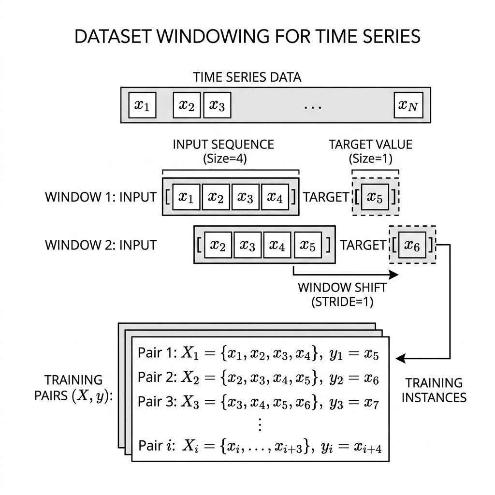
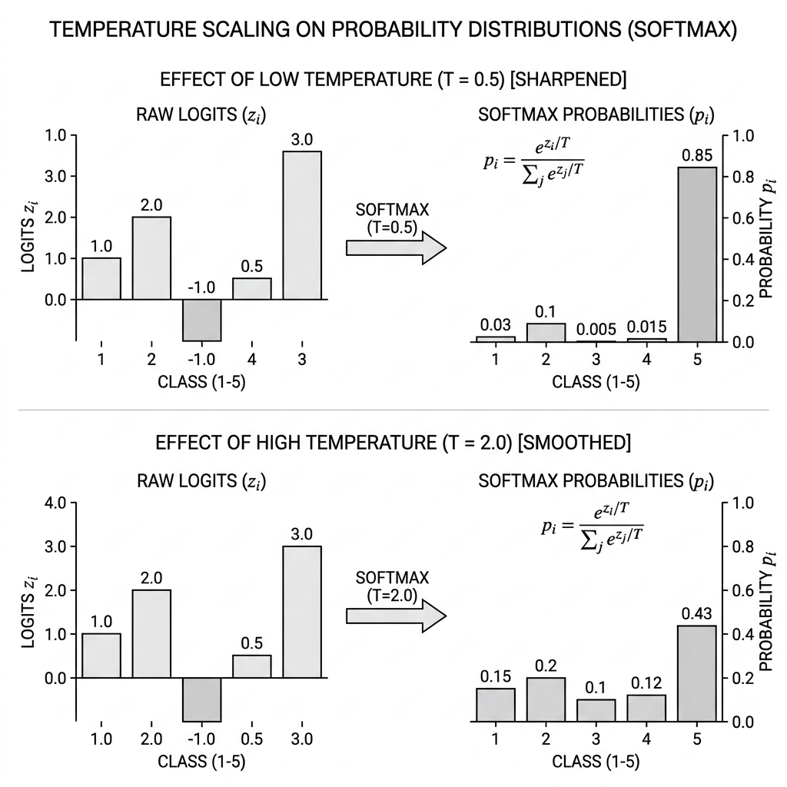
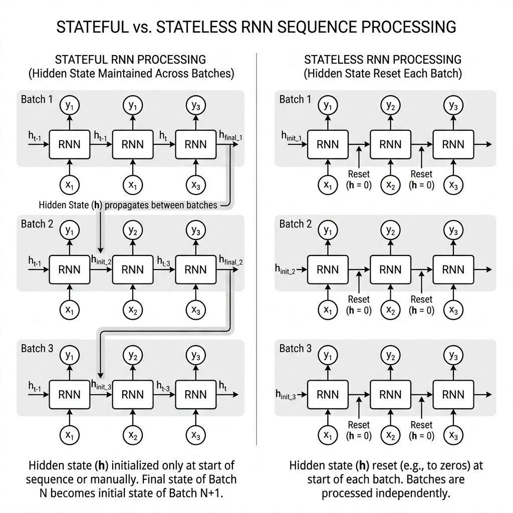

# 🔤 Module 1: Character RNNs and Text Generation
> **Ch. 16 — Hands-On ML with Scikit-Learn, Keras & TensorFlow (Aurélien Géron)**

---

## 📌 Table of Contents
1. [Start Here: The Big Picture](#big-picture)
2. [Step 0: Encode Text as Numbers](#encoding)
3. [Step 1: Create a Windowed Dataset](#windowing)
4. [Step 2: Build the Char-RNN Model](#model)
5. [Step 3: Generate Text with Temperature](#temperature)
6. [Step 4: Stateful vs Stateless RNNs](#stateful)
7. [Key Terms Dictionary](#terms)
8. [Common Beginner Mistakes](#mistakes)
9. [Interview Q&A (Top 4)](#interview)
10. [⚡ One-Page Flash Card](#revision)

---

## 🌍 Start Here: The Big Picture {#big-picture}

> **TL;DR:** Train a model to predict "given this sequence of characters, what comes next?" Then feed its output back as input to generate text forever.

We want to teach a neural network to write like Shakespeare — character by character.

**Intuition with numbers:**
Suppose Shakespeare's full text has **1 million characters**, and our vocabulary is **39 unique characters** (a–z, spaces, punctuation). We slice the text into thousands of overlapping windows, each 100 chars long:

```
Window 1: "To be or not to be, t"  →  Target: "o be or not to be, th"
Window 2: "o be or not to be, th"  →  Target: " be or not to be, tha"
...
```

The model trains to predict the next character at **every single position**. After 20 epochs, it internalizes the statistical patterns of Shakespearean English.


> 📊 **Graph 01:** At each time step $t$, the RNN cell receives character $X_t$ (encoded as an ID) and the previous hidden state $h_{t-1}$. It outputs a probability distribution over all 39 possible next characters $y_t$.

---

## 📝 Step 0: Encode Text as Numbers {#encoding}

> **TL;DR:** Neural networks cannot process raw text. We map every unique character to an integer ID to convert text into numerical arrays.

**Concrete Example:**

| Character | Integer ID |
|-----------|-----------|
| `a` | 0 |
| `b` | 1 |
| ... | ... |
| `z` | 25 |
| ` ` (space) | 26 |
| `,` | 27 |
| `.` | 28 |

The full text of *Romeo and Juliet* (~145,000 characters) becomes a 1D array of integers:

```python
import tensorflow as tf

# Full text of Shakespeare
shakespeare_url = "https://homl.info/shakespeare"
filepath = tf.keras.utils.get_file("shakespeare.txt", shakespeare_url)
with open(filepath) as f:
    shakespeare_text = f.read()

# All unique characters
tokenizer = tf.keras.preprocessing.text.Tokenizer(char_level=True)
tokenizer.fit_on_texts([shakespeare_text])

# Encode full text
encoded = tf.cast(
    tokenizer.texts_to_sequences([shakespeare_text])[0],
    tf.int32
)
# encoded is now a 1D int tensor
```

**Key insight:** Each unique character now lives in a 1D space. The RNN will later learn to embed these into dense vectors.

---

## 🗃️ Step 1: Create a Windowed Dataset {#windowing}

> **TL;DR:** We cannot feed the entire sequence to a network at once. Instead, we create overlapping windows where the target is the input sequence shifted by one character.


> 📊 **Graph 02:** Windowing splits the long sequence into overlapping sub-sequences of length `n_steps+1`. Each window is split: first `n_steps` chars are the input X; last `n_steps` chars are the target y (shifted by 1 position).

**Numerical Walk-Through (small example with n_steps=5):**

```
Full text: "To be or not to be"
Indices:    4  2 26  5 ... 

Window 1 (length=6): [4, 2, 26, 5, 3, 26]
  Input  X: [4, 2, 26, 5, 3]   → "To be"
  Target y: [2, 26, 5, 3, 26]  → "o be " (shifted by 1!)

Window 2 (length=6): [2, 26, 5, 3, 26, 2]
  Input  X: [2, 26, 5, 3, 26]  → "o be "
  Target y: [26, 5, 3, 26, 2]  → " be o"
```

Notice: **y is always X shifted right by 1 position.** The loss is computed at every time step!

```python
n_steps = 100
window_length = n_steps + 1   # +1 because y is X shifted by 1

# Step 1: Slice the big 1D tensor into overlapping windows
dataset = tf.data.Dataset.from_tensor_slices(encoded)
dataset = dataset.window(window_length, shift=1, drop_remainder=True)

# Step 2: Convert nested datasets to flat tensors
dataset = dataset.flat_map(lambda window: window.batch(window_length))

# Step 3: SHUFFLE before splitting into X, y
dataset = dataset.shuffle(10000).batch(32)

# Step 4: Split into (X, y) pairs
dataset = dataset.map(lambda windows: (windows[:, :-1], windows[:, 1:]))

# Step 5: One-hot encode the inputs
dataset = dataset.map(
    lambda X_batch, y_batch: (tf.one_hot(X_batch, depth=vocab_size), y_batch)
)

dataset = dataset.prefetch(1)
```

---

## 🏗️ Step 2: Build the Char-RNN Model {#model}

> **TL;DR:** We use an Embedding layer to convert characters to dense vectors, stack GRU layers to process the sequence, and use a TimeDistributed Dense layer to predict the next character at every time step.

**Architecture Overview:**

```
Input Shape: [batch_size=32, time_steps=100]
       │
Embedding(39, 16)  → [32, 100, 16]   ← Each of 39 chars becomes 16D vector
       │
GRU(128, return_sequences=True) → [32, 100, 128]  ← Hidden state at every step
       │
GRU(128, return_sequences=True) → [32, 100, 128]  ← Stack deeper for complexity
       │
TimeDistributed(Dense(39, softmax)) → [32, 100, 39]  ← 39 class probs at each step
```

**Why `TimeDistributed(Dense)`?**
`Dense(39)` applied normally would only work on the last dimension. `TimeDistributed` applies the SAME dense layer independently at EVERY time step. This means we compute loss at all 100 positions simultaneously — 100x more gradient signal per batch!

```python
from tensorflow import keras

vocab_size = 39
embed_size = 16

model = keras.models.Sequential([
    keras.layers.Lambda(lambda x: tf.one_hot(x, depth=vocab_size)),  
    keras.layers.GRU(128, return_sequences=True, dropout=0.2),
    keras.layers.GRU(128, return_sequences=True),
    keras.layers.TimeDistributed(
        keras.layers.Dense(vocab_size, activation="softmax")
    )
])

model.compile(
    loss="sparse_categorical_crossentropy",
    optimizer=keras.optimizers.Adam(lr=0.001)
)

history = model.fit(dataset, epochs=20)
```

---

## 🎲 Step 3: Generate Text with Temperature {#temperature}

> **TL;DR:** After training, we generate text by repeatedly predicting the next character. We use Temperature scaling to adjust the model's confidence, balancing coherence and creativity.

**The Problem with Greedy Decoding:**
```python
# WRONG approach (greedy):
next_char = tf.argmax(predictions, axis=-1)
# Always picks the SINGLE most likely char.
# Result: "to be to be to be to be to be to be" (stuck in loops!)
```

**Solution: Temperature Scaling + Random Sampling**


> 📊 **Graph 03:** Effect of temperature on the probability distribution for next character. Low $\tau$ makes the model "confident" (one dominant peak). High $\tau$ flattens all probabilities, increasing creativity at the cost of coherence.

**With Temperature $\tau = 1.0$ (standard):**
$$\hat{p}_i = \frac{e^{z_i / 1.0}}{\sum_j e^{z_j / 1.0}}$$
```
After softmax: P('e') ≈ 0.75, P(' ') ≈ 0.12, P('o') ≈ 0.08 ...
→ Model almost always picks 'e'. Gets repetitive.
```

**With Temperature $\tau = 0.5$ (sharper/more confident):**
$$\hat{p}_i = \frac{e^{z_i / 0.5}}{\sum_j e^{z_j / 0.5}}$$
```
After rescaling: P('e') ≈ 0.98, all others ≈ 0.02
→ Almost always 'e'. Very predictable.
```

**With Temperature $\tau = 2.0$ (flatter/more creative):**
$$\hat{p}_i = \frac{e^{z_i / 2.0}}{\sum_j e^{z_j / 2.0}}$$
```
After rescaling: P('e') ≈ 0.40, P(' ') ≈ 0.20, P('o') ≈ 0.15 ...
→ Much more varied. Could output any of the top candidates.
```

---

## 💾 Step 4: Stateful vs Stateless RNNs {#stateful}

> **TL;DR:** Stateless RNNs reset their hidden state to zero for every new batch. Stateful RNNs preserve the hidden state across consecutive batches, allowing them to learn longer patterns, but require fixed batch sizes and no shuffling.

**The core difference** is whether the RNN "remembers" across batches:


> 📊 **Graph 04:** Stateless RNN resets to $h_0 = \mathbf{0}$ at every batch. Stateful RNN passes the final state $h_{end}$ of batch $i$ as the initial state of batch $i+1$. 

**Stateless (Default):**
```
Batch 1: Text[0:100]   →  h_0 = zeros  →  Train  →  discard h_100
Batch 2: Text[100:200] →  h_0 = zeros  →  Train  →  discard h_200
```

**Stateful:**
```
Batch 1: Text[0:100]   →  h_0 = zeros  →  Train  →  SAVE h_100
Batch 2: Text[100:200] →  h_0 = h_100  →  Train  →  SAVE h_200
```

**The Critical Constraint:** Because hidden states map 1-to-1 between batches, **you cannot shuffle**. If batch 2 is at a random position, the saved hidden state from batch 1 is meaningless noise.

---

## 📖 Key Terms Dictionary {#terms}

| Term | Simple Definition |
|------|-------------------|
| **Tokenization** | Converting raw text into a sequence of integer IDs (character-level or subword-level). |
| **TimeDistributed** | A layer wrapper in Keras that applies the same dense layer independently to every time step in a sequence. |
| **Temperature ($\\tau$)** | A hyperparameter used to scale logits before softmax during text generation, controlling the randomness/creativity of the predictions. |
| **Stateful RNN** | An RNN configuration where the hidden state is preserved across consecutive batches, requiring strict chronological data feeding and no shuffling. |

---

## ❌ Common Beginner Mistakes {#mistakes}

**1. Shuffling with a Stateful RNN** ❌
> **Why it's bad:** Shuffling breaks sequential alignment. The final state of one batch will be passed to a random subsequent batch, feeding the model meaningless noise.
> **Fix:** Never shuffle a stateful dataset. Accept that training won't generalize as well without shuffling.

**2. Using greedy argmax for generation** ❌
> **Why it's bad:** Always picking the single most likely character (`tf.argmax`) results in boring, repetitive text that gets stuck in loops (e.g., "to be to be to be").
> **Fix:** Use temperature sampling (`tf.random.categorical`) to allow for creativity and variety.

**3. Not using `return_sequences=True` in stacked RNNs** ❌
> **Why it's bad:** An intermediate RNN layer will only output its final state (`[batch, units]`) instead of the full sequence (`[batch, time, units]`). The next RNN layer will crash because it expects a sequence.
> **Fix:** Set `return_sequences=True` on every intermediate RNN layer.

---

## 🎤 Interview Q&A (Top 4) {#interview}

**Q1: What is the purpose of Temperature in text generation?**
> **A:** Temperature $\tau$ rescales the logits before softmax: $\hat{p}_i = e^{z_i/\tau} / \sum e^{z_j/\tau}$. 
> - $\tau \to 0$: Deterministic (always pick argmax). Repetitive but coherent.
> - $\tau = 1$: Standard softmax. Balanced creativity/coherence.
> - $\tau > 1$: Flatter distribution. More creative but more spelling errors.
> It prevents the model getting stuck in repetitive loops while still allowing control over creativity.

**Q2: Explain the `flat_map()` step in the windowed dataset creation.**
> **A:** `dataset.window(n, shift=1)` creates a "dataset of nested datasets" — each element is itself a small dataset of n elements. You cannot batch nested datasets directly. `flat_map(lambda w: w.batch(n))` converts each nested dataset into a flat tensor of shape `[n]`, which can then be batched normally. Think of it as "flattening one level of nesting."

**Q3: How does a Stateful RNN differ from Stateless during training?**
> **A:** Stateless: hidden state is reset to zero vectors at the beginning of every batch. Great for parallel computation, requires shuffling for generalization. Stateful: the hidden state from the END of batch $i$ becomes the INITIAL state of batch $i+1$. This allows learning temporal patterns longer than the window size. The downside: batches must be fed strictly in sequential order (no shuffling), and the batch size must be fixed.

**Q4: Why don't modern LLMs use character tokenization?**
> **A:** Character sequences are much longer, making training slower and reducing efficiency. Subword tokenization provides a better balance between vocabulary size and sequence length.

---

## ⚡ One-Page Flash Card {#revision}

```
╔═══════════════════════════════════════════════════════════════════════╗
║          MODULE 1 CHEAT SHEET: CHAR-RNNs & TEXT GENERATION            ║
╠═══════════════════════════════════════════════════════════════════════╣
║                                                                         ║
║  1. DATA PREPARATION:                                                   ║
║     Text → Integer IDs via tokenizer.texts_to_sequences()              ║
║     Window(n+1, shift=1) → flat_map(batch(n+1)) → shuffle → batch     ║
║     Split: X = window[:-1], y = window[1:] (shifted by 1!)            ║
║                                                                         ║
║  2. ARCHITECTURE:                                                       ║
║     Embedding(vocab, dim) → GRU(128, retseq=True) → GRU(128, retseq)  ║
║     → TimeDistributed(Dense(vocab, softmax))                            ║
║     Loss computed at EVERY time step (dense supervision)               ║
║                                                                         ║
║  3. TEMPERATURE SAMPLING:                                               ║
║     p_i = exp(logit_i / T) / Σ exp(logit_j / T)                        ║
║     T < 1.0 → Sharp (confident) → Repetitive                           ║
║     T = 1.0 → Standard softmax                                          ║
║     T > 1.0 → Flat (uncertain) → Creative but noisy                    ║
║     Use: tf.random.categorical(log_probs / T, num_samples=1)           ║
║                                                                         ║
║  4. STATEFUL RNN RULES:                                                 ║
║     stateful=True → batch_input_shape=[N, None, vocab] REQUIRED        ║
║     ❌ NEVER shuffle a stateful dataset                                 ║
║     ✅ ALWAYS reset_states() at start of each epoch via Callback       ║
╚═══════════════════════════════════════════════════════════════════════╝
```

---

---

**🔗 Previous Module →** [Back to Chapter Index](../notes.md)  
**🔗 Next Module →** [02_Sentiment_Analysis_and_Word_Embeddings.md](02_Sentiment_Analysis_and_Word_Embeddings.md)
